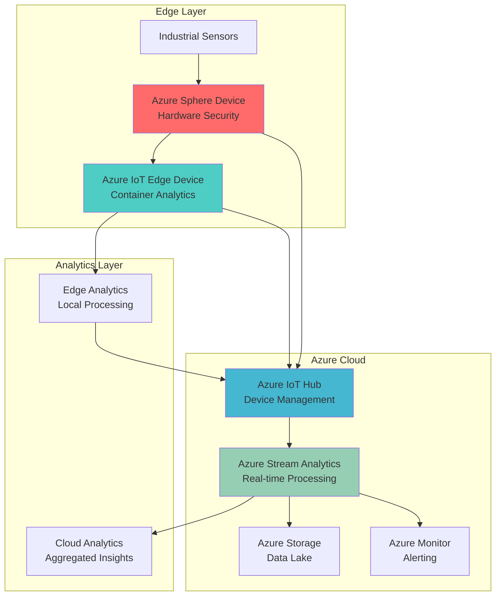

# Secure IoT Edge Analytics with Azure Sphere and IoT Edge

## Problem

Manufacturing organizations struggle to implement real-time analytics on industrial IoT devices while maintaining enterprise-grade security standards. Traditional IoT deployments often sacrifice security for performance, lack hardware-level protection, and require extensive cloud connectivity for basic analytics operations. This creates vulnerabilities in critical infrastructure and increases latency for time-sensitive decision-making processes.

## Solution

Azure Sphere and Azure IoT Edge provide a comprehensive edge-to-cloud IoT analytics platform that combines AI-powered edge inference with hardware-level security. This solution processes sensor data locally using Azure IoT Edge's containerized analytics capabilities while leveraging Azure Sphere's secure hardware platform for device protection, then streams aggregated insights to Azure IoT Hub and Stream Analytics for enterprise-wide monitoring and automated response workflows.

## Architecture Diagram



## Prerequisites

1. Azure subscription with IoT Hub and Stream Analytics permissions
2. Azure Sphere development kit and compatible IoT Edge device hardware
3. Azure CLI v2.50.0 or later installed and configured
4. Visual Studio Code with Azure IoT Tools extension
5. Basic understanding of IoT protocols and edge computing concepts
6. Estimated cost: $150-200 for development resources (excluding hardware)

> **Note**: Azure Sphere provides over 10 years of Microsoft security services included with each device. Review the [Azure Sphere security model](https://learn.microsoft.com/en-us/azure-sphere/concepts/security-model) for comprehensive hardware-level protection details.

## Preparation

```bash
# Set environment variables for Azure resources
export RESOURCE_GROUP="rg-iot-edge-analytics-${RANDOM_SUFFIX}"
export LOCATION="eastus"
export SUBSCRIPTION_ID=$(az account show --query id --output tsv)
export IOT_HUB_NAME="iot-hub-${RANDOM_SUFFIX}"
export STREAM_JOB_NAME="stream-analytics-${RANDOM_SUFFIX}"
export STORAGE_ACCOUNT="stiot${RANDOM_SUFFIX}"
export EDGE_DEVICE_ID="iot-edge-device-01"
export SPHERE_DEVICE_ID="sphere-device-01"

# Generate unique suffix for resource names
RANDOM_SUFFIX=$(openssl rand -hex 3)

# Create resource group
az group create \
    --name ${RESOURCE_GROUP} \
    --location ${LOCATION} \
    --tags purpose=iot-edge-analytics environment=production

echo "✅ Resource group created: ${RESOURCE_GROUP}"

# Install Azure IoT extension
az extension add --name azure-iot

# Create storage account for data lake
az storage account create \
    --name ${STORAGE_ACCOUNT} \
    --resource-group ${RESOURCE_GROUP} \
    --location ${LOCATION} \
    --sku Standard_LRS \
    --kind StorageV2 \
    --hierarchical-namespace true

echo "✅ Storage account created with Data Lake capabilities"
```

## Steps

1. **Create Azure IoT Hub for Device Management**:

   Azure IoT Hub serves as the central message hub for bi-directional communication between IoT applications and devices. This managed service provides secure device-to-cloud and cloud-to-device messaging, device authentication, and monitoring capabilities essential for enterprise IoT deployments. The IoT Hub acts as the secure gateway between your edge devices and cloud analytics services.

   ```bash
   # Create IoT Hub with Standard tier for device management
   az iot hub create \
       --name ${IOT_HUB_NAME} \
       --resource-group ${RESOURCE_GROUP} \
       --location ${LOCATION} \
       --sku S1 \
       --partition-count 4 \
       --retention-days 7

   # Get IoT Hub connection string
   export IOT_HUB_CONNECTION_STRING=$(az iot hub connection-string show \
       --hub-name ${IOT_HUB_NAME} \
       --resource-group ${RESOURCE_GROUP} \
       --query connectionString --output tsv)

   echo "✅ IoT Hub created with connection string configured"
   ```

   The IoT Hub now provides secure device connectivity with automatic scaling and built-in security features. This foundation enables secure communication between Azure Sphere devices, Azure IoT Edge modules, and cloud analytics services while maintaining enterprise-grade security standards.

2. **Configure Azure Sphere Device Security**:

   Azure Sphere provides hardware-root-of-trust security with automatic OS updates and certificate-based device authentication. This step establishes the secure foundation for your IoT deployment by configuring the Azure Sphere device with proper security policies and cloud connectivity. The Sphere device will act as a secure gateway for sensor data collection.

   ```bash
   # Create Azure Sphere device identity in IoT Hub
   az iot hub device-identity create \
       --hub-name ${IOT_HUB_NAME} \
       --device-id ${SPHERE_DEVICE_ID} \
       --auth-method x509_thumbprint

   # Generate device certificate for secure authentication
   az iot hub device-identity export \
       --hub-name ${IOT_HUB_NAME} \
       --device-id ${SPHERE_DEVICE_ID} \
       --output json > sphere-device-cert.json

   # Configure device twin for Azure Sphere
   az iot hub device-twin update \
       --hub-name ${IOT_HUB_NAME} \
       --device-id ${SPHERE_DEVICE_ID} \
       --set properties.desired.telemetryConfig.sendFrequency=30s

   echo "✅ Azure Sphere device configured with X.509 certificate authentication"
   ```

   The Azure Sphere device now has secure authentication configured with automatic certificate management and device twin capabilities. This provides hardware-level security for your IoT solution while enabling remote device management and configuration updates.

3. **Deploy Azure IoT Edge for Container-based Analytics**:

   Azure IoT Edge enables containerized AI inference at the edge, reducing latency and bandwidth requirements for real-time analytics. This step configures the IoT Edge device with runtime modules for processing sensor data locally before sending aggregated insights to the cloud. Edge processing is crucial for time-sensitive industrial applications requiring immediate response to anomalies.

   ```bash
   # Create Azure IoT Edge device identity
   az iot hub device-identity create \
       --hub-name ${IOT_HUB_NAME} \
       --device-id ${EDGE_DEVICE_ID} \
       --auth-method shared_private_key \
       --edge-enabled

   # Get device connection string
   export DEVICE_CONNECTION_STRING=$(az iot hub device-identity connection-string show \
       --hub-name ${IOT_HUB_NAME} \
       --device-id ${EDGE_DEVICE_ID} \
       --query connectionString --output tsv)

   # Configure edge modules for IoT Edge with latest runtime
   az iot edge set-modules \
       --hub-name ${IOT_HUB_NAME} \
       --device-id ${EDGE_DEVICE_ID} \
       --content '{
         "modulesContent": {
           "$edgeAgent": {
             "properties.desired": {
               "schemaVersion": "1.1",
               "runtime": {
                 "type": "docker",
                 "settings": {
                   "minDockerVersion": "v1.25"
                 }
               },
               "systemModules": {
                 "edgeAgent": {
                   "type": "docker",
                   "settings": {
                     "image": "mcr.microsoft.com/azureiotedge-agent:1.5",
                     "createOptions": "{}"
                   }
                 },
                 "edgeHub": {
                   "type": "docker",
                   "status": "running",
                   "restartPolicy": "always",
                   "settings": {
                     "image": "mcr.microsoft.com/azureiotedge-hub:1.5",
                     "createOptions": "{\"HostConfig\":{\"PortBindings\":{\"5671/tcp\":[{\"HostPort\":\"5671\"}],\"8883/tcp\":[{\"HostPort\":\"8883\"}],\"443/tcp\":[{\"HostPort\":\"443\"}]}}}"
                   }
                 }
               }
             }
           }
         }
       }'

   echo "✅ Azure IoT Edge configured with latest runtime for containerized analytics"
   ```

   The Azure IoT Edge device is now configured with IoT Edge runtime 1.5 LTS and ready for AI model deployment. This edge computing capability enables real-time processing of sensor data with minimal latency while maintaining secure connectivity to the cloud infrastructure.

4. **Create Stream Analytics Job for Real-time Processing**:

   Azure Stream Analytics provides real-time analytics and complex event processing for streaming data from IoT devices. This managed service enables you to analyze telemetry data, detect anomalies, and trigger automated responses based on business rules. The Stream Analytics job will process data from both Azure Sphere and Azure IoT Edge devices.

   ```bash
   # Create Stream Analytics job
   az stream-analytics job create \
       --resource-group ${RESOURCE_GROUP} \
       --job-name ${STREAM_JOB_NAME} \
       --location ${LOCATION} \
       --output-error-policy "Stop" \
       --out-of-order-policy "Adjust" \
       --output-start-mode "JobStartTime" \
       --compatibility-level "1.2" \
       --data-locale "en-US" \
       --events-late-arrival-max-delay 5 \
       --events-out-of-order-max-delay 0

   # Configure IoT Hub input for Stream Analytics
   az stream-analytics input create \
       --resource-group ${RESOURCE_GROUP} \
       --job-name ${STREAM_JOB_NAME} \
       --name "IoTHubInput" \
       --type "Stream" \
       --datasource '{
         "type": "Microsoft.Devices/IotHubs",
         "properties": {
           "iotHubNamespace": "'${IOT_HUB_NAME}'",
           "sharedAccessPolicyName": "iothubowner",
           "sharedAccessPolicyKey": "'$(az iot hub policy show --hub-name ${IOT_HUB_NAME} --name iothubowner --query primaryKey --output tsv)'",
           "endpoint": "messages/events",
           "consumerGroupName": "$Default"
         }
       }' \
       --serialization '{
         "type": "Json",
         "properties": {
           "encoding": "UTF8"
         }
       }'

   echo "✅ Stream Analytics job created with IoT Hub input"
   ```

   The Stream Analytics job is configured to receive real-time data from your IoT Hub and process it using SQL-like queries. This enables complex event processing, pattern detection, and automated alerting based on your business logic requirements.

5. **Configure Storage Output for Data Lake**:

   Azure Storage with Data Lake capabilities provides scalable, secure storage for IoT telemetry data and analytics results. This step configures the Stream Analytics job to output processed data to a data lake for long-term storage, batch analytics, and machine learning model training. The hierarchical namespace enables efficient big data analytics workflows.

   ```bash
   # Get storage account key
   export STORAGE_KEY=$(az storage account keys list \
       --resource-group ${RESOURCE_GROUP} \
       --account-name ${STORAGE_ACCOUNT} \
       --query '[0].value' --output tsv)

   # Create container for processed data
   az storage container create \
       --name "processed-telemetry" \
       --account-name ${STORAGE_ACCOUNT} \
       --account-key ${STORAGE_KEY}

   # Configure storage output for Stream Analytics
   az stream-analytics output create \
       --resource-group ${RESOURCE_GROUP} \
       --job-name ${STREAM_JOB_NAME} \
       --name "StorageOutput" \
       --datasource '{
         "type": "Microsoft.Storage/Blob",
         "properties": {
           "storageAccounts": [{
             "accountName": "'${STORAGE_ACCOUNT}'",
             "accountKey": "'${STORAGE_KEY}'"
           }],
           "container": "processed-telemetry",
           "pathPattern": "year={datetime:yyyy}/month={datetime:MM}/day={datetime:dd}/hour={datetime:HH}",
           "dateFormat": "yyyy/MM/dd",
           "timeFormat": "HH"
         }
       }' \
       --serialization '{
         "type": "Json",
         "properties": {
           "encoding": "UTF8",
           "format": "LineSeparated"
         }
       }'

   echo "✅ Storage output configured for data lake integration"
   ```

   The data lake storage is now configured to receive processed telemetry data with time-based partitioning for efficient querying and analytics. This enables historical analysis, trend detection, and machine learning model development using your IoT data.

6. **Deploy Stream Analytics Query for Edge Analytics**:

   Stream Analytics queries enable real-time data transformation, aggregation, and anomaly detection using SQL-like syntax. This step implements business logic to process sensor data from both Azure Sphere and Azure IoT Edge devices, detecting anomalies and calculating key performance indicators. The query processes data in real-time and triggers alerts when thresholds are exceeded.

   ```bash
   # Create Stream Analytics transformation query
   az stream-analytics transformation create \
       --resource-group ${RESOURCE_GROUP} \
       --job-name ${STREAM_JOB_NAME} \
       --name "ProcessTelemetry" \
       --saql "
       WITH AnomalyDetection AS (
         SELECT
           deviceId,
           timestamp,
           temperature,
           humidity,
           vibration,
           AnomalyDetection_SpikeAndDip(temperature, 95, 120, 'spikesanddips')
             OVER(LIMIT DURATION(minute, 2)) AS temperatureAnomaly,
           AnomalyDetection_SpikeAndDip(vibration, 95, 120, 'spikesanddips')
             OVER(LIMIT DURATION(minute, 2)) AS vibrationAnomaly
         FROM IoTHubInput
         WHERE deviceId IN ('${EDGE_DEVICE_ID}', '${SPHERE_DEVICE_ID}')
       ),
       AggregatedData AS (
         SELECT
           deviceId,
           System.Timestamp AS windowEnd,
           AVG(temperature) AS avgTemperature,
           MAX(temperature) AS maxTemperature,
           AVG(humidity) AS avgHumidity,
           AVG(vibration) AS avgVibration,
           COUNT(*) AS messageCount
         FROM IoTHubInput
         WHERE deviceId IN ('${EDGE_DEVICE_ID}', '${SPHERE_DEVICE_ID}')
         GROUP BY deviceId, TumblingWindow(minute, 5)
       )
       SELECT
         ad.deviceId,
         ad.timestamp,
         ad.temperature,
         ad.humidity,
         ad.vibration,
         ad.temperatureAnomaly,
         ad.vibrationAnomaly,
         ag.avgTemperature,
         ag.maxTemperature,
         ag.avgHumidity,
         ag.avgVibration,
         ag.messageCount
       INTO StorageOutput
       FROM AnomalyDetection ad
       JOIN AggregatedData ag ON ad.deviceId = ag.deviceId
       WHERE ad.temperatureAnomaly.IsAnomaly = 1 OR ad.vibrationAnomaly.IsAnomaly = 1
       "

   echo "✅ Stream Analytics query deployed for anomaly detection"
   ```

   The Stream Analytics query now processes telemetry data in real-time, performing anomaly detection and aggregation. This enables immediate identification of equipment issues and automated response while maintaining historical data for trend analysis and predictive maintenance.

7. **Start Stream Analytics Job for Real-time Processing**:

   Starting the Stream Analytics job activates real-time processing of IoT telemetry data with automatic scaling based on input volume. This step initiates the analytics pipeline that will continuously monitor sensor data, detect anomalies, and store processed results in the data lake. The job runs continuously and scales automatically to handle varying data loads.

   ```bash
   # Start Stream Analytics job
   az stream-analytics job start \
       --resource-group ${RESOURCE_GROUP} \
       --name ${STREAM_JOB_NAME} \
       --output-start-mode "JobStartTime"

   # Monitor job status
   az stream-analytics job show \
       --resource-group ${RESOURCE_GROUP} \
       --name ${STREAM_JOB_NAME} \
       --query '{name:name, state:jobState, createdDate:createdDate}' \
       --output table

   echo "✅ Stream Analytics job started and processing telemetry data"
   ```

   The Stream Analytics job is now actively processing IoT data in real-time, providing continuous monitoring and automated anomaly detection. This enables immediate response to equipment issues while building a comprehensive data lake for advanced analytics and machine learning applications.

8. **Configure Azure Monitor for Alerting**:

   Azure Monitor provides comprehensive monitoring and alerting capabilities for your IoT solution, enabling proactive issue detection and automated response workflows. This step configures alerts based on Stream Analytics metrics and device health indicators, ensuring operational teams are notified immediately when issues occur. Monitor dashboards provide real-time visibility into system performance and health.

   ```bash
   # Create action group for notifications
   az monitor action-group create \
       --resource-group ${RESOURCE_GROUP} \
       --name "IoTAlertsActionGroup" \
       --short-name "IoTAlerts" \
       --email-receiver name="AdminEmail" email="admin@company.com"

   # Create alert rule for Stream Analytics failures
   az monitor metrics alert create \
       --resource-group ${RESOURCE_GROUP} \
       --name "StreamAnalyticsFailureAlert" \
       --scopes "/subscriptions/${SUBSCRIPTION_ID}/resourceGroups/${RESOURCE_GROUP}/providers/Microsoft.StreamAnalytics/streamingjobs/${STREAM_JOB_NAME}" \
       --condition "count Microsoft.StreamAnalytics/streamingjobs RuntimeErrors > 0" \
       --window-size 5m \
       --evaluation-frequency 1m \
       --action-group "IoTAlertsActionGroup" \
       --description "Alert when Stream Analytics job encounters runtime errors"

   # Create alert rule for device connectivity
   az monitor metrics alert create \
       --resource-group ${RESOURCE_GROUP} \
       --name "DeviceConnectivityAlert" \
       --scopes "/subscriptions/${SUBSCRIPTION_ID}/resourceGroups/${RESOURCE_GROUP}/providers/Microsoft.Devices/IotHubs/${IOT_HUB_NAME}" \
       --condition "count Microsoft.Devices/IotHubs ConnectedDeviceCount < 2" \
       --window-size 10m \
       --evaluation-frequency 5m \
       --action-group "IoTAlertsActionGroup" \
       --description "Alert when device count drops below expected threshold"

   echo "✅ Azure Monitor alerts configured for proactive monitoring"
   ```

   Azure Monitor is now actively monitoring your IoT solution with automated alerting for critical issues. This proactive monitoring ensures rapid response to system failures and maintains high availability for your edge analytics solution.

## Validation & Testing

1. **Verify IoT Hub device connectivity**:

   ```bash
   # Check device connection status
   az iot hub device-identity show \
       --hub-name ${IOT_HUB_NAME} \
       --device-id ${EDGE_DEVICE_ID} \
       --query '{deviceId:deviceId, status:status, lastActivityTime:lastActivityTime}' \
       --output table

   # Verify Stream Analytics job is running
   az stream-analytics job show \
       --resource-group ${RESOURCE_GROUP} \
       --name ${STREAM_JOB_NAME} \
       --query '{name:name, state:jobState, lastOutputEventTime:lastOutputEventTime}' \
       --output table
   ```

   Expected output: Device status should show "enabled" with recent activity timestamps.

2. **Test telemetry data processing**:

   ```bash
   # Send test telemetry data
   az iot device send-d2c-message \
       --hub-name ${IOT_HUB_NAME} \
       --device-id ${EDGE_DEVICE_ID} \
       --data '{"deviceId":"'${EDGE_DEVICE_ID}'","timestamp":"'$(date -u +%Y-%m-%dT%H:%M:%SZ)'","temperature":75.5,"humidity":65.2,"vibration":0.8}'

   # Check for processed data in storage
   az storage blob list \
       --container-name "processed-telemetry" \
       --account-name ${STORAGE_ACCOUNT} \
       --account-key ${STORAGE_KEY} \
       --output table
   ```

   Expected output: Processed data should appear in storage container within 5-10 minutes.

3. **Verify anomaly detection functionality**:

   ```bash
   # Send anomalous data to trigger alerts
   az iot device send-d2c-message \
       --hub-name ${IOT_HUB_NAME} \
       --device-id ${EDGE_DEVICE_ID} \
       --data '{"deviceId":"'${EDGE_DEVICE_ID}'","timestamp":"'$(date -u +%Y-%m-%dT%H:%M:%SZ)'","temperature":95.0,"humidity":80.0,"vibration":5.2}'

   # Check Stream Analytics metrics
   az monitor metrics list \
       --resource "/subscriptions/${SUBSCRIPTION_ID}/resourceGroups/${RESOURCE_GROUP}/providers/Microsoft.StreamAnalytics/streamingjobs/${STREAM_JOB_NAME}" \
       --metric "OutputEvents" \
       --interval PT1M \
       --start-time $(date -u -d '10 minutes ago' +%Y-%m-%dT%H:%M:%SZ) \
       --end-time $(date -u +%Y-%m-%dT%H:%M:%SZ)
   ```

   Expected output: Metrics should show increased output events when anomalies are detected.

## Cleanup

1. **Stop Stream Analytics job**:

   ```bash
   # Stop the Stream Analytics job
   az stream-analytics job stop \
       --resource-group ${RESOURCE_GROUP} \
       --name ${STREAM_JOB_NAME}

   echo "✅ Stream Analytics job stopped"
   ```

2. **Remove IoT Hub and devices**:

   ```bash
   # Delete IoT Hub (includes all devices)
   az iot hub delete \
       --name ${IOT_HUB_NAME} \
       --resource-group ${RESOURCE_GROUP}

   echo "✅ IoT Hub and devices deleted"
   ```

3. **Delete resource group and all resources**:

   ```bash
   # Delete resource group and all contained resources
   az group delete \
       --name ${RESOURCE_GROUP} \
       --yes \
       --no-wait

   echo "✅ Resource group deletion initiated: ${RESOURCE_GROUP}"
   echo "Note: Deletion may take several minutes to complete"

   # Clean up local files
   rm -f sphere-device-cert.json

   # Verify deletion (optional)
   az group exists --name ${RESOURCE_GROUP}
   ```

## Discussion

Azure IoT Edge and Azure Sphere together provide a comprehensive edge-to-cloud IoT analytics solution that addresses both performance and security requirements for industrial applications. This architecture combines Azure IoT Edge's containerized analytics capabilities with Azure Sphere's hardware-level security features, creating a robust foundation for enterprise IoT deployments. The solution processes sensor data locally to minimize latency while maintaining secure connectivity to cloud analytics services for enterprise-wide insights and automated response workflows. For comprehensive guidance on IoT security best practices, see the [Azure IoT Security Documentation](https://learn.microsoft.com/en-us/azure/iot-fundamentals/iot-security-ground-up).

The integration of Azure Stream Analytics enables real-time processing of telemetry data with built-in anomaly detection and pattern recognition capabilities. This serverless analytics service automatically scales to handle varying data loads while providing SQL-like query capabilities for complex event processing. The combination of edge and cloud analytics creates a tiered processing architecture that optimizes both performance and cost-effectiveness. For detailed Stream Analytics optimization strategies, review the [Stream Analytics Performance Guide](https://learn.microsoft.com/en-us/azure/stream-analytics/stream-analytics-scale-jobs).

From a security perspective, Azure Sphere provides hardware-root-of-trust protection with automatic OS updates and certificate-based device authentication, addressing critical security concerns in industrial IoT deployments. The platform includes over 10 years of Microsoft security services, ensuring long-term protection against emerging threats. This hardware-level security combined with Azure's cloud security capabilities creates a comprehensive security framework suitable for critical infrastructure applications. For complete security architecture guidance, see the [Azure Sphere Security Model](https://learn.microsoft.com/en-us/azure-sphere/concepts/security-model).

The solution's data lake integration enables advanced analytics and machine learning capabilities using historical telemetry data. Azure Storage with hierarchical namespace provides the scalable foundation for big data analytics workflows, while Azure Monitor ensures proactive monitoring and alerting. This comprehensive approach supports both real-time operational needs and long-term strategic analytics initiatives. Azure IoT Edge 1.5 LTS provides long-term support through November 2026, ensuring stability for production deployments. For cost optimization strategies, reference the [Azure IoT Cost Optimization Guide](https://learn.microsoft.com/en-us/azure/iot-fundamentals/iot-cost-optimization).

> **Tip**: Use Azure Digital Twins to create comprehensive digital representations of your industrial assets, enabling advanced simulation and predictive maintenance capabilities. The [Azure Digital Twins documentation](https://learn.microsoft.com/en-us/azure/digital-twins/) provides detailed guidance on building digital twin solutions that complement your edge analytics implementation.

## Challenge

Extend this solution by implementing these enhancements:

1. **Custom AI Model Deployment**: Deploy a custom computer vision model to Azure IoT Edge for specialized defect detection, integrating with Azure Machine Learning for continuous model improvement and A/B testing capabilities.

2. **Multi-Site Analytics Orchestration**: Implement a hub-and-spoke architecture with multiple Azure Sphere devices feeding data to a central analytics platform, enabling cross-site correlation and global optimization insights.

3. **Predictive Maintenance Integration**: Integrate Azure Time Series Insights and Azure Machine Learning to build predictive maintenance models that anticipate equipment failures before they occur, reducing downtime and maintenance costs.

4. **Edge-to-Edge Communication**: Implement Azure IoT Edge modules for direct device-to-device communication, enabling autonomous coordination between multiple industrial systems without cloud dependencies.

5. **Advanced Security Monitoring**: Deploy Azure Sentinel for comprehensive security monitoring and threat detection across your IoT infrastructure, including behavioral analysis and automated incident response workflows.

## Infrastructure Code

### Available Infrastructure as Code:

- [Infrastructure Code Overview](code/README.md) - Detailed description of all infrastructure components
- [Bicep](code/bicep/) - Azure Bicep templates
- [Bash CLI Scripts](code/scripts/) - Example bash scripts using Azure CLI commands to deploy infrastructure
- [Terraform](code/terraform/) - Terraform configuration files