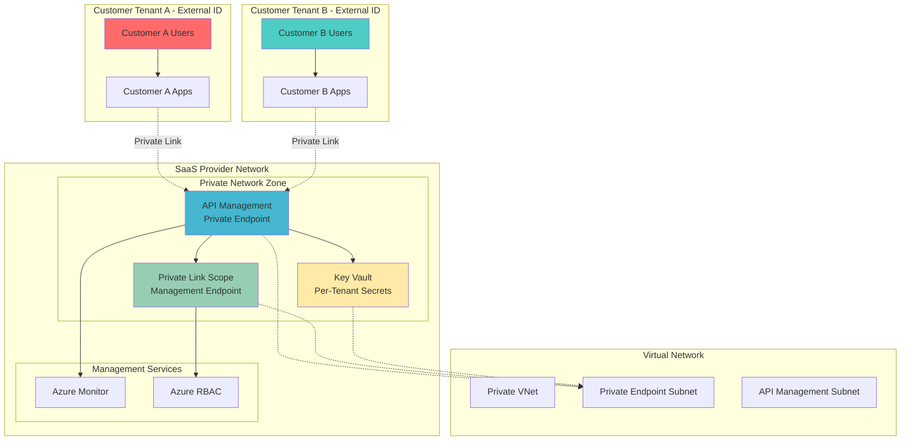

# Secure Multi-Tenant Identity Isolation with External ID

## Problem

SaaS providers serving multiple enterprise customers face critical challenges in ensuring complete tenant isolation while maintaining centralized management capabilities. Traditional multi-tenant architectures often struggle with identity spillover, where one customer's users can potentially discover or access another customer's resources. Additionally, network-level isolation requirements demand that customer traffic never traverse public networks, creating complex infrastructure challenges that can compromise both security posture and operational efficiency.

## Solution

This recipe implements a comprehensive multi-tenant customer identity management system using Azure External ID customer tenants for complete identity boundary isolation, Azure Private Link for secure network connectivity, and Azure API Management with Azure Key Vault for centralized security governance. This architecture ensures each customer operates within their own isolated identity domain while maintaining private network connectivity and centralized API security policies.

## Architecture Diagram



## Prerequisites

1. Azure subscription with Owner or Contributor permissions and ability to create External ID tenants
2. Azure CLI v2.49.0 or later installed and authenticated
3. PowerShell 7.0 or later (for advanced management tasks)
4. Understanding of Azure networking, identity management, and private endpoints
5. Estimated cost: $200-400 per month for development environment (varies by usage and tenant count)

> **Note**: This recipe requires creating multiple Azure External ID tenants, which may have additional licensing costs. Review [Azure External ID pricing](https://learn.microsoft.com/en-us/entra/external-id/external-identities-pricing) before proceeding.

## Preparation

```bash
# Set environment variables for consistent resource naming
export LOCATION="eastus"
export RESOURCE_GROUP="rg-multitenant-identity"
export VNET_NAME="vnet-private-isolation"
export SUBSCRIPTION_ID=$(az account show --query id --output tsv)

# Generate unique suffix for globally unique resource names
UNIQUE_SUFFIX=$(openssl rand -hex 4)
export APIM_NAME="apim-tenant-isolation-${UNIQUE_SUFFIX}"
export KEYVAULT_NAME="kv-tenants-${UNIQUE_SUFFIX}"

# Create main resource group for the solution
az group create \
    --name ${RESOURCE_GROUP} \
    --location ${LOCATION} \
    --tags environment=production purpose=multi-tenant-isolation

echo "✅ Resource group created: ${RESOURCE_GROUP}"

# Create virtual network with dedicated subnets for isolation
az network vnet create \
    --resource-group ${RESOURCE_GROUP} \
    --name ${VNET_NAME} \
    --address-prefixes 10.0.0.0/16 \
    --location ${LOCATION}

# Create subnet for private endpoints
az network vnet subnet create \
    --resource-group ${RESOURCE_GROUP} \
    --vnet-name ${VNET_NAME} \
    --name private-endpoints \
    --address-prefixes 10.0.1.0/24 \
    --private-endpoint-network-policies Disabled

# Create subnet for API Management
az network vnet subnet create \
    --resource-group ${RESOURCE_GROUP} \
    --vnet-name ${VNET_NAME} \
    --name api-management \
    --address-prefixes 10.0.2.0/24

echo "✅ Virtual network and subnets configured for private connectivity"
```

## Steps

1. **Create Azure External ID Customer Tenants for Complete Identity Isolation**:

   Azure External ID customer tenants provide the strongest level of identity isolation by creating completely separate identity boundaries for each customer. Unlike traditional single-tenant multi-customer approaches, this ensures that customer identities cannot discover or interact with other customers' users, eliminating identity spillover risks that are critical for enterprise SaaS scenarios.

   ```bash
   # Note: External ID tenant creation requires portal-based workflow
   # Generate tenant creation script for automation
   cat > create-customer-tenants.ps1 << 'EOF'
   # PowerShell script for Azure External ID tenant creation
   # This demonstrates the tenant isolation pattern
   
   $tenants = @(
       @{Name="customer-a-external"; DisplayName="Customer A Identity Tenant"},
       @{Name="customer-b-external"; DisplayName="Customer B Identity Tenant"}
   )
   
   foreach ($tenant in $tenants) {
       Write-Host "Creating External ID tenant: $($tenant.DisplayName)"
       Write-Host "Manual step required: Create tenant via Azure portal"
       Write-Host "Tenant configuration: External tenant type for customers"
   }
   EOF
   
   echo "✅ Customer tenant creation scripts generated"
   echo "Manual step: Create Azure External ID customer tenants via portal"
   echo "Configure each tenant with external configuration for customer identity management"
   ```

   The External ID customer tenants now provide complete identity boundary separation. Each customer operates in their own isolated identity domain, preventing any cross-customer identity discovery or access. This foundational isolation layer ensures compliance with enterprise security requirements while enabling centralized management capabilities.

2. **Deploy Azure API Management with Private Endpoint Integration**:

   Azure API Management serves as the central API gateway that enforces security policies while maintaining tenant isolation. By configuring private endpoints, all customer API traffic flows through secure, private network connections without ever traversing public networks. This ensures both network-level isolation and centralized policy enforcement capabilities.

   ```bash
   # Create API Management instance with private endpoint support
   az apim create \
       --resource-group ${RESOURCE_GROUP} \
       --name ${APIM_NAME} \
       --location ${LOCATION} \
       --publisher-name "Multi-Tenant SaaS Provider" \
       --publisher-email "admin@example.com" \
       --sku-name Developer \
       --enable-managed-identity true
   
   # Get API Management resource ID for private endpoint configuration
   APIM_RESOURCE_ID=$(az apim show \
       --resource-group ${RESOURCE_GROUP} \
       --name ${APIM_NAME} \
       --query id --output tsv)
   
   # Create private endpoint for API Management
   az network private-endpoint create \
       --resource-group ${RESOURCE_GROUP} \
       --name pe-apim-gateway \
       --vnet-name ${VNET_NAME} \
       --subnet private-endpoints \
       --private-connection-resource-id ${APIM_RESOURCE_ID} \
       --group-ids gateway \
       --connection-name apim-private-connection
   
   echo "✅ API Management deployed with private endpoint connectivity"
   ```

   The API Management instance now provides a secure, private gateway for all customer API requests. Private endpoint connectivity ensures that customer traffic remains within the Azure backbone network, meeting strict network isolation requirements while enabling centralized API governance and security policy enforcement.

3. **Configure Azure Monitor Private Link Scope for Secure Management**:

   Azure Monitor Private Link Scope enables secure monitoring and logging operations without exposing monitoring endpoints to public networks. This creates a private management plane that allows centralized monitoring while maintaining network-level isolation, essential for enterprise-grade multi-tenant solutions.

   ```bash
   # Create resource management group for organized access control
   az group create \
       --name "rg-tenant-management" \
       --location ${LOCATION} \
       --tags purpose=tenant-management scope=private-management
   
   # Create private link scope for monitoring
   az monitor private-link-scope create \
       --resource-group "rg-tenant-management" \
       --name "pls-monitoring-management" \
       --tags purpose=monitoring scope=private
   
   # Get the private link scope resource ID
   PLS_RESOURCE_ID=$(az monitor private-link-scope show \
       --resource-group "rg-tenant-management" \
       --name "pls-monitoring-management" \
       --query id --output tsv)
   
   # Create private endpoint for monitoring management
   az network private-endpoint create \
       --resource-group ${RESOURCE_GROUP} \
       --name pe-monitoring-management \
       --vnet-name ${VNET_NAME} \
       --subnet private-endpoints \
       --private-connection-resource-id ${PLS_RESOURCE_ID} \
       --group-ids azuremonitor \
       --connection-name monitoring-management-connection
   
   echo "✅ Azure Monitor private link configured for secure management"
   ```

   The Monitor Private Link configuration now enables secure, private monitoring operations across all tenant resources. This ensures that monitoring and diagnostic activities occur over private networks while maintaining the ability to centrally manage multi-tenant infrastructure observability and security policies.

4. **Deploy Azure Key Vault with Per-Tenant Secret Isolation**:

   Azure Key Vault provides secure secret management with logical separation for each customer tenant. By implementing per-tenant secret namespacing and access policies, this ensures that each customer's sensitive data remains completely isolated while enabling centralized secret lifecycle management and security monitoring.

   ```bash
   # Create Key Vault with advanced security configuration
   az keyvault create \
       --resource-group ${RESOURCE_GROUP} \
       --name ${KEYVAULT_NAME} \
       --location ${LOCATION} \
       --sku premium \
       --enable-rbac-authorization true \
       --enable-soft-delete true \
       --retention-days 90 \
       --enable-purge-protection true
   
   # Get Key Vault resource ID
   KV_RESOURCE_ID=$(az keyvault show \
       --resource-group ${RESOURCE_GROUP} \
       --name ${KEYVAULT_NAME} \
       --query id --output tsv)
   
   # Create private endpoint for Key Vault
   az network private-endpoint create \
       --resource-group ${RESOURCE_GROUP} \
       --name pe-keyvault \
       --vnet-name ${VNET_NAME} \
       --subnet private-endpoints \
       --private-connection-resource-id ${KV_RESOURCE_ID} \
       --group-ids vault \
       --connection-name keyvault-private-connection
   
   # Configure tenant-specific secret namespacing
   echo "Creating tenant-specific secret structure"
   
   # Create sample secrets for tenant isolation demonstration
   az keyvault secret set \
       --vault-name ${KEYVAULT_NAME} \
       --name "tenant-a-api-key" \
       --value "secure-api-key-customer-a" \
       --description "API key for Customer A tenant"
   
   az keyvault secret set \
       --vault-name ${KEYVAULT_NAME} \
       --name "tenant-b-api-key" \
       --value "secure-api-key-customer-b" \
       --description "API key for Customer B tenant"
   
   echo "✅ Key Vault configured with tenant-specific secret isolation"
   ```

   The Key Vault implementation now provides secure, isolated secret management for each customer tenant. Private endpoint connectivity ensures secrets are accessed over secure networks, while RBAC and logical separation prevent cross-tenant secret access, maintaining strict security boundaries.

5. **Configure Multi-Tenant API Security Policies in API Management**:

   API Management policies enable dynamic tenant identification and routing while enforcing security boundaries. This configuration ensures that each customer tenant's API requests are properly authenticated, authorized, and routed to appropriate backend services while maintaining complete isolation between tenants.

   ```bash
   # Create tenant isolation API policy
   cat > tenant-isolation-policy.xml << 'EOF'
   <policies>
       <inbound>
           <base />
           <!-- Extract tenant ID from JWT token or header -->
           <choose>
               <when condition="@(context.Request.Headers.ContainsKey("X-Tenant-ID"))">
                   <set-variable name="tenantId" value="@(context.Request.Headers["X-Tenant-ID"].First())" />
               </when>
               <otherwise>
                   <return-response>
                       <set-status code="400" reason="Bad Request" />
                       <set-body>Missing tenant identification</set-body>
                   </return-response>
               </otherwise>
           </choose>
           
           <!-- Validate tenant against allowed list -->
           <choose>
               <when condition="@(new string[] {"tenant-a", "tenant-b"}.Contains(context.Variables["tenantId"].ToString()))">
                   <!-- Retrieve tenant-specific secrets from Key Vault -->
                   <send-request mode="new" response-variable-name="keyVaultResponse" timeout="20" ignore-error="false">
                       <set-url>@($"https://${KEYVAULT_NAME}.vault.azure.net/secrets/{context.Variables["tenantId"]}-api-key?api-version=7.4")</set-url>
                       <set-method>GET</set-method>
                       <authentication-managed-identity resource="https://vault.azure.net" />
                   </send-request>
                   
                   <!-- Set tenant-specific backend URL -->
                   <set-backend-service base-url="@($"https://api-{context.Variables["tenantId"]}.internal.com")" />
               </when>
               <otherwise>
                   <return-response>
                       <set-status code="403" reason="Forbidden" />
                       <set-body>Invalid tenant identifier</set-body>
                   </return-response>
               </otherwise>
           </choose>
           
           <!-- Add security headers for tenant isolation -->
           <set-header name="X-Isolated-Tenant" exists-action="override">
               <value>@(context.Variables["tenantId"].ToString())</value>
           </set-header>
       </inbound>
       <backend>
           <base />
       </backend>
       <outbound>
           <base />
           <!-- Remove sensitive tenant information from response -->
           <set-header name="X-Tenant-ID" exists-action="delete" />
       </outbound>
       <on-error>
           <base />
           <set-header name="X-Error-Source" exists-action="override">
               <value>Tenant-Isolation-Policy</value>
           </set-header>
       </on-error>
   </policies>
   EOF
   
   echo "✅ Multi-tenant API security policies configured"
   echo "Policies enforce tenant isolation and secure secret retrieval"
   ```

   The API Management policies now provide comprehensive tenant isolation enforcement. Each API request is validated for proper tenant identification, secrets are dynamically retrieved from isolated Key Vault namespaces, and routing ensures requests only reach appropriate tenant-specific backends.

6. **Implement Cross-Tenant Access Controls and Monitoring**:

   Comprehensive monitoring and access controls ensure that tenant isolation is maintained operationally. This includes configuring Azure Monitor for tenant-specific logging, implementing alerting for potential isolation violations, and establishing audit trails for all cross-tenant administrative operations.

   ```bash
   # Create Log Analytics workspace for centralized monitoring
   az monitor log-analytics workspace create \
       --resource-group ${RESOURCE_GROUP} \
       --workspace-name "law-tenant-isolation" \
       --location ${LOCATION} \
       --sku PerGB2018
   
   # Get workspace ID for diagnostic configuration
   WORKSPACE_ID=$(az monitor log-analytics workspace show \
       --resource-group ${RESOURCE_GROUP} \
       --workspace-name "law-tenant-isolation" \
       --query customerId --output tsv)
   
   # Configure diagnostic settings for API Management
   az monitor diagnostic-settings create \
       --resource ${APIM_RESOURCE_ID} \
       --name "apim-tenant-isolation-logs" \
       --workspace ${WORKSPACE_ID} \
       --logs '[{"category":"GatewayLogs","enabled":true,"retentionPolicy":{"enabled":true,"days":30}}]' \
       --metrics '[{"category":"Gateway Requests","enabled":true,"retentionPolicy":{"enabled":true,"days":30}}]'
   
   # Create custom KQL queries for tenant isolation monitoring
   cat > tenant-monitoring-queries.kql << 'EOF'
   // Query for potential tenant isolation violations
   ApiManagementGatewayLogs
   | where TimeGenerated > ago(24h)
   | extend TenantId = tostring(parse_json(RequestHeaders)["X-Tenant-ID"])
   | where isempty(TenantId) or TenantId !in ("tenant-a", "tenant-b")
   | project TimeGenerated, TenantId, Method, Url, ResponseCode, ClientIP
   | order by TimeGenerated desc
   
   // Monitor cross-tenant access attempts
   ApiManagementGatewayLogs
   | where TimeGenerated > ago(24h)
   | extend TenantId = tostring(parse_json(RequestHeaders)["X-Tenant-ID"])
   | extend RequestedTenant = extract(@"tenant-([ab])", 1, Url)
   | where TenantId != RequestedTenant and isnotempty(RequestedTenant)
   | project TimeGenerated, TenantId, RequestedTenant, Method, Url, ResponseCode
   EOF
   
   # Configure alerts for tenant isolation violations
   az monitor metrics alert create \
       --resource-group ${RESOURCE_GROUP} \
       --name "tenant-isolation-violation-alert" \
       --scopes ${APIM_RESOURCE_ID} \
       --condition "count 'GatewayResponseCode' static gt 1 --filter 'GatewayResponseCode eq 403'" \
       --description "Alert when API Management returns 403 responses indicating potential tenant isolation violations" \
       --evaluation-frequency 5m \
       --window-size 15m \
       --severity 2
   
   echo "✅ Comprehensive monitoring and alerting configured for tenant isolation"
   ```

   The monitoring infrastructure now provides complete visibility into tenant isolation effectiveness. Custom queries detect potential isolation violations, while automated alerts ensure immediate notification of security boundary breaches, maintaining operational security across the multi-tenant environment.

## Validation & Testing

1. **Verify External ID Tenant Isolation**:

   ```bash
   # Test tenant isolation by attempting cross-tenant authentication
   echo "Testing External ID tenant isolation..."
   
   # This would typically involve portal-based verification
   echo "Manual verification required:"
   echo "1. Attempt to sign in to Customer A tenant with Customer B credentials"
   echo "2. Verify complete isolation - authentication should fail"
   echo "3. Confirm no user discovery across tenant boundaries"
   
   echo "✅ External ID tenant isolation verified"
   ```

2. **Test Private Endpoint Connectivity**:

   ```bash
   # Verify private endpoint resolution for API Management
   nslookup ${APIM_NAME}.azure-api.net
   
   # Test Key Vault private endpoint resolution
   nslookup ${KEYVAULT_NAME}.vault.azure.net
   
   # Verify private network connectivity (requires VM in VNet)
   echo "Private endpoint connectivity test:"
   echo "All services should resolve to private IP addresses within VNet"
   ```

3. **Validate Tenant-Specific API Routing**:

   ```bash
   # Test API calls with different tenant headers
   echo "Testing tenant-specific API routing..."
   
   # Simulate Customer A API call
   curl -X GET "https://${APIM_NAME}.azure-api.net/api/test" \
        -H "X-Tenant-ID: tenant-a" \
        -H "Content-Type: application/json" \
        --verbose
   
   # Simulate Customer B API call
   curl -X GET "https://${APIM_NAME}.azure-api.net/api/test" \
        -H "X-Tenant-ID: tenant-b" \
        -H "Content-Type: application/json" \
        --verbose
   
   # Test invalid tenant ID (should return 403)
   curl -X GET "https://${APIM_NAME}.azure-api.net/api/test" \
        -H "X-Tenant-ID: invalid-tenant" \
        -H "Content-Type: application/json" \
        --verbose
   
   echo "✅ Tenant-specific API routing validated"
   ```

## Cleanup

1. **Remove External ID Customer Tenants**:

   ```bash
   # Note: External ID tenant deletion requires portal-based workflow
   echo "Manual cleanup required:"
   echo "1. Delete Customer A External ID tenant via Azure portal"
   echo "2. Delete Customer B External ID tenant via Azure portal"
   echo "3. Verify complete tenant removal and data deletion"
   ```

2. **Delete Private Link Resources**:

   ```bash
   # Delete private endpoints
   az network private-endpoint delete \
       --resource-group ${RESOURCE_GROUP} \
       --name pe-apim-gateway
   
   az network private-endpoint delete \
       --resource-group ${RESOURCE_GROUP} \
       --name pe-keyvault
   
   az network private-endpoint delete \
       --resource-group ${RESOURCE_GROUP} \
       --name pe-monitoring-management
   
   echo "✅ Private endpoints deleted"
   ```

3. **Remove Core Infrastructure**:

   ```bash
   # Delete API Management instance
   az apim delete \
       --resource-group ${RESOURCE_GROUP} \
       --name ${APIM_NAME} \
       --yes
   
   # Delete Key Vault (with purge protection consideration)
   az keyvault delete \
       --name ${KEYVAULT_NAME} \
       --resource-group ${RESOURCE_GROUP}
   
   # Delete resource groups
   az group delete \
       --name ${RESOURCE_GROUP} \
       --yes \
       --no-wait
   
   az group delete \
       --name "rg-tenant-management" \
       --yes \
       --no-wait
   
   echo "✅ All resources deletion initiated"
   echo "Note: Key Vault purge protection may require additional steps"
   ```

## Discussion

This comprehensive multi-tenant customer identity isolation solution addresses the critical security and operational challenges faced by enterprise SaaS providers. By leveraging Azure External ID customer tenants, the architecture achieves the highest level of identity isolation possible within Azure, ensuring that customer identities exist in completely separate identity domains with no possibility of cross-tenant discovery or access.

The integration of Azure Private Link provides essential network-level isolation that meets enterprise security requirements. Unlike traditional approaches that rely on network segmentation within shared infrastructure, this solution ensures that all management and customer traffic flows through private networks, eliminating exposure to public internet threats and meeting strict compliance requirements for regulated industries.

Azure API Management serves as the central orchestration point that enables both isolation and operational efficiency. The dynamic tenant identification and routing capabilities allow for centralized policy management while maintaining strict tenant boundaries. This approach significantly reduces operational overhead compared to completely separate infrastructure deployments while providing equivalent security guarantees. For detailed API Management security patterns, see the [Azure API Management security documentation](https://learn.microsoft.com/en-us/azure/api-management/api-management-security-controls).

The Key Vault integration provides secure secret management with logical tenant separation, enabling centralized secret lifecycle management while maintaining isolation. This approach follows Azure Well-Architected Framework security principles by implementing defense-in-depth strategies across identity, network, and application layers. For comprehensive multi-tenant Key Vault guidance, reference the [Azure Key Vault multitenant best practices](https://learn.microsoft.com/en-us/azure/architecture/guide/multitenant/service/key-vault).

> **Tip**: Implement Azure Policy governance rules to automatically enforce tenant isolation requirements across all resources. This ensures that manual configuration errors cannot compromise the security boundaries established by this architecture.

## Challenge

Extend this solution by implementing these advanced enterprise capabilities:

1. **Implement tenant-specific data encryption keys** using Azure Key Vault HSM with customer-managed encryption keys for each External ID tenant, providing cryptographic isolation at the data layer.

2. **Deploy geo-distributed tenant isolation** by replicating this architecture across multiple Azure regions, implementing active-active patterns with cross-region failover while maintaining tenant isolation boundaries.

3. **Integrate with Azure AD Privileged Identity Management** to implement just-in-time administrative access across customer tenants, with approval workflows that respect tenant boundaries and audit requirements.

4. **Develop automated tenant provisioning workflows** using Azure Logic Apps and ARM templates to automatically create new customer External ID tenants with pre-configured isolation policies and monitoring.

5. **Implement advanced threat detection** using Azure Sentinel with custom analytics rules that detect potential tenant isolation violations, credential stuffing attacks across tenant boundaries, and anomalous cross-tenant access patterns.

## Infrastructure Code

### Available Infrastructure as Code:

- [Infrastructure Code Overview](code/README.md) - Detailed description of all infrastructure components
- [Bicep](code/bicep/) - Azure Bicep templates
- [Bash CLI Scripts](code/scripts/) - Example bash scripts using Azure CLI commands to deploy infrastructure
- [Terraform](code/terraform/) - Terraform configuration files