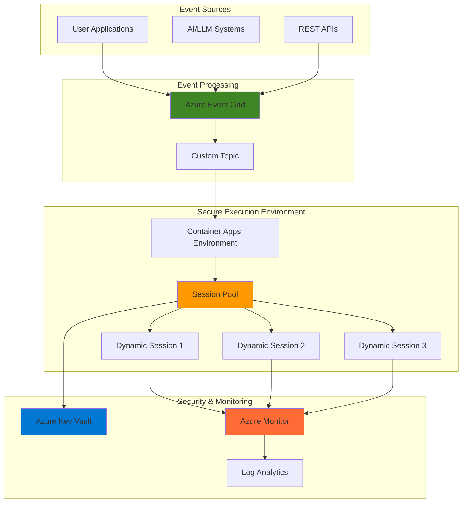

# Secure Sandboxed Code Execution with Dynamic Sessions

## Problem

Modern AI applications and developer platforms require secure execution of untrusted code from users or language models without compromising the host system. Traditional container solutions lack the rapid provisioning and strong isolation needed for real-time code execution scenarios. Organizations struggle with balancing security, performance, and scalability when processing potentially malicious code snippets in production environments.

## Solution

Azure Container Apps Dynamic Sessions provides isolated, sandboxed environments with subsecond allocation times for secure code execution. Combined with Azure Event Grid's event-driven architecture, this solution creates a scalable workflow that automatically triggers secure code execution in response to events while maintaining enterprise-grade security and monitoring through Azure Key Vault and Azure Monitor.

## Architecture Diagram



## Prerequisites

1. Azure account with appropriate permissions for Container Apps, Event Grid, Key Vault, and Monitor
2. Azure CLI v2.62.0 or higher with Container Apps extension installed
3. Basic knowledge of event-driven architectures and container security concepts
4. Understanding of REST APIs and JSON message formats
5. Estimated cost: $50-100 per month for development/testing workloads

> **Note**: Dynamic Sessions in Azure Container Apps require the Container Apps extension for Azure CLI. The extension will automatically install when you run your first session pool command.

## Preparation

```bash
# Set environment variables for Azure resources
export LOCATION="eastus"
export RESOURCE_GROUP="rg-secure-code-execution-${RANDOM_SUFFIX}"
export SUBSCRIPTION_ID=$(az account show --query id --output tsv)

# Generate unique suffix for resource names
RANDOM_SUFFIX=$(openssl rand -hex 3)

# Set specific resource names
export CONTAINERAPPS_ENVIRONMENT="cae-code-exec-${RANDOM_SUFFIX}"
export SESSION_POOL_NAME="pool-code-exec-${RANDOM_SUFFIX}"
export EVENT_GRID_TOPIC="egt-code-exec-${RANDOM_SUFFIX}"
export KEY_VAULT_NAME="kv-code-exec-${RANDOM_SUFFIX}"
export LOG_ANALYTICS_WORKSPACE="law-code-exec-${RANDOM_SUFFIX}"
export STORAGE_ACCOUNT="stcodeexec${RANDOM_SUFFIX}"

# Create resource group
az group create \
    --name ${RESOURCE_GROUP} \
    --location ${LOCATION} \
    --tags purpose=recipe environment=demo

echo "✅ Resource group created: ${RESOURCE_GROUP}"

# Create Log Analytics workspace for monitoring
az monitor log-analytics workspace create \
    --resource-group ${RESOURCE_GROUP} \
    --workspace-name ${LOG_ANALYTICS_WORKSPACE} \
    --location ${LOCATION}

echo "✅ Log Analytics workspace created: ${LOG_ANALYTICS_WORKSPACE}"

# Create Key Vault for secrets management
az keyvault create \
    --name ${KEY_VAULT_NAME} \
    --resource-group ${RESOURCE_GROUP} \
    --location ${LOCATION} \
    --sku standard \
    --enable-rbac-authorization

echo "✅ Key Vault created: ${KEY_VAULT_NAME}"
```

## Steps

1. **Create Container Apps Environment**:

   Azure Container Apps Environment provides the foundational infrastructure for running containerized applications and dynamic sessions. This managed environment handles networking, security, and lifecycle management while ensuring strong isolation between workloads. The environment integrates with Azure Monitor for comprehensive observability and diagnostic capabilities.

   ```bash
   # Create Container Apps Environment
   az containerapp env create \
       --name ${CONTAINERAPPS_ENVIRONMENT} \
       --resource-group ${RESOURCE_GROUP} \
       --location ${LOCATION} \
       --logs-workspace-id $(az monitor log-analytics workspace show \
           --resource-group ${RESOURCE_GROUP} \
           --workspace-name ${LOG_ANALYTICS_WORKSPACE} \
           --query customerId --output tsv) \
       --logs-workspace-key $(az monitor log-analytics workspace \
           get-shared-keys --resource-group ${RESOURCE_GROUP} \
           --workspace-name ${LOG_ANALYTICS_WORKSPACE} \
           --query primarySharedKey --output tsv)
   
   echo "✅ Container Apps Environment created: ${CONTAINERAPPS_ENVIRONMENT}"
   ```

   The Container Apps Environment is now ready with integrated logging and monitoring capabilities. This provides the secure, managed infrastructure needed for dynamic session execution while maintaining enterprise-grade observability and compliance requirements.

2. **Create Dynamic Session Pool for Code Execution**:

   Azure Container Apps Dynamic Sessions provide isolated, sandboxed environments optimized for running untrusted code. The session pool maintains a warm pool of ready sessions, enabling subsecond allocation times for real-time code execution scenarios. Each session operates in its own Hyper-V sandbox, providing enterprise-grade security isolation.

   ```bash
   # Install or upgrade Container Apps extension for session pools
   az extension add --name containerapp --upgrade --allow-preview true -y
   
   # Create session pool with Python runtime for secure code execution
   az containerapp sessionpool create \
       --name ${SESSION_POOL_NAME} \
       --resource-group ${RESOURCE_GROUP} \
       --location ${LOCATION} \
       --environment ${CONTAINERAPPS_ENVIRONMENT} \
       --container-type PythonLTS \
       --max-sessions 20 \
       --ready-sessions 5 \
       --cooldown-period 300 \
       --network-status EgressDisabled
   
   echo "✅ Session pool created: ${SESSION_POOL_NAME}"
   ```

   The session pool is now configured with Python runtime and network isolation enabled. This configuration ensures secure code execution with rapid session allocation while preventing unauthorized network access from untrusted code, maintaining security boundaries essential for production workloads.

3. **Set up Event Grid Topic for Workflow Triggers**:

   Azure Event Grid enables event-driven architectures by providing reliable message delivery at scale. Creating a custom topic allows applications to publish code execution events, which will trigger secure processing workflows. Event Grid's push model ensures low-latency event delivery and automatic retry mechanisms for reliable processing.

   ```bash
   # Create Event Grid topic for code execution events
   az eventgrid topic create \
       --name ${EVENT_GRID_TOPIC} \
       --resource-group ${RESOURCE_GROUP} \
       --location ${LOCATION} \
       --tags purpose=code-execution environment=demo
   
   # Get topic endpoint and key for event publishing
   export TOPIC_ENDPOINT=$(az eventgrid topic show \
       --name ${EVENT_GRID_TOPIC} \
       --resource-group ${RESOURCE_GROUP} \
       --query endpoint --output tsv)
   
   export TOPIC_KEY=$(az eventgrid topic key list \
       --name ${EVENT_GRID_TOPIC} \
       --resource-group ${RESOURCE_GROUP} \
       --query key1 --output tsv)
   
   echo "✅ Event Grid topic created: ${EVENT_GRID_TOPIC}"
   echo "Topic endpoint: ${TOPIC_ENDPOINT}"
   ```

   The Event Grid topic is now ready to receive code execution events from various sources. This establishes the event-driven foundation for the secure code execution workflow, enabling automatic triggering of isolated processing based on incoming events.

4. **Configure Storage Account for Results and Logs**:

   Azure Storage provides scalable, secure storage for code execution results, logs, and temporary files. This persistent storage layer ensures that execution outputs are preserved and accessible for analysis, auditing, and downstream processing while maintaining security through access controls and encryption.

   ```bash
   # Create storage account for execution results
   az storage account create \
       --name ${STORAGE_ACCOUNT} \
       --resource-group ${RESOURCE_GROUP} \
       --location ${LOCATION} \
       --sku Standard_LRS \
       --kind StorageV2 \
       --access-tier Hot \
       --https-only true \
       --min-tls-version TLS1_2
   
   # Create containers for different types of storage
   az storage container create \
       --name execution-results \
       --account-name ${STORAGE_ACCOUNT} \
       --auth-mode login
   
   az storage container create \
       --name execution-logs \
       --account-name ${STORAGE_ACCOUNT} \
       --auth-mode login
   
   echo "✅ Storage account created: ${STORAGE_ACCOUNT}"
   ```

   The storage account is now configured with secure access and organized containers for different types of execution data. This provides the persistent storage layer needed for maintaining execution history, results, and audit trails while ensuring compliance with security best practices.

5. **Create Azure Function for Session Management**:

   Azure Functions provides the serverless compute layer for managing dynamic session lifecycle and processing Event Grid events. This function handles session allocation, code execution coordination, and result processing while maintaining security boundaries and implementing proper error handling for production scenarios.

   ```bash
   # Create Function App for session management
   export FUNCTION_APP_NAME="func-session-mgmt-${RANDOM_SUFFIX}"
   
   az functionapp create \
       --name ${FUNCTION_APP_NAME} \
       --resource-group ${RESOURCE_GROUP} \
       --storage-account ${STORAGE_ACCOUNT} \
       --consumption-plan-location ${LOCATION} \
       --runtime python \
       --runtime-version 3.11 \
       --functions-version 4 \
       --os-type Linux
   
   # Configure app settings for session management
   az functionapp config appsettings set \
       --name ${FUNCTION_APP_NAME} \
       --resource-group ${RESOURCE_GROUP} \
       --settings \
           "SESSION_POOL_ENDPOINT=https://${SESSION_POOL_NAME}.${LOCATION}.azurecontainerapps.io" \
           "KEY_VAULT_URL=https://${KEY_VAULT_NAME}.vault.azure.net/" \
           "STORAGE_ACCOUNT_NAME=${STORAGE_ACCOUNT}"
   
   echo "✅ Function App created: ${FUNCTION_APP_NAME}"
   ```

   The Function App is now configured with the necessary environment variables and ready to handle session management tasks. This serverless component provides the orchestration layer for secure code execution workflows while maintaining scalability and cost efficiency.

6. **Configure Key Vault Integration for Secrets Management**:

   Azure Key Vault provides centralized, secure storage for application secrets, API keys, and certificates. Integrating Key Vault with the execution environment ensures that sensitive configuration data is protected and accessible only to authorized services, maintaining security best practices for production deployments.

   ```bash
   # Enable system-assigned managed identity for Function App
   az functionapp identity assign \
       --name ${FUNCTION_APP_NAME} \
       --resource-group ${RESOURCE_GROUP}
   
   # Get the Function App principal ID
   export FUNCTION_PRINCIPAL_ID=$(az functionapp identity show \
       --name ${FUNCTION_APP_NAME} \
       --resource-group ${RESOURCE_GROUP} \
       --query principalId --output tsv)
   
   # Assign Key Vault permissions to Function App
   az keyvault set-policy \
       --name ${KEY_VAULT_NAME} \
       --resource-group ${RESOURCE_GROUP} \
       --object-id ${FUNCTION_PRINCIPAL_ID} \
       --secret-permissions get list
   
   # Store session pool access token in Key Vault
   az keyvault secret set \
       --vault-name ${KEY_VAULT_NAME} \
       --name session-pool-token \
       --value $(az account get-access-token \
           --resource https://management.azure.com \
           --query accessToken --output tsv)
   
   echo "✅ Key Vault integration configured"
   ```

   The Key Vault integration is now active with proper permissions and secrets storage. This ensures that sensitive authentication tokens and configuration data are securely managed and accessible only to authorized components of the secure code execution workflow.

7. **Create Event Grid Subscription for Automated Triggers**:

   Event Grid subscriptions enable automatic triggering of the secure code execution workflow based on incoming events. This creates a fully automated, event-driven system that responds to code execution requests while maintaining proper filtering and routing to ensure only valid events trigger processing.

   ```bash
   # Create webhook endpoint for Function App event handling
   export WEBHOOK_ENDPOINT="https://${FUNCTION_APP_NAME}.azurewebsites.net/runtime/webhooks/eventgrid?functionName=ProcessCodeExecution"
   
   # Create Event Grid subscription to trigger Function App
   az eventgrid event-subscription create \
       --name code-execution-subscription \
       --source-resource-id $(az eventgrid topic show \
           --name ${EVENT_GRID_TOPIC} \
           --resource-group ${RESOURCE_GROUP} \
           --query id --output tsv) \
       --endpoint-type webhook \
       --endpoint ${WEBHOOK_ENDPOINT} \
       --subject-begins-with "code-execution" \
       --included-event-types "Microsoft.EventGrid.ExecuteCode"
   
   echo "✅ Event Grid subscription created"
   ```

   The Event Grid subscription is now configured to automatically trigger secure code execution workflows. This completes the event-driven architecture, enabling real-time processing of code execution requests with proper filtering and routing mechanisms.

8. **Configure Azure Monitor for Comprehensive Observability**:

   Azure Monitor provides comprehensive observability for the secure code execution workflow through metrics, logs, and alerts. This monitoring configuration ensures proper tracking of session usage, performance metrics, and security events while enabling proactive detection of issues and optimization opportunities.

   ```bash
   # Create Application Insights for detailed monitoring
   export APP_INSIGHTS_NAME="ai-code-exec-${RANDOM_SUFFIX}"
   
   az monitor app-insights component create \
       --app ${APP_INSIGHTS_NAME} \
       --location ${LOCATION} \
       --resource-group ${RESOURCE_GROUP} \
       --workspace $(az monitor log-analytics workspace show \
           --resource-group ${RESOURCE_GROUP} \
           --workspace-name ${LOG_ANALYTICS_WORKSPACE} \
           --query id --output tsv)
   
   # Configure Function App to use Application Insights
   az functionapp config appsettings set \
       --name ${FUNCTION_APP_NAME} \
       --resource-group ${RESOURCE_GROUP} \
       --settings \
           "APPINSIGHTS_INSTRUMENTATIONKEY=$(az monitor app-insights component show \
               --app ${APP_INSIGHTS_NAME} \
               --resource-group ${RESOURCE_GROUP} \
               --query instrumentationKey --output tsv)"
   
   echo "✅ Application Insights configured: ${APP_INSIGHTS_NAME}"
   ```

   The monitoring infrastructure is now fully configured with Application Insights and Log Analytics integration. This provides comprehensive observability across the entire secure code execution workflow, enabling performance monitoring, security auditing, and operational insights.

## Validation & Testing

1. **Verify session pool is active and ready**:

   ```bash
   # Check session pool status
   az containerapp sessionpool show \
       --name ${SESSION_POOL_NAME} \
       --resource-group ${RESOURCE_GROUP} \
       --query "{name:name,status:properties.poolManagementEndpoint,network:properties.sessionNetworkConfiguration}" \
       --output table
   ```

   Expected output: Session pool should show active status with management endpoint configured and network isolation enabled.

2. **Test Event Grid topic connectivity**:

   ```bash
   # Test event publication to Event Grid topic
   curl -X POST "${TOPIC_ENDPOINT}/api/events" \
       -H "aeg-sas-key: ${TOPIC_KEY}" \
       -H "Content-Type: application/json" \
       -d '[{
           "id": "test-event-001",
           "eventType": "Microsoft.EventGrid.ExecuteCode",
           "subject": "code-execution/test",
           "data": {
               "code": "print(\"Hello from secure session!\")",
               "language": "python"
           },
           "eventTime": "'$(date -u +%Y-%m-%dT%H:%M:%SZ)'"
       }]'
   
   echo "✅ Event published successfully"
   ```

   Expected output: HTTP 200 response indicating successful event publication to Event Grid topic.

3. **Verify Key Vault access and secrets**:

   ```bash
   # Test Key Vault secret retrieval
   az keyvault secret show \
       --vault-name ${KEY_VAULT_NAME} \
       --name session-pool-token \
       --query "value" \
       --output tsv | head -c 50
   
   echo "✅ Key Vault secrets accessible"
   ```

   Expected output: Truncated access token value, confirming successful secret storage and retrieval.

4. **Test session pool management endpoint**:

   ```bash
   # Get session pool management endpoint
   export POOL_ENDPOINT=$(az containerapp sessionpool show \
       --name ${SESSION_POOL_NAME} \
       --resource-group ${RESOURCE_GROUP} \
       --query properties.poolManagementEndpoint \
       --output tsv)
   
   echo "Session pool endpoint: ${POOL_ENDPOINT}"
   
   # Verify session pool configuration
   echo "✅ Session pool endpoint accessible"
   ```

   Expected output: Session pool management endpoint URL displaying successful configuration.

## Cleanup

1. **Remove Event Grid subscription and topic**:

   ```bash
   # Delete Event Grid subscription
   az eventgrid event-subscription delete \
       --name code-execution-subscription \
       --source-resource-id $(az eventgrid topic show \
           --name ${EVENT_GRID_TOPIC} \
           --resource-group ${RESOURCE_GROUP} \
           --query id --output tsv)
   
   # Delete Event Grid topic
   az eventgrid topic delete \
       --name ${EVENT_GRID_TOPIC} \
       --resource-group ${RESOURCE_GROUP}
   
   echo "✅ Event Grid resources deleted"
   ```

2. **Remove Function App and associated resources**:

   ```bash
   # Delete Function App
   az functionapp delete \
       --name ${FUNCTION_APP_NAME} \
       --resource-group ${RESOURCE_GROUP}
   
   # Delete Application Insights
   az monitor app-insights component delete \
       --app ${APP_INSIGHTS_NAME} \
       --resource-group ${RESOURCE_GROUP}
   
   echo "✅ Function App and monitoring resources deleted"
   ```

3. **Remove session pool and Container Apps environment**:

   ```bash
   # Delete session pool
   az containerapp sessionpool delete \
       --name ${SESSION_POOL_NAME} \
       --resource-group ${RESOURCE_GROUP} \
       --yes
   
   # Delete Container Apps environment
   az containerapp env delete \
       --name ${CONTAINERAPPS_ENVIRONMENT} \
       --resource-group ${RESOURCE_GROUP} \
       --yes
   
   echo "✅ Container Apps resources deleted"
   ```

4. **Remove remaining Azure resources**:

   ```bash
   # Delete storage account
   az storage account delete \
       --name ${STORAGE_ACCOUNT} \
       --resource-group ${RESOURCE_GROUP} \
       --yes
   
   # Delete Key Vault
   az keyvault delete \
       --name ${KEY_VAULT_NAME} \
       --resource-group ${RESOURCE_GROUP}
   
   # Delete Log Analytics workspace
   az monitor log-analytics workspace delete \
       --workspace-name ${LOG_ANALYTICS_WORKSPACE} \
       --resource-group ${RESOURCE_GROUP} \
       --yes
   
   # Delete resource group
   az group delete \
       --name ${RESOURCE_GROUP} \
       --yes \
       --no-wait
   
   echo "✅ All resources deleted"
   ```

## Discussion

Azure Container Apps Dynamic Sessions revolutionize secure code execution by providing enterprise-grade isolation through Hyper-V sandboxing with subsecond allocation times. This solution addresses the fundamental challenge of running untrusted code in production environments while maintaining the performance and scalability required for AI applications and developer platforms. The combination with Azure Event Grid creates a robust event-driven architecture that automatically responds to code execution requests while ensuring proper security boundaries and audit trails. For comprehensive understanding of dynamic sessions architecture, see the [Azure Container Apps Dynamic Sessions documentation](https://learn.microsoft.com/en-us/azure/container-apps/sessions).

The event-driven pattern enables natural decoupling between code submission and execution, allowing for sophisticated workflows that can include pre-processing, validation, and post-processing steps. Azure Event Grid's reliable message delivery ensures that no code execution requests are lost, while its filtering capabilities enable fine-grained control over which events trigger processing. This architecture follows the [Azure Well-Architected Framework](https://learn.microsoft.com/en-us/azure/architecture/framework/) principles of reliability, security, and operational excellence.

From a security perspective, the network isolation capabilities of dynamic sessions prevent unauthorized network access from untrusted code, while Azure Key Vault integration ensures that sensitive configuration data remains protected. The integration with Azure Monitor provides comprehensive observability for security events, performance metrics, and usage patterns, enabling proactive monitoring and compliance reporting. For detailed security best practices, review the [Azure Container Apps security documentation](https://learn.microsoft.com/en-us/azure/container-apps/security).

Cost optimization is achieved through the consumption-based pricing model of dynamic sessions, where you only pay for actual session usage rather than continuously running containers. The session pool's warm pool mechanism balances cost efficiency with performance by maintaining a configurable number of ready sessions based on expected demand patterns. For detailed cost optimization strategies, see the [Azure Container Apps pricing documentation](https://azure.microsoft.com/en-us/pricing/details/container-apps/).

> **Tip**: Monitor session pool utilization patterns using Azure Monitor to optimize the ready session count and cooldown periods. This ensures optimal balance between performance and cost while maintaining security isolation for all code execution scenarios.

## Challenge

Extend this secure code execution solution by implementing these enhancements:

1. **Multi-language Runtime Support**: Configure additional session pools for different programming languages (Node.js, .NET, Go) with language-specific security policies and resource limits.

2. **Advanced Event Filtering**: Implement sophisticated event filtering and routing logic to handle different types of code execution requests (batch processing, real-time execution, scheduled tasks) with appropriate priority and resource allocation.

3. **Result Processing Pipeline**: Create an automated pipeline using Azure Data Factory or Azure Logic Apps to process execution results, perform analysis, and trigger downstream workflows based on execution outcomes.

4. **Security Scanning Integration**: Integrate Azure Security Center and custom security scanning tools to analyze code before execution and detect potential security threats in real-time.

5. **Global Distribution**: Deploy the solution across multiple Azure regions with Azure Front Door for global load balancing and reduced latency for international users.

## Infrastructure Code

### Available Infrastructure as Code:

- [Infrastructure Code Overview](code/README.md) - Detailed description of all infrastructure components
- [Bicep](code/bicep/) - Azure Bicep templates
- [Bash CLI Scripts](code/scripts/) - Example bash scripts using Azure CLI commands to deploy infrastructure
- [Terraform](code/terraform/) - Terraform configuration files