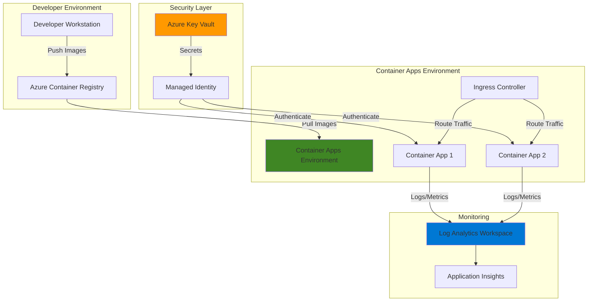

# Secure Serverless Microservices with Container Apps

## Problem

Organizations deploying containerized microservices face significant security challenges when managing sensitive configuration data such as API keys, database connection strings, and certificates. Traditional approaches of embedding secrets in container images or environment variables expose credentials to security risks and complicate secret rotation. Additionally, managing container infrastructure, scaling policies, and monitoring adds operational complexity that diverts focus from application development.

## Solution

Azure Container Apps provides a serverless container hosting platform that automatically handles infrastructure management, scaling, and security. By integrating with Azure Key Vault for centralized secret management and Azure Container Registry for private image storage, this solution creates a secure, scalable microservices architecture. Container Apps' built-in support for managed identities eliminates the need for stored credentials while providing automated secret rotation and comprehensive monitoring through Azure Monitor.

## Architecture Diagram



## Prerequisites

1. Azure account with active subscription and appropriate permissions to create resources
2. Azure CLI v2.54.0 or later installed and configured (or use Azure Cloud Shell)
3. Docker Desktop or compatible container runtime for local development (optional)
4. Basic understanding of containers, microservices, and REST APIs
5. Estimated cost: ~$50/month for typical workload (includes Container Apps consumption, Key Vault transactions, and monitoring)

> **Note**: This recipe uses consumption-based pricing for Container Apps, which automatically scales to zero when not in use, minimizing costs during development and testing.

## Preparation

```bash
# Set environment variables for consistent resource naming
export LOCATION="eastus"
export SUBSCRIPTION_ID=$(az account show --query id --output tsv)

# Generate unique suffix for globally unique resource names
export RANDOM_SUFFIX=$(openssl rand -hex 3)

export RESOURCE_GROUP="rg-secure-containers-${RANDOM_SUFFIX}"

# Set specific resource names
export ACR_NAME="acrsecure${RANDOM_SUFFIX}"
export KEY_VAULT_NAME="kv-secure-${RANDOM_SUFFIX}"
export ENVIRONMENT_NAME="cae-secure-${RANDOM_SUFFIX}"
export LOG_ANALYTICS_NAME="law-secure-${RANDOM_SUFFIX}"
export APP_NAME_1="api-service"
export APP_NAME_2="worker-service"

# Create resource group with appropriate tags
az group create \
    --name ${RESOURCE_GROUP} \
    --location ${LOCATION} \
    --tags purpose=recipe environment=demo \
    owner="container-apps-recipe"

echo "✅ Resource group created: ${RESOURCE_GROUP}"

# Create Log Analytics workspace for monitoring
LOG_ANALYTICS_ID=$(az monitor log-analytics workspace create \
    --name ${LOG_ANALYTICS_NAME} \
    --resource-group ${RESOURCE_GROUP} \
    --location ${LOCATION} \
    --query id --output tsv)

LOG_ANALYTICS_KEY=$(az monitor log-analytics workspace \
    get-shared-keys \
    --name ${LOG_ANALYTICS_NAME} \
    --resource-group ${RESOURCE_GROUP} \
    --query primarySharedKey --output tsv)

echo "✅ Log Analytics workspace created for monitoring"
```

## Steps

1. **Create Azure Container Registry for Private Image Storage**:

   Azure Container Registry provides a managed, private Docker registry service for storing and managing container images. By using ACR with Container Apps, you ensure that your container images remain private and secure while benefiting from geo-replication, vulnerability scanning, and integrated authentication. The registry uses Azure Active Directory for authentication, eliminating the need to manage separate registry credentials.

   ```bash
   # Create Container Registry with Standard SKU for production features
   az acr create \
       --name ${ACR_NAME} \
       --resource-group ${RESOURCE_GROUP} \
       --location ${LOCATION} \
       --sku Standard \
       --admin-enabled false

   # Enable anonymous pull for public images (optional)
   az acr update \
       --name ${ACR_NAME} \
       --anonymous-pull-enabled false

   echo "✅ Container Registry created: ${ACR_NAME}"
   ```

   The Container Registry is now ready to store your container images securely. By disabling admin access, we enforce Azure AD authentication, which provides better security through managed identities and eliminates the need for username/password authentication.

2. **Create Azure Key Vault for Centralized Secret Management**:

   Azure Key Vault provides a centralized, secure repository for application secrets, keys, and certificates. This eliminates the need to store sensitive information in code or configuration files, reducing security risks and simplifying compliance. Key Vault integrates seamlessly with Container Apps through managed identities, enabling automatic secret retrieval without storing credentials.

   ```bash
   # Create Key Vault with soft-delete and purge protection
   az keyvault create \
       --name ${KEY_VAULT_NAME} \
       --resource-group ${RESOURCE_GROUP} \
       --location ${LOCATION} \
       --sku standard \
       --enable-soft-delete true \
       --retention-days 7 \
       --enable-purge-protection false

   # Store sample application secrets
   az keyvault secret set \
       --vault-name ${KEY_VAULT_NAME} \
       --name "DatabaseConnectionString" \
       --value "Server=tcp:myserver.database.windows.net;Database=mydb;Authentication=Active Directory Managed Identity;"

   az keyvault secret set \
       --vault-name ${KEY_VAULT_NAME} \
       --name "ApiKey" \
       --value "sample-api-key-${RANDOM_SUFFIX}"

   az keyvault secret set \
       --vault-name ${KEY_VAULT_NAME} \
       --name "ServiceBusConnection" \
       --value "Endpoint=sb://namespace.servicebus.windows.net/;Authentication=Managed Identity"

   echo "✅ Key Vault created with sample secrets"
   ```

   Key Vault now contains your application secrets with versioning, audit logging, and access policies enabled. The soft-delete feature ensures that accidentally deleted secrets can be recovered within the retention period.

3. **Create Container Apps Environment with Monitoring**:

   The Container Apps Environment provides the secure boundary for your applications, including networking, logging, and Dapr configuration. This managed Kubernetes-based environment abstracts away infrastructure complexity while providing enterprise features like virtual network integration, custom domains, and comprehensive monitoring through Azure Monitor integration.

   ```bash
   # Create Container Apps Environment with Log Analytics
   az containerapp env create \
       --name ${ENVIRONMENT_NAME} \
       --resource-group ${RESOURCE_GROUP} \
       --location ${LOCATION} \
       --logs-workspace-id ${LOG_ANALYTICS_ID} \
       --logs-workspace-key ${LOG_ANALYTICS_KEY}

   # Wait for environment to be ready
   echo "⏳ Waiting for Container Apps Environment to be ready..."
   sleep 30

   echo "✅ Container Apps Environment created with monitoring enabled"
   ```

   The Container Apps Environment is now configured with built-in observability through Log Analytics, enabling you to monitor application logs, metrics, and traces without additional configuration.

4. **Build and Push Container Images to Registry**:

   Container images must be built and stored in a registry before deployment to Container Apps. Using Azure Container Registry ensures secure storage and fast deployment through Azure's backbone network. For this recipe, we'll use sample images, but in production, you would build your custom applications using Docker or Cloud Native Buildpacks.

   ```bash
   # Use Azure Container Registry Tasks to build sample image
   # Create a simple Dockerfile for demonstration
   cat > Dockerfile <<EOF
   FROM mcr.microsoft.com/dotnet/aspnet:7.0
   WORKDIR /app
   EXPOSE 80
   ENV ASPNETCORE_URLS=http://+:80
   RUN echo '{"message": "Hello from secure container!"}' > wwwroot/index.json
   ENTRYPOINT ["dotnet", "serve", "-d", "wwwroot", "-p", "80"]
   EOF

   # Build and push image using ACR Tasks
   az acr build \
       --registry ${ACR_NAME} \
       --resource-group ${RESOURCE_GROUP} \
       --image api-service:v1 \
       --file Dockerfile .

   # Use a pre-built sample worker image
   az acr import \
       --name ${ACR_NAME} \
       --source mcr.microsoft.com/azuredocs/containerapps-helloworld:latest \
       --image worker-service:v1

   echo "✅ Container images built and pushed to registry"

   # Clean up temporary Dockerfile
   rm Dockerfile
   ```

   Both container images are now stored in your private Azure Container Registry, ready for deployment with integrated vulnerability scanning and geo-replication capabilities.

5. **Deploy First Container App with Managed Identity**:

   Deploying Container Apps with managed identities enables secure, password-less authentication to Azure services. This approach follows Azure security best practices by eliminating stored credentials and providing automatic credential rotation. The system-assigned managed identity is created automatically and tied to the lifecycle of the Container App.

   ```bash
   # Create first Container App with system-assigned identity
   az containerapp create \
       --name ${APP_NAME_1} \
       --resource-group ${RESOURCE_GROUP} \
       --environment ${ENVIRONMENT_NAME} \
       --image ${ACR_NAME}.azurecr.io/api-service:v1 \
       --target-port 80 \
       --ingress external \
       --registry-server ${ACR_NAME}.azurecr.io \
       --registry-identity system \
       --system-assigned \
       --cpu 0.5 \
       --memory 1.0Gi \
       --min-replicas 1 \
       --max-replicas 5

   # Get the managed identity principal ID
   API_IDENTITY=$(az containerapp show \
       --name ${APP_NAME_1} \
       --resource-group ${RESOURCE_GROUP} \
       --query identity.principalId --output tsv)

   echo "✅ First Container App deployed with identity: ${API_IDENTITY}"
   ```

   The API service is now running with automatic HTTPS ingress, load balancing, and autoscaling based on HTTP traffic. The managed identity enables secure access to other Azure services without storing credentials.

6. **Configure Key Vault Access for Container Apps**:

   Granting Key Vault access to Container Apps' managed identities enables automatic secret retrieval without storing credentials. This follows the principle of least privilege by granting only the minimum required permissions. The Container Apps platform automatically handles secret caching and rotation when Key Vault secrets are updated.

   ```bash
   # Grant Key Vault access to first app's managed identity
   az keyvault set-policy \
       --name ${KEY_VAULT_NAME} \
       --object-id ${API_IDENTITY} \
       --secret-permissions get list

   # Deploy second Container App
   az containerapp create \
       --name ${APP_NAME_2} \
       --resource-group ${RESOURCE_GROUP} \
       --environment ${ENVIRONMENT_NAME} \
       --image ${ACR_NAME}.azurecr.io/worker-service:v1 \
       --target-port 80 \
       --ingress internal \
       --registry-server ${ACR_NAME}.azurecr.io \
       --registry-identity system \
       --system-assigned \
       --cpu 0.25 \
       --memory 0.5Gi \
       --min-replicas 0 \
       --max-replicas 3

   # Get second app's identity and grant access
   WORKER_IDENTITY=$(az containerapp show \
       --name ${APP_NAME_2} \
       --resource-group ${RESOURCE_GROUP} \
       --query identity.principalId --output tsv)

   az keyvault set-policy \
       --name ${KEY_VAULT_NAME} \
       --object-id ${WORKER_IDENTITY} \
       --secret-permissions get list

   echo "✅ Key Vault access configured for both Container Apps"
   ```

   Both Container Apps now have secure access to Key Vault secrets through their managed identities, enabling zero-trust security architecture.

7. **Add Key Vault Secret References to Container Apps**:

   Container Apps can reference Key Vault secrets directly, automatically retrieving and refreshing values without application code changes. This approach separates secret management from application deployment and enables centralized secret rotation. When secrets are updated in Key Vault, Container Apps automatically picks up the new values within 30 minutes.

   ```bash
   # Get Key Vault resource ID for secret references
   KEY_VAULT_ID=$(az keyvault show \
       --name ${KEY_VAULT_NAME} \
       --resource-group ${RESOURCE_GROUP} \
       --query id --output tsv)

   # Update first app with Key Vault secret references
   az containerapp secret set \
       --name ${APP_NAME_1} \
       --resource-group ${RESOURCE_GROUP} \
       --secrets "db-connection=keyvaultref:${KEY_VAULT_ID}/secrets/DatabaseConnectionString,identityref:system" \
                 "api-key=keyvaultref:${KEY_VAULT_ID}/secrets/ApiKey,identityref:system"

   # Add environment variables that reference the secrets
   az containerapp update \
       --name ${APP_NAME_1} \
       --resource-group ${RESOURCE_GROUP} \
       --set-env-vars "DATABASE_CONNECTION=secretref:db-connection" \
                      "API_KEY=secretref:api-key" \
                      "ENVIRONMENT=Production"

   echo "✅ Key Vault secrets integrated with Container App"
   ```

   The Container App now automatically retrieves secrets from Key Vault at startup and refreshes them periodically, ensuring applications always have current credentials without manual intervention.

8. **Configure Monitoring and Alerts**:

   Comprehensive monitoring is essential for production containerized applications. Azure Monitor integration with Container Apps provides automatic collection of logs, metrics, and distributed traces. Application Insights adds application performance monitoring (APM) capabilities, enabling you to track requests, dependencies, and custom metrics across your microservices architecture.

   ```bash
   # Create Application Insights for APM
   APP_INSIGHTS_KEY=$(az monitor app-insights component create \
       --app insights-${RANDOM_SUFFIX} \
       --location ${LOCATION} \
       --resource-group ${RESOURCE_GROUP} \
       --workspace ${LOG_ANALYTICS_ID} \
       --query instrumentationKey --output tsv)

   # Update Container Apps with Application Insights
   az containerapp update \
       --name ${APP_NAME_1} \
       --resource-group ${RESOURCE_GROUP} \
       --set-env-vars "APPLICATIONINSIGHTS_CONNECTION_STRING=InstrumentationKey=${APP_INSIGHTS_KEY}"

   # Create metric alert for high CPU usage
   CONTAINER_APP_ID=$(az containerapp show \
       --name ${APP_NAME_1} \
       --resource-group ${RESOURCE_GROUP} \
       --query id --output tsv)
   
   az monitor metrics alert create \
       --name "high-cpu-alert" \
       --resource-group ${RESOURCE_GROUP} \
       --scopes ${CONTAINER_APP_ID} \
       --condition "avg CPU > 80" \
       --window-size 5m \
       --evaluation-frequency 1m \
       --severity 2 \
       --description "Alert when CPU usage exceeds 80%"

   echo "✅ Monitoring and alerting configured"
   ```

   Your Container Apps now have comprehensive observability with automatic log collection, performance monitoring, and proactive alerting for operational issues.

## Validation & Testing

1. Verify Container Apps are running successfully:

   ```bash
   # Check Container App status
   az containerapp show \
       --name ${APP_NAME_1} \
       --resource-group ${RESOURCE_GROUP} \
       --query "properties.runningStatus" --output tsv
   
   # Get the application URL
   APP_URL=$(az containerapp show \
       --name ${APP_NAME_1} \
       --resource-group ${RESOURCE_GROUP} \
       --query properties.configuration.ingress.fqdn --output tsv)
   
   echo "Application URL: https://${APP_URL}"
   ```

   Expected output: "Running" status and a valid HTTPS URL for your application.

2. Test Key Vault secret integration:

   ```bash
   # Verify secrets are loaded from Key Vault
   az containerapp secret show \
       --name ${APP_NAME_1} \
       --resource-group ${RESOURCE_GROUP} \
       --secret-name db-connection
   
   # Check container logs for successful startup
   az containerapp logs show \
       --name ${APP_NAME_1} \
       --resource-group ${RESOURCE_GROUP} \
       --tail 50
   ```

   Expected output: Secret details showing Key Vault reference and container logs without errors.

3. Validate monitoring data collection:

   ```bash
   # Query recent logs from Log Analytics
   az monitor log-analytics query \
       --workspace ${LOG_ANALYTICS_ID} \
       --analytics-query "ContainerAppConsoleLogs_CL | \
           where ContainerAppName_s == '${APP_NAME_1}' | \
           project TimeGenerated, Log_s | \
           take 10" \
       --time-span PT1H
   
   # Check metrics availability
   CONTAINER_APP_ID=$(az containerapp show \
       --name ${APP_NAME_1} \
       --resource-group ${RESOURCE_GROUP} \
       --query id --output tsv)
   
   az monitor metrics list-definitions \
       --resource ${CONTAINER_APP_ID}
   ```

   Expected output: Recent log entries and available metrics like CPU, memory, and request count.

## Cleanup

1. Delete the resource group and all contained resources:

   ```bash
   # Delete resource group (includes all resources)
   az group delete \
       --name ${RESOURCE_GROUP} \
       --yes \
       --no-wait
   
   echo "✅ Resource group deletion initiated: ${RESOURCE_GROUP}"
   echo "Note: Deletion may take 5-10 minutes to complete"
   ```

2. Verify deletion and clean up local environment:

   ```bash
   # Check if resource group still exists
   az group exists --name ${RESOURCE_GROUP}
   
   # Clean up environment variables
   unset RESOURCE_GROUP LOCATION SUBSCRIPTION_ID RANDOM_SUFFIX
   unset ACR_NAME KEY_VAULT_NAME ENVIRONMENT_NAME LOG_ANALYTICS_NAME
   unset APP_NAME_1 APP_NAME_2 API_IDENTITY WORKER_IDENTITY
   unset LOG_ANALYTICS_ID LOG_ANALYTICS_KEY KEY_VAULT_ID
   unset APP_INSIGHTS_KEY CONTAINER_APP_ID
   
   echo "✅ Local environment cleaned up"
   ```

> **Warning**: Ensure the resource group deletion completes before creating resources with similar names to avoid conflicts. Soft-deleted Key Vaults may prevent immediate recreation with the same name.

## Discussion

Azure Container Apps revolutionizes container orchestration by abstracting away Kubernetes complexity while providing enterprise-grade features. This serverless approach enables teams to focus on application development rather than infrastructure management, significantly reducing operational overhead. The platform's automatic scaling, built-in load balancing, and zero-downtime deployments create a robust foundation for modern microservices architectures. For detailed architectural guidance, see the [Azure Container Apps documentation](https://learn.microsoft.com/en-us/azure/container-apps/overview) and [Container Apps best practices](https://learn.microsoft.com/en-us/azure/container-apps/best-practices).

The integration with Azure Key Vault exemplifies the principle of separation of concerns in security architecture. By centralizing secret management, organizations can implement consistent security policies, enable automatic secret rotation, and maintain comprehensive audit trails. Container Apps' native support for Key Vault references through managed identities eliminates the need for stored credentials, following zero-trust security principles. This approach aligns with the [Azure Well-Architected Framework](https://learn.microsoft.com/en-us/azure/well-architected/) security pillar and [Key Vault best practices](https://learn.microsoft.com/en-us/azure/key-vault/general/best-practices).

From a cost optimization perspective, Container Apps' consumption-based pricing model ensures you only pay for actual resource usage. The platform automatically scales applications to zero when idle, eliminating costs during periods of low activity. Combined with built-in monitoring through Azure Monitor, teams can identify optimization opportunities and right-size their applications based on actual usage patterns. For comprehensive cost management strategies, refer to the [Container Apps pricing guide](https://learn.microsoft.com/en-us/azure/container-apps/billing) and [Azure cost optimization documentation](https://learn.microsoft.com/en-us/azure/cost-management-billing/costs/cost-management-best-practices).

> **Tip**: Enable Dapr (Distributed Application Runtime) in your Container Apps Environment to unlock advanced microservices capabilities like service discovery, state management, and pub/sub messaging without adding complexity to your application code.

## Challenge

Extend this solution by implementing these enhancements:

1. Implement automatic container image updates using Azure Container Registry webhooks to trigger new Container App revisions when updated images are pushed
2. Add Azure API Management in front of Container Apps to provide enterprise API gateway capabilities with rate limiting, authentication, and API versioning
3. Configure blue-green deployments by creating multiple Container App revisions and using traffic splitting to gradually shift traffic between versions
4. Implement distributed tracing across microservices using Dapr and Application Insights to visualize request flows and identify performance bottlenecks
5. Create a GitHub Actions or Azure DevOps pipeline that builds containers, runs security scans, and deploys to Container Apps with proper secret management

## Infrastructure Code

*Infrastructure code will be generated after recipe approval.*