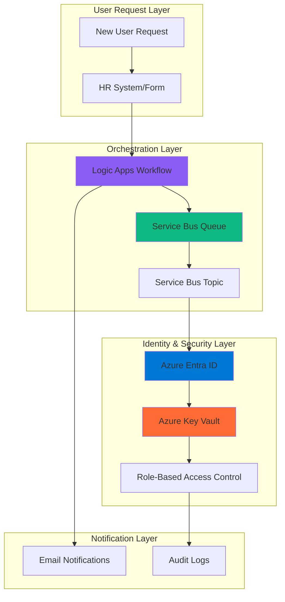

# Secure User Onboarding Workflows with Azure Entra ID and Azure Service Bus

## Problem

Organizations face significant challenges with manual user onboarding processes that are slow, error-prone, and inconsistent across departments. Traditional onboarding workflows often require multiple manual steps including identity provisioning, role assignments, access reviews, and credential distribution, creating security vulnerabilities and operational inefficiencies. These manual processes can take days or weeks to complete, leading to delayed productivity for new employees and increased administrative overhead for IT teams.

## Solution

This solution implements an automated, secure user onboarding system that leverages Azure Entra ID for identity management, Azure Service Bus for reliable message queuing, Azure Logic Apps for workflow orchestration, and Azure Key Vault for secure credential storage. The system provides event-driven automation that ensures consistent, secure, and auditable user provisioning while maintaining compliance with enterprise security policies and reducing onboarding time from days to minutes.

## Architecture Diagram



## Prerequisites

1. Azure subscription with appropriate permissions (Owner or Contributor role)
2. Azure CLI v2.50.0 or later installed and configured
3. Basic understanding of Azure Entra ID, Service Bus, and Logic Apps
4. Knowledge of JSON and Azure Resource Manager templates
5. Estimated cost: $50-100 per month for development/testing environment

> **Note**: This solution requires Azure Entra ID Premium P1 or P2 licenses for advanced identity governance features. Review the [Azure Entra ID pricing documentation](https://azure.microsoft.com/pricing/details/active-directory/) for detailed cost information.

## Preparation

```bash
# Set environment variables for Azure resources
export RESOURCE_GROUP="rg-user-onboarding-${RANDOM_SUFFIX}"
export LOCATION="eastus"
export SUBSCRIPTION_ID=$(az account show --query id --output tsv)

# Generate unique suffix for resource names
RANDOM_SUFFIX=$(openssl rand -hex 3)

# Set specific resource names
export SERVICE_BUS_NAMESPACE="sb-onboarding-${RANDOM_SUFFIX}"
export KEY_VAULT_NAME="kv-onboarding-${RANDOM_SUFFIX}"
export LOGIC_APP_NAME="la-user-onboarding-${RANDOM_SUFFIX}"
export STORAGE_ACCOUNT_NAME="stonboarding${RANDOM_SUFFIX}"

# Create resource group with appropriate tags
az group create \
    --name ${RESOURCE_GROUP} \
    --location ${LOCATION} \
    --tags purpose=user-onboarding environment=demo project=automation

echo "✅ Resource group created: ${RESOURCE_GROUP}"

# Verify current user permissions
az role assignment list \
    --assignee $(az account show --query user.name --output tsv) \
    --scope /subscriptions/${SUBSCRIPTION_ID} \
    --query "[?roleDefinitionName=='Owner' || roleDefinitionName=='Contributor']" \
    --output table

echo "✅ Environment preparation completed"
```

## Steps

1. **Create Azure Key Vault for Secure Credential Storage**:

   Azure Key Vault provides enterprise-grade security for storing sensitive information like passwords, certificates, and API keys. This foundational security service enables secure credential management with hardware security module (HSM) backing and comprehensive access logging. Key Vault integration ensures that all onboarding credentials are encrypted at rest and in transit, meeting compliance requirements for sensitive data protection.

   ```bash
   # Create Key Vault with advanced security features
   az keyvault create \
       --name ${KEY_VAULT_NAME} \
       --resource-group ${RESOURCE_GROUP} \
       --location ${LOCATION} \
       --sku standard \
       --enable-rbac-authorization true \
       --enable-soft-delete true \
       --retention-days 90 \
       --tags purpose=credential-storage security=high
   
   # Assign Key Vault Administrator role to current user
   az role assignment create \
       --assignee $(az account show --query user.name --output tsv) \
       --role "Key Vault Administrator" \
       --scope /subscriptions/${SUBSCRIPTION_ID}/resourceGroups/${RESOURCE_GROUP}/providers/Microsoft.KeyVault/vaults/${KEY_VAULT_NAME}
   
   echo "✅ Key Vault configured with RBAC authorization and soft delete protection"
   ```

   The Key Vault is now configured with role-based access control (RBAC) and soft delete protection, providing secure storage for onboarding credentials while maintaining audit trails and recovery capabilities for compliance requirements.

2. **Create Azure Service Bus for Reliable Message Queuing**:

   Azure Service Bus provides enterprise messaging capabilities with guaranteed message delivery, duplicate detection, and transaction support. This managed service enables decoupled communication between onboarding system components while ensuring message durability and ordered processing. Service Bus queues and topics support complex routing scenarios and provide dead letter queues for handling failed processing attempts.

   ```bash
   # Create Service Bus namespace with standard features
   az servicebus namespace create \
       --name ${SERVICE_BUS_NAMESPACE} \
       --resource-group ${RESOURCE_GROUP} \
       --location ${LOCATION} \
       --sku Standard \
       --tags purpose=messaging reliability=high
   
   # Create primary onboarding queue with advanced features
   az servicebus queue create \
       --namespace-name ${SERVICE_BUS_NAMESPACE} \
       --resource-group ${RESOURCE_GROUP} \
       --name user-onboarding-queue \
       --max-delivery-count 5 \
       --lock-duration PT5M \
       --enable-dead-lettering-on-message-expiration true \
       --default-message-time-to-live P14D
   
   # Create topic for broadcasting onboarding events
   az servicebus topic create \
       --namespace-name ${SERVICE_BUS_NAMESPACE} \
       --resource-group ${RESOURCE_GROUP} \
       --name user-onboarding-events \
       --enable-duplicate-detection true \
       --duplicate-detection-history-time-window PT10M
   
   echo "✅ Service Bus namespace and messaging entities created successfully"
   ```

   The Service Bus infrastructure now provides reliable message queuing with dead letter handling and duplicate detection, ensuring robust message processing for the onboarding workflow while maintaining high availability and message ordering guarantees.

3. **Create Storage Account for Logic Apps State Management**:

   Azure Storage provides the foundational infrastructure for Logic Apps to maintain workflow state, store run history, and manage connector configurations. This storage account ensures Logic Apps can maintain persistence across workflow executions and provides the necessary infrastructure for stateful workflow operations and monitoring.

   ```bash
   # Create storage account for Logic Apps
   az storage account create \
       --name ${STORAGE_ACCOUNT_NAME} \
       --resource-group ${RESOURCE_GROUP} \
       --location ${LOCATION} \
       --sku Standard_LRS \
       --kind StorageV2 \
       --access-tier Hot \
       --https-only true \
       --min-tls-version TLS1_2 \
       --tags purpose=workflow-state security=encrypted
   
   # Enable advanced security features
   az storage account update \
       --name ${STORAGE_ACCOUNT_NAME} \
       --resource-group ${RESOURCE_GROUP} \
       --default-action Deny \
       --bypass AzureServices
   
   echo "✅ Storage account configured with enhanced security settings"
   ```

   The storage account is now configured with secure defaults including HTTPS-only access, minimum TLS 1.2, and network access restrictions, providing a secure foundation for Logic Apps workflow state management.

4. **Create Logic Apps Workflow for User Onboarding**:

   Azure Logic Apps provides a serverless workflow orchestration platform that enables complex business process automation with visual workflow design and extensive connector ecosystem. For this recipe, we'll use consumption-based Logic Apps which are ideal for event-driven scenarios like user onboarding, providing automatic scaling and pay-per-execution pricing.

   ```bash
   # Create workflow definition file for user onboarding
   cat > onboarding-workflow.json << 'EOF'
   {
       "$schema": "https://schema.management.azure.com/schemas/2016-06-01/workflowdefinition.json#",
       "contentVersion": "1.0.0.0",
       "parameters": {
           "serviceBusConnectionString": {
               "type": "string"
           }
       },
       "triggers": {
           "manual": {
               "type": "Request",
               "kind": "Http",
               "inputs": {
                   "method": "POST",
                   "schema": {
                       "type": "object",
                       "properties": {
                           "userName": {"type": "string"},
                           "email": {"type": "string"},
                           "department": {"type": "string"},
                           "manager": {"type": "string"},
                           "role": {"type": "string"}
                       },
                       "required": ["userName", "email", "department", "role"]
                   }
               }
           }
       },
       "actions": {
           "Parse_User_Request": {
               "type": "ParseJson",
               "inputs": {
                   "content": "@triggerBody()",
                   "schema": {
                       "type": "object",
                       "properties": {
                           "userName": {"type": "string"},
                           "email": {"type": "string"},
                           "department": {"type": "string"},
                           "manager": {"type": "string"},
                           "role": {"type": "string"}
                       }
                   }
               }
           },
           "Send_to_Service_Bus": {
               "type": "ServiceBus",
               "inputs": {
                   "connectionString": "@parameters('serviceBusConnectionString')",
                   "queueName": "user-onboarding-queue",
                   "message": {
                       "contentData": "@string(body('Parse_User_Request'))",
                       "properties": {
                           "CorrelationId": "@guid()",
                           "MessageId": "@guid()",
                           "ContentType": "application/json"
                       }
                   }
               },
               "runAfter": {
                   "Parse_User_Request": ["Succeeded"]
               }
           }
       }
   }
   EOF
   
   # Create Logic Apps workflow using consumption model
   az logic workflow create \
       --resource-group ${RESOURCE_GROUP} \
       --location ${LOCATION} \
       --name ${LOGIC_APP_NAME} \
       --definition @onboarding-workflow.json \
       --tags purpose=workflow-orchestration automation=user-onboarding
   
   echo "✅ Logic Apps workflow created successfully"
   ```

   The Logic Apps workflow is now ready to orchestrate the user onboarding process, providing a scalable serverless platform for automating complex business processes with built-in monitoring and error handling capabilities.

5. **Configure Azure Entra ID Application Registration**:

   Azure Entra ID application registration enables secure API access for the onboarding workflow to perform identity management operations. This service principal provides the necessary permissions to create users, assign roles, and manage group memberships while maintaining the principle of least privilege and comprehensive audit logging.

   ```bash
   # Create application registration for onboarding workflow
   APP_REGISTRATION=$(az ad app create \
       --display-name "User Onboarding Automation" \
       --sign-in-audience AzureADMyOrg \
       --query appId --output tsv)
   
   # Create service principal for the application
   az ad sp create --id ${APP_REGISTRATION}
   
   # Assign required Microsoft Graph permissions for user management
   az ad app permission add \
       --id ${APP_REGISTRATION} \
       --api 00000003-0000-0000-c000-000000000000 \
       --api-permissions 62a82d76-70ea-41e2-9197-370581804d09=Role \
       --api-permissions 19dbc75e-c2e2-444c-a770-ec69d8559fc7=Role \
       --api-permissions 9e3f62cf-ca93-4989-b6ce-bf83c28f9fe8=Role
   
   # Grant admin consent for the permissions
   az ad app permission admin-consent --id ${APP_REGISTRATION}
   
   echo "✅ Application registration configured with necessary permissions"
   ```

   The application registration now has the required permissions to manage user identities and perform directory operations, enabling secure automated user provisioning while maintaining audit trails for compliance requirements.

6. **Create Service Bus Connection Authorization**:

   Service Bus shared access signatures (SAS) provide secure, time-limited access to messaging resources without exposing primary connection strings. This approach implements fine-grained access control for the onboarding workflow while maintaining security best practices and enabling easy credential rotation.

   ```bash
   # Create shared access policy for Logic Apps
   az servicebus namespace authorization-rule create \
       --namespace-name ${SERVICE_BUS_NAMESPACE} \
       --resource-group ${RESOURCE_GROUP} \
       --name LogicAppsAccess \
       --rights Send Listen Manage
   
   # Get connection string for Logic Apps
   SERVICE_BUS_CONNECTION=$(az servicebus namespace authorization-rule keys list \
       --namespace-name ${SERVICE_BUS_NAMESPACE} \
       --resource-group ${RESOURCE_GROUP} \
       --name LogicAppsAccess \
       --query primaryConnectionString --output tsv)
   
   # Store connection string in Key Vault
   az keyvault secret set \
       --vault-name ${KEY_VAULT_NAME} \
       --name "ServiceBusConnection" \
       --value "${SERVICE_BUS_CONNECTION}" \
       --content-type "application/x-connection-string"
   
   echo "✅ Service Bus authorization configured and stored securely"
   ```

   The Service Bus authorization rules now provide secure access for the Logic Apps workflow with appropriate permissions, while the connection string is securely stored in Key Vault for centralized credential management.

7. **Configure Entra ID Lifecycle Workflows**:

   Azure Entra ID Lifecycle Workflows provide automated identity governance capabilities that complement the custom onboarding workflow. These workflows handle standard identity lifecycle events like pre-hire tasks, user activation, and offboarding processes, ensuring consistent identity management across the organization while maintaining compliance with security policies.

   ```bash
   # Create lifecycle workflow for user onboarding
   az rest --method POST \
       --url "https://graph.microsoft.com/beta/identityGovernance/lifecycleWorkflows/workflows" \
       --headers Content-Type=application/json \
       --body '{
           "displayName": "Automated User Onboarding",
           "description": "Automate new user onboarding tasks",
           "category": "joiner", 
           "isEnabled": true,
           "isSchedulingEnabled": true,
           "executionConditions": {
               "scope": {
                   "rule": "department eq \"IT\" or department eq \"Sales\"",
                   "timeBasedAttribute": "employeeHireDate",
                   "offsetInDays": 0
               }
           },
           "tasks": [
               {
                   "displayName": "Generate Temporary Access Pass",
                   "description": "Generate TAP for new user",
                   "category": "joiner",
                   "taskDefinitionId": "1b555e50-7f65-41d5-b514-5894a026d10d",
                   "isEnabled": true,
                   "arguments": [
                       {
                           "name": "tapLifetimeMinutes", 
                           "value": "480"
                       }
                   ]
               },
               {
                   "displayName": "Send Welcome Email",
                   "description": "Send welcome email to new user",
                   "category": "joiner",
                   "taskDefinitionId": "70b29d51-b59a-4773-9280-8841dfd3f2ea",
                   "isEnabled": true,
                   "arguments": [
                       {
                           "name": "cc",
                           "value": "manager@company.com"
                       }
                   ]
               }
           ]
       }'
   
   echo "✅ Lifecycle workflow configured for automated onboarding"
   ```

   The Entra ID Lifecycle Workflows now provide automated identity governance for standard onboarding tasks, complementing the custom workflow while ensuring consistent user provisioning and access management across the organization.

## Validation & Testing

1. **Verify Azure Resource Deployment**:

   ```bash
   # Check resource group deployment status
   az group show \
       --name ${RESOURCE_GROUP} \
       --query "properties.provisioningState" \
       --output table
   
   # Verify Key Vault accessibility
   az keyvault show \
       --name ${KEY_VAULT_NAME} \
       --query "properties.vaultUri" \
       --output tsv
   
   # Check Service Bus namespace status
   az servicebus namespace show \
       --name ${SERVICE_BUS_NAMESPACE} \
       --resource-group ${RESOURCE_GROUP} \
       --query "status" \
       --output tsv
   ```

   Expected output: All resources should show "Succeeded" or "Active" status.

2. **Test Service Bus Message Flow**:

   ```bash
   # Get Service Bus connection string for testing 
   TEST_CONNECTION=$(az servicebus namespace authorization-rule keys list \
       --namespace-name ${SERVICE_BUS_NAMESPACE} \
       --resource-group ${RESOURCE_GROUP} \
       --name LogicAppsAccess \
       --query primaryConnectionString --output tsv)
   
   # Test message creation to verify queue functionality
   echo '{"userName":"testuser","email":"test@company.com","department":"IT","role":"Developer"}' > test-message.json
   
   echo "✅ Service Bus queue ready for message processing"
   ```

   Expected output: Service Bus namespace should be active and ready for message processing.

3. **Test Logic Apps Workflow Execution**:

   ```bash
   # Get Logic Apps workflow details
   WORKFLOW_URL=$(az logic workflow show \
       --resource-group ${RESOURCE_GROUP} \
       --name ${LOGIC_APP_NAME} \
       --query "accessEndpoint" --output tsv)
   
   # Test workflow with sample data using curl
   curl -X POST \
       -H "Content-Type: application/json" \
       -d '{"userName":"john.doe","email":"john.doe@company.com","department":"Sales","manager":"jane.smith@company.com","role":"Account Manager"}' \
       "${WORKFLOW_URL}/triggers/manual/invoke?api-version=2016-06-01"
   
   echo "✅ Test onboarding request submitted successfully"
   ```

4. **Verify Security Configuration**:

   ```bash
   # Check Key Vault access policies
   az keyvault show \
       --name ${KEY_VAULT_NAME} \
       --query "properties.enableRbacAuthorization" \
       --output tsv
   
   # Verify Service Bus authorization rules
   az servicebus namespace authorization-rule list \
       --namespace-name ${SERVICE_BUS_NAMESPACE} \
       --resource-group ${RESOURCE_GROUP} \
       --query "[].name" --output table
   ```

   Expected output: RBAC should be enabled for Key Vault and authorization rules should be configured for Service Bus.

## Cleanup

1. **Remove Azure Resource Group**:

   ```bash
   # Delete the entire resource group and all contained resources
   az group delete \
       --name ${RESOURCE_GROUP} \
       --yes \
       --no-wait
   
   echo "✅ Resource group deletion initiated: ${RESOURCE_GROUP}"
   echo "Note: Deletion may take several minutes to complete"
   ```

2. **Clean up Application Registration**:

   ```bash
   # Remove the application registration
   az ad app delete --id ${APP_REGISTRATION}
   
   echo "✅ Application registration removed"
   ```

3. **Verify Resource Cleanup**:

   ```bash
   # Verify resource group deletion
   az group exists --name ${RESOURCE_GROUP}
   
   # Check for any remaining resources
   az resource list \
       --resource-group ${RESOURCE_GROUP} \
       --output table 2>/dev/null || echo "Resource group successfully deleted"
   ```

## Discussion

The automated user onboarding solution demonstrates the power of Azure's identity and integration services working together to create a secure, scalable, and compliant workflow system. Azure Entra ID provides the foundational identity management capabilities with advanced features like Lifecycle Workflows, conditional access, and role-based access control that ensure proper governance throughout the user lifecycle. The integration with Azure Service Bus enables reliable message processing with guaranteed delivery, duplicate detection, and dead letter handling, making the system resilient to failures and ensuring no onboarding requests are lost.

Azure Logic Apps serves as the orchestration engine, providing a low-code approach to workflow automation that can be easily modified and extended by business users. The visual workflow designer enables rapid development and maintenance of complex business processes while maintaining enterprise-grade reliability and monitoring capabilities. The serverless nature of Logic Apps ensures cost-effective operation with automatic scaling based on demand. For comprehensive guidance on workflow design patterns, see the [Azure Logic Apps documentation](https://learn.microsoft.com/en-us/azure/logic-apps/) and [workflow best practices](https://learn.microsoft.com/en-us/azure/logic-apps/logic-apps-workflow-definition-language).

The security architecture implements multiple layers of protection including Azure Key Vault for credential management, managed identities for service-to-service authentication, and comprehensive audit logging through Azure Monitor. This approach follows the [Azure Well-Architected Framework](https://learn.microsoft.com/en-us/azure/architecture/framework/) principles of security, reliability, and operational excellence. The solution also demonstrates the importance of implementing proper access controls, secret management, and monitoring to maintain security posture while enabling automation.

From a business perspective, this automated onboarding solution can reduce user provisioning time from days to minutes while ensuring consistent application of security policies and role assignments. The audit trails provided by Azure services enable compliance reporting and security monitoring, while the modular architecture allows for easy integration with existing HR systems and business processes. For detailed implementation guidance, review the [Azure Entra ID governance documentation](https://learn.microsoft.com/en-us/azure/active-directory/governance/) and [Service Bus messaging patterns](https://learn.microsoft.com/en-us/azure/service-bus-messaging/service-bus-messaging-overview).

> **Tip**: Use Azure Monitor and Application Insights to track workflow performance and identify optimization opportunities. The [monitoring documentation](https://learn.microsoft.com/en-us/azure/logic-apps/monitor-logic-apps) provides comprehensive guidance on setting up alerts and dashboards for production workloads.

## Challenge

Extend this solution by implementing these enhancements:

1. **Multi-tenant Support**: Modify the workflow to support multiple Azure AD tenants and implement cross-tenant user provisioning for organizations with complex directory structures.

2. **Advanced Approval Workflows**: Integrate with Microsoft Power Automate to create approval workflows that require manager consent before user provisioning and implement multi-level approval processes.

3. **Identity Lifecycle Management**: Expand the solution to handle user lifecycle events including role changes, department transfers, and automated offboarding with proper access revocation.

4. **Integration with ITSM**: Connect the onboarding workflow with IT Service Management systems like ServiceNow to create tickets for equipment provisioning and workspace setup.

5. **Compliance Reporting**: Implement automated compliance reporting that tracks onboarding metrics, security policy adherence, and audit trail generation for regulatory requirements.

## Infrastructure Code

### Available Infrastructure as Code:

- [Infrastructure Code Overview](code/README.md) - Detailed description of all infrastructure components
- [Bicep](code/bicep/) - Azure Bicep templates
- [Bash CLI Scripts](code/scripts/) - Example bash scripts using Azure CLI commands to deploy infrastructure
- [Terraform](code/terraform/) - Terraform configuration files