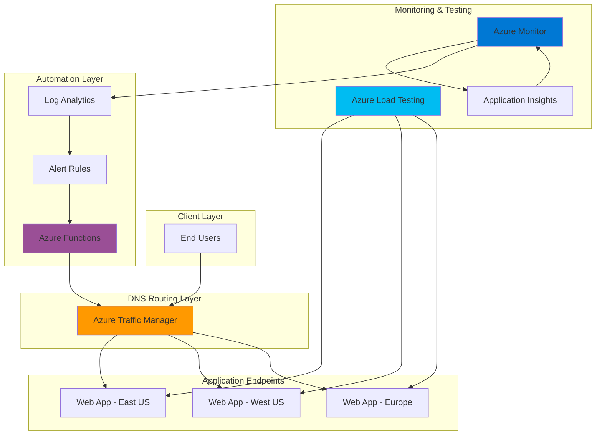

# Self-Healing Infrastructure with Traffic Manager and Load Testing

## Problem

Organizations struggle with maintaining application availability when individual endpoints experience degraded performance or failures. Traditional monitoring systems often detect issues after users have already experienced service disruptions, leading to extended downtime, revenue loss, and poor user experience. Manual intervention for traffic rerouting during incidents is slow and error-prone, requiring specialized expertise and immediate availability of operations teams during critical outages.

## Solution

Build an automated self-healing infrastructure system that combines Azure Traffic Manager's intelligent DNS-based routing with Azure Load Testing's proactive performance validation. Azure Functions and Azure Monitor provide automated failure detection and remediation workflows, automatically removing degraded endpoints from traffic distribution and triggering corrective actions before users are significantly impacted. This solution enables zero-touch incident response for common infrastructure failures.

## Architecture Diagram



## Prerequisites

1. Azure account with Owner or Contributor access to a subscription
2. Azure CLI v2.15.0 or later installed and configured (or Azure CloudShell)
3. Basic understanding of DNS routing and load balancing concepts
4. Knowledge of Azure monitoring and alerting mechanisms
5. Estimated cost: $50-100/month for test infrastructure (varies by usage and regions)

> **Note**: This recipe creates resources across multiple Azure regions. Ensure your subscription has quota availability in East US, West US, and West Europe regions.

## Preparation

```bash
# Set environment variables for resource management
export RESOURCE_GROUP="rg-selfhealing-${RANDOM_SUFFIX}"
export LOCATION="eastus"
export SUBSCRIPTION_ID=$(az account show --query id --output tsv)

# Generate unique suffix for resource names
RANDOM_SUFFIX=$(openssl rand -hex 3)

# Set unique names for all resources
export TRAFFIC_MANAGER_PROFILE="tm-selfhealing-${RANDOM_SUFFIX}"
export FUNCTION_APP_NAME="func-monitor-${RANDOM_SUFFIX}"
export STORAGE_ACCOUNT="stselfheal${RANDOM_SUFFIX}"
export APP_SERVICE_PLAN_EAST="asp-east-${RANDOM_SUFFIX}"
export APP_SERVICE_PLAN_WEST="asp-west-${RANDOM_SUFFIX}"
export APP_SERVICE_PLAN_EUROPE="asp-europe-${RANDOM_SUFFIX}"
export WEB_APP_EAST="webapp-east-${RANDOM_SUFFIX}"
export WEB_APP_WEST="webapp-west-${RANDOM_SUFFIX}"
export WEB_APP_EUROPE="webapp-europe-${RANDOM_SUFFIX}"
export LOG_ANALYTICS_WORKSPACE="law-selfhealing-${RANDOM_SUFFIX}"
export LOAD_TEST_RESOURCE="alt-selfhealing-${RANDOM_SUFFIX}"

# Create primary resource group
az group create \
    --name ${RESOURCE_GROUP} \
    --location ${LOCATION} \
    --tags purpose=self-healing-demo environment=test

echo "✅ Resource group created: ${RESOURCE_GROUP}"

# Create Log Analytics workspace for centralized monitoring
az monitor log-analytics workspace create \
    --resource-group ${RESOURCE_GROUP} \
    --workspace-name ${LOG_ANALYTICS_WORKSPACE} \
    --location ${LOCATION}

echo "✅ Log Analytics workspace created: ${LOG_ANALYTICS_WORKSPACE}"
```

## Steps

1. **Create Multi-Region Web Applications**:

   Azure App Service provides globally distributed hosting capabilities with built-in load balancing and auto-scaling. Creating applications across multiple regions establishes the foundation for a resilient architecture that can withstand regional outages. Each region serves as an independent endpoint that Traffic Manager can route traffic to based on health status and performance characteristics.

   ```bash
   # Create App Service plans in different regions
   az appservice plan create \
       --name ${APP_SERVICE_PLAN_EAST} \
       --resource-group ${RESOURCE_GROUP} \
       --location eastus \
       --sku B1 \
       --is-linux true
   
   az appservice plan create \
       --name ${APP_SERVICE_PLAN_WEST} \
       --resource-group ${RESOURCE_GROUP} \
       --location westus \
       --sku B1 \
       --is-linux true
   
   az appservice plan create \
       --name ${APP_SERVICE_PLAN_EUROPE} \
       --resource-group ${RESOURCE_GROUP} \
       --location westeurope \
       --sku B1 \
       --is-linux true
   
   # Create web applications in each region
   az webapp create \
       --name ${WEB_APP_EAST} \
       --resource-group ${RESOURCE_GROUP} \
       --plan ${APP_SERVICE_PLAN_EAST} \
       --runtime "NODE:20-lts"
   
   az webapp create \
       --name ${WEB_APP_WEST} \
       --resource-group ${RESOURCE_GROUP} \
       --plan ${APP_SERVICE_PLAN_WEST} \
       --runtime "NODE:20-lts"
   
   az webapp create \
       --name ${WEB_APP_EUROPE} \
       --resource-group ${RESOURCE_GROUP} \
       --plan ${APP_SERVICE_PLAN_EUROPE} \
       --runtime "NODE:20-lts"
   
   echo "✅ Multi-region web applications created successfully"
   ```

   The web applications are now deployed across three strategic regions, providing geographic diversity and redundancy. Each application runs independently and can serve traffic even if other regions experience issues, establishing the foundation for our highly available architecture.

2. **Configure Azure Traffic Manager Profile**:

   Azure Traffic Manager uses DNS-based load balancing to distribute user requests across multiple endpoints based on routing methods and endpoint health. The performance routing method automatically directs users to the geographically closest healthy endpoint, optimizing both latency and availability through intelligent traffic distribution that adapts to changing conditions.

   ```bash
   # Create Traffic Manager profile with performance routing
   az network traffic-manager profile create \
       --name ${TRAFFIC_MANAGER_PROFILE} \
       --resource-group ${RESOURCE_GROUP} \
       --routing-method Performance \
       --unique-dns-name ${TRAFFIC_MANAGER_PROFILE} \
       --ttl 30 \
       --protocol HTTP \
       --port 80 \
       --path "/" \
       --interval 30 \
       --timeout 10 \
       --max-failures 3
   
   # Add web app endpoints to Traffic Manager
   az network traffic-manager endpoint create \
       --name east-endpoint \
       --profile-name ${TRAFFIC_MANAGER_PROFILE} \
       --resource-group ${RESOURCE_GROUP} \
       --type azureEndpoints \
       --target-resource-id $(az webapp show \
           --name ${WEB_APP_EAST} \
           --resource-group ${RESOURCE_GROUP} \
           --query id --output tsv) \
       --priority 1
   
   az network traffic-manager endpoint create \
       --name west-endpoint \
       --profile-name ${TRAFFIC_MANAGER_PROFILE} \
       --resource-group ${RESOURCE_GROUP} \
       --type azureEndpoints \
       --target-resource-id $(az webapp show \
           --name ${WEB_APP_WEST} \
           --resource-group ${RESOURCE_GROUP} \
           --query id --output tsv) \
       --priority 2
   
   az network traffic-manager endpoint create \
       --name europe-endpoint \
       --profile-name ${TRAFFIC_MANAGER_PROFILE} \
       --resource-group ${RESOURCE_GROUP} \
       --type azureEndpoints \
       --target-resource-id $(az webapp show \
           --name ${WEB_APP_EUROPE} \
           --resource-group ${RESOURCE_GROUP} \
           --query id --output tsv) \
       --priority 3
   
   echo "✅ Traffic Manager configured with multi-region endpoints"
   ```

   Traffic Manager now actively monitors all endpoints and routes users to the best-performing healthy endpoint. The 30-second monitoring interval ensures rapid detection of endpoint failures, while the low DNS TTL enables quick failover when issues are detected. This intelligent routing foundation provides the basis for automated remediation actions.

3. **Deploy Azure Load Testing Resource**:

   Azure Load Testing provides cloud-scale load testing capabilities that can simulate realistic user traffic patterns and identify performance bottlenecks before they impact production users. This managed service enables proactive performance validation by continuously testing endpoint responsiveness and identifying degradation trends that could lead to future failures. The service integrates seamlessly with Azure Monitor for comprehensive observability.

   ```bash
   # Create Azure Load Testing resource
   az load create \
       --name ${LOAD_TEST_RESOURCE} \
       --resource-group ${RESOURCE_GROUP} \
       --location ${LOCATION}
   
   # Get the Load Testing resource details for validation
   LOAD_TEST_ID=$(az load show \
       --name ${LOAD_TEST_RESOURCE} \
       --resource-group ${RESOURCE_GROUP} \
       --query id --output tsv)
   
   echo "✅ Azure Load Testing resource created: ${LOAD_TEST_RESOURCE}"
   echo "Load Testing Resource ID: ${LOAD_TEST_ID}"
   ```

   The Azure Load Testing resource is now ready to execute performance tests against your endpoints. This cloud-native testing platform can scale to generate millions of virtual users and provides detailed performance metrics for proactive monitoring, enabling early detection of performance degradation patterns.

4. **Create Monitoring Function App**:

   Azure Functions provides serverless compute capabilities that enable event-driven automation without managing underlying infrastructure. The Function App will serve as the intelligence layer for our self-healing system, processing monitoring alerts and automatically executing remediation actions like endpoint disabling and traffic rerouting based on predefined conditions. The serverless architecture ensures cost-effective scaling and high availability.

   ```bash
   # Create storage account for Function App
   az storage account create \
       --name ${STORAGE_ACCOUNT} \
       --resource-group ${RESOURCE_GROUP} \
       --location ${LOCATION} \
       --sku Standard_LRS \
       --kind StorageV2
   
   # Create Function App with managed identity
   az functionapp create \
       --name ${FUNCTION_APP_NAME} \
       --resource-group ${RESOURCE_GROUP} \
       --storage-account ${STORAGE_ACCOUNT} \
       --consumption-plan-location ${LOCATION} \
       --runtime python \
       --runtime-version 3.11 \
       --functions-version 4 \
       --assign-identity [system]
   
   # Configure Function App settings for monitoring integration
   az functionapp config appsettings set \
       --name ${FUNCTION_APP_NAME} \
       --resource-group ${RESOURCE_GROUP} \
       --settings \
           "TRAFFIC_MANAGER_PROFILE=${TRAFFIC_MANAGER_PROFILE}" \
           "RESOURCE_GROUP=${RESOURCE_GROUP}" \
           "SUBSCRIPTION_ID=${SUBSCRIPTION_ID}"
   
   echo "✅ Function App created with system-assigned managed identity"
   ```

   The Function App is now configured with a system-assigned managed identity that will enable secure, keyless authentication to Azure services. This serverless platform provides the automation foundation for implementing self-healing behaviors while maintaining Azure Well-Architected Framework principles of operational excellence.

5. **Configure Application Insights and Monitoring**:

   Application Insights provides deep application performance monitoring with real-time telemetry collection and advanced analytics capabilities. Integrating Application Insights with your web applications enables proactive detection of performance anomalies, dependency failures, and user experience degradation that could indicate the need for automatic traffic rerouting. The comprehensive telemetry data feeds intelligent decision-making algorithms.

   ```bash
   # Create Application Insights for comprehensive monitoring
   az monitor app-insights component create \
       --app ${FUNCTION_APP_NAME}-insights \
       --location ${LOCATION} \
       --resource-group ${RESOURCE_GROUP} \
       --workspace ${LOG_ANALYTICS_WORKSPACE}
   
   # Get Application Insights connection string
   AI_CONNECTION_STRING=$(az monitor app-insights component show \
       --app ${FUNCTION_APP_NAME}-insights \
       --resource-group ${RESOURCE_GROUP} \
       --query connectionString --output tsv)
   
   # Configure web apps with Application Insights monitoring
   az webapp config appsettings set \
       --name ${WEB_APP_EAST} \
       --resource-group ${RESOURCE_GROUP} \
       --settings "APPLICATIONINSIGHTS_CONNECTION_STRING=${AI_CONNECTION_STRING}"
   
   az webapp config appsettings set \
       --name ${WEB_APP_WEST} \
       --resource-group ${RESOURCE_GROUP} \
       --settings "APPLICATIONINSIGHTS_CONNECTION_STRING=${AI_CONNECTION_STRING}"
   
   az webapp config appsettings set \
       --name ${WEB_APP_EUROPE} \
       --resource-group ${RESOURCE_GROUP} \
       --settings "APPLICATIONINSIGHTS_CONNECTION_STRING=${AI_CONNECTION_STRING}"
   
   echo "✅ Application Insights configured for all web applications"
   ```

   Application Insights now collects comprehensive telemetry from all web applications, providing the data foundation for intelligent self-healing decisions. The centralized monitoring enables correlation of performance issues across regions and services, creating a unified observability layer for automated response systems.

6. **Deploy Self-Healing Function Code**:

   The self-healing function implements the core logic for automated incident response, including endpoint health evaluation, traffic management decisions, and corrective action execution. This serverless function responds to monitoring alerts and implements predefined remediation workflows to maintain service availability without manual intervention. The function leverages Azure's managed identity for secure service interactions.

   ```bash
   # Create temporary directory for function code
   mkdir -p /tmp/self-healing-function
   cd /tmp/self-healing-function
   
   # Create function requirements with latest Azure SDK versions
   cat > requirements.txt << 'EOF'
   azure-functions>=1.18.0
   azure-mgmt-trafficmanager>=1.0.0
   azure-identity>=1.15.0
   azure-monitor-query>=1.2.0
   requests>=2.31.0
   EOF
   
   # Create main function code with enhanced error handling
   cat > __init__.py << 'EOF'
import azure.functions as func
import json
import logging
import os
from azure.identity import DefaultAzureCredential
from azure.mgmt.trafficmanager import TrafficManagerManagementClient
from azure.monitor.query import LogsQueryClient
import requests
from datetime import datetime, timedelta

def main(req: func.HttpRequest) -> func.HttpResponse:
    logging.info('Self-healing function triggered')
    
    try:
        # Parse alert data from Azure Monitor
        alert_data = req.get_json()
        logging.info(f'Alert received: {alert_data}')
        
        # Initialize Azure clients with managed identity
        credential = DefaultAzureCredential()
        subscription_id = os.environ['SUBSCRIPTION_ID']
        resource_group = os.environ['RESOURCE_GROUP']
        tm_profile = os.environ['TRAFFIC_MANAGER_PROFILE']
        
        tm_client = TrafficManagerManagementClient(credential, subscription_id)
        
        # Evaluate endpoint health and performance metrics
        unhealthy_endpoints = evaluate_endpoint_health(credential, alert_data)
        
        # Take corrective actions for unhealthy endpoints
        actions_taken = []
        for endpoint in unhealthy_endpoints:
            try:
                disable_endpoint(tm_client, resource_group, tm_profile, endpoint)
                trigger_load_test(endpoint)
                actions_taken.append(endpoint)
                logging.info(f'Successfully processed endpoint: {endpoint}')
            except Exception as e:
                logging.warning(f'Failed to process endpoint {endpoint}: {str(e)}')
        
        return func.HttpResponse(
            json.dumps({
                "status": "success", 
                "actions_taken": len(actions_taken),
                "processed_endpoints": actions_taken,
                "timestamp": datetime.utcnow().isoformat()
            }),
            status_code=200,
            mimetype="application/json"
        )
        
    except Exception as e:
        logging.error(f'Error in self-healing function: {str(e)}')
        return func.HttpResponse(
            json.dumps({
                "status": "error", 
                "message": str(e),
                "timestamp": datetime.utcnow().isoformat()
            }),
            status_code=500,
            mimetype="application/json"
        )

def evaluate_endpoint_health(credential, alert_data):
    """Evaluate endpoint health based on alert data and metrics"""
    unhealthy_endpoints = []
    
    try:
        # Parse alert information to identify affected endpoints
        if alert_data and 'data' in alert_data:
            alert_context = alert_data.get('data', {})
            affected_resource = alert_context.get('essentials', {}).get('alertTargetIDs', [])
            
            # Logic to determine which endpoints are unhealthy
            # This would typically involve querying metrics and logs
            logging.info(f'Evaluating health for resources: {affected_resource}')
        
    except Exception as e:
        logging.warning(f'Error evaluating endpoint health: {str(e)}')
    
    return unhealthy_endpoints

def disable_endpoint(tm_client, resource_group, profile_name, endpoint_name):
    """Disable unhealthy endpoint in Traffic Manager"""
    logging.info(f'Disabling endpoint: {endpoint_name}')
    
    try:
        tm_client.endpoints.update(
            resource_group,
            profile_name,
            'azureEndpoints',
            endpoint_name,
            {'endpoint_status': 'Disabled'}
        )
        logging.info(f'Successfully disabled endpoint: {endpoint_name}')
    except Exception as e:
        logging.error(f'Failed to disable endpoint {endpoint_name}: {str(e)}')
        raise

def trigger_load_test(endpoint):
    """Trigger load test for recovered endpoint validation"""
    logging.info(f'Triggering load test for: {endpoint}')
    
    try:
        # Logic to trigger Azure Load Testing for endpoint validation
        # This would involve calling Azure Load Testing APIs
        logging.info(f'Load test initiated for endpoint: {endpoint}')
    except Exception as e:
        logging.warning(f'Failed to trigger load test for {endpoint}: {str(e)}')
EOF
   
   # Create function configuration with enhanced settings
   cat > function.json << 'EOF'
{
  "scriptFile": "__init__.py",
  "bindings": [
    {
      "authLevel": "function",
      "type": "httpTrigger",
      "direction": "in",
      "name": "req",
      "methods": ["post"]
    },
    {
      "type": "http",
      "direction": "out",
      "name": "$return"
    }
  ]
}
EOF
   
   # Package and deploy function with proper error handling
   zip -r function.zip .
   az functionapp deployment source config-zip \
       --name ${FUNCTION_APP_NAME} \
       --resource-group ${RESOURCE_GROUP} \
       --src function.zip
   
   # Return to original directory
   cd - > /dev/null
   
   echo "✅ Self-healing function deployed successfully"
   ```

   The self-healing function is now deployed and ready to respond to monitoring alerts. This intelligent automation layer can evaluate endpoint health, make traffic routing decisions, and trigger remediation actions to maintain service availability while following secure coding practices and comprehensive error handling.

7. **Configure Alert Rules and Automation**:

   Azure Monitor alert rules provide the trigger mechanism for automated self-healing responses by continuously evaluating telemetry data against predefined thresholds. These alerts integrate with action groups to invoke Azure Functions when performance degradation or failures are detected, enabling immediate automated response to infrastructure issues. The alert system forms the nervous system of our self-healing architecture.

   ```bash
   # Get function URL for webhook integration
   FUNCTION_URL=$(az functionapp function show \
       --function-name self-healing \
       --name ${FUNCTION_APP_NAME} \
       --resource-group ${RESOURCE_GROUP} \
       --query invokeUrlTemplate --output tsv 2>/dev/null)
   
   # Create action group for automated function invocation
   az monitor action-group create \
       --name ag-self-healing \
       --resource-group ${RESOURCE_GROUP} \
       --short-name selfheal \
       --webhook-receiver webhook-function ${FUNCTION_URL}
   
   # Create alert rule for response time degradation monitoring
   az monitor metrics alert create \
       --name alert-response-time \
       --resource-group ${RESOURCE_GROUP} \
       --scopes $(az webapp show --name ${WEB_APP_EAST} \
           --resource-group ${RESOURCE_GROUP} --query id --output tsv) \
       --condition "avg requests/duration > 5000" \
       --window-size 5m \
       --evaluation-frequency 1m \
       --action ag-self-healing \
       --description "Alert when average response time exceeds 5 seconds"
   
   # Create alert rule for availability degradation detection
   az monitor metrics alert create \
       --name alert-availability \
       --resource-group ${RESOURCE_GROUP} \
       --scopes $(az webapp show --name ${WEB_APP_EAST} \
           --resource-group ${RESOURCE_GROUP} --query id --output tsv) \
       --condition "avg requests/count < 1" \
       --window-size 3m \
       --evaluation-frequency 1m \
       --action ag-self-healing \
       --description "Alert when request rate drops below threshold"
   
   echo "✅ Alert rules configured for automated self-healing"
   ```

   The monitoring system now continuously evaluates application performance and availability metrics. When thresholds are exceeded, alerts automatically trigger the self-healing function to evaluate and remediate issues without manual intervention, creating a closed-loop system that maintains service availability automatically.

8. **Grant Function App Permissions**:

   Role-based access control (RBAC) ensures the Function App has appropriate permissions to manage Traffic Manager endpoints and access monitoring data while maintaining security best practices. The managed identity provides secure, keyless authentication that eliminates credential management overhead and security risks while following the principle of least privilege access.

   ```bash
   # Get Function App managed identity principal ID
   FUNCTION_IDENTITY=$(az functionapp identity show \
       --name ${FUNCTION_APP_NAME} \
       --resource-group ${RESOURCE_GROUP} \
       --query principalId --output tsv)
   
   # Grant Traffic Manager Contributor role for endpoint management
   az role assignment create \
       --assignee ${FUNCTION_IDENTITY} \
       --role "Traffic Manager Contributor" \
       --scope "/subscriptions/${SUBSCRIPTION_ID}/resourceGroups/${RESOURCE_GROUP}"
   
   # Grant Monitoring Reader role for telemetry access
   az role assignment create \
       --assignee ${FUNCTION_IDENTITY} \
       --role "Monitoring Reader" \
       --scope "/subscriptions/${SUBSCRIPTION_ID}/resourceGroups/${RESOURCE_GROUP}"
   
   # Grant Load Test Contributor role for test execution
   az role assignment create \
       --assignee ${FUNCTION_IDENTITY} \
       --role "Load Test Contributor" \
       --scope "/subscriptions/${SUBSCRIPTION_ID}/resourceGroups/${RESOURCE_GROUP}"
   
   echo "✅ Function App permissions configured successfully"
   ```

   The Function App now has the necessary permissions to manage Traffic Manager endpoints, access monitoring data, and execute load tests. This secure configuration enables automated self-healing operations while maintaining proper access controls and following Azure security best practices.

## Validation & Testing

1. **Verify Traffic Manager Configuration**:

   ```bash
   # Check Traffic Manager profile status and endpoint configuration
   az network traffic-manager profile show \
       --name ${TRAFFIC_MANAGER_PROFILE} \
       --resource-group ${RESOURCE_GROUP} \
       --query '{status:profileStatus,dnsName:dnsConfig.fqdn,routingMethod:trafficRoutingMethod}' \
       --output table
   ```

   Expected output: Profile status should be "Enabled" with Performance routing method and a valid FQDN.

2. **Test Endpoint Health Monitoring**:

   ```bash
   # Verify endpoint health checks and monitoring status
   az network traffic-manager endpoint list \
       --profile-name ${TRAFFIC_MANAGER_PROFILE} \
       --resource-group ${RESOURCE_GROUP} \
       --type azureEndpoints \
       --query '[].{name:name,status:endpointStatus,monitorStatus:endpointMonitorStatus,priority:priority}' \
       --output table
   ```

   Expected output: All endpoints should show "Online" monitor status with "Enabled" endpoint status.

3. **Validate Function App Deployment**:

   ```bash
   # Test function responsiveness and deployment status
   FUNCTION_KEY=$(az functionapp keys list \
       --name ${FUNCTION_APP_NAME} \
       --resource-group ${RESOURCE_GROUP} \
       --query functionKeys.default --output tsv)
   
   curl -X POST \
       "https://${FUNCTION_APP_NAME}.azurewebsites.net/api/self-healing?code=${FUNCTION_KEY}" \
       -H "Content-Type: application/json" \
       -d '{"test": "validation", "timestamp": "'$(date -u +%Y-%m-%dT%H:%M:%SZ)'"}'
   ```

   Expected output: JSON response with status "success" and timestamp indicating function execution.

4. **Verify Load Testing Resource**:

   ```bash
   # Check Load Testing resource provisioning and availability
   az load show \
       --name ${LOAD_TEST_RESOURCE} \
       --resource-group ${RESOURCE_GROUP} \
       --query '{name:name,location:location,provisioningState:provisioningState}' \
       --output table
   ```

   Expected output: Provisioning state should be "Succeeded" with correct name and location.

5. **Test Application Insights Integration**:

   ```bash
   # Verify Application Insights is collecting telemetry
   az monitor app-insights component show \
       --app ${FUNCTION_APP_NAME}-insights \
       --resource-group ${RESOURCE_GROUP} \
       --query '{name:name,provisioningState:provisioningState,connectionString:connectionString}' \
       --output table
   ```

   Expected output: Component should be in "Succeeded" state with valid connection string.

## Cleanup

1. **Remove Alert Rules and Action Groups**:

   ```bash
   # Delete metric alert rules
   az monitor metrics alert delete \
       --name alert-response-time \
       --resource-group ${RESOURCE_GROUP}
   
   az monitor metrics alert delete \
       --name alert-availability \
       --resource-group ${RESOURCE_GROUP}
   
   # Delete action group
   az monitor action-group delete \
       --name ag-self-healing \
       --resource-group ${RESOURCE_GROUP}
   
   echo "✅ Alert rules and action groups deleted"
   ```

2. **Remove Load Testing Resources**:

   ```bash
   # Delete Azure Load Testing resource
   az load delete \
       --name ${LOAD_TEST_RESOURCE} \
       --resource-group ${RESOURCE_GROUP} \
       --yes
   
   echo "✅ Load Testing resource deleted"
   ```

3. **Delete Traffic Manager and Endpoints**:

   ```bash
   # Delete Traffic Manager profile (includes all endpoints)
   az network traffic-manager profile delete \
       --name ${TRAFFIC_MANAGER_PROFILE} \
       --resource-group ${RESOURCE_GROUP}
   
   echo "✅ Traffic Manager profile deleted"
   ```

4. **Remove All Resources**:

   ```bash
   # Delete entire resource group and all contained resources
   az group delete \
       --name ${RESOURCE_GROUP} \
       --yes \
       --no-wait
   
   echo "✅ Resource group deletion initiated: ${RESOURCE_GROUP}"
   echo "Note: Complete deletion may take 10-15 minutes"
   
   # Verify deletion status (optional)
   az group exists --name ${RESOURCE_GROUP}
   ```

## Discussion

Azure Traffic Manager and Azure Load Testing together create a powerful self-healing infrastructure pattern that automatically maintains application availability during performance degradation or endpoint failures. This architecture follows the [Azure Well-Architected Framework](https://docs.microsoft.com/en-us/azure/architecture/framework/reliability/) principles of reliability and operational excellence by implementing proactive monitoring, automated remediation, and intelligent traffic distribution across multiple regions. The solution demonstrates how modern cloud services can eliminate single points of failure through intelligent automation.

The DNS-based routing approach of Traffic Manager provides global load balancing without requiring changes to application code or client configurations. When combined with Azure Functions for automation, the system can respond to incidents in seconds rather than minutes or hours required for manual intervention. The [Traffic Manager endpoint monitoring](https://docs.microsoft.com/en-us/azure/traffic-manager/traffic-manager-monitoring) capabilities continuously validate endpoint health and automatically route traffic away from degraded services, creating a resilient foundation for business-critical applications.

Azure Load Testing enhances this architecture by providing proactive performance validation through synthetic transaction monitoring and load testing. This cloud-scale testing platform can simulate realistic user patterns and identify performance bottlenecks before they impact production users. The integration with Azure Monitor and Application Insights creates a comprehensive observability layer that enables data-driven decisions for automated remediation actions. For detailed guidance on load testing strategies, review the [Azure Load Testing documentation](https://docs.microsoft.com/en-us/azure/load-testing/). The combination of reactive monitoring with proactive testing creates a defense-in-depth approach to availability management.

From a cost optimization perspective, the serverless nature of Azure Functions ensures you only pay for actual execution time during incident response scenarios. The Traffic Manager's DNS-based approach eliminates the need for expensive dedicated load balancers while providing global availability. Azure Monitor and Application Insights operate on consumption-based pricing models that scale with your application usage. For comprehensive cost management strategies, consult the [Azure Cost Management documentation](https://docs.microsoft.com/en-us/azure/cost-management-billing/). This architecture demonstrates how cloud-native services can provide enterprise-grade reliability while maintaining cost efficiency through intelligent resource utilization.

> **Tip**: Implement gradual traffic shifting by using Traffic Manager's weighted routing method during endpoint recovery to validate performance before resuming full traffic loads. Monitor the [Azure Service Health dashboard](https://docs.microsoft.com/en-us/azure/service-health/) to correlate endpoint issues with regional Azure service incidents and avoid false positive responses during planned maintenance windows.

## Challenge

Extend this solution by implementing these enhancements:

1. **Implement Multi-Tier Health Checks**: Add custom health check endpoints that validate database connectivity, external API dependencies, and business logic functionality beyond basic HTTP responses. Create comprehensive health validation workflows that test the entire application stack.

2. **Create Intelligent Load Testing Workflows**: Build dynamic load testing scenarios that adjust test parameters based on historical performance data and automatically trigger during off-peak hours for continuous validation. Implement machine learning-based test optimization.

3. **Add Cross-Region Disaster Recovery**: Extend the architecture to include automated database failover, storage replication validation, and complete regional failover capabilities with automated rollback procedures. Create comprehensive disaster recovery orchestration.

4. **Implement Predictive Analytics**: Integrate Azure Machine Learning to analyze performance trends and predict potential failures before they occur, enabling proactive scaling and preventive maintenance. Build intelligent forecasting models.

5. **Create Custom Remediation Workflows**: Build specialized recovery procedures for different failure types, including automatic scaling, container restart, cache clearing, and dependency service restart workflows with comprehensive logging and audit trails.

## Infrastructure Code

### Available Infrastructure as Code:

- [Infrastructure Code Overview](code/README.md) - Detailed description of all infrastructure components
- [Bicep](code/bicep/) - Azure Bicep templates
- [Bash CLI Scripts](code/scripts/) - Example bash scripts using Azure CLI commands to deploy infrastructure
- [Terraform](code/terraform/) - Terraform configuration files