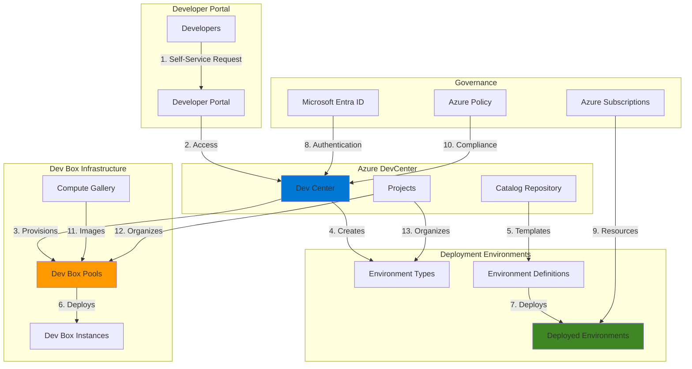

# Self-Service Developer Infrastructure with Dev Box and Deployment Environments

## Problem

Development teams face significant productivity losses when waiting for IT to provision development workstations and project environments. Traditional approaches require manual IT intervention for each developer request, creating bottlenecks that delay project onboarding by days or weeks. Additionally, maintaining consistency across development environments while ensuring security compliance becomes increasingly challenging as teams scale, leading to configuration drift and security vulnerabilities.

## Solution

Azure Dev Box and Azure Deployment Environments together provide a comprehensive self-service platform that empowers developers to instantly provision cloud-based development workstations and project-specific infrastructure. This solution combines ready-to-code dev boxes with on-demand deployment environments, all managed through Azure DevCenter with centralized governance, ensuring consistent, secure, and compliant development infrastructure without IT bottlenecks.

## Architecture Diagram



## Prerequisites

1. Azure subscription with Owner or Contributor role permissions
2. Azure CLI v2.61.0 or later installed and configured (or use Azure Cloud Shell)
3. Microsoft Entra ID with appropriate user licenses for Dev Box (Microsoft 365 E3/E5 or Windows 365)
4. Basic knowledge of Azure resource management and identity concepts
5. GitHub repository or Azure DevOps repo for storing environment definitions (optional but recommended)
6. Estimated cost: $8-15/hour per active Dev Box when running, Deployment Environments usage-based

> **Note**: Azure Dev Box requires specific licensing. Ensure your organization has appropriate Microsoft 365 or Windows 365 licenses before proceeding. The licensing cost is separate from Azure compute costs.

## Preparation

```bash
# Set environment variables for the deployment
export RESOURCE_GROUP="rg-devinfra-${RANDOM_SUFFIX}"
export LOCATION="eastus"
export DEVCENTER_NAME="dc-selfservice-${RANDOM_SUFFIX}"
export PROJECT_NAME="proj-webapp-team"
export SUBSCRIPTION_ID=$(az account show --query id --output tsv)

# Generate unique suffix for resource names
RANDOM_SUFFIX=$(openssl rand -hex 3)

# Install and update the devcenter extension
az extension add --name devcenter --upgrade

# Create the resource group
az group create \
    --name ${RESOURCE_GROUP} \
    --location ${LOCATION} \
    --tags purpose=demo environment=development

# Register required resource providers
az provider register --namespace Microsoft.DevCenter
az provider register --namespace Microsoft.Network
az provider register --namespace Microsoft.Compute

# Wait for provider registration
echo "⏳ Waiting for resource provider registration..."
sleep 45

echo "✅ Preparation completed successfully"
```

## Steps

1. **Create the Azure DevCenter**:

   Azure DevCenter serves as the centralized management plane for both Dev Box and Deployment Environments. It provides a unified location to configure developer infrastructure, attach catalogs with environment templates, and manage security policies. This foundational step establishes the governance framework that ensures all developer resources comply with organizational standards while enabling self-service capabilities.

   ```bash
   # Create the dev center with system-assigned managed identity
   az devcenter admin devcenter create \
       --name ${DEVCENTER_NAME} \
       --resource-group ${RESOURCE_GROUP} \
       --location ${LOCATION} \
       --identity-type SystemAssigned
   
   # Get the dev center's principal ID for role assignments
   DEVCENTER_PRINCIPAL_ID=$(az devcenter admin devcenter show \
       --name ${DEVCENTER_NAME} \
       --resource-group ${RESOURCE_GROUP} \
       --query identity.principalId \
       --output tsv)
   
   echo "✅ Dev Center created with ID: ${DEVCENTER_PRINCIPAL_ID}"
   ```

   The DevCenter now has a managed identity that will be used to provision resources on behalf of developers. This identity-based approach eliminates the need for developers to have direct permissions on subscriptions while maintaining security boundaries.

2. **Configure DevCenter Permissions**:

   Proper role assignments are critical for enabling the DevCenter to create and manage resources across your Azure environment. The Contributor role allows resource creation, while User Access Administrator enables the DevCenter to assign appropriate permissions to deployed environments. This delegation model maintains least-privilege access while enabling self-service functionality.

   ```bash
   # Assign Contributor role to enable resource creation
   az role assignment create \
       --assignee ${DEVCENTER_PRINCIPAL_ID} \
       --role "Contributor" \
       --scope "/subscriptions/${SUBSCRIPTION_ID}"
   
   # Assign User Access Administrator for managing identities
   az role assignment create \
       --assignee ${DEVCENTER_PRINCIPAL_ID} \
       --role "User Access Administrator" \
       --scope "/subscriptions/${SUBSCRIPTION_ID}"
   
   echo "✅ DevCenter permissions configured"
   ```

3. **Attach Quick Start Catalog**:

   Catalogs contain Infrastructure-as-Code templates that define deployment environments. The Microsoft quick start catalog provides pre-built templates for common scenarios like web apps, databases, and microservices architectures. This accelerates adoption by giving teams immediate access to production-ready templates while they develop custom ones.

   ```bash
   # Attach the Microsoft quick start catalog
   az devcenter admin catalog create \
       --name "QuickStartCatalog" \
       --dev-center ${DEVCENTER_NAME} \
       --resource-group ${RESOURCE_GROUP} \
       --git-hub uri="https://github.com/microsoft/devcenter-catalog.git" \
       --branch "main" \
       --path "/Environment-Definitions"
   
   # Wait for catalog sync to complete
   echo "⏳ Waiting for catalog synchronization..."
   sleep 90
   
   # Verify catalog sync status
   SYNC_STATE=$(az devcenter admin catalog show \
       --name "QuickStartCatalog" \
       --dev-center ${DEVCENTER_NAME} \
       --resource-group ${RESOURCE_GROUP} \
       --query syncState \
       --output tsv)
   
   echo "Catalog sync state: ${SYNC_STATE}"
   echo "✅ Quick start catalog attached and synchronized"
   ```

4. **Create Environment Types**:

   Environment types represent different stages of your development lifecycle, such as development, staging, and production. Each type can have different policies, resource limits, and access controls. This abstraction allows platform teams to enforce governance while giving developers flexibility within defined boundaries.

   ```bash
   # Create Development environment type
   az devcenter admin environment-type create \
       --name "Development" \
       --dev-center ${DEVCENTER_NAME} \
       --resource-group ${RESOURCE_GROUP} \
       --tags purpose=development cost-center=engineering
   
   # Create Staging environment type
   az devcenter admin environment-type create \
       --name "Staging" \
       --dev-center ${DEVCENTER_NAME} \
       --resource-group ${RESOURCE_GROUP} \
       --tags purpose=staging cost-center=engineering
   
   echo "✅ Environment types created"
   ```

5. **Create Network Configuration for Dev Boxes**:

   Network configuration defines how Dev Boxes connect to your corporate resources and the internet. Using Azure Virtual Networks ensures Dev Boxes can securely access on-premises resources, private Azure services, and corporate applications while maintaining network isolation and security policies.

   ```bash
   # Create a virtual network for Dev Boxes
   az network vnet create \
       --name "vnet-devbox-${RANDOM_SUFFIX}" \
       --resource-group ${RESOURCE_GROUP} \
       --location ${LOCATION} \
       --address-prefix 10.0.0.0/16 \
       --subnet-name "snet-devbox" \
       --subnet-prefix 10.0.1.0/24
   
   # Create network connection for Dev Center
   az devcenter admin network-connection create \
       --name "nc-devbox-${RANDOM_SUFFIX}" \
       --resource-group ${RESOURCE_GROUP} \
       --location ${LOCATION} \
       --subnet-id "/subscriptions/${SUBSCRIPTION_ID}/resourceGroups/${RESOURCE_GROUP}/providers/Microsoft.Network/virtualNetworks/vnet-devbox-${RANDOM_SUFFIX}/subnets/snet-devbox" \
       --domain-join-type "AzureADJoin"
   
   # Wait for network connection provisioning
   echo "⏳ Waiting for network connection provisioning..."
   sleep 60
   
   # Attach network connection to dev center
   az devcenter admin attached-network create \
       --name "default" \
       --dev-center ${DEVCENTER_NAME} \
       --resource-group ${RESOURCE_GROUP} \
       --network-connection-resource-id "/subscriptions/${SUBSCRIPTION_ID}/resourceGroups/${RESOURCE_GROUP}/providers/Microsoft.DevCenter/networkConnections/nc-devbox-${RANDOM_SUFFIX}"
   
   echo "✅ Network configuration completed"
   ```

6. **Create Dev Box Definition**:

   Dev Box definitions specify the hardware configuration and base image for developer workstations. This step creates a high-performance configuration with Visual Studio pre-installed, eliminating hours of manual setup for each developer. The definition ensures consistency across all team members while allowing customization through additional tools and configurations.

   ```bash
   # Create a Dev Box definition with Visual Studio and hibernation support
   az devcenter admin devbox-definition create \
       --name "VSEnterprise-8cpu-32gb" \
       --dev-center ${DEVCENTER_NAME} \
       --resource-group ${RESOURCE_GROUP} \
       --location ${LOCATION} \
       --image-reference name="MicrosoftWindowsDesktop_Windows-11-Enterprise-Microsoft-365-Apps_win11-24h2-ent-cpc-m365" \
       --sku-name "general_i_8c32gb256ssd_v2" \
       --hibernate-support "Enabled"
   
   echo "✅ Dev Box definition created with hibernation support"
   ```

   The Dev Box definition now supports hibernation, which significantly reduces costs by allowing idle dev boxes to be paused while preserving the current state of applications and work.

7. **Create Project and Configure Access**:

   Projects organize resources by team or application, providing a logical boundary for access control and resource management. This structure enables different teams to have isolated environments while sharing common infrastructure. Project-level permissions ensure developers only access resources relevant to their work.

   ```bash
   # Create a project for the web application team
   az devcenter admin project create \
       --name ${PROJECT_NAME} \
       --resource-group ${RESOURCE_GROUP} \
       --location ${LOCATION} \
       --dev-center-id "/subscriptions/${SUBSCRIPTION_ID}/resourceGroups/${RESOURCE_GROUP}/providers/Microsoft.DevCenter/devcenters/${DEVCENTER_NAME}" \
       --description "Web application team development project"
   
   # Create project environment types
   az devcenter admin project-environment-type create \
       --name "Development" \
       --project ${PROJECT_NAME} \
       --resource-group ${RESOURCE_GROUP} \
       --dev-center ${DEVCENTER_NAME} \
       --deployment-target-id "/subscriptions/${SUBSCRIPTION_ID}" \
       --identity-type "SystemAssigned" \
       --status "Enabled"
   
   echo "✅ Project created and configured"
   ```

8. **Create Dev Box Pool**:

   Dev Box pools define collections of Dev Boxes with specific configurations and auto-stop schedules. The pool configuration includes the network connection, Dev Box definition, and licensing settings. Auto-stop schedules are crucial for cost management, automatically shutting down idle Dev Boxes to prevent unnecessary charges.

   ```bash
   # Create a Dev Box pool with auto-stop schedule
   az devcenter admin pool create \
       --name "WebDevPool" \
       --project ${PROJECT_NAME} \
       --resource-group ${RESOURCE_GROUP} \
       --devbox-definition-name "VSEnterprise-8cpu-32gb" \
       --network-connection-name "default" \
       --local-administrator "Enabled" \
       --location ${LOCATION}
   
   # Create auto-stop schedule (stop at 7 PM Eastern time)
   az devcenter admin schedule create \
       --name "AutoStop-7PM" \
       --pool-name "WebDevPool" \
       --project ${PROJECT_NAME} \
       --resource-group ${RESOURCE_GROUP} \
       --state "Enabled" \
       --type "StopDevBox" \
       --frequency "Daily" \
       --time "19:00" \
       --timezone "Eastern Standard Time"
   
   echo "✅ Dev Box pool created with auto-stop schedule"
   ```

   The auto-stop schedule ensures cost optimization by automatically hibernating Dev Boxes at 7 PM daily, reducing compute costs while preserving developer work state.

9. **Assign Developer Access**:

   Role-based access control ensures developers can self-serve resources without compromising security. The DevCenter Dev Box User role allows developers to create and manage their own Dev Boxes, while the Deployment Environments User role enables them to deploy infrastructure. This granular permission model maintains security while enabling productivity.

   ```bash
   # Get the current user's object ID for demo purposes
   CURRENT_USER_ID=$(az ad signed-in-user show --query id --output tsv)
   
   # Assign Dev Box User role
   az role assignment create \
       --assignee ${CURRENT_USER_ID} \
       --role "DevCenter Dev Box User" \
       --scope "/subscriptions/${SUBSCRIPTION_ID}/resourceGroups/${RESOURCE_GROUP}/providers/Microsoft.DevCenter/projects/${PROJECT_NAME}"
   
   # Assign Deployment Environments User role
   az role assignment create \
       --assignee ${CURRENT_USER_ID} \
       --role "Deployment Environments User" \
       --scope "/subscriptions/${SUBSCRIPTION_ID}/resourceGroups/${RESOURCE_GROUP}/providers/Microsoft.DevCenter/projects/${PROJECT_NAME}"
   
   echo "✅ Developer access configured"
   ```

   Developers can now access the developer portal at https://devportal.microsoft.com to create Dev Boxes and deployment environments on-demand. The self-service experience eliminates IT bottlenecks while maintaining governance through the policies configured in previous steps.

## Validation & Testing

1. Verify DevCenter configuration:

   ```bash
   # Check DevCenter status
   az devcenter admin devcenter show \
       --name ${DEVCENTER_NAME} \
       --resource-group ${RESOURCE_GROUP} \
       --output table
   
   # List attached catalogs
   az devcenter admin catalog list \
       --dev-center ${DEVCENTER_NAME} \
       --resource-group ${RESOURCE_GROUP} \
       --output table
   ```

   Expected output: DevCenter should show as "Succeeded" provisioning state with attached catalog in "Synced" state.

2. Validate project configuration:

   ```bash
   # Show project details
   az devcenter admin project show \
       --name ${PROJECT_NAME} \
       --resource-group ${RESOURCE_GROUP} \
       --output json
   
   # List Dev Box pools
   az devcenter admin pool list \
       --project ${PROJECT_NAME} \
       --resource-group ${RESOURCE_GROUP} \
       --output table
   ```

3. Test developer portal access:

   ```bash
   # Get developer portal URL
   echo "Developer Portal URL: https://devportal.microsoft.com"
   echo "Project Name: ${PROJECT_NAME}"
   
   # List available environment definitions
   az devcenter dev environment-definition list \
       --project ${PROJECT_NAME} \
       --dev-center ${DEVCENTER_NAME} \
       --output table
   ```

4. Verify role assignments:

   ```bash
   # Check role assignments for current user
   az role assignment list \
       --assignee ${CURRENT_USER_ID} \
       --scope "/subscriptions/${SUBSCRIPTION_ID}/resourceGroups/${RESOURCE_GROUP}/providers/Microsoft.DevCenter/projects/${PROJECT_NAME}" \
       --output table
   ```

## Cleanup

1. Delete project resources:

   ```bash
   # Delete the project (this removes pools and environment types)
   az devcenter admin project delete \
       --name ${PROJECT_NAME} \
       --resource-group ${RESOURCE_GROUP} \
       --yes \
       --no-wait
   
   echo "✅ Project deletion initiated"
   ```

2. Remove DevCenter and network resources:

   ```bash
   # Delete network connection
   az devcenter admin network-connection delete \
       --name "nc-devbox-${RANDOM_SUFFIX}" \
       --resource-group ${RESOURCE_GROUP} \
       --yes \
       --no-wait
   
   # Delete the dev center
   az devcenter admin devcenter delete \
       --name ${DEVCENTER_NAME} \
       --resource-group ${RESOURCE_GROUP} \
       --yes \
       --no-wait
   
   echo "✅ DevCenter and network resources deletion initiated"
   ```

3. Clean up remaining Azure resources:

   ```bash
   # Delete the resource group and all contained resources
   az group delete \
       --name ${RESOURCE_GROUP} \
       --yes \
       --no-wait
   
   echo "✅ Resource group deletion initiated: ${RESOURCE_GROUP}"
   echo "Note: Full cleanup may take 10-15 minutes to complete"
   ```

## Discussion

Azure Dev Box and Azure Deployment Environments fundamentally transform how development teams access and manage infrastructure by implementing a self-service model that balances developer productivity with enterprise governance. This platform approach addresses the traditional friction between development velocity and IT control by providing governed self-service capabilities. According to the [Azure Well-Architected Framework](https://learn.microsoft.com/en-us/azure/architecture/framework/), this model exemplifies operational excellence by automating repetitive tasks and enabling teams to focus on value-adding activities.

The integration between Dev Box and Deployment Environments creates a cohesive developer experience where workstations and project infrastructure are provisioned from the same portal with consistent governance. Dev Box leverages Windows 365 technology to provide high-performance, cloud-based development workstations that can be accessed from any device, while Deployment Environments uses Infrastructure-as-Code templates to provision consistent project resources. This combination is particularly powerful for scenarios like microservices development, where developers need both powerful workstations and complex multi-service environments. The [Microsoft Dev Box documentation](https://learn.microsoft.com/en-us/azure/dev-box/) provides extensive guidance on optimizing these workstations for different development scenarios.

From a cost optimization perspective, the consumption-based model with hibernation and auto-stop schedules ensures organizations only pay for active usage. Dev Boxes can automatically hibernate during non-working hours, preserving the complete state of applications and work while eliminating compute charges. Deployment environments can be configured with expiration policies to prevent resource sprawl. The platform's integration with [Azure Cost Management](https://learn.microsoft.com/en-us/azure/cost-management-billing/costs/overview-cost-management) enables detailed tracking of development infrastructure costs by project, team, or individual developer. For additional cost optimization strategies specific to development environments, refer to the [Azure cost optimization documentation](https://learn.microsoft.com/en-us/azure/architecture/framework/cost/optimize-dev-test).

Security and compliance are built into the platform through Microsoft Entra ID integration, managed identities, and policy-based governance. Dev Boxes are managed like any other corporate device through Microsoft Intune, enabling consistent security policies across cloud and on-premises workstations. The [Azure security baseline for DevCenter](https://learn.microsoft.com/en-us/security/benchmark/azure/baselines/dev-box-security-baseline) provides comprehensive guidance on implementing defense-in-depth security for developer infrastructure.

> **Tip**: Start with a pilot project to establish patterns and gather feedback before rolling out to all development teams. Use Azure Policy to enforce naming conventions and resource tags for better cost tracking and compliance reporting. Enable hibernation on all Dev Box definitions to maximize cost savings.

## Challenge

Extend this solution by implementing these enhancements:

1. Create custom environment definitions in a Git repository that include your organization's standard application architectures, then attach this repository as an additional catalog to provide team-specific templates

2. Implement automated Dev Box customization using Azure Image Builder and PowerShell DSC that installs team-specific development tools, configures Git repositories, and sets up development certificates when a new Dev Box is created

3. Integrate the deployment environments with your CI/CD pipelines using GitHub Actions or Azure DevOps to automatically provision ephemeral environments for pull request validation, enabling developers to test changes in isolated environments before merging

4. Build a comprehensive cost optimization dashboard using Azure Monitor Workbooks and Log Analytics that tracks Dev Box usage patterns, identifies idle resources, and provides recommendations for right-sizing Dev Box definitions based on actual CPU and memory utilization

5. Implement a governance framework using Azure Policy that enforces security baselines for all Dev Boxes and deployment environments, including required security agents, network restrictions, and compliance scanning with automatic remediation

## Infrastructure Code

*Infrastructure code will be generated after recipe approval.*