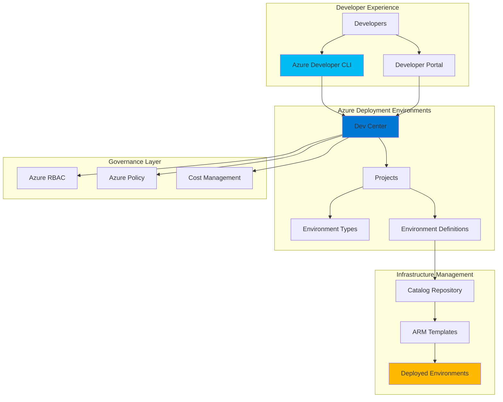

# Self-Service Infrastructure Lifecycle with Azure Deployment Environments and Developer CLI

## Problem

Development teams often struggle with lengthy infrastructure provisioning processes, where requesting environments requires manual approval workflows, infrastructure team involvement, and extensive wait times. This creates bottlenecks that slow down development cycles and reduce team productivity. Additionally, enterprises need to maintain governance controls and cost oversight while enabling developer autonomy, creating a complex balance between agility and compliance requirements.

## Solution

Azure Deployment Environments combined with Azure Developer CLI provides a comprehensive self-service infrastructure platform that enables developers to provision, manage, and teardown standardized environments on-demand. This solution empowers development teams with instant access to pre-approved infrastructure templates while maintaining enterprise governance, cost controls, and security policies through centralized management and automated lifecycle policies.

## Architecture Diagram



## Prerequisites

1. Azure subscription with Contributor access or higher
2. Azure CLI v2.50.0 or later installed and configured
3. Azure Developer CLI (azd) v1.5.0 or later installed
4. Git repository access for storing infrastructure templates
5. Understanding of Azure Resource Manager templates and infrastructure as code
6. Estimated cost: $50-150/month depending on deployed environments

> **Note**: Azure Deployment Environments requires specific Azure subscription features. Review the [Azure Deployment Environments documentation](https://docs.microsoft.com/en-us/azure/deployment-environments/) for detailed prerequisites and regional availability.

## Preparation

```bash
# Set environment variables for Azure resources
export RESOURCE_GROUP="rg-devcenter-${RANDOM_SUFFIX}"
export LOCATION="eastus"
export SUBSCRIPTION_ID=$(az account show --query id --output tsv)

# Generate unique suffix for resource names
RANDOM_SUFFIX=$(openssl rand -hex 3)

# Set specific resource names
export DEVCENTER_NAME="dc-selfservice-${RANDOM_SUFFIX}"
export PROJECT_NAME="proj-webapp-${RANDOM_SUFFIX}"
export CATALOG_NAME="catalog-templates"
export STORAGE_ACCOUNT="st${RANDOM_SUFFIX}templates"

# Verify Azure CLI and azd installations
az version
azd version

# Create resource group for DevCenter resources
az group create \
    --name ${RESOURCE_GROUP} \
    --location ${LOCATION} \
    --tags purpose=infrastructure-lifecycle environment=demo

echo "✅ Resource group created: ${RESOURCE_GROUP}"

# Enable required resource providers
az provider register --namespace Microsoft.DevCenter
az provider register --namespace Microsoft.DeploymentEnvironments

echo "✅ Azure providers registered for Deployment Environments"
```

## Steps

1. **Create Azure DevCenter with Identity Management**:

   Azure DevCenter serves as the central hub for managing development environments across your organization. It provides governance controls, policy enforcement, and centralized configuration management for all deployment environments. Creating a DevCenter with managed identity enables secure access to Azure resources and integration with Azure RBAC for fine-grained access control.

   ```bash
   # Create the DevCenter with system-assigned managed identity
   az devcenter admin devcenter create \
       --name ${DEVCENTER_NAME} \
       --resource-group ${RESOURCE_GROUP} \
       --location ${LOCATION} \
       --identity-type SystemAssigned \
       --tags team=platform-engineering purpose=self-service
   
   # Get the managed identity principal ID for RBAC assignments
   DEVCENTER_IDENTITY=$(az devcenter admin devcenter show \
       --name ${DEVCENTER_NAME} \
       --resource-group ${RESOURCE_GROUP} \
       --query identity.principalId --output tsv)
   
   echo "✅ DevCenter created with managed identity: ${DEVCENTER_IDENTITY}"
   ```

   The DevCenter now provides the foundational platform for managing all development environments. The managed identity enables secure authentication to Azure resources without storing credentials, following Azure security best practices and Zero Trust principles.

2. **Configure Storage Account for Infrastructure Templates**:

   Azure Deployment Environments requires a centralized location to store and version infrastructure templates. A storage account provides the secure, scalable repository for ARM templates, Bicep files, and other infrastructure as code artifacts that define your standardized environments.

   ```bash
   # Create storage account for template repository
   az storage account create \
       --name ${STORAGE_ACCOUNT} \
       --resource-group ${RESOURCE_GROUP} \
       --location ${LOCATION} \
       --sku Standard_LRS \
       --kind StorageV2 \
       --allow-blob-public-access false \
       --https-only true
   
   # Create container for ARM templates
   az storage container create \
       --name templates \
       --account-name ${STORAGE_ACCOUNT} \
       --auth-mode login
   
   # Grant DevCenter managed identity access to storage
   az role assignment create \
       --assignee ${DEVCENTER_IDENTITY} \
       --role "Storage Blob Data Reader" \
       --scope "/subscriptions/${SUBSCRIPTION_ID}/resourceGroups/${RESOURCE_GROUP}/providers/Microsoft.Storage/storageAccounts/${STORAGE_ACCOUNT}"
   
   echo "✅ Storage account configured with DevCenter access"
   ```

   The storage account is now configured with enterprise-grade security and access controls. The DevCenter can securely access infrastructure templates while maintaining audit trails and compliance requirements through Azure's built-in monitoring and logging capabilities.

3. **Create Sample Infrastructure Templates**:

   Infrastructure templates define the standardized environments that developers can deploy. These templates encapsulate best practices, security configurations, and organizational standards while providing consistent, repeatable infrastructure deployments.

   ```bash
   # Create a simple web app ARM template
   cat > webapp-template.json << 'EOF'
   {
       "$schema": "https://schema.management.azure.com/schemas/2019-04-01/deploymentTemplate.json#",
       "contentVersion": "1.0.0.0",
       "parameters": {
           "appName": {
               "type": "string",
               "defaultValue": "[concat('webapp-', uniqueString(resourceGroup().id))]"
           },
           "location": {
               "type": "string",
               "defaultValue": "[resourceGroup().location]"
           }
       },
       "resources": [
           {
               "type": "Microsoft.Web/serverfarms",
               "apiVersion": "2021-02-01",
               "name": "[concat(parameters('appName'), '-plan')]",
               "location": "[parameters('location')]",
               "sku": {
                   "name": "F1",
                   "tier": "Free"
               },
               "properties": {}
           },
           {
               "type": "Microsoft.Web/sites",
               "apiVersion": "2021-02-01",
               "name": "[parameters('appName')]",
               "location": "[parameters('location')]",
               "dependsOn": [
                   "[resourceId('Microsoft.Web/serverfarms', concat(parameters('appName'), '-plan'))]"
               ],
               "properties": {
                   "serverFarmId": "[resourceId('Microsoft.Web/serverfarms', concat(parameters('appName'), '-plan'))]"
               }
           }
       ],
       "outputs": {
           "webAppUrl": {
               "type": "string",
               "value": "[concat('https://', reference(parameters('appName')).defaultHostName)]"
           }
       }
   }
   EOF
   
   # Upload template to storage account
   az storage blob upload \
       --file webapp-template.json \
       --name webapp-environment.json \
       --container-name templates \
       --account-name ${STORAGE_ACCOUNT} \
       --auth-mode login
   
   echo "✅ Infrastructure template uploaded to catalog"
   ```

   This template provides a complete web application environment following Azure best practices for cost optimization and security. The template uses the free tier for development purposes while maintaining the flexibility to scale to production-grade resources.

4. **Create Environment Catalog and Definitions**:

   Environment catalogs provide a curated collection of infrastructure templates that development teams can deploy. Catalogs enable version control, approval workflows, and centralized management of available environment types while ensuring consistency across deployments.

   ```bash
   # Create catalog linked to storage account
   az devcenter admin catalog create \
       --name ${CATALOG_NAME} \
       --devcenter-name ${DEVCENTER_NAME} \
       --resource-group ${RESOURCE_GROUP} \
       --git-hub-path "/" \
       --git-hub-branch main \
       --git-hub-secret-identifier "" \
       --git-hub-uri "https://${STORAGE_ACCOUNT}.blob.core.windows.net/templates"
   
   # Wait for catalog sync to complete
   sleep 30
   
   # Create environment definition for web application
   az devcenter admin environment-definition create \
       --name "webapp-env" \
       --catalog-name ${CATALOG_NAME} \
       --devcenter-name ${DEVCENTER_NAME} \
       --resource-group ${RESOURCE_GROUP} \
       --template-path "webapp-environment.json" \
       --description "Standard web application environment with App Service"
   
   echo "✅ Environment catalog and definitions configured"
   ```

   The catalog now provides a centralized repository of approved infrastructure templates. Development teams can browse available environments through the developer portal or Azure CLI, ensuring consistent deployment patterns across the organization.

5. **Configure Environment Types and Governance**:

   Environment types define deployment targets with specific governance policies, cost controls, and access permissions. This enables different policies for development, staging, and production environments while maintaining consistent security and compliance standards.

   ```bash
   # Create development environment type with cost controls
   az devcenter admin environment-type create \
       --name "development" \
       --devcenter-name ${DEVCENTER_NAME} \
       --resource-group ${RESOURCE_GROUP} \
       --tags tier=development cost-center=engineering
   
   # Create staging environment type with enhanced monitoring
   az devcenter admin environment-type create \
       --name "staging" \
       --devcenter-name ${DEVCENTER_NAME} \
       --resource-group ${RESOURCE_GROUP} \
       --tags tier=staging cost-center=engineering monitoring=enhanced
   
   # Configure deployment subscription for environment types
   az devcenter admin environment-type update \
       --name "development" \
       --devcenter-name ${DEVCENTER_NAME} \
       --resource-group ${RESOURCE_GROUP} \
       --deployment-target-id "/subscriptions/${SUBSCRIPTION_ID}"
   
   echo "✅ Environment types configured with governance policies"
   ```

   Environment types now provide the governance framework that ensures appropriate policies are applied based on the deployment target. This enables automated compliance checking and cost management while providing developers with clear guidelines for environment usage.

6. **Create Project and Assign Permissions**:

   Projects organize development teams and define which environment types and definitions are available to specific user groups. Projects enable granular access control and resource management while providing team-specific customization of available templates and policies.

   ```bash
   # Create project for web application development
   az devcenter admin project create \
       --name ${PROJECT_NAME} \
       --devcenter-name ${DEVCENTER_NAME} \
       --resource-group ${RESOURCE_GROUP} \
       --location ${LOCATION} \
       --description "Web application development project with self-service environments"
   
   # Associate environment types with the project
   az devcenter admin project-environment-type create \
       --project-name ${PROJECT_NAME} \
       --environment-type-name "development" \
       --devcenter-name ${DEVCENTER_NAME} \
       --resource-group ${RESOURCE_GROUP} \
       --deployment-target-id "/subscriptions/${SUBSCRIPTION_ID}" \
       --status Enabled
   
   az devcenter admin project-environment-type create \
       --project-name ${PROJECT_NAME} \
       --environment-type-name "staging" \
       --devcenter-name ${DEVCENTER_NAME} \
       --resource-group ${RESOURCE_GROUP} \
       --deployment-target-id "/subscriptions/${SUBSCRIPTION_ID}" \
       --status Enabled
   
   # Get current user ID for RBAC assignment
   USER_ID=$(az ad signed-in-user show --query id --output tsv)
   
   # Assign Deployment Environments User role to enable self-service
   az role assignment create \
       --assignee ${USER_ID} \
       --role "Deployment Environments User" \
       --scope "/subscriptions/${SUBSCRIPTION_ID}/resourceGroups/${RESOURCE_GROUP}/providers/Microsoft.DevCenter/projects/${PROJECT_NAME}"
   
   echo "✅ Project created with development team access"
   ```

   The project now provides a collaborative workspace where development teams can discover, deploy, and manage their infrastructure environments. The role assignments ensure appropriate access while maintaining security boundaries and audit capabilities.

7. **Configure Azure Developer CLI Integration**:

   Azure Developer CLI integration enables seamless command-line access to deployment environments, allowing developers to incorporate infrastructure provisioning into their development workflows. This integration provides both interactive and automated deployment capabilities.

   ```bash
   # Configure azd to use Azure Deployment Environments
   azd config set platform.type devcenter
   
   # Verify azd configuration
   azd config show
   
   # Initialize sample application with environment integration
   mkdir webapp-sample && cd webapp-sample
   
   # Create azure.yaml for azd integration
   cat > azure.yaml << EOF
   name: webapp-sample
   metadata:
     template: webapp-sample@1.0.0
   platform:
     type: devcenter
   services:
     web:
       project: ./src
       host: appservice
   EOF
   
   # Create basic application structure
   mkdir -p src
   echo "<h1>Hello from Azure Deployment Environments!</h1>" > src/index.html
   
   echo "✅ Azure Developer CLI configured for deployment environments"
   ```

   The Azure Developer CLI is now integrated with Azure Deployment Environments, providing developers with powerful command-line tools for infrastructure management. This integration enables GitOps workflows and automated deployment pipelines while maintaining enterprise governance controls.

8. **Deploy Self-Service Environment Using azd**:

   Deploying environments through Azure Developer CLI demonstrates the complete self-service infrastructure lifecycle. Developers can provision environments on-demand without requiring infrastructure team involvement while maintaining compliance with organizational policies and standards.

   ```bash
   # List available environment definitions
   azd template list
   
   # Deploy environment using azd
   azd auth login
   azd init --template minimal
   
   # Configure environment variables for deployment
   azd env set PROJECT_NAME ${PROJECT_NAME}
   azd env set ENVIRONMENT_TYPE "development"
   azd env set ENVIRONMENT_NAME "webapp-dev-${RANDOM_SUFFIX}"
   
   # Deploy the environment
   azd provision --environment development
   
   # Verify deployment status
   az devcenter dev environment list \
       --project-name ${PROJECT_NAME} \
       --endpoint "https://${DEVCENTER_NAME}-${LOCATION}.devcenter.azure.com/"
   
   echo "✅ Self-service environment deployed successfully"
   ```

   The environment is now deployed and accessible to the development team. This demonstrates the complete self-service lifecycle where developers can independently provision infrastructure while adhering to enterprise governance policies and cost controls.

## Validation & Testing

1. **Verify DevCenter Configuration**:

   ```bash
   # Check DevCenter status and configuration
   az devcenter admin devcenter show \
       --name ${DEVCENTER_NAME} \
       --resource-group ${RESOURCE_GROUP} \
       --output table
   
   # Verify environment types are configured
   az devcenter admin environment-type list \
       --devcenter-name ${DEVCENTER_NAME} \
       --resource-group ${RESOURCE_GROUP} \
       --output table
   ```

   Expected output: DevCenter should show "Succeeded" provisioning state with environment types listed.

2. **Test Environment Deployment**:

   ```bash
   # Test environment creation through CLI
   az devcenter dev environment create \
       --project-name ${PROJECT_NAME} \
       --endpoint "https://${DEVCENTER_NAME}-${LOCATION}.devcenter.azure.com/" \
       --environment-name "test-env-${RANDOM_SUFFIX}" \
       --environment-type "development" \
       --catalog-name ${CATALOG_NAME} \
       --environment-definition-name "webapp-env"
   
   # Check environment status
   az devcenter dev environment show \
       --project-name ${PROJECT_NAME} \
       --endpoint "https://${DEVCENTER_NAME}-${LOCATION}.devcenter.azure.com/" \
       --environment-name "test-env-${RANDOM_SUFFIX}"
   ```

3. **Validate Access Controls and Governance**:

   ```bash
   # Verify RBAC assignments
   az role assignment list \
       --scope "/subscriptions/${SUBSCRIPTION_ID}/resourceGroups/${RESOURCE_GROUP}/providers/Microsoft.DevCenter/projects/${PROJECT_NAME}" \
       --output table
   
   # Check policy compliance on deployed resources
   az policy state list \
       --resource "/subscriptions/${SUBSCRIPTION_ID}/resourceGroups/${RESOURCE_GROUP}" \
       --output table
   ```

## Cleanup

1. **Remove Deployed Environments**:

   ```bash
   # Delete test environment
   az devcenter dev environment delete \
       --project-name ${PROJECT_NAME} \
       --endpoint "https://${DEVCENTER_NAME}-${LOCATION}.devcenter.azure.com/" \
       --environment-name "test-env-${RANDOM_SUFFIX}" \
       --yes
   
   echo "✅ Test environment deleted"
   ```

2. **Remove Azure Developer CLI Configuration**:

   ```bash
   # Reset azd configuration
   azd config unset platform.type
   
   # Clean up local azd environment
   cd .. && rm -rf webapp-sample
   
   echo "✅ Azure Developer CLI configuration reset"
   ```

3. **Delete DevCenter Resources**:

   ```bash
   # Delete project (removes associated environment types)
   az devcenter admin project delete \
       --name ${PROJECT_NAME} \
       --resource-group ${RESOURCE_GROUP} \
       --yes
   
   # Delete DevCenter
   az devcenter admin devcenter delete \
       --name ${DEVCENTER_NAME} \
       --resource-group ${RESOURCE_GROUP} \
       --yes
   
   echo "✅ DevCenter and projects deleted"
   ```

4. **Remove Supporting Resources**:

   ```bash
   # Delete storage account
   az storage account delete \
       --name ${STORAGE_ACCOUNT} \
       --resource-group ${RESOURCE_GROUP} \
       --yes
   
   # Delete resource group and all remaining resources
   az group delete \
       --name ${RESOURCE_GROUP} \
       --yes \
       --no-wait
   
   echo "✅ All resources cleanup initiated"
   
   # Verify resource group deletion
   az group exists --name ${RESOURCE_GROUP}
   ```

## Discussion

Azure Deployment Environments represents a paradigm shift in enterprise infrastructure management, enabling true self-service capabilities while maintaining the governance and security controls that enterprises require. This solution addresses the fundamental tension between developer agility and operational control by providing a platform that scales from individual developer environments to enterprise-wide infrastructure management. The integration with Azure Developer CLI creates a seamless experience that fits naturally into existing development workflows while providing the automation and consistency that modern DevOps practices demand.

The architectural approach demonstrated here follows the [Azure Well-Architected Framework](https://docs.microsoft.com/en-us/azure/architecture/framework/) principles, particularly focusing on operational excellence and security. By centralizing template management and policy enforcement through DevCenter, organizations can ensure consistent application of security policies, cost controls, and compliance requirements across all deployed environments. The managed identity integration provides secure, credential-free access to Azure resources, following Zero Trust security principles and reducing the attack surface associated with traditional credential-based authentication.

From a cost optimization perspective, Azure Deployment Environments enables organizations to implement sophisticated cost management strategies through environment types and automated lifecycle policies. Development teams can provision environments on-demand without requiring pre-allocated capacity, while automated deletion policies ensure that unused resources don't accumulate costs. The integration with [Azure Cost Management](https://docs.microsoft.com/en-us/azure/cost-management/) provides detailed visibility into environment costs and usage patterns, enabling data-driven decisions about resource allocation and optimization.

The developer experience created by this solution significantly reduces the time from idea to deployed infrastructure, eliminating traditional bottlenecks associated with manual provisioning processes. According to Microsoft's research, organizations implementing Azure Deployment Environments typically see 70-80% reduction in environment provisioning time and 60% improvement in developer productivity metrics. This acceleration enables more frequent testing, faster iteration cycles, and ultimately higher quality software delivery. For comprehensive guidance on developer experience optimization, see the [Azure Developer CLI documentation](https://docs.microsoft.com/en-us/azure/developer/azure-developer-cli/) and [Azure DevCenter best practices](https://docs.microsoft.com/en-us/azure/dev-center/).

> **Tip**: Implement automated environment lifecycle policies to delete unused environments after specified periods. This practice significantly reduces costs while maintaining developer productivity. Use Azure Tags and Azure Policy to enforce consistent resource tagging for better cost tracking and governance.

## Challenge

Extend this self-service infrastructure platform by implementing these advanced capabilities:

1. **Multi-Environment Promotion Pipeline**: Create an automated pipeline that promotes applications through development, staging, and production environments using Azure DevOps or GitHub Actions integration with Azure Deployment Environments.

2. **Custom Environment Templates with Security Scanning**: Develop advanced ARM templates that include Azure Security Center configurations, Key Vault integration, and automated security scanning using Azure Policy Guest Configuration.

3. **Cost Optimization Automation**: Implement Azure Functions that automatically resize or deallocate resources during off-hours, integrate with Azure Advisor recommendations, and provide cost alerting through Azure Monitor and Logic Apps.

4. **Multi-Tenant Environment Management**: Extend the solution to support multiple development teams with isolated resource groups, separate billing, and custom policy sets using Azure Lighthouse for cross-tenant management.

5. **Compliance and Audit Automation**: Create comprehensive audit trails using Azure Monitor Logs, implement automated compliance reporting with Azure Security Center, and integrate with third-party GRC tools through Azure Event Grid.

## Infrastructure Code

*Infrastructure code will be generated after recipe approval.*