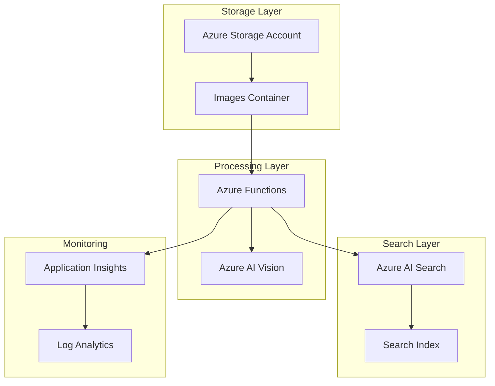

# Intelligent Image Content Discovery - Bicep Templates

This directory contains Azure Bicep templates for deploying an intelligent image content discovery solution using Azure AI Vision and Azure AI Search.

## Solution Overview

The Bicep templates deploy a complete infrastructure for AI-powered image analysis and searchable content discovery, including:

- **Azure Storage Account**: Secure blob storage for image files with lifecycle management
- **Azure AI Vision**: Computer vision service for image analysis, object detection, and metadata extraction
- **Azure AI Search**: Search service with vector search capabilities for semantic content discovery
- **Azure Functions**: Serverless compute for automated image processing and indexing
- **Application Insights**: Application performance monitoring and logging
- **Log Analytics**: Centralized logging and monitoring workspace

## Architecture



## Files

- **`main.bicep`**: Main Bicep template containing all resource definitions
- **`parameters.json`**: Example parameter file with default values
- **`README.md`**: This documentation file

## Prerequisites

Before deploying this template, ensure you have:

1. **Azure CLI** installed and configured
2. **Azure subscription** with appropriate permissions
3. **Resource group** created for deployment
4. **Bicep CLI** installed (optional, for local compilation)

Required Azure permissions:
- Contributor role on the target resource group
- Ability to create Azure AI services in the region
- Storage account creation permissions

## Parameters

### Required Parameters

| Parameter | Type | Description | Example |
|-----------|------|-------------|---------|
| `environmentSuffix` | string | Environment identifier (2-10 characters) | `dev`, `prod`, `test` |

### Optional Parameters

| Parameter | Type | Default | Description |
|-----------|------|---------|-------------|
| `location` | string | Resource group location | Azure region for all resources |
| `projectPrefix` | string | `imgdiscov` | Prefix for resource naming |
| `storageAccountSku` | string | `Standard_LRS` | Storage account performance tier |
| `aiVisionSku` | string | `S1` | AI Vision service pricing tier |
| `searchServiceSku` | string | `basic` | AI Search service pricing tier |
| `functionPlanType` | string | `Consumption` | Function App hosting plan |
| `functionsVersion` | string | `~4` | Azure Functions runtime version |
| `tags` | object | Default tags | Resource tags for governance |

### SKU Options

**Storage Account SKUs:**
- `Standard_LRS`: Locally redundant storage
- `Standard_GRS`: Geo-redundant storage
- `Standard_ZRS`: Zone-redundant storage
- `Premium_LRS`: Premium locally redundant storage

**AI Vision SKUs:**
- `F0`: Free tier (limited transactions)
- `S1`: Standard tier (production workloads)

**Search Service SKUs:**
- `free`: Free tier (limited storage and search units)
- `basic`: Basic tier (production workloads with basic features)
- `standard`: Standard tier (production workloads with advanced features)

## Deployment Instructions

### 1. Quick Deployment

```bash
# Set variables
RESOURCE_GROUP="rg-image-discovery-demo"
LOCATION="eastus"
ENVIRONMENT="dev"

# Create resource group
az group create \
    --name $RESOURCE_GROUP \
    --location $LOCATION

# Deploy template with default parameters
az deployment group create \
    --resource-group $RESOURCE_GROUP \
    --template-file main.bicep \
    --parameters environmentSuffix=$ENVIRONMENT
```

### 2. Deployment with Custom Parameters

```bash
# Deploy with custom parameters file
az deployment group create \
    --resource-group $RESOURCE_GROUP \
    --template-file main.bicep \
    --parameters @parameters.json
```

### 3. Production Deployment

```bash
# Production deployment with enhanced configuration
az deployment group create \
    --resource-group $RESOURCE_GROUP \
    --template-file main.bicep \
    --parameters \
        environmentSuffix="prod" \
        storageAccountSku="Standard_GRS" \
        aiVisionSku="S1" \
        searchServiceSku="standard" \
        functionPlanType="Premium" \
        location="eastus2"
```

### 4. Validation (What-If)

```bash
# Preview deployment changes
az deployment group what-if \
    --resource-group $RESOURCE_GROUP \
    --template-file main.bicep \
    --parameters environmentSuffix=$ENVIRONMENT
```

## Post-Deployment Configuration

After successful deployment, complete these steps:

### 1. Function App Code Deployment

```bash
# Get Function App name from deployment output
FUNCTION_APP_NAME=$(az deployment group show \
    --resource-group $RESOURCE_GROUP \
    --name main \
    --query properties.outputs.functionAppName.value -o tsv)

# Deploy function code (assumes you have the function code ready)
func azure functionapp publish $FUNCTION_APP_NAME
```

### 2. Create Search Index

```bash
# Get search service details
SEARCH_SERVICE_NAME=$(az deployment group show \
    --resource-group $RESOURCE_GROUP \
    --name main \
    --query properties.outputs.searchServiceName.value -o tsv)

SEARCH_ENDPOINT=$(az deployment group show \
    --resource-group $RESOURCE_GROUP \
    --name main \
    --query properties.outputs.searchServiceEndpoint.value -o tsv)

# Create search index using REST API (example)
curl -X POST "$SEARCH_ENDPOINT/indexes?api-version=2024-05-01-preview" \
    -H "Content-Type: application/json" \
    -H "api-key: YOUR_SEARCH_ADMIN_KEY" \
    -d @search-index-schema.json
```

### 3. Upload Test Images

```bash
# Get storage account details
STORAGE_ACCOUNT_NAME=$(az deployment group show \
    --resource-group $RESOURCE_GROUP \
    --name main \
    --query properties.outputs.storageAccountName.value -o tsv)

# Upload test images
az storage blob upload \
    --account-name $STORAGE_ACCOUNT_NAME \
    --container-name images \
    --name test-image.jpg \
    --file ./test-image.jpg
```

## Outputs

The template provides these outputs for integration and verification:

| Output | Description |
|--------|-------------|
| `storageAccountName` | Storage account name for image uploads |
| `storageConnectionString` | Storage connection string for applications |
| `aiVisionEndpoint` | AI Vision service endpoint URL |
| `searchServiceEndpoint` | AI Search service endpoint URL |
| `functionAppName` | Function App name for code deployment |
| `functionAppUrl` | Function App public URL |
| `applicationInsightsConnectionString` | Application Insights connection string |

## Monitoring and Troubleshooting

### Application Insights

Monitor application performance and errors:

```bash
# Get Application Insights connection string
APP_INSIGHTS_CONNECTION=$(az deployment group show \
    --resource-group $RESOURCE_GROUP \
    --name main \
    --query properties.outputs.applicationInsightsConnectionString.value -o tsv)

echo "Application Insights: $APP_INSIGHTS_CONNECTION"
```

### Log Analytics Queries

Use these KQL queries for troubleshooting:

```kusto
// Function execution logs
FunctionAppLogs
| where TimeGenerated > ago(1h)
| where Level == "Error"
| order by TimeGenerated desc

// Storage metrics
StorageFileLogs
| where TimeGenerated > ago(1h)
| where OperationName == "PutBlob"
| summarize count() by bin(TimeGenerated, 5m)
```

### Common Issues

1. **Function App Deployment Failures**
   - Check Application Insights for detailed error logs
   - Verify storage account connection string
   - Ensure proper RBAC permissions

2. **AI Vision Service Errors**
   - Verify service is provisioned in the correct region
   - Check API key configuration
   - Monitor service quotas and rate limits

3. **Search Service Issues**
   - Verify search index schema is created
   - Check search service SKU limitations
   - Monitor search unit utilization

## Security Considerations

The template implements these security best practices:

- **Managed Identity**: Function App uses system-assigned managed identity
- **RBAC**: Principle of least privilege access between services
- **HTTPS Only**: All services enforce HTTPS traffic
- **Storage Security**: Blob public access disabled, TLS 1.2 minimum
- **Network Security**: Services use default Azure networking with option for private endpoints

## Cost Optimization

To optimize costs:

1. **Use appropriate SKUs** for your workload size
2. **Enable storage lifecycle policies** for archiving old images
3. **Monitor AI service usage** to avoid unexpected charges
4. **Use Consumption plan** for Functions if usage is intermittent
5. **Set up cost alerts** using Azure Cost Management

## Cleanup

To remove all deployed resources:

```bash
# Delete the entire resource group
az group delete \
    --name $RESOURCE_GROUP \
    --yes \
    --no-wait
```

## Support

For issues with this template:

1. Check the [Azure Bicep documentation](https://docs.microsoft.com/en-us/azure/azure-resource-manager/bicep/)
2. Review the original recipe documentation
3. Check Azure service status pages
4. Use Azure support channels for service-specific issues

## Related Documentation

- [Azure AI Vision Documentation](https://docs.microsoft.com/en-us/azure/cognitive-services/computer-vision/)
- [Azure AI Search Documentation](https://docs.microsoft.com/en-us/azure/search/)
- [Azure Functions Documentation](https://docs.microsoft.com/en-us/azure/azure-functions/)
- [Azure Bicep Best Practices](https://docs.microsoft.com/en-us/azure/azure-resource-manager/bicep/best-practices)