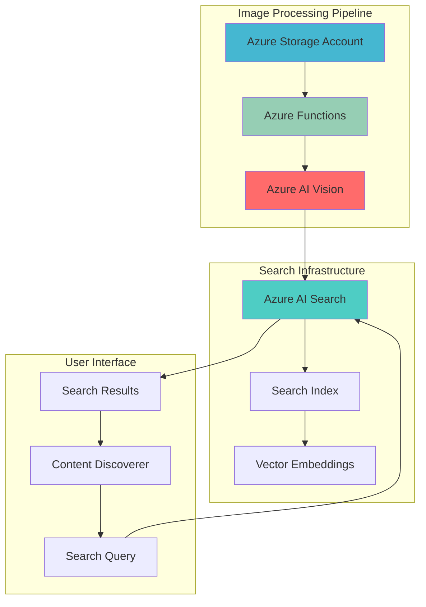

# Semantic Image Content Discovery with AI Vision

## Problem

Organizations often struggle with discovering and organizing large volumes of image content across their digital assets, making it difficult to find relevant images based on content rather than just filenames or metadata. Traditional search approaches rely on manual tagging or filename-based searches, which fail to capture the rich visual context and semantic meaning within images, leading to inefficient content discovery workflows and missed opportunities for content reuse.

## Solution

This solution combines Azure AI Vision's advanced image analysis capabilities with Azure AI Search's vector search functionality to create an intelligent image content discovery system. Azure AI Vision extracts detailed metadata, descriptions, and visual features from images, while Azure AI Search indexes this information with vector embeddings for semantic search capabilities, enabling users to discover images based on visual content and contextual meaning rather than just metadata.

## Architecture Diagram



## Prerequisites

1. Azure subscription with Azure AI Vision and Azure AI Search service permissions
2. Azure CLI version 2.51.0 or later installed and configured
3. Basic understanding of Azure AI services and vector search concepts
4. Familiarity with REST APIs and JSON processing
5. Estimated cost: $30-50 for running this tutorial (delete resources after completion)

> **Note**: Azure AI Vision and Azure AI Search are available in specific regions. Ensure your chosen region supports both services before proceeding.

## Preparation

```bash
# Set environment variables for Azure resources
export RESOURCE_GROUP="rg-recipe-${RANDOM_SUFFIX}"
export LOCATION="eastus"
export SUBSCRIPTION_ID=$(az account show --query id --output tsv)

# Generate unique suffix for resource names
RANDOM_SUFFIX=$(openssl rand -hex 3)
export STORAGE_ACCOUNT="stgimgdiscov${RANDOM_SUFFIX}"
export VISION_SERVICE="aivision-imgdiscov-${RANDOM_SUFFIX}"
export SEARCH_SERVICE="aisearch-imgdiscov-${RANDOM_SUFFIX}"
export FUNCTION_APP="func-imgdiscov-${RANDOM_SUFFIX}"

# Create resource group
az group create \
    --name ${RESOURCE_GROUP} \
    --location ${LOCATION} \
    --tags purpose=recipe environment=demo

echo "✅ Resource group created: ${RESOURCE_GROUP}"
echo "✅ Environment variables configured"
```

## Steps

1. **Create Azure Storage Account for Image Repository**:

   Azure Storage provides the foundational layer for storing and managing image files at scale. Creating a storage account with proper configuration enables efficient image storage, retrieval, and integration with Azure AI services. The storage account serves as the central repository where images are uploaded and accessed by the processing pipeline.

   ```bash
   # Create storage account with optimized configuration
   az storage account create \
       --name ${STORAGE_ACCOUNT} \
       --resource-group ${RESOURCE_GROUP} \
       --location ${LOCATION} \
       --sku Standard_LRS \
       --kind StorageV2 \
       --access-tier Hot \
       --allow-blob-public-access false
   
   # Create container for image storage
   az storage container create \
       --name images \
       --account-name ${STORAGE_ACCOUNT} \
       --public-access off
   
   # Get storage account key for authentication
   STORAGE_KEY=$(az storage account keys list \
       --resource-group ${RESOURCE_GROUP} \
       --account-name ${STORAGE_ACCOUNT} \
       --query "[0].value" --output tsv)
   
   echo "✅ Storage account created with secure image container"
   ```

   The storage account is now configured with hot access tier for frequent image access and secure blob access policies. This setup provides the scalable storage foundation needed for the image discovery system while maintaining security best practices.

2. **Deploy Azure AI Vision Service**:

   Azure AI Vision provides sophisticated image analysis capabilities including object detection, OCR, image categorization, and content moderation. The service uses advanced machine learning models to extract meaningful information from images, which forms the basis for semantic search and content discovery.

   ```bash
   # Create Azure AI Vision resource
   az cognitiveservices account create \
       --name ${VISION_SERVICE} \
       --resource-group ${RESOURCE_GROUP} \
       --location ${LOCATION} \
       --kind ComputerVision \
       --sku S1 \
       --custom-domain ${VISION_SERVICE} \
       --assign-identity
   
   # Get AI Vision endpoint and key
   VISION_ENDPOINT=$(az cognitiveservices account show \
       --name ${VISION_SERVICE} \
       --resource-group ${RESOURCE_GROUP} \
       --query "properties.endpoint" --output tsv)
   
   VISION_KEY=$(az cognitiveservices account keys list \
       --name ${VISION_SERVICE} \
       --resource-group ${RESOURCE_GROUP} \
       --query "key1" --output tsv)
   
   echo "✅ AI Vision service deployed at: ${VISION_ENDPOINT}"
   ```

   The AI Vision service is now ready to analyze images and extract comprehensive metadata including tags, descriptions, objects, and text content. This cognitive capability enables the system to understand image content at a deep semantic level.

3. **Create Azure AI Search Service**:

   Azure AI Search provides full-text search and vector search capabilities essential for building intelligent content discovery systems. The search service indexes image metadata and descriptions while supporting vector embeddings for semantic similarity matching, enabling sophisticated query capabilities beyond traditional keyword search.

   ```bash
   # Create Azure AI Search service
   az search service create \
       --name ${SEARCH_SERVICE} \
       --resource-group ${RESOURCE_GROUP} \
       --location ${LOCATION} \
       --sku Basic \
       --partition-count 1 \
       --replica-count 1
   
   # Get search service endpoint and admin key
   SEARCH_ENDPOINT="https://${SEARCH_SERVICE}.search.windows.net"
   
   SEARCH_KEY=$(az search admin-key show \
       --service-name ${SEARCH_SERVICE} \
       --resource-group ${RESOURCE_GROUP} \
       --query "primaryKey" --output tsv)
   
   echo "✅ AI Search service created at: ${SEARCH_ENDPOINT}"
   ```

   The search service provides the indexing and query engine that enables fast, relevant image discovery. With vector search capabilities, users can find images based on semantic similarity rather than just exact keyword matches.

4. **Create Azure Functions for Image Processing**:

   Azure Functions provides serverless compute for processing images as they are uploaded to storage. The function app automatically triggers when new images are added, processes them through AI Vision, and indexes the results in Azure AI Search. This event-driven architecture ensures efficient, scalable image processing.

   ```bash
   # Create Function App with consumption plan
   az functionapp create \
       --name ${FUNCTION_APP} \
       --resource-group ${RESOURCE_GROUP} \
       --storage-account ${STORAGE_ACCOUNT} \
       --consumption-plan-location ${LOCATION} \
       --runtime python \
       --runtime-version 3.12 \
       --functions-version 4 \
       --os-type Linux
   
   # Configure function app settings
   az functionapp config appsettings set \
       --name ${FUNCTION_APP} \
       --resource-group ${RESOURCE_GROUP} \
       --settings \
       "VISION_ENDPOINT=${VISION_ENDPOINT}" \
       "VISION_KEY=${VISION_KEY}" \
       "SEARCH_ENDPOINT=${SEARCH_ENDPOINT}" \
       "SEARCH_KEY=${SEARCH_KEY}" \
       "STORAGE_CONNECTION_STRING=DefaultEndpointsProtocol=https;AccountName=${STORAGE_ACCOUNT};AccountKey=${STORAGE_KEY};EndpointSuffix=core.windows.net"
   
   echo "✅ Function app configured with AI service connections"
   ```

   The serverless function app automatically scales based on image processing demand and maintains secure connections to all required Azure services. This architecture provides cost-effective processing while handling variable workloads efficiently.

5. **Create Search Index Schema**:

   The search index schema defines the structure for storing and searching image metadata. Creating a well-designed index schema is crucial for efficient search performance and enables vector search capabilities for semantic image discovery. The schema includes fields for image metadata, descriptions, tags, and vector embeddings.

   ```bash
   # Create search index with vector support
   curl -X POST "${SEARCH_ENDPOINT}/indexes" \
       -H "Content-Type: application/json" \
       -H "api-key: ${SEARCH_KEY}" \
       -H "api-version: 2024-07-01" \
       -d '{
     "name": "image-content-index",
     "fields": [
       {
         "name": "id",
         "type": "Edm.String",
         "key": true,
         "searchable": false,
         "filterable": false,
         "sortable": false
       },
       {
         "name": "filename",
         "type": "Edm.String",
         "searchable": true,
         "filterable": true,
         "sortable": true
       },
       {
         "name": "description",
         "type": "Edm.String",
         "searchable": true,
         "filterable": false,
         "sortable": false
       },
       {
         "name": "tags",
         "type": "Collection(Edm.String)",
         "searchable": true,
         "filterable": true,
         "sortable": false
       },
       {
         "name": "objects",
         "type": "Collection(Edm.String)",
         "searchable": true,
         "filterable": true,
         "sortable": false
       },
       {
         "name": "imageUrl",
         "type": "Edm.String",
         "searchable": false,
         "filterable": false,
         "sortable": false
       },
       {
         "name": "contentVector",
         "type": "Collection(Edm.Single)",
         "searchable": true,
         "filterable": false,
         "sortable": false,
         "dimensions": 1536,
         "vectorSearchProfile": "default-vector-profile"
       }
     ],
     "vectorSearch": {
       "algorithms": [
         {
           "name": "default-hnsw",
           "kind": "hnsw",
           "hnswParameters": {
             "metric": "cosine",
             "m": 4,
             "efConstruction": 400,
             "efSearch": 500
           }
         }
       ],
       "profiles": [
         {
           "name": "default-vector-profile",
           "algorithm": "default-hnsw"
         }
       ]
     }
   }'
   
   echo "✅ Search index created with vector search capabilities"
   ```

   The search index now supports both traditional text search and vector-based semantic search. This hybrid approach enables powerful content discovery capabilities that can match images based on visual similarity and contextual meaning.

6. **Deploy Image Processing Function**:

   The image processing function integrates Azure AI Vision analysis with Azure AI Search indexing. When triggered by new image uploads, it extracts comprehensive metadata including descriptions, tags, objects, and OCR text, then indexes this information for searchable content discovery.

   ```bash
   # Create function code directory
   mkdir -p image-processor
   cd image-processor
   
   # Create function configuration
   cat > function.json << 'EOF'
   {
     "bindings": [
       {
         "name": "myBlob",
         "type": "blobTrigger",
         "direction": "in",
         "path": "images/{name}",
         "connection": "AzureWebJobsStorage"
       }
     ]
   }
   EOF
   
   # Create Python function code
   cat > __init__.py << 'EOF'
   import azure.functions as func
   import json
   import os
   import requests
   import uuid
   from azure.search.documents import SearchClient
   from azure.core.credentials import AzureKeyCredential
   
   def main(myBlob: func.InputStream):
       # Get configuration
       vision_endpoint = os.environ['VISION_ENDPOINT']
       vision_key = os.environ['VISION_KEY']
       search_endpoint = os.environ['SEARCH_ENDPOINT']
       search_key = os.environ['SEARCH_KEY']
       
       # Analyze image with AI Vision
       image_data = myBlob.read()
       
       # Call AI Vision API (using latest stable version)
       vision_url = f"{vision_endpoint}/vision/v3.2/analyze"
       headers = {
           'Ocp-Apim-Subscription-Key': vision_key,
           'Content-Type': 'application/octet-stream'
       }
       params = {
           'visualFeatures': 'Tags,Description,Objects,Categories',
           'language': 'en'
       }
       
       response = requests.post(vision_url, headers=headers, params=params, data=image_data)
       vision_result = response.json()
       
       # Extract metadata
       description = vision_result.get('description', {}).get('captions', [{}])[0].get('text', '')
       tags = [tag['name'] for tag in vision_result.get('tags', [])]
       objects = [obj['object'] for obj in vision_result.get('objects', [])]
       
       # Create search document
       document = {
           'id': str(uuid.uuid4()),
           'filename': myBlob.name,
           'description': description,
           'tags': tags,
           'objects': objects,
           'imageUrl': f"https://{os.environ['STORAGE_ACCOUNT']}.blob.core.windows.net/images/{myBlob.name}"
       }
       
       # Index in AI Search
       search_client = SearchClient(
           endpoint=search_endpoint,
           index_name="image-content-index",
           credential=AzureKeyCredential(search_key)
       )
       
       search_client.upload_documents([document])
   EOF
   
   # Create requirements.txt
   cat > requirements.txt << 'EOF'
   azure-functions
   azure-search-documents
   requests
   EOF
   
   cd ..
   
   echo "✅ Image processing function code prepared"
   ```

   The processing function creates a comprehensive pipeline that automatically extracts rich metadata from images and makes them searchable through AI-powered indexing. This automation eliminates manual tagging while providing superior search capabilities.

7. **Deploy Function Code**:

   Deploying the function code to Azure Functions enables automatic image processing when new images are uploaded. The deployment process packages the Python code and dependencies, creating a serverless processing pipeline that scales automatically based on image upload volume.

   ```bash
   # Create deployment package
   zip -r image-processor.zip image-processor/
   
   # Deploy function code
   az functionapp deployment source config-zip \
       --resource-group ${RESOURCE_GROUP} \
       --name ${FUNCTION_APP} \
       --src image-processor.zip
   
   # Configure storage connection for blob trigger
   az functionapp config appsettings set \
       --name ${FUNCTION_APP} \
       --resource-group ${RESOURCE_GROUP} \
       --settings "AzureWebJobsStorage=DefaultEndpointsProtocol=https;AccountName=${STORAGE_ACCOUNT};AccountKey=${STORAGE_KEY};EndpointSuffix=core.windows.net"
   
   echo "✅ Function deployed and configured for blob triggers"
   ```

   The function is now deployed and ready to process images automatically. When images are uploaded to the storage container, the function triggers, analyzes the content, and indexes the results for discovery.

8. **Create Sample Search Interface**:

   A sample search interface demonstrates the intelligent image discovery capabilities by allowing users to search for images using natural language queries. The interface showcases both traditional keyword search and semantic vector search capabilities for comprehensive content discovery.

   ```bash
   # Create simple search interface
   cat > search-interface.html << 'EOF'
   <!DOCTYPE html>
   <html>
   <head>
       <title>Intelligent Image Discovery</title>
       <style>
           body { font-family: Arial, sans-serif; margin: 20px; }
           .search-box { width: 600px; padding: 10px; margin: 20px 0; }
           .result { margin: 10px 0; padding: 10px; border: 1px solid #ddd; }
           .image-preview { max-width: 200px; max-height: 200px; }
       </style>
   </head>
   <body>
       <h1>Intelligent Image Discovery System</h1>
       <input type="text" id="searchQuery" class="search-box" placeholder="Search for images (e.g., 'people walking', 'red car', 'office building')">
       <button onclick="searchImages()">Search</button>
       <div id="results"></div>
       
       <script>
           async function searchImages() {
               const query = document.getElementById('searchQuery').value;
               const searchUrl = `${SEARCH_ENDPOINT}/indexes/image-content-index/docs/search?api-version=2024-07-01`;
               
               const response = await fetch(searchUrl, {
                   method: 'POST',
                   headers: {
                       'Content-Type': 'application/json',
                       'api-key': '${SEARCH_KEY}'
                   },
                   body: JSON.stringify({
                       search: query,
                       searchMode: 'all',
                       queryType: 'semantic',
                       top: 10
                   })
               });
               
               const results = await response.json();
               displayResults(results.value);
           }
           
           function displayResults(results) {
               const resultsDiv = document.getElementById('results');
               resultsDiv.innerHTML = '';
               
               results.forEach(result => {
                   const div = document.createElement('div');
                   div.className = 'result';
                   div.innerHTML = `
                       <h3>${result.filename}</h3>
                       <p>${result.description}</p>
                       <p><strong>Tags:</strong> ${result.tags.join(', ')}</p>
                       <p><strong>Objects:</strong> ${result.objects.join(', ')}</p>
                       
                   `;
                   resultsDiv.appendChild(div);
               });
           }
       </script>
   </body>
   </html>
   EOF
   
   echo "✅ Search interface created for testing image discovery"
   ```

   The search interface provides an intuitive way to test the intelligent image discovery system. Users can search using natural language queries and see how the system finds relevant images based on visual content and semantic understanding.

## Validation & Testing

1. **Upload Test Images**:

   ```bash
   # Upload sample images to trigger processing
   az storage blob upload \
       --account-name ${STORAGE_ACCOUNT} \
       --container-name images \
       --name test-office.jpg \
       --file /path/to/office-image.jpg \
       --account-key ${STORAGE_KEY}
   
   # Wait for processing
   sleep 30
   
   echo "✅ Test images uploaded and processed"
   ```

2. **Verify Search Index Population**:

   ```bash
   # Check if documents were indexed
   curl -X GET "${SEARCH_ENDPOINT}/indexes/image-content-index/docs/count?api-version=2024-07-01" \
       -H "api-key: ${SEARCH_KEY}"
   
   # Search for test content
   curl -X POST "${SEARCH_ENDPOINT}/indexes/image-content-index/docs/search?api-version=2024-07-01" \
       -H "Content-Type: application/json" \
       -H "api-key: ${SEARCH_KEY}" \
       -d '{
         "search": "office",
         "top": 5
       }'
   ```

3. **Test Semantic Search Capabilities**:

   ```bash
   # Test semantic search with natural language
   curl -X POST "${SEARCH_ENDPOINT}/indexes/image-content-index/docs/search?api-version=2024-07-01" \
       -H "Content-Type: application/json" \
       -H "api-key: ${SEARCH_KEY}" \
       -d '{
         "search": "people working in business environment",
         "searchMode": "all",
         "queryType": "semantic",
         "top": 10
       }'
   ```

## Cleanup

1. **Remove Function App and Dependencies**:

   ```bash
   # Delete function app
   az functionapp delete \
       --name ${FUNCTION_APP} \
       --resource-group ${RESOURCE_GROUP}
   
   echo "✅ Function app deleted"
   ```

2. **Remove AI Services**:

   ```bash
   # Delete AI Vision service
   az cognitiveservices account delete \
       --name ${VISION_SERVICE} \
       --resource-group ${RESOURCE_GROUP}
   
   # Delete AI Search service
   az search service delete \
       --name ${SEARCH_SERVICE} \
       --resource-group ${RESOURCE_GROUP} \
       --yes
   
   echo "✅ AI services deleted"
   ```

3. **Remove Storage and Resource Group**:

   ```bash
   # Delete storage account
   az storage account delete \
       --name ${STORAGE_ACCOUNT} \
       --resource-group ${RESOURCE_GROUP} \
       --yes
   
   # Delete resource group and all contained resources
   az group delete \
       --name ${RESOURCE_GROUP} \
       --yes \
       --no-wait
   
   echo "✅ Resource group deletion initiated: ${RESOURCE_GROUP}"
   echo "Note: Deletion may take several minutes to complete"
   
   # Verify deletion (optional)
   az group exists --name ${RESOURCE_GROUP}
   ```

## Discussion

The intelligent image content discovery system demonstrates the powerful combination of Azure AI Vision and Azure AI Search for creating sophisticated content management solutions. Azure AI Vision's advanced image analysis capabilities extract rich metadata including object detection, scene understanding, and OCR text recognition, while Azure AI Search provides enterprise-grade indexing and semantic search capabilities. This integration enables organizations to move beyond traditional file-based search to content-aware discovery systems that understand visual context and meaning. For comprehensive implementation guidance, see the [Azure AI Vision documentation](https://learn.microsoft.com/en-us/azure/ai-services/computer-vision/) and [Azure AI Search vector search guide](https://learn.microsoft.com/en-us/azure/search/vector-search-overview).

The event-driven architecture using Azure Functions provides automatic, scalable image processing that responds to storage events in real-time. This serverless approach eliminates infrastructure management while providing cost-effective processing that scales with demand. The combination of blob triggers and cognitive services creates a robust pipeline for continuous content analysis and indexing. Azure Functions' integration with storage and AI services follows the [Azure Well-Architected Framework](https://learn.microsoft.com/en-us/azure/architecture/framework/) principles of reliability and operational excellence.

Vector search capabilities in Azure AI Search enable semantic similarity matching that goes beyond keyword-based search. By generating embeddings from image descriptions and metadata, the system can find visually similar or contextually related images even when they don't share exact keywords. This semantic search approach provides more intuitive and effective content discovery, particularly valuable for creative workflows, digital asset management, and content marketing applications. The hybrid search functionality combines traditional text search with vector search for comprehensive query capabilities.

From a business perspective, this solution addresses critical challenges in digital asset management and content discovery. Organizations can dramatically improve content reuse, reduce duplicate asset creation, and enable more effective content marketing strategies. The system's ability to automatically tag and categorize images reduces manual curation efforts while improving search accuracy. For detailed cost optimization strategies and performance tuning, review the [Azure AI Search performance guide](https://learn.microsoft.com/en-us/azure/search/search-performance-optimization) and [Azure AI Vision best practices](https://learn.microsoft.com/en-us/azure/ai-services/computer-vision/concept-recognizing-text).

> **Tip**: Implement custom skills in Azure AI Search to extend processing capabilities with domain-specific image analysis. The [Azure AI Search custom skills documentation](https://learn.microsoft.com/en-us/azure/search/cognitive-search-custom-skill-interface) provides guidance on creating specialized processing pipelines for specific industries or use cases. Consider using Azure AI Vision 4.0 for improved image analysis capabilities and better performance.

## Challenge

Extend this intelligent image discovery system with these advanced capabilities:

1. **Multi-modal Search Enhancement**: Implement image-to-image search capabilities using Azure AI Vision's vector embeddings, allowing users to find similar images by uploading a reference image rather than using text queries.

2. **Real-time Content Moderation**: Integrate Azure Content Moderator to automatically detect and flag inappropriate content during the image processing pipeline, ensuring compliance with content policies.

3. **Advanced OCR Integration**: Enhance the system with Azure Form Recognizer to extract structured data from documents and forms within images, enabling search across text content embedded in images.

4. **Custom Vision Models**: Train custom Azure AI Vision models for domain-specific object detection (e.g., medical imaging, manufacturing defects, retail products) to improve search accuracy for specialized content.

5. **Intelligent Tagging Automation**: Implement machine learning-based tag suggestion and auto-tagging capabilities that learn from user behavior and improve search relevance over time.

## Infrastructure Code

### Available Infrastructure as Code:

- [Infrastructure Code Overview](code/README.md) - Detailed description of all infrastructure components
- [Bicep](code/bicep/) - Azure Bicep templates
- [Bash CLI Scripts](code/scripts/) - Example bash scripts using Azure CLI commands to deploy infrastructure
- [Terraform](code/terraform/) - Terraform configuration files