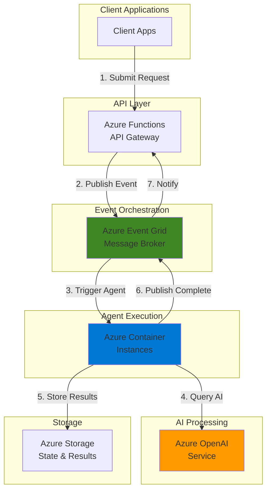

# Serverless AI Agents with OpenAI Service and Container Instances

## Problem

Modern enterprises face challenges in creating scalable, intelligent automation systems that can process complex tasks asynchronously without maintaining expensive infrastructure. Traditional approaches require managing servers, handling scaling complexities, and orchestrating multiple AI services manually. Organizations need a cost-effective solution that can spawn intelligent agents on-demand, process requests through advanced AI models, and scale automatically based on workload without infrastructure overhead.

## Solution

This recipe implements a serverless AI agent system using Azure OpenAI Service for intelligent processing, Azure Container Instances for scalable agent execution, and Azure Event Grid for event-driven orchestration. The architecture enables automatic scaling, pay-per-use pricing, and seamless integration with enterprise systems while maintaining security and compliance through Azure's managed services.

## Architecture Diagram



## Prerequisites

1. Azure subscription with appropriate permissions to create resources
2. Azure CLI v2.50.0 or later installed and configured (or use Azure CloudShell)
3. Basic understanding of containerization and event-driven architectures
4. Docker installed locally for building container images
5. Estimated cost: $10-20 for testing (varies based on usage)

> **Note**: Azure OpenAI Service requires approved access. Apply for access at https://aka.ms/oai/access before starting this recipe.

## Preparation

```bash
# Set environment variables for Azure resources
export RESOURCE_GROUP="rg-ai-agents-${RANDOM_SUFFIX}"
export LOCATION="eastus"
export SUBSCRIPTION_ID=$(az account show --query id --output tsv)

# Generate unique suffix for resource names
RANDOM_SUFFIX=$(openssl rand -hex 3)

# Create resource group
az group create \
    --name ${RESOURCE_GROUP} \
    --location ${LOCATION} \
    --tags purpose=recipe environment=demo

echo "✅ Resource group created: ${RESOURCE_GROUP}"

# Set additional resource names
export STORAGE_ACCOUNT="staiagents${RANDOM_SUFFIX}"
export CONTAINER_REGISTRY="craiagents${RANDOM_SUFFIX}"
export OPENAI_RESOURCE="oai-agents-${RANDOM_SUFFIX}"
export EVENTGRID_TOPIC="egt-agents-${RANDOM_SUFFIX}"
export FUNCTION_APP="func-agents-${RANDOM_SUFFIX}"

# Create storage account for state management
az storage account create \
    --name ${STORAGE_ACCOUNT} \
    --resource-group ${RESOURCE_GROUP} \
    --location ${LOCATION} \
    --sku Standard_LRS \
    --kind StorageV2

echo "✅ Storage account created: ${STORAGE_ACCOUNT}"
```

## Steps

1. **Deploy Azure OpenAI Service Instance**:

   Azure OpenAI Service provides enterprise-grade access to OpenAI's powerful language models with Azure's security, compliance, and regional availability. This managed service eliminates the complexity of model hosting while providing consistent API access, automatic scaling, and integrated monitoring. The service supports multiple model deployments, enabling different agents to use appropriate models based on task complexity.

   ```bash
   # Create Azure OpenAI resource
   az cognitiveservices account create \
       --name ${OPENAI_RESOURCE} \
       --resource-group ${RESOURCE_GROUP} \
       --location ${LOCATION} \
       --kind OpenAI \
       --sku S0 \
       --custom-domain ${OPENAI_RESOURCE}
   
   # Deploy GPT-4 model for advanced reasoning
   az cognitiveservices account deployment create \
       --name ${OPENAI_RESOURCE} \
       --resource-group ${RESOURCE_GROUP} \
       --deployment-name gpt-4 \
       --model-name gpt-4 \
       --model-version "0613" \
       --model-format OpenAI \
       --scale-type "Standard"
   
   # Get endpoint and key for later use
   OPENAI_ENDPOINT=$(az cognitiveservices account show \
       --name ${OPENAI_RESOURCE} \
       --resource-group ${RESOURCE_GROUP} \
       --query properties.endpoint \
       --output tsv)
   
   OPENAI_KEY=$(az cognitiveservices account keys list \
       --name ${OPENAI_RESOURCE} \
       --resource-group ${RESOURCE_GROUP} \
       --query key1 \
       --output tsv)
   
   echo "✅ Azure OpenAI Service deployed with GPT-4 model"
   ```

   The Azure OpenAI instance is now ready to process intelligent requests. The GPT-4 deployment provides advanced reasoning capabilities essential for complex agent tasks, while the S0 tier ensures sufficient throughput for production workloads.

2. **Create Azure Container Registry for Agent Images**:

   Azure Container Registry provides a secure, managed Docker registry for storing and managing agent container images. This private registry integrates seamlessly with Azure Container Instances, enabling rapid deployment of containerized agents with built-in security scanning and geo-replication capabilities. The registry serves as the central repository for all agent variations and versions.

   ```bash
   # Create container registry
   az acr create \
       --name ${CONTAINER_REGISTRY} \
       --resource-group ${RESOURCE_GROUP} \
       --location ${LOCATION} \
       --sku Basic \
       --admin-enabled true
   
   # Get registry credentials
   ACR_USERNAME=$(az acr credential show \
       --name ${CONTAINER_REGISTRY} \
       --query username \
       --output tsv)
   
   ACR_PASSWORD=$(az acr credential show \
       --name ${CONTAINER_REGISTRY} \
       --query passwords[0].value \
       --output tsv)
   
   # Build and push sample AI agent container
   cat > Dockerfile << EOF
   FROM python:3.11-slim
   
   RUN pip install openai azure-storage-blob azure-eventgrid
   
   COPY agent.py /app/agent.py
   WORKDIR /app
   
   CMD ["python", "agent.py"]
   EOF
   
   # Create agent script
   cat > agent.py << 'EOF'
   import os
   import json
   import openai
   from azure.storage.blob import BlobServiceClient
   from azure.eventgrid import EventGridPublisherClient, EventGridEvent
   
   def process_task():
       # Initialize OpenAI client
       openai.api_key = os.environ['OPENAI_KEY']
       openai.api_base = os.environ['OPENAI_ENDPOINT']
       openai.api_type = 'azure'
       openai.api_version = '2023-05-15'
       
       # Get task details from environment
       task_id = os.environ['TASK_ID']
       task_prompt = os.environ['TASK_PROMPT']
       
       # Process with GPT-4
       response = openai.ChatCompletion.create(
           engine="gpt-4",
           messages=[{"role": "user", "content": task_prompt}],
           temperature=0.7
       )
       
       result = response.choices[0].message.content
       
       # Store results in blob storage
       blob_client = BlobServiceClient.from_connection_string(
           os.environ['STORAGE_CONNECTION']
       ).get_blob_client(
           container="results",
           blob=f"{task_id}.json"
       )
       
       blob_client.upload_blob(json.dumps({
           "task_id": task_id,
           "result": result,
           "status": "completed"
       }))
       
       print(f"Task {task_id} completed successfully")
   
   if __name__ == "__main__":
       process_task()
   EOF
   
   echo "✅ Container registry created and agent code prepared"
   ```

   The container registry now hosts the agent image template. This containerized approach enables consistent execution environments, version control for agent logic, and seamless scaling across multiple instances.

3. **Configure Azure Event Grid for Event Orchestration**:

   Azure Event Grid serves as the central nervous system for the AI agent architecture, providing reliable event routing and delivery at massive scale. This fully managed event routing service enables loose coupling between components, supporting both push and pull delivery models. Event Grid's built-in retry policies and dead-letter handling ensure no events are lost during processing.

   ```bash
   # Create Event Grid topic
   az eventgrid topic create \
       --name ${EVENTGRID_TOPIC} \
       --resource-group ${RESOURCE_GROUP} \
       --location ${LOCATION} \
       --input-schema EventGridSchema
   
   # Get Event Grid endpoint and key
   EVENTGRID_ENDPOINT=$(az eventgrid topic show \
       --name ${EVENTGRID_TOPIC} \
       --resource-group ${RESOURCE_GROUP} \
       --query endpoint \
       --output tsv)
   
   EVENTGRID_KEY=$(az eventgrid topic key list \
       --name ${EVENTGRID_TOPIC} \
       --resource-group ${RESOURCE_GROUP} \
       --query key1 \
       --output tsv)
   
   # Create storage container for results
   STORAGE_CONNECTION=$(az storage account show-connection-string \
       --name ${STORAGE_ACCOUNT} \
       --resource-group ${RESOURCE_GROUP} \
       --query connectionString \
       --output tsv)
   
   az storage container create \
       --name results \
       --connection-string "${STORAGE_CONNECTION}" \
       --public-access off
   
   echo "✅ Event Grid topic configured for agent orchestration"
   ```

   Event Grid now provides the event-driven backbone for agent coordination. This configuration enables automatic triggering of container instances based on incoming requests and facilitates result notification upon completion.

4. **Deploy Azure Functions as API Gateway**:

   Azure Functions provides the serverless API layer that accepts client requests and orchestrates the AI agent workflow. This consumption-based compute service automatically scales to handle varying request loads while maintaining sub-second cold start times. The Functions runtime integrates natively with Event Grid, enabling seamless event publishing and subscription patterns.

   ```bash
   # Create Function App
   az functionapp create \
       --name ${FUNCTION_APP_NAME} \
       --resource-group ${RESOURCE_GROUP} \
       --storage-account ${STORAGE_ACCOUNT} \
       --consumption-plan-location ${LOCATION} \
       --runtime python \
       --runtime-version 3.11 \
       --functions-version 4
   
   # Configure Function App settings
   az functionapp config appsettings set \
       --name ${FUNCTION_APP_NAME} \
       --resource-group ${RESOURCE_GROUP} \
       --settings \
       "EVENTGRID_ENDPOINT=${EVENTGRID_ENDPOINT}" \
       "EVENTGRID_KEY=${EVENTGRID_KEY}" \
       "STORAGE_CONNECTION=${STORAGE_CONNECTION}" \
       "OPENAI_ENDPOINT=${OPENAI_ENDPOINT}" \
       "OPENAI_KEY=${OPENAI_KEY}" \
       "CONTAINER_REGISTRY=${CONTAINER_REGISTRY}.azurecr.io" \
       "ACR_USERNAME=${ACR_USERNAME}" \
       "ACR_PASSWORD=${ACR_PASSWORD}"
   
   # Create HTTP trigger function code
   mkdir -p agent-api
   cat > agent-api/function.json << 'EOF'
   {
     "scriptFile": "__init__.py",
     "bindings": [
       {
         "authLevel": "function",
         "type": "httpTrigger",
         "direction": "in",
         "name": "req",
         "methods": ["post"]
       },
       {
         "type": "http",
         "direction": "out",
         "name": "$return"
       }
     ]
   }
   EOF
   
   cat > agent-api/__init__.py << 'EOF'
   import logging
   import json
   import uuid
   import os
   from azure.eventgrid import EventGridPublisherClient, EventGridEvent
   from azure.core.credentials import AzureKeyCredential
   
   def main(req):
       logging.info('Processing AI agent request')
       
       # Parse request
       req_body = req.get_json()
       task_prompt = req_body.get('prompt')
       
       if not task_prompt:
           return {"status": 400, "body": "Missing prompt in request"}
       
       # Generate task ID
       task_id = str(uuid.uuid4())
       
       # Publish event to Event Grid
       client = EventGridPublisherClient(
           os.environ['EVENTGRID_ENDPOINT'],
           AzureKeyCredential(os.environ['EVENTGRID_KEY'])
       )
       
       event = EventGridEvent(
           subject="agent/task/new",
           event_type="Agent.TaskCreated",
           data={
               "taskId": task_id,
               "prompt": task_prompt
           },
           data_version="1.0"
       )
       
       client.send(event)
       
       return {
           "status": 202,
           "body": json.dumps({
               "taskId": task_id,
               "status": "accepted",
               "message": "Task submitted for processing"
           })
       }
   EOF
   
   echo "✅ Azure Functions API gateway deployed"
   ```

   The Functions app now provides a scalable HTTP endpoint for submitting AI agent tasks. This serverless API layer handles request validation, generates unique task identifiers, and publishes events to trigger agent execution.

5. **Implement Container Instance Orchestration**:

   Azure Container Instances provides the serverless compute layer for running AI agents without managing infrastructure. This service offers rapid container startup times, per-second billing, and automatic cleanup after execution. The integration with Event Grid enables dynamic spawning of container instances based on incoming workload, creating a truly elastic agent execution environment.

   ```bash
   # Create Event Grid subscription for Container Instances
   # First, create a Logic App to handle ACI orchestration
   az logic workflow create \
       --name logic-aci-orchestrator \
       --resource-group ${RESOURCE_GROUP} \
       --location ${LOCATION} \
       --definition '{
         "definition": {
           "$schema": "https://schema.management.azure.com/providers/Microsoft.Logic/schemas/2016-06-01/workflowdefinition.json#",
           "contentVersion": "1.0.0.0",
           "triggers": {
             "When_Event_Grid_event_occurs": {
               "type": "ApiConnectionWebhook",
               "inputs": {
                 "body": {
                   "properties": {
                     "topic": "/subscriptions/'${SUBSCRIPTION_ID}'/resourceGroups/'${RESOURCE_GROUP}'/providers/Microsoft.EventGrid/topics/'${EVENTGRID_TOPIC}'"
                   }
                 }
               }
             }
           },
           "actions": {
             "Create_container_instance": {
               "type": "Http",
               "inputs": {
                 "method": "PUT",
                 "uri": "https://management.azure.com/subscriptions/'${SUBSCRIPTION_ID}'/resourceGroups/'${RESOURCE_GROUP}'/providers/Microsoft.ContainerInstance/containerGroups/@{triggerBody()?['"'"'data'"'"']['"'"'taskId'"'"']}?api-version=2021-10-01",
                 "headers": {
                   "Authorization": "Bearer @{body('"'"'Get_access_token'"'"')?['"'"'access_token'"'"']}"
                 },
                 "body": {
                   "location": "'${LOCATION}'",
                   "properties": {
                     "containers": [{
                       "name": "ai-agent",
                       "properties": {
                         "image": "'${CONTAINER_REGISTRY}'.azurecr.io/ai-agent:latest",
                         "resources": {
                           "requests": {
                             "cpu": 1,
                             "memoryInGB": 1.5
                           }
                         },
                         "environmentVariables": [
                           {
                             "name": "TASK_ID",
                             "value": "@{triggerBody()?['"'"'data'"'"']['"'"'taskId'"'"']}"
                           },
                           {
                             "name": "TASK_PROMPT",
                             "value": "@{triggerBody()?['"'"'data'"'"']['"'"'prompt'"'"']}"
                           },
                           {
                             "name": "OPENAI_ENDPOINT",
                             "value": "'${OPENAI_ENDPOINT}'"
                           },
                           {
                             "name": "OPENAI_KEY",
                             "secureValue": "'${OPENAI_KEY}'"
                           },
                           {
                             "name": "STORAGE_CONNECTION",
                             "secureValue": "'${STORAGE_CONNECTION}'"
                           }
                         ]
                       }
                     }],
                     "osType": "Linux",
                     "restartPolicy": "Never",
                     "imageRegistryCredentials": [{
                       "server": "'${CONTAINER_REGISTRY}'.azurecr.io",
                       "username": "'${ACR_USERNAME}'",
                       "password": "'${ACR_PASSWORD}'"
                     }]
                   }
                 }
               }
             }
           }
         }
       }'
   
   echo "✅ Container Instance orchestration configured"
   ```

   The orchestration layer now automatically spawns container instances in response to Event Grid events. Each agent runs in an isolated environment with appropriate resource allocation, processes its assigned task, and terminates upon completion.

6. **Build and Deploy Agent Container Image**:

   Creating optimized container images ensures fast startup times and efficient resource utilization. The multi-stage build process minimizes image size while including all necessary dependencies for AI processing. Azure Container Registry's built-in vulnerability scanning helps maintain security compliance for agent deployments.

   ```bash
   # Login to ACR
   az acr login --name ${CONTAINER_REGISTRY}
   
   # Build and push the agent image
   docker build -t ${CONTAINER_REGISTRY}.azurecr.io/ai-agent:latest .
   docker push ${CONTAINER_REGISTRY}.azurecr.io/ai-agent:latest
   
   # Create Function App deployment package
   cd agent-api
   zip -r ../functionapp.zip .
   cd ..
   
   # Deploy Function App code
   az functionapp deployment source config-zip \
       --name ${FUNCTION_APP_NAME} \
       --resource-group ${RESOURCE_GROUP} \
       --src functionapp.zip
   
   echo "✅ Agent container image deployed to registry"
   ```

   The agent container image is now available in the private registry, ready for deployment. This centralized image management enables version control, security scanning, and rapid updates to agent logic.

7. **Configure Monitoring and Observability**:

   Application Insights provides comprehensive monitoring for the entire AI agent system, tracking performance metrics, errors, and custom telemetry. This integration enables proactive issue detection, performance optimization, and usage analytics. The distributed tracing capabilities help understand request flow across multiple services.

   ```bash
   # Create Application Insights instance
   az monitor app-insights component create \
       --app insights-ai-agents \
       --resource-group ${RESOURCE_GROUP} \
       --location ${LOCATION} \
       --kind web
   
   # Get instrumentation key
   APPINSIGHTS_KEY=$(az monitor app-insights component show \
       --app insights-ai-agents \
       --resource-group ${RESOURCE_GROUP} \
       --query instrumentationKey \
       --output tsv)
   
   # Update Function App with Application Insights
   az functionapp config appsettings set \
       --name ${FUNCTION_APP_NAME} \
       --resource-group ${RESOURCE_GROUP} \
       --settings "APPINSIGHTS_INSTRUMENTATIONKEY=${APPINSIGHTS_KEY}"
   
   # Create alerts for agent failures
   az monitor metrics alert create \
       --name alert-agent-failures \
       --resource-group ${RESOURCE_GROUP} \
       --scopes $(az functionapp show \
           --name ${FUNCTION_APP_NAME} \
           --resource-group ${RESOURCE_GROUP} \
           --query id --output tsv) \
       --condition "count Failed requests > 5" \
       --window-size 5m \
       --evaluation-frequency 1m
   
   echo "✅ Monitoring and alerting configured"
   ```

   The monitoring infrastructure now provides end-to-end visibility into agent operations. Real-time dashboards, automated alerts, and detailed logs enable rapid troubleshooting and continuous optimization of the AI agent system.

## Validation & Testing

1. Verify all resources were created successfully:

   ```bash
   # Check resource group resources
   az resource list \
       --resource-group ${RESOURCE_GROUP} \
       --output table
   
   # Verify OpenAI deployment
   az cognitiveservices account deployment list \
       --name ${OPENAI_RESOURCE} \
       --resource-group ${RESOURCE_GROUP} \
       --output table
   ```

   Expected output: List of all created resources including OpenAI, Event Grid, Functions, and Container Registry.

2. Test the AI agent system end-to-end:

   ```bash
   # Get Function App URL
   FUNCTION_URL=$(az functionapp function show \
       --name ${FUNCTION_APP_NAME} \
       --resource-group ${RESOURCE_GROUP} \
       --function-name agent-api \
       --query invokeUrlTemplate \
       --output tsv)
   
   # Submit a test request
   curl -X POST ${FUNCTION_URL} \
       -H "Content-Type: application/json" \
       -d '{
         "prompt": "Analyze the benefits of serverless architectures for AI workloads"
       }'
   ```

   Expected output: JSON response with task ID and accepted status.

3. Monitor agent execution:

   ```bash
   # Check container instance creation
   az container list \
       --resource-group ${RESOURCE_GROUP} \
       --output table
   
   # View agent logs
   TASK_ID="<task-id-from-previous-step>"
   az container logs \
       --name ${TASK_ID} \
       --resource-group ${RESOURCE_GROUP}
   ```

4. Verify results in storage:

   ```bash
   # List result blobs
   az storage blob list \
       --container-name results \
       --connection-string "${STORAGE_CONNECTION}" \
       --output table
   
   # Download and view result
   az storage blob download \
       --container-name results \
       --name "${TASK_ID}.json" \
       --connection-string "${STORAGE_CONNECTION}" \
       --file result.json
   
   cat result.json
   ```

## Cleanup

1. Delete the resource group and all resources:

   ```bash
   # Delete resource group
   az group delete \
       --name ${RESOURCE_GROUP} \
       --yes \
       --no-wait
   
   echo "✅ Resource group deletion initiated: ${RESOURCE_GROUP}"
   echo "Note: Deletion may take several minutes to complete"
   ```

2. Verify deletion status:

   ```bash
   # Check if resource group still exists
   az group exists --name ${RESOURCE_GROUP}
   ```

3. Clean up local files:

   ```bash
   # Remove created files
   rm -f Dockerfile agent.py functionapp.zip result.json
   rm -rf agent-api/
   
   echo "✅ Local files cleaned up"
   ```

## Discussion

This serverless AI agent architecture demonstrates the power of combining Azure's managed services to create intelligent, scalable automation systems. The event-driven design enables natural decoupling between request submission and processing, allowing the system to handle varying workloads efficiently. According to the [Azure Well-Architected Framework](https://docs.microsoft.com/en-us/azure/architecture/framework/), this approach aligns with key pillars of reliability, performance efficiency, and cost optimization.

The integration of Azure OpenAI Service provides access to state-of-the-art language models while maintaining enterprise security and compliance requirements. As detailed in the [Azure OpenAI documentation](https://docs.microsoft.com/en-us/azure/ai-services/openai/overview), the service offers regional availability, private endpoints, and comprehensive content filtering. This makes it suitable for production workloads requiring consistent performance and governance.

Azure Container Instances serves as the ideal compute platform for short-lived agent executions, offering rapid startup times and per-second billing. The [Container Instances best practices guide](https://docs.microsoft.com/en-us/azure/container-instances/container-instances-best-practices-and-considerations) recommends this approach for burst workloads and event-driven scenarios where traditional VM-based solutions would be cost-prohibitive.

> **Tip**: Use Azure Monitor workbooks to create custom dashboards tracking agent performance, success rates, and resource consumption. The [monitoring guide](https://docs.microsoft.com/en-us/azure/azure-monitor/visualize/workbooks-overview) provides templates for container and serverless workload visualization.

## Challenge

Extend this solution by implementing these enhancements:

1. **Multi-Model Agent Support**: Deploy multiple OpenAI models (GPT-4, GPT-3.5) and implement intelligent routing based on task complexity and cost considerations.

2. **Agent Chaining**: Create workflows where agents can spawn sub-agents for complex tasks, using Event Grid for inter-agent communication and dependency management.

3. **Persistent Agent Sessions**: Implement durable agents using Azure Durable Functions for long-running conversations and stateful interactions.

4. **Real-time Progress Tracking**: Add SignalR Service integration to provide real-time updates to clients as agents process tasks.

5. **Advanced Security**: Implement Azure AD B2C authentication, API Management for rate limiting, and Private Endpoints for enhanced security isolation.

## Infrastructure Code

*Infrastructure code will be generated after recipe approval.*