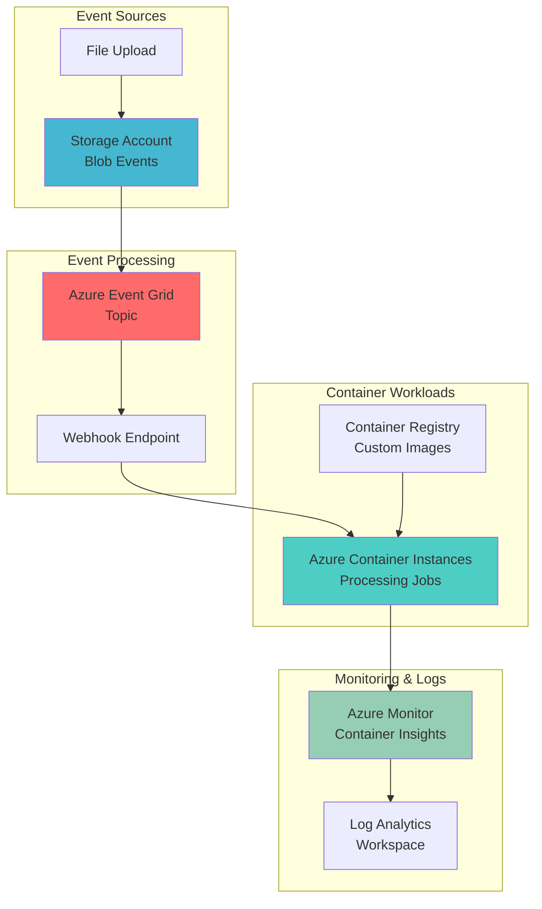

# Serverless Containers with Event Grid and Container Instances

## Problem

Organizations need to automatically process files, images, or data uploaded to storage without maintaining persistent compute infrastructure. Traditional approaches require always-on virtual machines or application services that consume resources even when idle, resulting in unnecessary costs and operational overhead. When processing tasks are infrequent or unpredictable, maintaining dedicated infrastructure becomes inefficient and difficult to scale based on actual demand.

## Solution

Build an event-driven serverless architecture using Azure Event Grid to automatically trigger Azure Container Instances in response to storage events. This solution provides on-demand container execution that scales from zero, processes workloads efficiently, and automatically terminates when complete. The architecture eliminates infrastructure management while providing cost-effective processing for variable workloads through pay-per-use container instances.

## Architecture Diagram



## Prerequisites

1. Azure subscription with appropriate permissions for creating resource groups, storage accounts, Event Grid topics, and Container Instances
2. Azure CLI v2.15.0 or higher installed and configured (or Azure Cloud Shell)
3. Basic understanding of containerization concepts and Azure storage events
4. Docker knowledge for creating custom container images (optional for basic scenarios)
5. Estimated cost: $10-20 for testing resources (Container Instances charged per second, Event Grid per operation)

> **Note**: Container Instances are billed per second of execution time, making this solution highly cost-effective for infrequent processing tasks. Event Grid operations are charged per million operations, typically resulting in minimal costs for most workloads.

## Preparation

```bash
# Set environment variables for consistent resource naming
export RESOURCE_GROUP="rg-event-driven-containers"
export LOCATION="eastus"
export STORAGE_ACCOUNT="steventcontainers$(openssl rand -hex 4)"
export CONTAINER_REGISTRY="acreventcontainers$(openssl rand -hex 4)"
export EVENT_GRID_TOPIC="egt-container-events"
export SUBSCRIPTION_ID=$(az account show --query id --output tsv)

# Generate unique suffix for resource names
RANDOM_SUFFIX=$(openssl rand -hex 3)

# Create resource group for all related resources
az group create \
    --name ${RESOURCE_GROUP} \
    --location ${LOCATION} \
    --tags purpose=event-driven-containers environment=demo

echo "✅ Resource group created: ${RESOURCE_GROUP}"

# Create storage account with Event Grid events enabled
az storage account create \
    --name ${STORAGE_ACCOUNT} \
    --resource-group ${RESOURCE_GROUP} \
    --location ${LOCATION} \
    --sku Standard_LRS \
    --kind StorageV2 \
    --access-tier Hot \
    --enable-hierarchical-namespace false

echo "✅ Storage account created: ${STORAGE_ACCOUNT}"

# Create container registry for custom images
az acr create \
    --name ${CONTAINER_REGISTRY} \
    --resource-group ${RESOURCE_GROUP} \
    --location ${LOCATION} \
    --sku Basic \
    --admin-enabled true

echo "✅ Container registry created: ${CONTAINER_REGISTRY}"
```

## Steps

1. **Create Azure Event Grid Custom Topic**:

   Azure Event Grid provides a fully managed event routing service that enables event-driven architectures with automatic scaling and delivery guarantees. Creating a custom topic allows you to publish and subscribe to application-specific events beyond the built-in Azure service events. This foundational component will coordinate between storage events and container execution, providing reliable event delivery with built-in retry mechanisms and dead-letter handling.

   ```bash
   # Create custom Event Grid topic for container orchestration
   az eventgrid topic create \
       --name ${EVENT_GRID_TOPIC} \
       --resource-group ${RESOURCE_GROUP} \
       --location ${LOCATION} \
       --input-schema EventGridSchema
   
   # Get topic endpoint and access key for later use
   TOPIC_ENDPOINT=$(az eventgrid topic show \
       --name ${EVENT_GRID_TOPIC} \
       --resource-group ${RESOURCE_GROUP} \
       --query endpoint --output tsv)
   
   TOPIC_KEY=$(az eventgrid topic key list \
       --name ${EVENT_GRID_TOPIC} \
       --resource-group ${RESOURCE_GROUP} \
       --query key1 --output tsv)
   
   echo "✅ Event Grid topic created with endpoint: ${TOPIC_ENDPOINT}"
   ```

   The Event Grid topic is now ready to receive and route events with enterprise-grade reliability. This managed service handles event filtering, routing, and delivery, eliminating the need for custom messaging infrastructure while providing exactly-once delivery semantics.

2. **Create Container Instance for Event Processing**:

   Azure Container Instances provides serverless containers that start in seconds and scale based on demand. Creating a processing container with Event Grid webhook capabilities enables automatic execution when events occur. This approach eliminates the need for always-on compute resources while providing immediate response to storage events with built-in monitoring and logging through Azure Monitor.

   ```bash
   # Create container instance with webhook processing capabilities
   az container create \
       --name "event-processor-${RANDOM_SUFFIX}" \
       --resource-group ${RESOURCE_GROUP} \
       --location ${LOCATION} \
       --image mcr.microsoft.com/azure-functions/dotnet:3.0 \
       --cpu 1 \
       --memory 1.5 \
       --restart-policy OnFailure \
       --environment-variables \
           STORAGE_ACCOUNT_NAME=${STORAGE_ACCOUNT} \
           EVENT_GRID_TOPIC=${EVENT_GRID_TOPIC} \
       --ports 80 \
       --dns-name-label "event-processor-${RANDOM_SUFFIX}"
   
   # Get container instance FQDN for webhook configuration
   CONTAINER_FQDN=$(az container show \
       --name "event-processor-${RANDOM_SUFFIX}" \
       --resource-group ${RESOURCE_GROUP} \
       --query ipAddress.fqdn --output tsv)
   
   echo "✅ Container instance created with FQDN: ${CONTAINER_FQDN}"
   ```

   The container instance is now running and ready to receive webhook events from Event Grid. This serverless approach provides automatic scaling, built-in health monitoring, and pay-per-use pricing that makes it ideal for event-driven workloads.

3. **Configure Storage Account Event Subscription**:

   Event subscriptions connect Azure services to Event Grid topics, enabling automatic event publishing when specific actions occur. Configuring the storage account to publish blob events creates the foundation for event-driven processing. This integration provides real-time notifications for file uploads, modifications, and deletions while supporting advanced filtering and routing capabilities.

   ```bash
   # Create storage account event subscription for blob events
   az eventgrid event-subscription create \
       --name "blob-events-subscription" \
       --source-resource-id "/subscriptions/${SUBSCRIPTION_ID}/resourceGroups/${RESOURCE_GROUP}/providers/Microsoft.Storage/storageAccounts/${STORAGE_ACCOUNT}" \
       --endpoint-type webhook \
       --endpoint "https://${CONTAINER_FQDN}/api/events" \
       --event-delivery-schema EventGridSchema \
       --included-event-types "Microsoft.Storage.BlobCreated" \
       --subject-begins-with "/blobServices/default/containers/input/" \
       --advanced-filter data.contentType StringContains "image"
   
   # Verify event subscription status
   az eventgrid event-subscription show \
       --name "blob-events-subscription" \
       --source-resource-id "/subscriptions/${SUBSCRIPTION_ID}/resourceGroups/${RESOURCE_GROUP}/providers/Microsoft.Storage/storageAccounts/${STORAGE_ACCOUNT}" \
       --query provisioningState --output tsv
   
   echo "✅ Storage event subscription configured for blob events"
   ```

   The event subscription now automatically publishes storage events to Event Grid when new blobs are created in the input container. This configuration includes advanced filtering for image files and specific container paths, ensuring only relevant events trigger container processing.

4. **Create Storage Container and Sample Processing Logic**:

   Storage containers provide organized blob storage with access control and metadata management. Creating dedicated input and output containers establishes clear data flow patterns for event-driven processing. This separation enables secure access control, efficient monitoring, and clean workflow organization while supporting various file types and processing scenarios.

   ```bash
   # Create storage containers for input and output data
   STORAGE_KEY=$(az storage account keys list \
       --resource-group ${RESOURCE_GROUP} \
       --account-name ${STORAGE_ACCOUNT} \
       --query "[0].value" --output tsv)
   
   az storage container create \
       --name "input" \
       --account-name ${STORAGE_ACCOUNT} \
       --account-key ${STORAGE_KEY} \
       --public-access off
   
   az storage container create \
       --name "output" \
       --account-name ${STORAGE_ACCOUNT} \
       --account-key ${STORAGE_KEY} \
       --public-access off
   
   # Create sample processing container with custom logic
   az container create \
       --name "image-processor-${RANDOM_SUFFIX}" \
       --resource-group ${RESOURCE_GROUP} \
       --location ${LOCATION} \
       --image mcr.microsoft.com/azure-cli:latest \
       --cpu 0.5 \
       --memory 1 \
       --restart-policy OnFailure \
       --command-line "sleep 3600" \
       --environment-variables \
           STORAGE_ACCOUNT=${STORAGE_ACCOUNT} \
           STORAGE_KEY=${STORAGE_KEY}
   
   echo "✅ Storage containers and processing container created"
   ```

   The storage containers now provide secure, organized storage for input and output data with proper access controls. The processing container demonstrates how custom logic can be deployed as serverless containers that respond to storage events automatically.

5. **Deploy Function App for Event Grid Integration**:

   Azure Function Apps provide serverless compute with built-in Event Grid triggers and bindings. Deploying a function app creates a scalable webhook endpoint that can receive Event Grid events and trigger container instances programmatically. This approach provides advanced event handling capabilities including retry logic, dead-letter queues, and detailed monitoring while integrating seamlessly with the Azure ecosystem.

   ```bash
   # Create Function App for Event Grid webhook processing
   az functionapp create \
       --name "func-event-processor-${RANDOM_SUFFIX}" \
       --resource-group ${RESOURCE_GROUP} \
       --storage-account ${STORAGE_ACCOUNT} \
       --consumption-plan-location ${LOCATION} \
       --runtime node \
       --functions-version 4 \
       --os-type Linux
   
   # Configure function app settings for container integration
   az functionapp config appsettings set \
       --name "func-event-processor-${RANDOM_SUFFIX}" \
       --resource-group ${RESOURCE_GROUP} \
       --settings \
           CONTAINER_REGISTRY=${CONTAINER_REGISTRY} \
           STORAGE_ACCOUNT=${STORAGE_ACCOUNT} \
           RESOURCE_GROUP=${RESOURCE_GROUP} \
           SUBSCRIPTION_ID=${SUBSCRIPTION_ID}
   
   # Get function app URL for Event Grid subscription
   FUNCTION_APP_URL=$(az functionapp show \
       --name "func-event-processor-${RANDOM_SUFFIX}" \
       --resource-group ${RESOURCE_GROUP} \
       --query defaultHostName --output tsv)
   
   echo "✅ Function app created at: https://${FUNCTION_APP_URL}"
   ```

   The function app now provides a serverless webhook endpoint that can receive Event Grid events and orchestrate container instances dynamically. This integration enables sophisticated event processing logic while maintaining the serverless benefits of automatic scaling and pay-per-execution pricing.

6. **Configure Event Grid Webhook Integration**:

   Event Grid webhooks provide HTTP-based event delivery to custom endpoints with automatic retry and failure handling. Configuring webhook integration between Event Grid and the function app creates a reliable event processing pipeline. This setup enables real-time event handling with built-in security features including webhook validation and Azure Active Directory authentication.

   ```bash
   # Create Event Grid subscription to function app webhook
   az eventgrid event-subscription create \
       --name "function-webhook-subscription" \
       --source-resource-id "/subscriptions/${SUBSCRIPTION_ID}/resourceGroups/${RESOURCE_GROUP}/providers/Microsoft.Storage/storageAccounts/${STORAGE_ACCOUNT}" \
       --endpoint-type webhook \
       --endpoint "https://${FUNCTION_APP_URL}/api/ProcessStorageEvent" \
       --event-delivery-schema EventGridSchema \
       --included-event-types "Microsoft.Storage.BlobCreated" \
       --max-delivery-attempts 3 \
       --event-ttl 1440
   
   # Verify webhook configuration
   az eventgrid event-subscription show \
       --name "function-webhook-subscription" \
       --source-resource-id "/subscriptions/${SUBSCRIPTION_ID}/resourceGroups/${RESOURCE_GROUP}/providers/Microsoft.Storage/storageAccounts/${STORAGE_ACCOUNT}" \
       --query "{status: provisioningState, endpoint: destination.endpointUrl}" \
       --output table
   
   echo "✅ Event Grid webhook integration configured"
   ```

   The webhook integration now provides reliable event delivery from storage events to the function app with automatic retry mechanisms and failure handling. This configuration ensures robust event processing even during temporary service outages or processing failures.

7. **Create Container Instance Template for Dynamic Scaling**:

   Container instance templates define reusable container configurations that can be deployed dynamically in response to events. Creating templates with parameterized configurations enables efficient scaling and consistent deployment patterns. This approach provides infrastructure-as-code benefits while supporting dynamic container creation based on event characteristics and processing requirements.

   ```bash
   # Create container instance template for dynamic deployment
   cat > container-template.json << 'EOF'
   {
       "name": "dynamic-processor-{unique_id}",
       "location": "{location}",
       "properties": {
           "containers": [
               {
                   "name": "event-processor",
                   "properties": {
                       "image": "mcr.microsoft.com/azure-cli:latest",
                       "resources": {
                           "requests": {
                               "cpu": 0.5,
                               "memoryInGB": 1.0
                           }
                       },
                       "environmentVariables": [
                           {
                               "name": "STORAGE_ACCOUNT",
                               "value": "{storage_account}"
                           },
                           {
                               "name": "BLOB_URL",
                               "value": "{blob_url}"
                           },
                           {
                               "name": "EVENT_TYPE",
                               "value": "{event_type}"
                           }
                       ],
                       "command": [
                           "/bin/sh",
                           "-c",
                           "echo 'Processing event for blob: ${BLOB_URL}' && sleep 30 && echo 'Processing complete'"
                       ]
                   }
               }
           ],
           "restartPolicy": "Never",
           "osType": "Linux"
       }
   }
   EOF
   
   # Store template in storage account for function app access
   az storage blob upload \
       --account-name ${STORAGE_ACCOUNT} \
       --account-key ${STORAGE_KEY} \
       --container-name "output" \
       --name "container-template.json" \
       --file container-template.json \
       --overwrite
   
   echo "✅ Container instance template created and stored"
   ```

   The container template now provides a reusable configuration for dynamic container deployment that can be customized based on event data. This approach enables consistent, scalable container processing while supporting various workload types and processing requirements.

8. **Set Up Monitoring and Logging**:

   Azure Monitor provides comprehensive observability for containerized workloads with metrics, logs, and alerting capabilities. Configuring monitoring and logging enables real-time visibility into container performance, event processing metrics, and failure detection. This observability foundation supports production operations with detailed insights into system behavior and performance optimization opportunities.

   ```bash
   # Create Log Analytics workspace for container monitoring
   az monitor log-analytics workspace create \
       --workspace-name "law-containers-${RANDOM_SUFFIX}" \
       --resource-group ${RESOURCE_GROUP} \
       --location ${LOCATION} \
       --sku PerGB2018
   
   # Get workspace ID for container insights configuration
   WORKSPACE_ID=$(az monitor log-analytics workspace show \
       --workspace-name "law-containers-${RANDOM_SUFFIX}" \
       --resource-group ${RESOURCE_GROUP} \
       --query customerId --output tsv)
   
   WORKSPACE_KEY=$(az monitor log-analytics workspace get-shared-keys \
       --workspace-name "law-containers-${RANDOM_SUFFIX}" \
       --resource-group ${RESOURCE_GROUP} \
       --query primarySharedKey --output tsv)
   
   # Create action group for alerting
   az monitor action-group create \
       --name "container-alerts" \
       --resource-group ${RESOURCE_GROUP} \
       --short-name "ContainerAlerts"
   
   echo "✅ Monitoring and logging configured with workspace: ${WORKSPACE_ID}"
   ```

   The monitoring infrastructure now provides comprehensive observability for the event-driven container system with centralized logging, metrics collection, and alerting capabilities. This foundation enables proactive monitoring and rapid incident response for production workloads.

## Validation & Testing

1. **Verify Event Grid Topic Configuration**:

   ```bash
   # Check Event Grid topic status and configuration
   az eventgrid topic show \
       --name ${EVENT_GRID_TOPIC} \
       --resource-group ${RESOURCE_GROUP} \
       --query "{name: name, endpoint: endpoint, provisioningState: provisioningState}" \
       --output table
   
   # List event subscriptions to verify configuration
   az eventgrid event-subscription list \
       --source-resource-id "/subscriptions/${SUBSCRIPTION_ID}/resourceGroups/${RESOURCE_GROUP}/providers/Microsoft.Storage/storageAccounts/${STORAGE_ACCOUNT}" \
       --output table
   ```

   Expected output: Event Grid topic should show "Succeeded" provisioning state and active event subscriptions.

2. **Test Storage Event Trigger**:

   ```bash
   # Upload a test file to trigger storage events
   echo "Test file for event processing" > test-file.txt
   
   az storage blob upload \
       --account-name ${STORAGE_ACCOUNT} \
       --account-key ${STORAGE_KEY} \
       --container-name "input" \
       --name "test-file.txt" \
       --file test-file.txt \
       --overwrite
   
   # Monitor Event Grid metrics for event delivery
   az monitor metrics list \
       --resource "/subscriptions/${SUBSCRIPTION_ID}/resourceGroups/${RESOURCE_GROUP}/providers/Microsoft.EventGrid/topics/${EVENT_GRID_TOPIC}" \
       --metric "PublishedEvents" \
       --interval PT1M \
       --output table
   ```

   Expected output: Event Grid metrics should show published events after file upload, indicating successful event triggering.

3. **Verify Container Instance Execution**:

   ```bash
   # Check container instance status and logs
   az container show \
       --name "event-processor-${RANDOM_SUFFIX}" \
       --resource-group ${RESOURCE_GROUP} \
       --query "{name: name, state: containers[0].instanceView.currentState.state, restartCount: containers[0].instanceView.restartCount}" \
       --output table
   
   # View container logs for processing verification
   az container logs \
       --name "event-processor-${RANDOM_SUFFIX}" \
       --resource-group ${RESOURCE_GROUP} \
       --follow
   ```

   Expected output: Container should show "Running" state with logs indicating successful event processing.

4. **Test Function App Integration**:

   ```bash
   # Check function app status and configuration
   az functionapp show \
       --name "func-event-processor-${RANDOM_SUFFIX}" \
       --resource-group ${RESOURCE_GROUP} \
       --query "{name: name, state: state, location: location}" \
       --output table
   
   # Test webhook endpoint availability
   curl -X POST "https://${FUNCTION_APP_URL}/api/ProcessStorageEvent" \
       -H "Content-Type: application/json" \
       -d '{"eventType": "Microsoft.Storage.BlobCreated", "data": {"url": "test"}}'
   ```

   Expected output: Function app should be in "Running" state and webhook endpoint should respond successfully.

## Cleanup

1. **Remove Event Grid Subscriptions**:

   ```bash
   # Delete event subscriptions to prevent further triggering
   az eventgrid event-subscription delete \
       --name "blob-events-subscription" \
       --source-resource-id "/subscriptions/${SUBSCRIPTION_ID}/resourceGroups/${RESOURCE_GROUP}/providers/Microsoft.Storage/storageAccounts/${STORAGE_ACCOUNT}"
   
   az eventgrid event-subscription delete \
       --name "function-webhook-subscription" \
       --source-resource-id "/subscriptions/${SUBSCRIPTION_ID}/resourceGroups/${RESOURCE_GROUP}/providers/Microsoft.Storage/storageAccounts/${STORAGE_ACCOUNT}"
   
   echo "✅ Event Grid subscriptions removed"
   ```

2. **Delete Container Instances**:

   ```bash
   # Remove all container instances
   az container delete \
       --name "event-processor-${RANDOM_SUFFIX}" \
       --resource-group ${RESOURCE_GROUP} \
       --yes
   
   az container delete \
       --name "image-processor-${RANDOM_SUFFIX}" \
       --resource-group ${RESOURCE_GROUP} \
       --yes
   
   echo "✅ Container instances deleted"
   ```

3. **Remove Azure Resources**:

   ```bash
   # Delete the entire resource group and all contained resources
   az group delete \
       --name ${RESOURCE_GROUP} \
       --yes \
       --no-wait
   
   echo "✅ Resource group deletion initiated: ${RESOURCE_GROUP}"
   echo "Note: Complete deletion may take several minutes"
   
   # Clean up local files
   rm -f test-file.txt container-template.json
   ```

## Discussion

Azure Event Grid and Container Instances create a powerful serverless architecture for event-driven processing that automatically scales based on demand. This combination eliminates the need for persistent infrastructure while providing rapid response to storage events, making it ideal for file processing, data transformation, and automated workflows. The pay-per-execution model ensures cost efficiency for variable workloads, while the managed services reduce operational overhead. For comprehensive guidance on event-driven architectures, see the [Azure Event Grid documentation](https://docs.microsoft.com/en-us/azure/event-grid/overview) and [Container Instances best practices](https://docs.microsoft.com/en-us/azure/container-instances/container-instances-best-practices).

The serverless container approach provides significant advantages over traditional compute models, including zero cold start times for container instances, automatic scaling based on event volume, and granular cost control through per-second billing. Event Grid's reliability features such as dead-letter queues, retry policies, and delivery guarantees ensure robust event processing even during system failures. This architecture follows [Azure Well-Architected Framework](https://docs.microsoft.com/en-us/azure/architecture/framework/) principles of reliability, cost optimization, and operational excellence.

Container Instances integrate seamlessly with Azure Container Registry for custom image deployment, Azure Monitor for comprehensive observability, and Azure Key Vault for secure credential management. The service supports both Windows and Linux containers with customizable resource allocation, making it suitable for diverse processing requirements. For production deployments, consider implementing advanced monitoring, proper error handling, and security best practices as outlined in the [Azure Container Instances security guide](https://docs.microsoft.com/en-us/azure/container-instances/container-instances-security).

> **Tip**: Use Azure Monitor Container Insights to track container performance metrics and set up alerts for processing failures. The [monitoring documentation](https://docs.microsoft.com/en-us/azure/azure-monitor/containers/container-insights-overview) provides detailed guidance on implementing comprehensive observability for containerized workloads.

## Challenge

Extend this event-driven container solution by implementing these enhancements:

1. **Multi-Stage Processing Pipeline**: Create a workflow where containers process files through multiple stages (validation, transformation, analysis) using Event Grid to coordinate between stages and maintain processing state.

2. **Dynamic Resource Allocation**: Implement logic to automatically adjust container CPU and memory allocation based on file size, event metadata, or processing requirements for optimal cost and performance.

3. **Batch Processing Integration**: Configure Azure Batch integration to handle large-scale processing jobs when event volume exceeds container instance limits, with automatic failover between services.

4. **Custom Container Images**: Build specialized processing containers with machine learning models, image processing libraries, or data transformation tools, stored in Azure Container Registry with automated CI/CD pipelines.

5. **Advanced Monitoring and Alerting**: Implement comprehensive monitoring with custom metrics, processing time tracking, failure rate analysis, and automated remediation actions through Azure Automation runbooks.

## Infrastructure Code

*Infrastructure code will be generated after recipe approval.*