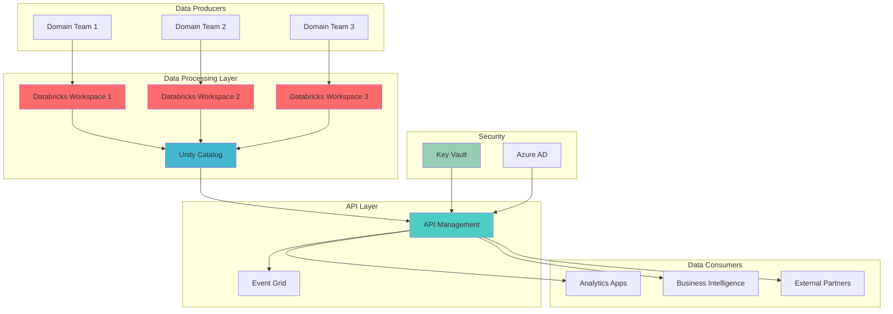

# Serverless Data Mesh with Databricks and API Management

## Problem

Organizations struggle with centralized data architectures that create bottlenecks, slow innovation, and disconnect domain experts from data ownership. Traditional monolithic data platforms become unmanageable as data volumes grow, leading to delayed insights, duplicated efforts across teams, and difficulty in maintaining data quality at scale.

## Solution

Implement a decentralized data mesh architecture using Azure Databricks for distributed data processing and Azure API Management to expose domain-specific data products as managed APIs. This approach enables autonomous teams to own and serve their data products while maintaining governance, security, and discoverability through standardized API contracts and serverless compute.

## Architecture Diagram



## Prerequisites

1. Azure subscription with Owner or Contributor access
2. Azure CLI v2.40 or later installed and configured
3. Understanding of data mesh principles and domain-driven design
4. Familiarity with REST APIs and authentication concepts
5. Estimated cost: ~$150-200/month for minimal setup (varies with usage)

> **Note**: Ensure you have appropriate Azure AD permissions to create service principals and manage role assignments across resources.

## Preparation

```bash
# Set environment variables
export RESOURCE_GROUP="rg-data-mesh-demo"
export LOCATION="eastus"
export SUBSCRIPTION_ID=$(az account show --query id --output tsv)

# Generate unique suffix for resource names
RANDOM_SUFFIX=$(openssl rand -hex 3)

# Create resource group
az group create \
    --name ${RESOURCE_GROUP} \
    --location ${LOCATION} \
    --tags purpose=data-mesh environment=demo

# Store important values
export DATABRICKS_WORKSPACE="databricks-${RANDOM_SUFFIX}"
export APIM_SERVICE="apim-mesh-${RANDOM_SUFFIX}"
export KEYVAULT_NAME="kv-mesh-${RANDOM_SUFFIX}"
export EVENT_GRID_TOPIC="eg-mesh-${RANDOM_SUFFIX}"

echo "✅ Resource group created: ${RESOURCE_GROUP}"
```

## Steps

1. **Create Azure Databricks Workspace with Unity Catalog**:

   Unity Catalog provides unified governance for all data assets across Databricks workspaces, enabling data mesh's federated computational governance principle. This centralized metastore allows domain teams to maintain ownership while ensuring enterprise-wide data discovery and access control. The serverless compute option eliminates infrastructure management overhead, allowing teams to focus on data product development.

   ```bash
   # Create Databricks workspace
   az databricks workspace create \
       --name ${DATABRICKS_WORKSPACE} \
       --resource-group ${RESOURCE_GROUP} \
       --location ${LOCATION} \
       --sku premium \
       --enable-no-public-ip true

   # Get workspace details
   DATABRICKS_WORKSPACE_ID=$(az databricks workspace show \
       --name ${DATABRICKS_WORKSPACE} \
       --resource-group ${RESOURCE_GROUP} \
       --query id --output tsv)

   echo "✅ Databricks workspace created with ID: ${DATABRICKS_WORKSPACE_ID}"
   ```

   The Databricks workspace is now configured with premium features enabling Unity Catalog support. This provides the foundation for implementing domain-oriented data ownership while maintaining centralized governance through a unified metastore architecture.

2. **Set Up Azure Key Vault for Secure Credential Management**:

   Azure Key Vault serves as the centralized secret management system for the data mesh, storing API keys, connection strings, and certificates used by data products. This approach ensures that sensitive credentials are never hardcoded in data processing pipelines or API configurations, maintaining security best practices across all domain teams.

   ```bash
   # Create Key Vault
   az keyvault create \
       --name ${KEYVAULT_NAME} \
       --resource-group ${RESOURCE_GROUP} \
       --location ${LOCATION} \
       --sku standard \
       --enable-rbac-authorization true

   # Store Databricks workspace URL
   DATABRICKS_URL=$(az databricks workspace show \
       --name ${DATABRICKS_WORKSPACE} \
       --resource-group ${RESOURCE_GROUP} \
       --query workspaceUrl --output tsv)

   az keyvault secret set \
       --vault-name ${KEYVAULT_NAME} \
       --name "databricks-url" \
       --value "https://${DATABRICKS_URL}"

   echo "✅ Key Vault created and configured"
   ```

3. **Deploy Azure API Management for Data Product APIs**:

   Azure API Management acts as the data product serving layer, providing a standardized interface for consuming domain data products. This serverless consumption tier automatically scales based on demand while maintaining consistent API governance, throttling, and security policies across all data products. The developer portal enables self-service discovery of available data products.

   ```bash
   # Create API Management instance (consumption tier for serverless)
   az apim create \
       --name ${APIM_SERVICE} \
       --resource-group ${RESOURCE_GROUP} \
       --publisher-name "DataMeshTeam" \
       --publisher-email "datamesh@example.com" \
       --sku-name Consumption \
       --location ${LOCATION}

   # Wait for APIM to be fully provisioned
   echo "⏳ Waiting for API Management provisioning (this may take 20-30 minutes)..."
   
   az apim wait \
       --name ${APIM_SERVICE} \
       --resource-group ${RESOURCE_GROUP} \
       --created

   echo "✅ API Management service created"
   ```

   The API Management service now provides a unified gateway for all data products, enabling consistent authentication, rate limiting, and monitoring across domain boundaries while maintaining the autonomy principle of data mesh architecture.

4. **Configure Event Grid for Real-time Data Product Events**:

   Event Grid enables event-driven communication between data products and consumers, supporting real-time notifications when data products are updated or new versions are published. This serverless event routing service scales automatically and provides reliable delivery guarantees, essential for maintaining data product freshness across the mesh.

   ```bash
   # Create Event Grid topic
   az eventgrid topic create \
       --name ${EVENT_GRID_TOPIC} \
       --resource-group ${RESOURCE_GROUP} \
       --location ${LOCATION} \
       --identity systemassigned

   # Get Event Grid endpoint
   EVENT_GRID_ENDPOINT=$(az eventgrid topic show \
       --name ${EVENT_GRID_TOPIC} \
       --resource-group ${RESOURCE_GROUP} \
       --query endpoint --output tsv)

   # Get Event Grid key
   EVENT_GRID_KEY=$(az eventgrid topic key list \
       --name ${EVENT_GRID_TOPIC} \
       --resource-group ${RESOURCE_GROUP} \
       --query key1 --output tsv)

   # Store Event Grid credentials in Key Vault
   az keyvault secret set \
       --vault-name ${KEYVAULT_NAME} \
       --name "eventgrid-endpoint" \
       --value ${EVENT_GRID_ENDPOINT}

   az keyvault secret set \
       --vault-name ${KEYVAULT_NAME} \
       --name "eventgrid-key" \
       --value ${EVENT_GRID_KEY}

   echo "✅ Event Grid topic configured"
   ```

5. **Create Sample Data Product API Definition**:

   This step defines a standardized API contract for a sample data product, demonstrating how domain teams expose their analytical data through well-defined interfaces. The OpenAPI specification ensures consistent documentation and enables automatic client SDK generation, supporting the self-serve data platform principle of data mesh.

   ```bash
   # Create API definition file
   cat > data-product-api.json <<EOF
   {
     "openapi": "3.0.1",
     "info": {
       "title": "Customer Analytics Data Product",
       "description": "Domain-owned customer analytics data product API",
       "version": "1.0"
     },
     "servers": [
       {
         "url": "https://${APIM_SERVICE}.azure-api.net/customer-analytics"
       }
     ],
     "paths": {
       "/metrics": {
         "get": {
           "summary": "Get customer metrics",
           "operationId": "getCustomerMetrics",
           "parameters": [
             {
               "name": "dateFrom",
               "in": "query",
               "required": true,
               "schema": {
                 "type": "string",
                 "format": "date"
               }
             }
           ],
           "responses": {
             "200": {
               "description": "Successful response",
               "content": {
                 "application/json": {
                   "schema": {
                     "type": "object"
                   }
                 }
               }
             }
           }
         }
       }
     }
   }
   EOF

   echo "✅ API definition created"
   ```

6. **Import Data Product API into API Management**:

   Importing the API definition into API Management establishes the serving infrastructure for the data product. This step configures routing, authentication, and policy enforcement, ensuring that data products are accessible through a consistent, governed interface while maintaining performance through built-in caching and throttling capabilities.

   ```bash
   # Import API definition
   az apim api import \
       --resource-group ${RESOURCE_GROUP} \
       --service-name ${APIM_SERVICE} \
       --api-id "customer-analytics-api" \
       --path "customer-analytics" \
       --specification-format OpenApi \
       --specification-path data-product-api.json \
       --display-name "Customer Analytics Data Product"

   # Create API subscription for access control
   SUBSCRIPTION_KEY=$(az apim subscription create \
       --resource-group ${RESOURCE_GROUP} \
       --service-name ${APIM_SERVICE} \
       --name "data-consumer-subscription" \
       --display-name "Data Consumer Subscription" \
       --scope "/apis/customer-analytics-api" \
       --query primaryKey --output tsv)

   echo "✅ API imported with subscription key: ${SUBSCRIPTION_KEY:0:10}..."
   ```

7. **Configure API Policies for Data Product Governance**:

   API policies enforce data mesh governance principles at the API gateway level, implementing authentication, rate limiting, and response caching. These policies ensure consistent security and performance characteristics across all data products while allowing domain teams to define product-specific rules through policy inheritance.

   ```bash
   # Create API policy XML
   cat > api-policy.xml <<EOF
   <policies>
     <inbound>
       <base />
       <validate-jwt header-name="Authorization" failed-validation-httpcode="401" failed-validation-error-message="Unauthorized">
         <openid-config url="https://login.microsoftonline.com/${SUBSCRIPTION_ID}/.well-known/openid-configuration" />
         <audiences>
           <audience>https://${APIM_SERVICE}.azure-api.net</audience>
         </audiences>
       </validate-jwt>
       <rate-limit calls="100" renewal-period="60" />
     </inbound>
     <backend>
       <base />
     </backend>
     <outbound>
       <base />
       <cache-store duration="300" />
     </outbound>
   </policies>
   EOF

   # Apply policy to API
   az apim api policy create \
       --resource-group ${RESOURCE_GROUP} \
       --service-name ${APIM_SERVICE} \
       --api-id "customer-analytics-api" \
       --policy-file api-policy.xml

   echo "✅ API policies configured"
   ```

8. **Set Up Event Grid Subscription for Data Product Updates**:

   Event Grid subscriptions enable consumers to receive real-time notifications when data products are updated, supporting event-driven architectures within the data mesh. This configuration demonstrates how domain teams can publish data availability events while consumers subscribe to relevant updates, maintaining loose coupling between producers and consumers.

   ```bash
   # Create webhook endpoint for testing (using RequestBin)
   WEBHOOK_ENDPOINT="https://webhook.site/unique-endpoint"

   # Create Event Grid subscription
   az eventgrid event-subscription create \
       --name "data-product-updates" \
       --source-resource-id "/subscriptions/${SUBSCRIPTION_ID}/resourceGroups/${RESOURCE_GROUP}/providers/Microsoft.EventGrid/topics/${EVENT_GRID_TOPIC}" \
       --endpoint ${WEBHOOK_ENDPOINT} \
       --event-types "DataProductUpdated" "DataProductCreated"

   echo "✅ Event Grid subscription created"
   ```

9. **Configure Databricks Unity Catalog Integration**:

   Unity Catalog integration establishes the governance foundation for data products within Databricks, enabling fine-grained access control, data lineage tracking, and cross-workspace data sharing. This configuration allows domain teams to manage their data products independently while maintaining enterprise-wide discoverability and compliance.

   ```bash
   # Create service principal for Databricks
   SP_RESULT=$(az ad sp create-for-rbac \
       --name "sp-databricks-${RANDOM_SUFFIX}" \
       --role "Contributor" \
       --scopes "/subscriptions/${SUBSCRIPTION_ID}/resourceGroups/${RESOURCE_GROUP}")

   SP_APP_ID=$(echo $SP_RESULT | jq -r '.appId')
   SP_PASSWORD=$(echo $SP_RESULT | jq -r '.password')

   # Store credentials in Key Vault
   az keyvault secret set \
       --vault-name ${KEYVAULT_NAME} \
       --name "databricks-sp-id" \
       --value ${SP_APP_ID}

   az keyvault secret set \
       --vault-name ${KEYVAULT_NAME} \
       --name "databricks-sp-secret" \
       --value ${SP_PASSWORD}

   echo "✅ Databricks service principal configured"
   ```

10. **Create Sample Data Product Notebook**:

    This notebook template demonstrates how domain teams implement data products within Databricks, leveraging serverless compute for processing and Unity Catalog for governance. The notebook structure follows data mesh principles by encapsulating domain logic while exposing standardized interfaces for data consumption.

    ```bash
    # Create notebook content
    cat > data-product-notebook.py <<EOF
    # Databricks notebook source
    # MAGIC %md
    # MAGIC # Customer Analytics Data Product
    # MAGIC This notebook implements the customer analytics data product

    # COMMAND ----------
    # Import required libraries
    from pyspark.sql import SparkSession
    from delta.tables import DeltaTable
    import requests
    import json

    # COMMAND ----------
    # Configure Unity Catalog
    spark.conf.set("spark.databricks.unityCatalog.enabled", "true")
    catalog_name = "data_mesh_catalog"
    schema_name = "customer_analytics"

    # COMMAND ----------
    # Create sample data product
    spark.sql(f"CREATE CATALOG IF NOT EXISTS {catalog_name}")
    spark.sql(f"CREATE SCHEMA IF NOT EXISTS {catalog_name}.{schema_name}")

    # COMMAND ----------
    # Define data product table
    spark.sql(f"""
    CREATE TABLE IF NOT EXISTS {catalog_name}.{schema_name}.customer_metrics (
        customer_id STRING,
        metric_date DATE,
        total_purchases DECIMAL(10,2),
        engagement_score DOUBLE,
        last_updated TIMESTAMP
    )
    USING DELTA
    """)

    # COMMAND ----------
    # Function to publish data product update event
    def publish_update_event(table_name, version):
        event_grid_endpoint = dbutils.secrets.get("keyvault", "eventgrid-endpoint")
        event_grid_key = dbutils.secrets.get("keyvault", "eventgrid-key")
        
        event = {
            "id": str(uuid.uuid4()),
            "eventType": "DataProductUpdated",
            "subject": f"datamesh/{table_name}",
            "eventTime": datetime.utcnow().isoformat() + "Z",
            "data": {
                "tableName": table_name,
                "version": version,
                "catalog": catalog_name,
                "schema": schema_name
            }
        }
        
        headers = {
            "aeg-sas-key": event_grid_key,
            "Content-Type": "application/json"
        }
        
        response = requests.post(event_grid_endpoint, json=[event], headers=headers)
        return response.status_code == 200
    EOF

    echo "✅ Sample notebook created"
    ```

## Validation & Testing

1. Verify API Management deployment:

   ```bash
   # Check API Management status
   az apim show \
       --name ${APIM_SERVICE} \
       --resource-group ${RESOURCE_GROUP} \
       --query "provisioningState" --output tsv
   ```

   Expected output: `Succeeded`

2. Test data product API endpoint:

   ```bash
   # Test API with subscription key
   curl -X GET "https://${APIM_SERVICE}.azure-api.net/customer-analytics/metrics?dateFrom=2024-01-01" \
       -H "Ocp-Apim-Subscription-Key: ${SUBSCRIPTION_KEY}" \
       -H "Content-Type: application/json"
   ```

   Expected output: API response or authentication challenge

3. Verify Event Grid configuration:

   ```bash
   # List Event Grid subscriptions
   az eventgrid event-subscription list \
       --source-resource-id "/subscriptions/${SUBSCRIPTION_ID}/resourceGroups/${RESOURCE_GROUP}/providers/Microsoft.EventGrid/topics/${EVENT_GRID_TOPIC}" \
       --output table
   ```

   Expected output: Table showing the created subscription

4. Check Databricks workspace accessibility:

   ```bash
   # Get Databricks workspace URL
   echo "Databricks URL: https://${DATABRICKS_URL}"
   
   # Verify workspace exists
   az databricks workspace show \
       --name ${DATABRICKS_WORKSPACE} \
       --resource-group ${RESOURCE_GROUP} \
       --query "name" --output tsv
   ```

   Expected output: Databricks workspace name

## Cleanup

1. Delete API Management service:

   ```bash
   # Remove API Management (this may take 15-20 minutes)
   az apim delete \
       --name ${APIM_SERVICE} \
       --resource-group ${RESOURCE_GROUP} \
       --yes

   echo "✅ API Management service deletion initiated"
   ```

2. Remove Databricks workspace:

   ```bash
   # Delete Databricks workspace
   az databricks workspace delete \
       --name ${DATABRICKS_WORKSPACE} \
       --resource-group ${RESOURCE_GROUP} \
       --yes

   echo "✅ Databricks workspace deleted"
   ```

3. Clean up Event Grid resources:

   ```bash
   # Delete Event Grid topic
   az eventgrid topic delete \
       --name ${EVENT_GRID_TOPIC} \
       --resource-group ${RESOURCE_GROUP} \
       --yes

   echo "✅ Event Grid topic deleted"
   ```

4. Remove Key Vault:

   ```bash
   # Delete Key Vault (soft delete)
   az keyvault delete \
       --name ${KEYVAULT_NAME} \
       --resource-group ${RESOURCE_GROUP}

   # Purge Key Vault (permanent deletion)
   az keyvault purge \
       --name ${KEYVAULT_NAME} \
       --location ${LOCATION}

   echo "✅ Key Vault deleted and purged"
   ```

5. Delete resource group:

   ```bash
   # Remove entire resource group
   az group delete \
       --name ${RESOURCE_GROUP} \
       --yes \
       --no-wait

   echo "✅ Resource group deletion initiated"
   echo "Note: Complete deletion may take several minutes"
   ```

## Discussion

Data mesh architecture represents a paradigm shift from centralized data platforms to domain-oriented, decentralized data ownership. By combining Azure Databricks' serverless compute capabilities with Azure API Management's robust API governance features, organizations can implement true data democratization while maintaining enterprise-grade security and compliance. This approach addresses the fundamental challenges of scale, agility, and domain expertise that plague traditional monolithic data architectures. For comprehensive guidance on data mesh principles, see the [Azure Architecture Center's data mesh documentation](https://docs.microsoft.com/en-us/azure/architecture/reference-architectures/data/data-mesh) and [Databricks' data mesh implementation guide](https://docs.microsoft.com/en-us/azure/databricks/lakehouse/data-mesh).

The serverless nature of both Azure Databricks and API Management's consumption tier eliminates infrastructure management overhead, allowing domain teams to focus on delivering business value through their data products. Unity Catalog provides the crucial governance layer that enables federated computational governance - a core principle of data mesh architecture. This ensures that while data ownership is distributed, governance policies, security standards, and compliance requirements are consistently enforced across all domains. The [Azure Well-Architected Framework](https://docs.microsoft.com/en-us/azure/architecture/framework/) provides additional guidance on building reliable, secure, and cost-effective solutions.

Event-driven communication through Azure Event Grid enables real-time data product discovery and consumption patterns, supporting both push and pull mechanisms for data access. This approach allows consumers to subscribe to data product updates, ensuring they always work with the freshest data while maintaining loose coupling between producers and consumers. The combination of API Management for synchronous access and Event Grid for asynchronous notifications provides flexibility in how data products are consumed. For detailed patterns, review the [event-driven architecture documentation](https://docs.microsoft.com/en-us/azure/architecture/guide/architecture-styles/event-driven).

> **Tip**: Start with a single domain team as a pilot, establishing patterns and best practices before scaling to enterprise-wide adoption. Use Azure Monitor and Application Insights to track API usage patterns and identify optimization opportunities. The [monitoring best practices guide](https://docs.microsoft.com/en-us/azure/api-management/observability) provides comprehensive strategies for maintaining visibility across your data mesh implementation.

## Challenge

Extend this solution by implementing these enhancements:

1. Implement automated data quality scoring for each data product using Azure Databricks Data Quality rules and expose quality metrics through dedicated API endpoints
2. Create a data product catalog UI using Azure Static Web Apps that queries API Management's developer portal APIs to provide a searchable inventory of available data products
3. Add Azure Cognitive Search integration to enable full-text search across data product metadata and documentation stored in Unity Catalog
4. Implement cost allocation and chargeback for data product consumption using Azure Cost Management APIs and API Management's usage analytics
5. Deploy a multi-region architecture with Azure Front Door to provide global access to data products with automatic failover and geographic load balancing

## Infrastructure Code

*Infrastructure code will be generated after recipe approval.*