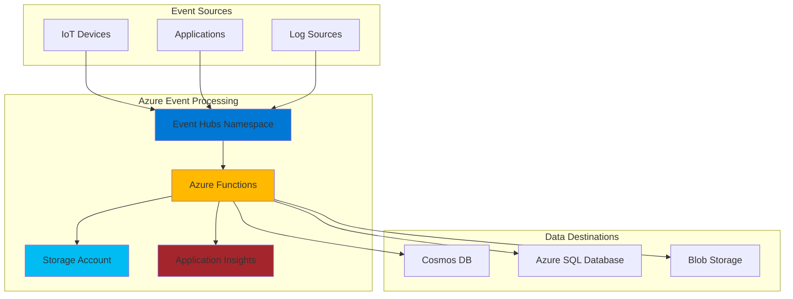

# Serverless Event Processing Pipeline with Auto-Scaling

## Problem

Your organization needs to process thousands of events per second in real-time from IoT devices, application logs, or user interactions. Traditional server-based solutions require complex infrastructure management, auto-scaling configurations, and significant operational overhead to handle variable workloads. You need a solution that can automatically scale to handle traffic spikes, process events with minimal latency, and provide cost-effective pay-per-use pricing without managing servers or infrastructure.

## Solution

Implement a serverless real-time data processing pipeline using Azure Functions triggered by Azure Event Hubs. This architecture leverages Event Hubs as a highly scalable event ingestion service that can handle millions of events per second, while Azure Functions provides serverless compute that automatically scales based on the incoming event load. The solution includes built-in monitoring through Application Insights and uses Azure Storage for checkpointing and state management, creating a robust, scalable, and cost-effective event processing system.

## Architecture Diagram



## Prerequisites

1. Azure account with permissions to create Event Hubs namespaces, Function Apps, and Storage accounts
2. Azure CLI installed and configured with appropriate credentials
3. Basic understanding of serverless computing concepts and event-driven architectures
4. Familiarity with Azure Functions runtime and triggers
5. Estimated cost: Event Hubs Basic tier (~$11/month), Function App consumption plan (pay-per-execution), Storage account (~$0.05/GB/month)

> **Note**: This recipe uses the Azure Functions consumption plan for optimal cost efficiency. You can upgrade to Premium or Dedicated plans for enhanced performance requirements.

## Preparation

Set up environment variables and foundational Azure resources:

```bash
# Set environment variables for Azure resources
export RESOURCE_GROUP="rg-recipe-${RANDOM_SUFFIX}"
export LOCATION="eastus"
export SUBSCRIPTION_ID=$(az account show --query id --output tsv)

# Generate unique suffix for resource names
RANDOM_SUFFIX=$(openssl rand -hex 3)

# Define resource names with appropriate Azure naming conventions
export EVENTHUB_NAMESPACE="eh-ns-${RANDOM_SUFFIX}"
export EVENTHUB_NAME="events-hub"
export FUNCTION_APP_NAME="func-processor-${RANDOM_SUFFIX}"
export STORAGE_ACCOUNT_NAME="st${RANDOM_SUFFIX}"
export APP_INSIGHTS_NAME="ai-processor-${RANDOM_SUFFIX}"

# Create resource group
az group create \
    --name ${RESOURCE_GROUP} \
    --location ${LOCATION} \
    --tags purpose=recipe environment=demo

echo "✅ Resource group created: ${RESOURCE_GROUP}"
```

## Steps

1. **Create Event Hubs Namespace and Event Hub**:

   Azure Event Hubs provides a distributed streaming platform capable of receiving and processing millions of events per second. The Event Hubs namespace acts as a management container that provides DNS-integrated network endpoints and access control features like IP filtering and virtual network integration. For comprehensive information about Event Hubs architecture, see the [Event Hubs features documentation](https://docs.microsoft.com/en-us/azure/event-hubs/event-hubs-features).

   ```bash
   # Create Event Hubs namespace
   az eventhubs namespace create \
       --name ${EVENTHUB_NAMESPACE} \
       --resource-group ${RESOURCE_GROUP} \
       --location ${LOCATION} \
       --sku Basic \
       --enable-auto-inflate false

   # Create Event Hub within the namespace
   az eventhubs eventhub create \
       --name ${EVENTHUB_NAME} \
       --namespace-name ${EVENTHUB_NAMESPACE} \
       --resource-group ${RESOURCE_GROUP} \
       --partition-count 4 \
       --message-retention 1
   
   echo "✅ Event Hubs namespace and Event Hub created successfully"
   ```

   The Event Hub is now configured with 4 partitions for parallel processing and 1-day message retention. This setup enables high-throughput event ingestion while maintaining cost efficiency. The partition count determines the maximum degree of parallelism for consumer applications.

2. **Create Storage Account for Function App**:

   Azure Storage provides the backend infrastructure required by Azure Functions for state management, trigger coordination, and execution logging. The storage account will also serve as the checkpoint store for Event Hubs processing, ensuring exactly-once processing semantics. Learn more about storage requirements in the [Azure Functions storage documentation](https://docs.microsoft.com/en-us/azure/azure-functions/storage-considerations).

   ```bash
   # Create storage account for Function App
   az storage account create \
       --name ${STORAGE_ACCOUNT_NAME} \
       --resource-group ${RESOURCE_GROUP} \
       --location ${LOCATION} \
       --sku Standard_LRS \
       --kind StorageV2 \
       --access-tier Hot

   # Get storage account connection string
   STORAGE_CONNECTION_STRING=$(az storage account show-connection-string \
       --name ${STORAGE_ACCOUNT_NAME} \
       --resource-group ${RESOURCE_GROUP} \
       --query connectionString \
       --output tsv)

   echo "✅ Storage account created with connection string configured"
   ```

   The storage account is configured with locally redundant storage (LRS) for cost optimization and hot access tier for frequently accessed function artifacts. This provides the foundational storage layer for Azure Functions runtime operations.

3. **Create Application Insights for Monitoring**:

   Application Insights provides comprehensive monitoring, logging, and performance tracking for serverless applications. It automatically collects telemetry data from Azure Functions, enabling real-time visibility into function execution, performance metrics, and error tracking. For detailed monitoring capabilities, see the [Application Insights for Azure Functions documentation](https://docs.microsoft.com/en-us/azure/azure-functions/functions-monitoring).

   ```bash
   # Create Application Insights instance
   az monitor app-insights component create \
       --app ${APP_INSIGHTS_NAME} \
       --location ${LOCATION} \
       --resource-group ${RESOURCE_GROUP} \
       --application-type web \
       --kind web

   # Get Application Insights instrumentation key
   APPINSIGHTS_KEY=$(az monitor app-insights component show \
       --app ${APP_INSIGHTS_NAME} \
       --resource-group ${RESOURCE_GROUP} \
       --query instrumentationKey \
       --output tsv)

   echo "✅ Application Insights created with instrumentation key configured"
   ```

   Application Insights is now ready to collect telemetry data from your function executions. This enables distributed tracing, performance monitoring, and automated alerting for your serverless data processing pipeline.

4. **Create Function App with Event Hubs Trigger**:

   Azure Functions provides the serverless compute platform that automatically scales based on incoming events. The Function App will be configured with Event Hubs integration and necessary runtime settings for optimal performance. For hosting plan comparisons and scaling behavior, reference the [Azure Functions hosting options documentation](https://docs.microsoft.com/en-us/azure/azure-functions/functions-scale).

   ```bash
   # Create Function App
   az functionapp create \
       --name ${FUNCTION_APP_NAME} \
       --resource-group ${RESOURCE_GROUP} \
       --storage-account ${STORAGE_ACCOUNT_NAME} \
       --consumption-plan-location ${LOCATION} \
       --runtime node \
       --runtime-version 18 \
       --functions-version 4 \
       --app-insights ${APP_INSIGHTS_NAME}

   # Get Event Hubs connection string
   EVENTHUB_CONNECTION_STRING=$(az eventhubs namespace authorization-rule keys list \
       --resource-group ${RESOURCE_GROUP} \
       --namespace-name ${EVENTHUB_NAMESPACE} \
       --name RootManageSharedAccessKey \
       --query primaryConnectionString \
       --output tsv)

   # Configure Function App settings
   az functionapp config appsettings set \
       --name ${FUNCTION_APP_NAME} \
       --resource-group ${RESOURCE_GROUP} \
       --settings \
           "EventHubConnectionString=${EVENTHUB_CONNECTION_STRING}" \
           "APPINSIGHTS_INSTRUMENTATIONKEY=${APPINSIGHTS_KEY}" \
           "FUNCTIONS_WORKER_RUNTIME=node"

   echo "✅ Function App created and configured with Event Hubs integration"
   ```

   The Function App is now configured with the Node.js runtime and connected to Event Hubs for automatic triggering. The consumption plan ensures automatic scaling and cost optimization based on actual usage patterns.

5. **Deploy Function Code for Event Processing**:

   The function code implements the core event processing logic with proper error handling, logging, and performance optimization. This example demonstrates batch processing of events with structured logging and monitoring integration. For Event Hubs trigger configuration options, see the [Event Hubs trigger documentation](https://docs.microsoft.com/en-us/azure/azure-functions/functions-bindings-event-hubs-trigger).

   ```bash
   # Create local function project structure
   mkdir -p event-processor-function
   cd event-processor-function

   # Initialize function project
   func init . --worker-runtime node --language javascript

   # Create Event Hub triggered function
   func new --name ProcessEvents --template "EventHubTrigger" --authlevel "function"

   # Create the function implementation
   cat > ProcessEvents/index.js << 'EOF'
   const { app } = require('@azure/functions');

   app.eventHub('ProcessEvents', {
       connection: 'EventHubConnectionString',
       eventHubName: 'events-hub',
       cardinality: 'many',
       handler: async (events, context) => {
           context.log(`Processing ${events.length} events`);
           
           for (const event of events) {
               try {
                   // Process each event
                   const eventData = typeof event === 'string' ? JSON.parse(event) : event;
                   
                   // Add your processing logic here
                   const processedData = {
                       id: eventData.id || 'unknown',
                       timestamp: new Date().toISOString(),
                       source: eventData.source || 'unknown',
                       processed: true,
                       originalEvent: eventData
                   };
                   
                   // Log processed event for monitoring
                   context.log(`Processed event: ${JSON.stringify(processedData)}`);
                   
                   // Here you would typically save to database or forward to another service
                   // Example: await saveToDatabase(processedData);
                   
               } catch (error) {
                   context.log.error(`Error processing event: ${error.message}`);
                   // Implement dead letter queue logic if needed
               }
           }
           
           context.log(`Successfully processed ${events.length} events`);
       }
   });
   EOF

   # Create package.json with required dependencies
   cat > package.json << 'EOF'
   {
       "name": "event-processor-function",
       "version": "1.0.0",
       "description": "Azure Function for real-time event processing",
       "main": "index.js",
       "scripts": {
           "test": "echo \"Error: no test specified\" && exit 1"
       },
       "dependencies": {
           "@azure/functions": "^4.0.0"
       }
   }
   EOF

   # Deploy function to Azure
   func azure functionapp publish ${FUNCTION_APP_NAME} --javascript

   cd ..
   echo "✅ Function code deployed successfully"
   ```

   The function is now deployed and ready to process events from Event Hubs. The implementation includes error handling, structured logging, and batch processing capabilities for optimal performance and reliability.

6. **Create Event Producer for Testing**:

   To validate the event processing pipeline, we'll create a simple event producer that sends test events to Event Hubs. This demonstrates how external systems can integrate with your real-time processing pipeline.

   ```bash
   # Create event producer script
   cat > send-events.js << 'EOF'
   const { EventHubProducerClient } = require("@azure/event-hubs");

   const connectionString = process.env.EVENTHUB_CONNECTION_STRING;
   const eventHubName = "events-hub";

   async function sendEvents() {
       const producer = new EventHubProducerClient(connectionString, eventHubName);
       
       try {
           const batch = await producer.createBatch();
           
           for (let i = 1; i <= 10; i++) {
               const eventData = {
                   id: `event-${i}`,
                   source: "test-producer",
                   timestamp: new Date().toISOString(),
                   data: `Sample event data ${i}`,
                   temperature: Math.random() * 100,
                   humidity: Math.random() * 100
               };
               
               const success = batch.tryAdd({ body: eventData });
               if (!success) {
                   console.log(`Failed to add event ${i} to batch`);
               }
           }
           
           await producer.sendBatch(batch);
           console.log("✅ Successfully sent 10 events to Event Hub");
           
       } catch (error) {
           console.error("Error sending events:", error);
       } finally {
           await producer.close();
       }
   }

   sendEvents().catch(console.error);
   EOF

   # Create package.json for event producer
   cat > package.json << 'EOF'
   {
       "name": "event-producer",
       "version": "1.0.0",
       "dependencies": {
           "@azure/event-hubs": "^5.11.0"
       }
   }
   EOF

   # Install dependencies and run event producer
   npm install
   EVENTHUB_CONNECTION_STRING="${EVENTHUB_CONNECTION_STRING}" node send-events.js

   echo "✅ Test events sent to Event Hub"
   ```

   The event producer has successfully sent test events to Event Hubs, which will trigger the Azure Function for processing. This demonstrates the complete event flow from producer to consumer in your serverless architecture.

## Validation & Testing

1. **Verify Event Hub is receiving events**:

   ```bash
   # Check Event Hub metrics
   az monitor metrics list \
       --resource "/subscriptions/${SUBSCRIPTION_ID}/resourceGroups/${RESOURCE_GROUP}/providers/Microsoft.EventHub/namespaces/${EVENTHUB_NAMESPACE}/eventhubs/${EVENTHUB_NAME}" \
       --metric "IncomingMessages" \
       --interval PT1M \
       --output table
   ```

   Expected output: Should show incoming message count > 0 indicating events are being received.

2. **Monitor Function App execution**:

   ```bash
   # Check Function App status
   az functionapp show \
       --name ${FUNCTION_APP_NAME} \
       --resource-group ${RESOURCE_GROUP} \
       --query "{name:name,state:state,hostingEnvironment:hostingEnvironment}" \
       --output table

   # View recent function logs
   az functionapp logs tail \
       --name ${FUNCTION_APP_NAME} \
       --resource-group ${RESOURCE_GROUP}
   ```

   Expected output: Function App should be in "Running" state with logs showing event processing activity.

3. **Test Application Insights monitoring**:

   ```bash
   # Query Application Insights for function telemetry
   az monitor app-insights query \
       --app ${APP_INSIGHTS_NAME} \
       --resource-group ${RESOURCE_GROUP} \
       --analytics-query "requests | where cloud_RoleName == '${FUNCTION_APP_NAME}' | limit 10" \
       --output table
   ```

   Expected output: Should show function execution requests with response times and success rates.

## Cleanup

1. **Delete Function App and associated resources**:

   ```bash
   # Delete Function App
   az functionapp delete \
       --name ${FUNCTION_APP_NAME} \
       --resource-group ${RESOURCE_GROUP}

   echo "✅ Function App deleted"
   ```

2. **Delete Event Hubs namespace**:

   ```bash
   # Delete Event Hubs namespace (includes all Event Hubs)
   az eventhubs namespace delete \
       --name ${EVENTHUB_NAMESPACE} \
       --resource-group ${RESOURCE_GROUP}

   echo "✅ Event Hubs namespace deleted"
   ```

3. **Delete Storage Account**:

   ```bash
   # Delete Storage Account
   az storage account delete \
       --name ${STORAGE_ACCOUNT_NAME} \
       --resource-group ${RESOURCE_GROUP} \
       --yes

   echo "✅ Storage Account deleted"
   ```

4. **Delete Application Insights**:

   ```bash
   # Delete Application Insights
   az monitor app-insights component delete \
       --app ${APP_INSIGHTS_NAME} \
       --resource-group ${RESOURCE_GROUP}

   echo "✅ Application Insights deleted"
   ```

5. **Delete resource group and all contained resources**:

   ```bash
   # Delete resource group and all contained resources
   az group delete \
       --name ${RESOURCE_GROUP} \
       --yes \
       --no-wait

   echo "✅ Resource group deletion initiated: ${RESOURCE_GROUP}"
   echo "Note: Deletion may take several minutes to complete"

   # Verify deletion (optional)
   az group exists --name ${RESOURCE_GROUP}
   ```

## Discussion

Implementing real-time data processing with Azure Functions and Event Hubs creates a highly scalable, cost-effective serverless architecture that automatically adapts to varying workloads. This pattern is particularly powerful for IoT scenarios, log processing, and real-time analytics where traditional server-based solutions would require significant infrastructure investment and operational complexity. For comprehensive guidance on serverless architectures, see the [Azure Functions documentation](https://docs.microsoft.com/en-us/azure/azure-functions/) and [Event Hubs overview](https://docs.microsoft.com/en-us/azure/event-hubs/event-hubs-about).

The event-driven architecture provides natural decoupling between event producers and consumers, enabling you to scale each component independently. Event Hubs acts as a buffer that can handle traffic spikes while Azure Functions scale automatically based on the incoming event volume. This design follows the [Azure Well-Architected Framework](https://docs.microsoft.com/en-us/azure/architecture/framework/) principles of reliability, scalability, and cost optimization.

From a performance perspective, Event Hubs partitioning enables parallel processing across multiple function instances, allowing you to process thousands of events per second with minimal latency. The built-in checkpointing mechanism ensures exactly-once processing semantics, preventing data loss and duplicate processing even during failures or scaling operations. For detailed performance considerations, reference the [Event Hubs performance guide](https://docs.microsoft.com/en-us/azure/event-hubs/event-hubs-performance-guide).

> **Warning**: Be mindful of Event Hubs throughput units and Function App scaling limits. Monitor your usage through Azure Monitor to ensure you're not hitting throttling limits. Consider using Premium or Dedicated plans for consistently high-throughput scenarios. Review the [Azure Functions scaling documentation](https://docs.microsoft.com/en-us/azure/azure-functions/functions-scale) for detailed guidance.

The integration with Application Insights provides comprehensive monitoring and alerting capabilities, enabling you to track function performance, identify bottlenecks, and set up automated responses to operational issues. This observability is crucial for maintaining reliable real-time processing systems in production environments. Learn more about monitoring serverless applications in the [Application Insights documentation](https://docs.microsoft.com/en-us/azure/azure-monitor/app/app-insights-overview).

## Challenge

Extend this real-time data processing solution with these advanced capabilities:

1. **Implement Dead Letter Queue handling** by adding error processing logic that routes failed events to a separate Event Hub or Service Bus queue for manual inspection and reprocessing.

2. **Add data transformation and enrichment** by integrating with Azure Cosmos DB to look up reference data and enrich events with additional context before processing.

3. **Create real-time dashboards** using Azure Stream Analytics and Power BI to visualize incoming event streams and processing metrics in real-time.

4. **Implement event replay capability** by storing processed events in Azure Data Lake and creating a function that can replay events from a specific time range for testing or recovery scenarios.

5. **Add multi-region disaster recovery** by setting up Event Hubs geo-disaster recovery and deploying Function Apps across multiple Azure regions for high availability.

## Infrastructure Code

*Infrastructure code will be generated after recipe approval.*

---
*Recipe ID: implementing-real-time-data-processing-azure-functions-event-hubs | Last Updated: 2025-07-12 | Tags: serverless, real-time, data-processing, event-driven, streaming, azure-functions, event-hubs*