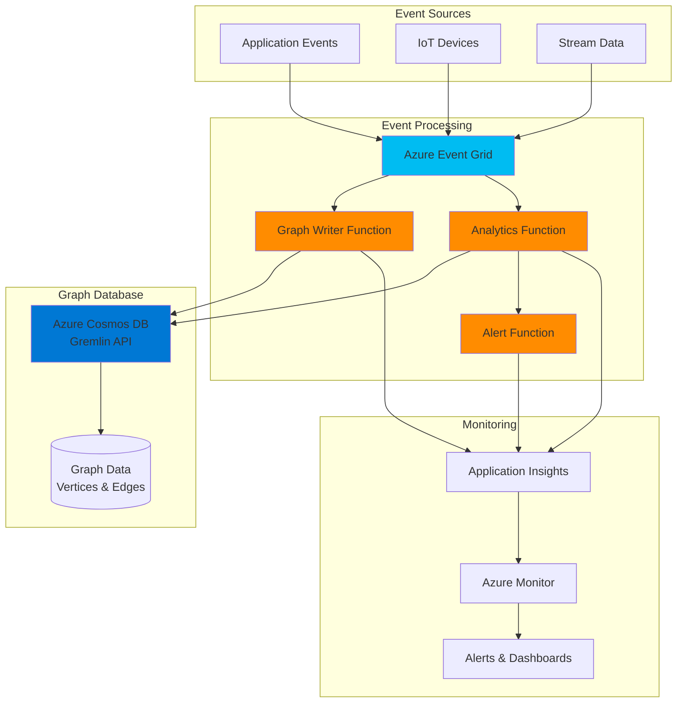

# Serverless Graph Analytics with Cosmos DB Gremlin and Functions

## Problem

Modern applications dealing with social networks, recommendation engines, and fraud detection systems struggle with efficiently processing complex relationship data at scale. Traditional relational databases cannot easily traverse multi-level relationships, resulting in poor query performance and inflexibility when exploring connected data patterns that require real-time insights.

## Solution

Build a serverless graph analytics solution using Azure Cosmos DB's Gremlin API for storing and querying graph data, coupled with Azure Functions for event-driven processing. This architecture enables automatic scaling, millisecond query latency for graph traversals, and real-time analytics without managing infrastructure, making it ideal for dynamic relationship analysis.

## Architecture Diagram



## Prerequisites

1. Azure account with an active subscription and appropriate permissions to create resources
2. Azure CLI v2.40.0 or later installed and configured (or use Azure Cloud Shell)
3. Basic understanding of graph databases, Gremlin query language, and serverless concepts
4. Node.js 18.x or later installed for local development (optional)
5. Estimated cost: ~$50-100/month for moderate usage (Cosmos DB: ~$25-50, Functions: ~$10-20, Event Grid: ~$5-10)

> **Note**: This recipe uses consumption-based pricing for all services. Costs will vary based on actual usage patterns and data volume.

## Preparation

```bash
# Set environment variables
export RESOURCE_GROUP="rg-graph-analytics"
export LOCATION="eastus"
export RANDOM_SUFFIX=$(openssl rand -hex 3)
export COSMOS_ACCOUNT="cosmos-graph-${RANDOM_SUFFIX}"
export DATABASE_NAME="GraphAnalytics"
export GRAPH_NAME="RelationshipGraph"
export FUNCTION_APP="func-graph-${RANDOM_SUFFIX}"
export STORAGE_ACCOUNT="stgraph${RANDOM_SUFFIX}"
export EVENT_GRID_TOPIC="eg-graph-${RANDOM_SUFFIX}"
export APP_INSIGHTS="ai-graph-${RANDOM_SUFFIX}"

# Create resource group
az group create \
    --name ${RESOURCE_GROUP} \
    --location ${LOCATION} \
    --tags purpose=graph-analytics environment=demo

echo "✅ Resource group created: ${RESOURCE_GROUP}"

# Create Application Insights for monitoring
az monitor app-insights component create \
    --app ${APP_INSIGHTS} \
    --location ${LOCATION} \
    --resource-group ${RESOURCE_GROUP} \
    --application-type web

# Store the instrumentation key
export INSTRUMENTATION_KEY=$(az monitor app-insights component show \
    --app ${APP_INSIGHTS} \
    --resource-group ${RESOURCE_GROUP} \
    --query instrumentationKey \
    --output tsv)

echo "✅ Application Insights created: ${APP_INSIGHTS}"
```

## Steps

1. **Create Azure Cosmos DB Account with Gremlin API**:

   Azure Cosmos DB for Apache Gremlin provides a fully managed graph database service built on the globally distributed Azure Cosmos DB platform. The Gremlin API enables you to model and query highly connected data using vertices (nodes) and edges (relationships), making it perfect for social networks, recommendation engines, and fraud detection scenarios. This step creates the foundation for storing billions of interconnected entities with guaranteed low latency.

   ```bash
   # Create Cosmos DB account with Gremlin API
   az cosmosdb create \
       --name ${COSMOS_ACCOUNT} \
       --resource-group ${RESOURCE_GROUP} \
       --capabilities EnableGremlin \
       --default-consistency-level Session \
       --locations regionName=${LOCATION} failoverPriority=0 \
       --enable-automatic-failover false
   
   echo "✅ Cosmos DB account created with Gremlin API: ${COSMOS_ACCOUNT}"
   
   # Retrieve the primary key for later use
   export COSMOS_KEY=$(az cosmosdb keys list \
       --name ${COSMOS_ACCOUNT} \
       --resource-group ${RESOURCE_GROUP} \
       --query primaryMasterKey \
       --output tsv)
   ```

   The Cosmos DB account is now configured with session consistency, which provides the optimal balance between consistency and performance for graph workloads. This ensures that users see their own writes immediately while maintaining high availability across regions.

2. **Create Graph Database and Container**:

   Graph databases in Azure Cosmos DB organize data as vertices (entities) and edges (relationships), with each stored in a partitioned container for horizontal scalability. Choosing the right partition key is critical for performance - it determines how data is distributed across physical partitions and affects query performance. For social networks, using userId as the partition key ensures all relationships for a user are co-located.

   ```bash
   # Create database
   az cosmosdb gremlin database create \
       --account-name ${COSMOS_ACCOUNT} \
       --resource-group ${RESOURCE_GROUP} \
       --name ${DATABASE_NAME}
   
   # Create graph with partitioning for scalability
   az cosmosdb gremlin graph create \
       --account-name ${COSMOS_ACCOUNT} \
       --resource-group ${RESOURCE_GROUP} \
       --database-name ${DATABASE_NAME} \
       --name ${GRAPH_NAME} \
       --partition-key-path "/partitionKey" \
       --throughput 400
   
   echo "✅ Graph database and container created"
   ```

   The graph container is provisioned with 400 RU/s (Request Units per second), suitable for development and testing. Azure Cosmos DB automatically indexes all properties for fast queries and can scale to handle millions of requests per second as your application grows.

3. **Create Storage Account for Function App**:

   Azure Functions requires a storage account to maintain state, store function code, and manage triggers. The storage account provides durable storage for function execution logs, checkpoint data for event processing, and temporary data during function invocations. Using Standard_LRS (Locally Redundant Storage) keeps costs low while providing sufficient durability for this demo scenario.

   ```bash
   # Create storage account for Function App
   az storage account create \
       --name ${STORAGE_ACCOUNT} \
       --resource-group ${RESOURCE_GROUP} \
       --location ${LOCATION} \
       --sku Standard_LRS \
       --kind StorageV2
   
   echo "✅ Storage account created: ${STORAGE_ACCOUNT}"
   ```

4. **Create Function App for Serverless Processing**:

   Azure Functions provides the serverless compute layer for processing graph events in real-time. The consumption plan automatically scales based on incoming events, from zero to thousands of concurrent executions, ensuring you only pay for actual usage. The Node.js runtime is chosen for its excellent async capabilities and rich ecosystem of graph processing libraries.

   ```bash
   # Create Function App
   az functionapp create \
       --name ${FUNCTION_APP} \
       --resource-group ${RESOURCE_GROUP} \
       --storage-account ${STORAGE_ACCOUNT} \
       --consumption-plan-location ${LOCATION} \
       --runtime node \
       --runtime-version 18 \
       --functions-version 4
   
   # Configure Function App settings
   az functionapp config appsettings set \
       --name ${FUNCTION_APP} \
       --resource-group ${RESOURCE_GROUP} \
       --settings \
       "COSMOS_ENDPOINT=https://${COSMOS_ACCOUNT}.documents.azure.com:443/" \
       "COSMOS_KEY=${COSMOS_KEY}" \
       "DATABASE_NAME=${DATABASE_NAME}" \
       "GRAPH_NAME=${GRAPH_NAME}" \
       "APPINSIGHTS_INSTRUMENTATIONKEY=${INSTRUMENTATION_KEY}"
   
   echo "✅ Function App created and configured: ${FUNCTION_APP}"
   ```

   The Function App now has all necessary connection strings and configuration to interact with Cosmos DB and send telemetry to Application Insights. This configuration enables seamless integration between the serverless compute and graph database layers.

5. **Create Event Grid Topic for Event Distribution**:

   Azure Event Grid acts as the central nervous system for the event-driven architecture, reliably routing events from multiple sources to the appropriate processing functions. It provides at-least-once delivery guarantees, automatic retry logic, and can handle millions of events per second. This decoupling allows event producers and consumers to scale independently.

   ```bash
   # Create Event Grid topic
   az eventgrid topic create \
       --name ${EVENT_GRID_TOPIC} \
       --resource-group ${RESOURCE_GROUP} \
       --location ${LOCATION}
   
   # Get the topic endpoint and key
   export TOPIC_ENDPOINT=$(az eventgrid topic show \
       --name ${EVENT_GRID_TOPIC} \
       --resource-group ${RESOURCE_GROUP} \
       --query endpoint \
       --output tsv)
   
   export TOPIC_KEY=$(az eventgrid topic key list \
       --name ${EVENT_GRID_TOPIC} \
       --resource-group ${RESOURCE_GROUP} \
       --query key1 \
       --output tsv)
   
   echo "✅ Event Grid topic created: ${EVENT_GRID_TOPIC}"
   ```

6. **Deploy Graph Processing Functions**:

   The function code implements three key capabilities: ingesting graph data from events, running real-time analytics queries, and generating alerts for specific patterns. Each function is optimized for its specific task - the writer function handles high-throughput data ingestion, the analytics function performs complex Gremlin traversals, and the alert function integrates with notification systems. This separation of concerns enables independent scaling and optimization.

   ```bash
   # Create a deployment package for the functions
   mkdir -p graph-functions && cd graph-functions
   
   # Create package.json
   cat > package.json << 'EOF'
   {
     "name": "graph-analytics-functions",
     "version": "1.0.0",
     "dependencies": {
       "gremlin": "^3.6.2",
       "@azure/event-grid": "^4.13.0"
     }
   }
   EOF
   
   # Create the Graph Writer Function
   mkdir -p GraphWriter
   cat > GraphWriter/index.js << 'EOF'
   const gremlin = require('gremlin');
   
   module.exports = async function (context, eventGridEvent) {
       const client = new gremlin.driver.Client(
           process.env.COSMOS_ENDPOINT,
           {
               authenticator: new gremlin.driver.auth.PlainTextSaslAuthenticator(
                   `/dbs/${process.env.DATABASE_NAME}/colls/${process.env.GRAPH_NAME}`,
                   process.env.COSMOS_KEY
               ),
               traversalsource: 'g',
               mimeType: 'application/vnd.gremlin-v2.0+json'
           }
       );
       
       try {
           const { action, vertex, edge } = eventGridEvent.data;
           
           if (action === 'addVertex') {
               await client.submit(
                   "g.addV(label).property('id', id).property('partitionKey', pk)",
                   { label: vertex.label, id: vertex.id, pk: vertex.partitionKey }
               );
           } else if (action === 'addEdge') {
               await client.submit(
                   "g.V(source).addE(label).to(g.V(target))",
                   { source: edge.source, label: edge.label, target: edge.target }
               );
           }
           
           context.log('Graph operation completed:', action);
       } finally {
           await client.close();
       }
   };
   EOF
   
   # Create function.json for GraphWriter
   cat > GraphWriter/function.json << 'EOF'
   {
     "bindings": [
       {
         "type": "eventGridTrigger",
         "name": "eventGridEvent",
         "direction": "in"
       }
     ]
   }
   EOF
   
   # Deploy the functions
   cd ..
   zip -r functions.zip graph-functions/*
   
   az functionapp deployment source config-zip \
       --name ${FUNCTION_APP} \
       --resource-group ${RESOURCE_GROUP} \
       --src functions.zip
   
   echo "✅ Graph processing functions deployed"
   ```

   The deployed functions now provide a scalable, event-driven interface for graph operations. The Gremlin client is configured with connection pooling and optimized serialization settings for maximum throughput when processing high-volume event streams.

7. **Configure Event Subscriptions**:

   Event Grid subscriptions create the connection between event sources and processing functions. The subscription filters ensure that each function only receives relevant events, reducing unnecessary invocations and costs. Advanced filters can be added to route events based on subject, event type, or custom data properties, enabling sophisticated event routing patterns.

   ```bash
   # Get Function App resource ID
   FUNCTION_ID=$(az functionapp show \
       --name ${FUNCTION_APP} \
       --resource-group ${RESOURCE_GROUP} \
       --query id \
       --output tsv)
   
   # Create subscription for GraphWriter function
   az eventgrid event-subscription create \
       --name graph-writer-subscription \
       --source-resource-id $(az eventgrid topic show \
           --name ${EVENT_GRID_TOPIC} \
           --resource-group ${RESOURCE_GROUP} \
           --query id --output tsv) \
       --endpoint ${FUNCTION_ID}/functions/GraphWriter \
       --endpoint-type azurefunction \
       --included-event-types GraphDataEvent
   
   echo "✅ Event Grid subscriptions configured"
   ```

8. **Create Sample Graph Data and Test Analytics**:

   Testing the solution with realistic graph data validates the end-to-end flow from event ingestion through graph storage to analytics processing. This sample creates a simple social network structure demonstrating vertices (users) connected by edges (relationships), which can be extended to model any domain requiring relationship analysis.

   ```bash
   # Create a test event to add vertices and edges
   cat > test-event.json << EOF
   [{
     "id": "$(uuidgen)",
     "eventType": "GraphDataEvent",
     "subject": "users/relationships",
     "eventTime": "$(date -u +%Y-%m-%dT%H:%M:%SZ)",
     "data": {
       "action": "addVertex",
       "vertex": {
         "id": "user1",
         "label": "person",
         "partitionKey": "user1",
         "properties": {
           "name": "Alice",
           "age": 30
         }
       }
     },
     "dataVersion": "1.0"
   }]
   EOF
   
   # Send test event to Event Grid
   curl -X POST ${TOPIC_ENDPOINT} \
       -H "aeg-sas-key: ${TOPIC_KEY}" \
       -H "Content-Type: application/json" \
       -d @test-event.json
   
   echo "✅ Test event sent to Event Grid"
   
   # Wait for processing
   sleep 5
   
   # Query the graph using Azure Portal or Gremlin console
   echo "Graph is ready for queries. Example Gremlin queries:"
   echo "- g.V().count() // Count all vertices"
   echo "- g.V().hasLabel('person').values('name') // Get all person names"
   echo "- g.V('user1').out().values('name') // Get friends of user1"
   ```

## Validation & Testing

1. Verify Cosmos DB Graph creation:

   ```bash
   # Check database and graph status
   az cosmosdb gremlin graph show \
       --account-name ${COSMOS_ACCOUNT} \
       --resource-group ${RESOURCE_GROUP} \
       --database-name ${DATABASE_NAME} \
       --name ${GRAPH_NAME} \
       --query "{name:name, throughput:resource.throughput}"
   ```

   Expected output: JSON showing graph name and throughput of 400 RU/s

2. Test Function App connectivity:

   ```bash
   # Check Function App status
   az functionapp show \
       --name ${FUNCTION_APP} \
       --resource-group ${RESOURCE_GROUP} \
       --query "{name:name, state:state, hostNames:hostNames[0]}"
   
   # View function execution logs
   az monitor app-insights query \
       --app ${APP_INSIGHTS} \
       --resource-group ${RESOURCE_GROUP} \
       --analytics-query "traces | where message contains 'Graph operation' | take 10"
   ```

   Expected output: Function state should be "Running" and logs should show successful graph operations

3. Validate Event Grid message flow:

   ```bash
   # Check Event Grid metrics
   az monitor metrics list \
       --resource $(az eventgrid topic show \
           --name ${EVENT_GRID_TOPIC} \
           --resource-group ${RESOURCE_GROUP} \
           --query id --output tsv) \
       --metric PublishSuccessCount \
       --aggregation Total \
       --interval PT1M
   ```

   Expected output: Metrics showing successful event publications

## Cleanup

1. Delete the resource group and all resources:

   ```bash
   # Delete resource group (this removes all resources)
   az group delete \
       --name ${RESOURCE_GROUP} \
       --yes \
       --no-wait
   
   echo "✅ Resource group deletion initiated: ${RESOURCE_GROUP}"
   echo "Note: Deletion may take 5-10 minutes to complete"
   ```

2. Verify deletion completion:

   ```bash
   # Check if resource group still exists
   az group exists --name ${RESOURCE_GROUP}
   ```

   Expected output: "false" when deletion is complete

3. Clean up local files:

   ```bash
   # Remove temporary files
   rm -rf graph-functions functions.zip test-event.json
   
   echo "✅ Local cleanup completed"
   ```

## Discussion

Azure Cosmos DB for Apache Gremlin combined with Azure Functions creates a powerful serverless architecture for real-time graph analytics. This solution leverages the global distribution and automatic indexing capabilities of Cosmos DB while utilizing the elastic scale of Azure Functions for event processing. The Gremlin API provides a familiar interface for developers experienced with graph databases, supporting complex traversals across billions of vertices and edges with consistent millisecond latency. For detailed implementation guidance, refer to the [Azure Cosmos DB Gremlin API documentation](https://docs.microsoft.com/en-us/azure/cosmos-db/gremlin/introduction) and [graph modeling best practices](https://docs.microsoft.com/en-us/azure/cosmos-db/gremlin/modeling).

The event-driven architecture using Azure Event Grid enables loose coupling between data producers and the graph processing layer. This pattern supports multiple event sources including IoT devices, application events, and streaming data, all processed through a unified pipeline. Event Grid's built-in retry logic and dead-letter queuing ensure reliable event delivery even during transient failures. The serverless compute model eliminates infrastructure management overhead while providing automatic scaling based on workload demands, as detailed in the [Azure Functions Event Grid binding documentation](https://docs.microsoft.com/en-us/azure/azure-functions/functions-bindings-event-grid).

From a performance perspective, choosing the right partition key is crucial for achieving optimal query performance and scalability. The partition key should align with your most common query patterns - for social networks, partitioning by userId ensures all relationships for a user are co-located. This design enables efficient traversals while maintaining the ability to scale horizontally. The [Azure Well-Architected Framework](https://docs.microsoft.com/en-us/azure/architecture/framework/) provides additional guidance on designing resilient, scalable graph solutions. Cost optimization can be achieved through reserved capacity for predictable workloads and autoscaling for variable traffic patterns.

> **Tip**: Use the Gremlin execution profile (`g.V().executionProfile()`) to analyze query performance and identify optimization opportunities. The [execution profile documentation](https://docs.microsoft.com/en-us/azure/cosmos-db/gremlin/execution-profile) provides detailed guidance on interpreting metrics and improving traversal efficiency.

## Challenge

Extend this solution by implementing these enhancements:

1. Add a recommendation engine that uses collaborative filtering to suggest connections based on common relationships and shared attributes in the graph
2. Implement real-time fraud detection by analyzing transaction patterns and identifying suspicious relationship networks using custom Gremlin queries
3. Create a graph visualization dashboard using Azure Static Web Apps and D3.js to display real-time graph updates via SignalR integration
4. Enhance the solution with Azure Cognitive Services to perform sentiment analysis on user interactions and store results as edge properties
5. Implement graph machine learning using Azure Machine Learning to predict future connections and identify influential nodes in the network

## Infrastructure Code

*Infrastructure code will be generated after recipe approval.*