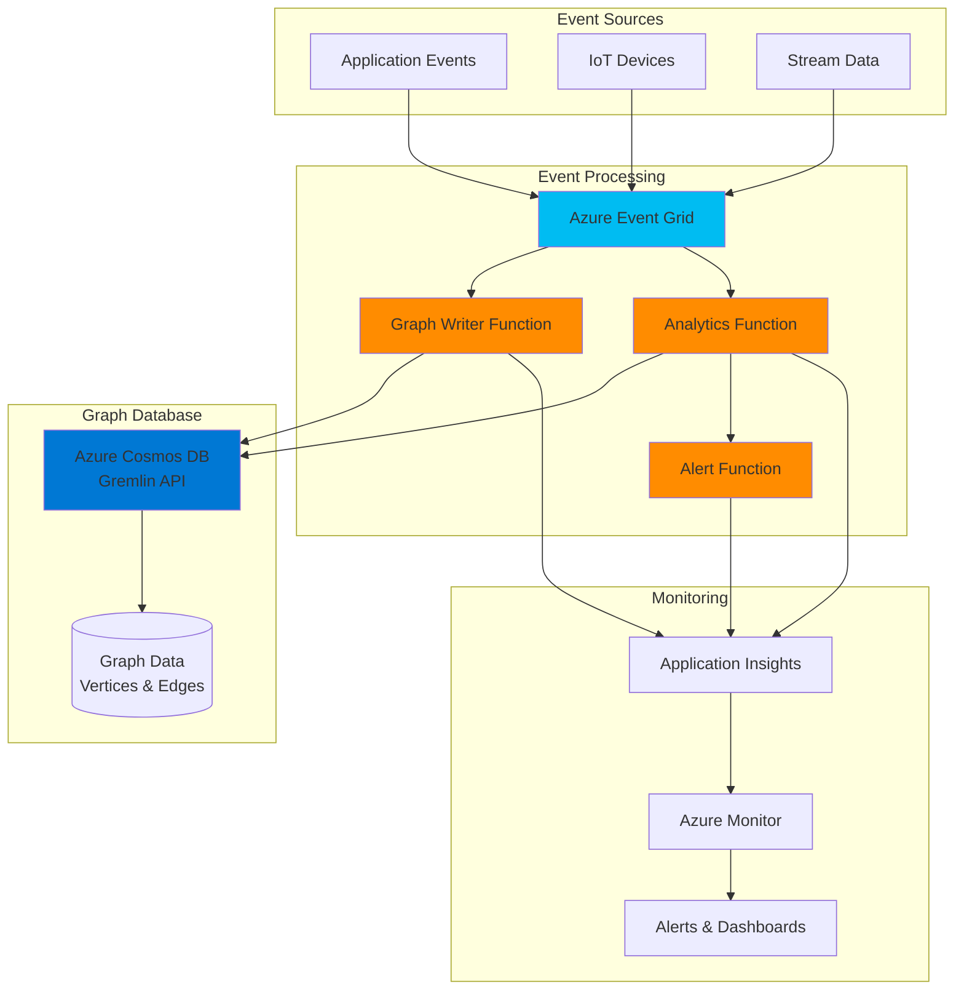

# Serverless Graph Analytics with Cosmos DB Gremlin and Functions

## Problem

Modern applications dealing with social networks, recommendation engines, and fraud detection systems struggle with efficiently processing complex relationship data at scale. Traditional relational databases cannot easily traverse multi-level relationships, resulting in poor query performance and inflexibility when exploring connected data patterns that require real-time insights.

## Solution

Build a serverless graph analytics solution using Azure Cosmos DB's Gremlin API for storing and querying graph data, coupled with Azure Functions for event-driven processing. This architecture enables automatic scaling, millisecond query latency for graph traversals, and real-time analytics without managing infrastructure, making it ideal for dynamic relationship analysis.

## Architecture Diagram



## Prerequisites

1. Azure account with an active subscription and appropriate permissions to create Cosmos DB, Functions, and Event Grid resources
2. Azure CLI v2.52.0 or later installed and configured (or use Azure Cloud Shell)
3. Basic understanding of graph databases, Gremlin query language, and serverless computing concepts
4. Node.js 18.x or later installed for local development (optional)
5. Estimated cost: ~$50-100/month for moderate usage (Cosmos DB: ~$25-50, Functions: ~$10-20, Event Grid: ~$5-10)

> **Note**: This recipe uses consumption-based pricing for all services. Costs will vary based on actual usage patterns and data volume.

## Preparation

```bash
# Set environment variables for Azure resources
export RESOURCE_GROUP="rg-graph-analytics-${RANDOM_SUFFIX}"
export LOCATION="eastus"
export SUBSCRIPTION_ID=$(az account show --query id --output tsv)

# Generate unique suffix for resource names
export RANDOM_SUFFIX=$(openssl rand -hex 3)
export COSMOS_ACCOUNT="cosmos-graph-${RANDOM_SUFFIX}"
export DATABASE_NAME="GraphAnalytics"
export GRAPH_NAME="RelationshipGraph"
export FUNCTION_APP="func-graph-${RANDOM_SUFFIX}"
export STORAGE_ACCOUNT="stgraph${RANDOM_SUFFIX}"
export EVENT_GRID_TOPIC="eg-graph-${RANDOM_SUFFIX}"
export APP_INSIGHTS="ai-graph-${RANDOM_SUFFIX}"

# Create resource group
az group create \
    --name ${RESOURCE_GROUP} \
    --location ${LOCATION} \
    --tags purpose=graph-analytics environment=demo

echo "✅ Resource group created: ${RESOURCE_GROUP}"

# Create Application Insights for monitoring
az monitor app-insights component create \
    --app ${APP_INSIGHTS} \
    --location ${LOCATION} \
    --resource-group ${RESOURCE_GROUP} \
    --application-type web

# Store the instrumentation key
export INSTRUMENTATION_KEY=$(az monitor app-insights component show \
    --app ${APP_INSIGHTS} \
    --resource-group ${RESOURCE_GROUP} \
    --query instrumentationKey \
    --output tsv)

echo "✅ Application Insights created: ${APP_INSIGHTS}"
```

## Steps

1. **Create Azure Cosmos DB Account with Gremlin API**:

   Azure Cosmos DB for Apache Gremlin provides a fully managed graph database service built on the globally distributed Azure Cosmos DB platform. The Gremlin API enables you to model and query highly connected data using vertices (nodes) and edges (relationships), making it perfect for social networks, recommendation engines, and fraud detection scenarios. This step creates the foundation for storing billions of interconnected entities with guaranteed low latency and automatic global distribution.

   ```bash
   # Create Cosmos DB account with Gremlin API capability
   az cosmosdb create \
       --name ${COSMOS_ACCOUNT} \
       --resource-group ${RESOURCE_GROUP} \
       --capabilities EnableGremlin \
       --default-consistency-level Session \
       --locations regionName=${LOCATION} failoverPriority=0 \
       --enable-automatic-failover false \
       --enable-free-tier false
   
   echo "✅ Cosmos DB account created with Gremlin API: ${COSMOS_ACCOUNT}"
   
   # Retrieve the primary key for function configuration
   export COSMOS_KEY=$(az cosmosdb keys list \
       --name ${COSMOS_ACCOUNT} \
       --resource-group ${RESOURCE_GROUP} \
       --query primaryMasterKey \
       --output tsv)
   ```

   The Cosmos DB account is now configured with session consistency, which provides the optimal balance between consistency and performance for graph workloads. This ensures that users see their own writes immediately while maintaining high availability and global distribution capabilities.

2. **Create Graph Database and Container**:

   Graph databases in Azure Cosmos DB organize data as vertices (entities) and edges (relationships), with each stored in a partitioned container for horizontal scalability. Choosing the right partition key is critical for performance - it determines how data is distributed across physical partitions and affects query performance. For social networks, using userId as the partition key ensures all relationships for a user are co-located, enabling efficient traversals.

   ```bash
   # Create database for graph data
   az cosmosdb gremlin database create \
       --account-name ${COSMOS_ACCOUNT} \
       --resource-group ${RESOURCE_GROUP} \
       --name ${DATABASE_NAME}
   
   # Create graph container with partitioning for scalability
   az cosmosdb gremlin graph create \
       --account-name ${COSMOS_ACCOUNT} \
       --resource-group ${RESOURCE_GROUP} \
       --database-name ${DATABASE_NAME} \
       --name ${GRAPH_NAME} \
       --partition-key-path "/partitionKey" \
       --throughput 400
   
   echo "✅ Graph database and container created"
   ```

   The graph container is provisioned with 400 RU/s (Request Units per second), suitable for development and testing. Azure Cosmos DB automatically indexes all properties for fast queries and can scale to handle millions of requests per second as your application grows through autoscale or manual provisioning adjustments.

3. **Create Storage Account for Function App**:

   Azure Functions requires a storage account to maintain state, store function code, and manage triggers. The storage account provides durable storage for function execution logs, checkpoint data for event processing, and temporary data during function invocations. Using Standard_LRS (Locally Redundant Storage) keeps costs low while providing sufficient durability for this demo scenario.

   ```bash
   # Create storage account for Function App dependencies
   az storage account create \
       --name ${STORAGE_ACCOUNT} \
       --resource-group ${RESOURCE_GROUP} \
       --location ${LOCATION} \
       --sku Standard_LRS \
       --kind StorageV2 \
       --access-tier Hot
   
   echo "✅ Storage account created: ${STORAGE_ACCOUNT}"
   ```

4. **Create Function App for Serverless Processing**:

   Azure Functions provides the serverless compute layer for processing graph events in real-time. The consumption plan automatically scales based on incoming events, from zero to thousands of concurrent executions, ensuring you only pay for actual usage. The Node.js 18 runtime is chosen for its excellent async capabilities, rich ecosystem of graph processing libraries, and optimal performance with the Gremlin JavaScript driver.

   ```bash
   # Create Function App with consumption plan
   az functionapp create \
       --name ${FUNCTION_APP} \
       --resource-group ${RESOURCE_GROUP} \
       --storage-account ${STORAGE_ACCOUNT} \
       --consumption-plan-location ${LOCATION} \
       --runtime node \
       --runtime-version 18 \
       --functions-version 4 \
       --os-type Linux
   
   # Configure Function App settings for Cosmos DB integration
   az functionapp config appsettings set \
       --name ${FUNCTION_APP} \
       --resource-group ${RESOURCE_GROUP} \
       --settings \
       "COSMOS_ENDPOINT=https://${COSMOS_ACCOUNT}.gremlin.cosmos.azure.com" \
       "COSMOS_KEY=${COSMOS_KEY}" \
       "DATABASE_NAME=${DATABASE_NAME}" \
       "GRAPH_NAME=${GRAPH_NAME}" \
       "APPINSIGHTS_INSTRUMENTATIONKEY=${INSTRUMENTATION_KEY}" \
       "WEBSITE_NODE_DEFAULT_VERSION=~18"
   
   echo "✅ Function App created and configured: ${FUNCTION_APP}"
   ```

   The Function App now has all necessary connection strings and configuration to interact with Cosmos DB using the Gremlin endpoint and send telemetry to Application Insights. This configuration enables seamless integration between the serverless compute and graph database layers with proper monitoring capabilities.

5. **Create Event Grid Topic for Event Distribution**:

   Azure Event Grid acts as the central nervous system for the event-driven architecture, reliably routing events from multiple sources to the appropriate processing functions. It provides at-least-once delivery guarantees, automatic retry logic with exponential backoff, and can handle millions of events per second. This decoupling allows event producers and consumers to scale independently while maintaining reliability.

   ```bash
   # Create Event Grid topic for event routing
   az eventgrid topic create \
       --name ${EVENT_GRID_TOPIC} \
       --resource-group ${RESOURCE_GROUP} \
       --location ${LOCATION} \
       --tags environment=demo purpose=graph-events
   
   # Get the topic endpoint and access key
   export TOPIC_ENDPOINT=$(az eventgrid topic show \
       --name ${EVENT_GRID_TOPIC} \
       --resource-group ${RESOURCE_GROUP} \
       --query endpoint \
       --output tsv)
   
   export TOPIC_KEY=$(az eventgrid topic key list \
       --name ${EVENT_GRID_TOPIC} \
       --resource-group ${RESOURCE_GROUP} \
       --query key1 \
       --output tsv)
   
   echo "✅ Event Grid topic created: ${EVENT_GRID_TOPIC}"
   ```

6. **Deploy Graph Processing Functions**:

   The function code implements key capabilities: ingesting graph data from events, running real-time analytics queries, and generating alerts for specific patterns. Each function is optimized for its specific task - the writer function handles high-throughput data ingestion using the latest Gremlin JavaScript driver, while analytics functions perform complex graph traversals. This separation of concerns enables independent scaling and optimization.

   ```bash
   # Create deployment package for the functions
   mkdir -p graph-functions && cd graph-functions
   
   # Create package.json with updated dependencies
   cat > package.json << 'EOF'
   {
     "name": "graph-analytics-functions",
     "version": "1.0.0",
     "description": "Azure Functions for graph analytics",
     "main": "index.js",
     "engines": {
       "node": ">=18.0.0"
     },
     "dependencies": {
       "gremlin": "^3.7.0",
       "@azure/functions": "^4.0.0"
     }
   }
   EOF
   
   # Create host.json for Functions v4 configuration
   cat > host.json << 'EOF'
   {
     "version": "2.0",
     "logging": {
       "applicationInsights": {
         "samplingSettings": {
           "isEnabled": true
         }
       }
     },
     "extensionBundle": {
       "id": "Microsoft.Azure.Functions.ExtensionBundle",
       "version": "[4.*, 5.0.0)"
     }
   }
   EOF
   
   # Create the Graph Writer Function with v4 model
   mkdir -p src/functions
   cat > src/functions/graphWriter.js << 'EOF'
   const gremlin = require('gremlin');
   const { app } = require('@azure/functions');
   
   app.eventGrid('graphWriter', {
       handler: async (event, context) => {
           context.log('Graph Writer function triggered', event);
           
           // Create Gremlin client with proper configuration
           const client = new gremlin.driver.Client(
               `${process.env.COSMOS_ENDPOINT}:443/gremlin`,
               {
                   authenticator: new gremlin.driver.auth.PlainTextSaslAuthenticator(
                       `/dbs/${process.env.DATABASE_NAME}/colls/${process.env.GRAPH_NAME}`,
                       process.env.COSMOS_KEY
                   ),
                   traversalSource: 'g',
                   rejectUnauthorized: true,
                   mimeType: 'application/vnd.gremlin-v2.0+json'
               }
           );
           
           try {
               const { action, vertex, edge } = event.data;
               
               if (action === 'addVertex') {
                   // Add vertex with properties
                   const query = "g.addV(label).property('id', id).property('partitionKey', pk)";
                   const bindings = { 
                       label: vertex.label, 
                       id: vertex.id, 
                       pk: vertex.partitionKey 
                   };
                   
                   // Add additional properties if provided
                   if (vertex.properties) {
                       Object.keys(vertex.properties).forEach(key => {
                           bindings[key] = vertex.properties[key];
                       });
                   }
                   
                   await client.submit(query, bindings);
                   context.log(`Vertex added: ${vertex.id}`);
                   
               } else if (action === 'addEdge') {
                   // Add edge between vertices
                   const query = "g.V(source).addE(label).to(g.V(target)).property('weight', weight)";
                   const bindings = { 
                       source: edge.source, 
                       label: edge.label, 
                       target: edge.target,
                       weight: edge.weight || 1.0
                   };
                   
                   await client.submit(query, bindings);
                   context.log(`Edge added: ${edge.source} -> ${edge.target}`);
               }
               
           } catch (error) {
               context.log.error('Graph operation failed:', error);
               throw error; // Trigger retry mechanism
           } finally {
               await client.close();
           }
       }
   });
   EOF
   
   # Create analytics function for graph queries
   cat > src/functions/graphAnalytics.js << 'EOF'
   const gremlin = require('gremlin');
   const { app } = require('@azure/functions');
   
   app.eventGrid('graphAnalytics', {
       handler: async (event, context) => {
           context.log('Graph Analytics function triggered', event);
           
           const client = new gremlin.driver.Client(
               `${process.env.COSMOS_ENDPOINT}:443/gremlin`,
               {
                   authenticator: new gremlin.driver.auth.PlainTextSaslAuthenticator(
                       `/dbs/${process.env.DATABASE_NAME}/colls/${process.env.GRAPH_NAME}`,
                       process.env.COSMOS_KEY
                   ),
                   traversalSource: 'g',
                   rejectUnauthorized: true,
                   mimeType: 'application/vnd.gremlin-v2.0+json'
               }
           );
           
           try {
               const { queryType, parameters } = event.data;
               
               let results;
               switch (queryType) {
                   case 'vertexCount':
                       results = await client.submit("g.V().count()");
                       break;
                   case 'findConnections':
                       results = await client.submit(
                           "g.V(userId).out().values('name')",
                           { userId: parameters.userId }
                       );
                       break;
                   case 'shortestPath':
                       results = await client.submit(
                           "g.V(source).shortestPath().to(g.V(target))",
                           { source: parameters.source, target: parameters.target }
                       );
                       break;
                   default:
                       throw new Error(`Unknown query type: ${queryType}`);
               }
               
               context.log('Analytics results:', results._items);
               
               // Process results and trigger alerts if needed
               if (results._items.length > 0) {
                   // Could publish results to another Event Grid topic
                   context.log('Analytics completed successfully');
               }
               
           } catch (error) {
               context.log.error('Analytics query failed:', error);
               throw error;
           } finally {
               await client.close();
           }
       }
   });
   EOF
   
   # Create package archive for deployment
   cd ..
   zip -r functions.zip graph-functions/
   
   # Deploy functions to Azure
   az functionapp deployment source config-zip \
       --name ${FUNCTION_APP} \
       --resource-group ${RESOURCE_GROUP} \
       --src functions.zip
   
   echo "✅ Graph processing functions deployed"
   ```

   The deployed functions now provide a scalable, event-driven interface for graph operations using the Azure Functions v4 programming model. The Gremlin client is configured with proper authentication, SSL, and optimized serialization settings for maximum throughput when processing high-volume event streams.

7. **Configure Event Grid Subscriptions**:

   Event Grid subscriptions create the connection between event sources and processing functions. The subscription filters ensure that each function only receives relevant events, reducing unnecessary invocations and costs. Advanced filters can be added to route events based on subject, event type, or custom data properties, enabling sophisticated event routing patterns.

   ```bash
   # Get Function App resource ID for subscription endpoints
   FUNCTION_ID=$(az functionapp show \
       --name ${FUNCTION_APP} \
       --resource-group ${RESOURCE_GROUP} \
       --query id \
       --output tsv)
   
   # Create subscription for GraphWriter function
   az eventgrid event-subscription create \
       --name graph-writer-subscription \
       --source-resource-id $(az eventgrid topic show \
           --name ${EVENT_GRID_TOPIC} \
           --resource-group ${RESOURCE_GROUP} \
           --query id --output tsv) \
       --endpoint ${FUNCTION_ID}/functions/graphWriter \
       --endpoint-type azurefunction \
       --included-event-types GraphDataEvent \
       --subject-begins-with "graph/data"
   
   # Create subscription for Analytics function
   az eventgrid event-subscription create \
       --name graph-analytics-subscription \
       --source-resource-id $(az eventgrid topic show \
           --name ${EVENT_GRID_TOPIC} \
           --resource-group ${RESOURCE_GROUP} \
           --query id --output tsv) \
       --endpoint ${FUNCTION_ID}/functions/graphAnalytics \
       --endpoint-type azurefunction \
       --included-event-types GraphAnalyticsEvent \
       --subject-begins-with "graph/analytics"
   
   echo "✅ Event Grid subscriptions configured"
   ```

8. **Create Sample Graph Data and Test Analytics**:

   Testing the solution with realistic graph data validates the end-to-end flow from event ingestion through graph storage to analytics processing. This sample creates a simple social network structure demonstrating vertices (users) connected by edges (relationships), which can be extended to model any domain requiring relationship analysis.

   ```bash
   # Create test events for adding vertices and edges
   cat > test-vertex-event.json << EOF
   [{
     "id": "$(uuidgen)",
     "eventType": "GraphDataEvent",
     "subject": "graph/data/vertex",
     "eventTime": "$(date -u +%Y-%m-%dT%H:%M:%SZ)",
     "data": {
       "action": "addVertex",
       "vertex": {
         "id": "user1",
         "label": "person",
         "partitionKey": "user1",
         "properties": {
           "name": "Alice",
           "age": 30,
           "city": "Seattle"
         }
       }
     },
     "dataVersion": "1.0"
   }]
   EOF
   
   cat > test-edge-event.json << EOF
   [{
     "id": "$(uuidgen)",
     "eventType": "GraphDataEvent",
     "subject": "graph/data/edge",
     "eventTime": "$(date -u +%Y-%m-%dT%H:%M:%SZ)",
     "data": {
       "action": "addEdge",
       "edge": {
         "source": "user1",
         "label": "knows",
         "target": "user2",
         "weight": 0.8
       }
     },
     "dataVersion": "1.0"
   }]
   EOF
   
   # Send test events to Event Grid
   curl -X POST ${TOPIC_ENDPOINT} \
       -H "aeg-sas-key: ${TOPIC_KEY}" \
       -H "Content-Type: application/json" \
       -d @test-vertex-event.json
   
   echo "✅ Test vertex event sent to Event Grid"
   
   # Wait for processing before sending edge event
   sleep 10
   
   curl -X POST ${TOPIC_ENDPOINT} \
       -H "aeg-sas-key: ${TOPIC_KEY}" \
       -H "Content-Type: application/json" \
       -d @test-edge-event.json
   
   echo "✅ Test edge event sent to Event Grid"
   
   # Send analytics event
   cat > test-analytics-event.json << EOF
   [{
     "id": "$(uuidgen)",
     "eventType": "GraphAnalyticsEvent",
     "subject": "graph/analytics/count",
     "eventTime": "$(date -u +%Y-%m-%dT%H:%M:%SZ)",
     "data": {
       "queryType": "vertexCount",
       "parameters": {}
     },
     "dataVersion": "1.0"
   }]
   EOF
   
   curl -X POST ${TOPIC_ENDPOINT} \
       -H "aeg-sas-key: ${TOPIC_KEY}" \
       -H "Content-Type: application/json" \
       -d @test-analytics-event.json
   
   echo "✅ Test analytics event sent"
   echo "Graph is ready for queries. Use Azure Portal Data Explorer or Gremlin console for interactive queries."
   ```

## Validation & Testing

1. Verify Cosmos DB Graph creation and throughput:

   ```bash
   # Check database and graph configuration
   az cosmosdb gremlin graph show \
       --account-name ${COSMOS_ACCOUNT} \
       --resource-group ${RESOURCE_GROUP} \
       --database-name ${DATABASE_NAME} \
       --name ${GRAPH_NAME} \
       --query "{name:name, throughput:resource.throughput, partitionKey:resource.partitionKey}"
   ```

   Expected output: JSON showing graph name, throughput of 400 RU/s, and partition key configuration

2. Test Function App connectivity and execution:

   ```bash
   # Check Function App status and configuration
   az functionapp show \
       --name ${FUNCTION_APP} \
       --resource-group ${RESOURCE_GROUP} \
       --query "{name:name, state:state, runtime:linuxFxVersion}"
   
   # View function execution logs from Application Insights
   az monitor app-insights query \
       --app ${APP_INSIGHTS} \
       --resource-group ${RESOURCE_GROUP} \
       --analytics-query "traces | where message contains 'Graph' | order by timestamp desc | take 10"
   ```

   Expected output: Function state should be "Running" and logs should show successful graph operations

3. Validate Event Grid message delivery and processing:

   ```bash
   # Check Event Grid topic metrics for successful deliveries
   az monitor metrics list \
       --resource $(az eventgrid topic show \
           --name ${EVENT_GRID_TOPIC} \
           --resource-group ${RESOURCE_GROUP} \
           --query id --output tsv) \
       --metric PublishSuccessCount \
       --aggregation Total \
       --interval PT5M
   
   # Check subscription delivery status
   az eventgrid event-subscription show \
       --name graph-writer-subscription \
       --source-resource-id $(az eventgrid topic show \
           --name ${EVENT_GRID_TOPIC} \
           --resource-group ${RESOURCE_GROUP} \
           --query id --output tsv) \
       --query "{name:name, deliveryStatus:provisioningState}"
   ```

   Expected output: Metrics showing successful event publications and active subscription status

## Cleanup

1. Delete the resource group and all contained resources:

   ```bash
   # Delete resource group (this removes all resources)
   az group delete \
       --name ${RESOURCE_GROUP} \
       --yes \
       --no-wait
   
   echo "✅ Resource group deletion initiated: ${RESOURCE_GROUP}"
   echo "Note: Deletion may take 5-10 minutes to complete"
   ```

2. Verify deletion completion:

   ```bash
   # Check if resource group still exists
   az group exists --name ${RESOURCE_GROUP}
   ```

   Expected output: "false" when deletion is complete

3. Clean up local files and environment variables:

   ```bash
   # Remove temporary files
   rm -rf graph-functions functions.zip
   rm -f test-vertex-event.json test-edge-event.json test-analytics-event.json
   
   # Clear environment variables
   unset RESOURCE_GROUP COSMOS_ACCOUNT FUNCTION_APP STORAGE_ACCOUNT
   unset EVENT_GRID_TOPIC APP_INSIGHTS TOPIC_ENDPOINT TOPIC_KEY
   
   echo "✅ Local cleanup completed"
   ```

## Discussion

Azure Cosmos DB for Apache Gremlin combined with Azure Functions creates a powerful serverless architecture for real-time graph analytics. This solution leverages the global distribution and automatic indexing capabilities of Cosmos DB while utilizing the elastic scale of Azure Functions for event processing. The Gremlin API provides a familiar interface for developers experienced with graph databases, supporting complex traversals across billions of vertices and edges with consistent millisecond latency. For detailed implementation guidance, refer to the [Azure Cosmos DB Gremlin API documentation](https://learn.microsoft.com/en-us/azure/cosmos-db/gremlin/overview) and [graph modeling best practices](https://learn.microsoft.com/en-us/azure/cosmos-db/gremlin/modeling).

The event-driven architecture using Azure Event Grid enables loose coupling between data producers and the graph processing layer. This pattern supports multiple event sources including IoT devices, application events, and streaming data, all processed through a unified pipeline. Event Grid's built-in retry logic and dead-letter queuing ensure reliable event delivery even during transient failures. The serverless compute model eliminates infrastructure management overhead while providing automatic scaling based on workload demands, as detailed in the [Azure Functions Event Grid binding documentation](https://learn.microsoft.com/en-us/azure/azure-functions/functions-bindings-event-grid).

From a performance perspective, choosing the right partition key is crucial for achieving optimal query performance and scalability. The partition key should align with your most common query patterns - for social networks, partitioning by userId ensures all relationships for a user are co-located. This design enables efficient traversals while maintaining the ability to scale horizontally. The [Azure Well-Architected Framework](https://learn.microsoft.com/en-us/azure/architecture/framework/) provides additional guidance on designing resilient, scalable graph solutions. Cost optimization can be achieved through reserved capacity for predictable workloads and autoscaling for variable traffic patterns, following [Azure cost management best practices](https://learn.microsoft.com/en-us/azure/cost-management-billing/costs/cost-mgt-best-practices).

> **Tip**: Use the Gremlin execution profile (`g.V().executionProfile()`) to analyze query performance and identify optimization opportunities. The [execution profile documentation](https://learn.microsoft.com/en-us/azure/cosmos-db/gremlin/execution-profile) provides detailed guidance on interpreting metrics and improving traversal efficiency through proper indexing and query optimization.

## Challenge

Extend this solution by implementing these enhancements:

1. Add a recommendation engine that uses collaborative filtering to suggest connections based on common relationships and shared attributes in the graph
2. Implement real-time fraud detection by analyzing transaction patterns and identifying suspicious relationship networks using custom Gremlin queries and machine learning models
3. Create a graph visualization dashboard using Azure Static Web Apps and D3.js to display real-time graph updates via SignalR integration with live data streaming
4. Enhance the solution with Azure Cognitive Services to perform sentiment analysis on user interactions and store results as edge properties for social graph insights
5. Implement graph machine learning using Azure Machine Learning to predict future connections and identify influential nodes in the network using graph neural networks

## Infrastructure Code

*Infrastructure code will be generated after recipe approval.*