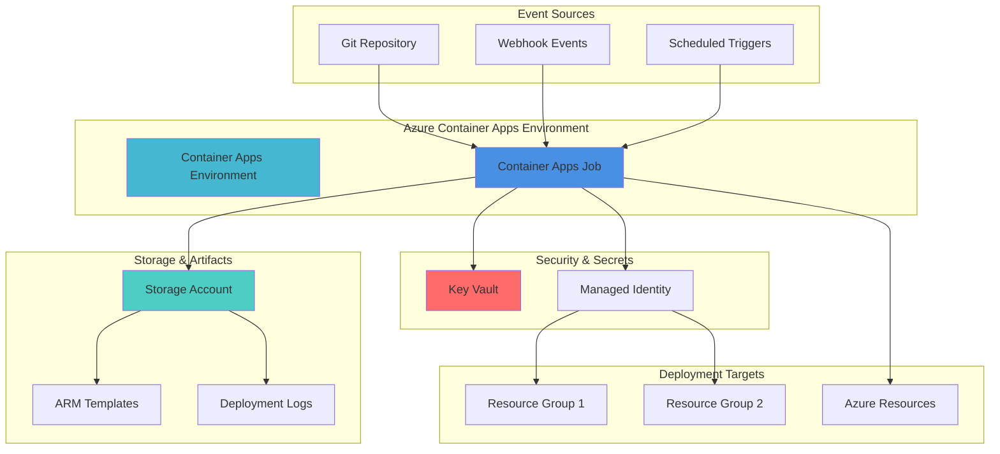

# Serverless Infrastructure Deployment with Container Apps Jobs and ARM Templates

## Problem

Organizations struggle with consistent, scalable infrastructure deployment processes that can be triggered by various events while maintaining security and governance standards. Manual deployment processes are error-prone, time-consuming, and don't scale effectively across multiple environments. Traditional CI/CD pipelines often require dedicated agents and complex infrastructure management, creating operational overhead and potential security vulnerabilities when managing deployment credentials.

## Solution

Azure Container Apps Jobs provides a serverless, event-driven platform for executing ARM template deployments with built-in scaling, security, and monitoring capabilities. This solution combines Container Apps Jobs for compute execution, Azure Resource Manager for infrastructure management, Key Vault for secure credential storage, and Storage Accounts for deployment artifacts, creating a fully automated deployment pipeline that responds to events and maintains audit trails.

## Architecture Diagram



## Prerequisites

1. Azure subscription with Owner or Contributor permissions for resource creation
2. Azure CLI v2.57.0 or later installed and configured (or use Azure Cloud Shell)
3. Basic understanding of ARM templates and Azure Resource Manager
4. Familiarity with containerization and Azure Container Apps concepts
5. Git repository for storing ARM templates and deployment scripts
6. Estimated cost: $15-30 per month for development/testing workloads

> **Note**: This solution uses Azure Container Apps Jobs which provides serverless compute with pay-per-execution pricing. Review the [Azure Container Apps pricing guide](https://azure.microsoft.com/pricing/details/container-apps/) for detailed cost information.

## Preparation

```bash
# Set environment variables for Azure resources
export RESOURCE_GROUP="rg-deployment-automation"
export LOCATION="eastus"
export CONTAINER_APPS_ENV="cae-deployment-env"
export JOB_NAME="deployment-job"
export KEY_VAULT_NAME="kv-deploy-$(openssl rand -hex 4)"
export STORAGE_ACCOUNT="stdeployartifacts$(openssl rand -hex 4)"
export SUBSCRIPTION_ID=$(az account show --query id --output tsv)

# Generate unique suffix for global resources
RANDOM_SUFFIX=$(openssl rand -hex 4)

# Create resource group for deployment automation
az group create \
    --name ${RESOURCE_GROUP} \
    --location ${LOCATION} \
    --tags purpose=deployment-automation environment=demo

echo "✅ Resource group created: ${RESOURCE_GROUP}"

# Create Container Apps environment
az containerapp env create \
    --name ${CONTAINER_APPS_ENV} \
    --resource-group ${RESOURCE_GROUP} \
    --location ${LOCATION}

echo "✅ Container Apps environment created: ${CONTAINER_APPS_ENV}"
```

## Steps

1. **Create Azure Key Vault for Secure Credential Management**:

   Azure Key Vault provides enterprise-grade security for managing deployment credentials, certificates, and secrets. By centralizing credential management, we eliminate the need to store sensitive information in container images or environment variables, ensuring compliance with security best practices and enabling fine-grained access control through Azure RBAC.

   ```bash
   # Create Key Vault for deployment secrets
   az keyvault create \
       --name ${KEY_VAULT_NAME} \
       --resource-group ${RESOURCE_GROUP} \
       --location ${LOCATION} \
       --sku standard \
       --enabled-for-template-deployment true \
       --enable-rbac-authorization true
   
   # Get current user object ID for RBAC assignment
   CURRENT_USER=$(az ad signed-in-user show --query id --output tsv)
   
   # Assign Key Vault Secrets Officer role to current user
   az role assignment create \
       --assignee ${CURRENT_USER} \
       --role "Key Vault Secrets Officer" \
       --scope "/subscriptions/${SUBSCRIPTION_ID}/resourceGroups/${RESOURCE_GROUP}/providers/Microsoft.KeyVault/vaults/${KEY_VAULT_NAME}"
   
   echo "✅ Key Vault created with RBAC enabled: ${KEY_VAULT_NAME}"
   ```

   The Key Vault now provides secure, centralized storage for deployment credentials with Azure RBAC integration. This foundation enables the Container Apps Job to securely access credentials without exposing them in container configurations, meeting enterprise security requirements for automated deployment workflows.

2. **Create Storage Account for Deployment Artifacts**:

   Azure Storage provides durable, scalable storage for ARM templates, deployment scripts, and execution logs. Using Azure Storage with organized container structure enables efficient artifact management while providing integration with Azure Container Apps for seamless file access during deployment execution.

   ```bash
   # Create storage account for ARM templates and logs
   az storage account create \
       --name ${STORAGE_ACCOUNT} \
       --resource-group ${RESOURCE_GROUP} \
       --location ${LOCATION} \
       --sku Standard_LRS \
       --kind StorageV2 \
       --access-tier Hot \
       --allow-blob-public-access false \
       --min-tls-version TLS1_2
   
   # Create containers for organized artifact storage
   az storage container create \
       --name "arm-templates" \
       --account-name ${STORAGE_ACCOUNT} \
       --auth-mode login
   
   az storage container create \
       --name "deployment-logs" \
       --account-name ${STORAGE_ACCOUNT} \
       --auth-mode login
   
   az storage container create \
       --name "deployment-scripts" \
       --account-name ${STORAGE_ACCOUNT} \
       --auth-mode login
   
   echo "✅ Storage account created with organized containers: ${STORAGE_ACCOUNT}"
   ```

   The storage account provides secure, organized storage for deployment artifacts with private access controls and TLS 1.2 encryption. This centralized approach enables version control of ARM templates, maintains deployment history, and provides audit trails for compliance requirements.

3. **Create Managed Identity for Container Apps Job**:

   Managed Identity eliminates the need for stored credentials by providing Azure services with automatically managed identities. This approach follows security best practices by using Azure AD authentication and enables fine-grained RBAC permissions for the deployment job to access only required resources.

   ```bash
   # Create user-assigned managed identity
   az identity create \
       --name "id-deployment-job" \
       --resource-group ${RESOURCE_GROUP} \
       --location ${LOCATION}
   
   # Get managed identity details
   IDENTITY_ID=$(az identity show \
       --name "id-deployment-job" \
       --resource-group ${RESOURCE_GROUP} \
       --query id --output tsv)
   
   IDENTITY_CLIENT_ID=$(az identity show \
       --name "id-deployment-job" \
       --resource-group ${RESOURCE_GROUP} \
       --query clientId --output tsv)
   
   echo "✅ Managed identity created: ${IDENTITY_ID}"
   ```

   The managed identity provides secure, credential-free authentication for the Container Apps Job to access Azure resources. This approach eliminates credential management overhead while providing strong security through Azure AD integration and RBAC controls.

4. **Assign Required RBAC Permissions**:

   Role-based access control (RBAC) provides fine-grained permissions management following the principle of least privilege. By assigning specific roles to the managed identity, we ensure the deployment job can perform necessary operations while maintaining security boundaries and audit capabilities.

   ```bash
   # Assign Contributor role for ARM deployments
   az role assignment create \
       --assignee ${IDENTITY_CLIENT_ID} \
       --role "Contributor" \
       --scope "/subscriptions/${SUBSCRIPTION_ID}"
   
   # Assign Storage Blob Data Contributor for artifact access
   az role assignment create \
       --assignee ${IDENTITY_CLIENT_ID} \
       --role "Storage Blob Data Contributor" \
       --scope "/subscriptions/${SUBSCRIPTION_ID}/resourceGroups/${RESOURCE_GROUP}/providers/Microsoft.Storage/storageAccounts/${STORAGE_ACCOUNT}"
   
   # Assign Key Vault Secrets User for credential access
   az role assignment create \
       --assignee ${IDENTITY_CLIENT_ID} \
       --role "Key Vault Secrets User" \
       --scope "/subscriptions/${SUBSCRIPTION_ID}/resourceGroups/${RESOURCE_GROUP}/providers/Microsoft.KeyVault/vaults/${KEY_VAULT_NAME}"
   
   echo "✅ RBAC permissions assigned to managed identity"
   ```

   The managed identity now has precisely the permissions needed for deployment operations while maintaining security through Azure's built-in RBAC system. This configuration enables automated deployments with proper governance and audit capabilities.

5. **Create Sample ARM Template for Testing**:

   ARM templates provide declarative infrastructure management with built-in dependency resolution and rollback capabilities. Creating a sample template enables testing of the deployment workflow while demonstrating best practices for parameterization and resource organization.

   ```bash
   # Create sample ARM template for testing
   cat > sample-template.json << 'EOF'
   {
       "$schema": "https://schema.management.azure.com/schemas/2019-04-01/deploymentTemplate.json#",
       "contentVersion": "1.0.0.0",
       "parameters": {
           "storageAccountName": {
               "type": "string",
               "metadata": {
                   "description": "Name of the storage account to create"
               }
           },
           "location": {
               "type": "string",
               "defaultValue": "[resourceGroup().location]",
               "metadata": {
                   "description": "Location for all resources"
               }
           }
       },
       "variables": {
           "storageAccountType": "Standard_LRS"
       },
       "resources": [
           {
               "type": "Microsoft.Storage/storageAccounts",
               "apiVersion": "2023-04-01",
               "name": "[parameters('storageAccountName')]",
               "location": "[parameters('location')]",
               "sku": {
                   "name": "[variables('storageAccountType')]"
               },
               "kind": "StorageV2",
               "properties": {
                   "accessTier": "Hot",
                   "allowBlobPublicAccess": false,
                   "minimumTlsVersion": "TLS1_2"
               }
           }
       ],
       "outputs": {
           "storageAccountId": {
               "type": "string",
               "value": "[resourceId('Microsoft.Storage/storageAccounts', parameters('storageAccountName'))]"
           }
       }
   }
   EOF
   
   # Upload ARM template to storage
   az storage blob upload \
       --file sample-template.json \
       --container-name "arm-templates" \
       --name "sample-template.json" \
       --account-name ${STORAGE_ACCOUNT} \
       --auth-mode login
   
   echo "✅ Sample ARM template created and uploaded"
   ```

   The sample ARM template demonstrates infrastructure-as-code principles with proper parameterization, security configurations, and the latest API version. This template serves as a foundation for testing the deployment workflow and can be extended for complex infrastructure requirements.

6. **Create Deployment Script for Container Job**:

   The deployment script orchestrates the ARM template deployment process, including parameter validation, deployment execution, and result logging. This script provides error handling, logging, and integration with Azure services while maintaining flexibility for different deployment scenarios.

   ```bash
   # Create deployment script
   cat > deploy-script.sh << 'EOF'
   #!/bin/bash
   set -e
   
   # Script parameters
   TEMPLATE_NAME=${1:-"sample-template.json"}
   DEPLOYMENT_NAME=${2:-"deployment-$(date +%Y%m%d-%H%M%S)"}
   TARGET_RESOURCE_GROUP=${3:-"rg-deployment-target"}
   
   echo "Starting deployment: ${DEPLOYMENT_NAME}"
   echo "Template: ${TEMPLATE_NAME}"
   echo "Target Resource Group: ${TARGET_RESOURCE_GROUP}"
   
   # Authenticate using managed identity
   az login --identity
   
   # Download ARM template from storage
   az storage blob download \
       --container-name "arm-templates" \
       --name "${TEMPLATE_NAME}" \
       --file "/tmp/${TEMPLATE_NAME}" \
       --account-name "${STORAGE_ACCOUNT_NAME}" \
       --auth-mode login
   
   # Create target resource group if it doesn't exist
   az group create \
       --name "${TARGET_RESOURCE_GROUP}" \
       --location "${LOCATION}" \
       --tags deployedBy=automated-deployment
   
   # Deploy ARM template
   DEPLOYMENT_OUTPUT=$(az deployment group create \
       --resource-group "${TARGET_RESOURCE_GROUP}" \
       --template-file "/tmp/${TEMPLATE_NAME}" \
       --name "${DEPLOYMENT_NAME}" \
       --parameters storageAccountName="st${DEPLOYMENT_NAME}test" \
       --output json)
   
   # Log deployment results
   echo "Deployment completed successfully"
   echo "Deployment output: ${DEPLOYMENT_OUTPUT}"
   
   # Upload deployment log to storage
   echo "${DEPLOYMENT_OUTPUT}" > "/tmp/deployment-log-${DEPLOYMENT_NAME}.json"
   az storage blob upload \
       --file "/tmp/deployment-log-${DEPLOYMENT_NAME}.json" \
       --container-name "deployment-logs" \
       --name "deployment-log-${DEPLOYMENT_NAME}.json" \
       --account-name "${STORAGE_ACCOUNT_NAME}" \
       --auth-mode login
   
   echo "✅ Deployment workflow completed: ${DEPLOYMENT_NAME}"
   EOF
   
   # Upload deployment script to storage
   az storage blob upload \
       --file deploy-script.sh \
       --container-name "deployment-scripts" \
       --name "deploy-script.sh" \
       --account-name ${STORAGE_ACCOUNT} \
       --auth-mode login
   
   echo "✅ Deployment script created and uploaded"
   ```

   The deployment script provides a complete workflow for ARM template deployment with proper error handling, logging, and integration with Azure services. This script serves as the foundation for automated deployment execution within Container Apps Jobs.

7. **Create Container Apps Job for Deployment Execution**:

   Azure Container Apps Jobs provides serverless, event-driven execution for deployment workflows with automatic scaling and integrated monitoring. The job configuration includes managed identity integration, environment variables, and trigger settings that enable flexible deployment scheduling and execution.

   ```bash
   # Create Container Apps Job with manual trigger
   az containerapp job create \
       --name ${JOB_NAME} \
       --resource-group ${RESOURCE_GROUP} \
       --environment ${CONTAINER_APPS_ENV} \
       --trigger-type "Manual" \
       --replica-timeout 1800 \
       --replica-retry-limit 3 \
       --parallelism 1 \
       --completion-count 1 \
       --image "mcr.microsoft.com/azure-cli:latest" \
       --cpu "0.5" \
       --memory "1.0Gi" \
       --assign-identity ${IDENTITY_ID} \
       --env-vars \
           "STORAGE_ACCOUNT_NAME=${STORAGE_ACCOUNT}" \
           "LOCATION=${LOCATION}" \
       --command "/bin/bash" \
       --args "-c" "az storage blob download --container-name deployment-scripts --name deploy-script.sh --file /tmp/deploy-script.sh --account-name \$STORAGE_ACCOUNT_NAME --auth-mode login && chmod +x /tmp/deploy-script.sh && /tmp/deploy-script.sh"
   
   echo "✅ Container Apps Job created: ${JOB_NAME}"
   ```

   The Container Apps Job is now configured with managed identity authentication, proper resource allocation, and automated script execution. This serverless approach provides cost-effective deployment capabilities with built-in scaling and monitoring without requiring dedicated infrastructure management.

8. **Create Scheduled Deployment Job**:

   Scheduled jobs enable automated deployment workflows triggered at specific times, supporting maintenance windows, regular updates, and compliance requirements. The cron-based scheduling provides flexible timing options while maintaining consistent deployment processes.

   ```bash
   # Create scheduled job for regular deployments
   az containerapp job create \
       --name "${JOB_NAME}-scheduled" \
       --resource-group ${RESOURCE_GROUP} \
       --environment ${CONTAINER_APPS_ENV} \
       --trigger-type "Schedule" \
       --cron-expression "0 2 * * *" \
       --replica-timeout 1800 \
       --replica-retry-limit 3 \
       --parallelism 1 \
       --completion-count 1 \
       --image "mcr.microsoft.com/azure-cli:latest" \
       --cpu "0.5" \
       --memory "1.0Gi" \
       --assign-identity ${IDENTITY_ID} \
       --env-vars \
           "STORAGE_ACCOUNT_NAME=${STORAGE_ACCOUNT}" \
           "LOCATION=${LOCATION}" \
       --command "/bin/bash" \
       --args "-c" "az storage blob download --container-name deployment-scripts --name deploy-script.sh --file /tmp/deploy-script.sh --account-name \$STORAGE_ACCOUNT_NAME --auth-mode login && chmod +x /tmp/deploy-script.sh && /tmp/deploy-script.sh"
   
   echo "✅ Scheduled deployment job created: ${JOB_NAME}-scheduled"
   ```

   The scheduled job provides automated deployment capabilities with cron-based timing, enabling regular infrastructure updates during maintenance windows. This approach ensures consistent deployment processes while minimizing manual intervention and operational overhead.

## Validation & Testing

1. **Verify Container Apps Job Creation**:

   ```bash
   # Check job status and configuration
   az containerapp job show \
       --name ${JOB_NAME} \
       --resource-group ${RESOURCE_GROUP} \
       --output table
   
   # Verify managed identity assignment
   az containerapp job show \
       --name ${JOB_NAME} \
       --resource-group ${RESOURCE_GROUP} \
       --query "identity.userAssignedIdentities" \
       --output json
   ```

   Expected output should show the job in "Succeeded" provisioning state with proper managed identity configuration.

2. **Test Manual Job Execution**:

   ```bash
   # Start manual job execution
   JOB_EXECUTION_NAME=$(az containerapp job start \
       --name ${JOB_NAME} \
       --resource-group ${RESOURCE_GROUP} \
       --query "name" --output tsv)
   
   echo "Job execution started: ${JOB_EXECUTION_NAME}"
   
   # Monitor job execution status
   az containerapp job execution show \
       --name ${JOB_EXECUTION_NAME} \
       --job-name ${JOB_NAME} \
       --resource-group ${RESOURCE_GROUP} \
       --output table
   ```

   Expected output should show successful job execution with deployment completion.

3. **Verify Deployment Results**:

   ```bash
   # Check if target resource group was created
   az group show --name "rg-deployment-target" --output table
   
   # Verify storage account deployment
   az storage account list \
       --resource-group "rg-deployment-target" \
       --output table
   
   # Check deployment logs
   az storage blob list \
       --container-name "deployment-logs" \
       --account-name ${STORAGE_ACCOUNT} \
       --auth-mode login \
       --output table
   ```

   Expected output should show successful resource deployment and log file creation.

4. **Test Scheduled Job Configuration**:

   ```bash
   # Verify scheduled job configuration
   az containerapp job show \
       --name "${JOB_NAME}-scheduled" \
       --resource-group ${RESOURCE_GROUP} \
       --query "properties.configuration.scheduleTriggerConfig" \
       --output json
   ```

   Expected output should show proper cron expression and scheduling configuration.

## Cleanup

1. **Stop and Remove Container Apps Jobs**:

   ```bash
   # Delete Container Apps Jobs
   az containerapp job delete \
       --name ${JOB_NAME} \
       --resource-group ${RESOURCE_GROUP} \
       --yes
   
   az containerapp job delete \
       --name "${JOB_NAME}-scheduled" \
       --resource-group ${RESOURCE_GROUP} \
       --yes
   
   echo "✅ Container Apps Jobs deleted"
   ```

2. **Remove Deployment Target Resources**:

   ```bash
   # Delete target resource group created by deployment
   az group delete \
       --name "rg-deployment-target" \
       --yes \
       --no-wait
   
   echo "✅ Target resource group deletion initiated"
   ```

3. **Clean Up Storage Account and Key Vault**:

   ```bash
   # Delete storage account
   az storage account delete \
       --name ${STORAGE_ACCOUNT} \
       --resource-group ${RESOURCE_GROUP} \
       --yes
   
   # Delete Key Vault
   az keyvault delete \
       --name ${KEY_VAULT_NAME} \
       --resource-group ${RESOURCE_GROUP}
   
   echo "✅ Storage account and Key Vault deleted"
   ```

4. **Remove Container Apps Environment and Resource Group**:

   ```bash
   # Delete Container Apps environment
   az containerapp env delete \
       --name ${CONTAINER_APPS_ENV} \
       --resource-group ${RESOURCE_GROUP} \
       --yes
   
   # Delete main resource group
   az group delete \
       --name ${RESOURCE_GROUP} \
       --yes \
       --no-wait
   
   echo "✅ Resource group deletion initiated: ${RESOURCE_GROUP}"
   echo "Note: Complete cleanup may take 10-15 minutes"
   ```

## Discussion

Azure Container Apps Jobs provides a modern, serverless approach to infrastructure deployment automation that eliminates the operational overhead of maintaining dedicated CI/CD infrastructure. By leveraging managed identities, the solution ensures secure, credential-free authentication while maintaining fine-grained access control through Azure RBAC. This architecture follows the [Azure Well-Architected Framework](https://docs.microsoft.com/en-us/azure/architecture/framework/) principles of reliability, security, and cost optimization by using serverless compute resources and managed services.

The combination of Container Apps Jobs with ARM templates creates a powerful deployment platform that can scale from simple single-resource deployments to complex multi-tier applications. The event-driven nature of Container Apps Jobs enables integration with various trigger sources, including Git webhooks, Azure Event Grid, and custom applications, providing flexibility for different deployment scenarios. For comprehensive guidance on Container Apps Jobs, see the [Azure Container Apps Jobs documentation](https://docs.microsoft.com/en-us/azure/container-apps/jobs) and [ARM template best practices](https://docs.microsoft.com/en-us/azure/azure-resource-manager/templates/best-practices).

From a security perspective, this solution implements defense-in-depth strategies by using managed identities for authentication, Azure Key Vault for secret management, and RBAC for authorization. The separation of deployment artifacts in Azure Storage provides audit capabilities and version control, while the serverless execution model reduces the attack surface compared to traditional agent-based deployment systems. For detailed security considerations, review the [Azure Container Apps security documentation](https://docs.microsoft.com/en-us/azure/container-apps/security) and [ARM template security best practices](https://docs.microsoft.com/en-us/azure/azure-resource-manager/templates/template-best-practices).

Cost optimization is achieved through the consumption-based pricing model of Container Apps Jobs, which only charges for actual execution time and resources consumed. This approach is particularly beneficial for organizations with infrequent deployments or varying workload patterns. The solution also supports advanced scaling scenarios through parallel execution and can be integrated with Azure Cost Management for detailed cost tracking and optimization opportunities.

> **Tip**: Use Azure Monitor and Application Insights to track deployment performance, failure rates, and resource consumption. The [monitoring documentation](https://docs.microsoft.com/en-us/azure/container-apps/monitor) provides comprehensive guidance on setting up alerts and dashboards for production deployment workflows.

## Challenge

Extend this automated deployment solution by implementing these enhancements:

1. **Event-Driven Deployments**: Configure Container Apps Jobs to trigger from Azure Event Grid events, enabling deployments based on code commits, pull requests, or custom application events using Azure DevOps or GitHub webhooks.

2. **Multi-Environment Pipeline**: Create separate jobs for development, staging, and production deployments with environment-specific parameters, approval workflows, and automated testing using Azure DevOps Environments or GitHub Actions integration.

3. **Rollback Capabilities**: Implement automated rollback functionality by maintaining deployment history in Azure Storage and creating rollback jobs that can restore previous infrastructure states using ARM template deployment history.

4. **Advanced Monitoring and Alerting**: Integrate with Azure Monitor, Application Insights, and Azure Log Analytics to create comprehensive monitoring dashboards, automated alerting for deployment failures, and performance metrics tracking across multiple deployments.

5. **Template Validation and Testing**: Add pre-deployment validation steps including ARM template linting, security scanning with Azure Security Center, and infrastructure testing using tools like Terratest or Azure Resource Manager Template Toolkit (arm-ttk).

## Infrastructure Code

### Available Infrastructure as Code:

- [Infrastructure Code Overview](code/README.md) - Detailed description of all infrastructure components
- [Bicep](code/bicep/) - Azure Bicep templates
- [Bash CLI Scripts](code/scripts/) - Example bash scripts using Azure CLI commands to deploy infrastructure
- [Terraform](code/terraform/) - Terraform configuration files