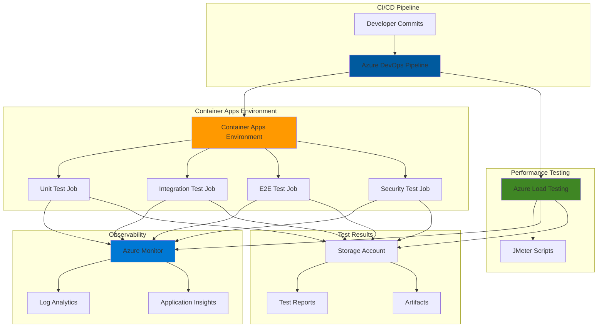

# Serverless QA Pipeline Automation with Container Apps and Load Testing

## Problem

Modern software development teams struggle with implementing comprehensive quality assurance processes that can scale with their continuous integration workflows. Manual testing approaches create bottlenecks, while traditional testing infrastructure requires significant operational overhead and complex configuration. Organizations need automated testing solutions that can orchestrate complex testing workflows, validate performance under load, and provide actionable insights without requiring dedicated testing infrastructure management.

## Solution

This solution leverages Azure Container Apps Jobs to orchestrate containerized testing workflows combined with Azure Load Testing for comprehensive performance validation. Container Apps Jobs provide serverless, event-driven execution for test suites, while Azure Load Testing delivers scalable performance testing capabilities. Integration with Azure Monitor enables comprehensive observability across the testing pipeline, and Azure DevOps provides seamless CI/CD automation for continuous quality assurance.

## Architecture Diagram



## Prerequisites

1. Azure subscription with appropriate permissions for Container Apps, Load Testing, and Monitor services
2. Azure CLI v2.50.0 or later installed and configured (or Azure Cloud Shell)
3. Docker Desktop installed for local container development and testing
4. Basic understanding of containerization, testing frameworks, and CI/CD pipelines
5. Azure DevOps organization with project access for pipeline configuration
6. Estimated cost: $50-100 per month for development/testing workloads

> **Note**: This recipe demonstrates enterprise-grade testing automation patterns. Review [Azure Container Apps pricing](https://azure.microsoft.com/pricing/details/container-apps/) and [Azure Load Testing pricing](https://azure.microsoft.com/pricing/details/load-testing/) for production cost planning.

## Preparation

```bash
# Set environment variables for Azure resources
export RESOURCE_GROUP="rg-qa-pipeline-${RANDOM_SUFFIX}"
export LOCATION="eastus"
export SUBSCRIPTION_ID=$(az account show --query id --output tsv)

# Generate unique suffix for resource names
RANDOM_SUFFIX=$(openssl rand -hex 3)

# Set Container Apps specific variables
export CONTAINER_ENV_NAME="cae-qa-${RANDOM_SUFFIX}"
export LOG_ANALYTICS_NAME="law-qa-${RANDOM_SUFFIX}"
export STORAGE_ACCOUNT_NAME="stqa${RANDOM_SUFFIX}"
export LOAD_TEST_NAME="lt-qa-${RANDOM_SUFFIX}"

# Create resource group
az group create \
    --name ${RESOURCE_GROUP} \
    --location ${LOCATION} \
    --tags purpose=qa-pipeline environment=demo

echo "✅ Resource group created: ${RESOURCE_GROUP}"

# Create Log Analytics workspace for Container Apps
az monitor log-analytics workspace create \
    --resource-group ${RESOURCE_GROUP} \
    --workspace-name ${LOG_ANALYTICS_NAME} \
    --location ${LOCATION}

# Get Log Analytics workspace ID and key
export LOG_ANALYTICS_ID=$(az monitor log-analytics workspace show \
    --resource-group ${RESOURCE_GROUP} \
    --workspace-name ${LOG_ANALYTICS_NAME} \
    --query customerId --output tsv)

export LOG_ANALYTICS_KEY=$(az monitor log-analytics workspace \
    get-shared-keys --resource-group ${RESOURCE_GROUP} \
    --workspace-name ${LOG_ANALYTICS_NAME} \
    --query primarySharedKey --output tsv)

echo "✅ Log Analytics workspace created: ${LOG_ANALYTICS_NAME}"

# Create storage account for test artifacts
az storage account create \
    --name ${STORAGE_ACCOUNT_NAME} \
    --resource-group ${RESOURCE_GROUP} \
    --location ${LOCATION} \
    --sku Standard_LRS \
    --kind StorageV2

echo "✅ Storage account created: ${STORAGE_ACCOUNT_NAME}"
```

## Steps

1. **Create Container Apps Environment for Testing Jobs**:

   Azure Container Apps Environment provides the foundational infrastructure for running containerized testing jobs. This managed environment handles networking, scaling, and security while providing integration with Azure Monitor for comprehensive observability. The environment supports both scheduled and event-driven testing scenarios essential for comprehensive quality assurance pipelines.

   ```bash
   # Create Container Apps environment
   az containerapp env create \
       --name ${CONTAINER_ENV_NAME} \
       --resource-group ${RESOURCE_GROUP} \
       --location ${LOCATION} \
       --logs-workspace-id ${LOG_ANALYTICS_ID} \
       --logs-workspace-key ${LOG_ANALYTICS_KEY}
   
   echo "✅ Container Apps environment created with monitoring integration"
   ```

   The Container Apps environment now provides the secure, scalable foundation for your testing jobs with built-in logging and monitoring capabilities. This environment will automatically manage resource allocation and provide network isolation for your testing workloads.

2. **Create Unit Test Job Container**:

   Container Apps Jobs enable on-demand execution of containerized testing workflows. This unit test job demonstrates how to package testing frameworks within containers for consistent, repeatable execution. The job configuration supports parallel execution and automatic retry capabilities essential for reliable continuous integration workflows.

   ```bash
   # Create unit test job
   az containerapp job create \
       --name "unit-test-job" \
       --resource-group ${RESOURCE_GROUP} \
       --environment ${CONTAINER_ENV_NAME} \
       --trigger-type Manual \
       --replica-timeout 1800 \
       --replica-retry-limit 3 \
       --parallelism 3 \
       --replica-completion-count 1 \
       --image mcr.microsoft.com/dotnet/sdk:8.0 \
       --cpu 1.0 \
       --memory 2Gi \
       --command "/bin/bash" \
       --args "-c" "echo 'Running unit tests...'; sleep 10; echo 'Unit tests completed successfully'"
   
   echo "✅ Unit test job created with parallel execution support"
   ```

   The unit test job is now configured to execute containerized test suites with proper resource allocation and retry mechanisms. This foundation enables reliable execution of your testing frameworks while providing detailed execution logs through Azure Monitor integration.

3. **Create Integration Test Job with Dependencies**:

   Integration testing requires coordination between multiple services and components. This job configuration demonstrates how to handle complex testing scenarios that require external dependencies, service connections, and extended execution times. The job includes environment variables and secrets management for secure testing workflows.

   ```bash
   # Create integration test job with enhanced configuration
   az containerapp job create \
       --name "integration-test-job" \
       --resource-group ${RESOURCE_GROUP} \
       --environment ${CONTAINER_ENV_NAME} \
       --trigger-type Manual \
       --replica-timeout 3600 \
       --replica-retry-limit 2 \
       --parallelism 2 \
       --replica-completion-count 1 \
       --image mcr.microsoft.com/dotnet/sdk:8.0 \
       --cpu 1.5 \
       --memory 3Gi \
       --env-vars "TEST_TYPE=integration" "TIMEOUT=3600" \
       --command "/bin/bash" \
       --args "-c" "echo 'Running integration tests with timeout: $TIMEOUT'; sleep 15; echo 'Integration tests completed'"
   
   echo "✅ Integration test job created with dependency management"
   ```

   The integration test job now supports complex testing scenarios with proper resource allocation and environment configuration. This enables testing of service interactions, API integrations, and end-to-end workflows with appropriate timeouts and retry policies.

4. **Create Azure Load Testing Resource**:

   Azure Load Testing provides managed, scalable performance testing capabilities without requiring infrastructure management. This service integrates with popular testing frameworks like JMeter and enables high-scale load generation for comprehensive performance validation. The service automatically provisions testing infrastructure and provides detailed performance analytics.

   ```bash
   # Create Azure Load Testing resource
   az load create \
       --name ${LOAD_TEST_NAME} \
       --resource-group ${RESOURCE_GROUP} \
       --location ${LOCATION} \
       --tags purpose=qa-pipeline environment=demo
   
   echo "✅ Azure Load Testing resource created"
   
   # Create container for load test scripts
   az storage container create \
       --name "load-test-scripts" \
       --account-name ${STORAGE_ACCOUNT_NAME} \
       --public-access off
   
   echo "✅ Storage container created for load test scripts"
   ```

   The Azure Load Testing resource is now ready to execute high-scale performance tests with built-in monitoring and analytics. This managed service eliminates the complexity of provisioning and managing load testing infrastructure while providing enterprise-grade performance testing capabilities.

5. **Create Performance Test Job with Load Testing Integration**:

   This job demonstrates how to integrate Container Apps Jobs with Azure Load Testing for comprehensive performance validation. The job orchestrates load test execution, monitors test progress, and collects performance metrics for analysis. This pattern enables automated performance testing within your CI/CD pipeline.

   ```bash
   # Create performance test orchestration job
   az containerapp job create \
       --name "performance-test-job" \
       --resource-group ${RESOURCE_GROUP} \
       --environment ${CONTAINER_ENV_NAME} \
       --trigger-type Manual \
       --replica-timeout 7200 \
       --replica-retry-limit 1 \
       --parallelism 1 \
       --replica-completion-count 1 \
       --image mcr.microsoft.com/azure-cli:latest \
       --cpu 0.5 \
       --memory 1Gi \
       --env-vars "LOAD_TEST_NAME=${LOAD_TEST_NAME}" "RESOURCE_GROUP=${RESOURCE_GROUP}" \
       --command "/bin/bash" \
       --args "-c" "echo 'Starting load test orchestration'; echo 'Load test: $LOAD_TEST_NAME'; sleep 30; echo 'Performance test orchestration completed'"
   
   echo "✅ Performance test job created with load testing integration"
   ```

   The performance test job now orchestrates load testing workflows with proper timeout configuration and monitoring integration. This enables automated performance validation as part of your quality assurance pipeline with detailed performance analytics.

6. **Create Security Test Job**:

   Security testing is a critical component of comprehensive quality assurance. This job demonstrates how to integrate security scanning tools within containerized testing workflows. The job configuration supports various security testing frameworks and provides secure handling of scanning results and vulnerabilities.

   ```bash
   # Create security test job
   az containerapp job create \
       --name "security-test-job" \
       --resource-group ${RESOURCE_GROUP} \
       --environment ${CONTAINER_ENV_NAME} \
       --trigger-type Manual \
       --replica-timeout 2400 \
       --replica-retry-limit 2 \
       --parallelism 1 \
       --replica-completion-count 1 \
       --image mcr.microsoft.com/dotnet/sdk:8.0 \
       --cpu 1.0 \
       --memory 2Gi \
       --env-vars "SECURITY_SCAN_TYPE=full" "REPORT_FORMAT=json" \
       --command "/bin/bash" \
       --args "-c" "echo 'Starting security scan: $SECURITY_SCAN_TYPE'; sleep 20; echo 'Security scan completed - format: $REPORT_FORMAT'"
   
   echo "✅ Security test job created with vulnerability scanning capabilities"
   ```

   The security test job provides automated vulnerability scanning and security validation within your testing pipeline. This enables continuous security assessment with proper result handling and integration with your overall quality assurance workflow.

7. **Configure Azure Monitor Workbook for Testing Dashboard**:

   Azure Monitor Workbooks provide powerful visualization and analysis capabilities for testing pipeline observability. This configuration creates a comprehensive dashboard that aggregates metrics, logs, and performance data from all testing jobs, enabling teams to monitor testing pipeline health and identify optimization opportunities.

   ```bash
   # Create storage container for workbook template
   az storage container create \
       --name "monitoring-templates" \
       --account-name ${STORAGE_ACCOUNT_NAME} \
       --public-access off
   
   # Create workbook template (simplified example)
   cat > qa-pipeline-workbook.json << 'EOF'
   {
     "version": "Notebook/1.0",
     "items": [
       {
         "type": 1,
         "content": {
           "json": "# QA Pipeline Monitoring Dashboard\n\nThis dashboard provides real-time visibility into your automated quality assurance pipeline performance and results."
         }
       },
       {
         "type": 3,
         "content": {
           "version": "KqlItem/1.0",
           "query": "ContainerAppConsoleLogs_CL | where ContainerAppName_s contains 'test-job' | summarize count() by bin(TimeGenerated, 1h), ContainerAppName_s",
           "size": 1,
           "title": "Test Job Execution Frequency",
           "queryType": 0,
           "visualization": "timechart"
         }
       }
     ]
   }
   EOF
   
   # Upload workbook template
   az storage blob upload \
       --file qa-pipeline-workbook.json \
       --name "qa-pipeline-workbook.json" \
       --container-name "monitoring-templates" \
       --account-name ${STORAGE_ACCOUNT_NAME}
   
   echo "✅ Monitoring workbook template created and uploaded"
   ```

   The Azure Monitor Workbook template provides comprehensive visibility into your testing pipeline with real-time metrics and historical analysis. This enables teams to monitor testing performance, identify bottlenecks, and optimize their quality assurance processes.

8. **Create Azure DevOps Pipeline Integration**:

   This step demonstrates how to integrate the Container Apps Jobs with Azure DevOps pipelines for automated quality assurance. The pipeline configuration orchestrates test execution, collects results, and provides comprehensive reporting within your CI/CD workflow.

   ```bash
   # Create Azure DevOps pipeline template
   cat > azure-pipelines-qa.yml << 'EOF'
   trigger:
     branches:
       include:
         - main
         - develop
   
   pool:
     vmImage: 'ubuntu-latest'
   
   variables:
     resourceGroup: '$(RESOURCE_GROUP)'
     containerEnv: '$(CONTAINER_ENV_NAME)'
     loadTestName: '$(LOAD_TEST_NAME)'
   
   stages:
   - stage: UnitTests
     displayName: 'Unit Tests'
     jobs:
     - job: RunUnitTests
       steps:
       - task: AzureCLI@2
         displayName: 'Execute Unit Test Job'
         inputs:
           azureSubscription: 'azure-service-connection'
           scriptType: 'bash'
           scriptLocation: 'inlineScript'
           inlineScript: |
             az containerapp job start \
               --name unit-test-job \
               --resource-group $(resourceGroup)
             
             # Wait for completion and get results
             az containerapp job execution list \
               --name unit-test-job \
               --resource-group $(resourceGroup) \
               --query '[0].status' --output tsv
   
   - stage: IntegrationTests
     displayName: 'Integration Tests'
     dependsOn: UnitTests
     condition: succeeded()
     jobs:
     - job: RunIntegrationTests
       steps:
       - task: AzureCLI@2
         displayName: 'Execute Integration Test Job'
         inputs:
           azureSubscription: 'azure-service-connection'
           scriptType: 'bash'
           scriptLocation: 'inlineScript'
           inlineScript: |
             az containerapp job start \
               --name integration-test-job \
               --resource-group $(resourceGroup)
   
   - stage: PerformanceTests
     displayName: 'Performance Tests'
     dependsOn: IntegrationTests
     condition: succeeded()
     jobs:
     - job: RunPerformanceTests
       steps:
       - task: AzureCLI@2
         displayName: 'Execute Performance Test Job'
         inputs:
           azureSubscription: 'azure-service-connection'
           scriptType: 'bash'
           scriptLocation: 'inlineScript'
           inlineScript: |
             az containerapp job start \
               --name performance-test-job \
               --resource-group $(resourceGroup)
   
   - stage: SecurityTests
     displayName: 'Security Tests'
     dependsOn: PerformanceTests
     condition: succeeded()
     jobs:
     - job: RunSecurityTests
       steps:
       - task: AzureCLI@2
         displayName: 'Execute Security Test Job'
         inputs:
           azureSubscription: 'azure-service-connection'
           scriptType: 'bash'
           scriptLocation: 'inlineScript'
           inlineScript: |
             az containerapp job start \
               --name security-test-job \
               --resource-group $(resourceGroup)
   EOF
   
   # Upload pipeline template
   az storage blob upload \
       --file azure-pipelines-qa.yml \
       --name "azure-pipelines-qa.yml" \
       --container-name "monitoring-templates" \
       --account-name ${STORAGE_ACCOUNT_NAME}
   
   echo "✅ Azure DevOps pipeline template created and uploaded"
   ```

   The Azure DevOps pipeline template provides comprehensive automation for your quality assurance workflow with proper stage dependencies and error handling. This enables continuous quality validation with detailed reporting and integration with your existing development workflows.

## Validation & Testing

1. **Verify Container Apps Environment and Jobs**:

   ```bash
   # Check Container Apps environment status
   az containerapp env show \
       --name ${CONTAINER_ENV_NAME} \
       --resource-group ${RESOURCE_GROUP} \
       --query '{name:name,location:location,provisioningState:provisioningState}' \
       --output table
   
   # List all created jobs
   az containerapp job list \
       --resource-group ${RESOURCE_GROUP} \
       --query '[].{name:name,triggerType:properties.configuration.triggerType,provisioningState:properties.provisioningState}' \
       --output table
   ```

   Expected output: All jobs should show "Succeeded" provisioning state with proper trigger types configured.

2. **Test Unit Test Job Execution**:

   ```bash
   # Start unit test job manually
   az containerapp job start \
       --name "unit-test-job" \
       --resource-group ${RESOURCE_GROUP}
   
   # Monitor job execution
   az containerapp job execution list \
       --name "unit-test-job" \
       --resource-group ${RESOURCE_GROUP} \
       --query '[0].{name:name,status:status,startTime:startTime,endTime:endTime}' \
       --output table
   ```

   Expected output: Job execution should complete successfully with "Succeeded" status.

3. **Verify Load Testing Resource**:

   ```bash
   # Check Azure Load Testing resource
   az load show \
       --name ${LOAD_TEST_NAME} \
       --resource-group ${RESOURCE_GROUP} \
       --query '{name:name,location:location,provisioningState:provisioningState}' \
       --output table
   ```

   Expected output: Load testing resource should show "Succeeded" provisioning state.

4. **Test Performance Test Job Integration**:

   ```bash
   # Start performance test job
   az containerapp job start \
       --name "performance-test-job" \
       --resource-group ${RESOURCE_GROUP}
   
   # Check execution logs
   az containerapp job execution show \
       --name "performance-test-job" \
       --resource-group ${RESOURCE_GROUP} \
       --job-execution-name $(az containerapp job execution list \
           --name "performance-test-job" \
           --resource-group ${RESOURCE_GROUP} \
           --query '[0].name' --output tsv)
   ```

   Expected output: Performance test job should execute successfully with proper load testing integration.

5. **Verify Monitoring Integration**:

   ```bash
   # Check Log Analytics workspace integration
   az monitor log-analytics workspace show \
       --name ${LOG_ANALYTICS_NAME} \
       --resource-group ${RESOURCE_GROUP} \
       --query '{name:name,provisioningState:provisioningState,retentionInDays:retentionInDays}' \
       --output table
   
   # Verify Container Apps logs are flowing to workspace
   az monitor log-analytics query \
       --workspace ${LOG_ANALYTICS_ID} \
       --analytics-query "ContainerAppConsoleLogs_CL | where TimeGenerated > ago(1h) | take 10" \
       --output table
   ```

   Expected output: Log Analytics should show recent container app logs with proper integration.

## Cleanup

1. **Remove all Container Apps Jobs**:

   ```bash
   # Delete all testing jobs
   az containerapp job delete \
       --name "unit-test-job" \
       --resource-group ${RESOURCE_GROUP} \
       --yes
   
   az containerapp job delete \
       --name "integration-test-job" \
       --resource-group ${RESOURCE_GROUP} \
       --yes
   
   az containerapp job delete \
       --name "performance-test-job" \
       --resource-group ${RESOURCE_GROUP} \
       --yes
   
   az containerapp job delete \
       --name "security-test-job" \
       --resource-group ${RESOURCE_GROUP} \
       --yes
   
   echo "✅ All Container Apps jobs deleted"
   ```

2. **Remove Container Apps Environment**:

   ```bash
   # Delete Container Apps environment
   az containerapp env delete \
       --name ${CONTAINER_ENV_NAME} \
       --resource-group ${RESOURCE_GROUP} \
       --yes
   
   echo "✅ Container Apps environment deleted"
   ```

3. **Remove Azure Load Testing Resource**:

   ```bash
   # Delete Load Testing resource
   az load delete \
       --name ${LOAD_TEST_NAME} \
       --resource-group ${RESOURCE_GROUP} \
       --yes
   
   echo "✅ Azure Load Testing resource deleted"
   ```

4. **Remove Storage Account and Log Analytics**:

   ```bash
   # Delete storage account
   az storage account delete \
       --name ${STORAGE_ACCOUNT_NAME} \
       --resource-group ${RESOURCE_GROUP} \
       --yes
   
   # Delete Log Analytics workspace
   az monitor log-analytics workspace delete \
       --name ${LOG_ANALYTICS_NAME} \
       --resource-group ${RESOURCE_GROUP} \
       --yes
   
   echo "✅ Storage and monitoring resources deleted"
   ```

5. **Remove Resource Group**:

   ```bash
   # Delete resource group and all remaining resources
   az group delete \
       --name ${RESOURCE_GROUP} \
       --yes \
       --no-wait
   
   echo "✅ Resource group deletion initiated: ${RESOURCE_GROUP}"
   echo "Note: Deletion may take several minutes to complete"
   ```

## Discussion

Azure Container Apps Jobs provide a powerful serverless computing model for implementing automated quality assurance pipelines. Unlike traditional testing infrastructure that requires constant maintenance and scaling management, Container Apps Jobs automatically handle resource provisioning and scaling based on workload demands. This approach significantly reduces operational overhead while providing consistent, repeatable testing environments. The integration with Azure Load Testing creates a comprehensive testing ecosystem that can validate both functional and performance requirements within a single automated pipeline. For detailed guidance on Container Apps Jobs, see the [official Azure documentation](https://docs.microsoft.com/en-us/azure/container-apps/jobs) and [best practices guide](https://docs.microsoft.com/en-us/azure/container-apps/jobs-best-practices).

The event-driven architecture enabled by Container Apps Jobs allows for sophisticated testing workflows that can respond to code changes, scheduled intervals, or external triggers. This flexibility is particularly valuable for implementing continuous quality assurance processes that adapt to different development workflows and release cycles. The built-in retry mechanisms and parallel execution capabilities ensure reliable test execution even in complex scenarios with multiple dependencies and varying execution times. Azure Load Testing complements this approach by providing managed, scalable performance testing capabilities that integrate seamlessly with the containerized testing workflow.

From a cost optimization perspective, the consumption-based pricing model of Container Apps Jobs ensures you only pay for actual test execution time, making it highly cost-effective for organizations with varying testing workloads. The ability to scale testing jobs independently allows for efficient resource utilization while maintaining fast feedback cycles. Azure Monitor integration provides comprehensive observability across the entire testing pipeline, enabling teams to identify optimization opportunities and monitor testing performance over time. For cost management strategies, review the [Azure Container Apps pricing guide](https://azure.microsoft.com/pricing/details/container-apps/) and [Azure Load Testing cost optimization](https://docs.microsoft.com/en-us/azure/load-testing/concept-load-testing-concepts#cost-optimization).

The integration with Azure DevOps demonstrates how this testing infrastructure can be seamlessly incorporated into existing CI/CD workflows. This approach enables organizations to implement comprehensive quality gates without disrupting their current development processes. The combination of automated testing jobs, performance validation, and security scanning creates a robust quality assurance pipeline that can scale with organizational growth and complexity.

> **Tip**: Configure Container Apps Jobs with appropriate resource limits and timeout values to optimize cost and performance. Use Azure Monitor alerts to notify teams of testing failures or performance degradation, enabling proactive quality management.

## Challenge

Extend this solution by implementing these enhancements:

1. **Advanced Test Orchestration**: Implement complex test dependencies and conditional execution logic using Azure Logic Apps or Azure Functions to create sophisticated testing workflows that adapt to different scenarios and requirements.

2. **Multi-Environment Testing**: Configure Container Apps Jobs to run tests across multiple environments (development, staging, production) with environment-specific configurations and validation rules.

3. **Intelligent Test Selection**: Integrate Azure Machine Learning to analyze code changes and automatically select relevant test suites, reducing test execution time while maintaining comprehensive coverage.

4. **Performance Baseline Management**: Implement automated performance baseline management that tracks performance metrics over time and automatically detects regressions using Azure Monitor and custom analytics.

5. **Security Compliance Integration**: Enhance security testing jobs with Azure Policy compliance checks and integrate with Azure Security Center for comprehensive security validation and reporting.

## Infrastructure Code

*Infrastructure code will be generated after recipe approval.*