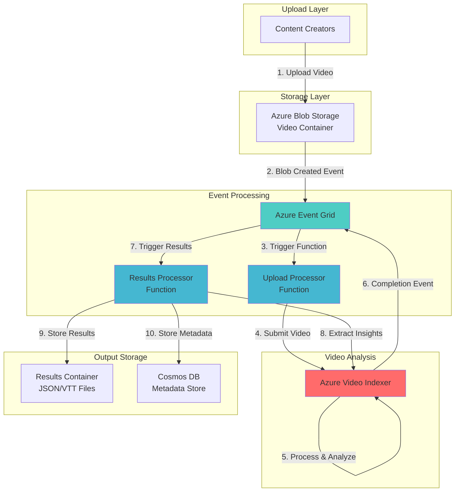

# Serverless Video Transcription with Video Indexer and Event Grid

## Problem

Organizations handling large volumes of video content struggle with manual transcription and content analysis workflows. Traditional video processing requires dedicated infrastructure, manual monitoring, and custom integration code to extract insights like transcripts, keywords, and sentiment analysis. These limitations result in delayed content availability, missed compliance requirements, and inability to scale efficiently during peak upload periods.

## Solution

Build an automated serverless pipeline using Azure Video Indexer for AI-powered video analysis, Azure Event Grid for event-driven orchestration, and Azure Functions for workflow automation. This architecture automatically processes videos uploaded to Azure Blob Storage, extracts transcriptions and insights, then triggers downstream workflows based on content analysis results without managing infrastructure.

## Architecture Diagram



## Prerequisites

1. Azure subscription with appropriate permissions (Contributor role)
2. Azure CLI v2 installed and configured (or Azure CloudShell)
3. Basic understanding of serverless architectures and event-driven patterns
4. Familiarity with Azure Functions and blob storage concepts
5. Azure Video Indexer account (free tier available)
6. Estimated cost: ~$50/month for moderate usage (100 videos/month)

> **Note**: Azure Video Indexer offers 10 hours of free indexing per month. Additional usage is charged based on video duration and selected features.

## Preparation

```bash
# Set environment variables
export RESOURCE_GROUP="rg-video-indexer-${RANDOM_SUFFIX}"
export LOCATION="eastus"
export SUBSCRIPTION_ID=$(az account show --query id --output tsv)

# Generate unique suffix for resource names
RANDOM_SUFFIX=$(openssl rand -hex 3)

# Create resource group
az group create \
    --name ${RESOURCE_GROUP} \
    --location ${LOCATION} \
    --tags purpose=video-transcription environment=demo

# Set additional variables
export STORAGE_ACCOUNT="stvideo${RANDOM_SUFFIX}"
export FUNCTION_APP="func-video-${RANDOM_SUFFIX}"
export COSMOS_ACCOUNT="cosmos-video-${RANDOM_SUFFIX}"
export VI_ACCOUNT="vi-account-${RANDOM_SUFFIX}"
export EVENT_GRID_TOPIC="eg-video-${RANDOM_SUFFIX}"

echo "✅ Resource group created: ${RESOURCE_GROUP}"
```

## Steps

1. **Create Storage Account with Event Grid Integration**:

   Azure Blob Storage provides the foundation for video uploads with built-in Event Grid integration. By enabling event notifications, we create a reactive architecture that automatically responds to new video uploads without polling or manual intervention. This serverless approach ensures immediate processing while maintaining cost efficiency.

   ```bash
   # Create storage account with hierarchical namespace disabled for Video Indexer compatibility
   az storage account create \
       --name ${STORAGE_ACCOUNT} \
       --resource-group ${RESOURCE_GROUP} \
       --location ${LOCATION} \
       --sku Standard_LRS \
       --kind StorageV2 \
       --access-tier Hot

   # Get storage connection string
   STORAGE_CONNECTION=$(az storage account show-connection-string \
       --name ${STORAGE_ACCOUNT} \
       --resource-group ${RESOURCE_GROUP} \
       --query connectionString --output tsv)

   # Create containers for videos and results
   az storage container create \
       --name videos \
       --account-name ${STORAGE_ACCOUNT} \
       --public-access off

   az storage container create \
       --name results \
       --account-name ${STORAGE_ACCOUNT} \
       --public-access off

   echo "✅ Storage account created with video containers"
   ```

   The storage account now supports blob events and provides secure containers for both input videos and processing results. The Hot access tier ensures optimal performance for frequently accessed video content.

2. **Deploy Azure Cosmos DB for Metadata Storage**:

   Azure Cosmos DB provides a globally distributed, multi-model database for storing video metadata and analysis results. Its serverless tier automatically scales based on demand, making it ideal for unpredictable workloads while maintaining single-digit millisecond latency for metadata queries.

   ```bash
   # Create Cosmos DB account with serverless capacity
   az cosmosdb create \
       --name ${COSMOS_ACCOUNT} \
       --resource-group ${RESOURCE_GROUP} \
       --capabilities EnableServerless \
       --default-consistency-level Session \
       --locations regionName=${LOCATION}

   # Create database and container
   az cosmosdb sql database create \
       --account-name ${COSMOS_ACCOUNT} \
       --resource-group ${RESOURCE_GROUP} \
       --name VideoAnalytics

   az cosmosdb sql container create \
       --account-name ${COSMOS_ACCOUNT} \
       --resource-group ${RESOURCE_GROUP} \
       --database-name VideoAnalytics \
       --name VideoMetadata \
       --partition-key-path /videoId

   # Get Cosmos DB connection string
   COSMOS_CONNECTION=$(az cosmosdb keys list \
       --name ${COSMOS_ACCOUNT} \
       --resource-group ${RESOURCE_GROUP} \
       --type connection-strings \
       --query connectionStrings[0].connectionString \
       --output tsv)

   echo "✅ Cosmos DB deployed for metadata storage"
   ```

3. **Create Azure Video Indexer Account**:

   Azure Video Indexer leverages multiple Azure AI services to extract insights from videos including transcription, OCR, face detection, and sentiment analysis. The service processes videos asynchronously and provides REST APIs for integration with custom workflows, making it perfect for event-driven architectures.

   ```bash
   # Create Video Indexer account (requires portal for initial setup)
   echo "⚠️  Azure Video Indexer account creation requires Azure Portal"
   echo "Please create manually at: https://www.videoindexer.ai/"
   echo "After creation, obtain:"
   echo "1. Account ID"
   echo "2. API Key from the Profile page"
   echo ""
   echo "Press enter when Video Indexer account is ready..."
   read

   # Set Video Indexer credentials (replace with your values)
   echo "Enter Video Indexer Account ID:"
   read VI_ACCOUNT_ID
   echo "Enter Video Indexer API Key:"
   read -s VI_API_KEY

   export VI_ACCOUNT_ID
   export VI_API_KEY

   echo "✅ Video Indexer credentials configured"
   ```

4. **Deploy Azure Functions for Processing Logic**:

   Azure Functions provides the serverless compute layer that orchestrates video processing workflows. Using consumption plan billing, functions only incur costs during execution, making it cost-effective for sporadic video uploads while automatically scaling to handle bulk processing scenarios.

   ```bash
   # Create Function App with Node.js runtime
   az functionapp create \
       --name ${FUNCTION_APP} \
       --resource-group ${RESOURCE_GROUP} \
       --storage-account ${STORAGE_ACCOUNT} \
       --consumption-plan-location ${LOCATION} \
       --runtime node \
       --runtime-version 18 \
       --functions-version 4

   # Configure application settings
   az functionapp config appsettings set \
       --name ${FUNCTION_APP} \
       --resource-group ${RESOURCE_GROUP} \
       --settings \
       "STORAGE_CONNECTION=${STORAGE_CONNECTION}" \
       "COSMOS_CONNECTION=${COSMOS_CONNECTION}" \
       "VI_ACCOUNT_ID=${VI_ACCOUNT_ID}" \
       "VI_API_KEY=${VI_API_KEY}" \
       "VI_LOCATION=${LOCATION}"

   echo "✅ Function App deployed and configured"
   ```

5. **Configure Event Grid Topic and Subscriptions**:

   Azure Event Grid acts as the central nervous system of our serverless architecture, routing events between services with guaranteed delivery and built-in retry logic. This pub-sub model enables loose coupling between components while maintaining reliability and scalability.

   ```bash
   # Create custom Event Grid topic for Video Indexer events
   az eventgrid topic create \
       --name ${EVENT_GRID_TOPIC} \
       --resource-group ${RESOURCE_GROUP} \
       --location ${LOCATION}

   # Get topic endpoint and key
   TOPIC_ENDPOINT=$(az eventgrid topic show \
       --name ${EVENT_GRID_TOPIC} \
       --resource-group ${RESOURCE_GROUP} \
       --query endpoint --output tsv)

   TOPIC_KEY=$(az eventgrid topic key list \
       --name ${EVENT_GRID_TOPIC} \
       --resource-group ${RESOURCE_GROUP} \
       --query key1 --output tsv)

   # Update Function App with Event Grid settings
   az functionapp config appsettings set \
       --name ${FUNCTION_APP} \
       --resource-group ${RESOURCE_GROUP} \
       --settings \
       "EVENT_GRID_TOPIC_ENDPOINT=${TOPIC_ENDPOINT}" \
       "EVENT_GRID_TOPIC_KEY=${TOPIC_KEY}"

   echo "✅ Event Grid topic created and configured"
   ```

6. **Create Blob Storage Event Subscription**:

   Event subscriptions define the routing rules for events, enabling automatic triggering of functions when videos are uploaded. By filtering events to specific containers and file types, we ensure only relevant uploads trigger processing, reducing unnecessary function executions and costs.

   ```bash
   # Get Function App resource ID for event subscription
   FUNCTION_ID=$(az functionapp show \
       --name ${FUNCTION_APP} \
       --resource-group ${RESOURCE_GROUP} \
       --query id --output tsv)

   # Create event subscription for blob uploads
   az eventgrid event-subscription create \
       --name video-upload-subscription \
       --source-resource-id $(az storage account show \
           --name ${STORAGE_ACCOUNT} \
           --resource-group ${RESOURCE_GROUP} \
           --query id --output tsv) \
       --endpoint ${FUNCTION_ID}/functions/ProcessVideoUpload \
       --endpoint-type azurefunction \
       --included-event-types Microsoft.Storage.BlobCreated \
       --subject-filter --subject-begins-with /blobServices/default/containers/videos/

   echo "✅ Blob storage event subscription created"
   ```

7. **Deploy Function Code for Video Processing**:

   The processing functions implement the core business logic for video analysis workflows. These functions handle Video Indexer API interactions, status polling, and result extraction while implementing proper error handling and retry mechanisms for production reliability.

   ```bash
   # Create local function project structure
   mkdir -p video-functions && cd video-functions

   # Initialize function project
   func init --worker-runtime node --language javascript

   # Create upload processor function
   func new --name ProcessVideoUpload --template "Azure Event Grid trigger"

   # Create sample function code
   cat > ProcessVideoUpload/index.js << 'EOF'
   const axios = require('axios');
   const { BlobServiceClient } = require('@azure/storage-blob');
   
   module.exports = async function (context, eventGridEvent) {
       context.log('Processing video upload:', eventGridEvent.subject);
       
       try {
           const blobUrl = eventGridEvent.data.url;
           const fileName = blobUrl.split('/').pop();
           
           // Get Video Indexer access token
           const tokenResponse = await axios.get(
               `https://api.videoindexer.ai/auth/${process.env.VI_LOCATION}/Accounts/${process.env.VI_ACCOUNT_ID}/AccessToken`,
               {
                   headers: { 'Ocp-Apim-Subscription-Key': process.env.VI_API_KEY }
               }
           );
           
           const accessToken = tokenResponse.data;
           
           // Submit video for indexing
           const indexResponse = await axios.post(
               `https://api.videoindexer.ai/${process.env.VI_LOCATION}/Accounts/${process.env.VI_ACCOUNT_ID}/Videos`,
               null,
               {
                   params: {
                       accessToken,
                       name: fileName,
                       videoUrl: blobUrl,
                       callbackUrl: `${process.env.EVENT_GRID_TOPIC_ENDPOINT}?key=${process.env.EVENT_GRID_TOPIC_KEY}`
                   }
               }
           );
           
           context.log('Video submitted for indexing:', indexResponse.data.id);
           
       } catch (error) {
           context.log.error('Error processing video:', error);
           throw error;
       }
   };
   EOF

   # Deploy functions to Azure
   func azure functionapp publish ${FUNCTION_APP}

   echo "✅ Function code deployed successfully"
   ```

   The function now automatically processes video uploads by submitting them to Video Indexer and configuring callbacks for completion notifications. This asynchronous pattern ensures the function completes quickly while Video Indexer processes videos in the background.

8. **Implement Results Processing Function**:

   The results processor extracts insights from completed video analysis and stores them in appropriate formats. This function transforms Video Indexer's rich JSON output into actionable data while maintaining the complete analysis results for future reference.

   ```bash
   # Create results processor function
   func new --name ProcessVideoResults --template "Azure Event Grid trigger"

   # Create results processing code
   cat > ProcessVideoResults/index.js << 'EOF'
   const { CosmosClient } = require('@azure/cosmos');
   const { BlobServiceClient } = require('@azure/storage-blob');
   const axios = require('axios');
   
   module.exports = async function (context, eventGridEvent) {
       context.log('Processing video analysis results');
       
       try {
           const videoId = eventGridEvent.data.id;
           
           // Get access token
           const tokenResponse = await axios.get(
               `https://api.videoindexer.ai/auth/${process.env.VI_LOCATION}/Accounts/${process.env.VI_ACCOUNT_ID}/AccessToken`,
               {
                   headers: { 'Ocp-Apim-Subscription-Key': process.env.VI_API_KEY }
               }
           );
           
           const accessToken = tokenResponse.data;
           
           // Get video index results
           const indexResponse = await axios.get(
               `https://api.videoindexer.ai/${process.env.VI_LOCATION}/Accounts/${process.env.VI_ACCOUNT_ID}/Videos/${videoId}/Index`,
               {
                   params: { accessToken }
               }
           );
           
           const insights = indexResponse.data;
           
           // Store in Cosmos DB
           const cosmosClient = new CosmosClient(process.env.COSMOS_CONNECTION);
           const container = cosmosClient
               .database('VideoAnalytics')
               .container('VideoMetadata');
           
           await container.items.create({
               id: videoId,
               videoId: videoId,
               name: insights.name,
               duration: insights.durationInSeconds,
               transcript: insights.videos[0].insights.transcript,
               keywords: insights.summarizedInsights.keywords,
               topics: insights.summarizedInsights.topics,
               processedAt: new Date().toISOString()
           });
           
           // Store full results in blob storage
           const blobClient = BlobServiceClient.fromConnectionString(
               process.env.STORAGE_CONNECTION
           );
           
           const containerClient = blobClient.getContainerClient('results');
           const blockBlobClient = containerClient.getBlockBlobClient(
               `${videoId}/insights.json`
           );
           
           await blockBlobClient.upload(
               JSON.stringify(insights, null, 2),
               JSON.stringify(insights).length
           );
           
           context.log('Results processed successfully:', videoId);
           
       } catch (error) {
           context.log.error('Error processing results:', error);
           throw error;
       }
   };
   EOF

   # Update function configuration
   cd ..
   npm install @azure/cosmos @azure/storage-blob axios

   # Deploy updated functions
   func azure functionapp publish ${FUNCTION_APP}

   echo "✅ Results processing function deployed"
   ```

9. **Configure Video Indexer Event Subscription**:

   Creating a subscription for Video Indexer completion events closes the processing loop, ensuring results are automatically extracted and stored when analysis completes. This event-driven approach eliminates the need for polling and ensures timely result availability.

   ```bash
   # Create Event Grid subscription for Video Indexer results
   az eventgrid event-subscription create \
       --name video-results-subscription \
       --source-resource-id $(az eventgrid topic show \
           --name ${EVENT_GRID_TOPIC} \
           --resource-group ${RESOURCE_GROUP} \
           --query id --output tsv) \
       --endpoint ${FUNCTION_ID}/functions/ProcessVideoResults \
       --endpoint-type azurefunction

   echo "✅ Video Indexer event subscription configured"
   ```

## Validation & Testing

1. Upload a test video to trigger the pipeline:

   ```bash
   # Download a sample video (or use your own)
   curl -o sample-video.mp4 \
       "https://sample-videos.com/video321/mp4/720/big_buck_bunny_720p_1mb.mp4"

   # Upload to blob storage
   az storage blob upload \
       --account-name ${STORAGE_ACCOUNT} \
       --container-name videos \
       --name test-video-$(date +%s).mp4 \
       --file sample-video.mp4

   echo "✅ Test video uploaded"
   ```

2. Monitor Function App logs for processing status:

   ```bash
   # Stream function logs
   az webapp log tail \
       --name ${FUNCTION_APP} \
       --resource-group ${RESOURCE_GROUP}
   ```

   Expected output: You should see logs indicating video submission to Video Indexer and subsequent processing events.

3. Query Cosmos DB for processed video metadata:

   ```bash
   # List processed videos
   az cosmosdb sql query \
       --account-name ${COSMOS_ACCOUNT} \
       --database-name VideoAnalytics \
       --container-name VideoMetadata \
       --resource-group ${RESOURCE_GROUP} \
       --query-text "SELECT c.videoId, c.name, c.duration FROM c"
   ```

4. Verify transcription results in blob storage:

   ```bash
   # List result files
   az storage blob list \
       --account-name ${STORAGE_ACCOUNT} \
       --container-name results \
       --output table \
       --query "[].{Name:name, Size:properties.contentLength}"
   ```

## Cleanup

1. Delete the resource group and all resources:

   ```bash
   # Delete resource group
   az group delete \
       --name ${RESOURCE_GROUP} \
       --yes \
       --no-wait

   echo "✅ Resource group deletion initiated: ${RESOURCE_GROUP}"
   echo "Note: Deletion may take several minutes to complete"
   ```

2. Remove Video Indexer account (if created for testing):

   ```bash
   echo "⚠️  Remember to delete your Video Indexer account at:"
   echo "https://www.videoindexer.ai/"
   ```

3. Clear local environment variables:

   ```bash
   unset RESOURCE_GROUP STORAGE_ACCOUNT FUNCTION_APP
   unset COSMOS_ACCOUNT VI_ACCOUNT VI_API_KEY
   unset EVENT_GRID_TOPIC RANDOM_SUFFIX

   echo "✅ Environment variables cleared"
   ```

## Discussion

This serverless video transcription pipeline demonstrates the power of event-driven architectures in Azure. By combining Azure Video Indexer's AI capabilities with Event Grid's reliable event routing, we create a scalable solution that automatically processes videos without infrastructure management. The architecture follows [Azure Well-Architected Framework](https://docs.microsoft.com/en-us/azure/architecture/framework/) principles, ensuring reliability, security, and cost optimization.

The use of managed services eliminates operational overhead while providing enterprise-grade capabilities. Azure Video Indexer handles complex AI processing including speech-to-text, OCR, face detection, and sentiment analysis through a simple API. Event Grid ensures reliable event delivery with built-in retry mechanisms, while Azure Functions provide the glue code with automatic scaling. For detailed Video Indexer capabilities, see the [official documentation](https://docs.microsoft.com/en-us/azure/azure-video-indexer/video-indexer-overview).

From a cost perspective, the serverless model ensures you only pay for actual usage. Video Indexer charges per minute of video processed, while Functions bill per execution. This consumption-based pricing makes the solution cost-effective for variable workloads. The use of Cosmos DB serverless tier further optimizes costs for metadata storage. Review the [Azure Functions pricing guide](https://docs.microsoft.com/en-us/azure/azure-functions/pricing) and [Video Indexer pricing](https://azure.microsoft.com/en-us/pricing/details/video-indexer/) for detailed cost analysis.

> **Tip**: Enable Application Insights for comprehensive monitoring of function performance and Video Indexer API calls. The [monitoring best practices guide](https://docs.microsoft.com/en-us/azure/azure-functions/functions-monitoring) provides detailed configuration steps.

## Challenge

Extend this solution by implementing these enhancements:

1. Add language detection and automatic translation of transcripts using Azure Translator
2. Implement content moderation by analyzing Video Indexer's visual and textual moderation scores
3. Create a notification system using Azure Communication Services to alert users when processing completes
4. Build a search interface using Azure Cognitive Search to query video content by spoken words
5. Add workflow branching based on video content using Logic Apps for complex business rules

## Infrastructure Code

*Infrastructure code will be generated after recipe approval.*