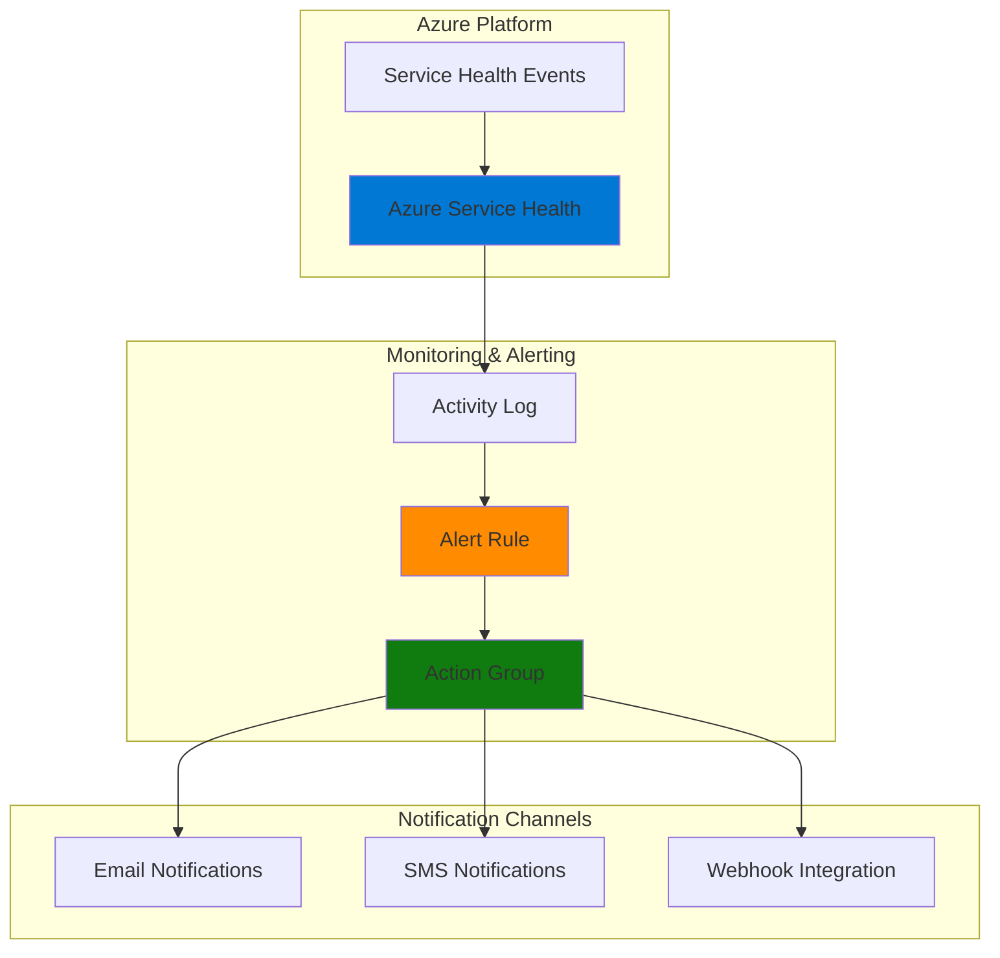

# Service Health Monitoring with Azure Service Health and Monitor

## Problem

Organizations running critical workloads on Azure need immediate notification when Azure service issues, planned maintenance, or security advisories could impact their operations. Without proactive monitoring, teams may discover service disruptions too late, leading to prolonged downtime, missed SLAs, and reactive troubleshooting that impacts business continuity.

## Solution

Azure Service Health provides centralized monitoring of Azure platform health events that affect your specific subscription and resources. By configuring automated alerts through Azure Monitor action groups, you can receive immediate notifications via email, SMS, or webhooks when Azure services experience issues, enabling proactive incident response and better preparation for planned maintenance windows.

## Architecture Diagram



## Prerequisites

1. Azure subscription with active resources to monitor
2. Azure CLI installed and configured (or Azure Cloud Shell)
3. Basic understanding of Azure Monitor concepts
4. Valid email address and/or phone number for notifications
5. Estimated cost: $0 - Service Health alerts are free, minimal charges for SMS notifications only

> **Note**: Azure Service Health alerts are supported only in public clouds with action groups set to the "Global" region.

## Preparation

```bash
# Set environment variables for Azure resources
export RESOURCE_GROUP="rg-service-health-${RANDOM_SUFFIX}"
export LOCATION="eastus"
export SUBSCRIPTION_ID=$(az account show --query id --output tsv)

# Generate unique suffix for resource names
RANDOM_SUFFIX=$(openssl rand -hex 3)

# Set notification details (replace with your actual email/phone)
export NOTIFICATION_EMAIL="admin@yourcompany.com"
export NOTIFICATION_PHONE="+1234567890"

# Create resource group for monitoring resources
az group create \
    --name ${RESOURCE_GROUP} \
    --location ${LOCATION} \
    --tags purpose=service-health-monitoring environment=production

echo "✅ Resource group created: ${RESOURCE_GROUP}"
echo "📧 Notification email: ${NOTIFICATION_EMAIL}"
```

## Steps

1. **Create Action Group for Notifications**:

   Azure Monitor action groups define how alerts are delivered to stakeholders when service health events occur. Action groups support multiple notification channels including email, SMS, voice calls, and webhooks, enabling flexible incident response workflows. This global service ensures reliable notification delivery even during regional Azure service disruptions.

   ```bash
   # Create action group with email and SMS notifications
   az monitor action-group create \
       --name "ServiceHealthAlerts" \
       --resource-group ${RESOURCE_GROUP} \
       --short-name "SvcHealth" \
       --email-receivers name="admin-email" email=${NOTIFICATION_EMAIL} \
       --sms-receivers name="admin-sms" country-code="1" \
                      phone-number=${NOTIFICATION_PHONE}
   
   # Store action group resource ID for alert rule creation
   ACTION_GROUP_ID=$(az monitor action-group show \
       --name "ServiceHealthAlerts" \
       --resource-group ${RESOURCE_GROUP} \
       --query id --output tsv)
   
   echo "✅ Action group created with ID: ${ACTION_GROUP_ID}"
   ```

   The action group is now configured to send notifications through multiple channels, ensuring critical service health information reaches the right people regardless of their preferred communication method.

2. **Create Service Health Alert Rule for Service Issues**:

   Service issues represent unplanned disruptions to Azure services that could impact your resources. Creating targeted alerts for service issues enables immediate awareness of ongoing problems, allowing teams to implement workarounds, communicate with stakeholders, and escalate to Azure support when necessary.

   ```bash
   # Create alert rule for service issues affecting your subscription
   az monitor activity-log alert create \
       --name "ServiceIssueAlert" \
       --resource-group ${RESOURCE_GROUP} \
       --condition category=ServiceHealth \
       --action-group ${ACTION_GROUP_ID} \
       --description "Alert for Azure service issues affecting subscription"
   
   echo "✅ Service issue alert rule created successfully"
   ```

   This alert rule monitors the Azure Activity Log for service health notifications and automatically triggers the action group when Azure reports service issues that could affect your subscription resources.

3. **Create Planned Maintenance Alert Rule**:

   Planned maintenance notifications provide advanced warning of scheduled Azure service updates that may impact your resources. These alerts enable proactive preparation including scheduling maintenance windows, scaling resources, or implementing temporary workarounds to minimize business impact.

   ```bash
   # Create alert rule for planned maintenance notifications
   az monitor activity-log alert create \
       --name "PlannedMaintenanceAlert" \
       --resource-group ${RESOURCE_GROUP} \
       --condition category=ServiceHealth \
                   operationName=Microsoft.ServiceHealth/incident/action \
       --action-group ${ACTION_GROUP_ID} \
       --description "Alert for planned Azure maintenance events"
   
   echo "✅ Planned maintenance alert rule created successfully"
   ```

   The planned maintenance alert ensures your team receives advance notice of scheduled service updates, enabling better capacity planning and reduced risk of unexpected service impacts.

4. **Create Health Advisory Alert Rule**:

   Health advisories communicate important information about potential service impacts, security vulnerabilities, or recommended actions for your Azure resources. These proactive notifications help maintain optimal security posture and service reliability through timely guidance and best practice recommendations.

   ```bash
   # Create alert rule for health advisories
   az monitor activity-log alert create \
       --name "HealthAdvisoryAlert" \
       --resource-group ${RESOURCE_GROUP} \
       --condition category=ServiceHealth \
                   operationName=Microsoft.ServiceHealth/incident/action \
       --action-group ${ACTION_GROUP_ID} \
       --description "Alert for Azure health advisories and recommendations"
   
   echo "✅ Health advisory alert rule created successfully"
   ```

   Health advisory alerts keep your team informed about emerging issues, security recommendations, and best practices that could affect your Azure infrastructure's performance and security.

5. **Configure Resource-Specific Service Health Monitoring**:

   While subscription-level alerts provide broad coverage, resource-specific monitoring enables targeted alerts for critical services your organization depends on. This focused approach reduces alert noise while ensuring comprehensive coverage of mission-critical Azure services.

   ```bash
   # Create targeted alert for critical Azure services
   az monitor activity-log alert create \
       --name "CriticalServicesAlert" \
       --resource-group ${RESOURCE_GROUP} \
       --condition category=ServiceHealth \
       --action-group ${ACTION_GROUP_ID} \
       --description "Alert for critical Azure services: Virtual Machines, Storage, Networking" \
       --scope "/subscriptions/${SUBSCRIPTION_ID}"
   
   echo "✅ Resource-specific service health alert configured"
   ```

   This targeted monitoring ensures that alerts for your most critical Azure services receive immediate attention while maintaining manageable alert volumes for your operations team.

## Validation & Testing

1. **Verify Action Group Configuration**:

   ```bash
   # Check action group settings and notification channels
   az monitor action-group show \
       --name "ServiceHealthAlerts" \
       --resource-group ${RESOURCE_GROUP} \
       --output table
   
   # List all configured notification actions
   az monitor action-group show \
       --name "ServiceHealthAlerts" \
       --resource-group ${RESOURCE_GROUP} \
       --query '{Name:name, EmailActions:emailReceivers, SmsActions:smsReceivers}' \
       --output table
   ```

   Expected output: Action group details showing configured email and SMS notification channels with your specified contact information.

2. **Verify Alert Rules Configuration**:

   ```bash
   # List all activity log alert rules in the resource group
   az monitor activity-log alert list \
       --resource-group ${RESOURCE_GROUP} \
       --output table
   
   # Check specific alert rule details
   az monitor activity-log alert show \
       --name "ServiceIssueAlert" \
       --resource-group ${RESOURCE_GROUP} \
       --query '{Name:name, Enabled:enabled, Condition:condition, ActionGroups:actions.actionGroups}'
   ```

   Expected output: Four alert rules showing as enabled with proper action group associations.

3. **Test Action Group Notifications**:

   ```bash
   # Test action group by triggering a test notification
   az monitor action-group test-notifications create \
       --action-group-name "ServiceHealthAlerts" \
       --resource-group ${RESOURCE_GROUP} \
       --alert-type servicehealth
   
   echo "✅ Test notification sent - check your email and SMS"
   ```

   Expected result: You should receive both email and SMS test notifications confirming the action group is properly configured and functional.

## Cleanup

1. **Remove Alert Rules**:

   ```bash
   # Delete all service health alert rules
   az monitor activity-log alert delete \
       --name "ServiceIssueAlert" \
       --resource-group ${RESOURCE_GROUP} \
       --yes
   
   az monitor activity-log alert delete \
       --name "PlannedMaintenanceAlert" \
       --resource-group ${RESOURCE_GROUP} \
       --yes
   
   az monitor activity-log alert delete \
       --name "HealthAdvisoryAlert" \
       --resource-group ${RESOURCE_GROUP} \
       --yes
   
   az monitor activity-log alert delete \
       --name "CriticalServicesAlert" \
       --resource-group ${RESOURCE_GROUP} \
       --yes
   
   echo "✅ All alert rules deleted"
   ```

2. **Remove Action Group**:

   ```bash
   # Delete the action group
   az monitor action-group delete \
       --name "ServiceHealthAlerts" \
       --resource-group ${RESOURCE_GROUP} \
       --yes
   
   echo "✅ Action group deleted"
   ```

3. **Remove Resource Group**:

   ```bash
   # Delete resource group and all contained resources
   az group delete \
       --name ${RESOURCE_GROUP} \
       --yes \
       --no-wait
   
   echo "✅ Resource group deletion initiated: ${RESOURCE_GROUP}"
   echo "Note: Deletion may take several minutes to complete"
   
   # Verify deletion (optional)
   az group exists --name ${RESOURCE_GROUP}
   ```

## Discussion

Azure Service Health monitoring represents a critical component of operational excellence in cloud environments. This solution leverages Azure's native monitoring capabilities to provide proactive awareness of platform-level events that could impact your workloads. Unlike resource-specific monitoring that focuses on individual services, Service Health alerts provide subscription-wide visibility into Azure platform health, enabling teams to understand the broader context of service disruptions.

The integration between Azure Service Health and Azure Monitor action groups creates a robust notification framework that supports multiple communication channels and escalation paths. Action groups serve as reusable notification templates that can be applied across multiple alert rules, simplifying management while ensuring consistent incident response procedures. The global nature of action groups provides resilience during regional outages, ensuring critical notifications reach stakeholders even when specific Azure regions experience service issues.

Service Health alerts complement your existing monitoring strategy by addressing platform-level visibility gaps that application and infrastructure monitoring may miss. While your application performance monitoring tools track service-specific metrics and logs, Service Health provides the "why" behind unexplained performance degradations or service unavailability. This contextual information accelerates incident resolution and helps differentiate between application issues and underlying Azure platform problems as documented in the [Azure Monitor documentation](https://docs.microsoft.com/en-us/azure/azure-monitor/overview).

The categorization of Service Health events into service issues, planned maintenance, health advisories, and security advisories enables tailored response procedures for different event types. Service issues trigger immediate incident response, planned maintenance alerts enable proactive scheduling and communication, while health advisories provide guidance for maintaining optimal security and performance posture following [Azure Well-Architected Framework](https://docs.microsoft.com/en-us/azure/architecture/framework/) principles.

> **Tip**: Configure different action groups for different severity levels and business hours to ensure appropriate escalation and notification timing for various Service Health event types.

## Challenge

Extend this service health monitoring solution by implementing these advanced capabilities:

1. **Webhook Integration with ITSM Systems**: Configure action groups to integrate with ServiceNow, Jira, or other IT service management platforms to automatically create incidents when service health events occur.

2. **Multi-Region Notification Strategy**: Implement geographically distributed action groups and alert rules to ensure notification delivery during regional Azure outages that might affect primary notification channels.

3. **Service Health Analytics Dashboard**: Create Azure Monitor workbooks or Power BI dashboards that aggregate Service Health event history, identify patterns in service disruptions, and provide executive reporting on Azure platform reliability.

4. **Automated Runbook Integration**: Extend action groups to trigger Azure Automation runbooks that perform automatic remediation actions, such as scaling resources, failing over to backup regions, or updating load balancer configurations during service disruptions.

5. **Custom Service Health API Integration**: Develop custom applications using the Azure Service Health REST API to create specialized notification workflows, integrate with communication platforms like Microsoft Teams or Slack, or feed service health data into custom monitoring dashboards.

## Infrastructure Code

### Available Infrastructure as Code:

- [Infrastructure Code Overview](code/README.md) - Detailed description of all infrastructure components
- [Bicep](code/bicep/) - Azure Bicep templates
- [Bash CLI Scripts](code/scripts/) - Example bash scripts using Azure CLI commands to deploy infrastructure
- [Terraform](code/terraform/) - Terraform configuration files