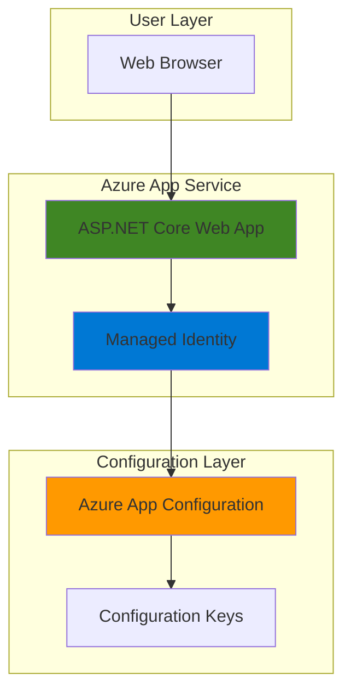

# Simple Configuration Management with App Configuration and App Service

## Problem

Development teams often hardcode application settings directly into their code or configuration files, making it difficult to change settings without redeploying applications. This creates operational overhead, increases deployment risks, and makes it challenging to maintain different configurations across development, staging, and production environments, ultimately slowing down feature releases and troubleshooting efforts.

## Solution

Azure App Configuration provides centralized configuration management that enables dynamic configuration updates without application restarts. Combined with Azure App Service's managed identity integration, applications can securely access configuration values that can be updated in real-time, eliminating the need for redeployment when configuration changes are required.

## Architecture Diagram



## Prerequisites

1. Azure account with active subscription and permissions to create Azure App Configuration and Azure App Service resources
2. Azure CLI installed and configured or access to Azure Cloud Shell
3. Basic understanding of ASP.NET Core web applications and configuration concepts
4. .NET 8.0 SDK installed locally for application development
5. Estimated cost: $0 (using free tiers for both services - App Service Free tier and App Configuration Free tier)

> **Note**: Both Azure App Service and Azure App Configuration offer free tiers suitable for development and testing scenarios, making this recipe cost-effective for learning purposes.

## Preparation

Azure App Configuration centralizes application settings and feature flags, following the Twelve-Factor App methodology of separating configuration from code. This preparation phase establishes the foundational resources needed for our configuration management solution.

```bash
# Set environment variables for Azure resources
export RESOURCE_GROUP="rg-config-demo-${RANDOM_SUFFIX}"
export LOCATION="eastus"
export SUBSCRIPTION_ID=$(az account show --query id --output tsv)

# Generate unique suffix for resource names
RANDOM_SUFFIX=$(openssl rand -hex 3)
export APP_CONFIG_NAME="appconfig-demo-${RANDOM_SUFFIX}"
export APP_SERVICE_NAME="webapp-config-demo-${RANDOM_SUFFIX}"

# Create resource group for organizing related resources
az group create \
    --name ${RESOURCE_GROUP} \
    --location ${LOCATION} \
    --tags purpose=recipe environment=demo

echo "✅ Resource group created: ${RESOURCE_GROUP}"
```

## Steps

1. **Create Azure App Configuration Store**:

   Azure App Configuration provides a managed service for centrally storing application settings with built-in security, versioning, and geo-replication capabilities. The free tier supports up to 1,000 requests per day and 10MB of storage, perfect for development scenarios.

   ```bash
   # Create App Configuration store with free tier
   az appconfig create \
       --name ${APP_CONFIG_NAME} \
       --resource-group ${RESOURCE_GROUP} \
       --location ${LOCATION} \
       --sku Free \
       --tags environment=demo purpose=recipe
   
   # Get the App Configuration endpoint for later use
   export APP_CONFIG_ENDPOINT=$(az appconfig show \
       --name ${APP_CONFIG_NAME} \
       --resource-group ${RESOURCE_GROUP} \
       --query endpoint --output tsv)
   
   echo "✅ App Configuration created: ${APP_CONFIG_NAME}"
   echo "   Endpoint: ${APP_CONFIG_ENDPOINT}"
   ```

   The App Configuration store is now ready to receive configuration key-value pairs that your applications can consume dynamically.

2. **Add Configuration Key-Values to App Configuration**:

   Configuration keys follow hierarchical naming conventions that organize settings by application area and environment. This approach enables applications to load only relevant configurations while supporting multiple deployment environments.

   ```bash
   # Add application settings to App Configuration
   az appconfig kv set \
       --name ${APP_CONFIG_NAME} \
       --key "DemoApp:Settings:Title" \
       --value "Configuration Management Demo" \
       --content-type "text/plain"
   
   az appconfig kv set \
       --name ${APP_CONFIG_NAME} \
       --key "DemoApp:Settings:BackgroundColor" \
       --value "#2563eb" \
       --content-type "text/plain"
   
   az appconfig kv set \
       --name ${APP_CONFIG_NAME} \
       --key "DemoApp:Settings:Message" \
       --value "Hello from Azure App Configuration!" \
       --content-type "text/plain"
   
   az appconfig kv set \
       --name ${APP_CONFIG_NAME} \
       --key "DemoApp:Settings:RefreshInterval" \
       --value "30" \
       --content-type "text/plain"
   
   echo "✅ Configuration key-values added to App Configuration"
   ```

   These configuration values demonstrate common application settings that can be dynamically updated without code changes or deployments.

3. **Create ASP.NET Core Web Application**:

   ASP.NET Core provides built-in configuration providers that integrate seamlessly with Azure App Configuration. This step creates a simple web application structure that will consume external configuration values.

   ```bash
   # Create a new ASP.NET Core web application
   mkdir config-demo-app && cd config-demo-app
   
   # Initialize the web application with latest .NET framework
   dotnet new webapp --framework net8.0 --name ConfigDemoApp
   cd ConfigDemoApp
   
   # Add Azure App Configuration provider package
   dotnet add package Microsoft.Extensions.Configuration.AzureAppConfiguration
   dotnet add package Azure.Identity
   
   echo "✅ ASP.NET Core application created with App Configuration support"
   ```

   The application now includes the necessary NuGet packages for Azure App Configuration integration and managed identity authentication.

4. **Configure Application to Use App Configuration**:

   The Azure App Configuration provider enables applications to retrieve configuration values with built-in caching and refresh capabilities. Managed identity authentication eliminates the need for connection strings or access keys.

   ```bash
   # Create Program.cs with App Configuration integration
   cat > Program.cs << 'EOF'
using Azure.Identity;

var builder = WebApplication.CreateBuilder(args);

// Add services to the container
builder.Services.AddRazorPages();

// Configure Azure App Configuration with managed identity
builder.Configuration.AddAzureAppConfiguration(options =>
{
    options.Connect(new Uri(Environment.GetEnvironmentVariable("APP_CONFIG_ENDPOINT")), 
                   new DefaultAzureCredential())
           .Select("DemoApp:*", LabelFilter.Null)
           .ConfigureRefresh(refreshOptions =>
           {
               refreshOptions.RegisterAll()
                           .SetRefreshInterval(TimeSpan.FromSeconds(30));
           });
});

// Add Azure App Configuration middleware
builder.Services.AddAzureAppConfiguration();

var app = builder.Build();

// Configure the HTTP request pipeline
if (!app.Environment.IsDevelopment())
{
    app.UseExceptionHandler("/Error");
    app.UseHsts();
}

app.UseHttpsRedirection();
app.UseStaticFiles();
app.UseRouting();

// Use Azure App Configuration middleware for dynamic refresh
app.UseAzureAppConfiguration();

app.UseAuthorization();
app.MapRazorPages();

app.Run();
EOF
   
   echo "✅ Application configured to use Azure App Configuration"
   ```

   This configuration enables the application to automatically refresh configuration values every 30 seconds without requiring application restarts.

5. **Create Web Page to Display Configuration Values**:

   A simple web interface demonstrates how configuration values are dynamically loaded from Azure App Configuration and can be updated in real-time without code deployment.

   ```bash
   # Create updated Index page to display configuration values
   cat > Pages/Index.cshtml << 'EOF'
@page
@model IndexModel
@{
    ViewData["Title"] = "Configuration Demo";
}

<div style="background-color: @Configuration["DemoApp:Settings:BackgroundColor"]; 
            color: white; padding: 40px; border-radius: 10px; text-align: center;">
    <h1>@Configuration["DemoApp:Settings:Title"]</h1>
    <p class="lead">@Configuration["DemoApp:Settings:Message"]</p>
    <hr style="border-color: white;">
    <p>Configuration loaded from Azure App Configuration</p>
    <p>Refresh Interval: @Configuration["DemoApp:Settings:RefreshInterval"] seconds</p>
    <p>Last Updated: @DateTime.Now.ToString("yyyy-MM-dd HH:mm:ss UTC")</p>
</div>

<div style="margin-top: 20px; padding: 20px;">
    <h3>Dynamic Configuration Management</h3>
    <p>This application demonstrates how Azure App Configuration enables:</p>
    <ul>
        <li>Centralized configuration management across environments</li>
        <li>Dynamic updates without application restarts</li>
        <li>Secure access using managed identity</li>
        <li>Real-time configuration refresh capabilities</li>
    </ul>
</div>
EOF
   
   echo "✅ Web page created to display configuration values"
   ```

   The page dynamically displays configuration values and updates automatically when the refresh interval expires.

6. **Create Azure App Service and Deploy Application**:

   Azure App Service provides a fully managed platform for hosting web applications with automatic scaling, security patching, and integrated DevOps capabilities. The free tier supports basic web applications for development and testing scenarios.

   ```bash
   # Create App Service plan using free tier
   az appservice plan create \
       --name "plan-${APP_SERVICE_NAME}" \
       --resource-group ${RESOURCE_GROUP} \
       --location ${LOCATION} \
       --sku FREE \
       --is-linux
   
   # Create Web App with .NET 8.0 runtime
   az webapp create \
       --name ${APP_SERVICE_NAME} \
       --resource-group ${RESOURCE_GROUP} \
       --plan "plan-${APP_SERVICE_NAME}" \
       --runtime "DOTNET:8.0" \
       --tags environment=demo purpose=recipe

   # Configure application settings
   az webapp config appsettings set \
       --name ${APP_SERVICE_NAME} \
       --resource-group ${RESOURCE_GROUP} \
       --settings APP_CONFIG_ENDPOINT=${APP_CONFIG_ENDPOINT}
   
   echo "✅ Azure App Service created: ${APP_SERVICE_NAME}"
   ```

   The App Service is configured with the App Configuration endpoint as an environment variable for the application to use.

7. **Enable Managed Identity and Grant Permissions**:

   Managed identity provides secure, password-less authentication to Azure services without storing credentials in code or configuration. This eliminates security risks associated with connection strings and access keys.

   ```bash
   # Enable system-assigned managed identity for the web app
   az webapp identity assign \
       --name ${APP_SERVICE_NAME} \
       --resource-group ${RESOURCE_GROUP}
   
   # Get the managed identity principal ID
   PRINCIPAL_ID=$(az webapp identity show \
       --name ${APP_SERVICE_NAME} \
       --resource-group ${RESOURCE_GROUP} \
       --query principalId --output tsv)
   
   # Grant App Configuration Data Reader role to the managed identity
   az role assignment create \
       --assignee ${PRINCIPAL_ID} \
       --role "App Configuration Data Reader" \
       --scope "/subscriptions/${SUBSCRIPTION_ID}/resourceGroups/${RESOURCE_GROUP}/providers/Microsoft.AppConfiguration/configurationStores/${APP_CONFIG_NAME}"
   
   echo "✅ Managed identity enabled and permissions granted"
   echo "   Principal ID: ${PRINCIPAL_ID}"
   ```

   The web application can now securely access App Configuration using its managed identity without requiring explicit credentials.

8. **Deploy Application to App Service**:

   Azure App Service supports multiple deployment methods including local Git, GitHub Actions, and ZIP deployment. This step uses ZIP deployment for simplicity and immediate results.

   ```bash
   # Build and publish the application
   dotnet publish --configuration Release --output ./publish
   
   # Create deployment ZIP file
   cd publish
   zip -r ../deploy.zip .
   cd ..
   
   # Deploy to App Service using ZIP deployment
   az webapp deployment source config-zip \
       --name ${APP_SERVICE_NAME} \
       --resource-group ${RESOURCE_GROUP} \
       --src deploy.zip
   
   # Get the application URL
   export APP_URL="https://${APP_SERVICE_NAME}.azurewebsites.net"
   
   echo "✅ Application deployed successfully"
   echo "   Application URL: ${APP_URL}"
   ```

   The application is now running on App Service and accessible via the generated URL, ready to demonstrate dynamic configuration management.

## Validation & Testing

1. **Verify Application is Running**:

   ```bash
   # Check App Service deployment status
   az webapp show \
       --name ${APP_SERVICE_NAME} \
       --resource-group ${RESOURCE_GROUP} \
       --query "state" --output tsv
   
   # Test HTTP connectivity to the application
   curl -I ${APP_URL}
   ```

   Expected output: HTTP 200 OK response indicating successful deployment and accessibility.

2. **Test Dynamic Configuration Updates**:

   ```bash
   # Update configuration value in App Configuration
   az appconfig kv set \
       --name ${APP_CONFIG_NAME} \
       --key "DemoApp:Settings:Message" \
       --value "Configuration updated dynamically - no restart required!"
   
   az appconfig kv set \
       --name ${APP_CONFIG_NAME} \
       --key "DemoApp:Settings:BackgroundColor" \
       --value "#dc2626"
   
   echo "✅ Configuration values updated"
   echo "   Visit ${APP_URL} and refresh after 30 seconds to see changes"
   ```

   The application will automatically pick up these changes within 30 seconds without requiring a restart or redeployment.

3. **Verify Managed Identity Authentication**:

   ```bash
   # Check App Configuration access logs (if enabled)
   az appconfig revision list \
       --name ${APP_CONFIG_NAME} \
       --top 5 \
       --query "[].{Key:key,LastModified:lastModified}" --output table
   ```

   This confirms that configuration changes are being tracked and the application can successfully authenticate using managed identity.

## Cleanup

1. **Remove Azure App Service resources**:

   ```bash
   # Delete the Web App and App Service Plan
   az webapp delete \
       --name ${APP_SERVICE_NAME} \
       --resource-group ${RESOURCE_GROUP}
   
   az appservice plan delete \
       --name "plan-${APP_SERVICE_NAME}" \
       --resource-group ${RESOURCE_GROUP} \
       --yes
   
   echo "✅ App Service resources deleted"
   ```

2. **Remove Azure App Configuration store**:

   ```bash
   # Delete the App Configuration store
   az appconfig delete \
       --name ${APP_CONFIG_NAME} \
       --resource-group ${RESOURCE_GROUP} \
       --yes
   
   echo "✅ App Configuration store deleted"
   ```

3. **Remove resource group and local files**:

   ```bash
   # Delete the entire resource group
   az group delete \
       --name ${RESOURCE_GROUP} \
       --yes \
       --no-wait
   
   # Clean up local application files
   cd .. && rm -rf config-demo-app
   
   # Unset environment variables
   unset RESOURCE_GROUP LOCATION APP_CONFIG_NAME APP_SERVICE_NAME
   unset APP_CONFIG_ENDPOINT PRINCIPAL_ID APP_URL RANDOM_SUFFIX
   
   echo "✅ All resources and local files cleaned up"
   ```

## Discussion

Azure App Configuration represents a fundamental shift from traditional configuration management approaches by implementing the [Twelve-Factor App methodology](https://12factor.net/), which advocates for strict separation of configuration from code. This separation enables applications to be deployed across multiple environments without code changes, significantly reducing deployment risks and operational overhead.

The integration between Azure App Configuration and Azure App Service through managed identity demonstrates Azure's commitment to secure-by-default architectures. By eliminating the need for connection strings or access keys, managed identity reduces the attack surface and simplifies credential management. The [Azure App Configuration provider libraries](https://learn.microsoft.com/en-us/azure/azure-app-configuration/quickstart-aspnet-core-app) offer sophisticated features including configuration caching, automatic refresh, and failure resilience that ensure applications remain responsive even during configuration service outages.

Dynamic configuration refresh capabilities enable real-time operational adjustments without application downtime. This pattern is particularly valuable for feature toggles, performance tuning, and incident response scenarios where immediate configuration changes can resolve issues or enable new functionality. The 30-second refresh interval strikes a balance between responsiveness and performance, though this can be adjusted based on specific requirements. Organizations should consider implementing [sentinel key monitoring](https://learn.microsoft.com/en-us/azure/azure-app-configuration/howto-best-practices#configuration-refresh) for scenarios requiring coordinated updates across multiple configuration values.

The solution demonstrates Azure Well-Architected Framework principles across multiple pillars. Operational excellence is achieved through centralized configuration management and automated refresh mechanisms. Security is enhanced through managed identity authentication and role-based access control. Reliability is supported by the service's built-in redundancy and caching capabilities. Performance efficiency comes from the provider's intelligent caching and minimal network overhead. Cost optimization is realized through the free tier options and pay-per-use pricing model for higher tiers.

> **Tip**: For production workloads, consider enabling [geo-replication](https://learn.microsoft.com/en-us/azure/azure-app-configuration/howto-geo-replication) to distribute configuration data across multiple regions, improving availability and reducing latency for globally distributed applications.

## Challenge

Extend this configuration management solution by implementing these enhancements:

1. **Feature Flag Management**: Implement Azure App Configuration's feature flag capabilities to enable runtime feature toggles and A/B testing scenarios without code deployments.

2. **Environment-Specific Configurations**: Use App Configuration labels to manage different configuration sets for development, staging, and production environments while maintaining a single configuration store.

3. **Integration with Azure Key Vault**: Store sensitive configuration values like connection strings and API keys in Azure Key Vault and reference them through App Configuration for enhanced security.

4. **Configuration Validation and Rollback**: Implement configuration validation rules and automated rollback mechanisms to prevent invalid configurations from affecting application stability.

5. **Multi-Application Configuration Sharing**: Extend the solution to support shared configuration values across multiple applications while maintaining application-specific settings, demonstrating enterprise-scale configuration governance.

## Infrastructure Code

### Available Infrastructure as Code:

- [Infrastructure Code Overview](code/README.md) - Detailed description of all infrastructure components
- [Bicep](code/bicep/) - Azure Bicep templates
- [Bash CLI Scripts](code/scripts/) - Example bash scripts using Azure CLI commands to deploy infrastructure
- [Terraform](code/terraform/) - Terraform configuration files