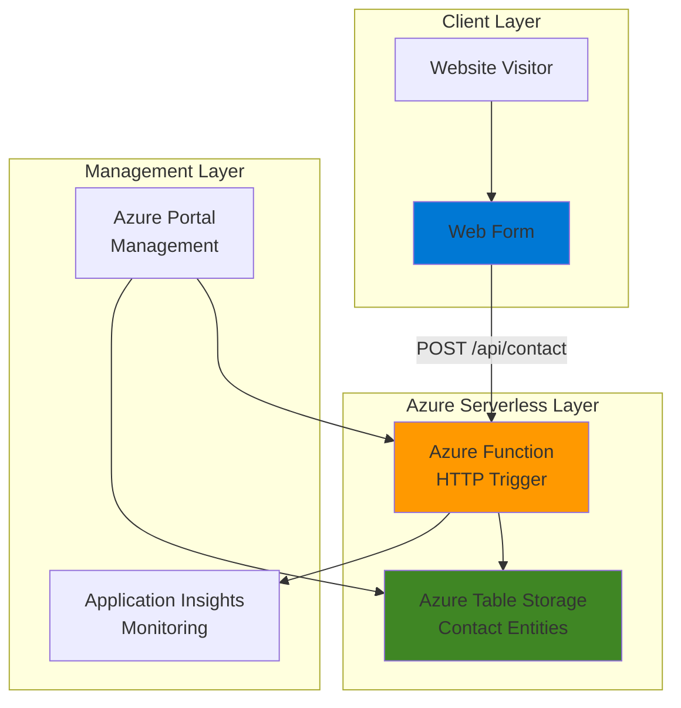

# Simple Contact Form with Functions and Table Storage

## Problem

Small businesses and organizations need a simple, cost-effective way to collect contact form submissions from their websites without managing servers or databases. Traditional contact forms require dedicated backend infrastructure, ongoing maintenance, and can struggle with unpredictable traffic spikes during marketing campaigns. Companies want a solution that scales automatically, costs only what they use, and integrates seamlessly with existing web properties.

## Solution

Create a serverless contact form processing system using Azure Functions to handle HTTP requests and Azure Table Storage for persistent data storage. Azure Functions provides event-driven, serverless compute that automatically scales based on demand, while Table Storage offers low-cost NoSQL storage for structured contact data. This serverless architecture eliminates infrastructure management and provides built-in scalability for varying form submission volumes.

## Architecture Diagram



## Prerequisites

1. Azure account with subscription and resource creation permissions
2. Azure CLI installed and configured (version 2.57.0 or later)
3. Basic understanding of HTTP APIs and JSON data formats
4. Text editor or IDE for function code development
5. Estimated cost: $0.01-$2.00 per month depending on usage (Functions consumption plan + Table Storage)

> **Note**: This recipe uses Azure's consumption-based pricing model, making it extremely cost-effective for low to moderate traffic websites.

## Preparation

```bash
# Generate unique suffix for resource names first
RANDOM_SUFFIX=$(openssl rand -hex 3)

# Set environment variables for Azure resources
export RESOURCE_GROUP="rg-recipe-${RANDOM_SUFFIX}"
export LOCATION="eastus"
export SUBSCRIPTION_ID=$(az account show --query id --output tsv)

# Set resource names with unique identifiers
export STORAGE_ACCOUNT="stcontact${RANDOM_SUFFIX}"
export FUNCTION_APP="func-contact-${RANDOM_SUFFIX}"

# Create resource group
az group create \
    --name ${RESOURCE_GROUP} \
    --location ${LOCATION} \
    --tags purpose=recipe environment=demo

echo "✅ Resource group created: ${RESOURCE_GROUP}"

# Create storage account for both function app and table storage
az storage account create \
    --name ${STORAGE_ACCOUNT} \
    --resource-group ${RESOURCE_GROUP} \
    --location ${LOCATION} \
    --sku Standard_LRS \
    --kind StorageV2

echo "✅ Storage account created: ${STORAGE_ACCOUNT}"
```

## Steps

1. **Create Function App for Serverless Processing**:

   Azure Functions provides a serverless compute platform that automatically handles scaling, load balancing, and infrastructure management. The consumption plan ensures you only pay for actual function executions, making it ideal for contact forms with variable traffic patterns.

   ```bash
   # Create Function App with consumption plan
   az functionapp create \
       --name ${FUNCTION_APP} \
       --resource-group ${RESOURCE_GROUP} \
       --storage-account ${STORAGE_ACCOUNT} \
       --consumption-plan-location ${LOCATION} \
       --runtime node \
       --runtime-version 20 \
       --functions-version 4
   
   echo "✅ Function App created: ${FUNCTION_APP}"
   ```

   The Function App is now ready to host serverless functions with automatic scaling capabilities. Azure manages all infrastructure concerns, allowing you to focus solely on business logic.

2. **Configure Table Storage for Contact Data**:

   Azure Table Storage provides a NoSQL key-value store that's perfect for storing contact form submissions. Its schemaless design allows flexibility in contact data structure while maintaining high performance and low cost.

   ```bash
   # Get storage account connection string
   STORAGE_CONNECTION=$(az storage account show-connection-string \
       --name ${STORAGE_ACCOUNT} \
       --resource-group ${RESOURCE_GROUP} \
       --query connectionString \
       --output tsv)
   
   # Create table for contact submissions
   az storage table create \
       --name "contacts" \
       --connection-string "${STORAGE_CONNECTION}"
   
   echo "✅ Table Storage configured for contact data"
   ```

   The table storage is configured with a simple schema where each contact submission becomes an entity with a partition key and row key for efficient querying and management.

3. **Deploy HTTP Trigger Function Code**:

   HTTP trigger functions in Azure Functions respond to web requests and can process form data, validate inputs, and store results. This function will handle POST requests containing contact form data and store them in Table Storage.

   ```bash
   # Create function directory structure
   mkdir -p contact-function
   cd contact-function
   
   # Create function.json configuration
   cat > function.json << 'EOF'
   {
     "bindings": [
       {
         "authLevel": "function",
         "type": "httpTrigger",
         "direction": "in",
         "name": "req",
         "methods": ["post", "options"],
         "route": "contact"
       },
       {
         "type": "http",
         "direction": "out",
         "name": "res"
       },
       {
         "type": "table",
         "direction": "out",
         "name": "tableBinding",
         "tableName": "contacts",
         "connection": "AzureWebJobsStorage"
       }
     ]
   }
   EOF
   
   echo "✅ Function configuration created"
   ```

   This configuration defines an HTTP trigger that accepts POST requests and includes a Table Storage output binding for direct data insertion without additional SDK calls.

4. **Implement Contact Processing Logic**:

   ```bash
   # Create the main function code
   cat > index.js << 'EOF'
   module.exports = async function (context, req) {
       // Enable CORS for web requests
       context.res.headers = {
           'Access-Control-Allow-Origin': '*',
           'Access-Control-Allow-Methods': 'POST, OPTIONS',
           'Access-Control-Allow-Headers': 'Content-Type'
       };
   
       // Handle preflight OPTIONS request
       if (req.method === 'OPTIONS') {
           context.res = {
               status: 200,
               headers: context.res.headers
           };
           return;
       }
   
       try {
           // Validate required fields
           const { name, email, message } = req.body || {};
           
           if (!name || !email || !message) {
               context.res = {
                   status: 400,
                   headers: context.res.headers,
                   body: { 
                       error: "Missing required fields: name, email, message" 
                   }
               };
               return;
           }
   
           // Basic email validation
           const emailRegex = /^[^\s@]+@[^\s@]+\.[^\s@]+$/;
           if (!emailRegex.test(email)) {
               context.res = {
                   status: 400,
                   headers: context.res.headers,
                   body: { error: "Invalid email format" }
               };
               return;
           }
   
           // Create contact entity for Table Storage
           const contactEntity = {
               PartitionKey: "contacts",
               RowKey: `${Date.now()}-${Math.random().toString(36).substr(2, 9)}`,
               Name: name.substring(0, 100), // Limit field length
               Email: email.substring(0, 100),
               Message: message.substring(0, 1000),
               SubmittedAt: new Date().toISOString(),
               IPAddress: req.headers['x-forwarded-for'] || 'unknown'
           };
   
           // Store in Table Storage using output binding
           context.bindings.tableBinding = contactEntity;
   
           // Return success response
           context.res = {
               status: 200,
               headers: context.res.headers,
               body: { 
                   message: "Contact form submitted successfully",
                   id: contactEntity.RowKey
               }
           };
   
       } catch (error) {
           context.log.error('Function error:', error);
           context.res = {
               status: 500,
               headers: context.res.headers,
               body: { error: "Internal server error" }
           };
       }
   };
   EOF
   
   echo "✅ Function code implemented with validation and CORS support"
   ```

   This function implements proper input validation, CORS headers for web integration, and error handling while maintaining security best practices.

5. **Deploy Function to Azure**:

   ```bash
   # Create deployment package
   zip -r ../contact-function.zip .
   cd ..
   
   # Deploy function code to Azure
   az functionapp deployment source config-zip \
       --resource-group ${RESOURCE_GROUP} \
       --name ${FUNCTION_APP} \
       --src contact-function.zip
   
   # Wait for deployment to complete
   sleep 30
   
   echo "✅ Function deployed successfully"
   ```

   The function is now deployed and ready to process contact form submissions with automatic scaling and built-in monitoring capabilities.

6. **Configure Application Settings**:

   ```bash
   # Set storage connection string for table binding
   az functionapp config appsettings set \
       --name ${FUNCTION_APP} \
       --resource-group ${RESOURCE_GROUP} \
       --settings "AzureWebJobsStorage=${STORAGE_CONNECTION}"
   
   # Get function URL for integration
   FUNCTION_URL=$(az functionapp function show \
       --resource-group ${RESOURCE_GROUP} \
       --name ${FUNCTION_APP} \
       --function-name contact-function \
       --query "invokeUrlTemplate" \
       --output tsv)
   
   echo "✅ Function URL: ${FUNCTION_URL}"
   echo "✅ Application settings configured"
   ```

   The function is now fully configured with proper storage connectivity and ready for web integration.

## Validation & Testing

1. **Verify Function App deployment**:

   ```bash
   # Check Function App status
   az functionapp show \
       --name ${FUNCTION_APP} \
       --resource-group ${RESOURCE_GROUP} \
       --query "state" \
       --output tsv
   ```

   Expected output: `Running`

2. **Test contact form submission**:

   ```bash
   # Get function key for testing
   FUNCTION_KEY=$(az functionapp keys list \
       --name ${FUNCTION_APP} \
       --resource-group ${RESOURCE_GROUP} \
       --query "functionKeys.default" \
       --output tsv)
   
   # Test with valid contact data
   curl -X POST "${FUNCTION_URL}?code=${FUNCTION_KEY}" \
       -H "Content-Type: application/json" \
       -d '{
           "name": "John Doe",
           "email": "john@example.com", 
           "message": "Hello from the contact form!"
       }'
   ```

   Expected output: JSON response with success message and unique ID.

3. **Verify data storage in Table Storage**:

   ```bash
   # Query stored contact submissions
   az storage entity query \
       --table-name "contacts" \
       --connection-string "${STORAGE_CONNECTION}" \
       --select "Name,Email,SubmittedAt"
   ```

   Expected output: List of contact entities showing submitted form data.

4. **Test CORS functionality**:

   ```bash
   # Test OPTIONS preflight request
   curl -X OPTIONS "${FUNCTION_URL}?code=${FUNCTION_KEY}" \
       -H "Access-Control-Request-Method: POST" \
       -H "Access-Control-Request-Headers: Content-Type"
   ```

   Expected output: 200 status with CORS headers enabled.

## Cleanup

1. **Remove Function App and associated resources**:

   ```bash
   # Delete Function App
   az functionapp delete \
       --name ${FUNCTION_APP} \
       --resource-group ${RESOURCE_GROUP}
   
   echo "✅ Function App deleted"
   ```

2. **Remove Storage Account and Table data**:

   ```bash
   # Delete Storage Account (includes Table Storage)
   az storage account delete \
       --name ${STORAGE_ACCOUNT} \
       --resource-group ${RESOURCE_GROUP} \
       --yes
   
   echo "✅ Storage Account deleted"
   ```

3. **Delete Resource Group**:

   ```bash
   # Delete resource group and all contained resources
   az group delete \
       --name ${RESOURCE_GROUP} \
       --yes \
       --no-wait
   
   echo "✅ Resource group deletion initiated: ${RESOURCE_GROUP}"
   echo "Note: Deletion may take several minutes to complete"
   ```

4. **Clean up local files**:

   ```bash
   # Remove local deployment files
   rm -rf contact-function contact-function.zip
   
   echo "✅ Local files cleaned up"
   ```

## Discussion

This serverless contact form solution demonstrates the power of Azure's event-driven architecture for simple web applications. Azure Functions provides automatic scaling, built-in security, and pay-per-use pricing that makes it ideal for form processing workloads with unpredictable traffic patterns. The HTTP trigger responds instantly to form submissions while the consumption plan ensures cost efficiency during low-traffic periods, following the [Azure Well-Architected Framework](https://docs.microsoft.com/en-us/azure/architecture/framework/) principles for operational excellence and cost optimization.

Azure Table Storage complements this architecture by providing a NoSQL data store that scales seamlessly with your application needs. Unlike traditional relational databases, Table Storage uses a partition key and row key system that enables high-performance queries and eliminates the need for complex schema management. The schemaless design allows you to easily add new form fields without database migrations, making it perfect for evolving contact forms as documented in the [Azure Table Storage design guide](https://docs.microsoft.com/en-us/azure/storage/tables/table-storage-design-guide).

The implementation follows Azure security best practices by incorporating proper error handling, input validation, and CORS support for web integration. Function key authentication provides a balance between security and simplicity, while Azure's built-in monitoring through Application Insights enables comprehensive observability. The solution automatically handles concurrent requests and provides detailed logging for troubleshooting and performance optimization as outlined in the [Azure Functions best practices](https://docs.microsoft.com/en-us/azure/azure-functions/functions-best-practices).

For production deployments, consider implementing additional security measures such as rate limiting through Azure API Management, input sanitization for XSS protection, and notification systems using Azure Logic Apps or Communication Services. The current implementation provides a solid foundation that can be extended with features like email notifications, spam filtering using Azure Cognitive Services, and administrative dashboards with Azure Static Web Apps as business requirements evolve.

> **Tip**: Use Azure Monitor and Application Insights to track form submission patterns and optimize performance based on actual usage metrics. The built-in logging capabilities provide valuable insights into user behavior and system performance.

## Challenge

Extend this solution by implementing these enhancements:

1. **Email Notifications**: Add Azure Communication Services or Logic Apps integration to send email notifications when new contact forms are submitted, including both confirmation emails to users and alerts to administrators.

2. **Form Validation Enhancement**: Implement advanced validation using Azure Cognitive Services for spam detection, profanity filtering, and sentiment analysis of submitted messages.

3. **Administrative Dashboard**: Create a separate Azure Static Web Apps frontend that queries Table Storage to display submitted contacts with search, filtering, and export capabilities for business users.

4. **Rate Limiting and Security**: Add Azure API Management or custom middleware to implement rate limiting, IP blocking, and advanced authentication to prevent abuse and ensure system reliability.

5. **Multi-language Support**: Integrate Azure Translator services to automatically detect and translate contact form submissions, enabling global customer support workflows.

## Infrastructure Code

### Available Infrastructure as Code:

- [Infrastructure Code Overview](code/README.md) - Detailed description of all infrastructure components
- [Bicep](code/bicep/) - Azure Bicep templates
- [Bash CLI Scripts](code/scripts/) - Example bash scripts using Azure CLI commands to deploy infrastructure
- [Terraform](code/terraform/) - Terraform configuration files