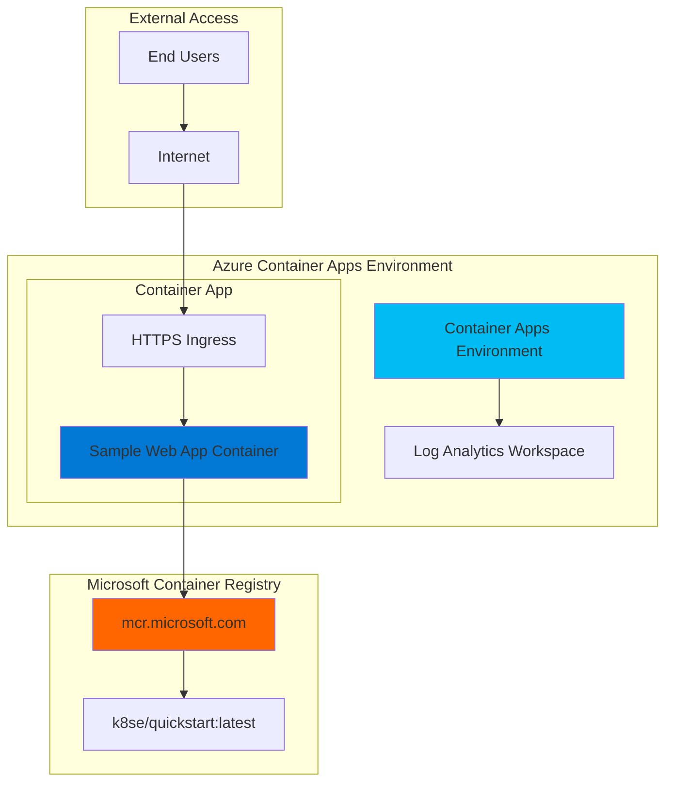

# Simple Container App Deployment with Container Apps

## Problem

New developers often struggle with complex container orchestration platforms like Kubernetes when trying to deploy their first containerized application. Traditional container platforms require deep knowledge of networking, load balancers, and cluster management, creating barriers for teams who want to focus on application development rather than infrastructure complexity.

## Solution

Azure Container Apps provides a serverless container platform that eliminates infrastructure management while offering automatic scaling, built-in load balancing, and seamless container deployment. This solution demonstrates deploying a simple web application using a pre-built container image, showcasing the simplicity of serverless container deployment without requiring Docker expertise or complex orchestration knowledge.

## Architecture Diagram



## Prerequisites

1. Azure account with an active subscription
2. Azure CLI installed and configured (version 2.28.0 or higher)
3. Basic understanding of containerized applications  
4. Docker CLI installed locally (for optional custom image scenarios)
5. Estimated cost: $0.10-$2.00 for resources created in this tutorial

> **Note**: Azure Container Apps follows a consumption-based pricing model where you pay only for the vCPU and memory your containerized applications consume. The first 180,000 vCPU-seconds and 360,000 GiB-seconds are free each month.

## Preparation

Azure Container Apps requires a Container Apps environment that provides secure boundaries around groups of container apps. This environment acts as a secure boundary where your container apps can communicate with each other and share compute resources.

```bash
# Set environment variables for Azure resources
export RESOURCE_GROUP="rg-containerapp-demo-${RANDOM_SUFFIX}"
export LOCATION="eastus"
export SUBSCRIPTION_ID=$(az account show --query id --output tsv)

# Generate unique suffix for resource names
RANDOM_SUFFIX=$(openssl rand -hex 3)

# Set Container Apps specific variables
export CONTAINERAPPS_ENVIRONMENT="env-demo-${RANDOM_SUFFIX}"
export CONTAINER_APP_NAME="hello-app-${RANDOM_SUFFIX}"

# Create resource group for organizing all resources
az group create \
    --name ${RESOURCE_GROUP} \
    --location ${LOCATION} \
    --tags purpose=recipe environment=demo

echo "✅ Resource group created: ${RESOURCE_GROUP}"
```

## Steps

1. **Register the Container Apps resource provider**:

   Azure resource providers enable specific Azure services in your subscription. The Microsoft.App provider must be registered before creating Container Apps resources. This one-time registration enables Container Apps functionality across your subscription.

   ```bash
   # Register the Container Apps resource provider
   az provider register --namespace Microsoft.App
   
   # Register the Log Analytics provider for monitoring
   az provider register --namespace Microsoft.OperationalInsights
   
   # Verify registration status
   az provider show --namespace Microsoft.App \
       --query "registrationState"
   
   echo "✅ Resource providers registered successfully"
   ```

   Resource provider registration typically completes within 1-2 minutes and enables Container Apps services for your subscription.

2. **Install the Container Apps extension for Azure CLI**:

   The Azure CLI Container Apps extension provides commands specifically designed for managing Container Apps environments and applications. This extension includes the latest features and improvements for serverless container management.

   ```bash
   # Install the Container Apps CLI extension
   az extension add --name containerapp --upgrade
   
   # Verify the extension installation
   az containerapp --help | head -5
   
   echo "✅ Container Apps CLI extension installed"
   ```

   The extension provides commands for creating environments, deploying applications, and managing container app lifecycles.

3. **Create the Container Apps environment**:

   A Container Apps environment provides secure boundaries and shared resources for your container applications. It includes built-in observability, networking, and security features while abstracting complex Kubernetes infrastructure management.

   ```bash
   # Create the Container Apps environment
   az containerapp env create \
       --name ${CONTAINERAPPS_ENVIRONMENT} \
       --resource-group ${RESOURCE_GROUP} \
       --location ${LOCATION} \
       --tags purpose=demo environment=learning
   
   # Verify environment creation
   az containerapp env show \
       --name ${CONTAINERAPPS_ENVIRONMENT} \
       --resource-group ${RESOURCE_GROUP} \
       --query "properties.provisioningState"
   
   echo "✅ Container Apps environment created: ${CONTAINERAPPS_ENVIRONMENT}"
   ```

   The environment includes Log Analytics workspace for monitoring, virtual network integration, and managed certificate capabilities for secure HTTPS endpoints.

4. **Deploy the container application**:

   Azure Container Apps can deploy container images from any public or private registry. Microsoft provides sample container images that demonstrate common web application patterns without requiring custom Docker builds or complex configurations.

   ```bash
   # Deploy the hello-world container application
   az containerapp create \
       --name ${CONTAINER_APP_NAME} \
       --resource-group ${RESOURCE_GROUP} \
       --environment ${CONTAINERAPPS_ENVIRONMENT} \
       --image mcr.microsoft.com/k8se/quickstart:latest \
       --target-port 80 \
       --ingress external \
       --query "properties.configuration.ingress.fqdn"
   
   # Store the application URL for testing
   APP_URL=$(az containerapp show \
       --name ${CONTAINER_APP_NAME} \
       --resource-group ${RESOURCE_GROUP} \
       --query "properties.configuration.ingress.fqdn" \
       --output tsv)
   
   echo "✅ Container app deployed successfully"
   echo "Application URL: https://${APP_URL}"
   ```

   The deployment automatically configures HTTPS ingress, load balancing, and health monitoring for the containerized application.

5. **Configure scaling and resource allocation**:

   Container Apps provides automatic scaling based on HTTP traffic, CPU usage, memory consumption, or custom metrics. This configuration demonstrates setting resource limits and scaling parameters for optimal performance and cost management.

   ```bash
   # Update the container app with scaling configuration
   az containerapp update \
       --name ${CONTAINER_APP_NAME} \
       --resource-group ${RESOURCE_GROUP} \
       --min-replicas 0 \
       --max-replicas 5 \
       --cpu 0.25 \
       --memory 0.5Gi
   
   # View current scaling configuration
   az containerapp show \
       --name ${CONTAINER_APP_NAME} \
       --resource-group ${RESOURCE_GROUP} \
       --query "properties.template.scale"
   
   echo "✅ Scaling configuration updated"
   ```

   This configuration enables scale-to-zero capabilities during periods of no traffic, minimizing costs while maintaining instant availability when requests arrive.

## Validation & Testing

1. **Verify container app deployment status**:

   ```bash
   # Check the deployment status
   az containerapp show \
       --name ${CONTAINER_APP_NAME} \
       --resource-group ${RESOURCE_GROUP} \
       --query "properties.provisioningState"
   ```

   Expected output: `"Succeeded"`

2. **Test the web application endpoint**:

   ```bash
   # Test the HTTPS endpoint
   curl -I https://${APP_URL}
   
   # Display the application URL for browser testing
   echo "Test your application: https://${APP_URL}"
   ```

   Expected output: HTTP/2 200 status code with successful response headers.

3. **Verify automatic HTTPS certificate**:

   ```bash
   # Check ingress configuration details
   az containerapp ingress show \
       --name ${CONTAINER_APP_NAME} \
       --resource-group ${RESOURCE_GROUP}
   ```

   The output should show external ingress enabled with automatic HTTPS certificate provisioning.

## Cleanup

1. **Remove the container application**:

   ```bash
   # Delete the container app
   az containerapp delete \
       --name ${CONTAINER_APP_NAME} \
       --resource-group ${RESOURCE_GROUP} \
       --yes
   
   echo "✅ Container app deleted: ${CONTAINER_APP_NAME}"
   ```

2. **Remove the Container Apps environment**:

   ```bash
   # Delete the Container Apps environment
   az containerapp env delete \
       --name ${CONTAINERAPPS_ENVIRONMENT} \
       --resource-group ${RESOURCE_GROUP} \
       --yes
   
   echo "✅ Container Apps environment deleted: ${CONTAINERAPPS_ENVIRONMENT}"
   ```

3. **Remove the resource group and all resources**:

   ```bash
   # Delete resource group and all contained resources
   az group delete \
       --name ${RESOURCE_GROUP} \
       --yes \
       --no-wait
   
   echo "✅ Resource group deletion initiated: ${RESOURCE_GROUP}"
   echo "Note: Deletion may take several minutes to complete"
   
   # Verify deletion (optional)
   az group exists --name ${RESOURCE_GROUP}
   ```

## Discussion

Azure Container Apps represents a significant evolution in serverless container platforms, combining the flexibility of containerized applications with the simplicity of platform-as-a-service offerings. Unlike traditional container orchestration platforms that require extensive infrastructure knowledge, Container Apps abstracts complex networking, scaling, and security configurations while maintaining enterprise-grade capabilities. This approach aligns with the [Azure Well-Architected Framework](https://docs.microsoft.com/en-us/azure/architecture/framework/) principles by emphasizing operational excellence through automation and performance efficiency through managed scaling.

The serverless nature of Container Apps provides automatic scaling from zero to hundreds of instances based on demand, ensuring cost efficiency for variable workloads. The platform automatically handles SSL certificate provisioning, load balancing, and health monitoring, reducing operational overhead significantly. The consumption-based pricing model charges only for actual resource usage, making it particularly attractive for development environments and applications with unpredictable traffic patterns.

Container Apps integrates seamlessly with Azure's ecosystem, including Azure Container Registry for private image storage, Azure Active Directory for authentication, and Azure Monitor for comprehensive observability. The platform supports Dapr (Distributed Application Runtime) for building resilient microservices and provides built-in support for blue-green deployments and traffic splitting for safe application updates. For enterprises adopting cloud-native architectures, Container Apps provides a bridge between traditional application deployment and modern container orchestration, enabling teams to leverage containerization benefits without requiring extensive Kubernetes expertise.

Container Apps uses the same underlying infrastructure as Azure Kubernetes Service (AKS) but provides a managed experience that eliminates cluster management complexity. The platform automatically provisions and manages the Kubernetes infrastructure, handles certificate management through integration with Let's Encrypt, and provides built-in ingress controllers with automatic HTTPS termination. This managed approach significantly reduces the learning curve for teams new to containerization while maintaining the power and flexibility of Kubernetes-based deployments.

> **Tip**: Use Azure Container Registry with managed identity authentication to enhance security and eliminate credential management when deploying private container images to Container Apps.

## Challenge

Extend this solution by implementing these enhancements:

1. **Deploy a custom application**: Create a simple Node.js or Python web application, containerize it with Docker, push it to Azure Container Registry, and deploy it using Container Apps with environment variables and secrets management.

2. **Implement blue-green deployment**: Configure traffic splitting between two revisions of your application to demonstrate zero-downtime deployment strategies using Container Apps revision management features.

3. **Add monitoring and alerting**: Integrate Azure Application Insights and Azure Monitor to track application performance, set up custom metrics, and configure alerts for scaling events and application errors.

4. **Configure Dapr integration**: Enable Dapr for state management and service-to-service communication, then deploy a multi-container microservices architecture using Container Apps with Dapr bindings and components.

5. **Implement advanced scaling**: Configure event-driven scaling using Azure Service Bus or Azure Event Hubs as triggers, demonstrating KEDA-based scaling beyond HTTP traffic patterns for background processing scenarios.

## Infrastructure Code

*Infrastructure code will be generated after recipe approval.*