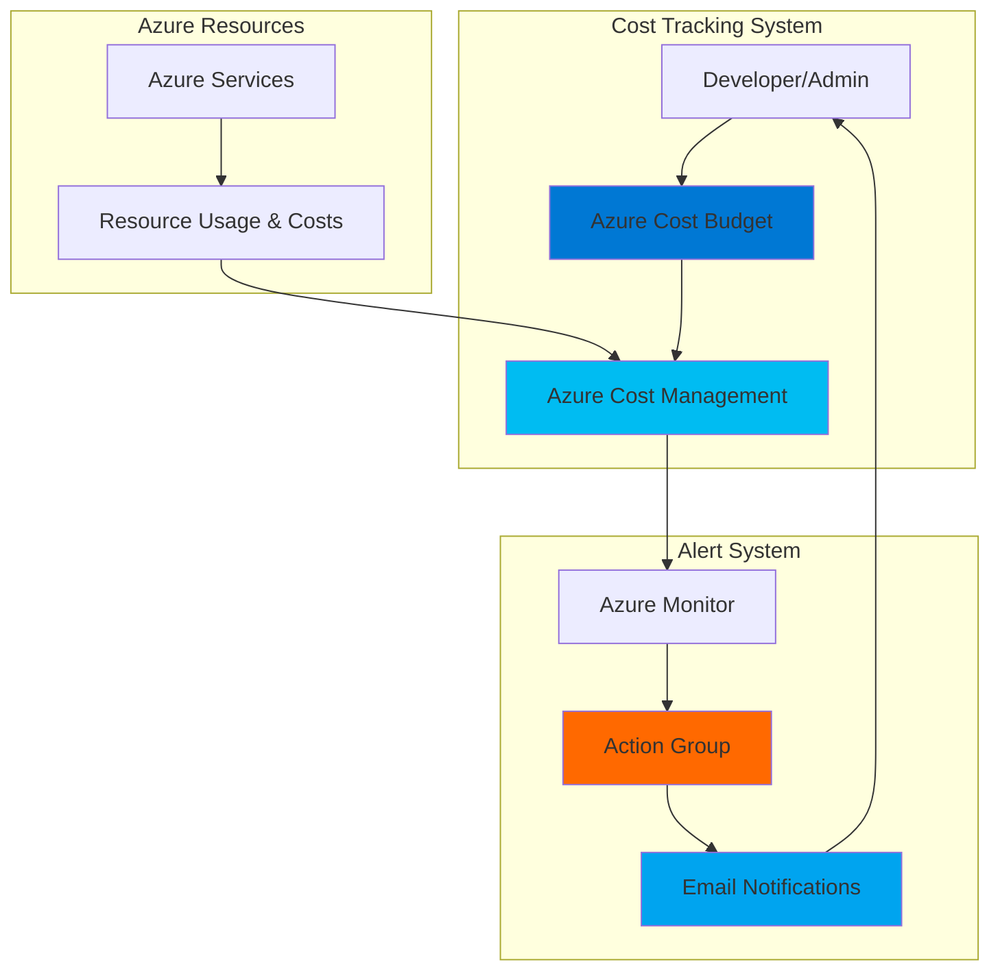

# Simple Cost Budget Tracking with Cost Management

## Problem

Organizations and individual developers often experience unexpected Azure bill shock when cloud spending exceeds planned budgets without early warning systems. Without proactive cost monitoring and automated alerts, teams discover overspending only after receiving monthly invoices, leading to budget overruns and potential project delays. Manual cost tracking is time-consuming and reactive, preventing teams from taking corrective action before costs spiral out of control.

## Solution

Create automated cost budgets with email alert notifications using Azure Cost Management and Azure Monitor to track spending against predefined thresholds. This solution establishes proactive cost monitoring by setting up budget alerts at multiple spending levels (50%, 80%, 100%) that automatically notify stakeholders via email when costs approach or exceed limits, enabling immediate corrective action before bill shock occurs.

## Architecture Diagram



## Prerequisites

1. Azure subscription with Contributor or Cost Management Contributor permissions
2. Azure CLI installed and configured (version 2.0.81 or later)
3. Basic understanding of Azure billing and cost concepts
4. Valid email address for receiving budget alerts
5. Estimated cost: $0 (Cost Management and alerts are free Azure services)

> **Note**: Budget creation requires appropriate RBAC permissions. Ensure you have Cost Management Contributor role or higher at the subscription level.

## Preparation

```bash
# Set environment variables for Azure resources
export RESOURCE_GROUP="rg-cost-tracking-${RANDOM_SUFFIX}"
export LOCATION="eastus"
export SUBSCRIPTION_ID=$(az account show --query id --output tsv)

# Generate unique suffix for resource names
RANDOM_SUFFIX=$(openssl rand -hex 3)

# Set budget configuration variables
export BUDGET_NAME="monthly-cost-budget-${RANDOM_SUFFIX}"
export BUDGET_AMOUNT="100"
export EMAIL_ADDRESS="your-email@example.com"
export ACTION_GROUP_NAME="cost-alert-group-${RANDOM_SUFFIX}"

# Create resource group for monitoring resources
az group create \
    --name ${RESOURCE_GROUP} \
    --location ${LOCATION} \
    --tags purpose=cost-monitoring environment=demo

echo "✅ Resource group created: ${RESOURCE_GROUP}"
echo "📧 Configure your email: ${EMAIL_ADDRESS}"
```

## Steps

1. **Create Azure Monitor Action Group for Email Notifications**:

   Azure Monitor Action Groups provide the notification infrastructure for budget alerts, enabling automated email delivery when cost thresholds are exceeded. Action groups serve as reusable notification endpoints that can trigger multiple communication channels including email, SMS, webhooks, and Azure Functions. This foundational component ensures budget alerts reach the right stakeholders immediately when spending anomalies occur.

   ```bash
   # Create action group with email notification
   az monitor action-group create \
       --name ${ACTION_GROUP_NAME} \
       --resource-group ${RESOURCE_GROUP} \
       --short-name "CostAlert" \
       --action email "budget-admin" ${EMAIL_ADDRESS}
   
   # Get action group resource ID for budget configuration
   ACTION_GROUP_ID=$(az monitor action-group show \
       --name ${ACTION_GROUP_NAME} \
       --resource-group ${RESOURCE_GROUP} \
       --query id --output tsv)
   
   echo "✅ Action group created with email notifications enabled"
   echo "📧 Email alerts will be sent to: ${EMAIL_ADDRESS}"
   ```

   The action group is now configured to send email notifications whenever budget thresholds are triggered. This provides immediate visibility into cost anomalies and enables rapid response to prevent budget overruns.

2. **Configure Budget Alert Thresholds**:

   Budget alerts use percentage-based thresholds to provide progressive warnings as spending approaches budget limits. Multi-level alerting (50%, 80%, 100%) provides early warning at moderate spending levels and urgent notifications as costs approach or exceed budgets. This tiered approach enables different response strategies based on spending severity.

   ```bash
   # Create JSON configuration for budget alerts
   cat > budget-alerts.json << EOF
   [
     {
       "enabled": true,
       "operator": "GreaterThan",
       "threshold": 50,
       "contactEmails": ["${EMAIL_ADDRESS}"],
       "contactRoles": [],
       "contactGroups": ["${ACTION_GROUP_ID}"],
       "thresholdType": "Actual"
     },
     {
       "enabled": true,
       "operator": "GreaterThan", 
       "threshold": 80,
       "contactEmails": ["${EMAIL_ADDRESS}"],
       "contactRoles": [],
       "contactGroups": ["${ACTION_GROUP_ID}"],
       "thresholdType": "Actual"
     },
     {
       "enabled": true,
       "operator": "GreaterThan",
       "threshold": 100,
       "contactEmails": ["${EMAIL_ADDRESS}"],
       "contactRoles": [],
       "contactGroups": ["${ACTION_GROUP_ID}"],
       "thresholdType": "Forecasted"
     }
   ]
   EOF
   
   echo "✅ Budget alert thresholds configured: 50%, 80%, 100%"
   ```

   The alert configuration includes both actual and forecasted cost triggers, providing alerts based on current spending and predicted future costs. This dual approach catches both immediate overspending and trending cost increases.

3. **Create Cost Management Budget**:

   Azure Cost Management budgets provide automated spending monitoring by comparing actual costs against predefined limits and triggering alerts when thresholds are exceeded. Budgets support both subscription and resource group scopes, enabling granular cost control for specific workloads or entire subscriptions. The budget automatically evaluates costs daily and sends notifications when spending patterns indicate potential overruns.

   ```bash
   # Create monthly budget using REST API with latest version
   BUDGET_JSON=$(cat << EOF
   {
     "properties": {
       "category": "Cost",
       "amount": ${BUDGET_AMOUNT},
       "timeGrain": "Monthly",
       "timePeriod": {
         "startDate": "$(date -d 'first day of this month' +%Y-%m-01)",
         "endDate": "$(date -d 'first day of next month + 1 year' +%Y-%m-01)"
       },
       "notifications": $(cat budget-alerts.json)
     }
   }
   EOF
   )
   
   # Create budget using Azure REST API with latest version
   az rest \
       --method PUT \
       --url "https://management.azure.com/subscriptions/${SUBSCRIPTION_ID}/providers/Microsoft.Consumption/budgets/${BUDGET_NAME}?api-version=2023-11-01" \
       --body "${BUDGET_JSON}"
   
   echo "✅ Monthly budget created: \$${BUDGET_AMOUNT}"
   echo "📊 Budget scope: Subscription ${SUBSCRIPTION_ID}"
   ```

   The budget is now actively monitoring subscription costs against the $100 monthly limit. Cost evaluation occurs automatically every 4-8 hours, ensuring timely detection of spending anomalies and rapid alert delivery.

4. **Configure Budget Scope and Filters**:

   Budget filters enable targeted cost monitoring for specific services, resource groups, or tags, providing granular control over which costs are included in budget calculations. This capability is essential for organizations that need to track costs for specific projects, departments, or environments independently. Proper filtering ensures budget alerts reflect only relevant spending categories.

   ```bash
   # Create filtered budget for specific resource types (optional)
   FILTERED_BUDGET_JSON=$(cat << EOF
   {
     "properties": {
       "category": "Cost",
       "amount": ${BUDGET_AMOUNT},
       "timeGrain": "Monthly",
       "timePeriod": {
         "startDate": "$(date -d 'first day of this month' +%Y-%m-01)",
         "endDate": "$(date -d 'first day of next month + 1 year' +%Y-%m-01)"
       },
       "filter": {
         "dimensions": {
           "name": "ResourceGroupName",
           "operator": "In",
           "values": ["${RESOURCE_GROUP}"]
         }
       },
       "notifications": $(cat budget-alerts.json)
     }
   }
   EOF
   )
   
   # Update budget with resource group filter
   FILTERED_BUDGET_NAME="rg-budget-${RANDOM_SUFFIX}"
   az rest \
       --method PUT \
       --url "https://management.azure.com/subscriptions/${SUBSCRIPTION_ID}/providers/Microsoft.Consumption/budgets/${FILTERED_BUDGET_NAME}?api-version=2023-11-01" \
       --body "${FILTERED_BUDGET_JSON}"
   
   echo "✅ Resource group budget created with filters"
   echo "🎯 Monitoring costs for resource group: ${RESOURCE_GROUP}"
   ```

   The filtered budget now monitors only costs associated with the specified resource group, enabling precise cost tracking for specific projects or workloads while excluding unrelated subscription costs.

5. **Enable Cost Alerts in Azure Portal**:

   Azure Cost Management provides a centralized dashboard for viewing all active budgets, cost trends, and alert status across subscriptions and resource groups. The portal interface enables easy monitoring of budget performance and quick identification of cost anomalies. Regular dashboard reviews help teams understand spending patterns and optimize resource allocation.

   ```bash
   # Verify budget creation and get status
   az rest \
       --method GET \
       --url "https://management.azure.com/subscriptions/${SUBSCRIPTION_ID}/providers/Microsoft.Consumption/budgets/${BUDGET_NAME}?api-version=2023-11-01" \
       --query "properties.{Amount:amount,TimeGrain:timeGrain,Category:category}" \
       --output table
   
   # List all budgets for verification
   az rest \
       --method GET \
       --url "https://management.azure.com/subscriptions/${SUBSCRIPTION_ID}/providers/Microsoft.Consumption/budgets?api-version=2023-11-01" \
       --query "value[].{Name:name,Amount:properties.amount,Status:properties.currentSpend}" \
       --output table
   
   echo "✅ Budget monitoring active"
   echo "🌐 View in Azure portal: https://portal.azure.com/#view/Microsoft_Azure_CostManagement/Menu/~/overview"
   ```

   Budget monitoring is now fully operational with real-time cost tracking and automated alert delivery. The system will continuously monitor spending and send notifications when thresholds are exceeded.

## Validation & Testing

1. **Verify Budget Configuration and Alert Rules**:

   ```bash
   # Check budget details and current spending
   az rest \
       --method GET \
       --url "https://management.azure.com/subscriptions/${SUBSCRIPTION_ID}/providers/Microsoft.Consumption/budgets/${BUDGET_NAME}?api-version=2023-11-01" \
       --query "properties.{Budget:amount,Current:currentSpend.amount,Alerts:notifications}" \
       --output json
   ```

   Expected output: Budget configuration showing $100 limit with three alert thresholds and current spending data.

2. **Test Action Group Email Delivery**:

   ```bash
   # Test action group notification delivery using updated command
   az monitor action-group test-notifications create \
       --action-group-name ${ACTION_GROUP_NAME} \
       --resource-group ${RESOURCE_GROUP} \
       --alert-type "budget"
   
   echo "📧 Test email sent to verify notification delivery"
   ```

   Expected result: Test email received at configured address confirming notification system functionality.

3. **Verify Cost Analysis Integration**:

   ```bash
   # Get current month cost data for validation
   START_DATE=$(date -d 'first day of this month' +%Y-%m-%d)
   END_DATE=$(date +%Y-%m-%d)
   
   az rest \
       --method POST \
       --url "https://management.azure.com/subscriptions/${SUBSCRIPTION_ID}/providers/Microsoft.CostManagement/query?api-version=2023-11-01" \
       --body "{
         \"type\": \"ActualCost\",
         \"timeframe\": \"Custom\",
         \"timePeriod\": {
           \"from\": \"${START_DATE}\",
           \"to\": \"${END_DATE}\"
         },
         \"dataset\": {
           \"granularity\": \"Daily\",
           \"aggregation\": {
             \"totalCost\": {
               \"name\": \"PreTaxCost\",
               \"function\": \"Sum\"
             }
           }
         }
       }" \
       --query "properties.rows[0][0]" \
       --output tsv
   
   echo "✅ Cost analysis data available for budget tracking"
   ```

## Cleanup

1. **Remove Budget and Alert Configurations**:

   ```bash
   # Delete created budgets
   az rest \
       --method DELETE \
       --url "https://management.azure.com/subscriptions/${SUBSCRIPTION_ID}/providers/Microsoft.Consumption/budgets/${BUDGET_NAME}?api-version=2023-11-01"
   
   az rest \
       --method DELETE \
       --url "https://management.azure.com/subscriptions/${SUBSCRIPTION_ID}/providers/Microsoft.Consumption/budgets/${FILTERED_BUDGET_NAME}?api-version=2023-11-01"
   
   echo "✅ Budgets deleted"
   ```

2. **Remove Action Group and Resource Group**:

   ```bash
   # Delete action group
   az monitor action-group delete \
       --name ${ACTION_GROUP_NAME} \
       --resource-group ${RESOURCE_GROUP}
   
   echo "✅ Action group deleted"
   ```

3. **Clean Up Resource Group**:

   ```bash
   # Delete resource group and all contained resources
   az group delete \
       --name ${RESOURCE_GROUP} \
       --yes \
       --no-wait
   
   echo "✅ Resource group deletion initiated: ${RESOURCE_GROUP}"
   echo "Note: Deletion may take several minutes to complete"
   ```

4. **Remove Local Configuration Files**:

   ```bash
   # Clean up temporary files
   rm -f budget-alerts.json
   
   # Clear environment variables
   unset RESOURCE_GROUP BUDGET_NAME ACTION_GROUP_NAME EMAIL_ADDRESS
   
   echo "✅ Local cleanup completed"
   ```

## Discussion

Azure Cost Management provides comprehensive cost tracking and budget management capabilities that enable proactive spending control across Azure subscriptions and resource groups. This recipe demonstrates the fundamental pattern of combining budgets with automated alerting to prevent cost overruns through early warning systems. The multi-threshold approach (50%, 80%, 100%) provides progressive escalation that enables different response strategies based on spending severity, following Azure Well-Architected Framework cost management principles.

The integration between Azure Cost Management and Azure Monitor Action Groups creates a robust notification system that can scale from simple email alerts to complex automation workflows. Action groups support multiple notification channels including email, SMS, webhooks, Logic Apps, and Azure Functions, enabling sophisticated cost management automation scenarios. This flexibility allows organizations to implement custom cost control policies and automated remediation actions aligned with their operational requirements.

Cost budget filtering capabilities enable granular cost tracking for specific services, resource groups, or tags, supporting complex organizational structures with multiple projects, departments, or environments. This filtering precision ensures budget alerts reflect only relevant spending categories, preventing noise from unrelated costs and enabling targeted cost optimization efforts. Organizations can implement hierarchical budget structures that roll up from project-level budgets to department and organization-wide spending limits, supporting comprehensive cost governance strategies.

The forecasted alert functionality leverages Azure's machine learning-powered cost prediction algorithms to provide early warnings when spending trends indicate potential budget overruns. This predictive capability enables proactive cost management by identifying concerning spending patterns before they result in actual overages. Combined with actual cost alerts, this dual approach provides comprehensive coverage of both immediate and trending cost issues, supporting the Azure Well-Architected Framework's cost optimization pillar.

> **Tip**: Enable azure-noreply@microsoft.com in your email whitelist to ensure budget alert emails reach your inbox and don't get filtered to spam folders. See [Azure Cost Management documentation](https://learn.microsoft.com/en-us/azure/cost-management-billing/costs/cost-mgt-best-practices) for additional best practices.

## Challenge

Extend this solution by implementing these enhancements:

1. **Multi-Level Budget Hierarchy**: Create cascading budgets for management groups, subscriptions, and resource groups with automated cost allocation and rollup reporting using Azure Cost Management APIs and Power BI integration.

2. **Automated Cost Response Actions**: Implement Logic Apps or Azure Functions triggered by budget alerts to automatically scale down or deallocate resources when spending thresholds are exceeded, with approval workflows for production environments.

3. **Advanced Cost Analytics Dashboard**: Build custom dashboards using Azure Monitor Workbooks and Azure Data Explorer to visualize cost trends, resource utilization patterns, and budget performance with predictive analytics capabilities.

4. **Tag-Based Cost Allocation**: Implement comprehensive resource tagging strategies with automated budget creation for each tag combination, enabling chargeback and showback scenarios for different business units or projects.

5. **Integration with DevOps Pipelines**: Create CI/CD pipeline integration that validates resource deployment costs against budgets before deployment, preventing infrastructure changes that would exceed spending limits.

## Infrastructure Code

### Available Infrastructure as Code:

- [Infrastructure Code Overview](code/README.md) - Detailed description of all infrastructure components
- [Bicep](code/bicep/) - Azure Bicep templates
- [Bash CLI Scripts](code/scripts/) - Example bash scripts using Azure CLI commands to deploy infrastructure
- [Terraform](code/terraform/) - Terraform configuration files