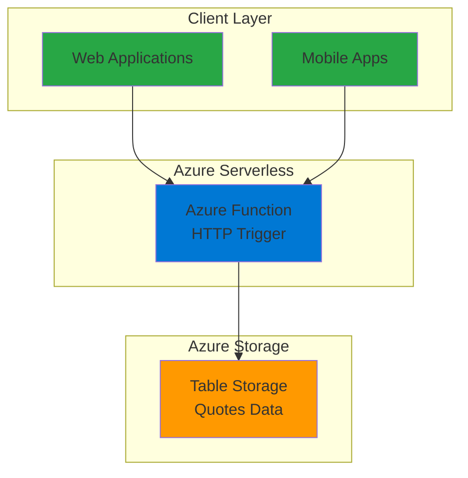

# Simple Daily Quote Generator with Functions and Storage

## Problem

Many websites and applications need to display inspirational content to engage users, but maintaining a reliable source of motivational quotes requires infrastructure and ongoing maintenance. Development teams often struggle with creating a simple, cost-effective API that can serve random quotes without managing servers or complex databases, especially when traffic patterns are unpredictable.

## Solution

Build a serverless API using Azure Functions with HTTP triggers to serve random inspirational quotes stored in Azure Table Storage. This solution leverages Azure's pay-per-use model with automatic scaling and provides a NoSQL storage layer for flexible quote data management, eliminating infrastructure concerns while ensuring high availability.

## Architecture Diagram



## Prerequisites

1. Azure account with active subscription and Contributor role permissions
2. Azure CLI installed and configured (version 2.0.76 or later)
3. Basic knowledge of REST APIs and JSON data structures
4. Understanding of serverless computing concepts
5. Estimated cost: $0.10-$0.50 per month for development/testing workloads

> **Note**: Azure Functions Consumption plan provides 1 million free requests per month, making this solution very cost-effective for small applications.

## Preparation

```bash
# Generate unique suffix for resource names
RANDOM_SUFFIX=$(openssl rand -hex 3)

# Set environment variables for Azure resources
export RESOURCE_GROUP="rg-quote-generator-${RANDOM_SUFFIX}"
export LOCATION="eastus"
export SUBSCRIPTION_ID=$(az account show --query id --output tsv)

# Set resource names with unique suffix
export STORAGE_ACCOUNT="stquote${RANDOM_SUFFIX}"
export FUNCTION_APP="func-quote-${RANDOM_SUFFIX}"

# Create resource group
az group create \
    --name ${RESOURCE_GROUP} \
    --location ${LOCATION} \
    --tags purpose=recipe environment=demo

echo "✅ Resource group created: ${RESOURCE_GROUP}"
```

## Steps

1. **Create Storage Account for Function App and Table Storage**:

   Azure Functions requires a storage account for internal state management, and we'll use the same account for Table Storage to store our quotes. Azure Storage provides 99.999999999% (11 9's) durability and built-in redundancy across availability zones, ensuring your quote data remains highly available and protected against hardware failures.

   ```bash
   # Create storage account with Standard LRS replication
   az storage account create \
       --name ${STORAGE_ACCOUNT} \
       --resource-group ${RESOURCE_GROUP} \
       --location ${LOCATION} \
       --sku Standard_LRS \
       --kind StorageV2 \
       --access-tier Hot
   
   # Get storage account connection string
   STORAGE_CONNECTION=$(az storage account show-connection-string \
       --name ${STORAGE_ACCOUNT} \
       --resource-group ${RESOURCE_GROUP} \
       --query connectionString \
       --output tsv)
   
   echo "✅ Storage account created: ${STORAGE_ACCOUNT}"
   ```

   The storage account now provides both the backend storage for Azure Functions runtime and the Table Storage service for our quote data, optimizing costs by using a single storage resource while maintaining separation of concerns.

2. **Create Azure Function App with Consumption Plan**:

   Azure Functions Consumption plan provides serverless execution with automatic scaling and cost optimization. Functions only consume resources when executing, making it perfect for API endpoints with variable traffic patterns. The consumption model scales from zero to thousands of concurrent executions automatically.

   ```bash
   # Create Function App in Consumption plan
   az functionapp create \
       --name ${FUNCTION_APP} \
       --resource-group ${RESOURCE_GROUP} \
       --storage-account ${STORAGE_ACCOUNT} \
       --consumption-plan-location ${LOCATION} \
       --runtime node \
       --runtime-version 20 \
       --functions-version 4 \
       --os-type Linux
   
   echo "✅ Function App created: ${FUNCTION_APP}"
   ```

   The Function App is now configured with Node.js 20 runtime and will automatically scale based on incoming HTTP requests, with built-in monitoring through Application Insights for performance tracking and error detection.

3. **Create Table Storage Container for Quotes**:

   Azure Table Storage provides a NoSQL key-value store perfect for storing structured data like quotes. The schemaless design allows flexibility in quote properties while maintaining high performance for simple queries, with automatic indexing on partition and row keys.

   ```bash
   # Create table for storing quotes
   az storage table create \
       --name quotes \
       --account-name ${STORAGE_ACCOUNT} \
       --connection-string "${STORAGE_CONNECTION}"
   
   echo "✅ Table Storage 'quotes' created successfully"
   ```

   The quotes table is now ready to store quote entities with automatic indexing on PartitionKey and RowKey for efficient retrieval and supports OData-style queries for complex filtering scenarios.

4. **Populate Table Storage with Sample Quote Data**:

   We'll add inspirational quotes to the table using Azure CLI. Each quote entity includes the quote text, author, and category for flexible querying and display options. Table Storage entities can contain up to 255 properties and 1MB of data per entity.

   ```bash
   # Insert sample inspirational quotes
   az storage entity insert \
       --table-name quotes \
       --entity PartitionKey=inspiration RowKey=001 \
       quote="The only way to do great work is to love what you do." \
       author="Steve Jobs" category=motivation \
       --account-name ${STORAGE_ACCOUNT} \
       --connection-string "${STORAGE_CONNECTION}"
   
   az storage entity insert \
       --table-name quotes \
       --entity PartitionKey=inspiration RowKey=002 \
       quote="Innovation distinguishes between a leader and a follower." \
       author="Steve Jobs" category=innovation \
       --account-name ${STORAGE_ACCOUNT} \
       --connection-string "${STORAGE_CONNECTION}"
   
   az storage entity insert \
       --table-name quotes \
       --entity PartitionKey=inspiration RowKey=003 \
       quote="Success is not final, failure is not fatal." \
       author="Winston Churchill" category=perseverance \
       --account-name ${STORAGE_ACCOUNT} \
       --connection-string "${STORAGE_CONNECTION}"
   
   az storage entity insert \
       --table-name quotes \
       --entity PartitionKey=inspiration RowKey=004 \
       quote="The future belongs to those who believe in the beauty of their dreams." \
       author="Eleanor Roosevelt" category=dreams \
       --account-name ${STORAGE_ACCOUNT} \
       --connection-string "${STORAGE_CONNECTION}"
   
   az storage entity insert \
       --table-name quotes \
       --entity PartitionKey=inspiration RowKey=005 \
       quote="It is during our darkest moments that we must focus to see the light." \
       author="Aristotle" category=hope \
       --account-name ${STORAGE_ACCOUNT} \
       --connection-string "${STORAGE_CONNECTION}"
   
   echo "✅ Sample quotes inserted into Table Storage"
   ```

   The table now contains five inspirational quotes with consistent partitioning and unique row keys, providing a foundation for the API to serve random motivational content with efficient partition-based queries.

5. **Create HTTP Trigger Function for Quote API**:

   Azure Functions HTTP triggers provide RESTful endpoints with built-in authentication options and automatic HTTPS termination. We'll create a simple GET endpoint that returns random quotes from Table Storage with proper error handling and response formatting.

   ```bash
   # Create function directory and files
   mkdir -p quote-function
   cd quote-function
   
   # Create function.json for HTTP trigger configuration
   cat > function.json << 'EOF'
   {
     "bindings": [
       {
         "authLevel": "anonymous",
         "type": "httpTrigger",
         "direction": "in",
         "name": "req",
         "methods": ["get"]
       },
       {
         "type": "http",
         "direction": "out",
         "name": "res"
       }
     ]
   }
   EOF
   
   echo "✅ Function configuration created"
   ```

   The HTTP trigger is configured for anonymous access, allowing public API usage without authentication keys, perfect for client-side applications that need to display quotes without managing API keys.

6. **Implement Quote Retrieval Logic**:

   The function code connects to Table Storage using the latest Azure SDK and implements random quote selection with proper error handling, structured logging, and JSON response formatting following REST API best practices.

   ```bash
   # Create the main function code
   cat > index.js << 'EOF'
   const { TableClient } = require("@azure/data-tables");

   module.exports = async function (context, req) {
       try {
           // Initialize Table Storage client
           const connectionString = process.env.AzureWebJobsStorage;
           const tableClient = TableClient.fromConnectionString(connectionString, "quotes");
           
           // Query all quotes from the inspiration partition
           const quotes = [];
           const entities = tableClient.listEntities({
               filter: "PartitionKey eq 'inspiration'"
           });
           
           for await (const entity of entities) {
               quotes.push({
                   id: entity.rowKey,
                   quote: entity.quote,
                   author: entity.author,
                   category: entity.category
               });
           }
           
           if (quotes.length === 0) {
               context.res = {
                   status: 404,
                   headers: { "Content-Type": "application/json" },
                   body: { error: "No quotes found" }
               };
               return;
           }
           
           // Select random quote
           const randomIndex = Math.floor(Math.random() * quotes.length);
           const selectedQuote = quotes[randomIndex];
           
           // Return successful response
           context.res = {
               status: 200,
               headers: {
                   "Content-Type": "application/json",
                   "Access-Control-Allow-Origin": "*",
                   "Cache-Control": "public, max-age=300"
               },
               body: {
                   success: true,
                   data: selectedQuote,
                   timestamp: new Date().toISOString(),
                   total_quotes: quotes.length
               }
           };
           
       } catch (error) {
           context.log.error('Error retrieving quote:', error);
           context.res = {
               status: 500,
               headers: { "Content-Type": "application/json" },
               body: { 
                   success: false,
                   error: "Internal server error",
                   message: "Unable to retrieve quote at this time"
               }
           };
       }
   };
   EOF
   
   # Create package.json for dependencies
   cat > package.json << 'EOF'
   {
     "name": "quote-generator-function",
     "version": "1.0.0",
     "description": "Azure Function for serving random inspirational quotes",
     "main": "index.js",
     "dependencies": {
       "@azure/data-tables": "^13.3.1"
     }
   }
   EOF
   
   echo "✅ Function code and package.json created"
   cd ..
   ```

   The function implements robust error handling, CORS support for web applications, caching headers for performance optimization, and structured JSON responses with metadata about the quote collection.

7. **Deploy Function to Azure with Dependencies**:

   Azure Functions deployment includes automatic dependency resolution and package installation using npm, ensuring the @azure/data-tables SDK is available in the cloud environment with proper version management.

   ```bash
   # Create deployment package
   cd quote-function
   zip -r ../quote-function.zip .
   cd ..
   
   # Deploy function to Azure
   az functionapp deployment source config-zip \
       --resource-group ${RESOURCE_GROUP} \
       --name ${FUNCTION_APP} \
       --src quote-function.zip
   
   # Wait for deployment to complete
   sleep 30
   
   echo "✅ Function deployed successfully to Azure"
   ```

   The function is now deployed and automatically configured with the storage connection string through environment variables, ready to serve quote requests with built-in monitoring, logging, and health checks.

8. **Configure CORS and Application Settings**:

   Enable cross-origin requests for web applications and verify the function has proper access to Table Storage through environment variables. CORS configuration allows browser-based applications to consume the API directly.

   ```bash
   # Enable CORS for web applications
   az functionapp cors add \
       --resource-group ${RESOURCE_GROUP} \
       --name ${FUNCTION_APP} \
       --allowed-origins "*"
   
   # Verify storage connection is configured
   az functionapp config appsettings list \
       --resource-group ${RESOURCE_GROUP} \
       --name ${FUNCTION_APP} \
       --query "[?name=='AzureWebJobsStorage'].value" \
       --output tsv
   
   echo "✅ Function app configured for cross-origin requests"
   ```

   The Function App now supports CORS requests from any origin, enabling integration with web applications, mobile apps, and other client-side technologies while maintaining secure access to backend storage resources.

## Validation & Testing

1. **Verify Function App Deployment Status**:

   ```bash
   # Check Function App status and configuration
   az functionapp show \
       --resource-group ${RESOURCE_GROUP} \
       --name ${FUNCTION_APP} \
       --query "{status:state,runtime:linuxFxVersion,plan:kind}" \
       --output table
   ```

   Expected output: Shows "Running" status with Node.js runtime and consumption plan configuration.

2. **Test Quote API Endpoint**:

   ```bash
   # Get function URL and test the API
   FUNCTION_URL=$(az functionapp function show \
       --resource-group ${RESOURCE_GROUP} \
       --name ${FUNCTION_APP} \
       --function-name quote-function \
       --query invokeUrlTemplate \
       --output tsv)
   
   # Test API endpoint
   curl -s "${FUNCTION_URL}" | jq '.'
   ```

   Expected output: JSON response with quote data, author, category, and metadata including timestamp and total quote count.

3. **Verify Table Storage Data**:

   ```bash
   # List all quotes in Table Storage
   az storage entity query \
       --table-name quotes \
       --filter "PartitionKey eq 'inspiration'" \
       --select quote,author,category \
       --account-name ${STORAGE_ACCOUNT} \
       --connection-string "${STORAGE_CONNECTION}" \
       --output table
   ```

   Expected output: Table showing all 5 quotes with their authors and categories.

4. **Test Multiple API Calls for Randomness**:

   ```bash
   # Test multiple calls to verify random selection
   echo "Testing random quote selection (5 calls):"
   for i in {1..5}; do
       echo "Call $i:"
       curl -s "${FUNCTION_URL}" | jq -r '.data.quote'
       echo ""
       sleep 1
   done
   ```

   Expected behavior: Different quotes returned across multiple calls, demonstrating random selection functionality.

## Cleanup

1. **Remove Function App and Associated Resources**:

   ```bash
   # Delete the entire resource group and all contained resources
   az group delete \
       --name ${RESOURCE_GROUP} \
       --yes \
       --no-wait
   
   echo "✅ Resource group deletion initiated: ${RESOURCE_GROUP}"
   echo "Note: Deletion may take several minutes to complete"
   ```

2. **Clean Up Local Files**:

   ```bash
   # Remove local function files
   rm -rf quote-function
   rm -f quote-function.zip
   
   # Clear environment variables
   unset RESOURCE_GROUP LOCATION STORAGE_ACCOUNT FUNCTION_APP STORAGE_CONNECTION
   
   echo "✅ Local cleanup completed"
   ```

3. **Verify Resource Deletion**:

   ```bash
   # Verify resource group deletion (optional)
   az group exists --name ${RESOURCE_GROUP}
   ```

   Expected output: "false" confirming successful deletion and no ongoing charges.

## Discussion

This recipe demonstrates the power of Azure's serverless computing model for building simple, scalable APIs. Azure Functions with HTTP triggers provide an excellent foundation for REST APIs that need to handle variable traffic patterns without infrastructure management overhead. The Consumption plan's pay-per-execution model ensures cost efficiency, charging only for actual function invocations rather than idle server time, making it ideal for applications with sporadic usage patterns.

Azure Table Storage serves as an ideal data store for this use case due to its NoSQL schemaless design and automatic scaling capabilities. The partition key and row key structure enables efficient queries while maintaining flexibility for future schema evolution. The combination of partition key filtering and random selection in application code provides good performance even as the quote collection grows, though for larger datasets, you might consider implementing server-side randomization techniques or using Azure Cosmos DB for global distribution.

The architecture follows [Azure Well-Architected Framework](https://docs.microsoft.com/en-us/azure/architecture/framework/) principles by implementing proper error handling, CORS support for cross-origin requests, and structured logging for monitoring. The anonymous authentication level makes the API publicly accessible, which is appropriate for serving inspirational content, though production applications might require API key authentication or Azure Active Directory integration depending on usage requirements and data sensitivity.

For production deployments, consider implementing [Azure API Management](https://docs.microsoft.com/en-us/azure/api-management/) for advanced features like rate limiting, request transformation, and analytics. The current implementation provides a solid foundation that can be extended with additional features like quote categories, user favorites, or content management capabilities. Additionally, [Azure Cosmos DB Table API](https://docs.microsoft.com/en-us/azure/cosmos-db/table-introduction) could be considered for applications requiring global distribution and lower latency guarantees.

> **Tip**: Use Azure Application Insights to monitor function performance and set up alerts for high error rates or unusual usage patterns. Enable Application Insights logging in your Function App for detailed performance metrics and error tracking.

## Challenge

Extend this solution by implementing these enhancements:

1. **Add Category-Based Filtering**: Modify the API to accept query parameters for filtering quotes by category (motivation, innovation, perseverance), requiring updates to both the function logic and Table Storage queries with proper input validation.

2. **Implement Quote Management**: Create additional HTTP trigger functions for adding, updating, and deleting quotes, including proper validation, error handling, and authentication for content management operations using Azure AD integration.

3. **Add Caching Layer**: Integrate Azure Redis Cache to store frequently requested quotes and reduce Table Storage queries, implementing cache-aside pattern with appropriate TTL values and cache invalidation strategies.

4. **Create Scheduled Quote Updates**: Build a timer-triggered function that periodically adds new quotes from external APIs or RSS feeds, automating content freshness and variety while maintaining data quality standards.

5. **Implement Usage Analytics**: Add Application Insights custom events to track quote popularity and API usage patterns, creating Power BI dashboards for monitoring quote engagement metrics and user behavior analysis.

## Infrastructure Code

### Available Infrastructure as Code:

- [Infrastructure Code Overview](code/README.md) - Detailed description of all infrastructure components
- [Bicep](code/bicep/) - Azure Bicep templates
- [Bash CLI Scripts](code/scripts/) - Example bash scripts using Azure CLI commands to deploy infrastructure
- [Terraform](code/terraform/) - Terraform configuration files