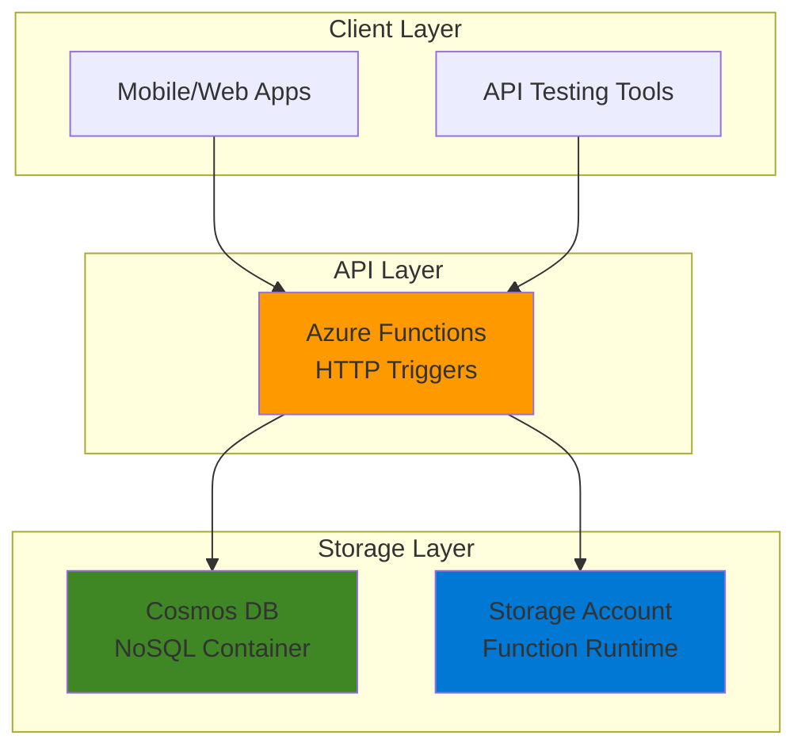

# Simple Data Collection API with Azure Functions and Cosmos DB

## Problem

Small businesses and development teams need a quick way to collect and store data through a REST API without managing complex infrastructure. Traditional database-backed APIs require server provisioning, connection pooling, scaling configuration, and ongoing maintenance. Development teams want to focus on building features rather than managing servers, databases, and API infrastructure.

## Solution

Create a serverless REST API using Azure Functions with HTTP triggers and Cosmos DB for data persistence. This serverless approach automatically scales based on demand, eliminates infrastructure management, and provides built-in security features. Azure Functions handles HTTP requests while Cosmos DB provides globally distributed, schema-flexible storage with automatic indexing.

## Architecture Diagram



## Prerequisites

1. Azure account with active subscription and Contributor permissions
2. Azure CLI installed and configured (or use Azure Cloud Shell)
3. Azure Functions Core Tools v4.0.5382 or higher
4. Node.js 18.x or 20.x
5. Basic knowledge of REST APIs and HTTP methods
6. Familiarity with JSON data formats
7. Estimated cost: $3-8 USD per month for development workloads

> **Note**: Azure Functions Consumption plan provides 1 million free requests per month, and Cosmos DB offers 1000 RU/s free tier, making this recipe very cost-effective for learning and small applications.

## Preparation

```bash
# Set environment variables for Azure resources
export RESOURCE_GROUP="rg-data-api-${RANDOM_SUFFIX}"
export LOCATION="eastus"
export SUBSCRIPTION_ID=$(az account show --query id --output tsv)

# Generate unique suffix for resource names
RANDOM_SUFFIX=$(openssl rand -hex 3)

# Set resource names with unique suffix
export COSMOS_ACCOUNT="cosmos-data-${RANDOM_SUFFIX}"
export FUNCTION_APP="func-data-api-${RANDOM_SUFFIX}"
export STORAGE_ACCOUNT="stdataapi${RANDOM_SUFFIX}"
export DATABASE_NAME="DataCollectionDB"
export CONTAINER_NAME="records"

# Create resource group
az group create \
    --name ${RESOURCE_GROUP} \
    --location ${LOCATION} \
    --tags purpose=recipe environment=demo

echo "✅ Resource group created: ${RESOURCE_GROUP}"
```

## Steps

1. **Create Cosmos DB Account and Container**:

   Azure Cosmos DB provides globally distributed, multi-model database capabilities with automatic scaling and built-in security. The NoSQL API offers schema-flexible document storage with automatic indexing, making it perfect for data collection scenarios where the data structure might evolve over time.

   ```bash
   # Create Cosmos DB account with NoSQL API
   az cosmosdb create \
       --name ${COSMOS_ACCOUNT} \
       --resource-group ${RESOURCE_GROUP} \
       --default-consistency-level Session \
       --locations regionName=${LOCATION} \
       --enable-automatic-failover false
   
   echo "✅ Cosmos DB account created: ${COSMOS_ACCOUNT}"
   
   # Create database
   az cosmosdb sql database create \
       --account-name ${COSMOS_ACCOUNT} \
       --resource-group ${RESOURCE_GROUP} \
       --name ${DATABASE_NAME}
   
   # Create container with partition key
   az cosmosdb sql container create \
       --account-name ${COSMOS_ACCOUNT} \
       --resource-group ${RESOURCE_GROUP} \
       --database-name ${DATABASE_NAME} \
       --name ${CONTAINER_NAME} \
       --partition-key-path "/id" \
       --throughput 400
   
   echo "✅ Database and container created successfully"
   ```

   The container uses "/id" as the partition key, which provides optimal performance for single-document operations and ensures even data distribution across partitions. The 400 RU/s throughput setting provides cost-effective performance for development and testing scenarios.

2. **Create Storage Account for Function App**:

   Azure Functions requires a storage account for internal operations, including storing function metadata, managing triggers, and logging. This foundational component enables the Functions runtime to operate efficiently and provides durable storage for function execution history.

   ```bash
   # Create storage account for Azure Functions
   az storage account create \
       --name ${STORAGE_ACCOUNT} \
       --resource-group ${RESOURCE_GROUP} \
       --location ${LOCATION} \
       --sku Standard_LRS \
       --kind StorageV2
   
   echo "✅ Storage account created: ${STORAGE_ACCOUNT}"
   ```

3. **Create Function App with Cosmos DB Integration**:

   Azure Functions provides serverless compute that automatically scales based on demand. The Consumption plan offers pay-per-execution pricing and handles all infrastructure management, allowing developers to focus purely on business logic implementation.

   ```bash
   # Create Function App on Consumption plan
   az functionapp create \
       --name ${FUNCTION_APP} \
       --resource-group ${RESOURCE_GROUP} \
       --storage-account ${STORAGE_ACCOUNT} \
       --consumption-plan-location ${LOCATION} \
       --runtime node \
       --runtime-version 20 \
       --functions-version 4
   
   # Get Cosmos DB connection string
   COSMOS_CONNECTION=$(az cosmosdb keys list \
       --name ${COSMOS_ACCOUNT} \
       --resource-group ${RESOURCE_GROUP} \
       --type connection-strings \
       --query "connectionStrings[0].connectionString" \
       --output tsv)
   
   # Configure Function App settings
   az functionapp config appsettings set \
       --name ${FUNCTION_APP} \
       --resource-group ${RESOURCE_GROUP} \
       --settings \
       "COSMOS_DB_CONNECTION_STRING=${COSMOS_CONNECTION}" \
       "COSMOS_DB_DATABASE_NAME=${DATABASE_NAME}" \
       "COSMOS_DB_CONTAINER_NAME=${CONTAINER_NAME}"
   
   echo "✅ Function App created and configured: ${FUNCTION_APP}"
   ```

   The Function App now has secure access to Cosmos DB through connection strings stored as application settings. This configuration follows Azure security best practices by avoiding hardcoded credentials in source code.

4. **Deploy CRUD Functions**:

   Modern Azure Functions use the v4 programming model, which allows defining triggers and bindings directly in code without separate configuration files. This approach simplifies development and improves maintainability by keeping all function logic in a single location.

   ```bash
   # Create a temporary directory for function code
   mkdir -p /tmp/function-app
   cd /tmp/function-app
   
   # Initialize new Functions project
   func init --typescript --model V4
   
   # Create package.json with required dependencies
   cat > package.json << 'EOF'
   {
     "name": "data-collection-api",
     "version": "1.0.0",
     "description": "Simple data collection API using Azure Functions and Cosmos DB",
     "main": "dist/src/functions/*.js",
     "scripts": {
       "build": "tsc",
       "watch": "tsc --watch",
       "prestart": "npm run build",
       "start": "func start",
       "test": "echo \"No tests yet\""
     },
     "dependencies": {
       "@azure/functions": "^4.5.0",
       "@azure/cosmos": "^4.0.0"
     },
     "devDependencies": {
       "@types/node": "^20.x",
       "typescript": "^5.0.0"
     }
   }
   EOF
   
   # Create the main function file with CRUD operations
   mkdir -p src/functions
   cat > src/functions/dataApi.ts << 'EOF'
   import { app, HttpRequest, HttpResponseInit, InvocationContext } from '@azure/functions';
   import { CosmosClient } from '@azure/cosmos';
   
   // Initialize Cosmos DB client
   const cosmosClient = new CosmosClient(process.env.COSMOS_DB_CONNECTION_STRING!);
   const database = cosmosClient.database(process.env.COSMOS_DB_DATABASE_NAME!);
   const container = database.container(process.env.COSMOS_DB_CONTAINER_NAME!);
   
   // CREATE - Add new record
   app.http('createRecord', {
       methods: ['POST'],
       route: 'records',
       authLevel: 'anonymous',
       handler: async (request: HttpRequest, context: InvocationContext): Promise<HttpResponseInit> => {
           try {
               const body = await request.json() as any;
               const record = {
                   id: body.id || crypto.randomUUID(),
                   ...body,
                   createdAt: new Date().toISOString(),
                   updatedAt: new Date().toISOString()
               };
               
               const { resource } = await container.items.create(record);
               context.log(`Created record with id: ${resource.id}`);
               
               return {
                   status: 201,
                   jsonBody: resource
               };
           } catch (error) {
               context.error('Error creating record:', error);
               return {
                   status: 500,
                   jsonBody: { error: 'Failed to create record' }
               };
           }
       }
   });
   
   // READ - Get all records
   app.http('getRecords', {
       methods: ['GET'],
       route: 'records',
       authLevel: 'anonymous',
       handler: async (request: HttpRequest, context: InvocationContext): Promise<HttpResponseInit> => {
           try {
               const { resources } = await container.items.readAll().fetchAll();
               context.log(`Retrieved ${resources.length} records`);
               
               return {
                   status: 200,
                   jsonBody: resources
               };
           } catch (error) {
               context.error('Error retrieving records:', error);
               return {
                   status: 500,
                   jsonBody: { error: 'Failed to retrieve records' }
               };
           }
       }
   });
   
   // READ - Get specific record by ID
   app.http('getRecord', {
       methods: ['GET'],
       route: 'records/{id}',
       authLevel: 'anonymous',
       handler: async (request: HttpRequest, context: InvocationContext): Promise<HttpResponseInit> => {
           try {
               const id = request.params.id;
               const { resource } = await container.item(id, id).read();
               
               if (!resource) {
                   return {
                       status: 404,
                       jsonBody: { error: 'Record not found' }
                   };
               }
               
               context.log(`Retrieved record with id: ${id}`);
               return {
                   status: 200,
                   jsonBody: resource
               };
           } catch (error) {
               context.error('Error retrieving record:', error);
               return {
                   status: 500,
                   jsonBody: { error: 'Failed to retrieve record' }
               };
           }
       }
   });
   
   // UPDATE - Update existing record
   app.http('updateRecord', {
       methods: ['PUT'],
       route: 'records/{id}',
       authLevel: 'anonymous',
       handler: async (request: HttpRequest, context: InvocationContext): Promise<HttpResponseInit> => {
           try {
               const id = request.params.id;
               const body = await request.json() as any;
               
               const updatedRecord = {
                   ...body,
                   id: id,
                   updatedAt: new Date().toISOString()
               };
               
               const { resource } = await container.item(id, id).replace(updatedRecord);
               context.log(`Updated record with id: ${id}`);
               
               return {
                   status: 200,
                   jsonBody: resource
               };
           } catch (error) {
               context.error('Error updating record:', error);
               return {
                   status: 500,
                   jsonBody: { error: 'Failed to update record' }
               };
           }
       }
   });
   
   // DELETE - Remove record
   app.http('deleteRecord', {
       methods: ['DELETE'],
       route: 'records/{id}',
       authLevel: 'anonymous',
       handler: async (request: HttpRequest, context: InvocationContext): Promise<HttpResponseInit> => {
           try {
               const id = request.params.id;
               await container.item(id, id).delete();
               context.log(`Deleted record with id: ${id}`);
               
               return {
                   status: 204
               };
           } catch (error) {
               context.error('Error deleting record:', error);
               return {
                   status: 500,
                   jsonBody: { error: 'Failed to delete record' }
               };
           }
       }
   });
   EOF
   
   # Install dependencies and build
   npm install
   npm run build
   
   # Deploy to Azure
   func azure functionapp publish ${FUNCTION_APP}
   
   echo "✅ CRUD functions deployed successfully"
   ```

   The CRUD functions provide a complete REST API with proper error handling and logging. Each function uses the Cosmos DB SDK for optimal performance and follows REST conventions for HTTP methods and status codes.

5. **Get Function App URL for Testing**:

   After deployment, retrieving the Function App URL enables testing of all CRUD operations. This verification step ensures the serverless API meets functional requirements before potential integration with client applications.

   ```bash
   # Get the Function App URL
   FUNCTION_URL=$(az functionapp show \
       --name ${FUNCTION_APP} \
       --resource-group ${RESOURCE_GROUP} \
       --query defaultHostName \
       --output tsv)
   
   API_BASE="https://${FUNCTION_URL}/api"
   
   echo "API Base URL: ${API_BASE}"
   echo "✅ Function App URL retrieved successfully"
   ```

## Validation & Testing

1. **Test CREATE operation**:

   ```bash
   # Create a new record
   curl -X POST "${API_BASE}/records" \
       -H "Content-Type: application/json" \
       -d '{
         "name": "Sample Record",
         "category": "test",
         "description": "This is a test record for validation"
       }'
   ```

   Expected output: JSON response with 201 status code and the created record including auto-generated ID and timestamps.

2. **Test READ operations**:

   ```bash
   # Get all records
   curl -X GET "${API_BASE}/records"
   
   # Get specific record (replace RECORD_ID with actual ID from CREATE response)
   curl -X GET "${API_BASE}/records/{RECORD_ID}"
   ```

   Expected output: JSON array of all records for the first request, and single record object for the second request.

3. **Test UPDATE operation**:

   ```bash
   # Update existing record (replace RECORD_ID with actual ID)
   curl -X PUT "${API_BASE}/records/{RECORD_ID}" \
       -H "Content-Type: application/json" \
       -d '{
         "name": "Updated Record",
         "category": "updated",
         "description": "This record has been updated"
       }'
   ```

   Expected output: JSON response with 200 status code and updated record with new updatedAt timestamp.

4. **Test DELETE operation**:

   ```bash
   # Delete record (replace RECORD_ID with actual ID)
   curl -X DELETE "${API_BASE}/records/{RECORD_ID}"
   ```

   Expected output: 204 No Content status code indicating successful deletion.

5. **Verify resource health**:

   ```bash
   # Check Function App status
   az functionapp show \
       --name ${FUNCTION_APP} \
       --resource-group ${RESOURCE_GROUP} \
       --query "state" \
       --output table
   
   # Check Cosmos DB account status
   az cosmosdb show \
       --name ${COSMOS_ACCOUNT} \
       --resource-group ${RESOURCE_GROUP} \
       --query "provisioningState" \
       --output table
   ```

   Expected output: "Running" for Function App and "Succeeded" for Cosmos DB account.

## Cleanup

1. **Remove all Azure resources**:

   ```bash
   # Delete resource group and all contained resources
   az group delete \
       --name ${RESOURCE_GROUP} \
       --yes \
       --no-wait
   
   echo "✅ Resource group deletion initiated: ${RESOURCE_GROUP}"
   echo "Note: Deletion may take several minutes to complete"
   ```

2. **Clean up local development files**:

   ```bash
   # Remove temporary function app directory
   rm -rf /tmp/function-app
   
   # Clear environment variables
   unset RESOURCE_GROUP LOCATION SUBSCRIPTION_ID RANDOM_SUFFIX
   unset COSMOS_ACCOUNT FUNCTION_APP STORAGE_ACCOUNT
   unset DATABASE_NAME CONTAINER_NAME
   
   echo "✅ Local cleanup completed"
   ```

3. **Verify cleanup completion**:

   ```bash
   # Check if resource group has been deleted
   az group exists --name ${RESOURCE_GROUP}
   ```

   Expected output: "false" indicating successful deletion.

## Discussion

This serverless data collection API demonstrates the power of Azure's Platform-as-a-Service offerings for rapid application development. Azure Functions provides automatic scaling, built-in security features, and a pay-per-execution model that makes it cost-effective for applications with variable or unpredictable traffic patterns. The Consumption plan automatically handles cold starts, scaling, and infrastructure management, allowing developers to focus entirely on business logic.

Azure Cosmos DB complements Functions by providing globally distributed, low-latency data access with automatic indexing and flexible schema evolution. The combination creates a highly scalable architecture that can handle anything from prototype applications to enterprise-scale workloads without infrastructure modifications. The schema-less nature of Cosmos DB is particularly valuable for data collection scenarios where the data structure might evolve over time.

The v4 programming model for Azure Functions represents a significant improvement in developer experience by eliminating the need for separate function.json configuration files. This code-first approach improves maintainability and reduces the complexity of function deployment. The use of TypeScript provides additional benefits through static type checking and improved IDE support, leading to more robust and maintainable code.

From a security perspective, this implementation follows Azure best practices by using connection strings stored as application settings rather than hardcoded values. For production deployments, consider implementing Azure AD authentication, API Management for rate limiting and monitoring, and Azure Key Vault for secrets management. The serverless architecture also provides inherent security benefits through automatic patching and minimal attack surface area.

> **Tip**: Monitor your Functions using Application Insights to track performance metrics, identify bottlenecks, and optimize costs based on actual usage patterns.

**Documentation References:**
- [Azure Functions serverless computing documentation](https://learn.microsoft.com/en-us/azure/azure-functions/)
- [Azure Cosmos DB NoSQL API documentation](https://learn.microsoft.com/en-us/azure/cosmos-db/nosql/)
- [Serverless database computing with Azure Cosmos DB and Azure Functions](https://learn.microsoft.com/en-us/azure/cosmos-db/nosql/serverless-computing-database)
- [Azure Functions Node.js developer guide](https://learn.microsoft.com/en-us/azure/azure-functions/functions-reference-node)
- [Best practices for Azure Functions](https://learn.microsoft.com/en-us/azure/azure-functions/functions-best-practices)

## Challenge

Extend this solution by implementing these enhancements:

1. **Add data validation and input sanitization** using JSON Schema validation or libraries like Joi to ensure data quality and prevent malformed records from being stored.

2. **Implement authentication and authorization** using Azure AD B2C or Azure App Service Authentication to secure the API endpoints and provide user-specific data access.

3. **Add API Management integration** to provide rate limiting, API documentation, monitoring, and transformation policies for enterprise-ready API governance.

4. **Create real-time notifications** using Azure SignalR Service to notify connected clients when data is created, updated, or deleted through the API.

5. **Implement advanced querying capabilities** using Cosmos DB SQL queries to support filtering, sorting, and pagination for large datasets with optimized performance.

## Infrastructure Code

*Infrastructure code will be generated after recipe approval.*