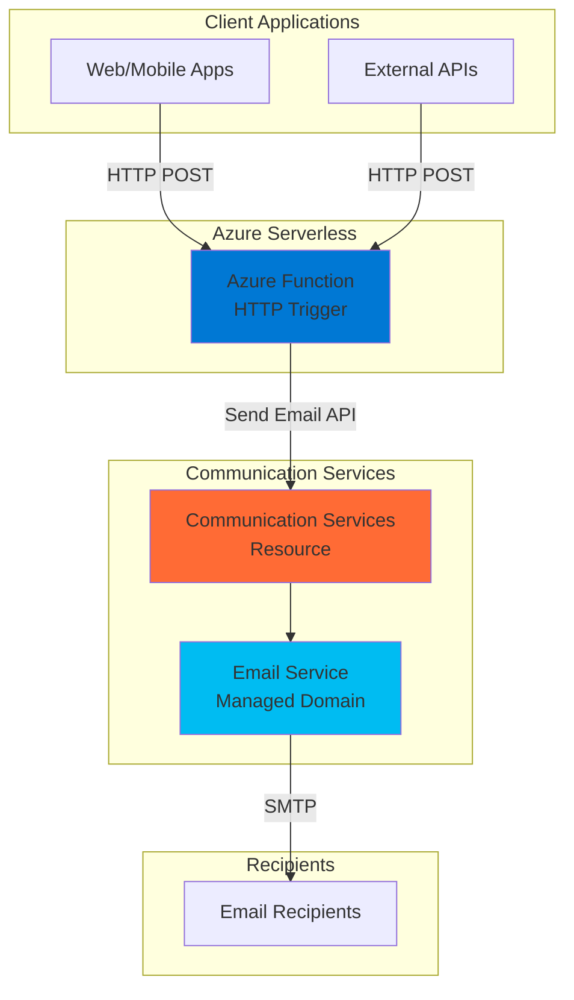

# Simple Email Notifications with Communication Services

## Problem

Modern applications require reliable email notification systems to communicate with users about important events, confirmations, and alerts. Traditional email solutions often require managing mail servers, handling authentication, and dealing with deliverability issues. Organizations need a simple, scalable way to send transactional emails without the overhead of infrastructure management or complex integration workflows.

## Solution

Create a serverless email notification system using Azure Communication Services and Azure Functions. This solution combines Azure Functions' HTTP trigger capabilities with Communication Services' managed email platform to deliver reliable, cost-effective email notifications. The serverless architecture automatically scales based on demand while Azure Communication Services handles email authentication, delivery tracking, and compliance requirements.

## Architecture Diagram



## Prerequisites

1. Azure account with an active subscription and permissions to create resources
2. Azure CLI installed and configured (or use Azure Cloud Shell)
3. Basic understanding of HTTP APIs and JSON
4. Node.js 18+ installed locally (for testing)
5. Estimated cost: $0.01-$0.05 USD for testing (minimal charges for function execution and email sending)

> **Note**: This recipe uses Azure managed domains for email sending, which provides a quick setup without domain verification requirements.

## Preparation

```bash
# Set environment variables for Azure resources
export LOCATION="eastus"
export SUBSCRIPTION_ID=$(az account show --query id --output tsv)

# Generate unique suffix for resource names
RANDOM_SUFFIX=$(openssl rand -hex 3)

# Set specific resource names
export RESOURCE_GROUP="rg-email-notifications-${RANDOM_SUFFIX}"
export COMMUNICATION_SERVICE="cs-email-${RANDOM_SUFFIX}"
export EMAIL_SERVICE="email-service-${RANDOM_SUFFIX}"
export FUNCTION_APP="func-email-${RANDOM_SUFFIX}"
export STORAGE_ACCOUNT="stemail${RANDOM_SUFFIX}"

# Create resource group
az group create \
    --name ${RESOURCE_GROUP} \
    --location ${LOCATION} \
    --tags purpose=recipe environment=demo

echo "✅ Resource group created: ${RESOURCE_GROUP}"
```

## Steps

1. **Create Azure Communication Services Resource**:

   Azure Communication Services provides enterprise-grade email capabilities with built-in authentication, deliverability optimization, and compliance features. The service handles SPF, DKIM, and DMARC configurations automatically for managed domains, eliminating the complexity of email authentication setup.

   ```bash
   # Create Communication Services resource
   az communication create \
       --name ${COMMUNICATION_SERVICE} \
       --resource-group ${RESOURCE_GROUP} \
       --location "Global" \
       --data-location "United States"
   
   # Get the connection string for the Communication Services resource
   COMMUNICATION_CONNECTION_STRING=$(az communication list-key \
       --name ${COMMUNICATION_SERVICE} \
       --resource-group ${RESOURCE_GROUP} \
       --query primaryConnectionString \
       --output tsv)
   
   echo "✅ Communication Services resource created: ${COMMUNICATION_SERVICE}"
   ```

   The Communication Services resource now provides the foundation for secure email operations with built-in encryption and global availability.

2. **Create Email Communication Service with Managed Domain**:

   Azure managed domains provide immediate email sending capabilities without domain ownership verification. These domains use the format `*.azurecomm.net` and come pre-configured with proper authentication records for reliable email delivery.

   ```bash
   # Create Email Communication Service
   az communication email create \
       --name ${EMAIL_SERVICE} \
       --resource-group ${RESOURCE_GROUP} \
       --location "Global" \
       --data-location "United States"
   
   # Add Azure managed domain to email service
   az communication email domain create \
       --domain-name AzureManagedDomain \
       --email-service-name ${EMAIL_SERVICE} \
       --resource-group ${RESOURCE_GROUP} \
       --location "Global" \
       --domain-management AzureManaged
   
   echo "✅ Email service created with managed domain"
   ```

   The managed domain is now ready for email sending with Azure handling all authentication and deliverability configurations.

3. **Connect Email Service to Communication Services**:

   Linking the email service to Communication Services enables the email sending APIs to work with your managed domain. This connection allows the Function App to send emails through the Communication Services SDK.

   ```bash
   # Get the managed domain details for sender address
   SENDER_DOMAIN=$(az communication email domain show \
       --domain-name AzureManagedDomain \
       --email-service-name ${EMAIL_SERVICE} \
       --resource-group ${RESOURCE_GROUP} \
       --query fromSenderDomain \
       --output tsv)
   
   # Link the email service to communication services
   az communication email domain update \
       --domain-name AzureManagedDomain \
       --email-service-name ${EMAIL_SERVICE} \
       --resource-group ${RESOURCE_GROUP} \
       --add linked-domains=${COMMUNICATION_SERVICE}
   
   echo "✅ Email service connected to Communication Services"
   echo "Sender domain: ${SENDER_DOMAIN}"
   ```

   Your Communication Services resource can now send emails using the managed domain with proper authentication.

4. **Create Storage Account for Function App**:

   Azure Functions requires a storage account for function execution state, triggers, and logging. The storage account provides the backing storage for the serverless function runtime and ensures reliable function execution across scale events.

   ```bash
   # Create storage account for Function App
   az storage account create \
       --name ${STORAGE_ACCOUNT} \
       --resource-group ${RESOURCE_GROUP} \
       --location ${LOCATION} \
       --sku Standard_LRS \
       --kind StorageV2
   
   echo "✅ Storage account created: ${STORAGE_ACCOUNT}"
   ```

5. **Create Function App with Node.js Runtime**:

   Azure Functions provides serverless compute that automatically scales based on demand. The consumption plan ensures you only pay for actual function executions, making it cost-effective for email notification scenarios with variable load patterns.

   ```bash
   # Create Function App
   az functionapp create \
       --name ${FUNCTION_APP} \
       --resource-group ${RESOURCE_GROUP} \
       --storage-account ${STORAGE_ACCOUNT} \
       --consumption-plan-location ${LOCATION} \
       --runtime node \
       --runtime-version 18 \
       --functions-version 4 \
       --os-type Linux
   
   # Configure application settings for Communication Services
   az functionapp config appsettings set \
       --name ${FUNCTION_APP} \
       --resource-group ${RESOURCE_GROUP} \
       --settings \
       "COMMUNICATION_SERVICES_CONNECTION_STRING=${COMMUNICATION_CONNECTION_STRING}" \
       "SENDER_ADDRESS=donotreply@${SENDER_DOMAIN}"
   
   echo "✅ Function App created: ${FUNCTION_APP}"
   ```

   The Function App is now configured with the Communication Services connection string and sender address for email operations.

6. **Deploy Function Code for Email Sending**:

   The function code implements an HTTP trigger that accepts email requests and uses the Azure Communication Services SDK to send emails. The function validates input parameters and provides proper error handling for production reliability.

   ```bash
   # Create function code locally
   mkdir -p ./email-function
   cd ./email-function
   
   # Create host.json for Function App configuration
   cat > host.json << 'EOF'
   {
     "version": "2.0",
     "functionTimeout": "00:05:00",
     "logging": {
       "applicationInsights": {
         "samplingSettings": {
           "isEnabled": true
         }
       }
     }
   }
   EOF
   
   # Create package.json
   cat > package.json << 'EOF'
   {
     "name": "email-notification-function",
     "version": "1.0.0",
     "description": "Azure Function for sending email notifications",
     "main": "index.js",
     "scripts": {
       "start": "func start"
     },
     "dependencies": {
       "@azure/communication-email": "^1.0.0",
       "@azure/functions": "^4.0.0"
     }
   }
   EOF
   
   # Create function configuration
   cat > function.json << 'EOF'
   {
     "bindings": [
       {
         "authLevel": "function",
         "type": "httpTrigger",
         "direction": "in",
         "name": "req",
         "methods": ["post"]
       },
       {
         "type": "http",
         "direction": "out",
         "name": "res"
       }
     ]
   }
   EOF
   
   # Create function implementation
   cat > index.js << 'EOF'
   const { EmailClient } = require("@azure/communication-email");
   
   module.exports = async function (context, req) {
       context.log('Email notification function triggered');
   
       // Validate request body
       const { to, subject, body } = req.body || {};
       
       if (!to || !subject || !body) {
           context.res = {
               status: 400,
               body: {
                   error: "Missing required fields: to, subject, body"
               }
           };
           return;
       }
   
       try {
           // Initialize email client
           const emailClient = new EmailClient(
               process.env.COMMUNICATION_SERVICES_CONNECTION_STRING
           );
   
           // Prepare email message
           const emailMessage = {
               senderAddress: process.env.SENDER_ADDRESS,
               content: {
                   subject: subject,
                   plainText: body
               },
               recipients: {
                   to: [{ address: to }]
               }
           };
   
           // Send email
           const poller = await emailClient.beginSend(emailMessage);
           const response = await poller.pollUntilDone();
   
           context.log(`Email sent successfully. Message ID: ${response.id}`);
   
           context.res = {
               status: 200,
               body: {
                   message: "Email sent successfully",
                   messageId: response.id,
                   status: response.status
               }
           };
   
       } catch (error) {
           context.log.error('Error sending email:', error);
   
           context.res = {
               status: 500,
               body: {
                   error: "Failed to send email",
                   details: error.message
               }
           };
       }
   };
   EOF
   
   echo "✅ Function code created"
   ```

7. **Deploy Function to Azure**:

   The deployment process packages the function code and uploads it to Azure Functions. The Azure platform automatically installs dependencies and configures the runtime environment for optimal performance.

   ```bash
   # Create deployment package
   zip -r ../email-function.zip . \
       --exclude "node_modules/*" ".git/*"
   
   cd ..
   
   # Deploy function code
   az functionapp deployment source config-zip \
       --name ${FUNCTION_APP} \
       --resource-group ${RESOURCE_GROUP} \
       --src email-function.zip
   
   # Wait for deployment to complete
   sleep 30
   
   # Get function URL with access key
   FUNCTION_KEY=$(az functionapp keys list \
       --name ${FUNCTION_APP} \
       --resource-group ${RESOURCE_GROUP} \
       --query functionKeys.default \
       --output tsv)
   
   FUNCTION_URL="https://${FUNCTION_APP}.azurewebsites.net/api/index?code=${FUNCTION_KEY}"
   
   echo "✅ Function deployed successfully"
   echo "Function URL: ${FUNCTION_URL}"
   ```

## Validation & Testing

1. **Test email sending functionality**:

   ```bash
   # Test the email function with a sample request
   curl -X POST "${FUNCTION_URL}" \
       -H "Content-Type: application/json" \
       -d '{
           "to": "your-email@example.com",
           "subject": "Test Email from Azure Functions",
           "body": "This is a test email sent from Azure Functions using Communication Services."
       }'
   ```

   Expected output: JSON response with success status and message ID.

2. **Verify function logs**:

   ```bash
   # Check function execution logs
   az functionapp logs tail \
       --name ${FUNCTION_APP} \
       --resource-group ${RESOURCE_GROUP}
   ```

3. **Test error handling**:

   ```bash
   # Test with missing parameters
   curl -X POST "${FUNCTION_URL}" \
       -H "Content-Type: application/json" \
       -d '{
           "subject": "Incomplete Request"
       }'
   ```

   Expected output: 400 status code with error message about missing fields.

## Cleanup

1. **Remove Function App and related resources**:

   ```bash
   # Delete the entire resource group
   az group delete \
       --name ${RESOURCE_GROUP} \
       --yes \
       --no-wait
   
   echo "✅ Resource group deletion initiated: ${RESOURCE_GROUP}"
   echo "Note: Deletion may take several minutes to complete"
   ```

2. **Clean up local files**:

   ```bash
   # Remove local function files
   rm -rf ./email-function
   rm -f email-function.zip
   
   echo "✅ Local files cleaned up"
   ```

## Discussion

This solution demonstrates a modern approach to email notifications using Azure's serverless and communication services. Azure Communication Services provides enterprise-grade email delivery with built-in authentication, spam filtering, and deliverability optimization. The managed domain approach eliminates the need for DNS configuration while maintaining professional email standards through proper SPF, DKIM, and DMARC records that Azure manages automatically.

The serverless architecture using Azure Functions offers several key advantages aligned with Azure Well-Architected Framework principles. The consumption-based pricing model means you only pay for actual email sends, making it cost-effective for applications with variable email volumes. The automatic scaling handles traffic spikes without manual intervention, while the HTTP trigger interface provides easy integration with any application that can make REST API calls.

For production deployments, consider implementing additional features such as email templates, retry logic for failed sends, and integration with Azure Monitor for comprehensive logging and alerting. The Communication Services SDK also supports advanced features like email tracking, delivery receipts, and bulk sending operations for high-volume scenarios. Security considerations include using Azure Key Vault for storing connection strings, implementing proper authentication on the function endpoint, and validating email addresses to prevent abuse.

This architecture follows Azure security best practices by using managed identities where possible, encrypting data in transit, and leveraging Azure's built-in compliance and monitoring capabilities. The solution provides operational excellence through Infrastructure as Code deployment patterns and automated monitoring through Application Insights integration.

> **Tip**: Use Azure Application Insights to monitor function performance and email sending patterns, enabling proactive optimization and troubleshooting of delivery issues.

**Documentation References:**
- [Azure Communication Services Email Overview](https://learn.microsoft.com/en-us/azure/communication-services/concepts/email/prepare-email-communication-resource)
- [Azure Functions HTTP Triggers](https://learn.microsoft.com/en-us/azure/azure-functions/functions-bindings-http-webhook-trigger)
- [Communication Services Email JavaScript SDK](https://learn.microsoft.com/en-us/azure/communication-services/quickstarts/email/send-email)
- [Azure Functions Best Practices](https://learn.microsoft.com/en-us/azure/azure-functions/functions-best-practices)
- [Azure Well-Architected Framework](https://learn.microsoft.com/en-us/azure/architecture/framework/)

## Challenge

Extend this solution by implementing these enhancements:

1. **Email Templates**: Add support for HTML email templates with dynamic content replacement using Azure Blob Storage for template storage
2. **Batch Processing**: Implement queue-based email sending using Azure Service Bus for handling high-volume email scenarios
3. **Delivery Tracking**: Integrate with Azure Event Grid to track email delivery status and handle bounce notifications
4. **Authentication**: Add Azure AD authentication to the function endpoint for secure access control
5. **Multi-tenant Support**: Extend the solution to support multiple sender domains and organizations with proper tenant isolation

## Infrastructure Code

### Available Infrastructure as Code:

- [Infrastructure Code Overview](code/README.md) - Detailed description of all infrastructure components
- [Bicep](code/bicep/) - Azure Bicep templates
- [Bash CLI Scripts](code/scripts/) - Example bash scripts using Azure CLI commands to deploy infrastructure
- [Terraform](code/terraform/) - Terraform configuration files