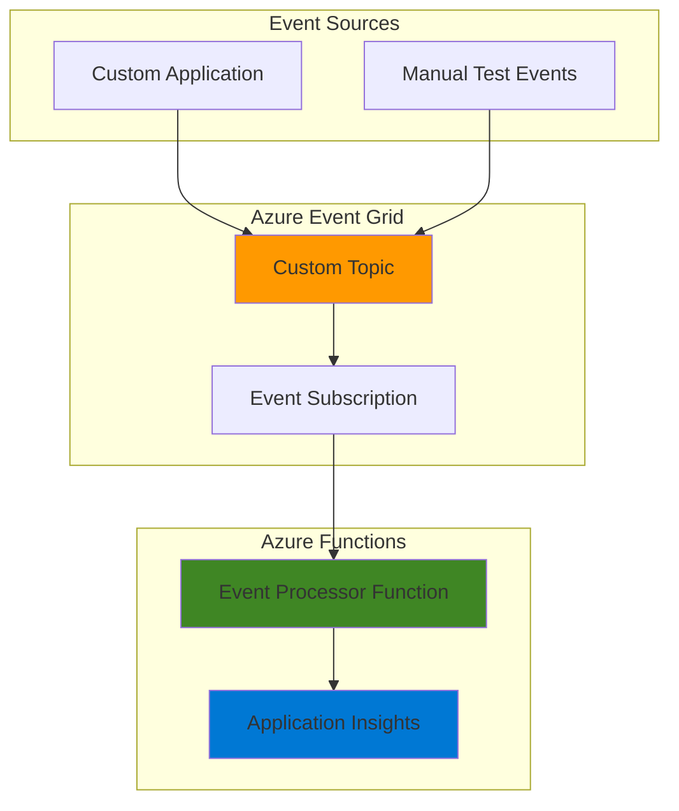

# Simple Event Notifications with Event Grid and Functions

## Problem

Your organization needs to implement a basic event notification system where custom application events trigger automated processing workflows. Current manual processes create delays in responding to business events, and you need a scalable solution that can handle varying workloads without managing infrastructure. The system must route custom events from applications to processing functions while providing reliable delivery and monitoring capabilities.

## Solution

Azure Event Grid provides a fully managed event routing service that seamlessly connects custom event publishers to Azure Functions for serverless event processing. This serverless architecture automatically scales based on event volume, ensures reliable event delivery, and eliminates infrastructure management overhead while providing comprehensive monitoring and logging capabilities.

## Architecture Diagram



## Prerequisites

1. Azure subscription with access to create Event Grid topics and Azure Functions
2. Azure CLI installed and configured (or Azure Cloud Shell access)
3. Basic understanding of serverless computing and event-driven architectures
4. Basic knowledge of JSON for event structure
5. Estimated cost: $2-5 per month for low-volume testing (includes Function App consumption plan and Event Grid operations)

> **Note**: This recipe uses consumption-based pricing models that scale to zero when not in use, making it cost-effective for development and testing scenarios.

## Preparation

```bash
# Set environment variables for Azure resources
export RESOURCE_GROUP="rg-recipe-$(openssl rand -hex 3)"
export LOCATION="eastus"
export SUBSCRIPTION_ID=$(az account show --query id --output tsv)

# Generate unique suffix for resource names
RANDOM_SUFFIX=$(openssl rand -hex 3)

# Set resource names with unique suffixes
export TOPIC_NAME="topic-notifications-${RANDOM_SUFFIX}"
export FUNCTION_APP_NAME="func-processor-${RANDOM_SUFFIX}"
export STORAGE_ACCOUNT="stg${RANDOM_SUFFIX}func"
export SUBSCRIPTION_NAME="sub-event-processor"

# Create resource group
az group create \
    --name ${RESOURCE_GROUP} \
    --location ${LOCATION} \
    --tags purpose=recipe environment=demo

echo "✅ Resource group created: ${RESOURCE_GROUP}"

# Create storage account for Function App
az storage account create \
    --name ${STORAGE_ACCOUNT} \
    --resource-group ${RESOURCE_GROUP} \
    --location ${LOCATION} \
    --sku Standard_LRS \
    --kind StorageV2

echo "✅ Storage account created: ${STORAGE_ACCOUNT}"
```

## Steps

1. **Create Event Grid Custom Topic**:

   Azure Event Grid custom topics provide user-defined endpoints for publishing application events. Custom topics offer flexibility in event schema design and enable you to route events from any application or service to multiple subscribers. This foundational component serves as the entry point for all custom events in your event-driven architecture.

   ```bash
   # Create Event Grid custom topic with Cloud Events schema
   az eventgrid topic create \
       --name ${TOPIC_NAME} \
       --resource-group ${RESOURCE_GROUP} \
       --location ${LOCATION} \
       --input-schema cloudeventschemav1_0
   
   # Get topic endpoint and access key for later use
   export TOPIC_ENDPOINT=$(az eventgrid topic show \
       --name ${TOPIC_NAME} \
       --resource-group ${RESOURCE_GROUP} \
       --query "endpoint" --output tsv)
   
   export TOPIC_KEY=$(az eventgrid topic key list \
       --name ${TOPIC_NAME} \
       --resource-group ${RESOURCE_GROUP} \
       --query "key1" --output tsv)
   
   echo "✅ Event Grid topic created: ${TOPIC_NAME}"
   echo "Topic endpoint: ${TOPIC_ENDPOINT}"
   ```

   The custom topic is now ready to receive events using the Cloud Events v1.0 schema, which provides standardized event structure and interoperability across different systems and platforms. This standardization ensures your events are compatible with other cloud services and third-party systems.

2. **Create Azure Function App with Application Insights**:

   Azure Functions provides serverless compute that automatically scales based on demand. The consumption plan charges only for actual function execution time and provides built-in integration with Event Grid through triggers and bindings. Application Insights enables comprehensive monitoring and logging of function executions.

   ```bash
   # Create Function App on consumption plan with latest Node.js
   az functionapp create \
       --name ${FUNCTION_APP_NAME} \
       --resource-group ${RESOURCE_GROUP} \
       --storage-account ${STORAGE_ACCOUNT} \
       --consumption-plan-location ${LOCATION} \
       --runtime node \
       --runtime-version 20 \
       --functions-version 4
   
   # Create Application Insights component for monitoring
   az monitor app-insights component create \
       --app ${FUNCTION_APP_NAME} \
       --location ${LOCATION} \
       --resource-group ${RESOURCE_GROUP} \
       --application-type web
   
   echo "✅ Function App created with Application Insights: ${FUNCTION_APP_NAME}"
   ```

   The Function App is configured with Node.js 20 runtime (the latest GA version) and Application Insights for comprehensive monitoring and logging of event processing activities. This setup provides production-ready observability for your serverless functions.

3. **Deploy Event Grid Trigger Function**:

   Event Grid triggers enable Azure Functions to automatically execute when events are published to subscribed topics. This integration provides reliable event processing with built-in error handling, retry logic, and dead letter queue support for failed events.

   ```bash
   # Create function code directory
   mkdir -p ./event-processor
   cd ./event-processor
   
   # Create package.json for Node.js function with latest dependencies
   cat > package.json << 'EOF'
   {
     "name": "event-processor",
     "version": "1.0.0",
     "description": "Event Grid triggered function",
     "main": "src/functions/*.js",
     "dependencies": {
       "@azure/functions": "^4.5.0"
     }
   }
   EOF
   
   # Create host.json for Function App configuration
   cat > host.json << 'EOF'
   {
     "version": "2.0",
     "logging": {
       "applicationInsights": {
         "samplingSettings": {
           "isEnabled": true,
           "excludedTypes": "Request"
         }
       }
     },
     "extensionBundle": {
       "id": "Microsoft.Azure.Functions.ExtensionBundle",
       "version": "[4.0.0, 5.0.0)"
     }
   }
   EOF
   
   # Create src/functions directory for the new programming model
   mkdir -p src/functions
   
   # Create function implementation using v4 programming model
   cat > src/functions/eventProcessor.js << 'EOF'
   const { app } = require('@azure/functions');

   app.eventGrid('eventProcessor', {
       handler: (event, context) => {
           context.log('=== Event Grid Trigger Function Executed ===');
           context.log('Event Type:', event.type);
           context.log('Event Subject:', event.subject);
           context.log('Event Time:', event.time);
           context.log('Event Source:', event.source);
           context.log('Event Data:', JSON.stringify(event.data, null, 2));
           
           // Process the event data based on event type
           if (event.data && event.data.message) {
               context.log(`📧 Processing notification: ${event.data.message}`);
               
               // Simulate event processing logic
               if (event.data.priority === 'high') {
                   context.log('⚡ High priority event - processing immediately');
               } else {
                   context.log('📝 Standard priority event - queued for processing');
               }
           }
           
           context.log('✅ Event processed successfully');
       }
   });
   EOF
   
   echo "✅ Function code created using v4 programming model"
   ```

   This function uses the latest Azure Functions v4 programming model with Node.js 20, providing improved performance and developer experience. The function logs detailed event information and demonstrates basic event processing logic based on event properties.

4. **Deploy Function to Azure**:

   ```bash
   # Create deployment package
   zip -r ../event-processor.zip . \
        -x "*.git/*" "node_modules/*"
   cd ..
   
   # Deploy function code to Azure
   az functionapp deployment source config-zip \
       --resource-group ${RESOURCE_GROUP} \
       --name ${FUNCTION_APP_NAME} \
       --src event-processor.zip
   
   # Wait for deployment to complete
   echo "⏳ Waiting for deployment to complete..."
   sleep 45
   
   echo "✅ Function deployed to Azure"
   
   # Get function app URL for Event Grid subscription
   export FUNCTION_URL="https://${FUNCTION_APP_NAME}.azurewebsites.net"
   echo "Function App URL: ${FUNCTION_URL}"
   ```

   The deployment package is optimized by excluding unnecessary files, and we wait for the deployment to complete before proceeding. This ensures the function is ready to receive events from Event Grid.

5. **Create Event Grid Subscription**:

   Event subscriptions define the routing between Event Grid topics and event handlers. This configuration enables automatic function invocation when events are published to the topic, with built-in filtering, retry policies, and delivery guarantees.

   ```bash
   # Create event subscription linking topic to function
   az eventgrid event-subscription create \
       --name ${SUBSCRIPTION_NAME} \
       --source-resource-id "/subscriptions/${SUBSCRIPTION_ID}/resourceGroups/${RESOURCE_GROUP}/providers/Microsoft.EventGrid/topics/${TOPIC_NAME}" \
       --endpoint "${FUNCTION_URL}/runtime/webhooks/eventgrid?functionName=eventProcessor" \
       --endpoint-type webhook \
       --event-delivery-schema cloudeventschemav1_0
   
   echo "✅ Event subscription created: ${SUBSCRIPTION_NAME}"
   
   # Verify subscription status
   SUBSCRIPTION_STATUS=$(az eventgrid event-subscription show \
       --name ${SUBSCRIPTION_NAME} \
       --source-resource-id "/subscriptions/${SUBSCRIPTION_ID}/resourceGroups/${RESOURCE_GROUP}/providers/Microsoft.EventGrid/topics/${TOPIC_NAME}" \
       --query "provisioningState" --output tsv)
   
   echo "Subscription status: ${SUBSCRIPTION_STATUS}"
   ```

   The subscription now automatically routes all events from the custom topic to the Azure Function using the Cloud Events v1.0 schema. Event Grid provides reliable delivery with automatic retries and dead lettering for failed deliveries.

6. **Send Test Event**:

   Testing event flow validates the complete integration between Event Grid and Azure Functions. This step demonstrates how applications can publish custom events that trigger automated processing workflows.

   ```bash
   # Create sample event data using Cloud Events v1.0 format
   EVENT_DATA=$(cat << EOF
   [{
     "id": "$(uuidgen)",
     "source": "recipe-demo",
     "specversion": "1.0",
     "type": "notification.created",
     "subject": "demo/notifications",
     "time": "$(date -u +%Y-%m-%dT%H:%M:%SZ)",
     "data": {
       "message": "Hello from Event Grid!",
       "priority": "high",
       "category": "demo",
       "userId": "user123"
     }
   }]
   EOF
   )
   
   # Send event to Event Grid topic
   curl -X POST \
       -H "aeg-sas-key: ${TOPIC_KEY}" \
       -H "Content-Type: application/json" \
       -d "${EVENT_DATA}" \
       "${TOPIC_ENDPOINT}/api/events"
   
   echo "✅ Test event sent to Event Grid topic"
   echo "🔍 Check Function App logs to verify event processing"
   echo "Portal URL: https://portal.azure.com/#@/resource/subscriptions/${SUBSCRIPTION_ID}/resourceGroups/${RESOURCE_GROUP}/providers/Microsoft.Web/sites/${FUNCTION_APP_NAME}/functions"
   ```

   The test event uses the Cloud Events v1.0 format with realistic business data, demonstrating how real applications would publish events to trigger processing workflows.

## Validation & Testing

1. **Verify Event Grid Topic Creation**:

   ```bash
   # Check topic status and configuration
   az eventgrid topic show \
       --name ${TOPIC_NAME} \
       --resource-group ${RESOURCE_GROUP} \
       --output table
   
   # Verify topic endpoint accessibility
   echo "Topic endpoint: ${TOPIC_ENDPOINT}"
   ```

   Expected output: Topic should show "Succeeded" provisioning state and display endpoint URL.

2. **Validate Function App Deployment**:

   ```bash
   # Check Function App status
   FUNCTION_STATE=$(az functionapp show \
       --name ${FUNCTION_APP_NAME} \
       --resource-group ${RESOURCE_GROUP} \
       --query "state" --output tsv)
   
   echo "Function App state: ${FUNCTION_STATE}"
   
   # List deployed functions
   az functionapp function list \
       --name ${FUNCTION_APP_NAME} \
       --resource-group ${RESOURCE_GROUP} \
       --output table
   ```

   Expected output: Function App state should be "Running" and eventProcessor function should be listed.

3. **Test Event Processing with Multiple Scenarios**:

   ```bash
   # Send high priority event
   HIGH_PRIORITY_EVENT=$(cat << EOF
   [{
     "id": "$(uuidgen)",
     "source": "validation-test",
     "specversion": "1.0",
     "type": "alert.created",
     "subject": "system/alerts",
     "time": "$(date -u +%Y-%m-%dT%H:%M:%SZ)",
     "data": {
       "message": "System alert triggered",
       "priority": "high",
       "alertType": "cpu-usage",
       "threshold": 85
     }
   }]
   EOF
   )
   
   curl -X POST \
       -H "aeg-sas-key: ${TOPIC_KEY}" \
       -H "Content-Type: application/json" \
       -d "${HIGH_PRIORITY_EVENT}" \
       "${TOPIC_ENDPOINT}/api/events"
   
   echo "✅ High priority validation event sent"
   
   # Send standard priority event
   STANDARD_EVENT=$(cat << EOF
   [{
     "id": "$(uuidgen)",
     "source": "validation-test",
     "specversion": "1.0",
     "type": "user.action",
     "subject": "user/profile",
     "time": "$(date -u +%Y-%m-%dT%H:%M:%SZ)",
     "data": {
       "message": "User profile updated",
       "priority": "normal",
       "action": "profile-update",
       "userId": "user456"
     }
   }]
   EOF
   )
   
   curl -X POST \
       -H "aeg-sas-key: ${TOPIC_KEY}" \
       -H "Content-Type: application/json" \
       -d "${STANDARD_EVENT}" \
       "${TOPIC_ENDPOINT}/api/events"
   
   echo "✅ Standard priority validation event sent"
   ```

4. **Monitor Function Execution Logs**:

   ```bash
   # Get recent function logs using Azure CLI
   echo "📊 Checking recent function invocations..."
   
   # Check function app logs (requires log streaming to be enabled)
   az webapp log tail \
       --name ${FUNCTION_APP_NAME} \
       --resource-group ${RESOURCE_GROUP} \
       --provider application &
   
   # Display portal links for monitoring
   echo ""
   echo "🔗 Monitoring URLs:"
   echo "Function App: https://portal.azure.com/#@/resource/subscriptions/${SUBSCRIPTION_ID}/resourceGroups/${RESOURCE_GROUP}/providers/Microsoft.Web/sites/${FUNCTION_APP_NAME}"
   echo "Application Insights: https://portal.azure.com/#@/resource/subscriptions/${SUBSCRIPTION_ID}/resourceGroups/${RESOURCE_GROUP}/providers/microsoft.insights/components/${FUNCTION_APP_NAME}"
   ```

## Cleanup

1. **Remove Event Grid Resources**:

   ```bash
   # Delete event subscription first
   az eventgrid event-subscription delete \
       --name ${SUBSCRIPTION_NAME} \
       --source-resource-id "/subscriptions/${SUBSCRIPTION_ID}/resourceGroups/${RESOURCE_GROUP}/providers/Microsoft.EventGrid/topics/${TOPIC_NAME}"
   
   # Delete Event Grid topic
   az eventgrid topic delete \
       --name ${TOPIC_NAME} \
       --resource-group ${RESOURCE_GROUP}
   
   echo "✅ Event Grid resources deleted"
   ```

2. **Remove Azure Functions Resources**:

   ```bash
   # Delete Function App (Application Insights is automatically deleted)
   az functionapp delete \
       --name ${FUNCTION_APP_NAME} \
       --resource-group ${RESOURCE_GROUP}
   
   # Delete storage account
   az storage account delete \
       --name ${STORAGE_ACCOUNT} \
       --resource-group ${RESOURCE_GROUP} \
       --yes
   
   echo "✅ Function App and storage account deleted"
   ```

3. **Remove Resource Group**:

   ```bash
   # Delete resource group and all remaining resources
   az group delete \
       --name ${RESOURCE_GROUP} \
       --yes \
       --no-wait
   
   echo "✅ Resource group deletion initiated: ${RESOURCE_GROUP}"
   echo "Note: Deletion may take several minutes to complete"
   
   # Clean up local files
   rm -rf ./event-processor
   rm -f event-processor.zip
   
   # Stop log streaming if still running
   pkill -f "az webapp log tail" 2>/dev/null || true
   ```

## Discussion

Azure Event Grid serves as a fully managed event routing service that simplifies building event-driven architectures by decoupling event publishers from event consumers. This serverless approach eliminates the need to manage message brokers or polling mechanisms while providing guaranteed event delivery, automatic retry logic, and comprehensive monitoring capabilities. The integration with Azure Functions creates a powerful combination for processing events at scale without infrastructure management overhead, following the Azure Well-Architected Framework principles of operational excellence and reliability.

The consumption-based pricing model for both services ensures cost optimization by charging only for actual usage, making this architecture particularly suitable for workloads with variable event volumes. Event Grid supports multiple event schemas including Cloud Events v1.0, providing standardization and interoperability across different systems and cloud providers. The built-in dead letter queue functionality ensures that failed events are preserved for troubleshooting and reprocessing, maintaining system reliability even when downstream services experience issues. For more information on event schemas, see the [Azure Event Grid documentation](https://learn.microsoft.com/en-us/azure/event-grid/event-schema).

This architecture pattern scales automatically based on event volume, from zero to thousands of events per second, while maintaining consistent performance and reliability. The serverless nature of both components eliminates the traditional operational overhead associated with maintaining message queuing infrastructure, allowing development teams to focus on business logic rather than infrastructure management. The Azure Functions v4 programming model used in this recipe provides improved performance, better TypeScript support, and a more flexible project structure compared to earlier versions.

Production implementations should leverage Application Insights for comprehensive monitoring, implement proper error handling with exponential backoff strategies, and consider using managed identities for secure authentication between services. The architecture supports advanced patterns such as event sourcing, CQRS, and saga orchestration when combined with additional Azure services like Cosmos DB for event storage and Service Bus for complex routing scenarios. For enterprise scenarios, consider implementing event filtering at the subscription level and using Azure Monitor alerts for proactive incident response.

> **Tip**: Use Event Grid's advanced filtering capabilities to route specific event types to different Azure Functions, enabling specialized processing workflows and reducing unnecessary function invocations to optimize costs and improve performance.

## Challenge

Extend this solution by implementing these enhancements:

1. **Add Event Filtering**: Configure the Event Grid subscription to filter events by type or subject, routing only specific events to the function while ignoring others for more efficient processing and cost optimization.

2. **Implement Dead Letter Queue**: Configure a dead letter queue using Azure Service Bus to handle failed event processing, enabling retry logic and failure analysis for improved reliability and compliance requirements.

3. **Create Multiple Event Handlers**: Deploy additional Azure Functions for different event types, demonstrating fan-out messaging patterns where a single event triggers multiple processing workflows across different business domains.

4. **Add Event Persistence**: Integrate Azure Cosmos DB to store processed events, creating an audit trail and enabling event replay capabilities for debugging, compliance, and business intelligence requirements.

5. **Build Event Analytics Dashboard**: Use Azure Stream Analytics and Power BI to create real-time dashboards showing event processing metrics, failure rates, and business insights from the event data for operational monitoring.

## Infrastructure Code

### Available Infrastructure as Code:

- [Infrastructure Code Overview](code/README.md) - Detailed description of all infrastructure components
- [Bicep](code/bicep/) - Azure Bicep templates
- [Bash CLI Scripts](code/scripts/) - Example bash scripts using Azure CLI commands to deploy infrastructure
- [Terraform](code/terraform/) - Terraform configuration files