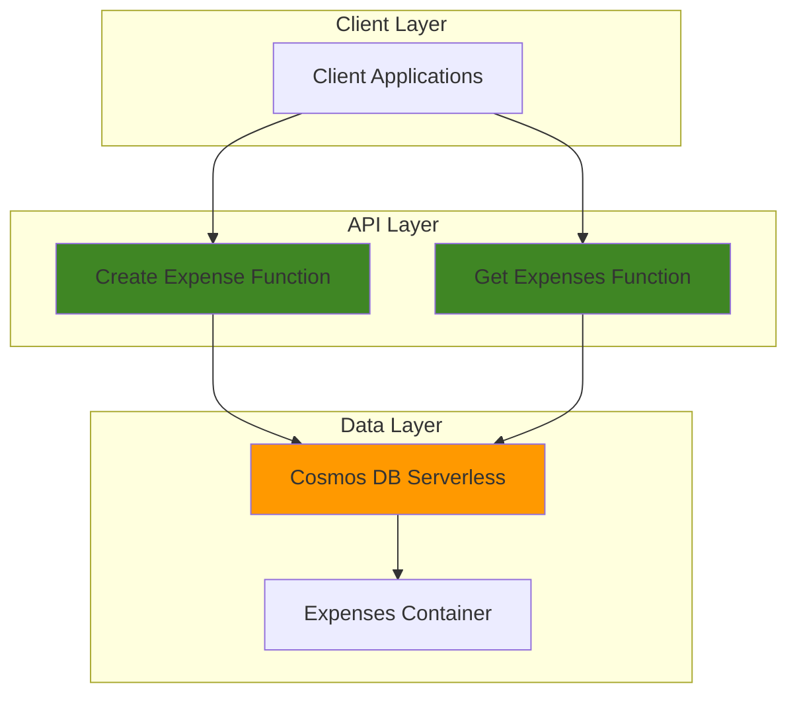

# Simple Expense Tracker with Cosmos DB and Functions

## Problem

Personal expense tracking often requires a simple yet reliable way to record, categorize, and retrieve financial transactions. Traditional solutions are complex, expensive, or lack the flexibility to scale based on usage patterns. Small-scale applications need cost-effective data storage that charges only for actual usage while providing fast, reliable access to expense records.

## Solution

Build a serverless expense tracking API using Azure Cosmos DB for NoSQL document storage and Azure Functions for HTTP-triggered operations. This solution leverages Azure's consumption-based pricing models, automatically scales with demand, and provides a simple REST API for expense management operations including create, read, and category-based filtering.

## Architecture Diagram



## Prerequisites

1. Azure account with appropriate permissions to create Cosmos DB and Function App resources
2. Azure CLI installed and configured (or Azure Cloud Shell)
3. Basic understanding of REST APIs and JSON data structures
4. Understanding of serverless computing concepts
5. Estimated cost: $0.01-$5.00 per month for light usage (serverless tiers)

> **Note**: This recipe uses Azure's serverless offerings that charge only for actual usage, making it ideal for learning and small-scale applications.

## Preparation

```bash
# Generate unique suffix for resource names
RANDOM_SUFFIX=$(openssl rand -hex 3)

# Set environment variables for Azure resources
export RESOURCE_GROUP="rg-expense-tracker-${RANDOM_SUFFIX}"
export LOCATION="eastus"
export SUBSCRIPTION_ID=$(az account show --query id --output tsv)

# Set unique resource names
export COSMOS_ACCOUNT="cosmos-expenses-${RANDOM_SUFFIX}"
export FUNCTION_APP="func-expenses-${RANDOM_SUFFIX}"
export STORAGE_ACCOUNT="stexpenses${RANDOM_SUFFIX}"

# Create resource group
az group create \
    --name ${RESOURCE_GROUP} \
    --location ${LOCATION} \
    --tags purpose=recipe environment=demo

echo "✅ Resource group created: ${RESOURCE_GROUP}"
```

## Steps

1. **Create Azure Cosmos DB Serverless Account**:

   Azure Cosmos DB serverless provides consumption-based pricing that's perfect for expense tracking applications with intermittent usage patterns. The serverless model charges only for the request units (RUs) consumed by database operations and storage used, making it cost-effective for small to medium workloads with unpredictable traffic.

   ```bash
   # Create Cosmos DB account in serverless mode
   az cosmosdb create \
       --name ${COSMOS_ACCOUNT} \
       --resource-group ${RESOURCE_GROUP} \
       --locations regionName=${LOCATION} \
       --capabilities EnableServerless \
       --default-consistency-level Session
   
   echo "✅ Cosmos DB serverless account created: ${COSMOS_ACCOUNT}"
   ```

   The serverless account is now configured with Session consistency level, which provides the optimal balance between performance and data consistency for expense tracking scenarios. This configuration ensures read-your-writes consistency while maintaining low latency for API operations.

2. **Create Database and Container**:

   Azure Cosmos DB organizes data into databases and containers. For our expense tracker, we'll create a dedicated database and container optimized for expense document storage with partitioning based on user identification to ensure efficient queries and scalability.

   ```bash
   # Create database
   az cosmosdb sql database create \
       --account-name ${COSMOS_ACCOUNT} \
       --resource-group ${RESOURCE_GROUP} \
       --name ExpenseDB
   
   # Create container with partition key for user-based partitioning
   az cosmosdb sql container create \
       --account-name ${COSMOS_ACCOUNT} \
       --resource-group ${RESOURCE_GROUP} \
       --database-name ExpenseDB \
       --name Expenses \
       --partition-key-path "/userId"
   
   echo "✅ Database and container created successfully"
   ```

   The container uses `/userId` as the partition key, which ensures that all expenses for a specific user are stored together. This partitioning strategy enables efficient queries when filtering expenses by user and provides optimal performance for typical expense tracking patterns.

3. **Retrieve Cosmos DB Connection String**:

   Azure Functions require connection strings to authenticate and connect to Cosmos DB. The connection string contains the necessary credentials and endpoint information for secure database access through the Azure Cosmos DB SDK.

   ```bash
   # Get the primary connection string
   export COSMOS_CONNECTION_STRING=$(az cosmosdb keys list \
       --name ${COSMOS_ACCOUNT} \
       --resource-group ${RESOURCE_GROUP} \
       --type connection-strings \
       --query 'connectionStrings[0].connectionString' \
       --output tsv)
   
   echo "✅ Connection string retrieved and stored"
   ```

4. **Create Storage Account for Function App**:

   Azure Functions require a storage account for metadata, triggers, and logging. This storage account provides the backend infrastructure needed for function execution and state management in the consumption plan.

   ```bash
   # Create storage account for Functions
   az storage account create \
       --name ${STORAGE_ACCOUNT} \
       --resource-group ${RESOURCE_GROUP} \
       --location ${LOCATION} \
       --sku Standard_LRS \
       --kind StorageV2
   
   echo "✅ Storage account created: ${STORAGE_ACCOUNT}"
   ```

5. **Create Function App with Cosmos DB Integration**:

   Azure Functions in consumption plan provide serverless compute that automatically scales based on demand. The function app will host our HTTP-triggered functions for expense management operations with built-in integration to Cosmos DB.

   ```bash
   # Create Function App
   az functionapp create \
       --name ${FUNCTION_APP} \
       --resource-group ${RESOURCE_GROUP} \
       --storage-account ${STORAGE_ACCOUNT} \
       --consumption-plan-location ${LOCATION} \
       --runtime node \
       --functions-version 4 \
       --os-type Linux
   
   # Configure Cosmos DB connection
   az functionapp config appsettings set \
       --name ${FUNCTION_APP} \
       --resource-group ${RESOURCE_GROUP} \
       --settings "CosmosDBConnection=${COSMOS_CONNECTION_STRING}"
   
   echo "✅ Function App created with Cosmos DB connection configured"
   ```

   The Function App is now configured with Node.js runtime and the latest Functions runtime version. The Cosmos DB connection string is stored as an application setting, enabling secure access to the database from function code.

6. **Deploy Create Expense Function**:

   This function handles HTTP POST requests to create new expense records. It validates input data, adds metadata like timestamps, and stores the expense document in Cosmos DB with proper error handling.

   ```bash
   # Create function directory structure
   mkdir -p expense-functions/CreateExpense
   
   # Create function.json for HTTP trigger and Cosmos DB output
   cat > expense-functions/CreateExpense/function.json << 'EOF'
   {
     "bindings": [
       {
         "authLevel": "function",
         "type": "httpTrigger",
         "direction": "in",
         "name": "req",
         "methods": ["post"]
       },
       {
         "type": "http",
         "direction": "out",
         "name": "res"
       },
       {
         "type": "cosmosDB",
         "direction": "out",
         "name": "expense",
         "databaseName": "ExpenseDB",
         "containerName": "Expenses",
         "connection": "CosmosDBConnection",
         "createIfNotExists": false
       }
     ]
   }
   EOF
   
   # Create function code
   cat > expense-functions/CreateExpense/index.js << 'EOF'
   module.exports = async function (context, req) {
       try {
           const { amount, category, description, userId } = req.body;
           
           if (!amount || !category || !userId) {
               context.res = {
                   status: 400,
                   body: { error: "Missing required fields: amount, category, userId" }
               };
               return;
           }
           
           const expense = {
               id: require('crypto').randomUUID(),
               amount: parseFloat(amount),
               category: category,
               description: description || "",
               userId: userId,
               createdAt: new Date().toISOString()
           };
           
           context.bindings.expense = expense;
           
           context.res = {
               status: 201,
               body: expense
           };
       } catch (error) {
           context.res = {
               status: 500,
               body: { error: "Internal server error" }
           };
       }
   };
   EOF
   
   echo "✅ Create Expense function prepared"
   ```

7. **Deploy Get Expenses Function**:

   This function retrieves expense records for a specific user with optional category filtering. It demonstrates efficient querying patterns and proper HTTP response formatting for RESTful APIs.

   ```bash
   # Create GetExpenses function
   mkdir -p expense-functions/GetExpenses
   
   cat > expense-functions/GetExpenses/function.json << 'EOF'
   {
     "bindings": [
       {
         "authLevel": "function",
         "type": "httpTrigger",
         "direction": "in",
         "name": "req",
         "methods": ["get"]
       },
       {
         "type": "http",
         "direction": "out",
         "name": "res"
       },
       {
         "type": "cosmosDB",
         "direction": "in",
         "name": "expenses",
         "databaseName": "ExpenseDB",
         "containerName": "Expenses",
         "connection": "CosmosDBConnection",
         "sqlQuery": "SELECT * FROM c WHERE c.userId = {userId} AND (IS_NULL({category}) OR c.category = {category}) ORDER BY c.createdAt DESC"
       }
     ]
   }
   EOF
   
   cat > expense-functions/GetExpenses/index.js << 'EOF'
   module.exports = async function (context, req) {
       try {
           const userId = req.query.userId;
           const category = req.query.category;
           
           if (!userId) {
               context.res = {
                   status: 400,
                   body: { error: "Missing required query parameter: userId" }
               };
               return;
           }
           
           context.res = {
               status: 200,
               body: {
                   expenses: context.bindings.expenses || [],
                   count: context.bindings.expenses ? context.bindings.expenses.length : 0,
                   filteredBy: category ? { category } : null
               }
           };
       } catch (error) {
           context.res = {
               status: 500,
               body: { error: "Internal server error" }
           };
       }
   };
   EOF
   
   echo "✅ Get Expenses function prepared"
   ```

8. **Deploy Functions to Azure**:

   Azure Functions support multiple deployment methods. For this recipe, we'll use ZIP deployment to upload our function code directly to the Function App, enabling immediate testing and usage.

   ```bash
   # Create deployment package
   cd expense-functions
   zip -r ../functions.zip .
   cd ..
   
   # Deploy functions to Azure
   az functionapp deployment source config-zip \
       --name ${FUNCTION_APP} \
       --resource-group ${RESOURCE_GROUP} \
       --src functions.zip
   
   # Wait for deployment to complete
   sleep 30
   
   echo "✅ Functions deployed successfully to Azure"
   ```

## Validation & Testing

1. **Verify Function App is running**:

   ```bash
   # Check Function App status
   az functionapp show \
       --name ${FUNCTION_APP} \
       --resource-group ${RESOURCE_GROUP} \
       --query "state" \
       --output tsv
   ```

   Expected output: `Running`

2. **Get Function URLs for testing**:

   ```bash
   # Get Create Expense function URL
   CREATE_URL=$(az functionapp function show \
       --function-name CreateExpense \
       --name ${FUNCTION_APP} \
       --resource-group ${RESOURCE_GROUP} \
       --query "invokeUrlTemplate" \
       --output tsv)
   
   # Get GetExpenses function URL  
   GET_URL=$(az functionapp function show \
       --function-name GetExpenses \
       --name ${FUNCTION_APP} \
       --resource-group ${RESOURCE_GROUP} \
       --query "invokeUrlTemplate" \
       --output tsv)
   
   echo "Create Expense URL: ${CREATE_URL}"
   echo "Get Expenses URL: ${GET_URL}"
   ```

3. **Test creating an expense**:

   ```bash
   # Test creating a new expense
   curl -X POST "${CREATE_URL}" \
       -H "Content-Type: application/json" \
       -d '{
         "amount": 15.50,
         "category": "food",
         "description": "Lunch at cafe",
         "userId": "user123"
       }'
   ```

   Expected output: JSON response with created expense including generated ID and timestamp.

4. **Test retrieving expenses**:

   ```bash
   # Test retrieving expenses for a user
   curl "${GET_URL}?userId=user123"
   
   # Test retrieving expenses for a specific category
   curl "${GET_URL}?userId=user123&category=food"
   ```

   Expected output: JSON response with array of expenses for the specified user and optional category filter.

## Cleanup

1. **Remove all Azure resources**:

   ```bash
   # Delete resource group and all contained resources
   az group delete \
       --name ${RESOURCE_GROUP} \
       --yes \
       --no-wait
   
   echo "✅ Resource group deletion initiated: ${RESOURCE_GROUP}"
   echo "Note: Deletion may take several minutes to complete"
   ```

2. **Clean up local files**:

   ```bash
   # Remove local function files
   rm -rf expense-functions functions.zip
   
   # Clear environment variables
   unset RESOURCE_GROUP COSMOS_ACCOUNT FUNCTION_APP STORAGE_ACCOUNT
   unset COSMOS_CONNECTION_STRING RANDOM_SUFFIX
   
   echo "✅ Local cleanup completed"
   ```

## Discussion

This serverless expense tracking solution demonstrates the power of Azure's consumption-based services for building cost-effective applications. Azure Cosmos DB serverless is particularly well-suited for expense tracking because it charges only for actual usage (request units consumed and storage used), making it ideal for applications with variable or unpredictable traffic patterns.

The combination of Azure Functions and Cosmos DB provides several architectural benefits. Azure Functions automatically scale from zero to handle traffic spikes, while Cosmos DB's partitioning strategy ensures consistent performance as data grows. The `/userId` partition key enables efficient queries for user-specific expenses while maintaining optimal performance across different user loads. This architecture follows the [Azure Well-Architected Framework](https://docs.microsoft.com/en-us/azure/architecture/framework/) principles for operational excellence and cost optimization.

Security considerations include using function-level authorization keys and storing connection strings as encrypted application settings. For production deployments, consider implementing Azure Active Directory authentication, enabling HTTPS enforcement, and adding input validation and rate limiting. The [Azure Functions security documentation](https://docs.microsoft.com/en-us/azure/azure-functions/security-concepts) provides comprehensive guidance for securing serverless applications.

Cost optimization is built into this architecture through serverless pricing models. Azure Cosmos DB serverless charges approximately $0.25 per million request units and $0.25 per GB of storage monthly. Azure Functions consumption plan charges $0.20 per million executions plus compute time. For typical expense tracking usage, monthly costs would range from pennies to a few dollars, making this solution extremely cost-effective for personal or small business use. The [Azure pricing calculator](https://azure.microsoft.com/en-us/pricing/calculator/) can help estimate costs for your specific usage patterns.

> **Tip**: Monitor your application using Azure Application Insights to track performance metrics, identify optimization opportunities, and understand usage patterns for better cost management.

## Challenge

Extend this solution by implementing these enhancements:

1. **Add expense categories and budgets**: Create a separate container for budget limits and add validation to check expenses against monthly budgets with alerts when limits are exceeded.

2. **Implement expense analytics**: Build additional functions to calculate monthly summaries, category breakdowns, and spending trends using Cosmos DB's aggregation capabilities.

3. **Add file upload for receipts**: Integrate Azure Blob Storage to store receipt images and associate them with expense records using Azure Functions blob triggers.

4. **Create a web dashboard**: Build a simple web interface using Azure Static Web Apps that consumes your expense tracking API with charts and visualizations.

5. **Implement expense sharing**: Extend the data model to support shared expenses between multiple users with splitting logic and notification capabilities using Azure Service Bus.

## Infrastructure Code

### Available Infrastructure as Code:

- [Infrastructure Code Overview](code/README.md) - Detailed description of all infrastructure components
- [Bicep](code/bicep/) - Azure Bicep templates
- [Bash CLI Scripts](code/scripts/) - Example bash scripts using Azure CLI commands to deploy infrastructure
- [Terraform](code/terraform/) - Terraform configuration files