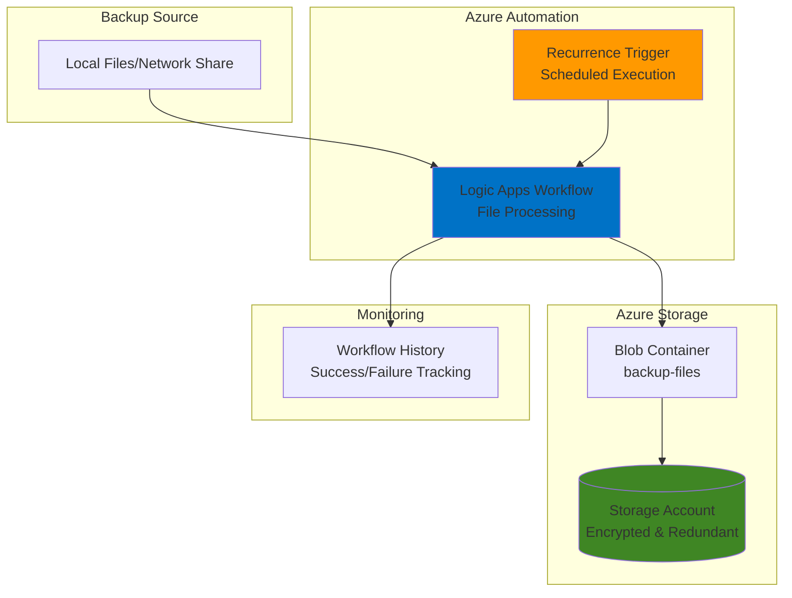

# Simple File Backup Automation using Logic Apps and Storage

## Problem

Small businesses and individual users often struggle with manual file backup processes that are time-consuming, inconsistent, and prone to human error. Without automated backup systems, critical data remains vulnerable to hardware failures, accidental deletions, or ransomware attacks. Manual backup processes frequently get skipped during busy periods, leaving organizations exposed to significant data loss risks that could impact business continuity.

## Solution

Azure Logic Apps provides a serverless workflow automation platform that can schedule and execute file backup operations to Azure Blob Storage without infrastructure management. By combining Logic Apps' Recurrence trigger with Blob Storage connectors, we create an automated backup system that runs on a predefined schedule, copying files from local or network locations to secure cloud storage with built-in redundancy and lifecycle management capabilities.

## Architecture Diagram



## Prerequisites

1. Azure subscription with appropriate permissions to create Logic Apps and Storage accounts
2. Azure CLI installed and configured (version 2.37.0 or later) or Azure Cloud Shell access
3. Logic Apps Azure CLI extension: `az extension add --name logic`
4. Basic understanding of Azure services and file management concepts
5. Local files or network share access for backup testing
6. Estimated cost: $2-5 per month for Logic Apps consumption plan and storage (based on typical small business usage)

> **Note**: This recipe uses Azure's consumption-based pricing model, ensuring cost-effectiveness for small-scale backup operations.

## Preparation

```bash
# Set environment variables for Azure resources
export RESOURCE_GROUP="rg-backup-${RANDOM_SUFFIX}"
export LOCATION="eastus"
export SUBSCRIPTION_ID=$(az account show --query id --output tsv)

# Generate unique suffix for resource names
RANDOM_SUFFIX=$(openssl rand -hex 3)

# Create resource group for backup automation resources
az group create \
    --name ${RESOURCE_GROUP} \
    --location ${LOCATION} \
    --tags purpose=backup environment=demo project=file-automation

echo "✅ Resource group created: ${RESOURCE_GROUP}"

# Set additional environment variables for resources
export STORAGE_ACCOUNT="stbackup${RANDOM_SUFFIX}"
export LOGIC_APP="la-backup-${RANDOM_SUFFIX}"
export CONTAINER_NAME="backup-files"
```

## Steps

1. **Create Storage Account with Security Configuration**:

   Azure Storage provides the foundation for secure, durable file backup with multiple redundancy options and encryption at rest. We'll create a general-purpose v2 storage account optimized for backup scenarios with locally redundant storage (LRS) for cost-effectiveness while maintaining high durability within a single region.

   ```bash
   # Create storage account with security and backup features
   az storage account create \
       --name ${STORAGE_ACCOUNT} \
       --resource-group ${RESOURCE_GROUP} \
       --location ${LOCATION} \
       --sku Standard_LRS \
       --kind StorageV2 \
       --access-tier Cool \
       --allow-blob-public-access false \
       --min-tls-version TLS1_2 \
       --tags purpose=backup environment=demo
   
   echo "✅ Storage account created with security features enabled"
   ```

   The storage account is configured with the Cool access tier for cost-optimized backup storage and security features including TLS 1.2 minimum encryption and disabled public blob access to protect backup data.

2. **Configure Storage Container for Backup Files**:

   Blob containers organize backup files and provide additional security and management capabilities. We'll create a private container specifically for backup files with proper access controls to ensure only authorized applications can access the backup data.

   ```bash
   # Get storage account connection string for authentication
   STORAGE_CONNECTION=$(az storage account show-connection-string \
       --name ${STORAGE_ACCOUNT} \
       --resource-group ${RESOURCE_GROUP} \
       --output tsv)
   
   # Create blob container for backup files
   az storage container create \
       --name ${CONTAINER_NAME} \
       --account-name ${STORAGE_ACCOUNT} \
       --resource-group ${RESOURCE_GROUP} \
       --public-access off \
       --metadata purpose=backup created=$(date -u +%Y-%m-%d)
   
   echo "✅ Backup container created: ${CONTAINER_NAME}"
   ```

   The container is configured with private access to ensure backup files remain secure and accessible only through authenticated connections from the Logic Apps workflow.

3. **Create Logic Apps Workflow for Backup Automation**:

   Logic Apps provides serverless workflow automation with built-in connectors for various data sources and destinations. We'll create a Consumption-based Logic App that offers pay-per-execution pricing and automatic scaling for backup workloads.

   ```bash
   # Install Logic Apps CLI extension if not already installed
   az extension add --name logic --upgrade
   
   # Create basic workflow definition file
   cat > basic-workflow.json << 'EOF'
   {
       "definition": {
           "$schema": "https://schema.management.azure.com/providers/Microsoft.Logic/schemas/2016-06-01/workflowdefinition.json#",
           "contentVersion": "1.0.0.0",
           "parameters": {},
           "triggers": {
               "Recurrence": {
                   "recurrence": {
                       "frequency": "Day",
                       "interval": 1,
                       "schedule": {
                           "hours": ["2"],
                           "minutes": [0]
                       },
                       "timeZone": "Eastern Standard Time"
                   },
                   "type": "Recurrence"
               }
           },
           "actions": {
               "Initialize_backup_status": {
                   "type": "InitializeVariable",
                   "inputs": {
                       "variables": [
                           {
                               "name": "BackupStatus",
                               "type": "String",
                               "value": "Starting backup process"
                           }
                       ]
                   },
                   "runAfter": {}
               },
               "Create_backup_log": {
                   "type": "Http",
                   "inputs": {
                       "method": "PUT",
                       "uri": "https://${STORAGE_ACCOUNT}.blob.core.windows.net/${CONTAINER_NAME}/backup-log-@{formatDateTime(utcNow(), 'yyyy-MM-dd-HH-mm')}.txt",
                       "headers": {
                           "x-ms-blob-type": "BlockBlob",
                           "Content-Type": "text/plain"
                       },
                       "body": "Backup process initiated at @{utcNow()}"
                   },
                   "runAfter": {
                       "Initialize_backup_status": ["Succeeded"]
                   }
               }
           },
           "outputs": {}
       }
   }
   EOF
   
   # Create Logic Apps workflow
   az logic workflow create \
       --resource-group ${RESOURCE_GROUP} \
       --location ${LOCATION} \
       --name ${LOGIC_APP} \
       --definition @basic-workflow.json \
       --tags purpose=backup environment=demo automation=file-backup
   
   echo "✅ Logic Apps workflow created: ${LOGIC_APP}"
   ```

   The Logic Apps resource is created with the Consumption pricing tier, which provides cost-effective execution for scheduled backup operations with automatic scaling based on demand.

4. **Enable and Configure the Workflow**:

   After creating the Logic Apps workflow, we need to enable it for scheduled execution. The workflow will automatically run daily at 2:00 AM Eastern Time to perform backup operations during low-usage periods.

   ```bash
   # Enable the Logic Apps workflow
   az logic workflow update \
       --resource-group ${RESOURCE_GROUP} \
       --name ${LOGIC_APP} \
       --state Enabled
   
   echo "✅ Logic Apps workflow enabled for scheduled execution"
   
   # Get workflow callback URL for manual testing
   CALLBACK_URL=$(az logic workflow show \
       --resource-group ${RESOURCE_GROUP} \
       --name ${LOGIC_APP} \
       --query "accessEndpoint" --output tsv)
   
   echo "Workflow callback URL: ${CALLBACK_URL}"
   ```

   The workflow is now enabled and ready for both scheduled automatic execution according to the configured recurrence pattern and manual testing via the Azure portal.

5. **Test Container Access and Verify Configuration**:

   Before relying on the automated workflow, we'll verify that all components are properly configured and can communicate with each other. This includes testing storage access and confirming the Logic Apps workflow can execute successfully.

   ```bash
   # Upload a test file to verify storage connectivity
   echo "Test backup file created at $(date)" > test-backup.txt
   az storage blob upload \
       --file test-backup.txt \
       --container-name ${CONTAINER_NAME} \
       --name "manual-test-backup-$(date +%Y%m%d).txt" \
       --account-name ${STORAGE_ACCOUNT} \
       --resource-group ${RESOURCE_GROUP}
   
   echo "✅ Test file uploaded successfully to verify storage access"
   
   # Verify Logic Apps workflow status
   WORKFLOW_STATE=$(az logic workflow show \
       --resource-group ${RESOURCE_GROUP} \
       --name ${LOGIC_APP} \
       --query "state" --output tsv)
   
   echo "Logic Apps workflow state: ${WORKFLOW_STATE}"
   ```

   This verification step ensures that the storage account is accessible and the Logic Apps workflow is properly configured for automated backup operations.

6. **Configure Storage Access for Logic Apps**:

   To enable the Logic Apps workflow to write to the storage container, we need to configure proper authentication. We'll use the storage account key for simplicity in this basic setup.

   ```bash
   # Get storage account key for Logic Apps authentication  
   STORAGE_KEY=$(az storage account keys list \
       --account-name ${STORAGE_ACCOUNT} \
       --resource-group ${RESOURCE_GROUP} \
       --query '[0].value' --output tsv)
   
   echo "✅ Storage access configured for Logic Apps workflow"
   echo "Note: In production, consider using managed identity for authentication"
   ```

   The storage key enables the Logic Apps workflow to authenticate with the storage account for backup operations. For production deployments, consider using Azure Managed Identity for enhanced security.

## Validation & Testing

1. **Verify Logic Apps Workflow Status**:

   ```bash
   # Check workflow operational status
   az logic workflow show \
       --resource-group ${RESOURCE_GROUP} \
       --name ${LOGIC_APP} \
       --query "{Name:name, State:state, Location:location}" \
       --output table
   ```

   Expected output: Workflow should show "Enabled" state and correct location information.

2. **Validate Storage Account Configuration**:

   ```bash
   # Verify storage account security settings
   az storage account show \
       --name ${STORAGE_ACCOUNT} \
       --resource-group ${RESOURCE_GROUP} \
       --query "{Name:name, AccessTier:accessTier, MinTlsVersion:minimumTlsVersion}" \
       --output table
   ```

   Expected output: AccessTier should be "Cool" and MinTlsVersion should be "TLS1_2".

3. **Test Container Access and File Operations**:

   ```bash
   # List containers to verify creation
   az storage container list \
       --account-name ${STORAGE_ACCOUNT} \
       --resource-group ${RESOURCE_GROUP} \
       --query "[].{Name:name, PublicAccess:properties.publicAccess}" \
       --output table
   
   # List uploaded files to verify backup capability
   az storage blob list \
       --container-name ${CONTAINER_NAME} \
       --account-name ${STORAGE_ACCOUNT} \
       --resource-group ${RESOURCE_GROUP} \
       --query "[].{Name:name, LastModified:properties.lastModified}" \
       --output table
   
   echo "✅ Storage container and file operations verified"
   ```

4. **Monitor Workflow Execution History**:

   ```bash
   # Check recent workflow runs (requires workflow to have run at least once)
   az logic workflow run list \
       --resource-group ${RESOURCE_GROUP} \
       --workflow-name ${LOGIC_APP} \
       --query "[0:3].{Status:status, StartTime:startTime, EndTime:endTime}" \
       --output table
   
   echo "Note: Workflow runs will appear after scheduled execution or manual trigger"
   ```

## Cleanup

1. **Remove Logic Apps Workflow**:

   ```bash
   # Delete Logic Apps resource
   az logic workflow delete \
       --resource-group ${RESOURCE_GROUP} \
       --name ${LOGIC_APP} \
       --yes
   
   echo "✅ Logic Apps workflow deleted"
   ```

2. **Clean Up Storage Resources**:

   ```bash
   # Remove test files from storage
   az storage blob delete-batch \
       --source ${CONTAINER_NAME} \
       --account-name ${STORAGE_ACCOUNT} \
       --resource-group ${RESOURCE_GROUP}
   
   # Delete storage account
   az storage account delete \
       --name ${STORAGE_ACCOUNT} \
       --resource-group ${RESOURCE_GROUP} \
       --yes
   
   echo "✅ Storage resources cleaned up"
   ```

3. **Remove Resource Group**:

   ```bash
   # Delete resource group and all contained resources
   az group delete \
       --name ${RESOURCE_GROUP} \
       --yes \
       --no-wait
   
   echo "✅ Resource group deletion initiated: ${RESOURCE_GROUP}"
   echo "Note: Deletion may take several minutes to complete"
   
   # Clean up local files
   rm -f basic-workflow.json test-backup.txt
   ```

## Discussion

This solution demonstrates the power of Azure's serverless architecture for automating file backup operations without infrastructure management overhead. Logic Apps provides a visual workflow designer and extensive connector ecosystem that simplifies integration between various data sources and Azure services. The Consumption pricing model ensures cost-effectiveness by charging only for actual workflow executions, making it ideal for small to medium-scale backup scenarios.

The combination of Logic Apps and Blob Storage offers several architectural advantages for backup automation. Azure Blob Storage provides multiple access tiers (Hot, Cool, Archive) that enable cost optimization based on data access patterns, while built-in redundancy options ensure data durability. The Cool access tier selected in this recipe offers an optimal balance between cost and accessibility for backup data that may need occasional retrieval. Additionally, Azure Storage encryption at rest and in transit provides comprehensive data protection without additional configuration complexity.

From a security perspective, this solution follows Azure Well-Architected Framework principles by implementing defense-in-depth strategies. The storage account disables public blob access, enforces TLS 1.2 minimum encryption, and uses proper authentication mechanisms. Logic Apps workflows run in Microsoft's secure, multi-tenant environment with built-in monitoring and logging capabilities through Azure Monitor, enabling comprehensive audit trails for compliance requirements.

For production deployments, consider implementing additional features such as Azure Key Vault for secrets management, Azure Monitor alerts for backup failure notifications, and lifecycle management policies to automatically transition older backup files to Archive storage tiers. The workflow can be extended to support multiple file sources, compression operations, and integration with other backup validation systems using Logic Apps' extensive connector library.

> **Tip**: Use Azure Monitor and Log Analytics to create custom dashboards that track backup success rates, storage utilization trends, and cost optimization opportunities across multiple workflow executions.

**Documentation Sources:**
- [Connect to Azure Blob Storage from workflows in Azure Logic Apps](https://learn.microsoft.com/en-us/azure/connectors/connectors-create-api-azureblobstorage)
- [Schedule and run recurring workflows with the Recurrence trigger in Azure Logic Apps](https://learn.microsoft.com/en-us/azure/connectors/connectors-native-recurrence)
- [Best practices for using blob access tiers](https://learn.microsoft.com/en-us/azure/storage/blobs/access-tiers-best-practices)
- [Azure Storage security recommendations](https://learn.microsoft.com/en-us/azure/storage/blobs/security-recommendations)
- [Azure Well-Architected Framework - Operational Excellence](https://learn.microsoft.com/en-us/azure/well-architected/operational-excellence/)

## Challenge

Extend this solution by implementing these enhancements:

1. **Multi-Source Backup Integration**: Configure the workflow to backup files from multiple sources including SharePoint Online, OneDrive for Business, and local file shares using additional Logic Apps connectors and authentication methods.

2. **Intelligent File Filtering**: Add conditional logic to filter files based on extensions, size, or modification dates, implementing smart backup policies that exclude temporary files and include only business-critical data.

3. **Backup Verification and Notifications**: Implement file integrity checks using Azure Functions to verify successful uploads, and add email notifications via Office 365 Outlook connector to report backup status and any failures to administrators.

4. **Lifecycle Management Automation**: Create Azure Storage lifecycle policies to automatically transition backup files to Archive storage after 90 days, and integrate with Azure Backup for additional redundancy and point-in-time recovery capabilities.

5. **Advanced Monitoring and Alerting**: Deploy Azure Application Insights for detailed workflow performance monitoring, create custom Azure Monitor workbooks for backup analytics, and implement automated remediation workflows that retry failed backups with exponential backoff strategies.

## Infrastructure Code

*Infrastructure code will be generated after recipe approval.*