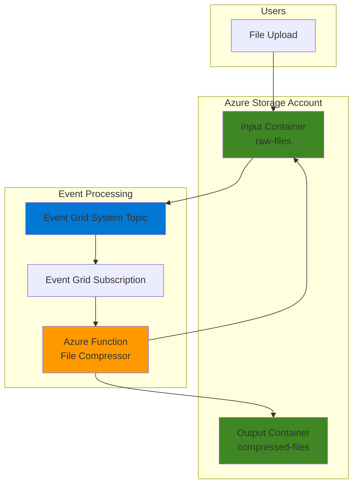

# Simple File Compression with Functions and Storage

## Problem

Organizations frequently need to process uploaded files by automatically compressing them to reduce storage costs and improve transfer speeds. Manual file compression is time-consuming and error-prone, while traditional server-based solutions require constant maintenance and infrastructure overhead that scales poorly with unpredictable upload volumes.

## Solution

Create a serverless file compression service using Azure Functions with blob triggers that automatically compresses uploaded files and stores the compressed versions in Azure Blob Storage. This event-driven architecture eliminates infrastructure management while providing cost-effective scaling and instant processing of uploaded files.

## Architecture Diagram



## Prerequisites

1. Azure account with active subscription and permissions to create resource groups, storage accounts, and function apps
2. Azure CLI installed and configured (or use Azure Cloud Shell)
3. Basic understanding of serverless computing and event-driven architecture
4. Familiarity with Python programming language
5. Estimated cost: $0.50-2.00 USD for testing (Functions Consumption plan charges per execution)
6. Python 3.11 or compatible version for local development

> **Note**: Azure Functions Consumption plan charges only for actual execution time, making this solution extremely cost-effective for occasional file processing workloads.

## Preparation

```bash
# Set environment variables for Azure resources
export RESOURCE_GROUP="rg-recipe-$(openssl rand -hex 3)"
export LOCATION="eastus"
export SUBSCRIPTION_ID=$(az account show --query id --output tsv)

# Generate unique suffix for resource names
RANDOM_SUFFIX=$(openssl rand -hex 3)

# Set resource names with unique identifiers
export STORAGE_ACCOUNT="compress${RANDOM_SUFFIX}"
export FUNCTION_APP="file-compressor-${RANDOM_SUFFIX}"

# Create resource group
az group create \
    --name ${RESOURCE_GROUP} \
    --location ${LOCATION} \
    --tags purpose=recipe environment=demo

echo "✅ Resource group created: ${RESOURCE_GROUP}"

# Create storage account with optimal settings for file processing
az storage account create \
    --name ${STORAGE_ACCOUNT} \
    --resource-group ${RESOURCE_GROUP} \
    --location ${LOCATION} \
    --sku Standard_LRS \
    --kind StorageV2 \
    --access-tier Hot \
    --https-only true

echo "✅ Storage account created: ${STORAGE_ACCOUNT}"
```

## Steps

1. **Create Blob Containers for Input and Output Files**:

   Azure Blob Storage containers organize files logically and enable different access patterns. Creating separate containers for raw and compressed files provides clear data flow separation and enables different lifecycle policies for cost optimization.

   ```bash
   # Create container for uploaded raw files
   az storage container create \
       --name raw-files \
       --account-name ${STORAGE_ACCOUNT} \
       --auth-mode login
   
   # Create container for compressed output files
   az storage container create \
       --name compressed-files \
       --account-name ${STORAGE_ACCOUNT} \
       --auth-mode login
   
   echo "✅ Blob containers created successfully"
   ```

   The containers are now ready to store raw files and their compressed versions. This separation enables independent management of input and output files with different retention and access policies.

2. **Create Function App with Consumption Plan**:

   Azure Functions Consumption plan provides serverless execution that automatically scales based on demand. The plan uses Event Grid integration for instant blob trigger processing, eliminating the polling overhead of legacy blob triggers.

   ```bash
   # Create Function App with Python runtime
   az functionapp create \
       --name ${FUNCTION_APP} \
       --resource-group ${RESOURCE_GROUP} \
       --storage-account ${STORAGE_ACCOUNT} \
       --consumption-plan-location ${LOCATION} \
       --runtime python \
       --runtime-version 3.11 \
       --functions-version 4 \
       --os-type Linux
   
   echo "✅ Function App created: ${FUNCTION_APP}"
   ```

   The Function App is now configured with the latest Python runtime and Functions runtime version 4, which supports the modern Event Grid-based blob triggers for optimal performance.

3. **Configure Storage Account Connection String**:

   The Function App requires access to the storage account to read input files and write compressed output. Storing the connection string in application settings provides secure access without hardcoding credentials in the function code.

   ```bash
   # Get storage account connection string
   STORAGE_CONNECTION=$(az storage account show-connection-string \
       --name ${STORAGE_ACCOUNT} \
       --resource-group ${RESOURCE_GROUP} \
       --query connectionString \
       --output tsv)
   
   # Configure Function App with storage connection
   az functionapp config appsettings set \
       --name ${FUNCTION_APP} \
       --resource-group ${RESOURCE_GROUP} \
       --settings "AzureWebJobsStorage=${STORAGE_CONNECTION}" \
                  "STORAGE_CONNECTION_STRING=${STORAGE_CONNECTION}"
   
   echo "✅ Function App configured with storage access"
   ```

   The Function App now has secure access to both input and output blob containers through the configured connection string stored in application settings.

4. **Create Python Function with Modern v2 Programming Model**:

   Azure Functions Python v2 programming model provides better performance and simplified configuration compared to the legacy v1 model. The Event Grid-based blob trigger provides instant response to file uploads with automatic retry logic and error handling.

   ```bash
   # Create local function project directory
   mkdir -p function_code
   cd function_code
   
   # Create function_app.py for Python v2 programming model
   cat > function_app.py << 'EOF'
import logging
import gzip
import azure.functions as func

app = func.FunctionApp()

@app.blob_trigger(
    arg_name="inputblob",
    path="raw-files/{name}",
    connection="STORAGE_CONNECTION_STRING",
    source="EventGrid"
)
@app.blob_output(
    arg_name="outputblob",
    path="compressed-files/{name}.gz",
    connection="STORAGE_CONNECTION_STRING"
)
def BlobTrigger(inputblob: func.InputStream, outputblob: func.Out[bytes]) -> None:
    """
    Compress uploaded files using gzip compression.
    
    Args:
        inputblob: Input blob from raw-files container
        outputblob: Output blob to compressed-files container
    """
    logging.info(f"Processing file: {inputblob.name}")
    
    try:
        # Read the input file content
        file_content = inputblob.read()
        logging.info(f"Read {len(file_content)} bytes from input file")
        
        # Compress the content using gzip
        compressed_content = gzip.compress(file_content)
        compression_ratio = len(compressed_content) / len(file_content)
        
        logging.info(f"Compressed to {len(compressed_content)} bytes "
                    f"(ratio: {compression_ratio:.2f})")
        
        # Write compressed content to output blob
        outputblob.set(compressed_content)
        
        logging.info(f"Successfully compressed {inputblob.name}")
        
    except Exception as e:
        logging.error(f"Error compressing file {inputblob.name}: {str(e)}")
        raise
EOF
   
   echo "✅ Function implementation created using Python v2 model"
   ```

   The function configuration uses Event Grid as the trigger source and the modern Python v2 programming model, providing instant processing when files are uploaded to the raw-files container.

5. **Create Requirements File for Dependencies**:

   Azure Functions requires a requirements.txt file to specify Python dependencies. While gzip is built-in to Python, we'll create the file for completeness and future extensibility.

   ```bash
   # Create requirements.txt for Python dependencies
   cat > requirements.txt << 'EOF'
azure-functions>=1.18.0
EOF
   
   echo "✅ Requirements file created"
   ```

   The requirements file ensures consistent dependency management and enables adding additional compression libraries or utilities in the future.

6. **Deploy Function Code to Azure**:

   Azure Functions deployment uses zip-based deployment for fast, atomic updates. The Python v2 programming model simplifies the deployment process and provides better performance with modern Azure Functions runtime.

   ```bash
   # Create deployment package with all function files
   zip -r function.zip function_app.py requirements.txt
   
   # Deploy function code to Azure
   az functionapp deployment source config-zip \
       --name ${FUNCTION_APP} \
       --resource-group ${RESOURCE_GROUP} \
       --src function.zip
   
   # Wait for deployment to complete
   sleep 30
   
   echo "✅ Function deployed successfully"
   
   # Return to parent directory
   cd ..
   ```

   The function is now deployed using the modern Python v2 programming model, which provides better performance and simplified configuration compared to the legacy v1 model.

7. **Create Event Grid System Topic for Blob Events**:

   Event Grid provides reliable, low-latency event delivery for blob storage events. Creating a system topic enables the storage account to publish blob events that can trigger the Azure Function instantly when files are uploaded.

   ```bash
   # Create Event Grid system topic for the storage account
   az eventgrid system-topic create \
       --name "${STORAGE_ACCOUNT}-topic" \
       --resource-group ${RESOURCE_GROUP} \
       --location ${LOCATION} \
       --topic-type Microsoft.Storage.StorageAccounts \
       --source "/subscriptions/${SUBSCRIPTION_ID}/resourceGroups/${RESOURCE_GROUP}/providers/Microsoft.Storage/storageAccounts/${STORAGE_ACCOUNT}"
   
   echo "✅ Event Grid system topic created"
   ```

   The Event Grid system topic is now configured to capture blob storage events and route them to subscribers like Azure Functions for instant processing.

8. **Create Event Grid Subscription for Function Trigger**:

   The Event Grid subscription connects blob storage events to the Azure Function, enabling automatic function execution when files are uploaded to the storage container.

   ```bash
   # Get the Function App's blob extension endpoint
   FUNCTION_KEY=$(az functionapp keys list \
       --name ${FUNCTION_APP} \
       --resource-group ${RESOURCE_GROUP} \
       --query "systemKeys.blobs_extension" \
       --output tsv)
   
   # Create Event Grid subscription to trigger the function
   az eventgrid system-topic event-subscription create \
       --name "blob-compression-subscription" \
       --system-topic-name "${STORAGE_ACCOUNT}-topic" \
       --resource-group ${RESOURCE_GROUP} \
       --endpoint-type webhook \
       --endpoint "https://${FUNCTION_APP}.azurewebsites.net/runtime/webhooks/blobs?functionName=Host.Functions.BlobTrigger&code=${FUNCTION_KEY}" \
       --included-event-types Microsoft.Storage.BlobCreated \
       --subject-begins-with "/blobServices/default/containers/raw-files/"
   
   echo "✅ Event Grid subscription created for function trigger"
   ```

   The Event Grid subscription is now configured to send blob creation events directly to the Function App's webhook endpoint for instant processing.

9. **Test File Upload and Compression**:

   Testing validates the complete workflow from file upload through compression to output storage. This verification ensures proper Event Grid integration and function execution in the serverless environment.

   ```bash
   # Create a test file with sample content
   echo "This is a test file for compression testing. \
   It contains sample text that will be compressed using gzip. \
   The compression ratio depends on file content and size." > test-file.txt
   
   # Upload test file to trigger compression
   az storage blob upload \
       --account-name ${STORAGE_ACCOUNT} \
       --container-name raw-files \
       --name test-file.txt \
       --file test-file.txt \
       --auth-mode login
   
   echo "✅ Test file uploaded to raw-files container"
   
   # Wait for function execution
   sleep 20
   
   # Clean up local test file
   rm test-file.txt
   ```

   The test file upload triggers the Azure Function through Event Grid, demonstrating the complete serverless file compression workflow.

## Validation & Testing

1. Verify compressed file was created successfully:

   ```bash
   # Check if compressed file exists in output container
   az storage blob list \
       --account-name ${STORAGE_ACCOUNT} \
       --container-name compressed-files \
       --auth-mode login \
       --output table
   ```

   Expected output: A table showing the compressed file with .gz extension and smaller size than the original.

2. Download and verify compression worked correctly:

   ```bash
   # Download compressed file
   az storage blob download \
       --account-name ${STORAGE_ACCOUNT} \
       --container-name compressed-files \
       --name test-file.txt.gz \
       --file downloaded-compressed.gz \
       --auth-mode login
   
   # Decompress and verify content
   gunzip downloaded-compressed.gz
   cat downloaded-compressed
   
   # Clean up downloaded file
   rm downloaded-compressed
   ```

   Expected output: The original file content should be displayed, confirming successful compression and decompression.

3. Monitor function execution logs:

   ```bash
   # View function logs to verify execution
   az functionapp logs tail \
       --name ${FUNCTION_APP} \
       --resource-group ${RESOURCE_GROUP}
   ```

   Expected output: Log entries showing file processing, compression ratios, and successful completion.

## Cleanup

1. Delete Event Grid subscription first:

   ```bash
   # Delete Event Grid subscription
   az eventgrid system-topic event-subscription delete \
       --name "blob-compression-subscription" \
       --system-topic-name "${STORAGE_ACCOUNT}-topic" \
       --resource-group ${RESOURCE_GROUP}
   
   echo "✅ Event Grid subscription deleted"
   ```

2. Remove the resource group and all contained resources:

   ```bash
   # Delete resource group and all resources
   az group delete \
       --name ${RESOURCE_GROUP} \
       --yes \
       --no-wait
   
   echo "✅ Resource group deletion initiated: ${RESOURCE_GROUP}"
   echo "Note: Deletion may take several minutes to complete"
   ```

3. Verify resource cleanup:

   ```bash
   # Verify resource group deletion
   az group exists --name ${RESOURCE_GROUP}
   ```

   Expected output: `false` indicating successful deletion.

## Discussion

This serverless file compression solution demonstrates the power of event-driven architecture using Azure Functions and Blob Storage with modern Event Grid integration. The Event Grid system topic and subscription provide instant response to file uploads, eliminating the latency and inefficiency of polling-based systems. By using the Consumption plan, the solution only charges for actual execution time, making it extremely cost-effective for workloads with unpredictable or infrequent file processing needs.

The Python v2 programming model implementation leverages built-in compression libraries and provides better performance than the legacy v1 model. Gzip compression offers excellent compression ratios for text-based files and reasonable performance for binary files, making it suitable for most general-purpose compression scenarios. The separation of input and output containers enables independent lifecycle management, allowing organizations to implement different retention policies and access tiers for raw versus processed files.

From a cost optimization perspective, this solution follows Azure Well-Architected Framework principles by using the most appropriate access tiers and enabling lifecycle management policies. Organizations can configure the compressed-files container with cooler access tiers since compressed files are typically accessed less frequently than original uploads. Additionally, the serverless model eliminates infrastructure maintenance costs while providing automatic scaling for varying workloads.

> **Tip**: Consider implementing Azure Monitor Application Insights to track compression ratios, processing times, and error rates for production workloads to optimize performance and cost further.

The solution integrates seamlessly with existing Azure services and can be extended with additional processing steps such as virus scanning, metadata extraction, or content analysis. The Event Grid foundation supports reliable message delivery with built-in retry logic and dead letter queues for robust error handling in production environments.

**Documentation Sources:**
- [Azure Functions Event Grid blob trigger tutorial](https://learn.microsoft.com/en-us/azure/azure-functions/functions-event-grid-blob-trigger)
- [Azure Blob Storage architecture best practices](https://learn.microsoft.com/en-us/azure/well-architected/service-guides/azure-blob-storage)
- [Azure Functions Consumption plan pricing](https://azure.microsoft.com/pricing/details/functions/)
- [Azure Storage access tiers optimization](https://learn.microsoft.com/en-us/azure/storage/blobs/access-tiers-best-practices)
- [Azure Functions Python v2 programming model](https://learn.microsoft.com/en-us/azure/azure-functions/functions-reference-python)
- [Event Grid system topics for Azure Storage](https://learn.microsoft.com/en-us/azure/event-grid/system-topics)

## Challenge

Extend this solution by implementing these enhancements:

1. **Multi-format compression support**: Modify the function to detect file types and apply appropriate compression algorithms (ZIP for archives, WebP for images, H.264 for videos) based on file extensions or content analysis.

2. **Compression quality configuration**: Add application settings to control compression levels and implement different compression strategies based on file size, type, or source container to optimize for storage cost versus access speed.

3. **Batch processing optimization**: Implement file batching to process multiple small files together, reducing function execution costs and improving throughput for high-volume scenarios with many small files.

4. **Intelligent lifecycle management**: Create Azure Logic Apps workflows that automatically move compressed files to cooler storage tiers based on access patterns, and implement deletion policies for files that haven't been accessed within specified timeframes.

5. **Advanced monitoring and alerting**: Deploy Azure Monitor dashboards with custom metrics for compression ratios, processing times, and error rates, plus automated alerts for failed compressions or unusual compression patterns that might indicate data corruption.

## Infrastructure Code

### Available Infrastructure as Code:

- [Infrastructure Code Overview](code/README.md) - Detailed description of all infrastructure components
- [Bicep](code/bicep/) - Azure Bicep templates
- [Bash CLI Scripts](code/scripts/) - Example bash scripts using Azure CLI commands to deploy infrastructure
- [Terraform](code/terraform/) - Terraform configuration files