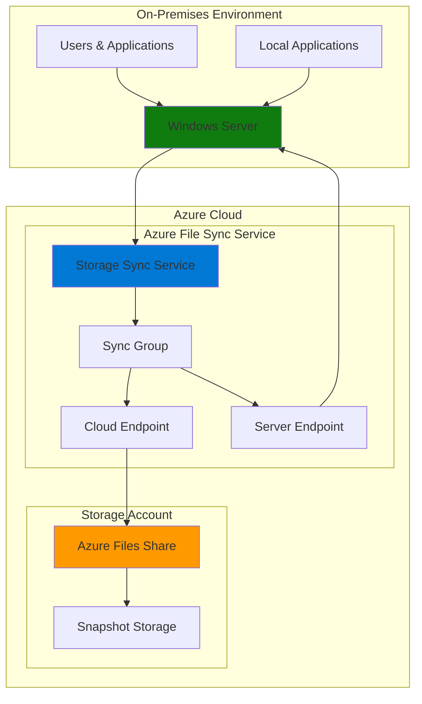

# Simple File Sync with Azure File Sync and Storage

## Problem

Organizations with distributed offices need to synchronize files between on-premises Windows file servers and the cloud while maintaining local performance and accessibility. Traditional file sharing solutions struggle with bandwidth limitations, version conflicts, and disaster recovery challenges when connecting multiple locations. Without a hybrid approach, companies face increased storage costs, complex backup procedures, and reduced productivity due to inconsistent file access across different sites.

## Solution

Azure File Sync provides a hybrid file synchronization solution that transforms Windows Server into a smart cache for Azure Files, enabling seamless file sharing across multiple locations. This service automatically synchronizes file changes between on-premises servers and Azure file shares while maintaining local performance through intelligent caching and optional cloud tiering to optimize storage costs.

## Architecture Diagram



## Prerequisites

1. Azure subscription with appropriate permissions for Storage and File Sync services
2. Windows Server 2016 or later (Windows Server 2025, 2022, 2019, 2016 supported)
3. Azure CLI installed and configured (or Azure Cloud Shell access)
4. PowerShell 5.1 or later on the Windows Server (for future server registration)
5. Internet connectivity from Windows Server (port 443 outbound for HTTPS)
6. Estimated cost: Storage costs from $0.06-$0.18 per GB/month (LRS), plus per-server licensing fees (~$15/month after first server), plus transaction costs

> **Note**: Azure File Sync requires outbound internet connectivity on port 443 and uses encrypted HTTPS (TLS 1.2/1.3) for all data transfers between on-premises and Azure. The service requires specific Windows updates depending on your server version.

## Preparation

```bash
# Set environment variables for Azure resources
export RESOURCE_GROUP="rg-filesync-${RANDOM_SUFFIX}"
export LOCATION="eastus"
export SUBSCRIPTION_ID=$(az account show --query id --output tsv)

# Generate unique suffix for resource names
RANDOM_SUFFIX=$(openssl rand -hex 3)

# Set resource names with unique suffix
export STORAGE_ACCOUNT="filesync${RANDOM_SUFFIX}"
export STORAGE_SYNC_SERVICE="filesync-service-${RANDOM_SUFFIX}"
export FILE_SHARE_NAME="companyfiles"
export SYNC_GROUP_NAME="main-sync-group"

# Create resource group
az group create \
    --name ${RESOURCE_GROUP} \
    --location ${LOCATION} \
    --tags purpose=recipe environment=demo

echo "✅ Resource group created: ${RESOURCE_GROUP}"

# Install Azure File Sync CLI extension
az extension add --name storagesync

echo "✅ Azure File Sync extension installed"
```

## Steps

1. **Create Storage Account with Azure Files**:

   Azure Storage provides the foundation for hybrid file synchronization by hosting Azure Files shares that serve as the authoritative source for your data. This storage account will contain the file share that synchronizes with your on-premises Windows Server, providing cloud backup and multi-site access capabilities with SMB 3.1.1 protocol support.

   ```bash
   # Create storage account for Azure Files
   az storage account create \
       --name ${STORAGE_ACCOUNT} \
       --resource-group ${RESOURCE_GROUP} \
       --location ${LOCATION} \
       --sku Standard_LRS \
       --kind StorageV2 \
       --enable-large-file-share \
       --allow-shared-key-access true
   
   # Get storage account key for file share creation
   STORAGE_KEY=$(az storage account keys list \
       --account-name ${STORAGE_ACCOUNT} \
       --resource-group ${RESOURCE_GROUP} \
       --query '[0].value' --output tsv)
   
   echo "✅ Storage account created: ${STORAGE_ACCOUNT}"
   ```

   The storage account is configured with Standard LRS redundancy for cost-effective local replication, large file share support for enterprise-scale data volumes, and shared key access enabled for Azure File Sync compatibility.

2. **Create Azure File Share**:

   Azure Files provides SMB-compatible file shares in the cloud that can be accessed from anywhere while maintaining POSIX-compliant file system semantics. This file share will serve as the central hub for file synchronization across all connected servers with built-in snapshot capabilities for point-in-time recovery.

   ```bash
   # Create Azure file share with 1TB quota
   az storage share create \
       --account-name ${STORAGE_ACCOUNT} \
       --account-key ${STORAGE_KEY} \
       --name ${FILE_SHARE_NAME} \
       --quota 1024 \
       --access-tier Hot
   
   # Upload sample files to demonstrate sync capabilities
   echo "Welcome to Azure File Sync!" > welcome.txt
   echo "Sync test file created on $(date)" > sync-test.txt
   
   az storage file upload \
       --account-name ${STORAGE_ACCOUNT} \
       --account-key ${STORAGE_KEY} \
       --share-name ${FILE_SHARE_NAME} \
       --source welcome.txt \
       --path welcome.txt
   
   az storage file upload \
       --account-name ${STORAGE_ACCOUNT} \
       --account-key ${STORAGE_KEY} \
       --share-name ${FILE_SHARE_NAME} \
       --source sync-test.txt \
       --path sync-test.txt
   
   # Clean up local files
   rm welcome.txt sync-test.txt
   
   echo "✅ Azure file share created: ${FILE_SHARE_NAME}"
   ```

   The file share is created with a 1TB quota in the Hot access tier and contains initial content that will be synchronized to connected servers, demonstrating the bidirectional sync capabilities.

3. **Deploy Storage Sync Service**:

   The Storage Sync Service acts as the orchestration hub for Azure File Sync, managing trust relationships between servers and coordinating synchronization activities. This service enables secure communication between your on-premises infrastructure and Azure Files through encrypted channels.

   ```bash
   # Create Storage Sync Service
   az storagesync create \
       --resource-group ${RESOURCE_GROUP} \
       --name ${STORAGE_SYNC_SERVICE} \
       --location ${LOCATION} \
       --tags purpose=recipe environment=demo
   
   echo "✅ Storage Sync Service created: ${STORAGE_SYNC_SERVICE}"
   ```

   The Storage Sync Service is now ready to accept server registrations and manage sync groups that define which files synchronize between endpoints with automatic health monitoring.

4. **Create Sync Group and Cloud Endpoint**:

   A sync group defines the topology of synchronization for a set of files, while the cloud endpoint connects the Azure file share to the sync infrastructure. This configuration establishes the cloud side of the hybrid synchronization relationship with automatic conflict resolution.

   ```bash
   # Create sync group
   az storagesync sync-group create \
       --resource-group ${RESOURCE_GROUP} \
       --storage-sync-service ${STORAGE_SYNC_SERVICE} \
       --name ${SYNC_GROUP_NAME}
   
   # Create cloud endpoint linking Azure file share to sync group
   az storagesync sync-group cloud-endpoint create \
       --resource-group ${RESOURCE_GROUP} \
       --storage-sync-service ${STORAGE_SYNC_SERVICE} \
       --sync-group-name ${SYNC_GROUP_NAME} \
       --name "cloud-endpoint-${RANDOM_SUFFIX}" \
       --storage-account ${STORAGE_ACCOUNT} \
       --azure-file-share-name ${FILE_SHARE_NAME}
   
   echo "✅ Sync group and cloud endpoint configured"
   ```

   The sync group now has a cloud endpoint that connects to your Azure file share, ready to synchronize with on-premises server endpoints when they are registered and configured.

5. **Configure Storage Account Security Settings**:

   Azure Storage security settings ensure proper access controls while maintaining Azure File Sync functionality. This configuration balances security requirements with the service's need to access your storage account for synchronization operations.

   ```bash
   # Configure storage account for Azure File Sync access
   az storage account update \
       --name ${STORAGE_ACCOUNT} \
       --resource-group ${RESOURCE_GROUP} \
       --bypass AzureServices \
       --default-action Allow \
       --https-only true \
       --min-tls-version TLS1_2
   
   echo "✅ Storage account security settings configured"
   ```

   The storage account is configured to allow Azure services access, enforce HTTPS-only connections, and require TLS 1.2 minimum encryption for secure data transfer.

6. **Generate Server Registration Information**:

   Server registration connects your on-premises Windows Server to the Azure File Sync service, establishing trust and enabling secure synchronization. This step provides the information needed to complete the registration process using the Azure File Sync agent.

   ```bash
   # Get Storage Sync Service resource information
   SYNC_SERVICE_ID=$(az storagesync show \
       --resource-group ${RESOURCE_GROUP} \
       --name ${STORAGE_SYNC_SERVICE} \
       --query id --output tsv)
   
   # Display registration information
   echo "=== Server Registration Information ==="
   echo "Storage Sync Service ID: ${SYNC_SERVICE_ID}"
   echo "Resource Group: ${RESOURCE_GROUP}"
   echo "Subscription ID: ${SUBSCRIPTION_ID}"
   echo "Location: ${LOCATION}"
   echo "Sync Group Name: ${SYNC_GROUP_NAME}"
   echo "======================================"
   
   echo "✅ Server registration information generated"
   ```

   These details will be used during the Azure File Sync agent installation and server registration process on your Windows Server, establishing the secure connection for hybrid file synchronization.

## Validation & Testing

1. **Verify Storage Sync Service deployment**:

   ```bash
   # Check Storage Sync Service status
   az storagesync show \
       --resource-group ${RESOURCE_GROUP} \
       --name ${STORAGE_SYNC_SERVICE} \
       --output table
   ```

   Expected output: The service should show "Succeeded" provisioning state and "Healthy" status.

2. **Validate sync group and cloud endpoint**:

   ```bash
   # List sync groups
   az storagesync sync-group list \
       --resource-group ${RESOURCE_GROUP} \
       --storage-sync-service ${STORAGE_SYNC_SERVICE} \
       --output table
   
   # Check cloud endpoint status
   az storagesync sync-group cloud-endpoint list \
       --resource-group ${RESOURCE_GROUP} \
       --storage-sync-service ${STORAGE_SYNC_SERVICE} \
       --sync-group-name ${SYNC_GROUP_NAME} \
       --output table
   ```

   Expected output: Both sync group and cloud endpoint should show healthy status with no errors.

3. **Test Azure file share accessibility**:

   ```bash
   # List files in the Azure file share
   az storage file list \
       --account-name ${STORAGE_ACCOUNT} \
       --account-key ${STORAGE_KEY} \
       --share-name ${FILE_SHARE_NAME} \
       --output table
   
   # Verify file share properties
   az storage share show \
       --account-name ${STORAGE_ACCOUNT} \
       --account-key ${STORAGE_KEY} \
       --name ${FILE_SHARE_NAME} \
       --output table
   ```

   Expected output: The welcome.txt and sync-test.txt files should be visible with correct sizes and timestamps.

4. **Verify storage account configuration**:

   ```bash
   # Check storage account properties
   az storage account show \
       --name ${STORAGE_ACCOUNT} \
       --resource-group ${RESOURCE_GROUP} \
       --query '{name:name, location:location, sku:sku.name, httpsOnly:supportsHttpsTrafficOnly, minTlsVersion:minimumTlsVersion}' \
       --output table
   ```

   Expected output: Storage account should show LRS replication, HTTPS-only enabled, and TLS 1.2 minimum version.

## Cleanup

1. **Remove cloud endpoint and sync group**:

   ```bash
   # Delete cloud endpoint first
   az storagesync sync-group cloud-endpoint delete \
       --resource-group ${RESOURCE_GROUP} \
       --storage-sync-service ${STORAGE_SYNC_SERVICE} \
       --sync-group-name ${SYNC_GROUP_NAME} \
       --name "cloud-endpoint-${RANDOM_SUFFIX}" \
       --yes
   
   # Delete sync group
   az storagesync sync-group delete \
       --resource-group ${RESOURCE_GROUP} \
       --storage-sync-service ${STORAGE_SYNC_SERVICE} \
       --name ${SYNC_GROUP_NAME} \
       --yes
   
   echo "✅ Cloud endpoint and sync group deleted"
   ```

2. **Remove Storage Sync Service**:

   ```bash
   # Delete Storage Sync Service
   az storagesync delete \
       --resource-group ${RESOURCE_GROUP} \
       --name ${STORAGE_SYNC_SERVICE} \
       --yes
   
   echo "✅ Storage Sync Service deleted"
   ```

3. **Remove storage account and file share**:

   ```bash
   # Delete storage account and all contained file shares
   az storage account delete \
       --name ${STORAGE_ACCOUNT} \
       --resource-group ${RESOURCE_GROUP} \
       --yes
   
   echo "✅ Storage account deleted"
   ```

4. **Delete resource group**:

   ```bash
   # Delete resource group and all remaining resources
   az group delete \
       --name ${RESOURCE_GROUP} \
       --yes \
       --no-wait
   
   echo "✅ Resource group deletion initiated: ${RESOURCE_GROUP}"
   echo "Note: Deletion may take several minutes to complete"
   ```

## Discussion

Azure File Sync transforms traditional file server architectures by providing a hybrid approach that maintains local performance while leveraging cloud scalability and reliability. The service acts as an intelligent caching layer, keeping frequently accessed files on-premises while seamlessly tiering less-used data to Azure Files. This architecture reduces local storage requirements and provides automatic backup and disaster recovery capabilities following Azure Well-Architected Framework principles.

The sync group topology allows organizations to connect multiple Windows Servers to the same Azure file share, enabling distributed teams to collaborate effectively while maintaining consistent file access patterns. Cloud tiering further optimizes costs by automatically moving infrequently accessed files to Azure storage while preserving the complete file namespace locally. When users access tiered files, they are quickly recalled from Azure without impacting the user experience, providing transparent access to both local and cloud-stored data.

Security and compliance are built into Azure File Sync through encrypted data transmission using TLS 1.2/1.3, Azure Active Directory integration, and support for existing NTFS permissions and Access Control Lists (ACLs). The service maintains the same security model as traditional Windows file servers while adding cloud-based audit capabilities and advanced threat protection through Microsoft Defender for Storage. All data is encrypted both in transit and at rest, ensuring enterprise-grade security.

Performance optimization occurs automatically through Azure File Sync's intelligent caching algorithms and bandwidth throttling capabilities. The service adapts to network conditions and can be configured to prioritize business-critical file synchronization during specific time windows. Organizations can monitor sync health, performance metrics, and storage utilization through Azure Monitor and the Azure portal, with detailed logging and alerting capabilities available for proactive management.

> **Tip**: Enable cloud tiering to automatically optimize storage costs by keeping only frequently accessed files on-premises while maintaining fast access to all data through seamless cloud integration. Consider using Azure Monitor to track sync performance and set up alerts for sync failures or bandwidth utilization.

For more information, see the [Azure File Sync documentation](https://docs.microsoft.com/en-us/azure/storage/file-sync/) and [Azure Files pricing](https://azure.microsoft.com/pricing/details/storage/files/).

## Challenge

Extend this solution by implementing these enhancements:

1. **Configure cloud tiering policies** to automatically tier files older than 30 days to Azure storage, reducing local storage requirements by up to 80% while maintaining fast access through intelligent caching
2. **Set up multiple server endpoints** across different geographical locations to create a global file synchronization network with regional caching and disaster recovery capabilities
3. **Implement Azure Backup integration** to create scheduled backups of your Azure file shares with customizable retention policies, point-in-time recovery, and automated backup health monitoring
4. **Add Azure Monitor alerting** to track sync health, performance metrics, and storage utilization with automated notifications for sync failures, bandwidth thresholds, or server connectivity issues
5. **Deploy Azure Files with Azure AD Domain Services authentication** to integrate with existing Active Directory infrastructure and enforce advanced access controls, conditional access policies, and comprehensive audit logging

## Infrastructure Code

*Infrastructure code will be generated after recipe approval.*