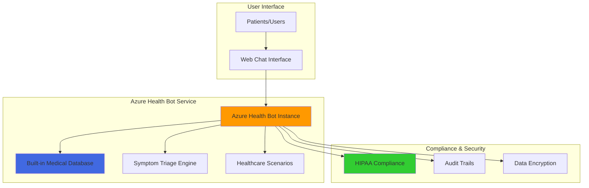

# Simple Healthcare Chatbot with Azure Health Bot

## Problem

Healthcare organizations struggle to provide 24/7 patient support for common medical inquiries, symptom assessment, and health information requests, leading to overwhelmed staff, longer patient wait times, and reduced accessibility to basic healthcare guidance. Traditional chatbots lack medical knowledge and HIPAA compliance requirements necessary for healthcare environments.

## Solution

Azure Health Bot provides a specialized, HIPAA-compliant platform specifically designed for healthcare organizations to build intelligent virtual health assistants. The service includes built-in medical databases, triage protocols, and clinical terminology understanding, enabling rapid deployment of healthcare chatbots with enterprise-grade security and compliance features.

## Architecture Diagram



## Prerequisites

1. Azure subscription with contributor access to create Health Bot resources
2. Azure CLI installed and configured (version 2.0 or later) or access to Azure Cloud Shell
3. Basic understanding of healthcare compliance requirements (HIPAA/HITECH)
4. Web browser for testing the chatbot interface
5. Estimated cost: Free tier (F0) available for testing, Standard tier (S1) starts at $500/month

> **Note**: Azure Health Bot includes built-in HIPAA compliance features, but organizations must still ensure proper configuration and usage policies align with their compliance requirements. See [Microsoft HIPAA compliance documentation](https://learn.microsoft.com/en-us/compliance/regulatory/offering-hipaa-hitech) for complete details.

## Preparation

```bash
# Generate unique suffix for resource names first
RANDOM_SUFFIX=$(openssl rand -hex 3)

# Set environment variables for Azure resources
export RESOURCE_GROUP="rg-healthbot-${RANDOM_SUFFIX}"
export LOCATION="eastus"
export SUBSCRIPTION_ID=$(az account show --query id --output tsv)
export HEALTH_BOT_NAME="healthbot-${RANDOM_SUFFIX}"

# Create resource group
az group create \
    --name ${RESOURCE_GROUP} \
    --location ${LOCATION} \
    --tags purpose=healthcare-chatbot environment=demo

echo "✅ Resource group created: ${RESOURCE_GROUP}"
```

## Steps

1. **Create Azure Health Bot Service Instance**:

   Azure Health Bot is a specialized cloud service that provides healthcare organizations with a comprehensive platform for building HIPAA-compliant virtual health assistants. Unlike general-purpose chatbots, Health Bot includes built-in medical knowledge, triage protocols, and clinical terminology understanding, making it ideal for healthcare scenarios requiring medical accuracy and regulatory compliance.

   ```bash
   # Create Health Bot service instance
   az healthbot create \
       --name ${HEALTH_BOT_NAME} \
       --resource-group ${RESOURCE_GROUP} \
       --location ${LOCATION} \
       --sku F0 \
       --tags environment=demo purpose=healthcare-chatbot
   
   echo "✅ Health Bot instance created: ${HEALTH_BOT_NAME}"
   ```

   The Health Bot instance is now provisioned with built-in medical databases, including symptom checkers, disease information, and medication guidance. This foundational service provides the core AI capabilities needed for healthcare conversations while maintaining strict security and compliance standards.

2. **Configure Health Bot Management Portal Access**:

   The Health Bot Management Portal provides a comprehensive interface for configuring scenarios, managing channels, and monitoring conversations. This web-based portal enables healthcare IT teams to customize the bot's behavior without requiring extensive programming knowledge, making it accessible to medical professionals and administrators.

   ```bash
   # Get Health Bot management URL
   MANAGEMENT_URL=$(az healthbot show \
       --name ${HEALTH_BOT_NAME} \
       --resource-group ${RESOURCE_GROUP} \
       --query "properties.botManagementPortalLink" \
       --output tsv)
   
   echo "✅ Management Portal URL: ${MANAGEMENT_URL}"
   echo "Access this URL to configure your Health Bot scenarios"
   ```

   The management portal provides access to scenario templates, conversation flows, and built-in healthcare intelligence. Healthcare organizations can use these tools to create customized patient interactions while leveraging pre-built medical knowledge and compliance frameworks.

3. **Enable Built-in Healthcare Scenarios**:

   Azure Health Bot includes pre-configured healthcare scenarios such as symptom assessment, medication information, and health condition lookup. These scenarios are built using evidence-based medical protocols and can be activated immediately without custom development, providing instant value for healthcare organizations.

   ```bash
   # Get Health Bot resource details
   az healthbot show \
       --name ${HEALTH_BOT_NAME} \
       --resource-group ${RESOURCE_GROUP} \
       --query "properties" \
       --output table
   
   echo "✅ Health Bot configured with built-in scenarios:"
   echo "- Symptom checker and triage"
   echo "- Disease information lookup"
   echo "- Medication guidance"
   echo "- Doctor type recommendations"
   ```

   These built-in scenarios leverage Microsoft's healthcare intelligence and are regularly updated with the latest medical knowledge. The scenarios follow clinical best practices and include appropriate disclaimers to ensure users understand the limitations of automated medical guidance.

4. **Configure Web Chat Channel**:

   The web chat channel provides a secure, embeddable interface that healthcare organizations can integrate into their websites or patient portals. This channel supports modern web standards and maintains HIPAA compliance through encrypted communications and secure session management.

   ```bash
   # Configure web chat channel (done through portal)
   echo "✅ Web chat channel configuration steps:"
   echo "1. Access the Management Portal: ${MANAGEMENT_URL}"
   echo "2. Navigate to Integration > Channels"
   echo "3. Enable Web Chat channel"
   echo "4. Configure channel settings for your organization"
   echo "5. Copy the embed code for your website"
   ```

   The web chat channel automatically includes necessary security features such as conversation encryption, session timeout, and audit logging. These features ensure patient conversations remain private and meet healthcare compliance requirements.

5. **Test Healthcare Bot Functionality**:

   Testing the Health Bot involves validating both its medical knowledge capabilities and compliance features. The bot should respond appropriately to medical inquiries while maintaining proper disclaimers and directing users to appropriate care when necessary.

   ```bash
   # Access the Health Bot test interface
   echo "✅ Test your Health Bot with these sample queries:"
   echo "- 'I have a headache' (symptom triage)"
   echo "- 'What is diabetes?' (disease information)"
   echo "- 'What doctor treats back pain?' (provider guidance)"
   echo "- 'Help' (available commands)"
   echo ""
   echo "Access test interface at: ${MANAGEMENT_URL}"
   echo "Navigate to: Chat > Test in Portal"
   ```

   The Health Bot includes built-in validation to ensure responses meet medical accuracy standards. It automatically provides appropriate disclaimers and encourages users to seek professional medical care when symptoms require immediate attention.

## Validation & Testing

1. **Verify Health Bot Service Deployment**:

   ```bash
   # Check Health Bot service status
   az healthbot show \
       --name ${HEALTH_BOT_NAME} \
       --resource-group ${RESOURCE_GROUP} \
       --query "properties.provisioningState" \
       --output tsv
   ```

   Expected output: `Succeeded`

2. **Test Built-in Medical Scenarios**:

   Access the Management Portal and use the chat interface to test:
   - Symptom checker: "I have chest pain"
   - Disease lookup: "What are symptoms of flu?"
   - Medication query: "Tell me about aspirin"

   Expected behavior: Bot responds with medically accurate information and appropriate disclaimers.

3. **Validate HIPAA Compliance Features**:

   ```bash
   # Verify encryption and compliance settings
   az healthbot show \
       --name ${HEALTH_BOT_NAME} \
       --resource-group ${RESOURCE_GROUP} \
       --query "properties" \
       --output json
   ```

   Verify that audit trails, data retention policies, and encryption are properly configured for healthcare compliance.

## Cleanup

1. **Remove Health Bot Service**:

   ```bash
   # Delete Health Bot instance
   az healthbot delete \
       --name ${HEALTH_BOT_NAME} \
       --resource-group ${RESOURCE_GROUP} \
       --yes
   
   echo "✅ Health Bot instance deleted"
   ```

2. **Remove Resource Group**:

   ```bash
   # Delete resource group and all contained resources
   az group delete \
       --name ${RESOURCE_GROUP} \
       --yes \
       --no-wait
   
   echo "✅ Resource group deletion initiated: ${RESOURCE_GROUP}"
   echo "Note: Deletion may take several minutes to complete"
   ```

## Discussion

Azure Health Bot represents a significant advancement in healthcare technology by providing a purpose-built platform for medical chatbots that addresses the unique challenges of healthcare environments. Unlike general chatbots, Health Bot includes built-in medical databases curated by healthcare professionals, ensuring responses are medically accurate and appropriate for patient interactions. The service's HIPAA compliance features, including data encryption, audit trails, and consent management, eliminate many of the technical barriers that healthcare organizations face when implementing AI solutions. The platform follows the [Azure Well-Architected Framework](https://learn.microsoft.com/en-us/azure/architecture/) principles, ensuring reliability, security, and cost optimization.

The built-in triage capabilities follow evidence-based protocols and can help healthcare organizations manage patient inquiries more efficiently while ensuring appropriate care escalation. The symptom checker uses established medical algorithms to assess patient-reported symptoms and provide guidance on appropriate next steps, from self-care recommendations to urgent care referrals. This systematic approach helps reduce the burden on healthcare staff while improving patient access to basic medical guidance. Microsoft's [healthcare compliance offerings](https://learn.microsoft.com/en-us/compliance/regulatory/offering-hipaa-hitech) provide the foundation for secure, compliant healthcare AI implementations.

Azure Health Bot's integration capabilities enable seamless connection with existing healthcare systems, electronic health records, and appointment scheduling platforms through Azure Logic Apps and FHIR services. The service supports multiple communication channels, including web chat, Microsoft Teams, and SMS, allowing healthcare organizations to meet patients where they prefer to communicate. The platform's analytics and reporting features provide insights into patient interactions, common health concerns, and system usage patterns, enabling continuous improvement of patient services while maintaining strict privacy protections.

> **Tip**: Regularly review Health Bot analytics to identify common patient questions and optimize your custom scenarios to provide more targeted healthcare guidance while maintaining clinical accuracy. Monitor Azure costs using [Cost Management](https://learn.microsoft.com/en-us/azure/cost-management-billing/) to optimize your pricing tier based on actual usage.

## Challenge

Extend this healthcare chatbot solution by implementing these enhancements:

1. **Custom Medical Scenarios**: Create organization-specific scenarios for appointment scheduling, prescription refill requests, or post-procedure care instructions using the Health Bot scenario editor.

2. **Multi-Channel Integration**: Connect the Health Bot to Microsoft Teams for internal staff use and SMS for patient outreach, enabling comprehensive communication across your healthcare organization.

3. **EHR Integration**: Integrate with Azure Logic Apps and FHIR services to connect the Health Bot with electronic health records for personalized patient interactions and appointment scheduling.

4. **Advanced Analytics**: Implement Azure Application Insights and Power BI dashboards to track patient interaction patterns, common health concerns, and chatbot effectiveness metrics.

5. **Multilingual Support**: Configure language detection and translation services to support diverse patient populations while maintaining medical accuracy across different languages.

## Infrastructure Code

### Available Infrastructure as Code:

- [Infrastructure Code Overview](code/README.md) - Detailed description of all infrastructure components
- [Bicep](code/bicep/) - Azure Bicep templates
- [Bash CLI Scripts](code/scripts/) - Example bash scripts using Azure CLI commands to deploy infrastructure
- [Terraform](code/terraform/) - Terraform configuration files