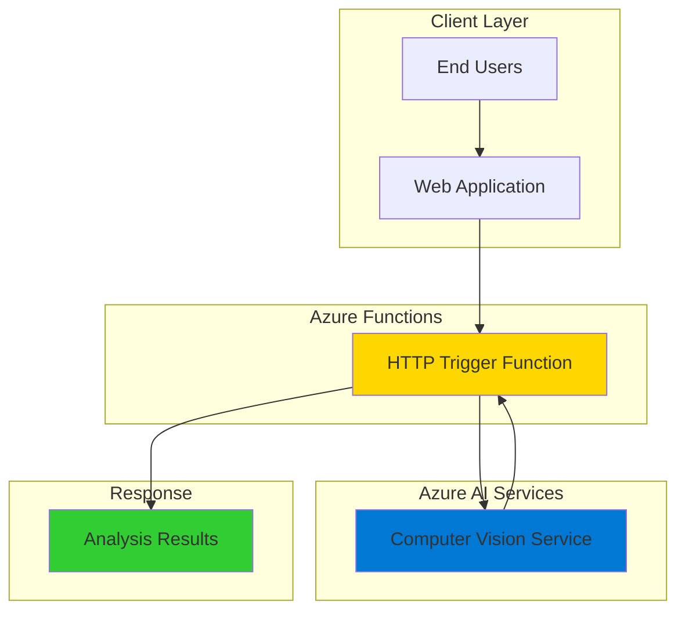

# Simple Image Analysis with Computer Vision and Functions

## Problem

Businesses often need to extract information from uploaded images, such as reading text from receipts, identifying objects in product photos, or generating descriptions for accessibility. Traditional approaches require complex infrastructure and machine learning expertise, making it difficult for small teams to implement intelligent image processing capabilities quickly and cost-effectively.

## Solution

Build a serverless image analysis API using Azure Functions and Azure Computer Vision that automatically processes uploaded images to extract text, detect objects, and generate descriptions. This solution provides instant scalability, pay-per-use pricing, and enterprise-grade AI capabilities without requiring machine learning expertise or infrastructure management.

## Architecture Diagram



## Prerequisites

1. Azure account with active subscription and appropriate permissions for creating resources
2. Azure CLI installed and configured (or use Azure Cloud Shell)
3. Azure Functions Core Tools version 4.0.5095 or later installed
4. Basic knowledge of Python programming and HTTP APIs
5. Understanding of REST API concepts and JSON data structures
6. Estimated cost: $1-5 per month for development and testing (Functions Consumption Plan + Computer Vision free tier)

> **Note**: Azure Computer Vision provides 5,000 free transactions per month, making this solution cost-effective for development and small-scale production use.

## Preparation

```bash
# Set environment variables for Azure resources
export RESOURCE_GROUP="rg-image-analysis-${RANDOM_SUFFIX}"
export LOCATION="eastus"
export SUBSCRIPTION_ID=$(az account show --query id --output tsv)

# Generate unique suffix for resource names
RANDOM_SUFFIX=$(openssl rand -hex 3)

# Set unique names for resources
export FUNCTION_APP_NAME="func-imageanalysis-${RANDOM_SUFFIX}"
export STORAGE_ACCOUNT_NAME="sa${RANDOM_SUFFIX}imageanalysis"
export COMPUTER_VISION_NAME="cv-imageanalysis-${RANDOM_SUFFIX}"

# Create resource group
az group create \
    --name ${RESOURCE_GROUP} \
    --location ${LOCATION} \
    --tags purpose=recipe environment=demo

echo "✅ Resource group created: ${RESOURCE_GROUP}"
```

## Steps

1. **Create Azure Computer Vision Service**:

   Azure Computer Vision provides pre-trained AI models for image analysis, offering capabilities like optical character recognition (OCR), object detection, and content description generation. The service uses Microsoft's Florence foundation model, trained on billions of text-image pairs, to deliver high-accuracy results without requiring custom model training.

   ```bash
   # Create Computer Vision service
   az cognitiveservices account create \
       --name ${COMPUTER_VISION_NAME} \
       --resource-group ${RESOURCE_GROUP} \
       --kind ComputerVision \
       --sku F0 \
       --location ${LOCATION} \
       --custom-domain ${COMPUTER_VISION_NAME}
   
   # Get Computer Vision endpoint and key
   CV_ENDPOINT=$(az cognitiveservices account show \
       --name ${COMPUTER_VISION_NAME} \
       --resource-group ${RESOURCE_GROUP} \
       --query properties.endpoint \
       --output tsv)
   
   CV_KEY=$(az cognitiveservices account keys list \
       --name ${COMPUTER_VISION_NAME} \
       --resource-group ${RESOURCE_GROUP} \
       --query key1 \
       --output tsv)
   
   echo "✅ Computer Vision service created with endpoint: ${CV_ENDPOINT}"
   ```

   The F0 (free) tier provides 5,000 transactions per month, making it perfect for development and small-scale applications. This tier includes all standard Computer Vision features including text extraction, object detection, and image captioning.

2. **Create Storage Account for Function App**:

   Azure Functions requires a storage account for metadata, logs, and function execution state management. This storage account provides the foundational infrastructure needed for serverless function execution and scaling.

   ```bash
   # Create storage account for Functions
   az storage account create \
       --name ${STORAGE_ACCOUNT_NAME} \
       --location ${LOCATION} \
       --resource-group ${RESOURCE_GROUP} \
       --sku Standard_LRS \
       --kind StorageV2
   
   echo "✅ Storage account created: ${STORAGE_ACCOUNT_NAME}"
   ```

3. **Create Function App with Python Runtime**:

   Azure Functions provides serverless compute that automatically scales based on demand. The consumption plan ensures you only pay for actual function execution time, making it ideal for event-driven image processing workloads with unpredictable traffic patterns.

   ```bash
   # Create Function App with Python 3.11 runtime
   az functionapp create \
       --resource-group ${RESOURCE_GROUP} \
       --consumption-plan-location ${LOCATION} \
       --runtime python \
       --runtime-version 3.11 \
       --functions-version 4 \
       --name ${FUNCTION_APP_NAME} \
       --storage-account ${STORAGE_ACCOUNT_NAME} \
       --os-type linux
   
   echo "✅ Function App created: ${FUNCTION_APP_NAME}"
   ```

   The Python 3.11 runtime provides optimal performance and supports the latest Azure Functions v2 programming model, which offers a more intuitive decorator-based approach to defining functions and bindings.

4. **Configure Function App Settings**:

   Application settings securely store configuration values like API keys and endpoints. This approach follows Azure security best practices by keeping sensitive information separate from application code and enabling different configurations for development and production environments.

   ```bash
   # Configure Computer Vision settings in Function App
   az functionapp config appsettings set \
       --name ${FUNCTION_APP_NAME} \
       --resource-group ${RESOURCE_GROUP} \
       --settings "COMPUTER_VISION_ENDPOINT=${CV_ENDPOINT}" \
                   "COMPUTER_VISION_KEY=${CV_KEY}"
   
   echo "✅ Function App configured with Computer Vision settings"
   ```

5. **Create Local Function Project**:

   The Azure Functions Core Tools enable local development and testing of serverless functions. Creating a local project allows you to develop, debug, and test your function before deploying to Azure, following modern DevOps practices.

   ```bash
   # Create local directory and initialize Function project
   mkdir image-analysis-function && cd image-analysis-function
   
   # Initialize Function project with Python v2 model
   func init . --worker-runtime python --model V2
   
   # Create requirements.txt with necessary dependencies
   cat > requirements.txt << 'EOF'
   azure-functions>=1.20.0
   azure-ai-vision-imageanalysis>=1.0.0
   requests>=2.31.0
   Pillow>=10.0.0
   EOF
   
   echo "✅ Function project initialized"
   ```

6. **Create Image Analysis Function**:

   This HTTP-triggered function demonstrates the Azure Functions v2 programming model's decorator syntax. The function accepts image uploads via HTTP POST requests and leverages Azure Computer Vision's Image Analysis 4.0 API to extract comprehensive insights including text, objects, and descriptions.

   ```bash
   # Create function_app.py with image analysis logic
   cat > function_app.py << 'EOF'
import azure.functions as func
import logging
import json
import os
import base64
from azure.ai.vision.imageanalysis import ImageAnalysisClient
from azure.ai.vision.imageanalysis.models import VisualFeatures
from azure.core.credentials import AzureKeyCredential

# Initialize Function App
app = func.FunctionApp(http_auth_level=func.AuthLevel.ANONYMOUS)

@app.route(route="analyze", methods=["POST"])
def analyze_image(req: func.HttpRequest) -> func.HttpResponse:
    """
    Analyze uploaded image using Azure Computer Vision
    Accepts: multipart/form-data with 'image' field or JSON with base64 image
    Returns: JSON with analysis results
    """
    logging.info('Image analysis request received')
    
    try:
        # Get Computer Vision credentials from environment
        endpoint = os.environ["COMPUTER_VISION_ENDPOINT"]
        key = os.environ["COMPUTER_VISION_KEY"]
        
        # Initialize Computer Vision client
        client = ImageAnalysisClient(
            endpoint=endpoint,
            credential=AzureKeyCredential(key)
        )
        
        # Parse uploaded image from request
        image_data = None
        content_type = req.headers.get('content-type', '')
        
        if 'multipart/form-data' in content_type:
            # Handle multipart form data
            files = req.files
            if 'image' in files:
                image_file = files['image']
                image_data = image_file.read()
            else:
                return func.HttpResponse(
                    json.dumps({"error": "No 'image' field found in form data"}),
                    status_code=400,
                    mimetype="application/json"
                )
        elif 'application/json' in content_type:
            # Handle JSON with base64 encoded image
            try:
                req_body = req.get_json()
                if 'image_base64' in req_body:
                    image_data = base64.b64decode(req_body['image_base64'])
                else:
                    return func.HttpResponse(
                        json.dumps({"error": "No 'image_base64' field found"}),
                        status_code=400,
                        mimetype="application/json"
                    )
            except ValueError:
                return func.HttpResponse(
                    json.dumps({"error": "Invalid JSON in request body"}),
                    status_code=400,
                    mimetype="application/json"
                )
        else:
            return func.HttpResponse(
                json.dumps({"error": "Unsupported content type. Use multipart/form-data or application/json"}),
                status_code=400,
                mimetype="application/json"
            )
        
        if not image_data:
            return func.HttpResponse(
                json.dumps({"error": "No image data received"}),
                status_code=400,
                mimetype="application/json"
            )
        
        # Analyze image with Computer Vision
        # Using multiple visual features for comprehensive analysis
        result = client.analyze(
            image_data=image_data,
            visual_features=[
                VisualFeatures.CAPTION,     # Generate image description
                VisualFeatures.READ,        # Extract text (OCR)
                VisualFeatures.TAGS,        # Identify objects and concepts
                VisualFeatures.OBJECTS,     # Detect and locate objects
                VisualFeatures.PEOPLE       # Detect people in image
            ]
        )
        
        # Structure analysis results
        analysis_results = {
            "success": True,
            "analysis": {}
        }
        
        # Extract caption/description
        if result.caption:
            analysis_results["analysis"]["description"] = {
                "text": result.caption.text,
                "confidence": result.caption.confidence
            }
        
        # Extract detected text (OCR)
        if result.read:
            extracted_text = []
            for block in result.read.blocks or []:
                for line in block.lines:
                    extracted_text.append({
                        "text": line.text,
                        "bounding_box": [{"x": point.x, "y": point.y} 
                                       for point in line.bounding_polygon]
                    })
            analysis_results["analysis"]["text"] = extracted_text
        
        # Extract tags
        if result.tags:
            tags = [{"name": tag.name, "confidence": tag.confidence} 
                   for tag in result.tags.list]
            analysis_results["analysis"]["tags"] = tags
        
        # Extract detected objects
        if result.objects:
            objects = []
            for obj in result.objects.list:
                objects.append({
                    "name": obj.tags[0].name if obj.tags else "unknown",
                    "confidence": obj.tags[0].confidence if obj.tags else 0,
                    "bounding_box": {
                        "x": obj.bounding_box.x,
                        "y": obj.bounding_box.y,
                        "width": obj.bounding_box.width,
                        "height": obj.bounding_box.height
                    }
                })
            analysis_results["analysis"]["objects"] = objects
        
        # Extract detected people
        if result.people:
            people = []
            for person in result.people.list:
                people.append({
                    "confidence": person.confidence,
                    "bounding_box": {
                        "x": person.bounding_box.x,
                        "y": person.bounding_box.y,
                        "width": person.bounding_box.width,
                        "height": person.bounding_box.height
                    }
                })
            analysis_results["analysis"]["people"] = people
        
        logging.info('Image analysis completed successfully')
        
        return func.HttpResponse(
            json.dumps(analysis_results, indent=2),
            status_code=200,
            mimetype="application/json"
        )
        
    except Exception as e:
        logging.error(f'Error analyzing image: {str(e)}')
        return func.HttpResponse(
            json.dumps({
                "success": False,
                "error": f"Analysis failed: {str(e)}"
            }),
            status_code=500,
            mimetype="application/json"
        )

@app.route(route="health", methods=["GET"])
def health_check(req: func.HttpRequest) -> func.HttpResponse:
    """Health check endpoint for monitoring"""
    return func.HttpResponse(
        json.dumps({"status": "healthy", "service": "image-analysis"}),
        status_code=200,
        mimetype="application/json"
    )
EOF
   
   echo "✅ Function code created with comprehensive image analysis"
   ```

   This function implementation showcases several key concepts: the v2 programming model's decorator syntax, robust error handling, support for multiple input formats (multipart form data and JSON), and utilization of Computer Vision's latest features including people detection and enhanced OCR capabilities. The improved error handling includes better null checking and proper bounding box formatting.

7. **Deploy Function to Azure**:

   Deploying the function uploads your code to Azure and makes it available as a scalable HTTP endpoint. Azure Functions automatically handles load balancing, scaling, and infrastructure management, allowing your application to serve from zero to thousands of requests seamlessly.

   ```bash
   # Deploy function to Azure
   func azure functionapp publish ${FUNCTION_APP_NAME}
   
   # Get function URL
   FUNCTION_URL=$(az functionapp function show \
       --resource-group ${RESOURCE_GROUP} \
       --name ${FUNCTION_APP_NAME} \
       --function-name analyze \
       --query invokeUrlTemplate \
       --output tsv)
   
   echo "✅ Function deployed successfully"
   echo "Function URL: ${FUNCTION_URL}"
   ```

## Validation & Testing

1. **Test Health Check Endpoint**:

   ```bash
   # Test health check endpoint
   curl "${FUNCTION_URL/analyze/health}"
   ```

   Expected output: JSON response with healthy status confirmation.

2. **Test Image Analysis with Sample Image**:

   ```bash
   # Create a test image with text for comprehensive testing
   cat > test_image.py << 'EOF'
import base64
import requests
import json

# Create a simple test image with text using PIL
from PIL import Image, ImageDraw, ImageFont
import io

# Create test image with text
img = Image.new('RGB', (400, 200), color='white')
draw = ImageDraw.Draw(img)

# Add text to image
text = "Hello Azure Functions!\nImage Analysis Test"
try:
    font = ImageFont.load_default()
except:
    font = None

draw.text((50, 50), text, fill='black', font=font)

# Convert to base64
buffer = io.BytesIO()
img.save(buffer, format='PNG')
image_base64 = base64.b64encode(buffer.getvalue()).decode()

# Test the function
function_url = input("Enter your function URL: ")
test_data = {"image_base64": image_base64}

response = requests.post(
    function_url,
    headers={'Content-Type': 'application/json'},
    json=test_data
)

print(f"Status Code: {response.status_code}")
print(f"Response: {json.dumps(response.json(), indent=2)}")
EOF
   
   # Install required packages for testing
   pip install requests Pillow
   
   # Run the test script
   python test_image.py
   ```

   Expected output: Successful analysis with detected text, description, and tags.

3. **Test with Real Image File**:

   ```bash
   # Test with actual image file upload
   # Replace 'sample.jpg' with any image file you have
   curl -X POST \
       -F "image=@sample.jpg" \
       "${FUNCTION_URL}"
   ```

## Cleanup

1. **Remove Resource Group**:

   ```bash
   # Delete resource group and all contained resources
   az group delete \
       --name ${RESOURCE_GROUP} \
       --yes \
       --no-wait
   
   echo "✅ Resource group deletion initiated: ${RESOURCE_GROUP}"
   echo "Note: Deletion may take several minutes to complete"
   ```

2. **Clean Up Local Files**:

   ```bash
   # Remove local project files
   cd .. && rm -rf image-analysis-function
   rm -f test_image.py
   
   echo "✅ Local cleanup completed"
   ```

## Discussion

This recipe demonstrates the power of combining Azure Functions with Azure Computer Vision to create intelligent, serverless image processing solutions. The Azure Functions consumption plan provides automatic scaling and cost-effective pricing, charging only for actual execution time and memory usage. This makes it ideal for applications with variable or unpredictable image processing workloads.

Azure Computer Vision's Image Analysis 4.0 API leverages Microsoft's Florence foundation model, which has been trained on billions of text-image pairs. This provides exceptional accuracy for tasks like optical character recognition (OCR), object detection, and image captioning without requiring custom model training or machine learning expertise. The service supports multiple visual features in a single API call, making it efficient for comprehensive image analysis scenarios.

The implementation follows Azure Well-Architected Framework principles by using secure application settings for credential management, implementing proper error handling, and utilizing Azure's built-in monitoring capabilities. The serverless architecture ensures high availability and global scale while minimizing operational overhead and infrastructure costs.

**Key architectural benefits include:**
- **Serverless scaling**: Automatic scaling from zero to thousands of concurrent requests
- **Pay-per-use**: Cost optimization through consumption-based pricing
- **Enterprise AI**: Access to Microsoft's state-of-the-art computer vision models
- **Security**: Built-in Azure security features and secure credential management

> **Tip**: Monitor function performance using Azure Application Insights to optimize execution time and identify potential bottlenecks in image processing workflows. Enable Application Insights by default when creating Function Apps for production use.

**Documentation References:**
- [Azure Computer Vision Overview](https://learn.microsoft.com/en-us/azure/ai-services/computer-vision/overview)
- [Azure Functions Python Developer Guide](https://learn.microsoft.com/en-us/azure/azure-functions/functions-reference-python)
- [Image Analysis 4.0 API Documentation](https://learn.microsoft.com/en-us/azure/ai-services/computer-vision/how-to/call-analyze-image-40)
- [Azure Functions Best Practices](https://learn.microsoft.com/en-us/azure/azure-functions/functions-best-practices)
- [Azure Well-Architected Framework](https://learn.microsoft.com/en-us/azure/architecture/framework/)

## Challenge

Extend this solution by implementing these enhancements:

1. **Add Blob Storage Integration**: Modify the function to save analysis results to Azure Blob Storage for audit trails and implement a blob trigger to automatically process uploaded images from a storage container.

2. **Implement Batch Processing**: Create a queue-triggered function that processes multiple images in batches using Azure Service Bus or Storage Queues, implementing retry logic and dead letter queue handling for failed analyses.

3. **Add Content Moderation**: Integrate Azure Content Moderator to automatically flag inappropriate images and implement custom business logic for content filtering based on confidence thresholds.

4. **Create a Web Interface**: Build a simple HTML/JavaScript frontend that allows users to upload images and view analysis results in real-time using the Function API, with progress indicators and result visualization.

5. **Implement Custom Vision**: Extend the solution to use Azure Custom Vision for domain-specific object detection, such as product identification or quality inspection in manufacturing scenarios.

## Infrastructure Code

*Infrastructure code will be generated after recipe approval.*