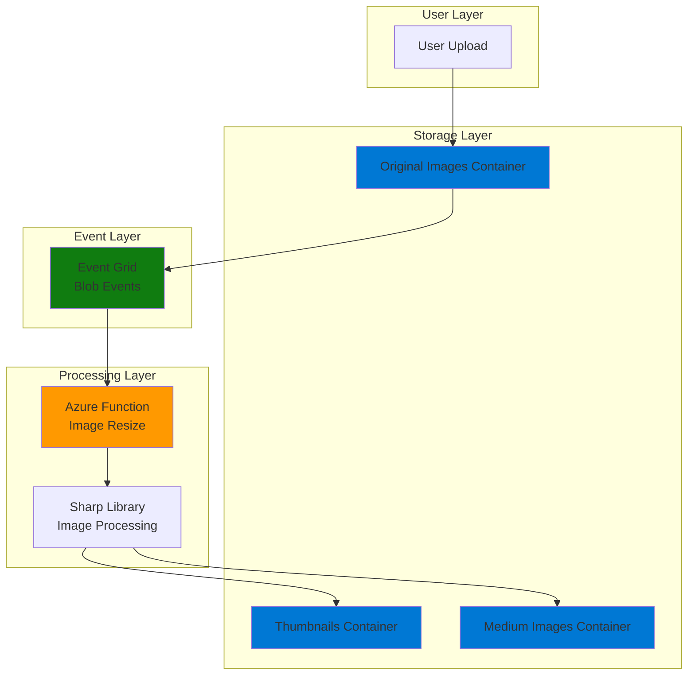

# Simple Image Resizing with Functions and Blob Storage

## Problem

Web applications frequently require multiple image sizes for responsive design and optimal performance across devices. Manually resizing images for thumbnails, previews, and different screen resolutions is time-consuming and error-prone. Applications need an automated solution that instantly generates standard web image sizes when users upload photos, reducing manual work and ensuring consistent image optimization.

## Solution

Azure Functions with Blob Storage provides a serverless, event-driven image processing solution that automatically resizes uploaded images to multiple standard sizes. When users upload images to a blob container, an Event Grid trigger instantly activates a function that uses the Sharp library to generate optimized thumbnails and web-ready images, storing them in organized containers for immediate use by web applications.

## Architecture Diagram



## Prerequisites

1. Azure account with contributor permissions for Functions and Storage
2. Azure CLI installed and configured (version 2.0.80+)
3. Node.js development knowledge (basic JavaScript understanding)
4. Basic understanding of serverless computing concepts
5. Estimated cost: $0.50 - $2.00 per month for development usage

> **Note**: The Consumption plan charges only for function execution time and storage usage, making this solution cost-effective for variable workloads with automatic scaling.

## Preparation

```bash
# Set environment variables for Azure resources
export RESOURCE_GROUP="rg-image-resize-${RANDOM_SUFFIX}"
export LOCATION="eastus"
export SUBSCRIPTION_ID=$(az account show --query id --output tsv)

# Generate unique suffix for resource names
RANDOM_SUFFIX=$(openssl rand -hex 3)

# Create resource group
az group create \
    --name ${RESOURCE_GROUP} \
    --location ${LOCATION} \
    --tags purpose=recipe environment=demo

echo "✅ Resource group created: ${RESOURCE_GROUP}"

# Create storage account for images and function storage
export STORAGE_ACCOUNT="stimage${RANDOM_SUFFIX}"

az storage account create \
    --name ${STORAGE_ACCOUNT} \
    --resource-group ${RESOURCE_GROUP} \
    --location ${LOCATION} \
    --sku Standard_LRS \
    --kind StorageV2 \
    --access-tier Hot

# Get storage connection string
export STORAGE_CONNECTION=$(az storage account show-connection-string \
    --name ${STORAGE_ACCOUNT} \
    --resource-group ${RESOURCE_GROUP} \
    --query connectionString --output tsv)

echo "✅ Storage account created: ${STORAGE_ACCOUNT}"
```

## Steps

1. **Create blob containers for image organization**:

   Azure Blob Storage provides scalable object storage optimized for unstructured data like images. Creating separate containers for original images and resized versions enables organized file management and simplified access patterns for web applications.

   ```bash
   # Create container for original uploaded images
   az storage container create \
       --name "original-images" \
       --connection-string ${STORAGE_CONNECTION} \
       --public-access blob
   
   # Create container for thumbnail images (150x150)
   az storage container create \
       --name "thumbnails" \
       --connection-string ${STORAGE_CONNECTION} \
       --public-access blob
   
   # Create container for medium-sized images (800x600)
   az storage container create \
       --name "medium-images" \
       --connection-string ${STORAGE_CONNECTION} \
       --public-access blob
   
   echo "✅ Blob containers created successfully"
   ```

   The containers are configured with blob-level public access to enable direct web access to processed images. This eliminates the need for additional authentication when serving images to web applications while maintaining security for the upload process.

2. **Create Function App with Consumption plan**:

   Azure Functions Consumption plan provides true serverless hosting with automatic scaling and pay-per-execution billing. The Node.js 20 runtime offers excellent performance for image processing workloads with native support for the Sharp library and modern JavaScript features.

   ```bash
   # Create Function App in Consumption plan
   export FUNCTION_APP="func-image-resize-${RANDOM_SUFFIX}"
   
   az functionapp create \
       --name ${FUNCTION_APP} \
       --resource-group ${RESOURCE_GROUP} \
       --storage-account ${STORAGE_ACCOUNT} \
       --consumption-plan-location ${LOCATION} \
       --runtime node \
       --runtime-version 20 \
       --functions-version 4 \
       --os-type Linux
   
   echo "✅ Function App created: ${FUNCTION_APP}"
   ```

   The Function App uses the same storage account for both function metadata and image processing, optimizing performance and reducing latency when accessing blob data within the same geographic region.

3. **Configure function settings and connection strings**:

   Application settings provide secure configuration management for connection strings and processing parameters. These settings are available as environment variables within the function runtime, enabling flexible configuration without code changes.

   ```bash
   # Configure storage connection for blob operations
   az functionapp config appsettings set \
       --name ${FUNCTION_APP} \
       --resource-group ${RESOURCE_GROUP} \
       --settings "AzureWebJobsStorage=${STORAGE_CONNECTION}" \
                  "WEBSITE_CONTENTAZUREFILECONNECTIONSTRING=${STORAGE_CONNECTION}" \
                  "StorageConnection=${STORAGE_CONNECTION}"
   
   # Configure image processing settings
   az functionapp config appsettings set \
       --name ${FUNCTION_APP} \
       --resource-group ${RESOURCE_GROUP} \
       --settings "THUMBNAIL_WIDTH=150" \
                  "THUMBNAIL_HEIGHT=150" \
                  "MEDIUM_WIDTH=800" \
                  "MEDIUM_HEIGHT=600"
   
   echo "✅ Function App settings configured"
   ```

   Separating configuration from code enables easy adjustment of image dimensions and quality settings without redeploying functions, supporting different environments and requirements.

4. **Create function project structure locally**:

   Local development provides faster iteration and testing before deployment. The Azure Functions Core Tools enable local debugging and testing with the same runtime environment used in Azure.

   ```bash
   # Create local function project directory
   mkdir image-resize-function && cd image-resize-function
   
   # Initialize Function App project
   func init . --javascript --model V4
   
   # Create blob trigger function
   func new --name ImageResize --template "Azure Blob Storage trigger"
   
   echo "✅ Function project structure created"
   ```

   The V4 programming model provides improved performance and simplified syntax for Azure Functions, with better support for modern JavaScript features and dependency injection.

5. **Install Sharp library for high-performance image processing**:

   Sharp is the fastest Node.js image processing library, utilizing libvips for 4x-5x better performance than ImageMagick alternatives. It provides native support for JPEG, PNG, WebP, and other web-optimized formats with advanced resizing algorithms.

   ```bash
   # Install Sharp for image processing
   npm install sharp
   
   # Install Azure Storage SDK for blob operations
   npm install @azure/storage-blob
   
   # Install Azure Functions SDK
   npm install @azure/functions
   
   echo "✅ Dependencies installed successfully"
   ```

   Sharp's streaming architecture and memory-efficient processing make it ideal for serverless environments where execution time and memory usage directly impact costs and performance.

6. **Implement the image resizing function**:

   The function uses Event Grid-based blob triggers for low-latency event processing, eliminating polling delays. Sharp's resize operations maintain aspect ratios and apply optimized compression for web delivery.

   ```bash
   # Create the main function code
   cat > src/functions/ImageResize.js << 'EOF'
   const { app } = require('@azure/functions');
   const sharp = require('sharp');
   const { BlobServiceClient } = require('@azure/storage-blob');

   app.storageBlob('ImageResize', {
       path: 'original-images/{name}',
       connection: 'StorageConnection',
       source: 'EventGrid',
       handler: async (blob, context) => {
           try {
               context.log(`Processing image: ${context.triggerMetadata.name}`);
               
               // Initialize blob service client
               const blobServiceClient = BlobServiceClient.fromConnectionString(
                   process.env.StorageConnection
               );
               
               // Get image dimensions from environment
               const thumbnailWidth = parseInt(process.env.THUMBNAIL_WIDTH) || 150;
               const thumbnailHeight = parseInt(process.env.THUMBNAIL_HEIGHT) || 150;
               const mediumWidth = parseInt(process.env.MEDIUM_WIDTH) || 800;
               const mediumHeight = parseInt(process.env.MEDIUM_HEIGHT) || 600;
               
               // Extract file information
               const fileName = context.triggerMetadata.name;
               const fileExtension = fileName.split('.').pop().toLowerCase();
               const baseName = fileName.replace(/\.[^/.]+$/, "");
               
               // Validate supported image formats
               const supportedFormats = ['jpg', 'jpeg', 'png', 'webp'];
               if (!supportedFormats.includes(fileExtension)) {
                   context.log(`Unsupported format: ${fileExtension}`);
                   return;
               }
               
               // Process thumbnail image
               const thumbnailBuffer = await sharp(blob)
                   .resize(thumbnailWidth, thumbnailHeight, {
                       fit: 'cover',
                       position: 'center'
                   })
                   .jpeg({ quality: 85, progressive: true })
                   .toBuffer();
               
               // Upload thumbnail
               const thumbnailContainer = blobServiceClient.getContainerClient('thumbnails');
               const thumbnailBlob = thumbnailContainer.getBlockBlobClient(`${baseName}-thumb.jpg`);
               await thumbnailBlob.upload(thumbnailBuffer, thumbnailBuffer.length, {
                   blobHTTPHeaders: { blobContentType: 'image/jpeg' }
               });
               
               // Process medium-sized image
               const mediumBuffer = await sharp(blob)
                   .resize(mediumWidth, mediumHeight, {
                       fit: 'inside',
                       withoutEnlargement: true
                   })
                   .jpeg({ quality: 90, progressive: true })
                   .toBuffer();
               
               // Upload medium image
               const mediumContainer = blobServiceClient.getContainerClient('medium-images');
               const mediumBlob = mediumContainer.getBlockBlobClient(`${baseName}-medium.jpg`);
               await mediumBlob.upload(mediumBuffer, mediumBuffer.length, {
                   blobHTTPHeaders: { blobContentType: 'image/jpeg' }
               });
               
               context.log(`Successfully processed: ${fileName}`);
               context.log(`Created thumbnail: ${baseName}-thumb.jpg`);
               context.log(`Created medium: ${baseName}-medium.jpg`);
               
           } catch (error) {
               context.log.error(`Error processing image: ${error.message}`);
               throw error;
           }
       }
   });
   EOF

   echo "✅ Image resizing function implemented"
   ```

   The function implements two different resize strategies: 'cover' for thumbnails (maintains aspect ratio, crops if needed) and 'inside' for medium images (maintains aspect ratio, never enlarges). Progressive JPEG encoding improves perceived loading performance.

7. **Deploy the function to Azure**:

   Azure Functions deployment includes automatic dependency resolution and optimization for the target runtime environment. The deployment process builds the function package and configures Event Grid subscriptions.

   ```bash
   # Deploy function to Azure
   func azure functionapp publish ${FUNCTION_APP}
   
   # Wait for deployment to complete
   sleep 30
   
   echo "✅ Function deployed successfully"
   ```

   The deployment process automatically installs native dependencies like Sharp's libvips bindings for the Linux runtime environment, ensuring optimal performance in the Azure serverless infrastructure.

## Validation & Testing

1. **Verify function deployment and configuration**:

   ```bash
   # Check function app status
   az functionapp show \
       --name ${FUNCTION_APP} \
       --resource-group ${RESOURCE_GROUP} \
       --query "state" --output tsv
   
   # Verify Event Grid subscription was created
   az functionapp function show \
       --name ${FUNCTION_APP} \
       --resource-group ${RESOURCE_GROUP} \
       --function-name ImageResize
   ```

   Expected output: Function should show "Running" state and display trigger configuration with EventGrid source.

2. **Test image upload and processing**:

   ```bash
   # Create a test image (requires ImageMagick or download sample)
   curl -o test-image.jpg "https://picsum.photos/1200/900.jpg"
   
   # Upload test image to trigger processing
   az storage blob upload \
       --container-name "original-images" \
       --name "test-photo.jpg" \
       --file test-image.jpg \
       --connection-string ${STORAGE_CONNECTION}
   
   echo "✅ Test image uploaded, processing should begin automatically"
   ```

3. **Verify processed images were created**:

   ```bash
   # Wait for processing to complete
   sleep 15
   
   # Check for generated thumbnail
   az storage blob exists \
       --container-name "thumbnails" \
       --name "test-photo-thumb.jpg" \
       --connection-string ${STORAGE_CONNECTION}
   
   # Check for generated medium image
   az storage blob exists \
       --container-name "medium-images" \
       --name "test-photo-medium.jpg" \
       --connection-string ${STORAGE_CONNECTION}
   
   # List all processed images
   echo "Generated thumbnails:"
   az storage blob list \
       --container-name "thumbnails" \
       --connection-string ${STORAGE_CONNECTION} \
       --output table
   
   echo "Generated medium images:"
   az storage blob list \
       --container-name "medium-images" \
       --connection-string ${STORAGE_CONNECTION} \
       --output table
   ```

4. **Monitor function execution logs**:

   ```bash
   # View recent function execution logs using Application Insights
   az monitor log-analytics query \
       --workspace $(az monitor app-insights component show \
           --app ${FUNCTION_APP} \
           --resource-group ${RESOURCE_GROUP} \
           --query workspaceResourceId --output tsv) \
       --analytics-query "traces | where timestamp > ago(10m) | order by timestamp desc"
   ```

## Cleanup

1. **Remove all Azure resources**:

   ```bash
   # Delete resource group and all contained resources
   az group delete \
       --name ${RESOURCE_GROUP} \
       --yes \
       --no-wait
   
   echo "✅ Resource group deletion initiated: ${RESOURCE_GROUP}"
   echo "Note: Deletion may take several minutes to complete"
   ```

2. **Clean up local development files**:

   ```bash
   # Remove local project directory
   cd .. && rm -rf image-resize-function
   
   # Remove test image
   rm -f test-image.jpg
   
   echo "✅ Local cleanup completed"
   ```

3. **Verify resource deletion**:

   ```bash
   # Check if resource group still exists (should return false)
   az group exists --name ${RESOURCE_GROUP}
   ```

## Discussion

This serverless image processing solution demonstrates the power of event-driven architecture using Azure Functions and Blob Storage. The implementation leverages Event Grid for near-instantaneous event delivery, eliminating the polling delays common in traditional blob trigger approaches. This results in sub-second processing times for uploaded images, making it suitable for real-time web applications.

The Sharp library provides exceptional performance advantages over alternative image processing solutions. By utilizing libvips internally, Sharp achieves 4x-5x faster processing speeds compared to ImageMagick while consuming less memory. This performance benefit directly translates to lower costs in serverless environments where execution time determines billing. The library's streaming architecture also enables processing of large images without loading entire files into memory, supporting high-resolution uploads within Azure Functions' memory constraints.

Azure Blob Storage's integration with Event Grid enables sophisticated event filtering and routing capabilities. The solution can be extended to handle different file types, implement conditional processing based on image metadata, or route events to multiple processing pipelines. The Hot access tier ensures optimal performance for frequently accessed processed images, while the Cool tier could be used for archive storage of original images, implementing a comprehensive cost optimization strategy.

Cost optimization in this solution follows Azure Well-Architected Framework principles. The Consumption plan charges only for actual execution time, making the solution cost-effective for variable workloads. Typical processing costs range from $0.01-$0.05 per 1000 images, depending on image size and complexity. Storage costs are minimal with Hot tier pricing for actively served images and potential Cool tier migration for archived originals. For more guidance on Azure Functions cost optimization, see the [Azure Functions pricing documentation](https://azure.microsoft.com/pricing/details/functions/).

> **Tip**: Enable Application Insights monitoring to track function performance, identify optimization opportunities, and set up cost alerts for proactive budget management across your image processing workloads.

## Challenge

Extend this solution by implementing these enhancements:

1. **Add WebP format support**: Modify the function to generate WebP versions of images alongside JPEG, reducing file sizes by 25-35% for modern browsers while maintaining backward compatibility with JPEG fallbacks.

2. **Implement intelligent cropping**: Use Azure Cognitive Services Computer Vision API to detect faces or important objects in images, enabling smart crop positioning for thumbnails that preserve subject matter.

3. **Add watermark functionality**: Extend the Sharp processing pipeline to overlay watermarks or logos on medium-sized images, supporting brand protection and content attribution requirements.

4. **Create batch processing capability**: Implement a separate function triggered by Service Bus messages to handle bulk image processing scenarios, supporting migration of existing image libraries or batch upload operations.

5. **Add metadata extraction and storage**: Use ExifReader library to extract image metadata (camera settings, GPS location, timestamps) and store structured data in Azure Cosmos DB for searchable image catalogs and analytics.

## Infrastructure Code

*Infrastructure code will be generated after recipe approval.*