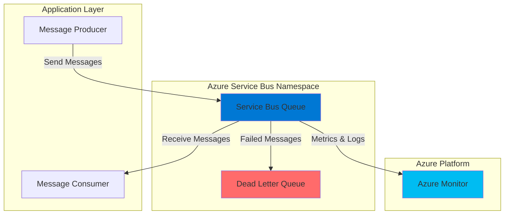

# Simple Message Queue with Service Bus

## Problem

Organizations struggle with reliable communication between distributed applications and services, particularly when components need to process data at different rates or during maintenance windows. Direct synchronous communication creates tight coupling, service dependencies, and points of failure that can cascade throughout the system, leading to poor resilience and scalability challenges.

## Solution

Azure Service Bus provides a fully managed enterprise message broker with message queues that enable reliable, asynchronous communication between applications. Service Bus queues implement First-In-First-Out (FIFO) message delivery, automatic dead-letter handling, and built-in durability, allowing applications to decouple and communicate reliably even when components are temporarily unavailable.

## Architecture Diagram



## Prerequisites

1. Azure account with active subscription and permissions to create Service Bus namespaces
2. Azure CLI installed and configured (version 2.0.45 or later)
3. Basic understanding of message queuing concepts
4. Understanding of Azure resource groups and regions
5. Estimated cost: $0.05/million operations (Standard tier) plus minimal base charges for testing

> **Note**: This recipe uses the Standard tier of Service Bus which provides full messaging capabilities. Basic tier doesn't support advanced features like message sessions or topics.

## Preparation

```bash
# Set environment variables for Azure resources
export RESOURCE_GROUP="rg-recipe-$(openssl rand -hex 3)"
export LOCATION="eastus"
export SUBSCRIPTION_ID=$(az account show --query id --output tsv)

# Generate unique suffix for resource names
RANDOM_SUFFIX=$(openssl rand -hex 3)
export SERVICEBUS_NAMESPACE="sbns-demo-${RANDOM_SUFFIX}"
export QUEUE_NAME="orders"

# Create resource group
az group create \
    --name ${RESOURCE_GROUP} \
    --location ${LOCATION} \
    --tags purpose=recipe environment=demo

echo "✅ Resource group created: ${RESOURCE_GROUP}"
```

## Steps

1. **Create Service Bus Namespace**:

   Azure Service Bus namespace provides a scoping container for messaging entities like queues and topics. The namespace serves as the unique DNS name for your messaging resources and contains all queue configurations, security policies, and access control settings within your subscription.

   ```bash
   # Create Service Bus namespace with Standard tier
   az servicebus namespace create \
       --resource-group ${RESOURCE_GROUP} \
       --name ${SERVICEBUS_NAMESPACE} \
       --location ${LOCATION} \
       --sku Standard \
       --tags environment=demo purpose=recipe
   
   echo "✅ Service Bus namespace created: ${SERVICEBUS_NAMESPACE}"
   ```

   The Standard tier provides advanced messaging features including message sessions, dead-letter queues, and duplicate detection. This tier is suitable for production workloads requiring reliable message delivery guarantees and enterprise messaging patterns.

2. **Create Message Queue**:

   Service Bus queues implement brokered messaging with First-In-First-Out (FIFO) delivery semantics. Each message is received and processed by exactly one consumer, making queues ideal for distributing work among multiple competing consumers or load-leveling between application components.

   ```bash
   # Create Service Bus queue with default settings
   az servicebus queue create \
       --resource-group ${RESOURCE_GROUP} \
       --namespace-name ${SERVICEBUS_NAMESPACE} \
       --name ${QUEUE_NAME} \
       --max-size 1024 \
       --default-message-time-to-live P14D \
       --enable-dead-lettering-on-message-expiration true
   
   echo "✅ Queue created: ${QUEUE_NAME}"
   ```

   The queue is configured with a 14-day message time-to-live and dead-letter queuing enabled. Dead-letter queues automatically capture messages that cannot be delivered or processed, providing essential error handling and message recovery capabilities.

3. **Retrieve Connection String**:

   The connection string contains authentication credentials and endpoint information required for applications to connect to your Service Bus namespace. Azure Service Bus uses Shared Access Signatures (SAS) for authentication, providing secure, time-limited access to messaging resources.

   ```bash
   # Get primary connection string for namespace
   CONNECTION_STRING=$(az servicebus namespace authorization-rule keys list \
       --resource-group ${RESOURCE_GROUP} \
       --namespace-name ${SERVICEBUS_NAMESPACE} \
       --name RootManageSharedAccessKey \
       --query primaryConnectionString \
       --output tsv)
   
   echo "✅ Connection string retrieved"
   echo "Connection String: ${CONNECTION_STRING}"
   ```

   The RootManageSharedAccessKey provides full management access to the namespace. In production environments, you should create specific authorization rules with minimal required permissions following the principle of least privilege.

4. **Create Test Application Code**:

   Since Azure CLI doesn't provide built-in commands for sending and receiving messages, we'll create a simple Node.js application to demonstrate queue operations. This approach shows how applications interact with Service Bus queues using the Azure SDK.

   ```bash
   # Create a temporary directory for test application
   mkdir servicebus-test && cd servicebus-test
   
   # Initialize Node.js project
   npm init -y
   
   # Install Azure Service Bus SDK
   npm install @azure/service-bus
   
   echo "✅ Test application environment created"
   ```

   The Azure Service Bus SDK provides comprehensive client libraries for sending, receiving, and managing messages. This SDK handles connection management, authentication, and error handling automatically.

5. **Create Message Sender Script**:

   The sender application demonstrates how to establish a connection to Service Bus and send messages to the queue. This script shows proper connection handling and message formatting for reliable delivery.

   ```bash
   # Create sender script
   cat > send-messages.js << 'EOF'
const { ServiceBusClient } = require("@azure/service-bus");

async function sendMessages() {
    const connectionString = process.env.CONNECTION_STRING;
    const queueName = process.env.QUEUE_NAME;
    
    const sbClient = new ServiceBusClient(connectionString);
    const sender = sbClient.createSender(queueName);
    
    try {
        const messages = [];
        for (let i = 1; i <= 5; i++) {
            messages.push({
                body: `Order message #${i} - ${new Date().toISOString()}`,
                subject: `Order ${i}`,
                applicationProperties: { orderId: i, priority: "normal" }
            });
        }
        
        await sender.sendMessages(messages);
        console.log(`✅ Sent ${messages.length} messages to queue`);
    } catch (error) {
        console.error("❌ Error sending messages:", error);
    } finally {
        await sender.close();
        await sbClient.close();
    }
}

sendMessages().catch(console.error);
EOF
   
   echo "✅ Message sender script created"
   ```

   The sender script creates multiple messages with metadata properties and sends them as a batch for efficient throughput. Each message includes a timestamp and custom properties that can be used for routing and processing logic.

6. **Create Message Receiver Script**:

   The receiver application demonstrates how to consume messages from the queue using different receive modes. This script shows proper message handling, acknowledgment, and error processing patterns.

   ```bash
   # Create receiver script
   cat > receive-messages.js << 'EOF'
const { ServiceBusClient } = require("@azure/service-bus");

async function receiveMessages() {
    const connectionString = process.env.CONNECTION_STRING;
    const queueName = process.env.QUEUE_NAME;
    
    const sbClient = new ServiceBusClient(connectionString);
    const receiver = sbClient.createReceiver(queueName);
    
    try {
        console.log("📥 Waiting to receive messages...");
        const messages = await receiver.receiveMessages(5, { maxWaitTimeInMs: 10000 });
        
        for (const message of messages) {
            console.log(`📨 Received: ${message.body}`);
            console.log(`   Subject: ${message.subject}`);
            console.log(`   Properties: ${JSON.stringify(message.applicationProperties)}`);
            
            // Complete the message to remove it from the queue
            await receiver.completeMessage(message);
        }
        
        console.log(`✅ Processed ${messages.length} messages`);
    } catch (error) {
        console.error("❌ Error receiving messages:", error);
    } finally {
        await receiver.close();
        await sbClient.close();
    }
}

receiveMessages().catch(console.error);
EOF
   
   echo "✅ Message receiver script created"
   ```

   The receiver uses the PeekLock mode by default, which locks messages during processing and requires explicit completion. This approach ensures message delivery guarantees and supports error handling through message abandonment or dead-lettering.

## Validation & Testing

1. **Verify namespace and queue creation**:

   ```bash
   # Confirm Service Bus namespace exists
   az servicebus namespace show \
       --resource-group ${RESOURCE_GROUP} \
       --name ${SERVICEBUS_NAMESPACE} \
       --query '{name:name, status:status, tier:sku.tier}' \
       --output table
   ```

   Expected output: Namespace status should show "Active" and tier should show "Standard"

2. **Test sending messages**:

   ```bash
   # Set environment variables for the scripts
   export CONNECTION_STRING="${CONNECTION_STRING}"
   export QUEUE_NAME="${QUEUE_NAME}"
   
   # Send test messages to the queue
   node send-messages.js
   ```

   Expected output: Should display confirmation that 5 messages were sent to the queue

3. **Verify queue properties and message count**:

   ```bash
   # Check queue properties and message count
   az servicebus queue show \
       --resource-group ${RESOURCE_GROUP} \
       --namespace-name ${SERVICEBUS_NAMESPACE} \
       --name ${QUEUE_NAME} \
       --query '{name:name, messageCount:messageCount, sizeInBytes:sizeInBytes, status:status}' \
       --output table
   ```

   Expected output: Should show 5 active messages in the queue with corresponding size information

4. **Test receiving messages**:

   ```bash
   # Receive and process messages from the queue
   node receive-messages.js
   ```

   Expected output: Should display received messages with their content and properties, then confirm processing completion

## Cleanup

1. **Clean up test application**:

   ```bash
   # Return to parent directory and remove test files
   cd ..
   rm -rf servicebus-test
   
   echo "✅ Test application cleaned up"
   ```

2. **Remove Service Bus resources**:

   ```bash
   # Delete the Service Bus namespace (includes all queues)
   az servicebus namespace delete \
       --resource-group ${RESOURCE_GROUP} \
       --name ${SERVICEBUS_NAMESPACE} \
       --no-wait
   
   echo "✅ Service Bus namespace deletion initiated"
   ```

3. **Remove resource group**:

   ```bash
   # Delete resource group and all contained resources
   az group delete \
       --name ${RESOURCE_GROUP} \
       --yes \
       --no-wait
   
   echo "✅ Resource group deletion initiated: ${RESOURCE_GROUP}"
   echo "Note: Deletion may take several minutes to complete"
   
   # Verify deletion (optional)
   az group exists --name ${RESOURCE_GROUP}
   ```

## Discussion

Azure Service Bus queues implement enterprise-grade messaging patterns that solve common distributed system challenges. The [brokered messaging model](https://learn.microsoft.com/en-us/azure/service-bus-messaging/service-bus-messaging-overview) provides reliable message delivery with built-in durability, ensuring messages persist even during system failures. This durability is achieved through Azure's managed infrastructure, which automatically handles message storage, replication, and recovery without requiring application-level complexity.

The FIFO delivery guarantee ensures message ordering consistency, which is crucial for business processes requiring sequential processing. Service Bus also provides [dead-letter queue capabilities](https://learn.microsoft.com/en-us/azure/service-bus-messaging/service-bus-dead-letter-queues) that automatically capture undeliverable or expired messages, enabling comprehensive error handling and message recovery workflows. These features support the Azure Well-Architected Framework's reliability pillar by providing built-in resilience and failure recovery mechanisms.

Service Bus offers three pricing tiers with different capabilities and cost structures. The Standard tier used in this recipe provides full messaging features including sessions, transactions, and duplicate detection, making it suitable for most production scenarios. For high-throughput scenarios, the Premium tier offers dedicated resources and predictable performance with [messaging units for auto-scaling](https://learn.microsoft.com/en-us/azure/service-bus-messaging/automate-update-messaging-units). The [Advanced Message Queuing Protocol (AMQP)](https://learn.microsoft.com/en-us/azure/service-bus-messaging/service-bus-amqp-overview) support ensures interoperability with industry-standard messaging clients and protocols.

> **Tip**: Enable diagnostic settings to send Service Bus metrics and logs to Azure Monitor for comprehensive observability and alerting capabilities. Use the [Service Bus Explorer](https://learn.microsoft.com/en-us/azure/service-bus-messaging/explorer) in the Azure portal for interactive message testing and troubleshooting.

## Challenge

Extend this solution by implementing these enhancements:

1. **Implement message sessions** for guaranteed FIFO processing within related message groups using session-enabled queues and session-aware receivers
2. **Add duplicate detection** by enabling Service Bus duplicate detection features to automatically identify and remove duplicate messages within a configurable time window
3. **Create custom authorization rules** with specific permissions for different application components, implementing least-privilege access using Service Bus RBAC
4. **Integrate with Azure Functions** to automatically process messages using Service Bus triggers, enabling serverless message processing workflows
5. **Set up monitoring and alerting** using Azure Monitor to track queue depth, processing latency, and dead-letter queue activity with automated alert notifications

## Infrastructure Code

*Infrastructure code will be generated after recipe approval.*