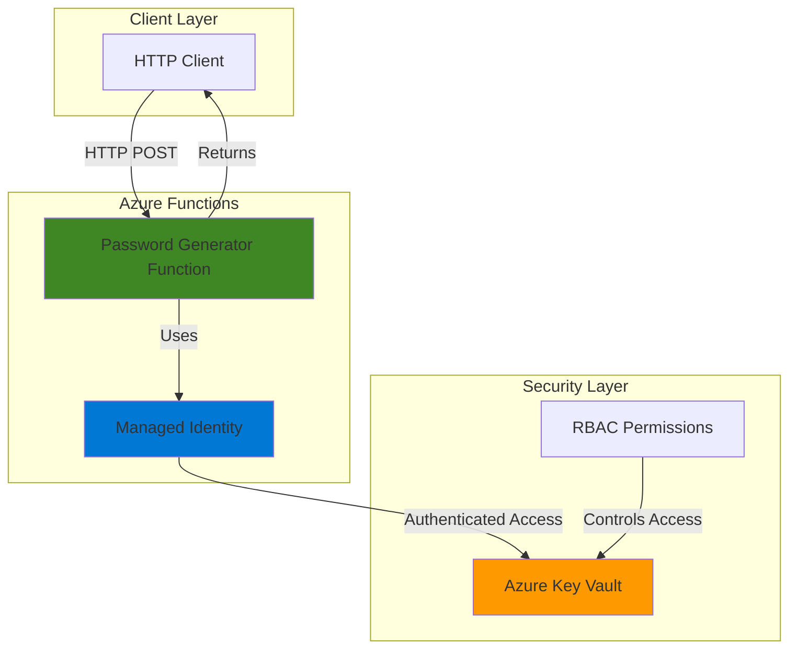

# Simple Password Generator with Functions and Key Vault

## Problem

Organizations frequently need secure, randomly generated passwords for various applications, services, and user accounts. Manual password generation is time-consuming and often results in weak, predictable passwords. Storing these credentials in source code or configuration files creates significant security vulnerabilities and compliance risks. Teams need a centralized, secure solution that can generate strong passwords on-demand while automatically storing them in a protected secrets management system.

## Solution

Build a serverless password generator API using Azure Functions that creates cryptographically secure passwords and automatically stores them in Azure Key Vault. The solution leverages managed identity for secure, credential-free authentication between services, eliminating the need to manage connection strings or access keys. This approach provides on-demand password generation through a simple HTTP API while ensuring all secrets are securely stored and auditable.

## Architecture Diagram



## Prerequisites

1. Azure subscription with appropriate permissions to create Function Apps and Key Vaults
2. Azure CLI installed and configured (version 2.0 or later)
3. Node.js 18.x or later for local development (if needed)
4. Basic knowledge of JavaScript and HTTP APIs
5. Basic understanding of Azure managed identity concepts
6. Estimated cost: $5-10 for Function App consumption plan and Key Vault operations during testing

> **Note**: This recipe follows Azure Well-Architected Framework security principles by using managed identity instead of connection strings or access keys.

## Preparation

```bash
# Set environment variables for Azure resources
export RESOURCE_GROUP="rg-password-gen-${RANDOM_SUFFIX}"
export LOCATION="eastus"
export SUBSCRIPTION_ID=$(az account show --query id --output tsv)

# Generate unique suffix for resource names
RANDOM_SUFFIX=$(openssl rand -hex 3)

# Set resource names with unique suffix
export KEY_VAULT_NAME="kv-passgen-${RANDOM_SUFFIX}"
export STORAGE_ACCOUNT="stpassgen${RANDOM_SUFFIX}"
export FUNCTION_APP_NAME="func-passgen-${RANDOM_SUFFIX}"

# Create resource group
az group create \
    --name ${RESOURCE_GROUP} \
    --location ${LOCATION} \
    --tags purpose=recipe environment=demo

echo "✅ Resource group created: ${RESOURCE_GROUP}"
```

## Steps

1. **Create Azure Key Vault for Secure Password Storage**:

   Azure Key Vault provides enterprise-grade secrets management with hardware security module (HSM) backing and comprehensive audit logging. Creating the vault first ensures our Function App can securely store generated passwords with proper access controls and encryption at rest.

   ```bash
   # Create Key Vault with soft delete and purge protection
   az keyvault create \
       --name ${KEY_VAULT_NAME} \
       --resource-group ${RESOURCE_GROUP} \
       --location ${LOCATION} \
       --enable-soft-delete true \
       --retention-days 7 \
       --enable-purge-protection false
   
   # Store Key Vault URI for later use
   VAULT_URI=$(az keyvault show \
       --name ${KEY_VAULT_NAME} \
       --resource-group ${RESOURCE_GROUP} \
       --query properties.vaultUri \
       --output tsv)
   
   echo "✅ Key Vault created with URI: ${VAULT_URI}"
   ```

   The Key Vault is now ready with enterprise security features enabled. Soft delete provides protection against accidental deletion while maintaining cost efficiency for this demo environment.

2. **Create Storage Account for Function App Runtime**:

   Azure Functions requires a storage account for runtime operations, trigger management, and function execution logs. This foundational storage enables the serverless platform to manage function state and execution metadata efficiently.

   ```bash
   # Create storage account for Functions runtime
   az storage account create \
       --name ${STORAGE_ACCOUNT} \
       --resource-group ${RESOURCE_GROUP} \
       --location ${LOCATION} \
       --sku Standard_LRS \
       --kind StorageV2
   
   echo "✅ Storage account created: ${STORAGE_ACCOUNT}"
   ```

3. **Create Function App with System-Assigned Managed Identity**:

   Azure Functions provides serverless compute with automatic scaling and pay-per-execution pricing. Enabling system-assigned managed identity creates a secure identity tied to the Function App lifecycle, eliminating the need for explicit credential management when accessing Azure services.

   ```bash
   # Create Function App with managed identity enabled
   az functionapp create \
       --name ${FUNCTION_APP_NAME} \
       --resource-group ${RESOURCE_GROUP} \
       --storage-account ${STORAGE_ACCOUNT} \
       --consumption-plan-location ${LOCATION} \
       --runtime node \
       --runtime-version 20 \
       --functions-version 4 \
       --assign-identity [system]
   
   # Retrieve the managed identity principal ID
   PRINCIPAL_ID=$(az functionapp identity show \
       --name ${FUNCTION_APP_NAME} \
       --resource-group ${RESOURCE_GROUP} \
       --query principalId \
       --output tsv)
   
   echo "✅ Function App created with managed identity: ${PRINCIPAL_ID}"
   ```

   The Function App now has a system-assigned managed identity that Azure automatically manages throughout the application lifecycle. This identity will authenticate securely with Key Vault without requiring stored credentials.

4. **Grant Key Vault Access to Function App Managed Identity**:

   Azure Role-Based Access Control (RBAC) provides fine-grained permission management for Key Vault operations. Granting the "Key Vault Secrets Officer" role enables the Function App to create, read, and manage secrets while following the principle of least privilege.

   ```bash
   # Grant Key Vault Secrets Officer role to Function App identity
   az role assignment create \
       --assignee ${PRINCIPAL_ID} \
       --role "Key Vault Secrets Officer" \
       --scope "/subscriptions/${SUBSCRIPTION_ID}/resourceGroups/${RESOURCE_GROUP}/providers/Microsoft.KeyVault/vaults/${KEY_VAULT_NAME}"
   
   # Configure Key Vault URI as Function App setting
   az functionapp config appsettings set \
       --name ${FUNCTION_APP_NAME} \
       --resource-group ${RESOURCE_GROUP} \
       --settings "KEY_VAULT_URI=${VAULT_URI}"
   
   echo "✅ Key Vault access granted and URI configured"
   ```

   The Function App can now securely access Key Vault using its managed identity. The Key Vault URI is stored as an application setting for easy access within function code.

5. **Create Function Code Directory and Package Configuration**:

   Azure Functions v4 for Node.js uses a specific project structure with package.json configuration and dependency management. Setting up the proper directory structure ensures smooth deployment and runtime execution.

   ```bash
   # Create temporary directory for function code
   mkdir -p /tmp/password-generator-function
   cd /tmp/password-generator-function
   
   # Create package.json with required dependencies
   cat > package.json << 'EOF'
   {
     "name": "password-generator-function",
     "version": "1.0.0",
     "description": "Serverless password generator with Key Vault storage",
     "main": "src/functions/*.js",
     "scripts": {
       "start": "func start",
       "test": "echo \"No tests yet\""
     },
     "dependencies": {
       "@azure/functions": "^4.0.0",
       "@azure/keyvault-secrets": "^4.8.0",
       "@azure/identity": "^4.2.1"
     },
     "devDependencies": {}
   }
   EOF
   
   echo "✅ Function project structure created"
   ```

6. **Create Password Generator Function with Key Vault Integration**:

   The function implements cryptographically secure password generation using Node.js crypto module and stores passwords in Key Vault using managed identity authentication. The code follows Azure Functions v4 programming model with proper error handling and HTTP response formatting.

   ```bash
   # Create functions directory
   mkdir -p src/functions
   
   # Create the password generator function
   cat > src/functions/generatePassword.js << 'EOF'
   const { app } = require('@azure/functions');
   const { SecretClient } = require('@azure/keyvault-secrets');
   const { DefaultAzureCredential } = require('@azure/identity');
   const crypto = require('crypto');
   
   // Initialize Key Vault client with managed identity
   const credential = new DefaultAzureCredential();
   const vaultUrl = process.env.KEY_VAULT_URI;
   const client = new SecretClient(vaultUrl, credential);
   
   // Generate cryptographically secure password
   function generateSecurePassword(length = 16) {
       const charset = 'abcdefghijklmnopqrstuvwxyzABCDEFGHIJKLMNOPQRSTUVWXYZ0123456789!@#$%^&*';
       let password = '';
       
       for (let i = 0; i < length; i++) {
           const randomIndex = crypto.randomInt(0, charset.length);
           password += charset[randomIndex];
       }
       
       return password;
   }
   
   app.http('generatePassword', {
       methods: ['POST'],
       authLevel: 'function',
       handler: async (request, context) => {
           try {
               const requestBody = await request.json();
               const secretName = requestBody.secretName;
               const passwordLength = requestBody.length || 16;
               
               // Validate input
               if (!secretName || secretName.length < 1) {
                   return {
                       status: 400,
                       jsonBody: { error: 'secretName is required' }
                   };
               }
               
               // Generate secure password
               const password = generateSecurePassword(passwordLength);
               
               // Store password in Key Vault
               await client.setSecret(secretName, password, {
                   contentType: 'password',
                   tags: {
                       generatedBy: 'azure-functions',
                       timestamp: new Date().toISOString()
                   }
               });
               
               context.log(`Password generated and stored for secret: ${secretName}`);
               
               return {
                   status: 200,
                   jsonBody: {
                       message: 'Password generated and stored successfully',
                       secretName: secretName,
                       vaultUri: vaultUrl
                   }
               };
               
           } catch (error) {
               context.log.error('Error generating password:', error);
               return {
                   status: 500,
                   jsonBody: { error: 'Internal server error' }
               };
           }
       }
   });
   EOF
   
   echo "✅ Password generator function created"
   ```

   The function code implements secure password generation with configurable length and automatic Key Vault storage. Error handling ensures robust operation while logging provides observability for monitoring and debugging.

7. **Deploy Function to Azure**:

   Azure Functions deployment packages the local code and dependencies, then deploys to the cloud Function App. Using the recommended `func azure functionapp publish` command ensures proper packaging and deployment of the v4 programming model.

   ```bash
   # Install Azure Functions Core Tools if not already installed
   npm install -g azure-functions-core-tools@4 --unsafe-perm true
   
   # Install dependencies
   npm install
   
   # Deploy function to Azure using Core Tools
   func azure functionapp publish ${FUNCTION_APP_NAME}
   
   echo "✅ Function deployed to Azure"
   ```

8. **Retrieve Function Access Key for Testing**:

   Azure Functions uses access keys for authentication when authLevel is set to 'function'. Retrieving the function-specific key enables secure testing of the deployed function while maintaining proper access controls.

   ```bash
   # Get function app master key for testing
   FUNCTION_KEY=$(az functionapp keys list \
       --name ${FUNCTION_APP_NAME} \
       --resource-group ${RESOURCE_GROUP} \
       --query masterKey \
       --output tsv)
   
   # Get function app hostname
   FUNCTION_URL="https://${FUNCTION_APP_NAME}.azurewebsites.net"
   
   echo "✅ Function URL: ${FUNCTION_URL}"
   echo "✅ Access key retrieved for testing"
   ```

## Validation & Testing

1. **Test password generation and Key Vault storage**:

   ```bash
   # Test the password generator function
   curl -X POST "${FUNCTION_URL}/api/generatePassword?code=${FUNCTION_KEY}" \
        -H "Content-Type: application/json" \
        -d '{"secretName": "test-password-001", "length": 20}'
   ```

   Expected output:
   ```json
   {
     "message": "Password generated and stored successfully",
     "secretName": "test-password-001",
     "vaultUri": "https://kv-passgen-abc123.vault.azure.net/"
   }
   ```

2. **Verify password was stored in Key Vault**:

   ```bash
   # List secrets in Key Vault to confirm storage
   az keyvault secret list \
       --vault-name ${KEY_VAULT_NAME} \
       --query "[].{Name:name, Created:attributes.created}" \
       --output table
   
   # Retrieve the generated password (for verification only)
   az keyvault secret show \
       --vault-name ${KEY_VAULT_NAME} \
       --name "test-password-001" \
       --query "value" \
       --output tsv
   ```

3. **Test error handling with invalid input**:

   ```bash
   # Test with missing secretName to verify error handling
   curl -X POST "${FUNCTION_URL}/api/generatePassword?code=${FUNCTION_KEY}" \
        -H "Content-Type: application/json" \
        -d '{}'
   ```

   Expected output:
   ```json
   {
     "error": "secretName is required"
   }
   ```

4. **Monitor function execution logs**:

   ```bash
   # View recent function execution logs using Azure CLI
   az monitor app-insights query \
       --app ${FUNCTION_APP_NAME} \
       --analytics-query "traces | where timestamp > ago(10m) | project timestamp, message" \
       --output table
   ```

## Cleanup

1. **Remove test secrets from Key Vault**:

   ```bash
   # Delete test secrets
   az keyvault secret delete \
       --vault-name ${KEY_VAULT_NAME} \
       --name "test-password-001"
   
   echo "✅ Test secrets deleted from Key Vault"
   ```

2. **Delete the entire resource group and all resources**:

   ```bash
   # Delete resource group and all contained resources
   az group delete \
       --name ${RESOURCE_GROUP} \
       --yes \
       --no-wait
   
   echo "✅ Resource group deletion initiated: ${RESOURCE_GROUP}"
   echo "Note: Deletion may take several minutes to complete"
   ```

3. **Clean up local temporary files**:

   ```bash
   # Remove temporary function code directory
   rm -rf /tmp/password-generator-function
   
   echo "✅ Local temporary files cleaned up"
   ```

## Discussion

This serverless password generator demonstrates several key Azure security and architectural patterns. **Managed Identity** eliminates the need for connection strings or access keys, providing secure authentication between Azure services without credential management overhead. The Azure platform automatically handles identity lifecycle, token refresh, and secure communication protocols.

**Azure Key Vault** serves as the centralized secrets store with enterprise-grade security features including HSM-backed encryption, audit logging, and access policies. The integration pattern shown here extends to other scenarios requiring secure storage of API keys, database connection strings, and certificates. The RBAC permissions model ensures fine-grained access control following security best practices.

**Azure Functions** provides the serverless compute platform with automatic scaling, pay-per-execution pricing, and seamless integration with other Azure services. The consumption plan model ensures cost efficiency for irregular workloads while maintaining high availability and performance. The v4 programming model simplifies development with improved debugging and local development experiences.

The solution follows Azure Well-Architected Framework principles across multiple pillars. **Security** is enhanced through managed identity, encrypted storage, and proper access controls. **Reliability** benefits from Azure's managed services and built-in redundancy. **Performance Efficiency** is achieved through serverless scaling and optimized resource allocation. **Cost Optimization** results from consumption-based pricing and efficient resource utilization.

> **Tip**: Consider implementing secret rotation using Azure Event Grid notifications and automated workflows for production environments. Azure Key Vault supports automatic secret rotation for enhanced security posture.

For additional security hardening, explore implementing [Azure Private Endpoints](https://docs.microsoft.com/en-us/azure/private-link/private-endpoint-overview) to restrict Key Vault access to private networks, and consider using [Azure Application Insights](https://docs.microsoft.com/en-us/azure/azure-monitor/app/app-insights-overview) for comprehensive application monitoring and performance analytics.

## Challenge

Extend this solution by implementing these enhancements:

1. **Secret Rotation Automation**: Configure Azure Event Grid to trigger password rotation before expiration using Key Vault events and Logic Apps workflows
2. **Password Policy Enforcement**: Add configurable password complexity rules including character requirements, forbidden patterns, and dictionary checks
3. **Multi-Tenant Support**: Implement tenant isolation using separate Key Vault instances or naming conventions with proper RBAC boundaries
4. **Audit Dashboard**: Create a Power BI dashboard displaying password generation metrics, usage patterns, and compliance reporting
5. **API Rate Limiting**: Implement Azure API Management with rate limiting policies and OAuth 2.0 authentication for production API governance

## Infrastructure Code

### Available Infrastructure as Code:

- [Infrastructure Code Overview](code/README.md) - Detailed description of all infrastructure components
- [Bicep](code/bicep/) - Azure Bicep templates
- [Bash CLI Scripts](code/scripts/) - Example bash scripts using Azure CLI commands to deploy infrastructure
- [Terraform](code/terraform/) - Terraform configuration files