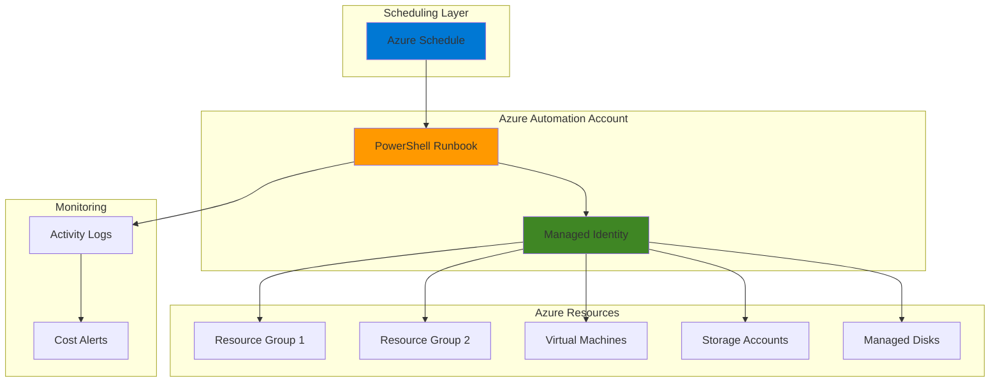

# Simple Resource Cleanup with Automation and PowerShell

## Problem

Development teams frequently create Azure resources for testing and experimentation but often forget to clean them up afterward, leading to unexpected cloud costs and resource sprawl. Without automated cleanup processes, organizations can accumulate hundreds of unused virtual machines, storage accounts, and other resources that continue generating monthly charges despite providing no business value.

## Solution

Implement an automated resource cleanup solution using Azure Automation and PowerShell runbooks that identifies and removes unused or old resources based on configurable criteria like tags, creation dates, and resource utilization patterns. This solution schedules regular cleanup tasks to maintain cost optimization and environmental hygiene automatically.

## Architecture Diagram



## Prerequisites

1. Azure subscription with Contributor permissions on target resource groups
2. Azure CLI installed and configured (or Azure Cloud Shell)
3. Basic understanding of PowerShell scripting and Azure resource management
4. Knowledge of Azure resource tagging strategies
5. Estimated cost: $5-10/month for Azure Automation (includes 500 minutes of runbook execution time)

> **Note**: This solution follows Azure Well-Architected Framework cost optimization principles by implementing automated resource lifecycle management.

## Preparation

```bash
# Set environment variables for Azure resources
export RESOURCE_GROUP="rg-cleanup-demo-${RANDOM_SUFFIX}"
export LOCATION="eastus"
export SUBSCRIPTION_ID=$(az account show --query id --output tsv)

# Generate unique suffix for resource names
RANDOM_SUFFIX=$(openssl rand -hex 3)

# Create resource group for automation resources
az group create \
    --name ${RESOURCE_GROUP} \
    --location ${LOCATION} \
    --tags purpose=automation environment=demo \
           project=resource-cleanup

echo "✅ Resource group created: ${RESOURCE_GROUP}"

# Set automation account name
export AUTOMATION_ACCOUNT="aa-cleanup-${RANDOM_SUFFIX}"
```

## Steps

1. **Create Azure Automation Account with Managed Identity**:

   Azure Automation provides a cloud-based platform for hosting and executing PowerShell runbooks with built-in scheduling, logging, and managed identity authentication. This service eliminates the need to maintain dedicated infrastructure while providing centralized management and audit trails for all automation tasks.

   ```bash
   # Create Azure Automation account with system-assigned managed identity
   az automation account create \
       --name ${AUTOMATION_ACCOUNT} \
       --resource-group ${RESOURCE_GROUP} \
       --location ${LOCATION} \
       --assign-identity \
       --tags environment=demo purpose=cleanup
   
   echo "✅ Automation account created: ${AUTOMATION_ACCOUNT}"
   ```

   The Automation account is now ready with a system-assigned managed identity that will authenticate against Azure resources. This eliminates the need for stored credentials and follows Azure security best practices for service-to-service authentication.

2. **Assign Required Permissions to Managed Identity**:

   Managed identities provide secure authentication without storing credentials in code or configuration. The system-assigned managed identity created with the Automation account needs appropriate RBAC permissions to query and delete Azure resources across target subscriptions.

   ```bash
   # Get the managed identity principal ID
   PRINCIPAL_ID=$(az automation account show \
       --name ${AUTOMATION_ACCOUNT} \
       --resource-group ${RESOURCE_GROUP} \
       --query identity.principalId --output tsv)
   
   # Assign Contributor role at subscription level
   az role assignment create \
       --assignee ${PRINCIPAL_ID} \
       --role "Contributor" \
       --scope "/subscriptions/${SUBSCRIPTION_ID}"
   
   echo "✅ Contributor permissions assigned to managed identity"
   ```

   The Contributor role provides necessary permissions to read resource metadata and delete resources while following the principle of least privilege for automated cleanup operations.

3. **Create PowerShell Runbook for Resource Cleanup**:

   PowerShell runbooks in Azure Automation execute in a secure, scalable environment with access to Azure PowerShell modules and managed identity authentication. This runbook implements intelligent resource cleanup logic based on configurable criteria like tags, age, and resource type.

   ```bash
   # Create the cleanup runbook
   cat > cleanup-runbook.ps1 << 'EOF'
   param(
       [int]$DaysOld = 7,
       [string]$Environment = "dev",
       [bool]$DryRun = $true
   )

   # Ensure no context inheritance and connect using managed identity
   Disable-AzContextAutosave -Scope Process
   $AzureContext = (Connect-AzAccount -Identity).context
   $AzureContext = Set-AzContext -SubscriptionName $AzureContext.Subscription `
       -DefaultProfile $AzureContext

   Write-Output "Starting resource cleanup process..."
   Write-Output "Parameters: DaysOld=$DaysOld, Environment=$Environment, DryRun=$DryRun"

   # Calculate cutoff date
   $cutoffDate = (Get-Date).AddDays(-$DaysOld)
   Write-Output "Resources created before $cutoffDate will be considered for cleanup"

   # Get all resource groups with specified environment tag
   $resourceGroups = Get-AzResourceGroup | Where-Object {
       $_.Tags.Environment -eq $Environment -and
       $_.Tags.AutoCleanup -eq "true"
   }

   $cleanupSummary = @{
       ResourceGroupsProcessed = 0
       ResourcesFound = 0
       ResourcesDeleted = 0
       Errors = @()
   }

   foreach ($rg in $resourceGroups) {
       Write-Output "Processing resource group: $($rg.ResourceGroupName)"
       $cleanupSummary.ResourceGroupsProcessed++
       
       try {
           # Get resources older than cutoff date
           $oldResources = Get-AzResource -ResourceGroupName $rg.ResourceGroupName | Where-Object {
               $_.Tags.DoNotDelete -ne "true" -and
               $_.CreatedTime -ne $null -and
               [DateTime]$_.CreatedTime -lt $cutoffDate
           }
           
           $cleanupSummary.ResourcesFound += $oldResources.Count
           
           foreach ($resource in $oldResources) {
               Write-Output "Found old resource: $($resource.Name) (Type: $($resource.ResourceType), Created: $($resource.CreatedTime))"
               
               if (-not $DryRun) {
                   Write-Output "Deleting resource: $($resource.Name)"
                   Remove-AzResource -ResourceId $resource.ResourceId -Force
                   $cleanupSummary.ResourcesDeleted++
               } else {
                   Write-Output "DRY RUN: Would delete resource: $($resource.Name)"
               }
           }
       }
       catch {
           $errorMsg = "Error processing resource group $($rg.ResourceGroupName): $($_.Exception.Message)"
           Write-Error $errorMsg
           $cleanupSummary.Errors += $errorMsg
       }
   }

   # Output summary
   Write-Output "Cleanup Summary:"
   Write-Output "- Resource Groups Processed: $($cleanupSummary.ResourceGroupsProcessed)"
   Write-Output "- Resources Found: $($cleanupSummary.ResourcesFound)"
   Write-Output "- Resources Deleted: $($cleanupSummary.ResourcesDeleted)"
   Write-Output "- Errors: $($cleanupSummary.Errors.Count)"

   if ($cleanupSummary.Errors.Count -gt 0) {
       Write-Output "Errors encountered:"
       $cleanupSummary.Errors | ForEach-Object { Write-Output "  - $_" }
   }
   EOF

   # Import the runbook
   az automation runbook create \
       --automation-account-name ${AUTOMATION_ACCOUNT} \
       --resource-group ${RESOURCE_GROUP} \
       --name "ResourceCleanupRunbook" \
       --type "PowerShell" \
       --description "Automated cleanup of old Azure resources"

   echo "✅ PowerShell runbook created successfully"
   ```

   This runbook implements safety features including dry-run mode, tag-based exclusions, proper context management, and comprehensive logging to ensure controlled and auditable resource cleanup operations.

4. **Upload and Publish the Runbook**:

   Publishing a runbook makes it available for execution and scheduling. The Azure Automation service validates the PowerShell syntax and prepares the runbook for production use with proper error handling and output capture.

   ```bash
   # Upload the runbook content
   az automation runbook replace-content \
       --automation-account-name ${AUTOMATION_ACCOUNT} \
       --resource-group ${RESOURCE_GROUP} \
       --name "ResourceCleanupRunbook" \
       --content @cleanup-runbook.ps1

   # Publish the runbook
   az automation runbook publish \
       --automation-account-name ${AUTOMATION_ACCOUNT} \
       --resource-group ${RESOURCE_GROUP} \
       --name "ResourceCleanupRunbook"

   echo "✅ Runbook published and ready for execution"
   ```

   The published runbook is now available in the Azure Automation account and can be executed manually or scheduled for automated runs.

5. **Create Test Resources with Appropriate Tags**:

   Creating test resources with proper tagging demonstrates the cleanup system's functionality and validates tag-based filtering logic. These resources simulate real-world scenarios where development resources need automated lifecycle management.

   ```bash
   # Create test resource group
   export TEST_RG="rg-cleanup-test-${RANDOM_SUFFIX}"
   
   az group create \
       --name ${TEST_RG} \
       --location ${LOCATION} \
       --tags Environment=dev AutoCleanup=true \
              Project=testing CreatedBy=automation

   # Create a test storage account (will be cleaned up)
   export TEST_STORAGE="sttest${RANDOM_SUFFIX}"
   
   az storage account create \
       --name ${TEST_STORAGE} \
       --resource-group ${TEST_RG} \
       --location ${LOCATION} \
       --sku Standard_LRS \
       --tags Environment=dev AutoCleanup=true \
              Purpose=testing

   # Create a protected storage account (will NOT be cleaned up)
   export PROTECTED_STORAGE="stprotected${RANDOM_SUFFIX}"
   
   az storage account create \
       --name ${PROTECTED_STORAGE} \
       --resource-group ${TEST_RG} \
       --location ${LOCATION} \
       --sku Standard_LRS \
       --tags Environment=dev DoNotDelete=true \
              Purpose=production

   echo "✅ Test resources created with appropriate tags"
   ```

   These test resources demonstrate how the cleanup logic respects tag-based policies and protection mechanisms.

6. **Create Schedule for Automated Cleanup**:

   Azure Automation schedules enable unattended execution of runbooks based on configurable timing patterns. This schedule implements a weekly cleanup cycle during off-hours to minimize impact on development activities while maintaining cost optimization.

   ```bash
   # Create a weekly schedule using PowerShell (more reliable for weekly schedules)
   az automation runbook start \
       --automation-account-name ${AUTOMATION_ACCOUNT} \
       --resource-group ${RESOURCE_GROUP} \
       --name "ResourceCleanupRunbook" \
       --parameters '{
         "PowerShellScript": "
           New-AzAutomationSchedule -AutomationAccountName \"'${AUTOMATION_ACCOUNT}'\" \
             -ResourceGroupName \"'${RESOURCE_GROUP}'\" \
             -Name \"WeeklyCleanupSchedule\" \
             -Description \"Weekly cleanup of dev resources\" \
             -StartTime (Get-Date).AddDays(1).Date.AddHours(2) \
             -WeekInterval 1 \
             -DaysOfWeek Sunday
         "
       }'

   echo "✅ Weekly cleanup schedule creation initiated"
   ```

   The schedule will run every Sunday at 2 AM, providing automated maintenance during typical low-usage periods.

## Validation & Testing

1. **Test the runbook in dry-run mode**:

   ```bash
   # Start the runbook with dry-run enabled
   JOB_ID=$(az automation runbook start \
       --automation-account-name ${AUTOMATION_ACCOUNT} \
       --resource-group ${RESOURCE_GROUP} \
       --name "ResourceCleanupRunbook" \
       --parameters "DaysOld=0" "Environment=dev" "DryRun=true" \
       --query jobId --output tsv)

   echo "Runbook job started with ID: ${JOB_ID}"
   
   # Wait for job completion and check output
   sleep 30
   
   az automation job show \
       --automation-account-name ${AUTOMATION_ACCOUNT} \
       --resource-group ${RESOURCE_GROUP} \
       --job-id ${JOB_ID} \
       --query status --output tsv
   ```

   Expected output: `Completed` status indicating successful dry-run execution.

2. **Verify cleanup logic identifies correct resources**:

   ```bash
   # Get job output to verify resource identification
   az automation job get-output \
       --automation-account-name ${AUTOMATION_ACCOUNT} \
       --resource-group ${RESOURCE_GROUP} \
       --job-id ${JOB_ID} \
       --stream-type "Output"
   ```

   Expected output: Log entries showing test resources identified for cleanup while protected resources are excluded.

3. **Test actual resource deletion**:

   ```bash
   # Run with dry-run disabled (use carefully!)
   CLEANUP_JOB_ID=$(az automation runbook start \
       --automation-account-name ${AUTOMATION_ACCOUNT} \
       --resource-group ${RESOURCE_GROUP} \
       --name "ResourceCleanupRunbook" \
       --parameters "DaysOld=0" "Environment=dev" "DryRun=false" \
       --query jobId --output tsv)

   echo "Cleanup job started: ${CLEANUP_JOB_ID}"
   ```

   Monitor job execution and verify that only unprotected test resources are deleted.

## Cleanup

1. **Remove test resources and resource groups**:

   ```bash
   # Delete test resource group and all contained resources
   az group delete \
       --name ${TEST_RG} \
       --yes \
       --no-wait

   echo "✅ Test resource group deletion initiated"
   ```

2. **Remove automation account and main resource group**:

   ```bash
   # Delete the automation account
   az automation account delete \
       --name ${AUTOMATION_ACCOUNT} \
       --resource-group ${RESOURCE_GROUP} \
       --yes

   # Delete the main resource group
   az group delete \
       --name ${RESOURCE_GROUP} \
       --yes \
       --no-wait

   echo "✅ Cleanup automation resources deleted"
   ```

3. **Clean up local files**:

   ```bash
   # Remove local script files
   rm -f cleanup-runbook.ps1

   echo "✅ Local files cleaned up"
   ```

## Discussion

Azure Automation provides a robust platform for implementing cost optimization through automated resource lifecycle management. The PowerShell runbook approach offers maximum flexibility for implementing custom cleanup logic while leveraging Azure's managed identity system for secure authentication. This solution addresses a common challenge where development teams create resources for experimentation but lack systematic cleanup processes.

The tag-based filtering mechanism enables fine-grained control over cleanup operations, allowing organizations to implement policies that protect critical resources while automatically removing temporary or experimental assets. The dry-run capability provides safety through testing and validation before actual resource deletion occurs, reducing the risk of accidental data loss.

Azure Automation's scheduling capabilities enable organizations to implement regular maintenance windows for cost optimization activities. The weekly cleanup schedule ensures that unused resources don't accumulate costs over extended periods while allowing sufficient time for development activities to complete. This approach can typically reduce development environment costs by 30-60% depending on usage patterns.

The solution integrates with Azure's monitoring and alerting systems, providing audit trails and enabling cost anomaly detection. Organizations can extend this foundation to implement more sophisticated cleanup criteria, such as resource utilization metrics from Azure Monitor or integration with ticketing systems for approval workflows. For comprehensive cost optimization strategies, see the [Azure Well-Architected Framework Cost Optimization documentation](https://docs.microsoft.com/en-us/azure/well-architected/cost-optimization/).

> **Tip**: Implement resource tagging standards across your organization to maximize the effectiveness of automated cleanup processes. Use Azure Policy to enforce consistent tagging practices.

## Challenge

Extend this solution by implementing these enhancements:

1. **Integration with Azure Cost Management**: Modify the runbook to query Azure Cost Management APIs to identify resources with high costs relative to their utilization, enabling intelligent cleanup based on cost-per-usage metrics.

2. **Multi-Environment Support**: Enhance the solution to handle multiple environments (dev, test, staging) with different cleanup policies and schedules, using parameterized runbooks and environment-specific automation accounts.

3. **Approval Workflow Integration**: Implement Azure Logic Apps integration to send cleanup notifications to resource owners before deletion, allowing for approval workflows and manual intervention when needed.

4. **Advanced Resource Analysis**: Add PowerShell logic to analyze resource dependencies and usage patterns, such as checking for recent activity logs or monitoring metrics before marking resources for cleanup.

5. **Cost Reporting and Analytics**: Create additional runbooks that generate detailed cost savings reports and integrate with Power BI or Azure Monitor Workbooks for executive dashboards showing cleanup impact and ROI.

## Infrastructure Code

*Infrastructure code will be generated after recipe approval.*