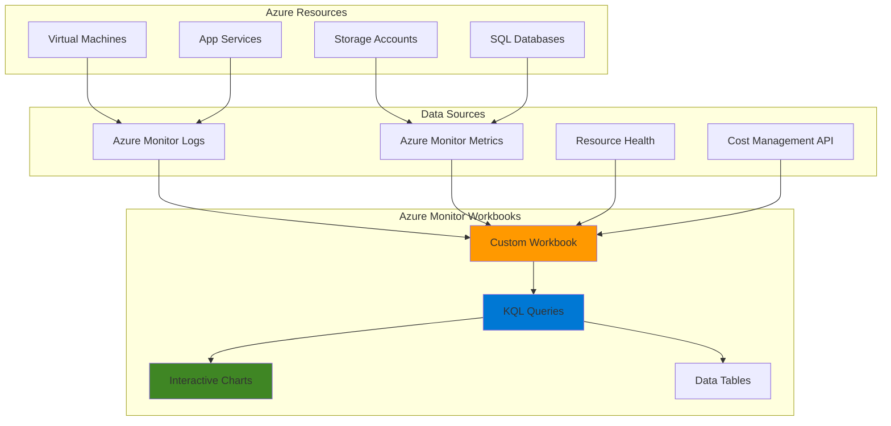

# Simple Resource Monitoring Dashboard with Azure Monitor Workbooks

## Problem

Organizations struggle to maintain visibility across their Azure resources, often monitoring services in isolation without a unified view of resource health, performance metrics, and associated costs. Teams waste time switching between multiple Azure portal blades to gather basic monitoring information, leading to delayed incident response and poor cost optimization decisions. Without centralized dashboards, organizations miss critical performance trends and cost anomalies that could impact business operations.

## Solution

Create an interactive monitoring dashboard using Azure Monitor Workbooks that consolidates resource health, performance metrics, and cost data into a single, customizable view. Azure Monitor Workbooks provide a flexible canvas for combining data from multiple Azure services, enabling teams to build comprehensive monitoring solutions with minimal technical complexity. This approach delivers real-time visibility across your Azure estate while supporting interactive exploration and cost-aware decision making.

## Architecture Diagram



## Prerequisites

1. Azure subscription with Contributor or Owner permissions
2. Azure CLI installed and configured (version 2.37.0 or later)
3. Basic understanding of Azure Monitor concepts
4. At least one Azure resource deployed (VM, Storage Account, or App Service)
5. Estimated cost: $0-5 USD for Log Analytics workspace (depending on data ingestion)

> **Note**: Azure Monitor Workbooks are free to use. Costs may apply for Log Analytics data ingestion and storage based on resource monitoring volume.

## Preparation

```bash
# Set environment variables
export RESOURCE_GROUP="rg-monitoring-${RANDOM_SUFFIX}"
export LOCATION="eastus"
export SUBSCRIPTION_ID=$(az account show --query id --output tsv)

# Generate unique suffix for resource names (must be defined before use)
RANDOM_SUFFIX=$(openssl rand -hex 3)
export RANDOM_SUFFIX

# Create resource group for monitoring resources
az group create \
    --name ${RESOURCE_GROUP} \
    --location ${LOCATION} \
    --tags purpose=monitoring environment=demo

echo "✅ Resource group created: ${RESOURCE_GROUP}"

# Create Log Analytics workspace for centralized monitoring
export LOG_WORKSPACE="log-workspace-${RANDOM_SUFFIX}"
az monitor log-analytics workspace create \
    --resource-group ${RESOURCE_GROUP} \
    --workspace-name ${LOG_WORKSPACE} \
    --location ${LOCATION} \
    --tags purpose=monitoring

echo "✅ Log Analytics workspace created: ${LOG_WORKSPACE}"
```

## Steps

1. **Create Sample Resources for Monitoring**:

   Azure Monitor Workbooks can visualize data from any Azure resource. Creating sample resources demonstrates real monitoring capabilities and provides immediate data for dashboard visualization. These resources generate metrics and logs that populate workbook charts and tables with meaningful performance data.

   ```bash
   # Create storage account for monitoring demonstration
   export STORAGE_ACCOUNT="stor${RANDOM_SUFFIX}"
   az storage account create \
       --name ${STORAGE_ACCOUNT} \
       --resource-group ${RESOURCE_GROUP} \
       --location ${LOCATION} \
       --sku Standard_LRS \
       --tags purpose=monitoring environment=demo
   
   # Create App Service plan and web app
   export APP_SERVICE_PLAN="asp-monitoring-${RANDOM_SUFFIX}"
   export WEB_APP="webapp-monitoring-${RANDOM_SUFFIX}"
   
   az appservice plan create \
       --name ${APP_SERVICE_PLAN} \
       --resource-group ${RESOURCE_GROUP} \
       --location ${LOCATION} \
       --sku F1
   
   az webapp create \
       --name ${WEB_APP} \
       --resource-group ${RESOURCE_GROUP} \
       --plan ${APP_SERVICE_PLAN}
   
   echo "✅ Sample resources created for monitoring"
   ```

2. **Navigate to Azure Monitor Workbooks**:

   Azure Monitor Workbooks provides a centralized gallery for creating and managing interactive dashboards. The gallery contains pre-built templates for common monitoring scenarios and serves as the starting point for custom workbook development. Accessing workbooks through Azure Monitor ensures proper integration with all monitoring data sources.

   ```bash
   # Get the resource group ID for workbook association
   export RG_RESOURCE_ID=$(az group show \
       --name ${RESOURCE_GROUP} \
       --query id --output tsv)
   
   echo "Resource Group ID: ${RG_RESOURCE_ID}"
   echo "Navigate to: https://portal.azure.com/#view/Microsoft_Azure_Monitoring/AzureMonitoringBrowseBlade/~/workbooks"
   echo "✅ Ready to create workbook in Azure portal"
   ```

3. **Create New Custom Workbook**:

   Creating a custom workbook from the Empty template provides maximum flexibility for building monitoring dashboards tailored to specific organizational needs. The empty template serves as a blank canvas where you can add text, parameters, queries, and visualizations that align with your monitoring requirements and stakeholder expectations.

   ```bash
   # Generate workbook metadata for reference
   export WORKBOOK_NAME="Resource Monitoring Dashboard - ${RANDOM_SUFFIX}"
   export WORKBOOK_DESCRIPTION="Custom dashboard for monitoring resource health, performance, and costs"
   
   echo "Workbook Configuration:"
   echo "  Name: ${WORKBOOK_NAME}"
   echo "  Description: ${WORKBOOK_DESCRIPTION}"
   echo "  Resource Group: ${RESOURCE_GROUP}"
   echo "  Subscription: ${SUBSCRIPTION_ID}"
   
   echo "✅ In Azure portal: Select 'Empty' template and click 'New'"
   ```

4. **Add Resource Health Overview Section**:

   Resource health monitoring provides immediate visibility into the operational status of Azure services, helping teams quickly identify service outages or degraded performance. Adding a resource health section creates a centralized status board that displays the current health state of all monitored resources, enabling faster incident detection and response.

   ```bash
   # Prepare KQL query for resource health monitoring
   cat << 'EOF' > resource_health_query.kql
   AzureActivity
   | where TimeGenerated >= ago(1h)
   | where ActivityStatusValue in ("Success", "Failed", "Warning")
   | summarize 
       SuccessfulOperations = countif(ActivityStatusValue == "Success"),
       FailedOperations = countif(ActivityStatusValue == "Failed"),
       WarningOperations = countif(ActivityStatusValue == "Warning"),
       TotalOperations = count()
   | extend HealthPercentage = round((SuccessfulOperations * 100.0) / TotalOperations, 1)
   | project SuccessfulOperations, FailedOperations, WarningOperations, TotalOperations, HealthPercentage
   EOF
   
   echo "✅ Add Text section with title: 'Resource Health Overview'"
   echo "✅ Add Query section and paste the KQL query from resource_health_query.kql"
   echo "✅ Set visualization to 'Big Number' for health percentage display"
   ```

5. **Add Performance Metrics Dashboard**:

   Performance metrics visualization enables proactive monitoring of resource utilization and helps identify performance bottlenecks before they impact users. Creating performance charts with CPU, memory, and storage metrics provides operational teams with essential insights for capacity planning and performance optimization across their Azure infrastructure.

   ```bash
   # Create KQL query for performance metrics
   cat << 'EOF' > performance_metrics_query.kql
   Perf
   | where TimeGenerated >= ago(4h)
   | where CounterName in ("% Processor Time", "Available MBytes", "Disk Read Bytes/sec")
   | summarize 
       AvgCPU = avg(CounterValue), 
       AvgMemory = avg(CounterValue),
       MaxDiskIO = max(CounterValue)
   by Computer, CounterName, bin(TimeGenerated, 15m)
   | render timechart
   EOF
   
   # Alternative metrics query for Azure Monitor Metrics
   cat << 'EOF' > azure_metrics_query.txt
   Data Source: Azure Monitor Metrics
   Metric Namespace: Microsoft.Compute/virtualMachines
   Metrics: Percentage CPU, Available Memory Bytes, Disk Read Bytes/sec
   Aggregation: Average
   Time Range: Last 4 hours
   Granularity: 15 minutes
   EOF
   
   echo "✅ Add Query section for performance metrics"
   echo "✅ Use either KQL query or Azure Monitor Metrics as data source"
   echo "✅ Set visualization to 'Line Chart' for time-series display"
   ```

6. **Add Cost Monitoring Section**:

   Cost monitoring integration provides financial visibility alongside operational metrics, enabling teams to correlate resource performance with spending patterns. Adding cost data to monitoring dashboards promotes cost-conscious decision making and helps identify optimization opportunities where performance can be maintained while reducing expenses.

   ```bash
   # Create cost analysis using Azure Resource Graph query
   cat << 'EOF' > cost_monitoring_query.kql
   Resources
   | where subscriptionId =~ "${SUBSCRIPTION_ID}"
   | where resourceGroup =~ "${RESOURCE_GROUP}"
   | extend resourceCost = todynamic('{"cost": 0.0}')
   | project name, type, location, resourceGroup, resourceCost
   | extend EstimatedMonthlyCost = case(
       type contains "Microsoft.Storage", 5.0,
       type contains "Microsoft.Web/sites", 10.0,
       type contains "Microsoft.Compute", 50.0,
       type contains "Microsoft.OperationalInsights", 15.0,
       1.0)
   | order by EstimatedMonthlyCost desc
   EOF
   
   echo "Resource Group for cost monitoring: ${RESOURCE_GROUP}"
   echo "Subscription ID: ${SUBSCRIPTION_ID}"
   
   echo "✅ Add Query section for cost monitoring"
   echo "✅ Replace placeholders with actual subscription and resource group values"
   echo "✅ Set visualization to 'Table' for detailed cost breakdown"
   ```

7. **Configure Interactive Parameters**:

   Interactive parameters transform static dashboards into dynamic exploration tools, allowing users to filter data by time range, resource group, or specific resources. Adding parameters enhances dashboard usability and enables stakeholders to focus on relevant data without creating multiple dashboard variations for different scenarios.

   ```bash
   # Document parameter configuration steps
   echo "Parameter Configuration Guide:"
   echo "1. Add Time Range Parameter:"
   echo "   - Name: TimeRange"
   echo "   - Type: Time Range Picker" 
   echo "   - Default: Last 24 hours"
   echo ""
   echo "2. Add Resource Group Parameter:"
   echo "   - Name: ResourceGroup"
   echo "   - Type: Resource Group Picker"
   echo "   - Default: ${RESOURCE_GROUP}"
   echo ""
   echo "3. Add Subscription Parameter:"
   echo "   - Name: Subscription"
   echo "   - Type: Subscription Picker"
   echo "   - Default: Current subscription"
   
   echo "✅ Add Parameters section at top of workbook"
   echo "✅ Configure parameters to filter all subsequent queries"
   ```

8. **Save and Configure Workbook**:

   Saving the workbook with proper metadata and sharing permissions ensures the dashboard is accessible to relevant stakeholders and maintains consistency across teams. Proper workbook configuration includes descriptive naming, appropriate categorization, and resource association that enables easy discovery and management.

   ```bash
   # Generate final workbook configuration
   echo "Final Workbook Configuration:"
   echo "  Title: ${WORKBOOK_NAME}"
   echo "  Resource Group: ${RESOURCE_GROUP}"
   echo "  Location: ${LOCATION}"
   echo "  Category: Monitoring"
   echo "  Share with: Resource Group Contributors"
   
   echo "✅ Click 'Save' in workbook toolbar"
   echo "✅ Configure workbook metadata and sharing permissions"
   echo "✅ Test all interactive elements and parameter filtering"
   ```

## Validation & Testing

1. **Verify Workbook Creation and Data Display**:

   ```bash
   # Check that resources are generating monitoring data
   az monitor metrics list-definitions \
       --resource /subscriptions/${SUBSCRIPTION_ID}/resourceGroups/${RESOURCE_GROUP}/providers/Microsoft.Storage/storageAccounts/${STORAGE_ACCOUNT} \
       --query "[].{Name:name.value, Unit:unit}" \
       --output table
   
   echo "✅ Storage account metrics available for workbook visualization"
   ```

   Expected output: List of available metrics including transactions, availability, and latency measurements.

2. **Test Interactive Parameters**:

   ```bash
   # Verify Log Analytics workspace is collecting data
   az monitor log-analytics workspace show \
       --resource-group ${RESOURCE_GROUP} \
       --workspace-name ${LOG_WORKSPACE} \
       --query "{Name:name, State:provisioningState, Location:location}"
   
   echo "✅ Log Analytics workspace ready for workbook queries"
   ```

   Expected output: Workspace showing "Succeeded" provisioning state and proper location.

3. **Validate Cost Data Integration**:

   ```bash
   # Check subscription access for cost data
   az account show \
       --query "{SubscriptionId:id, Name:name, State:state}" \
       --output table
   
   echo "✅ Subscription access verified for cost monitoring"
   ```

## Cleanup

1. **Delete Resource Group and All Resources**:

   ```bash
   # Remove all monitoring resources
   az group delete \
       --name ${RESOURCE_GROUP} \
       --yes \
       --no-wait
   
   echo "✅ Resource group deletion initiated: ${RESOURCE_GROUP}"
   echo "Note: Deletion may take several minutes to complete"
   ```

2. **Remove Local Configuration Files**:

   ```bash
   # Clean up local query files
   rm -f resource_health_query.kql
   rm -f performance_metrics_query.kql
   rm -f azure_metrics_query.txt
   rm -f cost_monitoring_query.kql
   
   # Clear environment variables
   unset RESOURCE_GROUP LOCATION SUBSCRIPTION_ID RANDOM_SUFFIX
   unset LOG_WORKSPACE STORAGE_ACCOUNT APP_SERVICE_PLAN WEB_APP
   unset WORKBOOK_NAME WORKBOOK_DESCRIPTION RG_RESOURCE_ID
   
   echo "✅ Local files and environment variables cleaned up"
   ```

3. **Verify Resource Deletion**:

   ```bash
   # Verify resource group deletion (wait a moment for deletion to complete)
   sleep 10
   if ! az group exists --name ${RESOURCE_GROUP} 2>/dev/null; then
       echo "✅ Resource group successfully deleted"
   else
       echo "⚠️ Resource group deletion in progress"
   fi
   ```

## Discussion

Azure Monitor Workbooks represent a powerful solution for creating unified monitoring dashboards that consolidate resource health, performance metrics, and cost data into interactive visualizations. Unlike traditional monitoring tools that operate in silos, workbooks provide a flexible canvas for combining data from multiple Azure services, enabling comprehensive operational visibility through a single interface. This approach aligns with modern observability practices where correlated data analysis leads to faster problem resolution and better business outcomes.

The architecture leverages Azure Monitor's comprehensive data platform, which automatically collects platform metrics from Azure resources while providing integration points for custom telemetry and cost management data. By utilizing Kusto Query Language (KQL), workbooks enable sophisticated data analysis and visualization that would traditionally require specialized business intelligence tools. The interactive parameter system transforms static reports into dynamic exploration environments, allowing stakeholders to filter and drill down into data based on their specific needs and responsibilities.

From a cost optimization perspective, integrating Azure Cost Management data directly into operational dashboards promotes financial awareness among technical teams and enables real-time correlation between resource performance and spending patterns. This visibility is crucial for organizations implementing FinOps practices where operational efficiency must be balanced with cost control. The template-based approach ensures consistency across teams while supporting customization for specific use cases or organizational requirements.

> **Tip**: Use Azure Monitor's built-in gallery templates as starting points for complex scenarios, then customize them to meet specific organizational requirements rather than building from scratch.

This solution follows Azure Well-Architected Framework principles by providing operational excellence through automated monitoring, cost optimization through integrated financial visibility, and reliability through centralized health monitoring. The workbook approach scales from single-resource monitoring to enterprise-wide observability platforms, making it suitable for organizations of all sizes. For additional guidance on advanced workbook features and best practices, refer to the [Azure Monitor Workbooks overview](https://learn.microsoft.com/en-us/azure/azure-monitor/visualize/workbooks-overview), [interactive reporting documentation](https://learn.microsoft.com/en-us/azure/azure-monitor/visualize/workbooks-interactive-reports), [Azure Monitor cost optimization guide](https://learn.microsoft.com/en-us/azure/azure-monitor/best-practices-cost), [visualization best practices](https://learn.microsoft.com/en-us/azure/azure-monitor/visualize/best-practices-visualize), and [workbook data sources reference](https://learn.microsoft.com/en-us/azure/azure-monitor/visualize/workbooks-data-sources).

## Challenge

Extend this monitoring solution by implementing these enhancements:

1. **Multi-Subscription Monitoring**: Configure workbook parameters to support monitoring across multiple Azure subscriptions, enabling enterprise-wide visibility for organizations with complex subscription hierarchies.

2. **Automated Alerting Integration**: Add Azure Monitor alert rules that trigger based on workbook query results, creating proactive notification systems for performance thresholds and cost anomalies.

3. **Custom Metrics Integration**: Implement Application Insights custom metrics collection for application-level monitoring, extending beyond infrastructure metrics to include business KPIs and user experience measurements.

4. **Historical Trend Analysis**: Develop workbook sections that analyze 90-day trends for capacity planning, using statistical functions to predict future resource requirements and identify optimization opportunities.

5. **Team-Specific Dashboard Variants**: Create role-based workbook templates for different stakeholders (developers, operations, management) with customized views, metrics, and drill-down capabilities tailored to each group's responsibilities.

## Infrastructure Code

### Available Infrastructure as Code:

- [Infrastructure Code Overview](code/README.md) - Detailed description of all infrastructure components
- [Bicep](code/bicep/) - Azure Bicep templates
- [Bash CLI Scripts](code/scripts/) - Example bash scripts using Azure CLI commands to deploy infrastructure
- [Terraform](code/terraform/) - Terraform configuration files