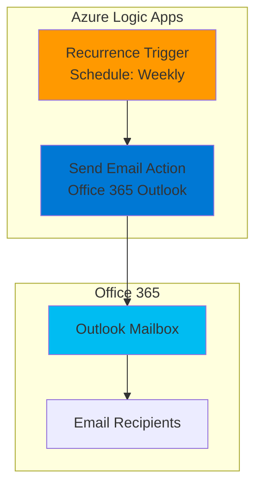

# Simple Schedule Reminders with Logic Apps and Outlook

## Problem

Organizations need automated reminder systems to maintain operational efficiency and ensure important tasks are completed on time. Manual reminder processes are prone to human error, consume valuable staff time, and often fail during busy periods or staff absences. Without automated notifications for recurring activities like monthly reports, weekly team meetings, or quarterly reviews, critical business processes can be delayed or forgotten entirely, impacting productivity and compliance.

## Solution

Azure Logic Apps provides a serverless workflow automation platform that integrates seamlessly with Office 365 Outlook to create intelligent reminder systems. This solution uses a time-based recurrence trigger to automatically send scheduled email notifications, eliminating manual intervention while ensuring consistent delivery. The serverless architecture provides cost-effective scaling, automatic maintenance, and enterprise-grade reliability for mission-critical reminder workflows.

## Architecture Diagram



## Prerequisites

1. Azure subscription with Logic Apps service available
2. Office 365 account with work or school email (e.g., user@company.onmicrosoft.com)
3. Azure CLI installed and configured (or use Azure Cloud Shell)
4. Logic Apps Contributor role or higher for the target resource group
5. Estimated cost: $0.05-0.10 per month for basic weekly reminders (based on Azure Logic Apps consumption pricing)

> **Note**: Personal Microsoft accounts (@outlook.com, @hotmail.com) require the Outlook.com connector instead of Office 365 Outlook connector.

## Preparation

```bash
# Set environment variables for Azure resources
export RESOURCE_GROUP="rg-reminder-logic-app-${RANDOM_SUFFIX}"
export LOCATION="eastus"
export SUBSCRIPTION_ID=$(az account show --query id --output tsv)

# Generate unique suffix for resource names
RANDOM_SUFFIX=$(openssl rand -hex 3)

# Set Logic App name
export LOGIC_APP_NAME="la-schedule-reminders-${RANDOM_SUFFIX}"

# Create resource group
az group create \
    --name ${RESOURCE_GROUP} \
    --location ${LOCATION} \
    --tags purpose=recipe environment=demo

echo "✅ Resource group created: ${RESOURCE_GROUP}"
```

## Steps

1. **Create Basic Workflow Definition File**:

   Azure Logic Apps workflows are defined using the Workflow Definition Language (WDL), which follows a JSON schema that describes triggers, actions, and their relationships. Creating a local definition file allows you to version control your workflow, apply DevOps practices, and deploy consistently across environments. This approach separates the workflow logic from the infrastructure provisioning for better maintainability.

   ```bash
   # Create workflow definition file
   cat > workflow-definition.json << 'EOF'
   {
     "$schema": "https://schema.management.azure.com/providers/Microsoft.Logic/schemas/2016-06-01/workflowdefinition.json#",
     "contentVersion": "1.0.0.0",
     "parameters": {},
     "triggers": {
       "Recurrence": {
         "recurrence": {
           "frequency": "Week",
           "interval": 1,
           "schedule": {
             "hours": ["9"],
             "minutes": [0],
             "weekDays": ["Monday"]
           }
         },
         "type": "Recurrence"
       }
     },
     "actions": {
       "Send_an_email_(V2)": {
         "runAfter": {},
         "type": "ApiConnection",
         "inputs": {
           "body": {
             "Body": "<p>Hello Team,</p><p>This is your weekly reminder that we have our team meeting today at 2:00 PM.</p><p>Please prepare your weekly updates and join the meeting room.</p><p>Best regards,<br>Automated Reminder System</p>",
             "Subject": "Weekly Reminder - Team Meeting Today",
             "To": "user@company.com"
           },
           "host": {
             "connection": {
               "name": "@parameters('$connections')['office365']['connectionId']"
             }
           },
           "method": "post",
           "path": "/v2/Mail"
         }
       }
     },
     "outputs": {},
     "parameters": {
       "$connections": {
         "defaultValue": {},
         "type": "Object"
       }
     }
   }
   EOF

   echo "✅ Workflow definition file created"
   ```

2. **Create Logic App Workflow**:

   The Azure CLI provides dedicated Logic Apps commands that handle workflow creation more efficiently than generic resource commands. Using `az logic workflow create` ensures proper validation, applies the correct API version automatically, and provides better error handling for Logic Apps-specific operations. This command creates the Logic App resource and deploys the workflow definition in a single operation.

   ```bash
   # Create Logic App with workflow definition
   az logic workflow create \
       --resource-group ${RESOURCE_GROUP} \
       --name ${LOGIC_APP_NAME} \
       --location ${LOCATION} \
       --definition workflow-definition.json \
       --state Enabled

   echo "✅ Logic App created: ${LOGIC_APP_NAME}"
   ```

3. **Create Office 365 Connection**:

   Azure Logic Apps requires authenticated connections to external services like Office 365 Outlook for security and compliance. The connection must be created separately and then associated with the Logic App workflow. This approach allows for centralized connection management, credential rotation, and reuse across multiple workflows while maintaining enterprise security standards.

   ```bash
   # Get Logic App resource ID for connection setup
   LOGIC_APP_RESOURCE_ID=$(az logic workflow show \
       --resource-group ${RESOURCE_GROUP} \
       --name ${LOGIC_APP_NAME} \
       --query id --output tsv)
   
   echo "🔗 To complete the Office 365 connection setup:"
   echo "1. Navigate to: https://portal.azure.com/#@/resource${LOGIC_APP_RESOURCE_ID}"
   echo "2. Click 'API connections' in the left menu"
   echo "3. Click '+ Add' to create new connection"
   echo "4. Search for 'Office 365 Outlook' and select it"
   echo "5. Click 'Create' and sign in with your Office 365 account"
   echo "6. Name the connection 'office365' to match the workflow"
   
   echo "✅ Connection setup instructions provided"
   ```

4. **Update Workflow with Connection Parameters**:

   After creating the Office 365 connection, the Logic App workflow needs to be updated with the connection parameters to establish the link between the workflow and the authenticated connection. This step ensures the Logic App can access your Office 365 account securely using the established connection, enabling automated email sending with proper authentication and authorization.

   ```bash
   # Wait for user to complete connection setup
   echo "⏳ Please complete the Office 365 connection setup in the Azure portal"
   echo "Press Enter when the connection is created..."
   read -p ""
   
   # Get the connection information
   CONNECTION_ID=$(az resource list \
       --resource-group ${RESOURCE_GROUP} \
       --resource-type Microsoft.Web/connections \
       --query "[?contains(name, 'office365')].id" \
       --output tsv)
   
   if [ -z "$CONNECTION_ID" ]; then
       echo "⚠️ Office 365 connection not found. Please create the connection first."
       echo "You can complete this step manually in the Azure portal."
   else
       # Update workflow with connection parameters
       cat > updated-workflow.json << EOF
   {
     "\$schema": "https://schema.management.azure.com/providers/Microsoft.Logic/schemas/2016-06-01/workflowdefinition.json#",
     "contentVersion": "1.0.0.0",
     "parameters": {
       "\$connections": {
         "defaultValue": {
           "office365": {
             "connectionId": "${CONNECTION_ID}",
             "connectionName": "office365",
             "id": "/subscriptions/${SUBSCRIPTION_ID}/providers/Microsoft.Web/locations/${LOCATION}/managedApis/office365"
           }
         },
         "type": "Object"
       }
     },
     "triggers": {
       "Recurrence": {
         "recurrence": {
           "frequency": "Week",
           "interval": 1,
           "schedule": {
             "hours": ["9"],
             "minutes": [0],
             "weekDays": ["Monday"]
           }
         },
         "type": "Recurrence"
       }
     },
     "actions": {
       "Send_an_email_(V2)": {
         "runAfter": {},
         "type": "ApiConnection",
         "inputs": {
           "body": {
             "Body": "<p>Hello Team,</p><p>This is your weekly reminder that we have our team meeting today at 2:00 PM.</p><p>Please prepare your weekly updates and join the meeting room.</p><p>Best regards,<br>Automated Reminder System</p>",
             "Subject": "Weekly Reminder - Team Meeting Today",
             "To": "user@company.com"
           },
           "host": {
             "connection": {
               "name": "@parameters('\$connections')['office365']['connectionId']"
             }
           },
           "method": "post",
           "path": "/v2/Mail"
         }
       }
     },
     "outputs": {}
   }
   EOF
       
       # Update the Logic App with connection information
       az logic workflow create \
           --resource-group ${RESOURCE_GROUP} \
           --name ${LOGIC_APP_NAME} \
           --location ${LOCATION} \
           --definition updated-workflow.json \
           --state Enabled
       
       echo "✅ Logic App updated with Office 365 connection"
   fi
   ```

5. **Test the Logic App Workflow**:

   Testing verifies that the Logic App workflow executes correctly and delivers email reminders as expected. The Azure CLI provides commands to manually trigger workflows for testing purposes, bypassing the scheduled recurrence trigger. This allows you to validate the configuration, troubleshoot any issues, and confirm email delivery before relying on the automated schedule for production use.

   ```bash
   # Manually trigger the Logic App for testing
   az logic workflow trigger run \
       --resource-group ${RESOURCE_GROUP} \
       --workflow-name ${LOGIC_APP_NAME} \
       --trigger-name Recurrence
   
   echo "🧪 Logic App triggered manually for testing"
   echo "Check your email inbox for the reminder message"
   echo "You can also monitor execution in the Azure portal:"
   echo "https://portal.azure.com/#@/resource${LOGIC_APP_RESOURCE_ID}/runs"
   
   echo "✅ Test execution initiated"
   ```

## Validation & Testing

1. **Verify Logic App Creation and Status**:

   ```bash
   # Check Logic App resource status
   az logic workflow show \
       --resource-group ${RESOURCE_GROUP} \
       --name ${LOGIC_APP_NAME} \
       --query "{name:name, state:properties.state, location:location}" \
       --output table
   ```

   Expected output: Shows Logic App name, "Enabled" state, and location.

2. **Check Workflow Run History**:

   ```bash
   # View recent run history
   az logic workflow run list \
       --resource-group ${RESOURCE_GROUP} \
       --workflow-name ${LOGIC_APP_NAME} \
       --top 5 \
       --query "[].{status:status, startTime:startTime, endTime:endTime}" \
       --output table
   ```

   Expected result: Recent runs showing "Succeeded" status with start and end times.

3. **Verify Email Receipt**:

   Check your configured email address for the reminder message. The email should contain:
   - Subject: "Weekly Reminder - Team Meeting Today"
   - HTML-formatted body with reminder content
   - Sent from your Office 365 account

## Cleanup

1. **Disable the Logic App**:

   ```bash
   # Disable Logic App to stop recurring executions
   az logic workflow update \
       --resource-group ${RESOURCE_GROUP} \
       --name ${LOGIC_APP_NAME} \
       --state Disabled
   
   echo "✅ Logic App disabled"
   ```

2. **Remove the Resource Group**:

   ```bash
   # Delete resource group and all contained resources
   az group delete \
       --name ${RESOURCE_GROUP} \
       --yes \
       --no-wait
   
   echo "✅ Resource group deletion initiated: ${RESOURCE_GROUP}"
   echo "Note: Deletion may take several minutes to complete"
   ```

3. **Clean up Local Files and Environment Variables**:

   ```bash
   # Remove local workflow definition files
   rm -f workflow-definition.json updated-workflow.json
   
   # Unset environment variables
   unset RESOURCE_GROUP LOCATION LOGIC_APP_NAME RANDOM_SUFFIX \
         SUBSCRIPTION_ID LOGIC_APP_RESOURCE_ID CONNECTION_ID
   
   echo "✅ Environment variables and files cleaned up"
   ```

## Discussion

Azure Logic Apps represents a powerful serverless integration platform that simplifies workflow automation through visual design and managed connectors. The Consumption pricing model provides excellent cost efficiency for scheduled workflows, charging only for actual executions rather than provisioned capacity. This makes Logic Apps particularly suitable for reminder systems, periodic notifications, and other scheduled automation scenarios where consistent execution is critical but usage patterns are predictable.

The Office 365 Outlook connector demonstrates Azure's extensive ecosystem of managed connectors, which handle complex authentication, connection management, and API interactions automatically. This abstraction allows developers to focus on business logic rather than infrastructure concerns, while maintaining enterprise-grade security and compliance standards. The connector supports rich email formatting, attachments, calendar integration, and other advanced Outlook features for comprehensive communication automation.

The recurrence trigger architecture follows serverless best practices by eliminating persistent infrastructure while providing reliable scheduling capabilities. Unlike traditional cron jobs or scheduled tasks that require dedicated servers, Logic Apps triggers run on Azure's managed infrastructure with automatic scaling, fault tolerance, and geographic distribution. This approach reduces operational overhead while improving reliability and maintainability for business-critical automation workflows.

For production deployments, consider implementing error handling actions, retry policies, and monitoring alerts to ensure robust operation. Azure Monitor integration provides comprehensive observability through [Azure Logic Apps monitoring documentation](https://docs.microsoft.com/en-us/azure/logic-apps/monitor-logic-apps), while Azure Policy can enforce governance standards across Logic App deployments. Additionally, parameterization through ARM templates or Bicep enables consistent deployment across development, staging, and production environments while maintaining configuration flexibility.

> **Tip**: Use Azure Monitor and Log Analytics to track workflow performance metrics and optimize resource allocation based on actual usage patterns and execution history available through the Azure portal.

## Challenge

Extend this solution by implementing these enhancements:

1. **Dynamic Content Integration**: Modify the email body to include dynamic content such as current date, weather information via HTTP connectors, or data from SharePoint lists or Excel files for personalized reminders.

2. **Multi-Recipient Management**: Enhance the workflow to send customized reminders to different recipients based on Azure AD group memberships or SharePoint user lists, with personalized content for each recipient role.

3. **Conditional Logic and Approval Workflows**: Add condition actions to send different reminder types based on date ranges, implement approval workflows for meeting cancellations, or integrate with Microsoft Teams for notification delivery.

4. **Advanced Scheduling and Error Handling**: Implement complex scheduling patterns (bi-weekly, monthly with exceptions), add comprehensive error handling with retry policies, and create monitoring alerts for failed executions.

5. **Integration with Microsoft 365 Ecosystem**: Connect to Microsoft Teams for chat notifications, integrate with Outlook Calendar for meeting-based reminders, or use Power BI for reminder analytics and reporting dashboards.

## Infrastructure Code

*Infrastructure code will be generated after recipe approval.*