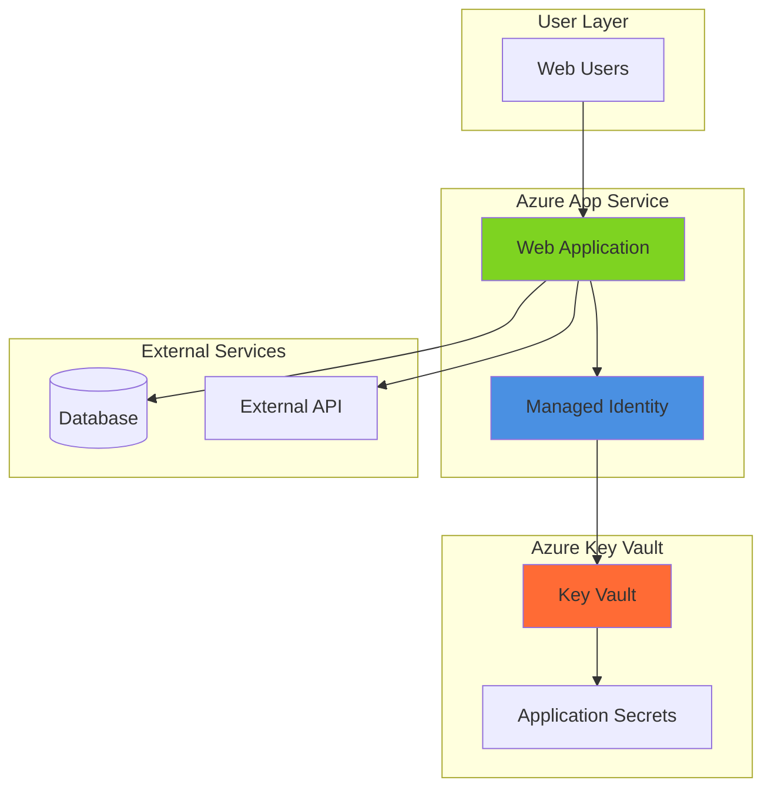

# Simple Secrets Management with Key Vault and App Service

## Problem

Organizations commonly hardcode database connection strings, API keys, and other sensitive credentials directly into application code or configuration files. This practice creates significant security vulnerabilities, makes credential rotation difficult, and violates compliance requirements. When these secrets are exposed in source control or accessible to unauthorized team members, the entire application infrastructure becomes vulnerable to data breaches and unauthorized access.

## Solution

Azure Key Vault provides centralized, secure storage for application secrets, while Azure App Service's managed identities enable passwordless authentication to Key Vault. This combination eliminates hardcoded secrets by allowing applications to dynamically retrieve credentials at runtime using Azure's built-in authentication mechanisms, providing better security, easier credential rotation, and improved compliance.

## Architecture Diagram



## Prerequisites

1. Azure subscription with permissions to create Key Vault and App Service resources
2. Azure CLI installed and configured (or Azure Cloud Shell)
3. Basic understanding of web applications and authentication concepts
4. Knowledge of environment variables and application configuration
5. Estimated cost: $12-15 USD for Key Vault operations and App Service hosting during this tutorial (B1 App Service Plan ~$56/month prorated, Key Vault operations ~$0.03 per 10,000 operations)

> **Note**: This recipe follows Azure Well-Architected Framework security principles by implementing least privilege access and eliminating credential exposure.

## Preparation

```bash
# Generate unique suffix for resource names first
RANDOM_SUFFIX=$(openssl rand -hex 3)

# Set environment variables for Azure resources
export RESOURCE_GROUP="rg-secrets-demo-${RANDOM_SUFFIX}"
export LOCATION="eastus"
export SUBSCRIPTION_ID=$(az account show --query id --output tsv)

# Set resource names with unique suffix
export KEY_VAULT_NAME="kv-secrets-${RANDOM_SUFFIX}"
export APP_SERVICE_PLAN="asp-secrets-${RANDOM_SUFFIX}"
export WEB_APP_NAME="webapp-secrets-${RANDOM_SUFFIX}"

# Create resource group
az group create \
    --name ${RESOURCE_GROUP} \
    --location ${LOCATION} \
    --tags purpose=secrets-demo environment=tutorial

echo "✅ Resource group created: ${RESOURCE_GROUP}"
```

## Steps

1. **Create Azure Key Vault for Secrets Storage**:

   Azure Key Vault provides enterprise-grade security for storing application secrets, keys, and certificates. The service offers hardware security module (HSM) protection, detailed audit logging, and fine-grained access control. Creating a Key Vault with RBAC authorization enables modern identity-based access patterns that integrate seamlessly with Azure services.

   ```bash
   # Create Key Vault with RBAC authorization enabled
   az keyvault create \
       --name ${KEY_VAULT_NAME} \
       --resource-group ${RESOURCE_GROUP} \
       --location ${LOCATION} \
       --sku standard \
       --enable-rbac-authorization true \
       --tags purpose=secrets-demo

   echo "✅ Key Vault created: ${KEY_VAULT_NAME}"
   ```

   The Key Vault is now ready with role-based access control enabled. RBAC provides more granular permissions than traditional access policies and integrates better with Azure Active Directory for enterprise scenarios.

2. **Add Sample Secrets to Key Vault**:

   Application secrets typically include database connection strings, API keys, and service credentials. Storing these in Key Vault ensures they're encrypted at rest, access is audited, and rotation can be managed centrally. Each secret can have multiple versions, enabling smooth credential rollover without application downtime.

   ```bash
   # Get current user ID for RBAC role assignment
   CURRENT_USER_ID=$(az ad signed-in-user show --query id --output tsv)

   # Assign Key Vault Secrets Officer role to current user
   az role assignment create \
       --role "Key Vault Secrets Officer" \
       --assignee ${CURRENT_USER_ID} \
       --scope "/subscriptions/${SUBSCRIPTION_ID}/resourceGroups/${RESOURCE_GROUP}/providers/Microsoft.KeyVault/vaults/${KEY_VAULT_NAME}"

   # Wait for role assignment propagation
   sleep 30

   # Add sample database connection string
   az keyvault secret set \
       --vault-name ${KEY_VAULT_NAME} \
       --name "DatabaseConnection" \
       --value "Server=myserver.database.windows.net;Database=mydb;User=admin;Password=SecureP@ssw0rd123"

   # Add sample API key
   az keyvault secret set \
       --vault-name ${KEY_VAULT_NAME} \
       --name "ExternalApiKey" \
       --value "sk-1234567890abcdef1234567890abcdef"

   echo "✅ Sample secrets added to Key Vault"
   ```

   The secrets are now securely stored in Key Vault with versioning and audit capabilities. These represent typical application credentials that would normally be hardcoded or stored in configuration files.

3. **Create App Service Plan and Web Application**:

   Azure App Service provides a fully managed platform for hosting web applications with built-in scaling, security, and integration capabilities. The service plan defines the compute resources, while the web app provides the runtime environment. This foundation enables secure integration with other Azure services like Key Vault.

   ```bash
   # Create App Service Plan
   az appservice plan create \
       --name ${APP_SERVICE_PLAN} \
       --resource-group ${RESOURCE_GROUP} \
       --location ${LOCATION} \
       --sku B1 \
       --is-linux true

   # Create Web App with Node.js runtime
   az webapp create \
       --name ${WEB_APP_NAME} \
       --resource-group ${RESOURCE_GROUP} \
       --plan ${APP_SERVICE_PLAN} \
       --runtime "NODE:18-lts"

   echo "✅ Web application created: ${WEB_APP_NAME}"
   ```

   The web application is now running with a Node.js runtime environment. The basic tier provides sufficient resources for development and testing while maintaining cost efficiency.

4. **Enable System-Assigned Managed Identity**:

   Managed identities eliminate the need for developers to manage credentials by providing Azure services with automatically managed identities in Azure Active Directory. System-assigned identities are tied to the service lifecycle and provide a secure, passwordless authentication mechanism for accessing other Azure resources.

   ```bash
   # Enable system-assigned managed identity for the web app
   az webapp identity assign \
       --name ${WEB_APP_NAME} \
       --resource-group ${RESOURCE_GROUP}

   # Get the managed identity principal ID
   MANAGED_IDENTITY_ID=$(az webapp identity show \
       --name ${WEB_APP_NAME} \
       --resource-group ${RESOURCE_GROUP} \
       --query principalId \
       --output tsv)

   echo "✅ Managed identity enabled with ID: ${MANAGED_IDENTITY_ID}"
   ```

   The web application now has a managed identity that can be used to authenticate to Azure services without storing credentials. This identity is automatically managed by Azure and rotated regularly.

5. **Grant Key Vault Access to Managed Identity**:

   Azure RBAC provides fine-grained access control for Key Vault operations. The Key Vault Secrets User role grants the minimum permissions needed to read secrets, following the principle of least privilege. This role assignment enables the web application to retrieve secrets while preventing unnecessary access to key management operations.

   ```bash
   # Assign Key Vault Secrets User role to the managed identity
   az role assignment create \
       --role "Key Vault Secrets User" \
       --assignee ${MANAGED_IDENTITY_ID} \
       --scope "/subscriptions/${SUBSCRIPTION_ID}/resourceGroups/${RESOURCE_GROUP}/providers/Microsoft.KeyVault/vaults/${KEY_VAULT_NAME}"

   # Wait for role assignment propagation
   sleep 30

   echo "✅ Key Vault access granted to managed identity"
   ```

   The managed identity can now read secrets from the Key Vault. This permission model ensures that only the web application can access these specific secrets, providing secure isolation.

6. **Configure Key Vault References in App Settings**:

   Key Vault references enable App Service to dynamically retrieve secrets from Key Vault at runtime without code changes. The special syntax @Microsoft.KeyVault(...) tells App Service to fetch the value from Key Vault instead of storing it as a plain text setting. This approach maintains compatibility with existing application code while improving security.

   ```bash
   # Configure Key Vault references as app settings
   az webapp config appsettings set \
       --name ${WEB_APP_NAME} \
       --resource-group ${RESOURCE_GROUP} \
       --settings \
       "DATABASE_CONNECTION=@Microsoft.KeyVault(VaultName=${KEY_VAULT_NAME};SecretName=DatabaseConnection)" \
       "API_KEY=@Microsoft.KeyVault(VaultName=${KEY_VAULT_NAME};SecretName=ExternalApiKey)"

   echo "✅ Key Vault references configured in app settings"
   ```

   The application can now access these secrets as environment variables, with App Service automatically retrieving the values from Key Vault using the managed identity.

7. **Deploy Sample Application Code**:

   This sample Node.js application demonstrates how to access secrets through environment variables without any special Key Vault client code. The application displays the configuration to verify that secrets are being retrieved correctly, showing how Key Vault integration works transparently with existing application patterns.

   ```bash
   # Create sample Node.js application
   cat > app.js << 'EOF'
const express = require('express');
const app = express();
const port = process.env.PORT || 3000;

app.get('/', (req, res) => {
    const html = `
    <html>
    <head><title>Secrets Demo</title></head>
    <body>
        <h1>🔐 Azure Key Vault Secrets Demo</h1>
        <h2>Configuration Status:</h2>
        <ul>
            <li><strong>Database Connection:</strong> ${process.env.DATABASE_CONNECTION ? '✅ Retrieved from Key Vault' : '❌ Not configured'}</li>
            <li><strong>API Key:</strong> ${process.env.API_KEY ? '✅ Retrieved from Key Vault' : '❌ Not configured'}</li>
        </ul>
        <p><em>Secrets are retrieved securely using Managed Identity</em></p>
    </body>
    </html>
    `;
    res.send(html);
});

app.listen(port, () => {
    console.log(`Server running on port ${port}`);
});
EOF

   # Create package.json
   cat > package.json << 'EOF'
{
    "name": "secrets-demo",
    "version": "1.0.0",
    "description": "Azure Key Vault secrets demo",
    "main": "app.js",
    "scripts": {
        "start": "node app.js"
    },
    "dependencies": {
        "express": "^4.18.0"
    }
}
EOF

   # Create deployment package
   zip -r app.zip app.js package.json

   # Deploy application
   az webapp deploy \
       --name ${WEB_APP_NAME} \
       --resource-group ${RESOURCE_GROUP} \
       --src-path app.zip \
       --type zip

   echo "✅ Sample application deployed successfully"
   ```

   The application code demonstrates that no special Key Vault libraries or authentication code is required. The secrets appear as regular environment variables, maintaining compatibility with existing application architectures.

## Validation & Testing

1. **Verify Key Vault Secret Storage**:

   ```bash
   # List secrets in Key Vault
   az keyvault secret list \
       --vault-name ${KEY_VAULT_NAME} \
       --query "[].{Name:name, Enabled:attributes.enabled}" \
       --output table
   ```

   Expected output: Table showing DatabaseConnection and ExternalApiKey secrets as enabled.

2. **Test Managed Identity Authentication**:

   ```bash
   # Verify managed identity is assigned
   az webapp identity show \
       --name ${WEB_APP_NAME} \
       --resource-group ${RESOURCE_GROUP} \
       --query "{Type:type, PrincipalId:principalId}"
   ```

   Expected output: Shows SystemAssigned identity type with a valid principal ID.

3. **Access the Web Application**:

   ```bash
   # Get web app URL
   APP_URL=$(az webapp show \
       --name ${WEB_APP_NAME} \
       --resource-group ${RESOURCE_GROUP} \
       --query defaultHostName \
       --output tsv)

   echo "🌐 Access your application at: https://${APP_URL}"
   ```

   Visit the URL to see the secrets demo page showing successful Key Vault integration.

4. **Verify Key Vault References Resolution**:

   ```bash
   # Check app settings configuration
   az webapp config appsettings list \
       --name ${WEB_APP_NAME} \
       --resource-group ${RESOURCE_GROUP} \
       --query "[?contains(name, 'DATABASE_CONNECTION') || contains(name, 'API_KEY')].{Name:name, Value:value}" \
       --output table
   ```

   Expected output: Shows the Key Vault reference syntax in the configuration.

## Cleanup

1. **Remove Resource Group and All Resources**:

   ```bash
   # Delete resource group and all contained resources
   az group delete \
       --name ${RESOURCE_GROUP} \
       --yes \
       --no-wait

   echo "✅ Resource group deletion initiated: ${RESOURCE_GROUP}"
   echo "Note: Deletion may take several minutes to complete"
   ```

2. **Clean Up Local Files**:

   ```bash
   # Remove local application files
   rm -f app.js package.json app.zip

   echo "✅ Local files cleaned up"
   ```

3. **Verify Resource Deletion**:

   ```bash
   # Check if resource group still exists (optional)
   az group exists --name ${RESOURCE_GROUP}
   ```

   Expected output: `false` when deletion is complete.

## Discussion

This solution demonstrates a fundamental security pattern in cloud-native applications: eliminating hardcoded secrets through managed identities and centralized secret storage. **Azure Key Vault** serves as the secure vault for all application secrets, providing encryption at rest, detailed audit logging, and centralized management capabilities. The service integrates seamlessly with Azure's identity system, enabling fine-grained access control through Azure RBAC.

**Managed identities** represent a paradigm shift from traditional credential management approaches. Instead of managing service principal credentials, certificates, or connection strings, Azure automatically provisions and manages identities for your services. These identities are automatically rotated and secured, eliminating a significant attack vector while simplifying operational management. The system-assigned managed identity creates a 1:1 relationship between the web application and its security identity, ensuring that credentials cannot be accidentally shared or misused.

The **Key Vault reference** pattern in App Service application settings provides backward compatibility with existing applications while improving security posture. Applications continue to access configuration through standard environment variables, but the values are dynamically retrieved from Key Vault at runtime. This approach requires no code changes and works with any programming language or framework, making it ideal for legacy application modernization scenarios.

From an operational perspective, this architecture enables several advanced scenarios including automated secret rotation, environment-specific secret management, and compliance audit trails. Key Vault's versioning system allows for blue-green deployments with different secret versions, while the audit logs provide detailed tracking of who accessed which secrets and when.

> **Tip**: Consider implementing Azure Policy to enforce Key Vault usage across your organization and prevent hardcoded secrets in application configurations.

**References:**
- [Azure Key Vault Integration with App Service](https://learn.microsoft.com/en-us/azure/app-service/app-service-key-vault-references)
- [Azure Managed Identities Overview](https://learn.microsoft.com/en-us/azure/app-service/overview-managed-identity)
- [Secure Azure App Service Connectivity](https://learn.microsoft.com/en-us/azure/app-service/tutorial-connect-overview)
- [Azure Security Best Practices for App Service](https://learn.microsoft.com/en-us/azure/app-service/overview-security)
- [Key Vault RBAC Security Model](https://learn.microsoft.com/en-us/azure/key-vault/general/rbac-guide)

## Challenge

Extend this solution by implementing these enhancements:

1. **Implement Secret Rotation**: Configure automatic rotation for database passwords using Azure Key Vault's rotation features and Azure Functions triggers.

2. **Add Environment-Specific Secrets**: Create separate Key Vaults for development, staging, and production environments with environment-specific secret management.

3. **Enable Advanced Monitoring**: Implement Azure Monitor and Log Analytics to track secret access patterns and set up alerts for unusual access attempts.

4. **Integrate with CI/CD Pipelines**: Configure Azure DevOps or GitHub Actions to automatically update Key Vault secrets during deployment processes without exposing credentials.

5. **Implement Certificate Management**: Extend the solution to manage SSL certificates and API client certificates through Key Vault's certificate management capabilities.

## Infrastructure Code

*Infrastructure code will be generated after recipe approval.*