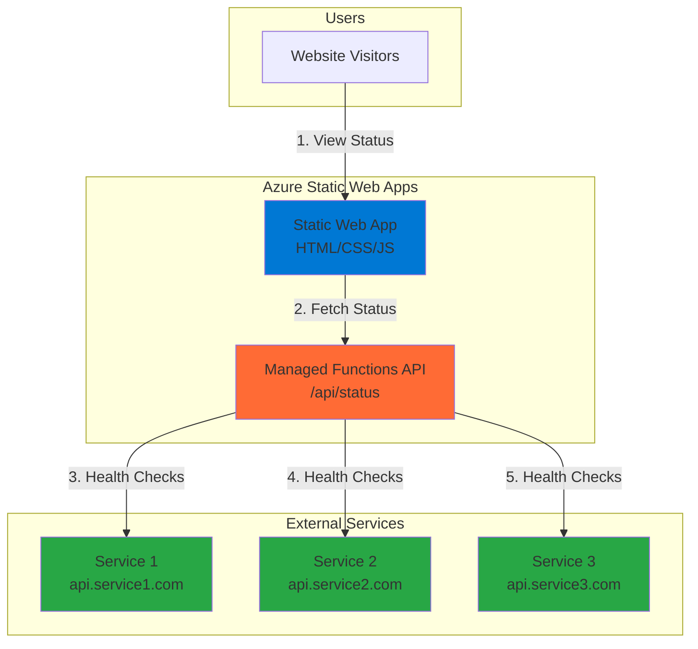

# Simple Service Status Page with Static Web Apps and Functions

## Problem

Operations teams need to quickly communicate service availability to stakeholders when external dependencies experience outages. Without a centralized status page, customers and internal teams repeatedly contact support during incidents, creating additional workload during critical periods. Manual status updates are time-consuming and often delayed, leading to customer frustration and reduced trust in service reliability.

## Solution

Create an automated service status page using Azure Static Web Apps for the frontend and Azure Functions for backend health monitoring. The serverless function periodically checks external service endpoints and stores results, while the static web app displays real-time status information with automatic updates. This approach provides a cost-effective, scalable solution that requires minimal infrastructure management while delivering instant visibility into service health.

## Architecture Diagram



## Prerequisites

1. Azure account with active subscription and Static Web Apps service access
2. Azure CLI installed and configured (version 2.29.0 or later)
3. Basic knowledge of HTML, JavaScript, and HTTP REST APIs
4. Node.js v18+ for local development and testing
5. Estimated cost: $0-5/month for free tier usage with minimal traffic

> **Note**: Azure Static Web Apps free tier includes managed Azure Functions with generous usage limits for small applications.

## Preparation

```bash
# Set environment variables for Azure resources
export RESOURCE_GROUP="rg-recipe-${RANDOM_SUFFIX}"
export LOCATION="eastus"
export SUBSCRIPTION_ID=$(az account show --query id --output tsv)

# Generate unique suffix for resource names
RANDOM_SUFFIX=$(openssl rand -hex 3)

# Create resource group
az group create \
    --name ${RESOURCE_GROUP} \
    --location ${LOCATION} \
    --tags purpose=recipe environment=demo

echo "✅ Resource group created: ${RESOURCE_GROUP}"

# Set Static Web App name
export STATIC_WEB_APP_NAME="status-page-${RANDOM_SUFFIX}"
```

## Steps

1. **Create project directory structure**:

   Local development requires organizing frontend and API code in the proper directory structure that Azure Static Web Apps expects during deployment. Azure Static Web Apps automatically detects the `api` folder for Azure Functions and serves static content from the app location directory.

   ```bash
   # Create project structure
   mkdir -p status-page/{public,api}
   cd status-page
   
   # Initialize the API with Functions v4 configuration
   cd api
   npm init -y
   npm install @azure/functions
   
   echo "✅ Project structure created"
   cd ..
   ```

2. **Create the frontend status page**:

   The frontend provides a clean interface showing service status with color-coded indicators. Modern JavaScript fetch API calls the backend function to retrieve current status information and updates the display dynamically. The responsive design ensures optimal viewing across desktop and mobile devices.

   ```bash
   # Create HTML status page
   cat > public/index.html << 'EOF'
<!DOCTYPE html>
<html lang="en">
<head>
    <meta charset="UTF-8">
    <meta name="viewport" content="width=device-width, initial-scale=1.0">
    <title>Service Status Dashboard</title>
    <style>
        body { font-family: Arial, sans-serif; margin: 40px; background: #f5f5f5; }
        .container { max-width: 800px; margin: 0 auto; background: white; padding: 30px; border-radius: 8px; box-shadow: 0 2px 10px rgba(0,0,0,0.1); }
        .header { text-align: center; margin-bottom: 30px; }
        .service { display: flex; justify-content: space-between; align-items: center; padding: 15px; margin: 10px 0; border-radius: 5px; background: #f8f9fa; }
        .status { padding: 5px 15px; border-radius: 20px; color: white; font-weight: bold; }
        .operational { background: #28a745; }
        .degraded { background: #ffc107; color: #212529; }
        .outage { background: #dc3545; }
        .loading { background: #6c757d; }
        .last-updated { text-align: center; margin-top: 20px; color: #6c757d; font-size: 14px; }
        .refresh-btn { background: #0078d4; color: white; border: none; padding: 10px 20px; border-radius: 5px; cursor: pointer; margin: 10px auto; display: block; }
    </style>
</head>
<body>
    <div class="container">
        <div class="header">
            <h1>Service Status Dashboard</h1>
            <p>Real-time monitoring of our service infrastructure</p>
        </div>
        <div id="services">
            <p>Loading service status...</p>
        </div>
        <button class="refresh-btn" onclick="loadStatus()">Refresh Status</button>
        <div class="last-updated" id="lastUpdated"></div>
    </div>

    <script>
        async function loadStatus() {
            try {
                const response = await fetch('/api/status');
                const data = await response.json();
                displayServices(data.services);
                document.getElementById('lastUpdated').textContent = 
                    `Last updated: ${new Date(data.timestamp).toLocaleString()}`;
            } catch (error) {
                document.getElementById('services').innerHTML = 
                    '<p style="color: red;">Failed to load service status</p>';
            }
        }

        function displayServices(services) {
            const servicesDiv = document.getElementById('services');
            servicesDiv.innerHTML = services.map(service => `
                <div class="service">
                    <div>
                        <strong>${service.name}</strong>
                        <br><small>${service.url}</small>
                    </div>
                    <span class="status ${service.status.toLowerCase()}">${service.status}</span>
                </div>
            `).join('');
        }

        // Load status on page load and refresh every 30 seconds
        loadStatus();
        setInterval(loadStatus, 30000);
    </script>
</body>
</html>
EOF
   
   echo "✅ Frontend status page created"
   ```

3. **Create the Azure Functions API endpoint using v4 programming model**:

   Azure Functions v4 programming model eliminates the need for separate function.json files by defining functions directly in code. This modern approach provides better developer experience with improved TypeScript support and cleaner code organization. The HTTP trigger automatically handles request routing and response formatting.

   ```bash
   # Create Functions v4 host configuration
   cat > api/host.json << 'EOF'
{
  "version": "2.0",
  "functionTimeout": "00:05:00",
  "extensions": {
    "http": {
      "routePrefix": "api"
    }
  }
}
EOF

   # Create package.json with v4 configuration
   cat > api/package.json << 'EOF'
{
  "name": "status-api",
  "version": "1.0.0",
  "description": "Service status monitoring API",
  "main": "src/functions/*.js",
  "scripts": {
    "start": "func start",
    "test": "echo \"Error: no test specified\" && exit 1"
  },
  "dependencies": {
    "@azure/functions": "^4.0.0"
  },
  "devDependencies": {
    "azure-functions-core-tools": "^4.x"
  }
}
EOF

   # Create the status function using v4 model
   mkdir -p api/src/functions
   cat > api/src/functions/status.js << 'EOF'
const { app } = require('@azure/functions');
const https = require('https');
const http = require('http');

// Configure HTTP agent for connection reuse
const httpAgent = new http.Agent({ keepAlive: true, maxSockets: 10 });
const httpsAgent = new https.Agent({ keepAlive: true, maxSockets: 10 });

// Services to monitor
const SERVICES = [
    { name: 'GitHub API', url: 'https://api.github.com/status' },
    { name: 'JSONPlaceholder', url: 'https://jsonplaceholder.typicode.com/posts/1' },
    { name: 'HTTPBin', url: 'https://httpbin.org/status/200' }
];

async function checkServiceHealth(service) {
    return new Promise((resolve) => {
        const startTime = Date.now();
        const url = new URL(service.url);
        const options = {
            hostname: url.hostname,
            port: url.port || (url.protocol === 'https:' ? 443 : 80),
            path: url.pathname + url.search,
            method: 'GET',
            agent: url.protocol === 'https:' ? httpsAgent : httpAgent,
            timeout: 5000,
            headers: {
                'User-Agent': 'Azure-Functions-Status-Monitor/1.0'
            }
        };

        const client = url.protocol === 'https:' ? https : http;
        const req = client.request(options, (res) => {
            const responseTime = Date.now() - startTime;
            let status = 'OUTAGE';
            
            if (res.statusCode >= 200 && res.statusCode < 300) {
                status = 'OPERATIONAL';
            } else if (res.statusCode >= 300 && res.statusCode < 500) {
                status = 'DEGRADED';
            }

            resolve({
                name: service.name,
                url: service.url,
                status: status,
                responseTime: responseTime,
                httpCode: res.statusCode
            });
        });

        req.on('timeout', () => {
            req.destroy();
            resolve({
                name: service.name,
                url: service.url,
                status: 'OUTAGE',
                responseTime: 5000,
                httpCode: null,
                error: 'Timeout'
            });
        });

        req.on('error', (error) => {
            resolve({
                name: service.name,
                url: service.url,
                status: 'OUTAGE',
                responseTime: Date.now() - startTime,
                httpCode: null,
                error: error.message
            });
        });

        req.end();
    });
}

app.http('status', {
    methods: ['GET'],
    authLevel: 'anonymous',
    handler: async (request, context) => {
        context.log('Service status check initiated');

        try {
            // Check all services in parallel
            const serviceChecks = SERVICES.map(service => checkServiceHealth(service));
            const results = await Promise.all(serviceChecks);

            // Calculate overall status
            const operationalCount = results.filter(r => r.status === 'OPERATIONAL').length;
            const totalCount = results.length;
            let overallStatus = 'OPERATIONAL';
            
            if (operationalCount === 0) {
                overallStatus = 'OUTAGE';
            } else if (operationalCount < totalCount) {
                overallStatus = 'DEGRADED';
            }

            const response = {
                overall: overallStatus,
                services: results,
                timestamp: new Date().toISOString(),
                totalServices: totalCount,
                operationalServices: operationalCount
            };

            context.log(`Status check completed: ${operationalCount}/${totalCount} services operational`);

            return {
                status: 200,
                headers: {
                    'Content-Type': 'application/json',
                    'Cache-Control': 'no-cache'
                },
                jsonBody: response
            };
        } catch (error) {
            context.log.error('Error during status check:', error);
            
            return {
                status: 500,
                headers: { 'Content-Type': 'application/json' },
                jsonBody: {
                    error: 'Failed to check service status',
                    timestamp: new Date().toISOString()
                }
            };
        }
    }
});
EOF

   echo "✅ Azure Functions v4 API endpoint created"
   ```

4. **Create Static Web Apps configuration**:

   Azure Static Web Apps uses a JSON configuration file to define routing rules, API integration, and security policies. This configuration ensures the frontend routes API calls correctly to the managed Functions backend and enables proper fallback routing for single-page applications.

   ```bash
   # Create staticwebapp.config.json for routing
   cat > public/staticwebapp.config.json << 'EOF'
{
  "routes": [
    {
      "route": "/api/*",
      "allowedRoles": ["anonymous"]
    },
    {
      "route": "/*",
      "serve": "/index.html",
      "statusCode": 200
    }
  ],
  "responseOverrides": {
    "404": {
      "serve": "/index.html"
    }
  },
  "platform": {
    "apiRuntime": "node:18"
  }
}
EOF

   echo "✅ Static Web Apps configuration created"
   ```

5. **Deploy the Static Web App**:

   Azure Static Web Apps deployment creates both the hosting environment and integrates the managed Azure Functions API automatically. The service provides global CDN distribution and seamless frontend-backend integration without manual configuration, following the Azure Well-Architected Framework for optimal performance and reliability.

   ```bash
   # Create Static Web App
   az staticwebapp create \
       --name ${STATIC_WEB_APP_NAME} \
       --resource-group ${RESOURCE_GROUP} \
       --location ${LOCATION} \
       --app-location "public" \
       --api-location "api"

   echo "✅ Static Web App created: ${STATIC_WEB_APP_NAME}"
   ```

6. **Deploy application code to Static Web App**:

   The Azure Static Web Apps CLI provides direct deployment capabilities without requiring Git integration. This approach enables immediate testing and iteration during development phases while maintaining the same build and deployment pipeline used in production environments.

   ```bash
   # Install Static Web Apps CLI for deployment
   npm install -g @azure/static-web-apps-cli@2.0.2

   # Get the deployment token for manual deployment
   DEPLOYMENT_TOKEN=$(az staticwebapp secrets list \
       --name ${STATIC_WEB_APP_NAME} \
       --resource-group ${RESOURCE_GROUP} \
       --query "properties.apiKey" --output tsv)

   # Deploy the application
   swa deploy ./public \
       --api-location ./api \
       --deployment-token ${DEPLOYMENT_TOKEN}

   echo "✅ Application deployed successfully"
   ```

7. **Get the application URL and test functionality**:

   ```bash
   # Get the Static Web App URL
   APP_URL=$(az staticwebapp show \
       --name ${STATIC_WEB_APP_NAME} \
       --resource-group ${RESOURCE_GROUP} \
       --query "defaultHostname" --output tsv)

   echo "🌐 Status page available at: https://${APP_URL}"
   echo "🔗 API endpoint: https://${APP_URL}/api/status"
   
   # Test the API endpoint
   curl -s "https://${APP_URL}/api/status" | head -10

   echo "✅ Service status page is operational"
   ```

## Validation & Testing

1. **Verify Static Web App deployment**:

   ```bash
   # Check Static Web App status
   az staticwebapp show \
       --name ${STATIC_WEB_APP_NAME} \
       --resource-group ${RESOURCE_GROUP} \
       --output table
   ```

   Expected output: Status should show "Ready" with provisioning state "Succeeded"

2. **Test API endpoint functionality**:

   ```bash
   # Test API health check endpoint
   curl -X GET "https://${APP_URL}/api/status" \
        -H "Accept: application/json" | jq '.'
   ```

   Expected output: JSON response with service status array and overall health summary

3. **Test frontend user interface**:

   ```bash
   # Open status page in browser (macOS/Linux)
   open "https://${APP_URL}" || xdg-open "https://${APP_URL}"
   
   echo "Verify the page shows:"
   echo "- Service status dashboard with color-coded indicators"
   echo "- Real-time status updates every 30 seconds"
   echo "- Functional refresh button"
   ```

4. **Validate service monitoring accuracy**:

   ```bash
   # Test with a known unreachable endpoint
   echo "Testing error handling with invalid endpoint..."
   curl -s "https://${APP_URL}/api/status" | \
       jq '.services[] | select(.status == "OUTAGE")'
   ```

## Cleanup

1. **Remove Static Web App and all associated resources**:

   ```bash
   # Delete Static Web App (includes managed Functions)
   az staticwebapp delete \
       --name ${STATIC_WEB_APP_NAME} \
       --resource-group ${RESOURCE_GROUP} \
       --yes

   echo "✅ Static Web App deleted"
   ```

2. **Remove resource group and all contained resources**:

   ```bash
   # Delete resource group and all contained resources
   az group delete \
       --name ${RESOURCE_GROUP} \
       --yes \
       --no-wait

   echo "✅ Resource group deletion initiated: ${RESOURCE_GROUP}"
   echo "Note: Deletion may take several minutes to complete"
   ```

3. **Clean up local development files**:

   ```bash
   # Remove local project directory
   cd .. && rm -rf status-page
   
   # Uninstall global Static Web Apps CLI if no longer needed
   npm uninstall -g @azure/static-web-apps-cli

   echo "✅ Local cleanup completed"
   ```

## Discussion

This solution demonstrates how Azure Static Web Apps seamlessly integrates frontend hosting with serverless backend APIs through managed Azure Functions. The architecture follows modern serverless patterns where the frontend is globally distributed via CDN while the backend scales automatically based on demand. Azure Static Web Apps provides [built-in API integration](https://learn.microsoft.com/en-us/azure/static-web-apps/apis-overview) that eliminates the need for CORS configuration and provides secure routing between frontend and backend components.

The implementation uses the Azure Functions v4 programming model, which represents a significant improvement over previous versions by eliminating separate function.json configuration files. This [code-centric approach](https://learn.microsoft.com/en-us/azure/azure-functions/functions-node-upgrade-v4) provides better developer experience with improved debugging capabilities and cleaner project structure. The HTTP client implementation follows [connection management best practices](https://learn.microsoft.com/en-us/azure/azure-functions/manage-connections) by reusing connection agents and implementing proper timeout handling to prevent connection pool exhaustion.

From a cost perspective, this solution leverages the [Azure Static Web Apps free tier](https://azure.microsoft.com/pricing/details/app-service/static/) which includes managed Azure Functions with generous usage limits. The serverless model ensures you only pay for actual function executions, making this ideal for status pages that may experience traffic spikes during incidents. The global CDN distribution provides fast page loads worldwide without additional configuration or cost, following [Azure Well-Architected Framework performance principles](https://learn.microsoft.com/en-us/azure/well-architected/performance/).

The implementation includes proper error handling and graceful degradation when external services are unreachable. Health check results include response time metrics and HTTP status codes, providing operational teams with detailed diagnostic information during incident response. This follows Azure reliability best practices by implementing circuit breaker patterns for external service calls and ensuring the status page remains available even when monitored services are down.

> **Tip**: Consider implementing Azure Application Insights integration for detailed monitoring and alerting when service status changes are detected.

## Challenge

Extend this solution by implementing these enhancements:

1. **Add persistent status history**: Integrate Azure Table Storage to store historical status data and create trend charts showing service reliability over time periods using Chart.js or similar visualization libraries.

2. **Implement incident notifications**: Use Azure Logic Apps or Event Grid to automatically send notifications via email, Slack, or Teams when service status changes to degraded or outage states, including escalation policies for critical services.

3. **Create subscription management**: Build user registration functionality allowing stakeholders to subscribe to status updates for specific services with customizable notification preferences and delivery channels.

4. **Add authentication and admin panel**: Implement Azure AD B2C authentication with an administrative interface for managing monitored services, notification templates, and user subscriptions through a secure admin dashboard.

5. **Build mobile-responsive PWA**: Convert the status page into a Progressive Web App with offline support, push notifications, and mobile-optimized interface for field operations teams using service workers and manifest files.

## Infrastructure Code

*Infrastructure code will be generated after recipe approval.*