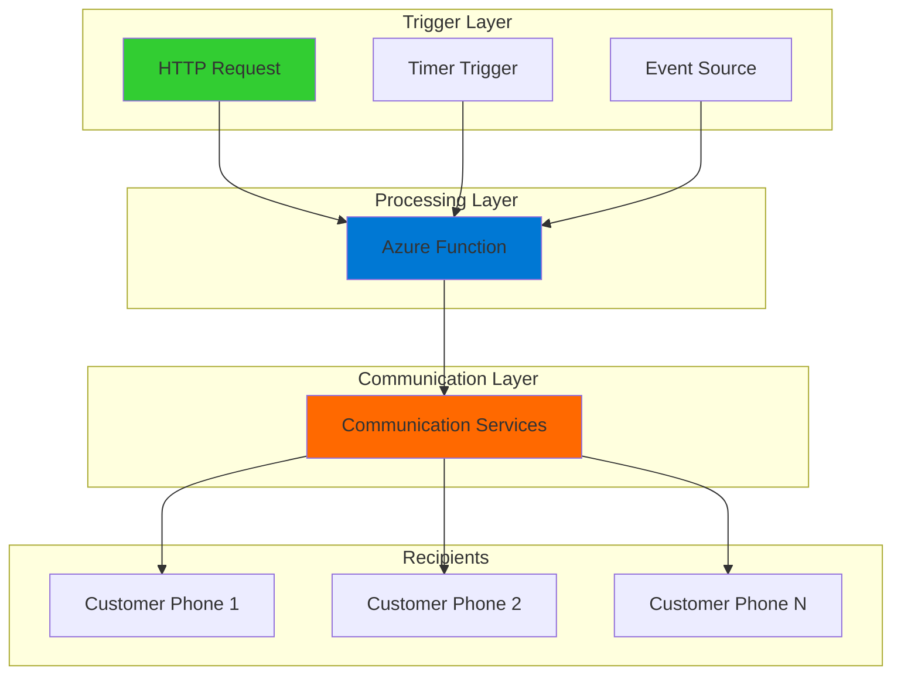

# Simple SMS Notifications with Communication Services and Functions

## Problem

Small businesses often struggle to send timely customer notifications like order confirmations, appointment reminders, or delivery updates without implementing complex SMS infrastructure. Traditional SMS solutions require managing carrier relationships, handling compliance requirements, and maintaining dedicated infrastructure that scales poorly with business growth. Manual notification processes lead to customer dissatisfaction and lost business opportunities.

## Solution

Build a serverless SMS notification system using Azure Communication Services for reliable message delivery and Azure Functions for event-driven processing. This solution provides enterprise-grade SMS capabilities with automatic scaling, built-in compliance features, and pay-per-use pricing that grows with your business needs.

## Architecture Diagram



## Prerequisites

1. Azure account with active subscription and Communication Services permissions
2. Azure CLI installed and configured (version 2.37.0 or later)
3. Azure Functions Core Tools v4 installed locally
4. Basic understanding of serverless computing concepts
5. Phone number for testing SMS delivery (your own mobile number)
6. Estimated cost: $2/month for toll-free phone number lease + $0.0075-0.01 per SMS message sent

> **Note**: SMS capabilities depend on your Azure billing location and regional availability. Review [subscription eligibility](https://docs.microsoft.com/en-us/azure/communication-services/concepts/numbers/sub-eligibility-number-capability) before proceeding. Toll-free numbers require verification for SMS usage.

## Preparation

```bash
# Set environment variables for Azure resources
export RESOURCE_GROUP="rg-sms-notifications-${RANDOM_SUFFIX}"
export LOCATION="eastus"
export SUBSCRIPTION_ID=$(az account show --query id --output tsv)

# Generate unique suffix for resource names
RANDOM_SUFFIX=$(openssl rand -hex 3)

# Set resource names with unique suffix
export ACS_RESOURCE_NAME="acs-sms-${RANDOM_SUFFIX}"
export FUNCTION_APP_NAME="func-sms-${RANDOM_SUFFIX}"
export STORAGE_ACCOUNT_NAME="stsms${RANDOM_SUFFIX}"

# Create resource group
az group create \
    --name ${RESOURCE_GROUP} \
    --location ${LOCATION} \
    --tags purpose=recipe environment=demo

echo "✅ Resource group created: ${RESOURCE_GROUP}"
```

## Steps

1. **Create Azure Communication Services Resource**:

   Azure Communication Services provides cloud-based communication APIs that enable real-time messaging, voice, video, and SMS capabilities. Creating a Communication Services resource establishes the foundation for programmatic SMS messaging with built-in compliance, global carrier relationships, and enterprise-grade security features.

   ```bash
   # Create Communication Services resource
   az communication create \
       --name ${ACS_RESOURCE_NAME} \
       --resource-group ${RESOURCE_GROUP} \
       --location "global" \
       --data-location "United States"
   
   # Get the connection string for the resource
   ACS_CONNECTION_STRING=$(az communication list-key \
       --name ${ACS_RESOURCE_NAME} \
       --resource-group ${RESOURCE_GROUP} \
       --query "primaryConnectionString" \
       --output tsv)
   
   echo "✅ Communication Services resource created successfully"
   ```

   The Communication Services resource is now ready to handle SMS operations. The connection string provides secure authentication for your applications to send messages through Azure's global SMS infrastructure.

2. **Acquire Phone Number for SMS**:

   Azure Communication Services requires a dedicated phone number to send SMS messages. Toll-free numbers provide the best deliverability and compliance with carrier requirements, especially for business communications and automated notifications.

   ```bash
   # Search for available toll-free numbers
   az communication phonenumber list-available \
       --resource-group ${RESOURCE_GROUP} \
       --communication-service ${ACS_RESOURCE_NAME} \
       --phone-number-type "tollFree" \
       --assignment-type "application" \
       --capabilities "sms" \
       --area-code "800"
   
   # Purchase the first available toll-free number
   # Note: This will incur a monthly charge (~$2/month)
   PHONE_NUMBER=$(az communication phonenumber purchase \
       --resource-group ${RESOURCE_GROUP} \
       --communication-service ${ACS_RESOURCE_NAME} \
       --phone-number-type "tollFree" \
       --assignment-type "application" \
       --capabilities "sms" \
       --area-code "800" \
       --quantity 1 \
       --query "phoneNumbers[0]" \
       --output tsv)
   
   echo "✅ Phone number acquired: ${PHONE_NUMBER}"
   ```

   Your Communication Services resource now has a dedicated toll-free number for sending SMS messages. This number requires verification before it can send SMS messages to US and Canadian phone numbers.

   > **Warning**: Unverified toll-free numbers cannot send SMS messages. You must complete toll-free verification through the Azure portal before SMS functionality becomes available.

3. **Create Storage Account for Function App**:

   Azure Functions requires a storage account for storing function code, managing triggers, and maintaining runtime state. The storage account provides the persistent layer needed for serverless function execution and scaling.

   ```bash
   # Create storage account for Function App
   az storage account create \
       --name ${STORAGE_ACCOUNT_NAME} \
       --resource-group ${RESOURCE_GROUP} \
       --location ${LOCATION} \
       --sku Standard_LRS \
       --kind StorageV2
   
   # Get storage account connection string
   STORAGE_CONNECTION_STRING=$(az storage account show-connection-string \
       --name ${STORAGE_ACCOUNT_NAME} \
       --resource-group ${RESOURCE_GROUP} \
       --query "connectionString" \
       --output tsv)
   
   echo "✅ Storage account created for Function App"
   ```

   The storage account is configured with local redundancy (LRS) for cost optimization while maintaining the reliability needed for function app operations.

4. **Create Azure Function App**:

   Azure Functions provides serverless compute that automatically scales based on demand. The Consumption plan offers the most cost-effective hosting for SMS notifications, charging only for actual execution time and memory usage.

   ```bash
   # Create Function App on Consumption plan
   az functionapp create \
       --name ${FUNCTION_APP_NAME} \
       --resource-group ${RESOURCE_GROUP} \
       --storage-account ${STORAGE_ACCOUNT_NAME} \
       --consumption-plan-location ${LOCATION} \
       --runtime node \
       --runtime-version 20 \
       --functions-version 4 \
       --os-type Linux
   
   # Configure Communication Services connection string
   az functionapp config appsettings set \
       --name ${FUNCTION_APP_NAME} \
       --resource-group ${RESOURCE_GROUP} \
       --settings "ACS_CONNECTION_STRING=${ACS_CONNECTION_STRING}" \
           "SMS_FROM_PHONE=${PHONE_NUMBER}"
   
   echo "✅ Function App created and configured"
   ```

   The Function App is now ready with Node.js 20 runtime and configured environment variables for SMS operations. The Consumption plan provides automatic scaling from zero to handle any notification volume.

5. **Create Local Function Project**:

   The Function App needs custom code to handle SMS sending requests. This implementation uses the Azure Communication Services SDK with Azure Functions v4 programming model to send messages with proper error handling and logging for production reliability.

   ```bash
   # Create local function project structure
   mkdir -p sms-function-code
   cd sms-function-code
   
   # Initialize Functions project
   func init --javascript --model V4
   
   # Create package.json with dependencies
   cat > package.json << 'EOF'
   {
     "name": "sms-notification-function",
     "version": "1.0.0",
     "description": "SMS notification system using Azure Communication Services",
     "main": "src/index.js",
     "scripts": {
       "start": "func start"
     },
     "dependencies": {
       "@azure/communication-sms": "^1.1.0",
       "@azure/functions": "^4.0.0"
     }
   }
   EOF
   
   echo "✅ Function project structure created"
   ```

   The project structure follows Azure Functions v4 programming model best practices with the main entry point defined in package.json and proper dependency management.

6. **Create SMS Sending Function**:

   ```bash
   # Create function directory and main index file
   mkdir -p src
   
   # Create main function file with v4 programming model
   cat > src/index.js << 'EOF'
   const { app } = require('@azure/functions');
   const { SmsClient } = require('@azure/communication-sms');

   app.http('sendSMS', {
       methods: ['POST'],
       authLevel: 'function',
       handler: async (request, context) => {
           try {
               // Parse request body
               const requestBody = await request.json();
               const { to, message } = requestBody;
               
               // Validate required parameters
               if (!to || !message) {
                   context.log('Missing required parameters: to, message');
                   return {
                       status: 400,
                       jsonBody: {
                           error: 'Missing required parameters: to, message'
                       }
                   };
               }
               
               // Validate phone number format
               if (!to.match(/^\+?[1-9]\d{1,14}$/)) {
                   context.log(`Invalid phone number format: ${to}`);
                   return {
                       status: 400,
                       jsonBody: {
                           error: 'Invalid phone number format. Use E.164 format (+1234567890)'
                       }
                   };
               }
               
               // Initialize SMS client
               const connectionString = process.env.ACS_CONNECTION_STRING;
               const fromPhone = process.env.SMS_FROM_PHONE;
               
               if (!connectionString || !fromPhone) {
                   context.error('Missing required environment variables');
                   return {
                       status: 500,
                       jsonBody: {
                           error: 'Server configuration error'
                       }
                   };
               }
               
               const smsClient = new SmsClient(connectionString);
               
               // Send SMS message
               const sendResults = await smsClient.send({
                   from: fromPhone,
                   to: [to],
                   message: message
               });
               
               // Check if message was sent successfully
               const result = sendResults[0];
               if (result.successful) {
                   context.log(`SMS sent successfully to ${to}, MessageId: ${result.messageId}`);
                   return {
                       status: 200,
                       jsonBody: {
                           success: true,
                           messageId: result.messageId,
                           to: to,
                           message: 'SMS sent successfully'
                       }
                   };
               } else {
                   context.error(`Failed to send SMS: ${result.errorMessage}`);
                   return {
                       status: 500,
                       jsonBody: {
                           success: false,
                           error: result.errorMessage
                       }
                   };
               }
               
           } catch (error) {
               context.error(`Error sending SMS: ${error.message}`);
               return {
                   status: 500,
                   jsonBody: {
                       success: false,
                       error: 'Internal server error'
                   }
               };
           }
       }
   });
   EOF
   
   echo "✅ SMS function code created"
   ```

   The function implements comprehensive error handling, input validation, phone number format validation, and structured logging for production-ready SMS operations with clear success/failure responses using the Azure Functions v4 programming model.

7. **Deploy Function to Azure**:

   ```bash
   # Install dependencies
   npm install
   
   # Deploy function code to Azure
   func azure functionapp publish ${FUNCTION_APP_NAME}
   
   # Get function URL and key for testing
   FUNCTION_URL=$(az functionapp function show \
       --name ${FUNCTION_APP_NAME} \
       --resource-group ${RESOURCE_GROUP} \
       --function-name sendSMS \
       --query "invokeUrlTemplate" \
       --output tsv)
   
   # Get function key
   FUNCTION_KEY=$(az functionapp keys list \
       --name ${FUNCTION_APP_NAME} \
       --resource-group ${RESOURCE_GROUP} \
       --query "functionKeys.default" \
       --output tsv)
   
   echo "✅ Function deployed successfully"
   echo "Function URL: ${FUNCTION_URL}?code=${FUNCTION_KEY}"
   
   cd ..
   ```

   The function is now deployed and accessible via HTTPS with secure authentication. The function URL includes an access key for secure invocation from external systems.

## Validation & Testing

1. **Test SMS Function with Sample Message**:

   ```bash
   # Set your mobile phone number for testing (E.164 format)
   export TEST_PHONE_NUMBER="+1234567890"  # Replace with your number
   
   # Test SMS sending with curl
   curl -X POST "${FUNCTION_URL}?code=${FUNCTION_KEY}" \
        -H "Content-Type: application/json" \
        -d "{
          \"to\": \"${TEST_PHONE_NUMBER}\",
          \"message\": \"Hello from Azure! Your SMS notification system is working perfectly. 🚀\"
        }"
   ```

   Expected output: JSON response with `"success": true` and message ID. Note that the SMS may not be delivered if your toll-free number is not verified.

2. **Verify Function App Status**:

   ```bash
   # Check Function App health
   az functionapp show \
       --name ${FUNCTION_APP_NAME} \
       --resource-group ${RESOURCE_GROUP} \
       --query "{name:name, state:state, enabled:enabled}" \
       --output table
   
   # Check recent function executions
   az functionapp logs tail \
       --name ${FUNCTION_APP_NAME} \
       --resource-group ${RESOURCE_GROUP}
   ```

3. **Test Error Handling**:

   ```bash
   # Test with missing parameters
   curl -X POST "${FUNCTION_URL}?code=${FUNCTION_KEY}" \
        -H "Content-Type: application/json" \
        -d "{\"message\": \"Test without phone number\"}"
   
   # Test with invalid phone number format
   curl -X POST "${FUNCTION_URL}?code=${FUNCTION_KEY}" \
        -H "Content-Type: application/json" \
        -d "{\"to\": \"invalid-number\", \"message\": \"Test message\"}"
   ```

   Expected output: HTTP 400 errors with appropriate validation messages.

## Cleanup

1. **Remove Function App and Storage**:

   ```bash
   # Delete Function App
   az functionapp delete \
       --name ${FUNCTION_APP_NAME} \
       --resource-group ${RESOURCE_GROUP}
   
   echo "✅ Function App deleted"
   ```

2. **Release Phone Number**:

   ```bash
   # Release the phone number to stop monthly charges
   az communication phonenumber release \
       --resource-group ${RESOURCE_GROUP} \
       --communication-service ${ACS_RESOURCE_NAME} \
       --phone-number ${PHONE_NUMBER}
   
   echo "✅ Phone number released"
   ```

3. **Delete Communication Services and Resource Group**:

   ```bash
   # Delete entire resource group and all resources
   az group delete \
       --name ${RESOURCE_GROUP} \
       --yes \
       --no-wait
   
   echo "✅ Resource group deletion initiated: ${RESOURCE_GROUP}"
   echo "Note: Deletion may take several minutes to complete"
   
   # Clean up local function code
   rm -rf sms-function-code
   ```

## Discussion

This serverless SMS notification system demonstrates the power of combining Azure Communication Services with Azure Functions to create scalable, cost-effective messaging solutions. The architecture follows Azure Well-Architected Framework principles by implementing automatic scaling, secure authentication, and comprehensive error handling. Azure Communication Services handles the complexity of global SMS delivery, carrier relationships, and compliance requirements, while Azure Functions provides event-driven processing that scales from zero to handle any notification volume.

The solution's serverless nature means you only pay for actual message sending and function execution time, making it extremely cost-effective for businesses with varying notification volumes. The HTTP trigger pattern enables integration with any system that can make REST API calls, from web applications to business process automation tools. For production deployments, consider implementing additional features like message templates, recipient list management, and delivery status tracking through Event Grid integration.

The Communication Services SDK provides robust error handling and delivery confirmation, essential for mission-critical notifications like payment confirmations or emergency alerts. The function's structured logging enables comprehensive monitoring through Azure Monitor and Application Insights, providing visibility into message delivery success rates and system performance. This foundation can easily extend to support multiple communication channels including email, voice calls, and push notifications through the same unified SDK.

One important consideration is toll-free number verification requirements. In the United States and Canada, toll-free numbers must complete a verification process before they can send SMS messages. This verification ensures compliance with carrier requirements and helps prevent spam messaging. The verification process typically takes 2-3 business days and requires submitting business information and use case details through the Azure portal.

> **Tip**: Enable Application Insights monitoring for the Function App to track message delivery rates, response times, and error patterns. Use Azure Monitor alerts to proactively detect and respond to delivery failures.

**Documentation Sources:**
- [Azure Communication Services SMS Overview](https://docs.microsoft.com/en-us/azure/communication-services/concepts/sms/concepts)
- [Azure Functions v4 Programming Model](https://docs.microsoft.com/en-us/azure/azure-functions/functions-reference-node?pivots=nodejs-model-v4)
- [SMS Programming Quickstart](https://docs.microsoft.com/en-us/azure/communication-services/quickstarts/sms/send)
- [Toll-Free Verification Requirements](https://docs.microsoft.com/en-us/azure/communication-services/quickstarts/sms/apply-for-toll-free-verification)
- [Communication Services Pricing](https://docs.microsoft.com/en-us/azure/communication-services/concepts/sms-pricing)

## Challenge

Extend this SMS notification system with these enhancements:

1. **Event Grid Integration**: Configure Event Grid triggers to send SMS notifications based on Azure service events like blob uploads, database changes, or custom application events.

2. **Message Templates**: Implement a template system using Azure Table Storage to store reusable message templates with placeholder variables for personalized notifications.

3. **Delivery Status Tracking**: Add webhook endpoints to receive SMS delivery confirmations and store delivery status in Azure Cosmos DB for audit and retry logic.

4. **Multi-Channel Notifications**: Extend the function to support email notifications through Communication Services Email API, creating a unified notification hub.

5. **Scheduled Notifications**: Implement Timer triggers to send scheduled messages like appointment reminders, subscription renewals, or periodic status updates with Azure Storage Queue for message queuing.

## Infrastructure Code

*Infrastructure code will be generated after recipe approval.*