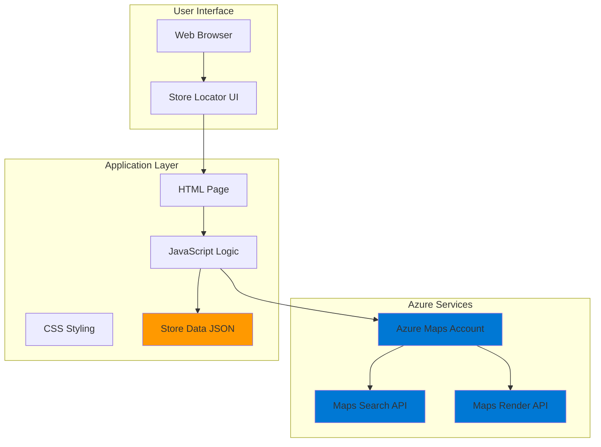

# Simple Store Locator with Azure Maps

## Problem

Small businesses need an effective way to help customers find their physical store locations through their website. Traditional static maps are insufficient as customers expect interactive experiences with search capabilities, location details, and mobile-responsive design. Without a proper store locator, businesses lose potential customers who cannot easily find their stores, leading to reduced foot traffic and lost revenue.

## Solution

Build an interactive web-based store locator using Azure Maps that displays multiple store locations on an interactive map with search functionality, location clustering, and detailed popups. Azure Maps provides enterprise-grade mapping services with built-in search capabilities, responsive design, and global coverage with generous free tier pricing.

## Architecture Diagram



## Prerequisites

1. Azure subscription with appropriate permissions to create Azure Maps accounts
2. Azure CLI installed and configured (or use Azure Cloud Shell)
3. Basic knowledge of HTML, CSS, and JavaScript
4. Text editor or IDE for web development
5. Web browser for testing the application
6. Estimated cost: $0 - Azure Maps Gen2 includes 1,000 free transactions monthly

> **Note**: This recipe uses Azure Maps Gen2 pricing tier, which is the current standard and replaces the deprecated Gen1 tiers that will be retired on September 15, 2026.

## Preparation

```bash
# Set environment variables for Azure resources
export RESOURCE_GROUP="rg-storemaps-${RANDOM_SUFFIX}"
export LOCATION="eastus"
export SUBSCRIPTION_ID=$(az account show --query id --output tsv)
export MAPS_ACCOUNT_NAME="mapstore${RANDOM_SUFFIX}"

# Generate unique suffix for resource names
RANDOM_SUFFIX=$(openssl rand -hex 3)

# Create resource group for the store locator resources
az group create \
    --name ${RESOURCE_GROUP} \
    --location ${LOCATION} \
    --tags purpose=recipe environment=demo

echo "✅ Resource group created: ${RESOURCE_GROUP}"

# Create working directory for the web application
mkdir -p store-locator
cd store-locator

echo "✅ Working directory created"
```

## Steps

1. **Create Azure Maps Account**:

   Azure Maps provides a comprehensive suite of location-based services including interactive maps, search capabilities, and routing functionality. The Gen2 pricing tier offers enterprise-grade features with a generous free tier that includes 1,000 monthly transactions, making it ideal for small to medium-sized applications.

   ```bash
   # Create Azure Maps account with Gen2 pricing tier
   az maps account create \
       --resource-group ${RESOURCE_GROUP} \
       --account-name ${MAPS_ACCOUNT_NAME} \
       --sku Gen2 \
       --tags application=store-locator environment=demo
   
   echo "✅ Azure Maps account created: ${MAPS_ACCOUNT_NAME}"
   ```

   The Azure Maps account serves as the foundation for all location-based functionality in your store locator, providing authentication and access to mapping services with global coverage and enterprise-grade reliability.

2. **Retrieve Azure Maps Subscription Key**:

   Azure Maps uses subscription keys for authentication in development scenarios. While production applications should use Microsoft Entra ID authentication for enhanced security, subscription keys provide a straightforward approach for getting started quickly with mapping functionality.

   ```bash
   # Get the primary subscription key for authentication
   MAPS_KEY=$(az maps account keys list \
       --resource-group ${RESOURCE_GROUP} \
       --account-name ${MAPS_ACCOUNT_NAME} \
       --query primaryKey \
       --output tsv)
   
   echo "Azure Maps Key: ${MAPS_KEY}"
   echo "✅ Retrieved Azure Maps subscription key"
   ```

   Store this key securely as it provides access to Azure Maps services and will be used in your web application to authenticate API requests.

3. **Create Store Data JSON File**:

   Organizing store location data in a structured JSON format enables easy management and dynamic loading of store information. This approach allows for future scalability and easy updates without modifying application code, supporting business growth and operational flexibility.

   ```bash
   # Create sample store data with realistic locations
   cat > stores.json << 'EOF'
   [
     {
       "name": "Downtown Coffee Shop",
       "address": "123 Main St, Seattle, WA 98101",
       "phone": "(206) 555-0101",
       "hours": "Mon-Fri 6:00AM-8:00PM, Sat-Sun 7:00AM-9:00PM",
       "latitude": 47.6062,
       "longitude": -122.3321,
       "services": ["WiFi", "Drive-through", "Outdoor Seating"]
     },
     {
       "name": "University District Cafe",
       "address": "456 University Way, Seattle, WA 98105",
       "phone": "(206) 555-0102",
       "hours": "Daily 5:30AM-10:00PM",
       "latitude": 47.6587,
       "longitude": -122.3138,
       "services": ["WiFi", "Study Area", "Pastries"]
     },
     {
       "name": "Capitol Hill Roastery",
       "address": "789 Pine St, Seattle, WA 98122",
       "phone": "(206) 555-0103",
       "hours": "Mon-Fri 6:30AM-7:00PM, Sat-Sun 7:30AM-8:00PM",
       "latitude": 47.6149,
       "longitude": -122.3194,
       "services": ["Fresh Roasted", "Live Music", "Art Gallery"]
     }
   ]
   EOF
   
   echo "✅ Store data file created with sample locations"
   ```

   The JSON structure includes essential business information and coordinates that Azure Maps will use for geocoding and display purposes. This format supports easy integration with backend systems and content management workflows.

4. **Create HTML Structure**:

   The HTML foundation establishes the user interface components and loads necessary Azure Maps SDK resources. Modern web applications benefit from responsive design principles that adapt to different screen sizes and devices, ensuring accessibility across desktop, tablet, and mobile platforms.

   ```bash
   # Create the main HTML file with responsive design
   cat > index.html << 'EOF'
   <!DOCTYPE html>
   <html lang="en">
   <head>
       <meta charset="utf-8">
       <meta http-equiv="x-ua-compatible" content="IE=Edge">
       <meta name="viewport" content="width=device-width, initial-scale=1, shrink-to-fit=no">
       <title>Store Locator - Find Our Locations</title>
       
       <!-- Azure Maps SDK CSS and JavaScript -->
       <link rel="stylesheet" href="https://atlas.microsoft.com/sdk/javascript/mapcontrol/3/atlas.min.css" type="text/css">
       <script src="https://atlas.microsoft.com/sdk/javascript/mapcontrol/3/atlas.min.js"></script>
       
       <!-- Application styles -->
       <link rel="stylesheet" href="styles.css" type="text/css">
   </head>
   <body>
       <header>
           <h1>🏪 Our Store Locations</h1>
           <p>Find the nearest store location with our interactive map</p>
       </header>
       
       <main>
           <div class="search-panel">
               <input id="searchBox" type="search" placeholder="Search for a location..." />
               <button id="searchButton" title="Search">🔍</button>
               <button id="myLocationButton" title="My Location">📍</button>
           </div>
           
           <div class="content-container">
               <div id="listPanel" class="list-panel"></div>
               <div id="mapContainer" class="map-container"></div>
           </div>
       </main>
       
       <script src="app.js"></script>
   </body>
   </html>
   EOF
   
   echo "✅ HTML structure created with Azure Maps SDK integration"
   ```

   The HTML includes Azure Maps Web SDK v3 which provides the latest features including WebGL 2 compatibility, enhanced performance, and support for 3D terrain tiles, delivering optimal performance for interactive mapping applications.

5. **Create CSS Styling**:

   Responsive CSS design ensures your store locator works effectively across desktop, tablet, and mobile devices. Modern CSS features like flexbox provide flexible layouts that adapt to different screen sizes while maintaining visual consistency and user experience standards.

   ```bash
   # Create responsive CSS with mobile-first approach
   cat > styles.css << 'EOF'
   * {
       box-sizing: border-box;
       margin: 0;
       padding: 0;
   }
   
   body {
       font-family: -apple-system, BlinkMacSystemFont, 'Segoe UI', Roboto, sans-serif;
       background-color: #f5f5f5;
       color: #333;
       line-height: 1.6;
   }
   
   header {
       background: linear-gradient(135deg, #0078d4, #005a9e);
       color: white;
       padding: 2rem;
       text-align: center;
       box-shadow: 0 2px 10px rgba(0,0,0,0.1);
   }
   
   header h1 {
       font-size: 2.5rem;
       margin-bottom: 0.5rem;
   }
   
   header p {
       font-size: 1.1rem;
       opacity: 0.9;
   }
   
   .search-panel {
       display: flex;
       gap: 10px;
       padding: 1rem;
       background: white;
       box-shadow: 0 2px 10px rgba(0,0,0,0.1);
       justify-content: center;
       align-items: center;
   }
   
   #searchBox {
       flex: 1;
       max-width: 400px;
       padding: 12px;
       border: 2px solid #ddd;
       border-radius: 25px;
       font-size: 16px;
       outline: none;
       transition: border-color 0.3s;
   }
   
   #searchBox:focus {
       border-color: #0078d4;
   }
   
   button {
       padding: 12px 20px;
       border: none;
       border-radius: 25px;
       background: #0078d4;
       color: white;
       cursor: pointer;
       font-size: 16px;
       transition: background-color 0.3s;
   }
   
   button:hover {
       background: #005a9e;
   }
   
   .content-container {
       display: flex;
       height: calc(100vh - 200px);
       min-height: 400px;
   }
   
   .list-panel {
       width: 350px;
       background: white;
       overflow-y: auto;
       border-right: 1px solid #ddd;
   }
   
   .map-container {
       flex: 1;
       position: relative;
   }
   
   .store-item {
       padding: 1rem;
       border-bottom: 1px solid #eee;
       cursor: pointer;
       transition: background-color 0.2s;
   }
   
   .store-item:hover {
       background-color: #f8f9fa;
   }
   
   .store-name {
       font-weight: bold;
       color: #0078d4;
       margin-bottom: 0.5rem;
   }
   
   .store-address {
       color: #666;
       font-size: 0.9rem;
       margin-bottom: 0.25rem;
   }
   
   .store-distance {
       color: #0078d4;
       font-size: 0.8rem;
       font-weight: bold;
   }
   
   /* Mobile responsive design */
   @media (max-width: 768px) {
       .content-container {
           flex-direction: column;
       }
       
       .list-panel {
           width: 100%;
           max-height: 200px;
       }
       
       .search-panel {
           flex-wrap: wrap;
       }
       
       header h1 {
           font-size: 2rem;
       }
   }
   EOF
   
   echo "✅ CSS styling created with responsive design"
   ```

   The CSS implementation follows modern design principles with a mobile-first approach that ensures optimal user experience across all device types, supporting the Azure Well-Architected Framework's operational excellence pillar.

6. **Create JavaScript Application Logic**:

   The JavaScript implementation integrates with Azure Maps Web SDK to provide interactive mapping functionality. This includes map initialization, data loading, search capabilities, and user interaction handling with enterprise-grade performance and reliability.

   ```bash
   # Create comprehensive JavaScript application
   cat > app.js << 'EOF'
   // Azure Maps configuration
   const MAPS_KEY = 'YOUR_AZURE_MAPS_KEY'; // Replace with actual key
   let map, dataSource, searchServiceClient, popup, stores = [];
   
   // Initialize the application when DOM is loaded
   document.addEventListener('DOMContentLoaded', function() {
       initializeMap();
       loadStoreData();
       setupEventListeners();
   });
   
   function initializeMap() {
       // Initialize Azure Maps with authentication
       map = new atlas.Map('mapContainer', {
           center: [-122.3321, 47.6062], // Seattle coordinates
           zoom: 10,
           language: 'en-US',
           authOptions: {
               authType: 'subscriptionKey',
               subscriptionKey: MAPS_KEY
           },
           style: 'road'
       });
   
       // Wait for map to be ready before adding components
       map.events.add('ready', function() {
           // Create data source for store locations
           dataSource = new atlas.source.DataSource(null, {
               cluster: true,
               clusterRadius: 45,
               clusterMaxZoom: 15
           });
           
           map.sources.add(dataSource);
   
           // Create popup for store details
           popup = new atlas.Popup({
               pixelOffset: [0, -40]
           });
   
           // Add map controls
           map.controls.add([
               new atlas.control.ZoomControl(),
               new atlas.control.CompassControl(),
               new atlas.control.PitchControl(),
               new atlas.control.StyleControl()
           ], {
               position: 'top-right'
           });
   
           // Create layers for displaying stores
           createMapLayers();
           
           // Initialize search service
           searchServiceClient = new atlas.service.SearchServiceClient(
               atlas.service.MapsURL.newPipeline(new atlas.service.SubscriptionKeyCredential(MAPS_KEY))
           );
       });
   }
   
   function createMapLayers() {
       // Bubble layer for clustered points
       const clusterBubbleLayer = new atlas.layer.BubbleLayer(dataSource, null, {
           radius: 20,
           color: '#0078d4',
           strokeColor: 'white',
           strokeWidth: 2,
           filter: ['has', 'point_count']
       });
   
       // Symbol layer for cluster count
       const clusterLabelLayer = new atlas.layer.SymbolLayer(dataSource, null, {
           iconOptions: {
               image: 'none'
           },
           textOptions: {
               textField: ['get', 'point_count_abbreviated'],
               color: 'white',
               font: ['StandardFont-Bold'],
               size: 12
           },
           filter: ['has', 'point_count']
       });
   
       // Symbol layer for individual stores
       const storeLayer = new atlas.layer.SymbolLayer(dataSource, null, {
           iconOptions: {
               image: 'marker-red',
               allowOverlap: true,
               ignorePlacement: true
           },
           filter: ['!', ['has', 'point_count']]
       });
   
       // Add layers to map
       map.layers.add([clusterBubbleLayer, clusterLabelLayer, storeLayer]);
   
       // Add click events
       map.events.add('click', clusterBubbleLayer, clusterClicked);
       map.events.add('click', storeLayer, storeClicked);
       map.events.add('moveend', updateStoreList);
   }
   
   async function loadStoreData() {
       try {
           const response = await fetch('stores.json');
           stores = await response.json();
           
           // Convert stores to GeoJSON features
           const features = stores.map(store => new atlas.data.Feature(
               new atlas.data.Point([store.longitude, store.latitude]),
               store
           ));
           
           dataSource.add(features);
           updateStoreList();
           
           console.log(`✅ Loaded ${stores.length} store locations`);
       } catch (error) {
           console.error('Error loading store data:', error);
       }
   }
   
   function setupEventListeners() {
       // Search functionality
       document.getElementById('searchButton').addEventListener('click', performSearch);
       document.getElementById('searchBox').addEventListener('keypress', function(e) {
           if (e.key === 'Enter') {
               performSearch();
           }
       });
   
       // My location functionality
       document.getElementById('myLocationButton').addEventListener('click', getUserLocation);
   }
   
   async function performSearch() {
       const query = document.getElementById('searchBox').value.trim();
       if (!query) return;
   
       try {
           const results = await searchServiceClient.searchPOI(
               atlas.service.Aborter.timeout(10000),
               query,
               {
                   limit: 5,
                   lat: map.getCamera().center[1],
                   lon: map.getCamera().center[0],
                   radius: 50000
               }
           );
   
           if (results.results && results.results.length > 0) {
               const result = results.results[0];
               map.setCamera({
                   center: [result.position.lon, result.position.lat],
                   zoom: 12
               });
           }
       } catch (error) {
           console.error('Search error:', error);
       }
   }
   
   function getUserLocation() {
       if (navigator.geolocation) {
           navigator.geolocation.getCurrentPosition(
               function(position) {
                   map.setCamera({
                       center: [position.coords.longitude, position.coords.latitude],
                       zoom: 12
                   });
               },
               function(error) {
                   console.error('Geolocation error:', error);
                   alert('Unable to get your location. Please try searching instead.');
               }
           );
       } else {
           alert('Geolocation is not supported by this browser.');
       }
   }
   
   function clusterClicked(e) {
       map.setCamera({
           center: e.position,
           zoom: map.getCamera().zoom + 2
       });
   }
   
   function storeClicked(e) {
       if (e.shapes && e.shapes.length > 0) {
           const properties = e.shapes[0].getProperties();
           showStorePopup(e.position, properties);
       }
   }
   
   function showStorePopup(position, store) {
       const content = `
           <div style="padding: 10px;">
               <h3 style="color: #0078d4; margin-bottom: 10px;">${store.name}</h3>
               <p><strong>📍 Address:</strong><br>${store.address}</p>
               <p><strong>📞 Phone:</strong> ${store.phone}</p>
               <p><strong>🕒 Hours:</strong><br>${store.hours}</p>
               <p><strong>🛠️ Services:</strong><br>${store.services.join(', ')}</p>
           </div>
       `;
       
       popup.setOptions({
           content: content,
           position: position
       });
       
       popup.open(map);
   }
   
   function updateStoreList() {
       const bounds = map.getCamera().bounds;
       const centerPoint = map.getCamera().center;
       
       // Filter stores within current map bounds
       const visibleStores = stores.filter(store => {
           return store.longitude >= bounds[0] && 
                  store.longitude <= bounds[2] && 
                  store.latitude >= bounds[1] && 
                  store.latitude <= bounds[3];
       });
   
       // Calculate distances and sort
       visibleStores.forEach(store => {
           store.distance = atlas.math.getDistanceTo(
               new atlas.data.Position(centerPoint[0], centerPoint[1]),
               new atlas.data.Position(store.longitude, store.latitude),
               'miles'
           );
       });
   
       visibleStores.sort((a, b) => a.distance - b.distance);
   
       // Update list panel
       const listPanel = document.getElementById('listPanel');
       listPanel.innerHTML = visibleStores.map(store => `
           <div class="store-item" onclick="focusStore(${store.latitude}, ${store.longitude})">
               <div class="store-name">${store.name}</div>
               <div class="store-address">${store.address}</div>
               <div class="store-distance">${store.distance.toFixed(1)} miles away</div>
           </div>
       `).join('');
   }
   
   function focusStore(lat, lon) {
       map.setCamera({
           center: [lon, lat],
           zoom: 15
       });
   }
   EOF
   
   echo "✅ JavaScript application logic created"
   echo "⚠️  Remember to replace 'YOUR_AZURE_MAPS_KEY' with your actual key"
   ```

   The JavaScript implementation provides a comprehensive store locator with clustering, search, geolocation, and responsive list updates based on map movement, leveraging Azure Maps' WebGL-based rendering for optimal performance.

7. **Update JavaScript with Azure Maps Key**:

   Properly configuring authentication ensures your application can access Azure Maps services securely. This step integrates your Azure Maps subscription key directly into the application code for immediate functionality.

   ```bash
   # Replace placeholder with actual Azure Maps key
   sed -i "s/YOUR_AZURE_MAPS_KEY/${MAPS_KEY}/g" app.js
   
   echo "✅ Azure Maps key configured in application"
   echo "🌐 Store locator is ready to use!"
   ```

   The application is now fully configured and ready for testing with your specific Azure Maps account credentials, providing secure access to Azure Maps services.

## Validation & Testing

1. **Verify Azure Maps Account Status**:

   ```bash
   # Check Azure Maps account details
   az maps account show \
       --resource-group ${RESOURCE_GROUP} \
       --account-name ${MAPS_ACCOUNT_NAME} \
       --output table
   ```

   Expected output: Account details showing "Succeeded" provisioning state and "Gen2" SKU name with active status.

2. **Test Web Application Functionality**:

   ```bash
   # Start a simple HTTP server for testing
   python3 -m http.server 8000
   
   # Or use Node.js if Python is not available
   # npx http-server -p 8000
   ```

   Open your browser to `http://localhost:8000` and verify:
   - Map loads correctly with Azure Maps branding
   - Store locations appear as red markers
   - Search functionality works for addresses
   - "My Location" button prompts for location access
   - Clicking markers shows store details in popup
   - List panel updates when map is moved
   - Clustering works when zooming out

3. **Test Mobile Responsiveness**:

   ```bash
   # The application should work on mobile devices
   echo "📱 Test mobile responsiveness by:"
   echo "   1. Resizing browser window below 768px width"
   echo "   2. Using browser developer tools device simulation"
   echo "   3. Testing on actual mobile device"
   ```

   Verify that the layout adapts properly to smaller screen sizes with the list panel stacking below the map and touch interactions working correctly.

## Cleanup

1. **Stop Local Development Server**:

   ```bash
   # Stop the HTTP server (Ctrl+C in terminal)
   echo "🛑 Stop the local development server"
   ```

2. **Remove Azure Resources**:

   ```bash
   # Delete the resource group and all contained resources
   az group delete \
       --name ${RESOURCE_GROUP} \
       --yes \
       --no-wait
   
   echo "✅ Resource group deletion initiated: ${RESOURCE_GROUP}"
   echo "Note: Deletion may take several minutes to complete"
   ```

3. **Clean Up Local Files**:

   ```bash
   # Remove local development files
   cd ..
   rm -rf store-locator
   
   # Clear environment variables
   unset RESOURCE_GROUP LOCATION MAPS_ACCOUNT_NAME MAPS_KEY RANDOM_SUFFIX
   
   echo "✅ Local files and environment variables cleaned up"
   ```

## Discussion

Azure Maps provides a comprehensive geospatial platform that enables developers to build sophisticated location-based applications with enterprise-grade reliability and security. The store locator implementation demonstrates several key Azure Maps capabilities including interactive mapping, search services, and responsive design patterns that work seamlessly across desktop and mobile devices, following the Azure Well-Architected Framework principles of operational excellence and performance efficiency.

The Gen2 pricing tier offers significant advantages over the deprecated Gen1 tiers, including better transaction rates, enhanced security features, and improved global coverage. With 1,000 free monthly transactions, small businesses can deploy store locators without immediate cost concerns, making Azure Maps an accessible choice for location-based applications. The service automatically handles complex geospatial operations like clustering, distance calculations, and map tile management, allowing developers to focus on business logic rather than mapping infrastructure while maintaining high performance and reliability standards.

The Web SDK v3 used in this implementation provides WebGL 2-based rendering for smooth performance even with large datasets, automatic tile caching to minimize transaction costs, and comprehensive accessibility features. The clustering functionality ensures optimal performance by grouping nearby markers at lower zoom levels, while the responsive design adapts seamlessly to different screen sizes and input methods. This approach aligns with the Azure Well-Architected Framework's cost optimization and performance efficiency pillars, as documented in the [Azure Architecture Center](https://docs.microsoft.com/en-us/azure/architecture/).

> **Tip**: Consider implementing Microsoft Entra ID authentication for production deployments instead of subscription keys, as it provides better security, audit capabilities, and role-based access control for enterprise applications following Azure security best practices.

## Challenge

Extend this store locator by implementing these enhancements:

1. **Advanced Search Features**: Add autocomplete suggestions using Azure Maps Search API with typeahead functionality, implement filtering by store services or hours, and enable radius-based search with user-defined distances for enhanced user experience.

2. **Route Planning Integration**: Use Azure Maps Route API to calculate driving directions from user location to selected stores, display estimated travel time and distance, and provide turn-by-turn navigation instructions with real-time traffic data.

3. **Enhanced Data Management**: Integrate with Azure Cosmos DB to store and manage store information dynamically, implement an admin interface for adding/editing store locations, and add support for store hours, special offers, and inventory status with real-time updates.

4. **Progressive Web App Features**: Add offline functionality using service workers, implement push notifications for store promotions using Azure Notification Hubs, and create an installable mobile app experience with native-like performance and caching strategies.

5. **Analytics and Insights**: Integrate Azure Application Insights to track user interactions and popular search terms, implement heatmaps showing most-searched areas using Azure Maps data visualization, and create Power BI dashboards for business intelligence on customer location patterns and store performance metrics.

## Infrastructure Code

*Infrastructure code will be generated after recipe approval.*