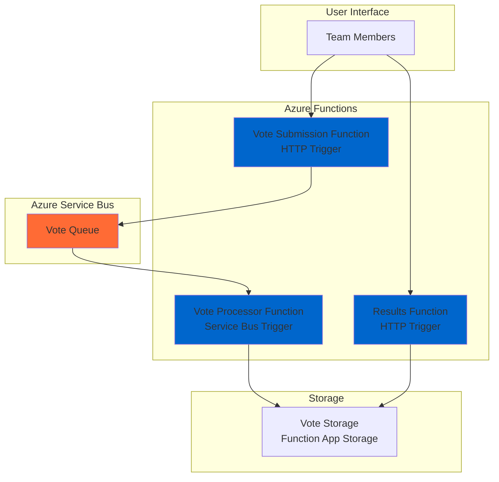

# Simple Team Poll System with Functions and Service Bus

## Problem

Team leaders need a simple way to conduct quick polls and gather feedback from team members during meetings or decision-making processes. Traditional polling solutions often require complex setup, user accounts, or expensive subscriptions. Teams need a lightweight solution that allows members to submit votes via simple HTTP requests and view real-time results without authentication complexity or infrastructure management overhead.

## Solution

Build a serverless team polling system using Azure Functions for HTTP API endpoints and Service Bus for reliable message queuing. This approach provides a cost-effective, scalable solution that automatically handles vote processing and result aggregation without requiring server management or complex authentication systems.

## Architecture Diagram



## Prerequisites

1. Azure account with active subscription and appropriate permissions to create Function Apps and Service Bus
2. Azure CLI installed and configured (version 2.60 or later) or Azure Cloud Shell
3. Basic understanding of HTTP APIs and JSON data formats
4. Knowledge of serverless computing concepts and message queuing patterns
5. Estimated cost: $0.10-$0.50 per day for light usage (Function consumption plan + Service Bus basic tier)

> **Note**: This recipe uses consumption-based pricing, ensuring you only pay for actual usage with automatic scaling capabilities.

## Preparation

Azure Functions and Service Bus provide the foundation for building event-driven serverless applications. Functions offer automatic scaling and pay-per-execution pricing, while Service Bus ensures reliable message delivery with built-in retry mechanisms and dead letter queue support.

```bash
# Generate unique suffix for resource names
RANDOM_SUFFIX=$(openssl rand -hex 3)

# Set environment variables for Azure resources
export RESOURCE_GROUP="rg-recipe-${RANDOM_SUFFIX}"
export LOCATION="eastus"
export SUBSCRIPTION_ID=$(az account show --query id --output tsv)

# Set Service Bus and Function App names
export SERVICE_BUS_NAMESPACE="sb-poll-${RANDOM_SUFFIX}"
export FUNCTION_APP_NAME="func-poll-${RANDOM_SUFFIX}"
export STORAGE_ACCOUNT="sapoll${RANDOM_SUFFIX}"

# Create resource group
az group create \
    --name ${RESOURCE_GROUP} \
    --location ${LOCATION} \
    --tags purpose=recipe environment=demo

echo "✅ Resource group created: ${RESOURCE_GROUP}"
```

## Steps

1. **Create Service Bus Namespace and Queue**:

   Azure Service Bus provides enterprise-grade messaging capabilities with guaranteed message delivery and built-in dead letter queue handling. Creating a dedicated namespace isolates your messaging infrastructure and provides connection management for your polling system.

   ```bash
   # Create Service Bus namespace
   az servicebus namespace create \
       --name ${SERVICE_BUS_NAMESPACE} \
       --resource-group ${RESOURCE_GROUP} \
       --location ${LOCATION} \
       --sku Basic
   
   # Wait for namespace creation to complete
   echo "Waiting for Service Bus namespace to be ready..."
   az servicebus namespace wait \
       --name ${SERVICE_BUS_NAMESPACE} \
       --resource-group ${RESOURCE_GROUP} \
       --created
   
   # Create vote processing queue
   az servicebus queue create \
       --name "votes" \
       --namespace-name ${SERVICE_BUS_NAMESPACE} \
       --resource-group ${RESOURCE_GROUP} \
       --max-size 1024
   
   # Get Service Bus connection string
   SERVICE_BUS_CONNECTION=$(az servicebus namespace \
       authorization-rule keys list \
       --name RootManageSharedAccessKey \
       --namespace-name ${SERVICE_BUS_NAMESPACE} \
       --resource-group ${RESOURCE_GROUP} \
       --query primaryConnectionString \
       --output tsv)
   
   echo "✅ Service Bus namespace and queue created"
   ```

   The Service Bus queue provides durable message storage with automatic retry capabilities, ensuring vote submissions are never lost even during high traffic periods.

2. **Create Storage Account for Function App**:

   Azure Functions requires a storage account for metadata, triggers, and application state management. This storage also serves as our simple vote persistence layer for the polling system.

   ```bash
   # Create storage account for Function App
   az storage account create \
       --name ${STORAGE_ACCOUNT} \
       --resource-group ${RESOURCE_GROUP} \
       --location ${LOCATION} \
       --sku Standard_LRS \
       --kind StorageV2
   
   # Wait for storage account creation to complete
   echo "Waiting for storage account to be ready..."
   az storage account wait \
       --name ${STORAGE_ACCOUNT} \
       --resource-group ${RESOURCE_GROUP} \
       --created
   
   # Get storage connection string
   STORAGE_CONNECTION=$(az storage account show-connection-string \
       --name ${STORAGE_ACCOUNT} \
       --resource-group ${RESOURCE_GROUP} \
       --query connectionString \
       --output tsv)
   
   echo "✅ Storage account created: ${STORAGE_ACCOUNT}"
   ```

3. **Create Function App with Service Bus Integration**:

   Azure Functions provides serverless compute with automatic scaling based on demand. The consumption plan ensures cost efficiency by charging only for actual execution time and memory usage.

   ```bash
   # Create Function App
   az functionapp create \
       --name ${FUNCTION_APP_NAME} \
       --resource-group ${RESOURCE_GROUP} \
       --storage-account ${STORAGE_ACCOUNT} \
       --consumption-plan-location ${LOCATION} \
       --runtime node \
       --runtime-version 18 \
       --functions-version 4
   
   # Wait for Function App to be ready
   echo "Waiting for Function App to be ready..."
   az functionapp wait \
       --name ${FUNCTION_APP_NAME} \
       --resource-group ${RESOURCE_GROUP} \
       --created
   
   # Configure Service Bus connection
   az functionapp config appsettings set \
       --name ${FUNCTION_APP_NAME} \
       --resource-group ${RESOURCE_GROUP} \
       --settings "ServiceBusConnection=${SERVICE_BUS_CONNECTION}"
   
   echo "✅ Function App created with Service Bus integration"
   ```

   The Function App now has secure access to Service Bus messaging capabilities through managed connection strings, enabling reliable vote processing workflows.

4. **Deploy Vote Submission Function**:

   HTTP-triggered functions provide RESTful API endpoints that automatically scale based on request volume. This function validates vote submissions and queues them for reliable processing.

   ```bash
   # Create function project directory
   mkdir -p /tmp/poll-functions/SubmitVote
   
   # Create vote submission function
   cat > /tmp/poll-functions/SubmitVote/function.json << 'EOF'
   {
     "bindings": [
       {
         "authLevel": "anonymous",
         "type": "httpTrigger",
         "direction": "in",
         "name": "req",
         "methods": ["post"]
       },
       {
         "type": "http",
         "direction": "out",
         "name": "res"
       },
       {
         "type": "serviceBus",
         "direction": "out",
         "name": "outputSbMsg",
         "queueName": "votes",
         "connection": "ServiceBusConnection"
       }
     ]
   }
   EOF
   
   # Create vote submission logic
   cat > /tmp/poll-functions/SubmitVote/index.js << 'EOF'
   module.exports = async function (context, req) {
       try {
           const { pollId, option, voterId } = req.body;
           
           if (!pollId || !option || !voterId) {
               context.res = {
                   status: 400,
                   body: { error: "Missing required fields: pollId, option, voterId" }
               };
               return;
           }
           
           const vote = {
               pollId,
               option,
               voterId,
               timestamp: new Date().toISOString(),
               id: `${pollId}-${voterId}-${Date.now()}`
           };
           
           context.bindings.outputSbMsg = vote;
           
           context.res = {
               status: 202,
               body: { 
                   message: "Vote submitted successfully",
                   voteId: vote.id
               }
           };
       } catch (error) {
           context.log.error('Error submitting vote:', error);
           context.res = {
               status: 500,
               body: { error: "Internal server error" }
           };
       }
   };
   EOF
   
   echo "✅ Vote submission function created"
   ```

5. **Deploy Vote Processing Function**:

   Service Bus-triggered functions provide event-driven processing with automatic scaling and built-in retry mechanisms. This function processes queued votes and maintains result aggregation.

   ```bash
   # Create vote processor directory
   mkdir -p /tmp/poll-functions/ProcessVote
   
   # Create vote processing function
   cat > /tmp/poll-functions/ProcessVote/function.json << 'EOF'
   {
     "bindings": [
       {
         "name": "mySbMsg",
         "type": "serviceBusTrigger",
         "direction": "in",
         "queueName": "votes",
         "connection": "ServiceBusConnection"
       },
       {
         "name": "outputBlob",
         "type": "blob",
         "direction": "out",
         "path": "poll-results/{pollId}.json",
         "connection": "AzureWebJobsStorage"
       }
     ]
   }
   EOF
   
   # Create vote processing logic
   cat > /tmp/poll-functions/ProcessVote/index.js << 'EOF'
   module.exports = async function (context, mySbMsg) {
       try {
           const vote = mySbMsg;
           const { pollId, option, voterId } = vote;
           
           // Get existing results or initialize
           let results = {};
           try {
               const { BlobServiceClient } = require('@azure/storage-blob');
               const blobServiceClient = BlobServiceClient.fromConnectionString(
                   process.env.AzureWebJobsStorage
               );
               const containerClient = blobServiceClient.getContainerClient('poll-results');
               
               // Ensure container exists
               await containerClient.createIfNotExists();
               
               const blobClient = containerClient.getBlobClient(`${pollId}.json`);
               
               if (await blobClient.exists()) {
                   const downloadResponse = await blobClient.download();
                   const downloaded = await streamToString(downloadResponse.readableStreamBody);
                   results = JSON.parse(downloaded);
               }
           } catch (error) {
               context.log('No existing results found, creating new poll results');
           }
           
           // Initialize poll structure if needed
           if (!results.pollId) {
               results = {
                   pollId,
                   totalVotes: 0,
                   options: {},
                   voters: new Set(),
                   lastUpdated: new Date().toISOString()
               };
           }
           
           // Convert voters back to Set if it was serialized
           results.voters = new Set(results.voters);
           
           // Check for duplicate vote from same voter
           if (!results.voters.has(voterId)) {
               results.voters.add(voterId);
               results.options[option] = (results.options[option] || 0) + 1;
               results.totalVotes++;
               results.lastUpdated = new Date().toISOString();
               
               // Convert Set back to Array for JSON serialization
               const outputResults = {
                   ...results,
                   voters: Array.from(results.voters)
               };
               
               context.bindings.outputBlob = JSON.stringify(outputResults, null, 2);
               context.log(`Vote processed for poll ${pollId}: ${option} by ${voterId}`);
           } else {
               context.log(`Duplicate vote ignored for poll ${pollId} by ${voterId}`);
           }
           
       } catch (error) {
           context.log.error('Error processing vote:', error);
           throw error;
       }
   };
   
   async function streamToString(readableStream) {
       return new Promise((resolve, reject) => {
           const chunks = [];
           readableStream.on('data', (data) => {
               chunks.push(data.toString());
           });
           readableStream.on('end', () => {
               resolve(chunks.join(''));
           });
           readableStream.on('error', reject);
       });
   }
   EOF
   
   echo "✅ Vote processing function created"
   ```

6. **Deploy Results Function**:

   This HTTP-triggered function provides real-time access to poll results with automatic JSON formatting and CORS support for web browser access.

   ```bash
   # Create results function directory
   mkdir -p /tmp/poll-functions/GetResults
   
   # Create results function
   cat > /tmp/poll-functions/GetResults/function.json << 'EOF'
   {
     "bindings": [
       {
         "authLevel": "anonymous",
         "type": "httpTrigger",
         "direction": "in",
         "name": "req",
         "methods": ["get"],
         "route": "results/{pollId}"
       },
       {
         "type": "http",
         "direction": "out",
         "name": "res"
       },
       {
         "name": "inputBlob",
         "type": "blob",
         "direction": "in",
         "path": "poll-results/{pollId}.json",
         "connection": "AzureWebJobsStorage"
       }
     ]
   }
   EOF
   
   # Create results logic
   cat > /tmp/poll-functions/GetResults/index.js << 'EOF'
   module.exports = async function (context, req) {
       try {
           const pollId = context.bindingData.pollId;
           
           if (!context.bindings.inputBlob) {
               context.res = {
                   status: 404,
                   headers: {
                       'Content-Type': 'application/json',
                       'Access-Control-Allow-Origin': '*'
                   },
                   body: { error: `Poll ${pollId} not found` }
               };
               return;
           }
           
           const results = JSON.parse(context.bindings.inputBlob);
           
           // Calculate percentages
           const optionsWithPercentages = {};
           Object.keys(results.options).forEach(option => {
               const count = results.options[option];
               const percentage = results.totalVotes > 0 
                   ? Math.round((count / results.totalVotes) * 100) 
                   : 0;
               optionsWithPercentages[option] = {
                   count,
                   percentage
               };
           });
           
           context.res = {
               status: 200,
               headers: {
                   'Content-Type': 'application/json',
                   'Access-Control-Allow-Origin': '*'
               },
               body: {
                   pollId: results.pollId,
                   totalVotes: results.totalVotes,
                   options: optionsWithPercentages,
                   lastUpdated: results.lastUpdated
               }
           };
           
       } catch (error) {
           context.log.error('Error retrieving poll results:', error);
           context.res = {
               status: 500,
               headers: {
                   'Content-Type': 'application/json',
                   'Access-Control-Allow-Origin': '*'
               },
               body: { error: "Error retrieving poll results" }
           };
       }
   };
   EOF
   
   echo "✅ Results function created"
   ```

7. **Deploy Functions to Azure**:

   Azure Functions deployment packages your serverless code and configuration, making it available through managed HTTPS endpoints with automatic SSL certificates.

   ```bash
   # Create host.json for Function App configuration
   cat > /tmp/poll-functions/host.json << 'EOF'
   {
     "version": "2.0",
     "functionTimeout": "00:05:00",
     "extensions": {
       "serviceBus": {
         "prefetchCount": 100,
         "autoCompleteMessages": true
       }
     }
   }
   EOF
   
   # Create package.json for dependencies
   cat > /tmp/poll-functions/package.json << 'EOF'
   {
     "name": "poll-functions",
     "version": "1.0.0",
     "dependencies": {
       "@azure/storage-blob": "^12.28.0"
     }
   }
   EOF
   
   # Create deployment package
   cd /tmp/poll-functions
   zip -r poll-functions.zip . > /dev/null
   
   # Deploy to Function App
   az functionapp deployment source config-zip \
       --name ${FUNCTION_APP_NAME} \
       --resource-group ${RESOURCE_GROUP} \
       --src poll-functions.zip
   
   # Get Function App URL
   FUNCTION_APP_URL="https://${FUNCTION_APP_NAME}.azurewebsites.net"
   
   echo "✅ Functions deployed successfully"
   echo "Function App URL: ${FUNCTION_APP_URL}"
   ```

## Validation & Testing

1. **Verify Function App deployment**:

   ```bash
   # Check Function App status
   az functionapp show \
       --name ${FUNCTION_APP_NAME} \
       --resource-group ${RESOURCE_GROUP} \
       --query "state" \
       --output tsv
   ```

   Expected output: `Running`

2. **Test vote submission**:

   ```bash
   # Submit test votes for a sample poll
   curl -X POST "${FUNCTION_APP_URL}/api/SubmitVote" \
       -H "Content-Type: application/json" \
       -d '{
           "pollId": "team-lunch",
           "option": "Pizza",
           "voterId": "alice@company.com"
       }'
   
   # Submit another vote
   curl -X POST "${FUNCTION_APP_URL}/api/SubmitVote" \
       -H "Content-Type: application/json" \
       -d '{
           "pollId": "team-lunch",
           "option": "Sushi",
           "voterId": "bob@company.com"
       }'
   
   # Submit a third vote
   curl -X POST "${FUNCTION_APP_URL}/api/SubmitVote" \
       -H "Content-Type: application/json" \
       -d '{
           "pollId": "team-lunch",
           "option": "Pizza",
           "voterId": "charlie@company.com"
       }'
   ```

   Expected output: `{"message":"Vote submitted successfully","voteId":"..."}`

3. **Test results retrieval**:

   ```bash
   # Wait a few seconds for vote processing
   sleep 15
   
   # Get poll results
   curl "${FUNCTION_APP_URL}/api/results/team-lunch"
   ```

   Expected output: JSON with vote counts and percentages

4. **Verify Service Bus message processing**:

   ```bash
   # Check Service Bus queue metrics
   az servicebus queue show \
       --name votes \
       --namespace-name ${SERVICE_BUS_NAMESPACE} \
       --resource-group ${RESOURCE_GROUP} \
       --query "messageCount" \
       --output tsv
   ```

   Expected output: `0` (messages processed successfully)

## Cleanup

1. **Remove Function App and associated resources**:

   ```bash
   # Delete the entire resource group and all contained resources
   az group delete \
       --name ${RESOURCE_GROUP} \
       --yes \
       --no-wait
   
   echo "✅ Resource group deletion initiated: ${RESOURCE_GROUP}"
   echo "Note: Deletion may take several minutes to complete"
   ```

2. **Clean up local files**:

   ```bash
   # Remove temporary function files
   rm -rf /tmp/poll-functions
   
   # Unset environment variables
   unset RESOURCE_GROUP LOCATION SERVICE_BUS_NAMESPACE
   unset FUNCTION_APP_NAME STORAGE_ACCOUNT RANDOM_SUFFIX
   unset SERVICE_BUS_CONNECTION STORAGE_CONNECTION
   
   echo "✅ Local cleanup completed"
   ```

## Discussion

This serverless polling system demonstrates the power of Azure's event-driven architecture using Functions and Service Bus. Azure Functions provide automatic scaling with pay-per-execution pricing, making it cost-effective for intermittent workloads like team polls. The consumption plan ensures you only pay for actual usage, while Service Bus guarantees message delivery with built-in retry mechanisms and dead letter queue support.

The architecture implements the **Producer-Consumer pattern** with Service Bus acting as a reliable message broker between vote submission and processing functions. This decoupling ensures vote submissions remain fast and responsive even during high traffic periods, while background processing handles result aggregation asynchronously. The Service Bus trigger automatically scales based on queue depth, providing efficient resource utilization following Azure Well-Architected Framework principles.

Azure Functions' integration with Azure Storage provides a simple yet effective persistence layer for poll results. Using blob storage for results enables easy retrieval and provides natural partitioning by poll ID. This approach scales well for numerous concurrent polls while maintaining simplicity for basic use cases. For production scenarios, consider upgrading to Azure Cosmos DB for global distribution and enhanced querying capabilities.

Security considerations include using Azure Active Directory integration for authentication, implementing API keys for function access control, and enabling HTTPS-only communication. The current anonymous access level simplifies initial testing but should be replaced with appropriate authentication mechanisms for production deployments following Azure security best practices.

> **Tip**: Monitor Function App performance using Application Insights and configure Service Bus alerts for queue depth to ensure optimal performance during peak usage periods.

For more information, see the official Azure documentation:
- [Azure Functions HTTP triggers and bindings](https://learn.microsoft.com/en-us/azure/azure-functions/functions-bindings-http-webhook)
- [Azure Service Bus triggers for Azure Functions](https://learn.microsoft.com/en-us/azure/azure-functions/functions-bindings-service-bus-trigger)
- [Azure Functions best practices](https://learn.microsoft.com/en-us/azure/azure-functions/functions-best-practices)
- [Azure Service Bus messaging overview](https://learn.microsoft.com/en-us/azure/service-bus-messaging/service-bus-messaging-overview)
- [Azure serverless solutions architecture](https://learn.microsoft.com/en-us/azure/architecture/serverless/)

## Challenge

Extend this solution by implementing these enhancements:

1. **Add poll creation and management endpoints** with time-based expiration and poll configuration options
2. **Implement real-time notifications** using Azure SignalR Service to push result updates to connected clients
3. **Add authentication and authorization** using Azure Active Directory B2C for secure voter identification and access control
4. **Create a web frontend** using Azure Static Web Apps with React or Vue.js for a complete user interface
5. **Implement advanced analytics** with Azure Cosmos DB for vote tracking, trend analysis, and historical reporting capabilities

## Infrastructure Code

*Infrastructure code will be generated after recipe approval.*