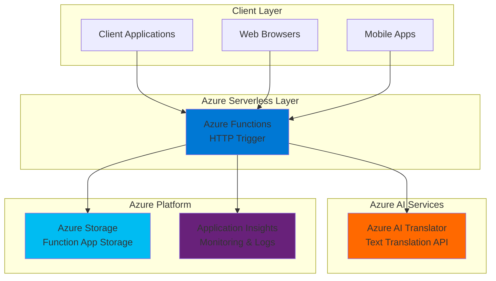

# Simple Text Translation with Functions and Translator

## Problem

Small businesses expanding globally need cost-effective translation capabilities for customer communications but lack the infrastructure to deploy complex translation systems. Manual translation is time-consuming and expensive, while existing solutions require significant upfront investment and technical expertise. Without automated translation, businesses miss opportunities for international growth and customer engagement.

## Solution

Create a serverless HTTP API using Azure Functions that integrates with Azure AI Translator to provide instant text translation between multiple languages. This solution offers pay-per-use pricing, automatic scaling, and requires minimal infrastructure management, making it perfect for businesses of all sizes needing on-demand translation capabilities.

## Architecture Diagram



## Prerequisites

1. Azure account with active subscription ([Create free account](https://azure.microsoft.com/free/))
2. Azure CLI installed and configured or Azure Cloud Shell access
3. Basic understanding of REST APIs and HTTP requests
4. Text editor or HTTP testing tool (curl, Postman, or similar)
5. Estimated cost: $0.01-$0.10 USD for this tutorial (Functions: ~$0.01, Translator: ~$0.02-$0.08)

> **Note**: This tutorial uses Azure's pay-per-use model. Costs are minimal for testing but can scale based on usage.

## Preparation

```bash
# Set environment variables for Azure resources
export RESOURCE_GROUP="rg-translation-${RANDOM_SUFFIX}"
export LOCATION="eastus"
export SUBSCRIPTION_ID=$(az account show --query id --output tsv)

# Generate unique suffix for resource names
RANDOM_SUFFIX=$(openssl rand -hex 3)

# Create resource group
az group create \
    --name ${RESOURCE_GROUP} \
    --location ${LOCATION} \
    --tags purpose=recipe environment=demo

echo "✅ Resource group created: ${RESOURCE_GROUP}"

# Set additional environment variables
export TRANSLATOR_NAME="translator-${RANDOM_SUFFIX}"
export FUNCTION_APP_NAME="translate-func-${RANDOM_SUFFIX}"
export STORAGE_ACCOUNT_NAME="storage${RANDOM_SUFFIX}"
```

## Steps

1. **Create Azure AI Translator Service**:

   Azure AI Translator provides powerful text translation capabilities across 100+ languages with support for real-time translation, language detection, and transliteration. The service uses advanced neural machine translation technology to deliver high-quality, contextually accurate translations suitable for business communications.

   ```bash
   # Create Azure AI Translator resource
   az cognitiveservices account create \
       --name ${TRANSLATOR_NAME} \
       --resource-group ${RESOURCE_GROUP} \
       --location ${LOCATION} \
       --kind TextTranslation \
       --sku F0 \
       --yes
   
   # Get the translator endpoint and key
   export TRANSLATOR_ENDPOINT=$(az cognitiveservices account show \
       --name ${TRANSLATOR_NAME} \
       --resource-group ${RESOURCE_GROUP} \
       --query properties.endpoint \
       --output tsv)
   
   export TRANSLATOR_KEY=$(az cognitiveservices account keys list \
       --name ${TRANSLATOR_NAME} \
       --resource-group ${RESOURCE_GROUP} \
       --query key1 \
       --output tsv)
   
   echo "✅ Translator service created with endpoint: ${TRANSLATOR_ENDPOINT}"
   ```

   The F0 (free) tier provides 2 million characters per month at no cost, perfect for development and small-scale production use. The service automatically detects source languages and supports batch translation for efficiency.

2. **Create Storage Account for Function App**:

   Azure Functions requires a storage account for triggers, logging, and managing function execution state. This storage account provides the foundation for serverless execution with built-in monitoring and debugging capabilities.

   ```bash
   # Create storage account for Function App
   az storage account create \
       --name ${STORAGE_ACCOUNT_NAME} \
       --resource-group ${RESOURCE_GROUP} \
       --location ${LOCATION} \
       --sku Standard_LRS \
       --kind StorageV2
   
   echo "✅ Storage account created: ${STORAGE_ACCOUNT_NAME}"
   ```

   The storage account enables Azure Functions to store code packages, logs, and temporary data while maintaining high availability and performance for serverless execution.

3. **Create Function App with Consumption Plan**:

   Azure Functions Consumption Plan provides true serverless execution with automatic scaling and pay-per-execution billing. The plan handles scaling from zero to thousands of concurrent executions based on incoming requests, eliminating the need for capacity planning.

   ```bash
   # Create Function App
   az functionapp create \
       --resource-group ${RESOURCE_GROUP} \
       --consumption-plan-location ${LOCATION} \
       --runtime node \
       --runtime-version 20 \
       --functions-version 4 \
       --name ${FUNCTION_APP_NAME} \
       --storage-account ${STORAGE_ACCOUNT_NAME} \
       --disable-app-insights false
   
   echo "✅ Function App created: ${FUNCTION_APP_NAME}"
   ```

   The Function App is configured with Node.js 20 runtime and Application Insights for comprehensive monitoring. The Consumption Plan ensures you only pay for actual execution time and memory usage.

4. **Configure Function App Settings**:

   Application settings in Azure Functions act as environment variables, allowing secure configuration of connection strings and API keys. These settings are encrypted at rest and available to all functions within the app.

   ```bash
   # Configure application settings for the Function App
   az functionapp config appsettings set \
       --name ${FUNCTION_APP_NAME} \
       --resource-group ${RESOURCE_GROUP} \
       --settings \
           "TRANSLATOR_ENDPOINT=${TRANSLATOR_ENDPOINT}" \
           "TRANSLATOR_KEY=${TRANSLATOR_KEY}" \
           "WEBSITE_NODE_DEFAULT_VERSION=~20"
   
   echo "✅ Function App configured with Translator settings"
   ```

   Application settings provide a secure way to manage configuration without hardcoding sensitive values in your function code. These settings are accessible via `process.env` in Node.js functions.

5. **Create Translation Function Code**:

   Create the HTTP-triggered function that will handle translation requests. This function accepts POST requests with JSON payloads containing text and target language, then returns translated results.

   ```bash
   # Create temporary directory for function code
   mkdir -p /tmp/translation-function
   cd /tmp/translation-function
   
   # Create function.json configuration
   cat > function.json << 'EOF'
   {
     "bindings": [
       {
         "authLevel": "function",
         "type": "httpTrigger",
         "direction": "in",
         "name": "req",
         "methods": ["post"]
       },
       {
         "type": "http",
         "direction": "out",
         "name": "res"
       }
     ]
   }
   EOF
   
   # Create index.js with translation logic
   cat > index.js << 'EOF'
   const https = require('https');
   
   module.exports = async function (context, req) {
       context.log('Translation function processed a request.');
   
       // Validate request body
       if (!req.body || !req.body.text || !req.body.to) {
           context.res = {
               status: 400,
               body: { 
                   error: "Please provide 'text' and 'to' language in request body",
                   example: { text: "Hello world", to: "es" }
               }
           };
           return;
       }
   
       const { text, to, from } = req.body;
       const translatorKey = process.env.TRANSLATOR_KEY;
       const translatorEndpoint = process.env.TRANSLATOR_ENDPOINT;
   
       try {
           // Prepare translation request
           const path = `/translate?api-version=3.0&to=${to}${from ? `&from=${from}` : ''}`;
           const requestBody = JSON.stringify([{ text: text }]);
   
           const options = {
               method: 'POST',
               hostname: 'api.cognitive.microsofttranslator.com',
               path: path,
               headers: {
                   'Ocp-Apim-Subscription-Key': translatorKey,
                   'Content-Type': 'application/json',
                   'Content-Length': Buffer.byteLength(requestBody)
               }
           };
   
           // Make translation request
           const translation = await new Promise((resolve, reject) => {
               const req = https.request(options, (res) => {
                   let data = '';
                   res.on('data', (chunk) => data += chunk);
                   res.on('end', () => {
                       try {
                           resolve(JSON.parse(data));
                       } catch (error) {
                           reject(new Error('Failed to parse translation response'));
                       }
                   });
               });
   
               req.on('error', reject);
               req.write(requestBody);
               req.end();
           });
   
           // Return successful translation
           context.res = {
               status: 200,
               body: {
                   original: text,
                   translated: translation[0].translations[0].text,
                   from: translation[0].detectedLanguage?.language || from,
                   to: to,
                   confidence: translation[0].detectedLanguage?.score
               }
           };
   
       } catch (error) {
           context.log.error('Translation error:', error);
           context.res = {
               status: 500,
               body: { error: 'Translation service unavailable' }
           };
       }
   };
   EOF
   
   echo "✅ Function code created"
   ```

   This function implements robust error handling, input validation, and provides detailed response information including confidence scores for language detection.

6. **Deploy Function Code**:

   Deploy the function code to Azure using a ZIP deployment. This approach packages the function files and uploads them to the Function App for immediate execution.

   ```bash
   # Create deployment package
   zip -r function.zip .
   
   # Deploy to Function App
   az functionapp deployment source config-zip \
       --resource-group ${RESOURCE_GROUP} \
       --name ${FUNCTION_APP_NAME} \
       --src function.zip
   
   # Wait for deployment to complete
   sleep 30
   
   echo "✅ Function deployed successfully"
   ```

   The ZIP deployment method ensures all function files are packaged together and deployed atomically, providing reliable deployment for serverless functions.

7. **Get Function URL and Test Access**:

   Retrieve the function URL with authentication key to enable secure access to the translation endpoint. Function-level authentication provides basic security for API access.

   ```bash
   # Get function URL with access key
   export FUNCTION_URL=$(az functionapp function show \
       --resource-group ${RESOURCE_GROUP} \
       --name ${FUNCTION_APP_NAME} \
       --function-name index \
       --query invokeUrlTemplate \
       --output tsv)
   
   export FUNCTION_KEY=$(az functionapp keys list \
       --resource-group ${RESOURCE_GROUP} \
       --name ${FUNCTION_APP_NAME} \
       --query functionKeys.default \
       --output tsv)
   
   echo "✅ Function URL: ${FUNCTION_URL}?code=${FUNCTION_KEY}"
   ```

   The function URL includes an access key that provides secure access to the API without requiring complex authentication systems.

## Validation & Testing

1. **Test Basic Translation**:

   ```bash
   # Test English to Spanish translation
   curl -X POST "${FUNCTION_URL}?code=${FUNCTION_KEY}" \
       -H "Content-Type: application/json" \
       -d '{
           "text": "Hello, how are you today?",
           "to": "es"
       }'
   ```

   Expected output:
   ```json
   {
     "original": "Hello, how are you today?",
     "translated": "Hola, ¿cómo estás hoy?",
     "from": "en",
     "to": "es",
     "confidence": 1.0
   }
   ```

2. **Test Multiple Language Translation**:

   ```bash
   # Test English to French
   curl -X POST "${FUNCTION_URL}?code=${FUNCTION_KEY}" \
       -H "Content-Type: application/json" \
       -d '{
           "text": "Welcome to our global marketplace",
           "to": "fr"
       }'
   
   # Test with source language specified
   curl -X POST "${FUNCTION_URL}?code=${FUNCTION_KEY}" \
       -H "Content-Type: application/json" \
       -d '{
           "text": "Guten Tag",
           "from": "de",
           "to": "en"
       }'
   ```

3. **Test Error Handling**:

   ```bash
   # Test invalid request
   curl -X POST "${FUNCTION_URL}?code=${FUNCTION_KEY}" \
       -H "Content-Type: application/json" \
       -d '{
           "invalid": "request"
       }'
   ```

   Expected output:
   ```json
   {
     "error": "Please provide 'text' and 'to' language in request body",
     "example": { "text": "Hello world", "to": "es" }
   }
   ```

## Cleanup

1. **Remove Function App and Associated Resources**:

   ```bash
   # Delete the Function App
   az functionapp delete \
       --name ${FUNCTION_APP_NAME} \
       --resource-group ${RESOURCE_GROUP}
   
   echo "✅ Function App deleted"
   ```

2. **Remove Translator Service**:

   ```bash
   # Delete Translator service
   az cognitiveservices account delete \
       --name ${TRANSLATOR_NAME} \
       --resource-group ${RESOURCE_GROUP}
   
   echo "✅ Translator service deleted"
   ```

3. **Remove Storage Account**:

   ```bash
   # Delete storage account
   az storage account delete \
       --name ${STORAGE_ACCOUNT_NAME} \
       --resource-group ${RESOURCE_GROUP} \
       --yes
   
   echo "✅ Storage account deleted"
   ```

4. **Remove Resource Group**:

   ```bash
   # Delete resource group and all remaining resources
   az group delete \
       --name ${RESOURCE_GROUP} \
       --yes \
       --no-wait
   
   echo "✅ Resource group deletion initiated: ${RESOURCE_GROUP}"
   echo "Note: Deletion may take several minutes to complete"
   
   # Clean up environment variables
   unset RESOURCE_GROUP LOCATION SUBSCRIPTION_ID RANDOM_SUFFIX
   unset TRANSLATOR_NAME FUNCTION_APP_NAME STORAGE_ACCOUNT_NAME
   unset TRANSLATOR_ENDPOINT TRANSLATOR_KEY FUNCTION_URL FUNCTION_KEY
   ```

## Discussion

This serverless translation solution demonstrates the power of Azure's pay-per-use model for building scalable APIs without infrastructure management. Azure Functions automatically handles scaling, load balancing, and availability, while Azure AI Translator provides enterprise-grade translation capabilities with support for over 100 languages. The combination creates a robust, cost-effective solution that scales from prototype to production.

The Consumption Plan billing model means you only pay for actual function executions and translator API calls, making this solution highly cost-effective for variable workloads. For applications with consistent traffic, consider the Premium Plan which offers predictable billing and eliminates cold start delays through pre-warmed instances.

Security considerations include using Azure Key Vault for storing sensitive credentials, implementing proper authentication mechanisms beyond function keys, and adding request rate limiting to prevent abuse. The current implementation uses function-level authentication suitable for development and testing scenarios.

For production deployments, consider implementing comprehensive monitoring with Application Insights, adding input sanitization and content filtering, and implementing caching strategies to reduce translation API costs. The [Azure Functions best practices guide](https://docs.microsoft.com/en-us/azure/azure-functions/functions-best-practices) provides detailed recommendations for production workloads.

> **Tip**: Use Application Insights to monitor function performance and translation API usage patterns to optimize costs and identify potential bottlenecks in your translation workflow.

## Challenge

Extend this solution by implementing these enhancements:

1. **Add batch translation support** - Modify the function to accept arrays of text for efficient bulk translation, reducing API calls and improving performance
2. **Implement caching with Azure Redis Cache** - Store frequently translated phrases to reduce Translator API costs and improve response times
3. **Add language detection endpoint** - Create a separate function that only detects input language without performing translation
4. **Integrate with Azure API Management** - Add rate limiting, authentication, and API versioning for production-ready deployment
5. **Create a simple web interface** - Build a static HTML page hosted in Azure Storage that provides a user-friendly translation interface

## Infrastructure Code

### Available Infrastructure as Code:

- [Infrastructure Code Overview](code/README.md) - Detailed description of all infrastructure components
- [Bicep](code/bicep/) - Azure Bicep templates
- [Bash CLI Scripts](code/scripts/) - Example bash scripts using Azure CLI commands to deploy infrastructure
- [Terraform](code/terraform/) - Terraform configuration files