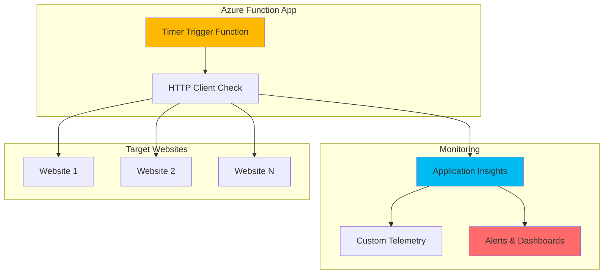

# Simple Website Uptime Checker with Functions and Application Insights

## Problem

Organizations need to monitor their website availability but often lack simple, cost-effective monitoring solutions. Manual checking is unreliable and doesn't provide historical data or alerting capabilities. Many businesses experience revenue loss and customer frustration when websites go down undetected, requiring an automated monitoring system that can quickly identify outages and provide detailed analytics.

## Solution

Create an automated uptime monitoring system using Azure Functions with timer triggers to periodically check website availability, and Application Insights to collect telemetry data and provide monitoring dashboards. This serverless approach provides cost-effective, scalable monitoring with built-in alerting capabilities and requires minimal infrastructure management.

## Architecture Diagram



## Prerequisites

1. Azure account with appropriate permissions to create Function Apps and Application Insights
2. Azure CLI installed and configured (or Azure Cloud Shell)
3. Basic understanding of HTTP requests and status codes
4. One or more websites to monitor (can use public websites for testing)
5. Estimated cost: $0.01-$0.50 per day for basic monitoring (first 1 million requests free monthly)

> **Note**: This solution follows Azure Well-Architected Framework principles for serverless monitoring. The consumption plan provides automatic scaling and pay-per-execution pricing.

## Preparation

```bash
# Generate unique suffix for resource names
RANDOM_SUFFIX=$(openssl rand -hex 3)

# Set environment variables for Azure resources
export RESOURCE_GROUP="rg-uptime-checker-${RANDOM_SUFFIX}"
export LOCATION="eastus"
export FUNCTION_APP_NAME="func-uptime-${RANDOM_SUFFIX}"
export STORAGE_ACCOUNT="stg${RANDOM_SUFFIX}"
export APP_INSIGHTS_NAME="ai-uptime-${RANDOM_SUFFIX}"
export SUBSCRIPTION_ID=$(az account show --query id --output tsv)

# Create resource group
az group create \
    --name ${RESOURCE_GROUP} \
    --location ${LOCATION} \
    --tags purpose=uptime-monitoring environment=demo

echo "✅ Resource group created: ${RESOURCE_GROUP}"

# Create storage account for Function App
az storage account create \
    --name ${STORAGE_ACCOUNT} \
    --resource-group ${RESOURCE_GROUP} \
    --location ${LOCATION} \
    --sku Standard_LRS \
    --kind StorageV2

echo "✅ Storage account created: ${STORAGE_ACCOUNT}"
```

## Steps

1. **Create Application Insights Instance**:

   Application Insights provides comprehensive application performance monitoring and analytics capabilities for Azure Functions. It automatically collects telemetry about function executions, dependencies, and custom events, enabling detailed monitoring of the uptime checking service with built-in dashboards and alerting capabilities.

   ```bash
   # Create Application Insights resource
   az monitor app-insights component create \
       --app ${APP_INSIGHTS_NAME} \
       --location ${LOCATION} \
       --resource-group ${RESOURCE_GROUP} \
       --application-type web \
       --kind web
   
   # Get Application Insights connection string
   export AI_CONNECTION_STRING=$(az monitor app-insights component show \
       --app ${APP_INSIGHTS_NAME} \
       --resource-group ${RESOURCE_GROUP} \
       --query connectionString --output tsv)
   
   echo "✅ Application Insights created with connection string"
   ```

   The Application Insights instance is now ready to collect telemetry data from the Function App. This provides the foundation for monitoring website uptime with detailed analytics, custom dashboards, and proactive alerting when issues are detected.

2. **Create Function App with Application Insights Integration**:

   Azure Functions provides serverless compute that automatically scales based on demand and integrates seamlessly with Application Insights for monitoring. The consumption plan offers cost-effective execution with pay-per-use pricing, making it ideal for periodic uptime checks without maintaining dedicated infrastructure.

   ```bash
   # Create Function App
   az functionapp create \
       --name ${FUNCTION_APP_NAME} \
       --storage-account ${STORAGE_ACCOUNT} \
       --resource-group ${RESOURCE_GROUP} \
       --consumption-plan-location ${LOCATION} \
       --runtime node \
       --runtime-version 18 \
       --functions-version 4 \
       --app-insights ${APP_INSIGHTS_NAME}
   
   # Configure Application Insights connection
   az functionapp config appsettings set \
       --name ${FUNCTION_APP_NAME} \
       --resource-group ${RESOURCE_GROUP} \
       --settings "APPLICATIONINSIGHTS_CONNECTION_STRING=${AI_CONNECTION_STRING}"
   
   echo "✅ Function App created and connected to Application Insights"
   ```

   The Function App is now configured with automatic Application Insights integration, providing comprehensive monitoring of function executions, performance metrics, and custom telemetry data for the uptime checking operations.

3. **Deploy Timer-Triggered Function for Uptime Checking**:

   Timer triggers in Azure Functions use CRON expressions to execute functions on defined schedules. This serverless approach eliminates the need for dedicated servers or scheduled tasks, providing reliable execution with automatic retry capabilities and built-in monitoring through Application Insights integration.

   ```bash
   # Create function project directory
   mkdir uptime-function && cd uptime-function
   
   # Initialize Function App project
   echo '{
     "version": "2.0",
     "extensionBundle": {
       "id": "Microsoft.Azure.Functions.ExtensionBundle",
       "version": "[3.*, 4.0.0)"
     },
     "functionTimeout": "00:05:00"
   }' > host.json
   
   # Create function configuration
   mkdir UptimeChecker
   echo '{
     "bindings": [
       {
         "name": "timer",
         "type": "timerTrigger",
         "direction": "in",
         "schedule": "0 */5 * * * *"
       }
     ]
   }' > UptimeChecker/function.json
   
   echo "✅ Function project structure created"
   ```

   The timer trigger is configured to run every 5 minutes using the CRON expression "0 */5 * * * *". This provides regular monitoring intervals while maintaining cost efficiency and avoiding excessive API calls to monitored websites.

4. **Create Uptime Monitoring Function Code**:

   The function logic implements HTTP health checks with comprehensive error handling and custom telemetry logging to Application Insights. This approach provides detailed monitoring data including response times, status codes, and failure analysis for effective website availability tracking.

   ```bash
   # Create the uptime checking function
   cat > UptimeChecker/index.js << 'EOF'
   const https = require('https');
   const http = require('http');
   const { URL } = require('url');
   
   // Websites to monitor - add your URLs here
   const WEBSITES = [
       'https://www.microsoft.com',
       'https://azure.microsoft.com',
       'https://github.com'
   ];
   
   module.exports = async function (context, timer) {
       context.log('Uptime checker function started');
       
       const results = [];
       
       for (const website of WEBSITES) {
           try {
               const result = await checkWebsite(website, context);
               results.push(result);
               
               // Log to Application Insights
               context.log(`✅ ${website}: ${result.status} (${result.responseTime}ms)`);
               
           } catch (error) {
               const failureResult = {
                   url: website,
                   status: 'ERROR',
                   responseTime: 0,
                   statusCode: 0,
                   error: error.message,
                   timestamp: new Date().toISOString()
               };
               
               results.push(failureResult);
               context.log(`❌ ${website}: ${error.message}`);
           }
       }
       
       // Send summary to Application Insights
       const summary = {
           totalChecks: results.length,
           successfulChecks: results.filter(r => r.status === 'UP').length,
           failedChecks: results.filter(r => r.status !== 'UP').length,
           averageResponseTime: results
               .filter(r => r.responseTime > 0)
               .reduce((sum, r) => sum + r.responseTime, 0) / 
               Math.max(1, results.filter(r => r.responseTime > 0).length)
       };
       
       context.log('Uptime check summary:', JSON.stringify(summary));
   };
   
   async function checkWebsite(url, context) {
       return new Promise((resolve, reject) => {
           const startTime = Date.now();
           const urlObj = new URL(url);
           const client = urlObj.protocol === 'https:' ? https : http;
           
           const request = client.get(url, { timeout: 10000 }, (response) => {
               const responseTime = Date.now() - startTime;
               const status = response.statusCode >= 200 && response.statusCode < 300 ? 'UP' : 'DOWN';
               
               resolve({
                   url: url,
                   status: status,
                   responseTime: responseTime,
                   statusCode: response.statusCode,
                   timestamp: new Date().toISOString()
               });
           });
           
           request.on('timeout', () => {
               request.destroy();
               reject(new Error('Request timeout'));
           });
           
           request.on('error', (error) => {
               reject(error);
           });
       });
   }
   EOF
   
   echo "✅ Uptime monitoring function code created"
   ```

   The function implements robust HTTP checking with timeout handling, status code validation, and comprehensive telemetry logging. Each check captures response time, status codes, and error details, providing complete visibility into website availability and performance.

5. **Deploy Function to Azure**:

   Azure Functions deployment uses ZIP deployment for efficient code updates and maintains function app configuration. The deployment process automatically installs dependencies and configures the runtime environment for immediate execution of the uptime monitoring service.

   ```bash
   # Create package.json for dependencies
   echo '{
     "name": "uptime-checker",
     "version": "1.0.0",
     "description": "Simple website uptime checker",
     "main": "index.js",
     "dependencies": {}
   }' > package.json
   
   # Create deployment package
   zip -r uptime-function.zip . -x "*.git*" "*.DS_Store*"
   
   # Deploy function to Azure
   az functionapp deployment source config-zip \
       --resource-group ${RESOURCE_GROUP} \
       --name ${FUNCTION_APP_NAME} \
       --src uptime-function.zip
   
   # Verify function deployment
   az functionapp function show \
       --function-name UptimeChecker \
       --name ${FUNCTION_APP_NAME} \
       --resource-group ${RESOURCE_GROUP} \
       --query "name" --output tsv
   
   echo "✅ Function deployed and ready for monitoring"
   ```

   The function is now deployed and will begin executing every 5 minutes according to the timer trigger schedule. Each execution will check the configured websites and send telemetry data to Application Insights for monitoring and analysis.

6. **Configure Application Insights Log-Based Alerts**:

   Application Insights alerts provide proactive monitoring capabilities by automatically detecting failures and performance issues. Setting up log-based alerts ensures immediate notification when websites become unavailable, enabling rapid response to outages and minimizing business impact from website downtime.

   ```bash
   # Create alert rule for failed uptime checks using scheduled query
   az monitor scheduled-query create \
       --name "Website-Down-Alert" \
       --resource-group ${RESOURCE_GROUP} \
       --scopes "/subscriptions/${SUBSCRIPTION_ID}/resourceGroups/${RESOURCE_GROUP}/providers/Microsoft.Insights/components/${APP_INSIGHTS_NAME}" \
       --condition "count 'traces | where message contains \"❌\"' > 0" \
       --condition-query "traces | where timestamp > ago(10m) | where message contains \"❌\" | summarize count()" \
       --description "Alert when websites are detected as down" \
       --evaluation-frequency 5m \
       --window-size 10m \
       --severity 2
   
   # Create action group for notifications
   az monitor action-group create \
       --name "uptime-alerts" \
       --resource-group ${RESOURCE_GROUP} \
       --short-name "uptime"
   
   echo "✅ Application Insights log-based alerts configured"
   ```

   Alert rules are now configured to monitor function execution logs and detect website failures. The alerts will trigger when error conditions are met, providing automated notification of uptime issues through Azure Monitor's alerting system.

## Validation & Testing

1. **Verify Function App is running correctly**:

   ```bash
   # Check Function App status
   az functionapp show \
       --name ${FUNCTION_APP_NAME} \
       --resource-group ${RESOURCE_GROUP} \
       --query "{name:name,state:state,enabled:enabled}" \
       --output table
   ```

   Expected output: Function App should show as "Running" and "true" for enabled status.

2. **Test function execution manually**:

   ```bash
   # Trigger function manually for immediate testing
   az rest \
       --method post \
       --url "https://${FUNCTION_APP_NAME}.azurewebsites.net/admin/functions/UptimeChecker" \
       --headers "Content-Type=application/json" \
       --body "{}"
   
   # Check function logs
   az monitor app-insights query \
       --app ${APP_INSIGHTS_NAME} \
       --resource-group ${RESOURCE_GROUP} \
       --analytics-query "traces | where timestamp > ago(5m) | order by timestamp desc | limit 5"
   ```

   Expected output: Function should execute successfully and display uptime check results in the logs.

3. **Verify Application Insights data collection**:

   ```bash
   # Check Application Insights data
   az monitor app-insights query \
       --app ${APP_INSIGHTS_NAME} \
       --resource-group ${RESOURCE_GROUP} \
       --analytics-query "traces | where timestamp > ago(1h) | order by timestamp desc | limit 10"
   ```

   Expected output: Should display recent function execution logs with uptime check results.

4. **Test alerting configuration**:

   ```bash
   # Verify alert rules
   az monitor scheduled-query list \
       --resource-group ${RESOURCE_GROUP} \
       --output table
   ```

   Expected output: Should show the configured alert rule for website monitoring.

## Cleanup

1. **Remove Application Insights alerts**:

   ```bash
   # Delete alert rules
   az monitor scheduled-query delete \
       --name "Website-Down-Alert" \
       --resource-group ${RESOURCE_GROUP} \
       --yes
   
   # Delete action group
   az monitor action-group delete \
       --name "uptime-alerts" \
       --resource-group ${RESOURCE_GROUP} \
       --yes
   
   echo "✅ Alerts and action groups deleted"
   ```

2. **Remove Function App and associated resources**:

   ```bash
   # Delete Function App
   az functionapp delete \
       --name ${FUNCTION_APP_NAME} \
       --resource-group ${RESOURCE_GROUP}
   
   # Delete Application Insights
   az monitor app-insights component delete \
       --app ${APP_INSIGHTS_NAME} \
       --resource-group ${RESOURCE_GROUP}
   
   echo "✅ Function App and Application Insights deleted"
   ```

3. **Remove resource group and all remaining resources**:

   ```bash
   # Delete resource group and all contained resources
   az group delete \
       --name ${RESOURCE_GROUP} \
       --yes \
       --no-wait
   
   echo "✅ Resource group deletion initiated: ${RESOURCE_GROUP}"
   echo "Note: Deletion may take several minutes to complete"
   
   # Clean up local files
   cd .. && rm -rf uptime-function
   ```

## Discussion

This solution demonstrates how Azure Functions and Application Insights work together to create a cost-effective, serverless monitoring system for website uptime tracking. The timer trigger pattern provides reliable scheduling without requiring dedicated infrastructure, while the consumption pricing model ensures you only pay for actual execution time. Azure Functions automatically handles scaling, retries, and infrastructure management, making this approach ideal for lightweight monitoring tasks following [Azure Well-Architected Framework](https://docs.microsoft.com/en-us/azure/architecture/framework/) principles.

The integration with Application Insights provides comprehensive observability beyond basic uptime checking. The service automatically collects function performance metrics, dependency tracking, and custom telemetry data, enabling detailed analysis of both the monitoring system itself and the websites being monitored. This telemetry data supports advanced scenarios like trend analysis, performance benchmarking, and capacity planning for the monitored websites.

From a cost optimization perspective, this solution typically costs less than $0.50 per day for monitoring multiple websites every 5 minutes, making it extremely cost-effective compared to dedicated monitoring services. The serverless architecture eliminates operational overhead while providing enterprise-grade reliability and monitoring capabilities. The solution can easily scale to monitor hundreds of websites by simply adding URLs to the configuration array.

For production deployments, consider implementing additional features such as geographic distribution using multiple Azure regions, more sophisticated health check logic including custom headers and authentication, and integration with Azure Logic Apps for advanced notification workflows. The foundation provided here can be extended to support complex monitoring scenarios while maintaining the simplicity and cost-effectiveness of the serverless approach described in the [Azure Functions documentation](https://docs.microsoft.com/en-us/azure/azure-functions/).

> **Tip**: Use Application Insights Live Metrics Stream to monitor function executions in real-time during development and troubleshooting. This provides immediate feedback on function performance and helps identify issues quickly.

## Challenge

Extend this solution by implementing these enhancements:

1. **Advanced Health Checks**: Add support for POST requests, custom headers, authentication tokens, and response content validation to monitor API endpoints and authenticated services.

2. **Multi-Region Monitoring**: Deploy the same function to multiple Azure regions to check website availability from different geographic locations and detect regional outages.

3. **Custom Dashboards**: Create Power BI or Azure Dashboard visualizations using Application Insights data to display uptime statistics, response time trends, and availability SLA reporting.

4. **Slack/Teams Integration**: Use Azure Logic Apps to send formatted notifications to Slack or Microsoft Teams channels when websites go down, including response time trends and historical availability data.

5. **Database Integration**: Store uptime results in Azure Cosmos DB or Azure SQL Database for long-term trend analysis and to create custom reporting beyond Application Insights retention limits.

## Infrastructure Code

*Infrastructure code will be generated after recipe approval.*