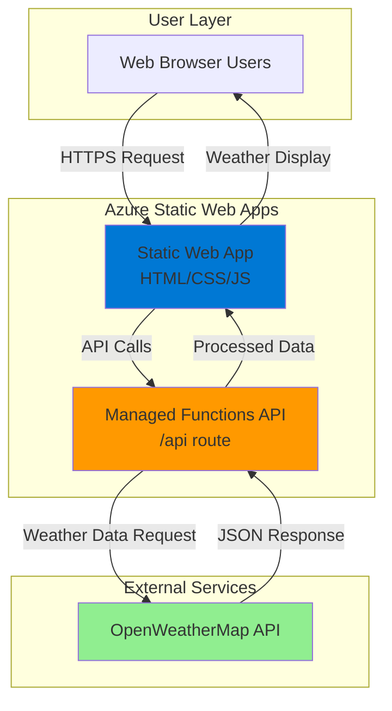

# Simple Weather Dashboard with Functions and Static Web Apps

## Problem

Small businesses and hobbyist developers need a quick way to display current weather information on their websites without complex infrastructure setup or expensive hosting solutions. Traditional approaches require managing web servers, databases, and API keys securely, leading to increased complexity and operational overhead that discourages rapid prototyping and deployment.

## Solution

Create a serverless weather dashboard using Azure Functions to securely fetch weather data from external APIs and Azure Static Web Apps to host a responsive frontend. This architecture leverages Azure's managed services to provide automatic scaling, built-in security, and seamless integration without infrastructure management concerns.

## Architecture Diagram



## Prerequisites

1. Azure account with active subscription and contributor permissions
2. Azure CLI installed and configured (version 2.50 or later)
3. Node.js 18.x or later installed locally
4. Basic knowledge of HTML, JavaScript, and REST APIs
5. Free OpenWeatherMap API key (register at openweathermap.org)
6. Estimated cost: $0-2 per month (Free tier available for Static Web Apps and Functions)

> **Note**: Azure Static Web Apps provides generous free tiers with 100GB bandwidth and managed Functions API integration at no additional cost.

## Preparation

```bash
# Generate unique suffix for resource names first
RANDOM_SUFFIX=$(openssl rand -hex 3)

# Set environment variables for Azure resources
export RESOURCE_GROUP="rg-weather-dashboard-${RANDOM_SUFFIX}"
export LOCATION="eastus"
export SUBSCRIPTION_ID=$(az account show --query id --output tsv)
export WEATHER_APP_NAME="weather-app-${RANDOM_SUFFIX}"

# Create resource group for all resources
az group create \
    --name ${RESOURCE_GROUP} \
    --location ${LOCATION} \
    --tags purpose=recipe environment=demo

echo "✅ Resource group created: ${RESOURCE_GROUP}"

# Create local project directory structure
mkdir -p weather-dashboard/{src,api}
cd weather-dashboard

echo "✅ Project structure created"
```

## Steps

1. **Create the Static Web App with integrated Functions**:

   Azure Static Web Apps provides a fully managed hosting solution that combines static content delivery with serverless API capabilities. The service automatically integrates with Azure Functions to provide secure, scalable backend APIs without requiring separate resource management or complex CORS configurations.

   ```bash
   # Create Static Web App without GitHub integration for simplicity
   az staticwebapp create \
       --name ${WEATHER_APP_NAME} \
       --resource-group ${RESOURCE_GROUP} \
       --location ${LOCATION} \
       --app-location "/src" \
       --api-location "/api" \
       --output-location "" \
       --sku Free
   
   # Get the Static Web App URL for later use
   export SWA_URL=$(az staticwebapp show \
       --name ${WEATHER_APP_NAME} \
       --resource-group ${RESOURCE_GROUP} \
       --query "defaultHostname" -o tsv)
   
   echo "✅ Static Web App created: https://${SWA_URL}"
   ```

   The Static Web App is now provisioned with automatic SSL certificates, global CDN distribution, and integrated Functions API support, providing the foundation for our weather dashboard.

2. **Create the Functions package configuration**:

   Azure Functions requires proper Node.js configuration for dependency management and runtime behavior. Creating a package.json file ensures consistent dependency resolution and enables proper local development and cloud deployment workflows.

   ```bash
   # Create package.json for the Functions API
   cat > api/package.json << 'EOF'
{
  "name": "weather-api",
  "version": "1.0.0",
  "description": "Weather API for Static Web App",
  "main": "index.js",
  "scripts": {
    "start": "func start",
    "test": "echo \"Error: no test specified\" && exit 1"
  },
  "dependencies": {
    "@azure/functions": "^4.0.0"
  },
  "devDependencies": {
    "azure-functions-core-tools": "^4.0.5000"
  },
  "engines": {
    "node": ">=18.0.0"
  }
}
EOF
   
   echo "✅ Package configuration created"
   ```

3. **Create the weather API Function with modern syntax**:

   Azure Functions with HTTP triggers provide serverless API endpoints that scale automatically based on demand. This approach eliminates the need for infrastructure management while providing secure API key handling and data processing capabilities for external weather service integration.

   ```bash
   # Create the weather API function with modern JavaScript patterns
   cat > api/weather.js << 'EOF'
const { app } = require('@azure/functions');

async function weatherHandler(request, context) {
    context.log('Weather API function triggered');

    try {
        // Get location from query parameters or default to New York
        const city = request.query.get('city') || 'New York';
        const apiKey = process.env.OPENWEATHER_API_KEY;

        if (!apiKey) {
            return {
                status: 500,
                jsonBody: { error: 'Weather API key not configured' }
            };
        }

        // Fetch weather data from OpenWeatherMap API
        const weatherUrl = `https://api.openweathermap.org/data/2.5/weather?q=${encodeURIComponent(city)}&appid=${apiKey}&units=metric`;
        const response = await fetch(weatherUrl);
        const data = await response.json();

        if (!response.ok) {
            return {
                status: 404,
                jsonBody: { error: 'City not found or API error' }
            };
        }

        // Process and return weather data
        const weatherInfo = {
            city: data.name,
            country: data.sys.country,
            temperature: Math.round(data.main.temp),
            description: data.weather[0].description,
            icon: data.weather[0].icon,
            humidity: data.main.humidity,
            pressure: data.main.pressure,
            windSpeed: data.wind.speed,
            lastUpdated: new Date().toISOString()
        };

        return {
            status: 200,
            headers: {
                'Content-Type': 'application/json'
            },
            jsonBody: weatherInfo
        };

    } catch (error) {
        context.log.error('Weather API error:', error);
        return {
            status: 500,
            jsonBody: { error: 'Internal server error' }
        };
    }
}

app.http('weather', {
    methods: ['GET', 'POST'],
    authLevel: 'anonymous',
    handler: weatherHandler
});
EOF
   
   echo "✅ Weather API function created"
   ```

   The Function implements error handling, input validation, and data processing using the modern Azure Functions v4 programming model to provide a clean API interface for our frontend application.

4. **Create the Function runtime configuration**:

   ```bash
   # Create host.json for Functions runtime configuration
   cat > api/host.json << 'EOF'
{
  "version": "2.0",
  "functionTimeout": "00:00:30",
  "logging": {
    "applicationInsights": {
      "samplingSettings": {
        "isEnabled": true,
        "maxTelemetryItemsPerSecond": 20
      }
    }
  },
  "extensionBundle": {
    "id": "Microsoft.Azure.Functions.ExtensionBundle",
    "version": "[4.*, 5.0.0)"
  }
}
EOF
   
   echo "✅ Function configuration files created"
   ```

5. **Create the frontend HTML dashboard**:

   ```bash
   # Create the main HTML dashboard
   cat > src/index.html << 'EOF'
<!DOCTYPE html>
<html lang="en">
<head>
    <meta charset="UTF-8">
    <meta name="viewport" content="width=device-width, initial-scale=1.0">
    <title>Weather Dashboard</title>
    <link rel="stylesheet" href="styles.css">
</head>
<body>
    <div class="container">
        <h1>🌤️ Weather Dashboard</h1>
        
        <div class="search-section">
            <input type="text" id="cityInput" placeholder="Enter city name..." value="New York">
            <button id="searchBtn">Get Weather</button>
        </div>
        
        <div class="loading" id="loading" style="display: none;">
            <div class="spinner"></div>
            <p>Fetching weather data...</p>
        </div>
        
        <div class="weather-card" id="weatherCard" style="display: none;">
            <div class="weather-header">
                <h2 id="cityName">--</h2>
                <div class="weather-icon">
                    
                </div>
            </div>
            
            <div class="temperature">
                <span id="temperature">--</span>°C
            </div>
            
            <div class="description" id="description">--</div>
            
            <div class="weather-details">
                <div class="detail">
                    <span class="label">Humidity:</span>
                    <span id="humidity">--%</span>
                </div>
                <div class="detail">
                    <span class="label">Pressure:</span>
                    <span id="pressure">-- hPa</span>
                </div>
                <div class="detail">
                    <span class="label">Wind Speed:</span>
                    <span id="windSpeed">-- m/s</span>
                </div>
            </div>
            
            <div class="last-updated">
                Last updated: <span id="lastUpdated">--</span>
            </div>
        </div>
        
        <div class="error-message" id="errorMessage" style="display: none;">
            <p id="errorText">Error loading weather data</p>
        </div>
    </div>
    
    <script src="app.js"></script>
</body>
</html>
EOF
   
   echo "✅ HTML dashboard created"
   ```

6. **Create the CSS styling**:

   ```bash
   # Create modern, responsive CSS styles
   cat > src/styles.css << 'EOF'
* {
    margin: 0;
    padding: 0;
    box-sizing: border-box;
}

body {
    font-family: 'Segoe UI', Tahoma, Geneva, Verdana, sans-serif;
    background: linear-gradient(135deg, #667eea 0%, #764ba2 100%);
    min-height: 100vh;
    display: flex;
    align-items: center;
    justify-content: center;
    padding: 20px;
}

.container {
    background: rgba(255, 255, 255, 0.95);
    border-radius: 20px;
    padding: 2rem;
    box-shadow: 0 20px 40px rgba(0, 0, 0, 0.1);
    max-width: 400px;
    width: 100%;
    text-align: center;
}

h1 {
    color: #333;
    margin-bottom: 1.5rem;
    font-size: 2rem;
}

.search-section {
    margin-bottom: 2rem;
    display: flex;
    gap: 10px;
}

#cityInput {
    flex: 1;
    padding: 12px;
    border: 2px solid #e0e0e0;
    border-radius: 10px;
    font-size: 16px;
    outline: none;
    transition: border-color 0.3s;
}

#cityInput:focus {
    border-color: #667eea;
}

#searchBtn {
    padding: 12px 20px;
    background: #667eea;
    color: white;
    border: none;
    border-radius: 10px;
    cursor: pointer;
    font-size: 16px;
    transition: background 0.3s;
}

#searchBtn:hover {
    background: #5a6fd8;
}

.loading {
    margin: 2rem 0;
}

.spinner {
    width: 40px;
    height: 40px;
    border: 4px solid #f3f3f3;
    border-top: 4px solid #667eea;
    border-radius: 50%;
    animation: spin 1s linear infinite;
    margin: 0 auto 1rem;
}

@keyframes spin {
    0% { transform: rotate(0deg); }
    100% { transform: rotate(360deg); }
}

.weather-card {
    background: #f8f9ff;
    border-radius: 15px;
    padding: 1.5rem;
    margin: 1rem 0;
}

.weather-header {
    display: flex;
    justify-content: space-between;
    align-items: center;
    margin-bottom: 1rem;
}

#cityName {
    color: #333;
    font-size: 1.5rem;
}

.weather-icon img {
    width: 60px;
    height: 60px;
}

.temperature {
    font-size: 3rem;
    font-weight: bold;
    color: #667eea;
    margin: 1rem 0;
}

.description {
    font-size: 1.2rem;
    color: #666;
    margin-bottom: 1.5rem;
    text-transform: capitalize;
}

.weather-details {
    display: grid;
    grid-template-columns: 1fr;
    gap: 0.5rem;
}

.detail {
    display: flex;
    justify-content: space-between;
    padding: 0.5rem 0;
    border-bottom: 1px solid #e0e0e0;
}

.label {
    font-weight: 600;
    color: #555;
}

.last-updated {
    margin-top: 1rem;
    font-size: 0.8rem;
    color: #888;
}

.error-message {
    background: #ffebee;
    color: #c62828;
    padding: 1rem;
    border-radius: 10px;
    border: 1px solid #ffcdd2;
    margin: 1rem 0;
}

@media (max-width: 480px) {
    .container {
        padding: 1rem;
    }
    
    h1 {
        font-size: 1.5rem;
    }
    
    .temperature {
        font-size: 2.5rem;
    }
}
EOF
   
   echo "✅ CSS styles created"
   ```

7. **Create the JavaScript application logic**:

   ```bash
   # Create interactive JavaScript for weather dashboard
   cat > src/app.js << 'EOF'
class WeatherDashboard {
    constructor() {
        this.apiBaseUrl = '/api';
        this.initializeElements();
        this.bindEvents();
        this.loadInitialWeather();
    }

    initializeElements() {
        this.cityInput = document.getElementById('cityInput');
        this.searchBtn = document.getElementById('searchBtn');
        this.loading = document.getElementById('loading');
        this.weatherCard = document.getElementById('weatherCard');
        this.errorMessage = document.getElementById('errorMessage');
        
        // Weather display elements
        this.cityName = document.getElementById('cityName');
        this.weatherIcon = document.getElementById('weatherIcon');
        this.temperature = document.getElementById('temperature');
        this.description = document.getElementById('description');
        this.humidity = document.getElementById('humidity');
        this.pressure = document.getElementById('pressure');
        this.windSpeed = document.getElementById('windSpeed');
        this.lastUpdated = document.getElementById('lastUpdated');
    }

    bindEvents() {
        this.searchBtn.addEventListener('click', () => this.searchWeather());
        this.cityInput.addEventListener('keypress', (e) => {
            if (e.key === 'Enter') {
                this.searchWeather();
            }
        });
    }

    async loadInitialWeather() {
        await this.fetchWeather('New York');
    }

    async searchWeather() {
        const city = this.cityInput.value.trim();
        if (!city) {
            this.showError('Please enter a city name');
            return;
        }
        
        await this.fetchWeather(city);
    }

    async fetchWeather(city) {
        try {
            this.showLoading();
            
            const response = await fetch(`${this.apiBaseUrl}/weather?city=${encodeURIComponent(city)}`);
            const data = await response.json();
            
            if (!response.ok) {
                throw new Error(data.error || 'Failed to fetch weather data');
            }
            
            this.displayWeather(data);
        } catch (error) {
            console.error('Weather fetch error:', error);
            this.showError(error.message || 'Failed to load weather data');
        }
    }

    displayWeather(data) {
        // Update weather information
        this.cityName.textContent = `${data.city}, ${data.country}`;
        this.weatherIcon.src = `https://openweathermap.org/img/wn/${data.icon}@2x.png`;
        this.weatherIcon.alt = data.description;
        this.temperature.textContent = data.temperature;
        this.description.textContent = data.description;
        this.humidity.textContent = `${data.humidity}%`;
        this.pressure.textContent = `${data.pressure} hPa`;
        this.windSpeed.textContent = `${data.windSpeed} m/s`;
        
        // Format last updated time
        const lastUpdated = new Date(data.lastUpdated);
        this.lastUpdated.textContent = lastUpdated.toLocaleString();
        
        // Show weather card and hide other states
        this.hideAll();
        this.weatherCard.style.display = 'block';
    }

    showLoading() {
        this.hideAll();
        this.loading.style.display = 'block';
    }

    showError(message) {
        this.hideAll();
        document.getElementById('errorText').textContent = message;
        this.errorMessage.style.display = 'block';
    }

    hideAll() {
        this.loading.style.display = 'none';
        this.weatherCard.style.display = 'none';
        this.errorMessage.style.display = 'none';
    }
}

// Initialize the weather dashboard when DOM is loaded
document.addEventListener('DOMContentLoaded', () => {
    new WeatherDashboard();
});
EOF
   
   echo "✅ JavaScript application created"
   ```

8. **Configure the Static Web App settings**:

   ```bash
   # Add OpenWeather API key to Static Web App configuration
   read -p "Enter your OpenWeatherMap API key: " WEATHER_API_KEY
   
   az staticwebapp appsettings set \
       --name ${WEATHER_APP_NAME} \
       --resource-group ${RESOURCE_GROUP} \
       --setting-names OPENWEATHER_API_KEY="${WEATHER_API_KEY}"
   
   echo "✅ API key configured securely"
   ```

## Validation & Testing

1. Verify Static Web App deployment status:

   ```bash
   # Check Static Web App status and URL
   az staticwebapp show \
       --name ${WEATHER_APP_NAME} \
       --resource-group ${RESOURCE_GROUP} \
       --query "{name:name,url:defaultHostname,status:repositoryUrl}" \
       --output table
   ```

   Expected output: Shows your app name, URL, and deployment status.

2. Test the weather API function directly:

   ```bash
   # Test the weather API endpoint
   curl "https://${SWA_URL}/api/weather?city=London" \
       -H "Accept: application/json"
   ```

   Expected output: JSON response with London weather data including temperature, humidity, and description.

3. Access the complete weather dashboard:

   ```bash
   echo "🌤️ Open your weather dashboard at: https://${SWA_URL}"
   ```

   Test the dashboard by entering different city names and verifying weather data displays correctly.

## Cleanup

1. Remove the Static Web App and all associated resources:

   ```bash
   # Delete the Static Web App
   az staticwebapp delete \
       --name ${WEATHER_APP_NAME} \
       --resource-group ${RESOURCE_GROUP} \
       --yes
   
   echo "✅ Static Web App deleted"
   ```

2. Remove the resource group:

   ```bash
   # Delete resource group and all contained resources
   az group delete \
       --name ${RESOURCE_GROUP} \
       --yes \
       --no-wait
   
   echo "✅ Resource group deletion initiated: ${RESOURCE_GROUP}"
   echo "Note: Deletion may take several minutes to complete"
   ```

3. Clean up local files:

   ```bash
   # Remove local project directory
   cd ..
   rm -rf weather-dashboard
   
   echo "✅ Local files cleaned up"
   ```

## Discussion

This serverless weather dashboard demonstrates the power of Azure Static Web Apps' integrated approach to modern web development. By combining static content delivery with managed Azure Functions, developers can build and deploy full-stack applications without infrastructure complexity or scaling concerns.

The architecture follows Azure Well-Architected Framework principles by implementing automatic scaling through serverless compute, built-in security through managed authentication and HTTPS, and cost optimization through consumption-based pricing. Azure Static Web Apps provides free SSL certificates, global CDN distribution, and seamless CI/CD integration with GitHub repositories for production deployments.

Azure Functions' HTTP triggers enable secure API key management through application settings, preventing sensitive credentials from being exposed in client-side code. The updated v4 programming model eliminates the need for function.json configuration files while providing automatic scaling based on request volume. This approach is particularly suitable for frontend-heavy applications that require lightweight backend APIs for external service integration.

The solution demonstrates modern JavaScript patterns including async/await for API calls, ES6 classes for code organization, and responsive CSS Grid layouts for mobile-first design. These patterns align with current web development best practices while remaining accessible to beginner developers learning cloud-native application development.

> **Tip**: Use Azure Application Insights (automatically included) to monitor API performance and identify optimization opportunities as your application scales.

For detailed guidance on Static Web Apps features, see the [Azure Static Web Apps documentation](https://docs.microsoft.com/en-us/azure/static-web-apps/). The [Azure Functions Node.js v4 developer guide](https://docs.microsoft.com/en-us/azure/azure-functions/functions-reference-node) provides additional patterns for modern API development. Consider reviewing [Azure Well-Architected Framework principles](https://docs.microsoft.com/en-us/azure/architecture/framework/) for production deployments. For advanced scenarios, explore [Azure API Management integration](https://docs.microsoft.com/en-us/azure/static-web-apps/apis-api-management) for enterprise-grade API management capabilities. Performance optimization techniques are covered in the [Azure Functions performance guide](https://docs.microsoft.com/en-us/azure/azure-functions/performance-reliability).

## Challenge

Extend this weather dashboard by implementing these enhancements:

1. **Add weather forecasting**: Integrate OpenWeatherMap's 5-day forecast API to display upcoming weather predictions with charts using Chart.js library
2. **Implement geolocation**: Use the browser's Geolocation API to automatically detect user location and display local weather without manual city input
3. **Create user favorites**: Add Azure Cosmos DB integration to store user's favorite cities and provide quick-access buttons for frequently checked locations
4. **Add weather alerts**: Implement Azure Functions timer triggers to send email notifications via Azure Communication Services when severe weather conditions are detected
5. **Build progressive web app**: Add service worker support, offline caching, and push notifications to create an installable mobile weather app experience

## Infrastructure Code

### Available Infrastructure as Code:

- [Infrastructure Code Overview](code/README.md) - Detailed description of all infrastructure components
- [Bicep](code/bicep/) - Azure Bicep templates
- [Bash CLI Scripts](code/scripts/) - Example bash scripts using Azure CLI commands to deploy infrastructure
- [Terraform](code/terraform/) - Terraform configuration files