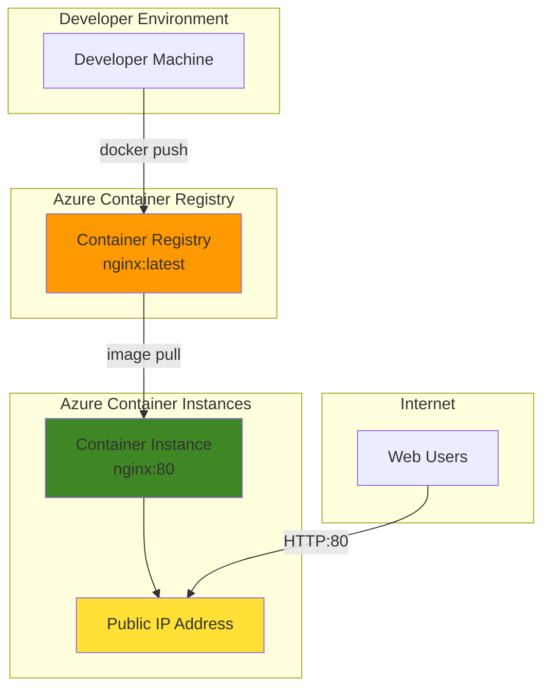

# Simple Web Container with Azure Container Instances

## Problem

Development teams need to quickly deploy and test containerized web applications without managing complex infrastructure or Kubernetes clusters. Traditional virtual machine deployments require significant setup time and ongoing maintenance, while existing container orchestration platforms add unnecessary complexity for simple web application scenarios. Teams waste valuable development time provisioning servers, configuring networking, and managing infrastructure instead of focusing on application development and testing.

## Solution

Azure Container Instances (ACI) provides serverless container hosting that eliminates infrastructure management while offering pay-per-second billing and instant deployment. Combined with Azure Container Registry (ACR), this solution enables teams to store container images securely and deploy them with a single command, providing public web access through automatically assigned IP addresses and integrated monitoring capabilities.

## Architecture Diagram



## Prerequisites

1. Azure account with active subscription and Container Instances service enabled
2. Azure CLI installed and configured (version 2.0.55 or later)
3. Docker installed locally for building container images
4. Basic understanding of containerization and web applications
5. Estimated cost: $0.50-$2.00 per hour for container instance (varies by region and resource allocation)

> **Note**: This recipe uses pay-per-second billing, so costs accrue only while the container is running. See [Container Instances pricing](https://azure.microsoft.com/pricing/details/container-instances/) for detailed information.

## Preparation

```bash
# Generate unique suffix for resource names first
RANDOM_SUFFIX=$(openssl rand -hex 3)

# Set environment variables for Azure resources
export RESOURCE_GROUP="rg-simple-web-container-${RANDOM_SUFFIX}"
export LOCATION="eastus"
export SUBSCRIPTION_ID=$(az account show --query id --output tsv)

# Set container-specific variables
export CONTAINER_REGISTRY_NAME="acrsimpleweb${RANDOM_SUFFIX}"
export CONTAINER_INSTANCE_NAME="aci-nginx-${RANDOM_SUFFIX}"
export IMAGE_NAME="simple-nginx"
export IMAGE_TAG="v1"

# Create resource group
az group create \
    --name ${RESOURCE_GROUP} \
    --location ${LOCATION} \
    --tags purpose=recipe environment=demo

echo "✅ Resource group created: ${RESOURCE_GROUP}"
```

## Steps

1. **Create Azure Container Registry**:

   Azure Container Registry provides secure, private Docker registry hosting with geo-replication capabilities and integration with Azure services. The Basic tier offers cost-effective container image storage with 10 GB included storage and supports webhook integration for automated workflows.

   ```bash
   # Create container registry with Basic tier
   az acr create \
       --resource-group ${RESOURCE_GROUP} \
       --name ${CONTAINER_REGISTRY_NAME} \
       --sku Basic \
       --admin-enabled true \
       --location ${LOCATION}
   
   # Get registry login server
   REGISTRY_LOGIN_SERVER=$(az acr show \
       --name ${CONTAINER_REGISTRY_NAME} \
       --resource-group ${RESOURCE_GROUP} \
       --query loginServer \
       --output tsv)
   
   echo "✅ Container registry created: ${REGISTRY_LOGIN_SERVER}"
   ```

   The registry is now ready to store container images with admin access enabled for simplified authentication. This configuration provides immediate access for development scenarios while maintaining security through Azure AD integration.

2. **Build and Push Container Image**:

   Creating a simple nginx-based web container demonstrates the container build and deployment workflow. This step builds a custom container image with a simple HTML page and pushes it to Azure Container Registry for deployment.

   ```bash
   # Create a simple HTML file for the web application
   mkdir -p ./nginx-app
   cat > ./nginx-app/index.html << 'EOF'
   <!DOCTYPE html>
   <html>
   <head>
       <title>Azure Container Instances Demo</title>
       <style>
           body { font-family: Arial, sans-serif; margin: 40px; background-color: #f0f8ff; }
           .container { max-width: 800px; margin: 0 auto; padding: 20px; }
           .header { background-color: #0078d4; color: white; padding: 20px; border-radius: 5px; }
           .content { background-color: white; padding: 20px; margin-top: 20px; border-radius: 5px; }
       </style>
   </head>
   <body>
       <div class="container">
           <div class="header">
               <h1>🚀 Azure Container Instances Demo</h1>
               <p>Simple web application running on serverless containers</p>
           </div>
           <div class="content">
               <h2>Deployment Information</h2>
               <p><strong>Service:</strong> Azure Container Instances</p>
               <p><strong>Registry:</strong> Azure Container Registry</p>
               <p><strong>Status:</strong> Running successfully!</p>
               <p>This containerized web application demonstrates serverless container deployment with automatic scaling and pay-per-second billing.</p>
           </div>
       </div>
   </body>
   </html>
   EOF
   
   # Create Dockerfile
   cat > ./nginx-app/Dockerfile << 'EOF'
   FROM nginx:alpine
   COPY index.html /usr/share/nginx/html/
   EXPOSE 80
   EOF
   
   echo "✅ Container files created"
   ```

   The custom HTML page and Dockerfile provide a complete web application ready for containerization. This approach demonstrates how to package static content with nginx for efficient web serving.

3. **Authenticate and Push to Registry**:

   Azure Container Registry authentication enables secure image storage and retrieval using Azure AD credentials or admin credentials. The docker login integration provides seamless container image management through familiar Docker commands.

   ```bash
   # Login to Azure Container Registry
   az acr login --name ${CONTAINER_REGISTRY_NAME}
   
   # Build and tag the container image
   docker build -t ${REGISTRY_LOGIN_SERVER}/${IMAGE_NAME}:${IMAGE_TAG} ./nginx-app/
   
   # Push image to registry
   docker push ${REGISTRY_LOGIN_SERVER}/${IMAGE_NAME}:${IMAGE_TAG}
   
   echo "✅ Container image pushed: ${REGISTRY_LOGIN_SERVER}/${IMAGE_NAME}:${IMAGE_TAG}"
   ```

   The container image is now stored securely in Azure Container Registry and available for deployment to Azure Container Instances. This centralized image storage enables consistent deployments across environments.

4. **Deploy Container to Azure Container Instances**:

   Azure Container Instances provides serverless container hosting with automatic public IP assignment and integrated monitoring. This deployment model eliminates infrastructure management while providing instant scaling and per-second billing for cost optimization.

   ```bash
   # Get registry credentials for container deployment
   REGISTRY_USERNAME=$(az acr credential show \
       --name ${CONTAINER_REGISTRY_NAME} \
       --query username \
       --output tsv)
   
   REGISTRY_PASSWORD=$(az acr credential show \
       --name ${CONTAINER_REGISTRY_NAME} \
       --query passwords[0].value \
       --output tsv)
   
   # Deploy container instance with public IP
   az container create \
       --resource-group ${RESOURCE_GROUP} \
       --name ${CONTAINER_INSTANCE_NAME} \
       --image ${REGISTRY_LOGIN_SERVER}/${IMAGE_NAME}:${IMAGE_TAG} \
       --registry-login-server ${REGISTRY_LOGIN_SERVER} \
       --registry-username ${REGISTRY_USERNAME} \
       --registry-password ${REGISTRY_PASSWORD} \
       --cpu 1 \
       --memory 1 \
       --ports 80 \
       --ip-address Public \
       --location ${LOCATION}
   
   echo "✅ Container instance deployed successfully"
   ```

   The container instance is now running with public internet access through an automatically assigned IP address. Azure handles all infrastructure provisioning, networking configuration, and container lifecycle management.

5. **Retrieve Application URL and Monitor Status**:

   Container instance monitoring provides real-time visibility into application health, resource utilization, and deployment status. Azure Container Instances integrates with Azure Monitor for comprehensive observability and troubleshooting capabilities.

   ```bash
   # Get the public IP address
   CONTAINER_IP=$(az container show \
       --resource-group ${RESOURCE_GROUP} \
       --name ${CONTAINER_INSTANCE_NAME} \
       --query ipAddress.ip \
       --output tsv)
   
   # Get container status
   CONTAINER_STATE=$(az container show \
       --resource-group ${RESOURCE_GROUP} \
       --name ${CONTAINER_INSTANCE_NAME} \
       --query containers[0].instanceView.currentState.state \
       --output tsv)
   
   echo "✅ Web application URL: http://${CONTAINER_IP}"
   echo "✅ Container status: ${CONTAINER_STATE}"
   echo "✅ Application ready for testing!"
   ```

   The web application is now accessible via the public IP address and ready for user traffic. Container status monitoring ensures reliable application delivery and enables proactive issue resolution.

## Validation & Testing

1. **Verify Container Instance Status**:

   ```bash
   # Check container instance details
   az container show \
       --resource-group ${RESOURCE_GROUP} \
       --name ${CONTAINER_INSTANCE_NAME} \
       --output table
   
   # Verify container is running
   az container show \
       --resource-group ${RESOURCE_GROUP} \
       --name ${CONTAINER_INSTANCE_NAME} \
       --query containers[0].instanceView.currentState
   ```

   Expected output: Container state should show "Running" with exit code null.

2. **Test Web Application Access**:

   ```bash
   # Test HTTP connectivity
   curl -I http://${CONTAINER_IP}
   
   # Test full response
   curl http://${CONTAINER_IP}
   ```

   Expected output: HTTP 200 OK status and HTML content from the custom page.

3. **Monitor Container Logs**:

   ```bash
   # View container logs
   az container logs \
       --resource-group ${RESOURCE_GROUP} \
       --name ${CONTAINER_INSTANCE_NAME}
   ```

   Expected output: Nginx access logs showing successful HTTP requests.

## Cleanup

1. **Stop and Remove Container Instance**:

   ```bash
   # Delete container instance
   az container delete \
       --resource-group ${RESOURCE_GROUP} \
       --name ${CONTAINER_INSTANCE_NAME} \
       --yes
   
   echo "✅ Container instance deleted"
   ```

2. **Remove Container Registry**:

   ```bash
   # Delete container registry
   az acr delete \
       --name ${CONTAINER_REGISTRY_NAME} \
       --resource-group ${RESOURCE_GROUP} \
       --yes
   
   echo "✅ Container registry deleted"
   ```

3. **Clean Up Resource Group**:

   ```bash
   # Delete resource group and all contained resources
   az group delete \
       --name ${RESOURCE_GROUP} \
       --yes \
       --no-wait
   
   echo "✅ Resource group deletion initiated: ${RESOURCE_GROUP}"
   echo "Note: Deletion may take several minutes to complete"
   
   # Clean up local files
   rm -rf ./nginx-app/
   
   echo "✅ Local files cleaned up"
   ```

## Discussion

Azure Container Instances represents a paradigm shift in container deployment, offering true serverless container hosting without the complexity of orchestration platforms. This approach eliminates infrastructure management overhead while providing enterprise-grade security, monitoring, and integration capabilities. The per-second billing model makes ACI particularly cost-effective for development, testing, and batch processing scenarios where traditional always-on infrastructure would be wasteful.

The integration between Azure Container Registry and Azure Container Instances demonstrates the power of Azure's container ecosystem. ACR provides secure, private container image storage with features like geo-replication, content trust, and vulnerability scanning, while ACI offers instant deployment capabilities with automatic scaling and integrated monitoring. This combination enables teams to implement complete container lifecycle management from development through production deployment.

Azure Container Instances excels in scenarios requiring rapid deployment, elastic scaling, and simplified operations. Unlike traditional container orchestration platforms that require cluster management and resource planning, ACI abstracts all infrastructure concerns while providing enterprise features like virtual network integration, managed identity authentication, and Azure Monitor integration. The service supports both Linux and Windows containers, confidential computing scenarios, and spot pricing for cost optimization.

For production workloads requiring high availability, load balancing, or complex networking requirements, teams should consider Azure Kubernetes Service (AKS) or Azure Container Apps. However, for simple web applications, batch processing, CI/CD build agents, and development environments, Azure Container Instances provides the optimal balance of simplicity, cost-effectiveness, and functionality.

> **Tip**: Use Azure Monitor and Log Analytics to track container performance metrics and set up alerts for proactive monitoring. Consider implementing Azure Application Gateway for load balancing and WAF protection in production scenarios.

**Documentation Sources:**
- [Azure Container Instances Overview](https://learn.microsoft.com/en-us/azure/container-instances/container-instances-overview)
- [Azure Container Registry Introduction](https://learn.microsoft.com/en-us/azure/container-registry/container-registry-intro)
- [Deploy to Azure Container Instances from Azure Container Registry](https://learn.microsoft.com/en-us/azure/container-instances/container-instances-using-azure-container-registry)
- [Azure Container Registry Authentication](https://learn.microsoft.com/en-us/azure/container-registry/container-registry-authentication)
- [Azure Container Instances Best Practices](https://learn.microsoft.com/en-us/azure/container-instances/container-instances-best-practices)

## Challenge

Extend this solution by implementing these enhancements:

1. **Add Custom Domain and SSL**: Configure Azure Application Gateway or Azure Front Door to provide custom domain names and SSL termination for production-ready deployment.

2. **Implement Health Monitoring**: Add Azure Monitor alerts and Application Insights integration to track application performance, uptime, and user behavior metrics.

3. **Deploy Multi-Container Application**: Create a container group with multiple containers (web server, database, cache) to demonstrate service composition and inter-container communication.

4. **Add Continuous Deployment**: Integrate with Azure DevOps or GitHub Actions to automatically rebuild and redeploy containers when source code changes are committed.

5. **Configure Virtual Network Integration**: Deploy containers into Azure Virtual Network for secure communication with other Azure services and on-premises resources.

## Infrastructure Code

*Infrastructure code will be generated after recipe approval.*