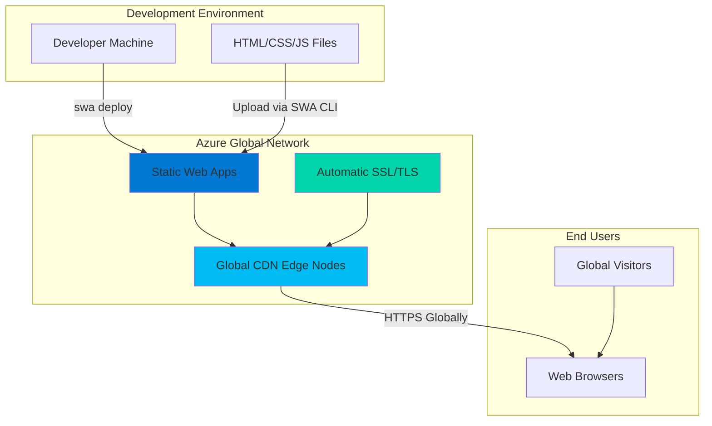

# Simple Website Hosting with Static Web Apps and CLI

## Problem

Small businesses and developers need to quickly deploy static websites with minimal configuration and zero infrastructure management. Traditional web hosting requires server setup, SSL certificate management, and complex deployment processes. Many solutions lack global content distribution, automatic HTTPS, and seamless CI/CD integration, resulting in slow load times, security vulnerabilities, and complex maintenance overhead.

## Solution

Azure Static Web Apps provides serverless hosting for static content with built-in global distribution, automatic SSL certificates, and seamless Azure CLI deployment. This approach eliminates infrastructure management while providing enterprise-grade features like custom domains, staging environments, and integrated authentication through Azure's globally distributed edge network.

## Architecture Diagram



## Prerequisites

1. Azure account with active subscription and Static Web Apps permissions
2. Azure CLI installed (version 2.29.0 or higher) or Azure Cloud Shell
3. Node.js installed (version 16 or higher) for Static Web Apps CLI
4. Basic HTML/CSS/JavaScript knowledge for creating static web content
5. Estimated cost: **Free** - Azure Static Web Apps Free tier includes 100GB bandwidth and global hosting

> **Note**: Azure Static Web Apps Free tier provides production-ready hosting with no cost for basic static websites up to 250MB per app.

## Preparation

Azure Static Web Apps offers robust serverless hosting that automatically scales globally while providing enterprise-grade security and performance. The Azure CLI and Static Web Apps CLI work together to streamline deployment with secure authentication, eliminating complex configuration files and manual processes typically required for traditional web hosting solutions.

```bash
# Set environment variables for Azure resources
export RESOURCE_GROUP="rg-staticweb-${RANDOM_SUFFIX}"
export LOCATION="eastus"
export SUBSCRIPTION_ID=$(az account show --query id --output tsv)

# Generate unique suffix for resource names
RANDOM_SUFFIX=$(openssl rand -hex 3)
export STATIC_WEB_APP_NAME="swa-demo-${RANDOM_SUFFIX}"

# Create resource group for organizing static web app resources
az group create \
    --name ${RESOURCE_GROUP} \
    --location ${LOCATION} \
    --tags purpose=recipe environment=demo

echo "✅ Resource group created: ${RESOURCE_GROUP}"

# Create project directory and sample website files
mkdir -p ~/static-website-demo
cd ~/static-website-demo

# Create a simple HTML website structure
cat > index.html << 'EOF'
<!DOCTYPE html>
<html lang="en">
<head>
    <meta charset="UTF-8">
    <meta name="viewport" content="width=device-width, initial-scale=1.0">
    <title>My Azure Static Web App</title>
    <link rel="stylesheet" href="styles.css">
</head>
<body>
    <header>
        <h1>Welcome to Azure Static Web Apps</h1>
        <nav>
            <a href="#about">About</a>
            <a href="#features">Features</a>
            <a href="#contact">Contact</a>
        </nav>
    </header>
    
    <main>
        <section id="about">
            <h2>About This Demo</h2>
            <p>This is a simple static website hosted on Azure Static Web Apps with global CDN distribution and automatic HTTPS.</p>
        </section>
        
        <section id="features">
            <h2>Key Features</h2>
            <ul>
                <li>Global content delivery network</li>
                <li>Automatic SSL certificates</li>
                <li>Custom domain support</li>
                <li>Built-in authentication</li>
                <li>Staging environments</li>
            </ul>
        </section>
        
        <section id="contact">
            <h2>Get Started</h2>
            <p>Deploy your own static website with Azure CLI in minutes!</p>
            <button onclick="showAlert()">Learn More</button>
        </section>
    </main>
    
    <footer>
        <p>&copy; 2025 Azure Static Web Apps Demo</p>
    </footer>
    
    <script src="script.js"></script>
</body>
</html>
EOF

# Create CSS file for styling
cat > styles.css << 'EOF'
* {
    margin: 0;
    padding: 0;
    box-sizing: border-box;
}

body {
    font-family: 'Segoe UI', Tahoma, Geneva, Verdana, sans-serif;
    line-height: 1.6;
    color: #333;
    background: linear-gradient(135deg, #667eea 0%, #764ba2 100%);
    min-height: 100vh;
}

header {
    background: rgba(255, 255, 255, 0.95);
    padding: 1rem 2rem;
    box-shadow: 0 2px 10px rgba(0,0,0,0.1);
    position: sticky;
    top: 0;
    z-index: 100;
}

header h1 {
    color: #0078d4;
    margin-bottom: 0.5rem;
}

nav a {
    color: #666;
    text-decoration: none;
    margin-right: 2rem;
    font-weight: 500;
    transition: color 0.3s ease;
}

nav a:hover {
    color: #0078d4;
}

main {
    max-width: 1200px;
    margin: 2rem auto;
    padding: 0 2rem;
}

section {
    background: white;
    margin: 2rem 0;
    padding: 2rem;
    border-radius: 10px;
    box-shadow: 0 4px 20px rgba(0,0,0,0.1);
    animation: fadeInUp 0.6s ease-out;
}

@keyframes fadeInUp {
    from {
        opacity: 0;
        transform: translateY(30px);
    }
    to {
        opacity: 1;
        transform: translateY(0);
    }
}

h2 {
    color: #0078d4;
    margin-bottom: 1rem;
    border-bottom: 2px solid #e1e1e1;
    padding-bottom: 0.5rem;
}

ul {
    list-style: none;
    padding-left: 0;
}

li {
    padding: 0.5rem 0;
    border-left: 3px solid #0078d4;
    padding-left: 1rem;
    margin: 0.5rem 0;
    background: #f8f9fa;
}

button {
    background: linear-gradient(45deg, #0078d4, #00bcf2);
    color: white;
    border: none;
    padding: 12px 24px;
    border-radius: 25px;
    cursor: pointer;
    font-size: 1rem;
    font-weight: 600;
    transition: transform 0.2s ease, box-shadow 0.2s ease;
}

button:hover {
    transform: translateY(-2px);
    box-shadow: 0 6px 20px rgba(0,120,212,0.3);
}

footer {
    text-align: center;
    padding: 2rem;
    color: white;
    background: rgba(0,0,0,0.2);
    margin-top: 3rem;
}

@media (max-width: 768px) {
    header {
        padding: 1rem;
    }
    
    nav a {
        display: block;
        margin: 0.5rem 0;
    }
    
    main {
        padding: 0 1rem;
    }
    
    section {
        padding: 1.5rem;
    }
}
EOF

# Create JavaScript file for interactivity
cat > script.js << 'EOF'
// Simple interactive functionality for the demo website
function showAlert() {
    alert('🚀 Ready to deploy your own Azure Static Web App? \n\nKey benefits:\n• Global CDN distribution\n• Automatic HTTPS\n• Zero server management\n• Built-in CI/CD\n• Custom domains\n• Authentication ready');
}

// Add smooth scrolling for navigation links
document.addEventListener('DOMContentLoaded', function() {
    // Smooth scrolling for anchor links
    document.querySelectorAll('a[href^="#"]').forEach(anchor => {
        anchor.addEventListener('click', function (e) {
            e.preventDefault();
            const target = document.querySelector(this.getAttribute('href'));
            if (target) {
                target.scrollIntoView({
                    behavior: 'smooth',
                    block: 'start'
                });
            }
        });
    });
    
    // Add loading animation
    document.body.style.opacity = '0';
    document.body.style.transition = 'opacity 0.5s ease-in';
    
    window.addEventListener('load', function() {
        document.body.style.opacity = '1';
    });
    
    // Console message for developers
    console.log('🌐 Azure Static Web Apps Demo\n📍 Deployed globally with Azure CDN\n🔒 Secured with automatic HTTPS\n⚡ Zero infrastructure management required');
});

// Simple performance monitoring
if ('performance' in window && 'measure' in window.performance) {
    window.addEventListener('load', function() {
        setTimeout(function() {
            const loadTime = Math.round(window.performance.timing.loadEventEnd - window.performance.timing.navigationStart);
            console.log(`⚡ Page loaded in ${loadTime}ms via Azure Global CDN`);
        }, 0);
    });
}
EOF

echo "✅ Sample website files created in ~/static-website-demo"
```

## Steps

1. **Create Azure Static Web App Resource**:

   Azure Static Web Apps provides a complete hosting solution with global CDN distribution, automatic SSL certificates, and integrated CI/CD capabilities. Creating the resource establishes the foundation for serverless website hosting with enterprise-grade performance and security features built into Azure's global infrastructure.

   ```bash
   # Create Static Web App resource with Free tier
   az staticwebapp create \
       --name ${STATIC_WEB_APP_NAME} \
       --resource-group ${RESOURCE_GROUP} \
       --location ${LOCATION} \
       --tags environment=demo purpose=recipe
   
   # Store the default hostname for later use
   STATIC_WEB_APP_URL=$(az staticwebapp show \
       --name ${STATIC_WEB_APP_NAME} \
       --resource-group ${RESOURCE_GROUP} \
       --query "defaultHostname" --output tsv)
   
   echo "✅ Static Web App created: ${STATIC_WEB_APP_NAME}"
   echo "🌐 Default URL: https://${STATIC_WEB_APP_URL}"
   ```

   The Static Web App resource is now provisioned with a globally unique URL and ready to receive content. Azure automatically configures global CDN distribution and SSL certificates, eliminating traditional web hosting complexities.

2. **Install Static Web Apps CLI**:

   The Azure Static Web Apps CLI provides local development tools and seamless deployment capabilities. Version 2.0.2 or higher is required as of January 2025 due to security enhancements. This specialized CLI tool extends beyond the standard Azure CLI to offer static site-specific features like local emulation, build optimization, and secure authentication for deployment.

   ```bash
   # Install the Azure Static Web Apps CLI globally (version 2.0.2+)
   npm install -g @azure/static-web-apps-cli@latest
   
   # Verify installation and check version
   swa --version
   
   # Ensure we have the latest version (2.0.2 or higher)
   if [[ $(swa --version | cut -d'.' -f1-2) < "2.0" ]]; then
     echo "⚠️  Please upgrade to SWA CLI 2.0.2 or higher for security"
     npm install -g @azure/static-web-apps-cli@latest
   fi
   
   echo "✅ Static Web Apps CLI installed successfully"
   ```

   The SWA CLI is now ready with the latest security enhancements to handle local development, testing, and deployment workflows specifically optimized for static web applications on Azure's platform.

3. **Configure Deployment Settings**:

   Static Web Apps uses configuration files to define routing, security, and deployment behavior. The `staticwebapp.config.json` file enables advanced features like custom routing rules, authentication settings, and API integration while maintaining simplicity for basic static hosting scenarios.

   ```bash
   # Create Static Web Apps configuration file
   cat > staticwebapp.config.json << 'EOF'
   {
     "navigationFallback": {
       "rewrite": "/index.html"
     },
     "routes": [
       {
         "route": "/",
         "serve": "/index.html",
         "statusCode": 200
       },
       {
         "route": "/*.{css,js,png,jpg,jpeg,gif,svg,ico}",
         "headers": {
           "cache-control": "public, max-age=31536000, immutable"
         }
       }
     ],
     "responseOverrides": {
       "404": {
         "rewrite": "/index.html"
       }
     },
     "globalHeaders": {
       "X-Content-Type-Options": "nosniff",
       "X-Frame-Options": "DENY",
       "X-XSS-Protection": "1; mode=block",
       "Strict-Transport-Security": "max-age=31536000; includeSubDomains"
     }
   }
   EOF
   
   echo "✅ Static Web Apps configuration created"
   ```

   The configuration file now includes performance optimization through caching headers, security headers following best practices, and proper routing for single-page application behavior.

4. **Authenticate and Deploy Website Content**:

   Azure Static Web Apps CLI deployment requires proper authentication to Azure and uploads static files directly to Azure's global CDN network. The latest CLI version (2.0.2+) includes enhanced security features for deployment authentication while maintaining seamless deployment capabilities.

   ```bash
   # Authenticate with Azure using the SWA CLI
   # This method provides secure authentication for deployment
   swa login \
       --resource-group ${RESOURCE_GROUP} \
       --app-name ${STATIC_WEB_APP_NAME}
   
   echo "✅ Authenticated with Azure Static Web Apps"
   
   # Deploy the static website using SWA CLI with production environment
   swa deploy . \
       --env production \
       --resource-group ${RESOURCE_GROUP} \
       --app-name ${STATIC_WEB_APP_NAME}
   
   echo "✅ Website deployed successfully"
   echo "🚀 Live URL: https://${STATIC_WEB_APP_URL}"
   ```

   The website is now live globally with automatic HTTPS, CDN distribution, and optimized performance. Azure handles all infrastructure concerns including SSL certificate management, global replication, and edge caching automatically.

5. **Verify Global Deployment**:

   Azure Static Web Apps distributes content across Microsoft's global CDN network, ensuring optimal performance for users worldwide. Verification confirms that the deployment succeeded and that security headers and performance optimizations are properly configured across all edge locations.

   ```bash
   # Test website accessibility and performance
   curl -I "https://${STATIC_WEB_APP_URL}" \
       --max-time 10 \
       --silent
   
   # Check SSL certificate configuration
   echo | openssl s_client \
       -servername ${STATIC_WEB_APP_URL} \
       -connect ${STATIC_WEB_APP_URL}:443 2>/dev/null \
       | openssl x509 -noout -issuer -subject -dates
   
   echo "✅ SSL certificate verification completed"
   echo "🌍 Website accessible globally via Azure CDN"
   ```

   The verification confirms proper SSL configuration, global accessibility, and security header implementation across Azure's distributed infrastructure.

## Validation & Testing

1. **Verify website accessibility and performance**:

   ```bash
   # Test HTTP response and security headers
   curl -sI "https://${STATIC_WEB_APP_URL}" | \
       grep -E "(HTTP|X-|Strict-Transport)"
   ```

   Expected output: HTTP/2 200 status with security headers including X-Content-Type-Options, X-Frame-Options, and Strict-Transport-Security.

2. **Test global CDN distribution**:

   ```bash
   # Check response time and verify CDN functionality
   echo "Testing CDN performance..."
   time curl -s "https://${STATIC_WEB_APP_URL}" > /dev/null
   
   # Verify cache headers are applied
   curl -sI "https://${STATIC_WEB_APP_URL}/styles.css" | \
       grep -i cache-control
   ```

   Expected output: Fast response times (typically <200ms) and proper cache-control headers for static assets.

3. **Validate Static Web App resource status**:

   ```bash
   # Verify deployment status and configuration
   az staticwebapp show \
       --name ${STATIC_WEB_APP_NAME} \
       --resource-group ${RESOURCE_GROUP} \
       --query "{status:state,url:defaultHostname,plan:sku.name}"
   ```

   Expected output: Status "Ready", accessible URL, and "Free" plan confirmation.

## Cleanup

1. **Remove Static Web App and associated resources**:

   ```bash
   # Delete the Static Web App resource
   az staticwebapp delete \
       --name ${STATIC_WEB_APP_NAME} \
       --resource-group ${RESOURCE_GROUP} \
       --yes
   
   echo "✅ Static Web App deleted: ${STATIC_WEB_APP_NAME}"
   ```

2. **Remove resource group and all contained resources**:

   ```bash
   # Delete resource group and all contained resources
   az group delete \
       --name ${RESOURCE_GROUP} \
       --yes \
       --no-wait
   
   echo "✅ Resource group deletion initiated: ${RESOURCE_GROUP}"
   echo "Note: Deletion may take several minutes to complete"
   ```

3. **Clean up local development files**:

   ```bash
   # Remove local project directory
   cd ~ && rm -rf ~/static-website-demo
   
   # Uninstall Static Web Apps CLI if no longer needed
   npm uninstall -g @azure/static-web-apps-cli
   
   echo "✅ Local cleanup completed"
   ```

## Discussion

Azure Static Web Apps represents a modern approach to web hosting that eliminates traditional infrastructure complexity while providing enterprise-grade capabilities. The service automatically handles SSL certificate provisioning and renewal, eliminating the manual certificate management that often creates security vulnerabilities in traditional hosting environments. The global CDN distribution ensures optimal performance for users worldwide, with content automatically cached at edge locations closest to visitors.

The Azure CLI integration combined with the Static Web Apps CLI streamlines deployment workflows by providing secure authentication and removing the need for complex CI/CD pipeline configuration during initial development phases. The recent security enhancements in SWA CLI version 2.0.2+ improve deployment security while maintaining ease of use. This approach allows developers to focus on content creation rather than infrastructure management, while still maintaining the option to integrate with GitHub Actions or Azure DevOps for automated deployment workflows as projects mature.

Security best practices are built into Azure Static Web Apps by default, including automatic HTTPS enforcement, security headers, and protection against common web vulnerabilities. The platform follows [Azure's Well-Architected Framework](https://docs.microsoft.com/en-us/azure/architecture/framework/) principles, ensuring reliability through global distribution, performance efficiency through CDN optimization, and cost optimization through the generous Free tier. The service also provides seamless scalability, automatically handling traffic spikes without manual intervention or infrastructure provisioning.

For performance optimization, Azure Static Web Apps implements automatic compression, efficient caching strategies, and image optimization through the integrated CDN. The platform supports modern web development practices including single-page applications, progressive web apps, and serverless API integration through Azure Functions when needed for dynamic functionality. For detailed guidance on static web app configuration, see the [Azure Static Web Apps documentation](https://docs.microsoft.com/en-us/azure/static-web-apps/).

> **Tip**: Monitor your Static Web App's performance and usage through Azure Monitor and consider upgrading to the Standard plan when you need features like custom authentication, private endpoints, or higher storage limits.

## Challenge

Extend this solution by implementing these enhancements:

1. **Add custom domain and SSL certificate** - Configure a custom domain name with automatic SSL certificate provisioning and DNS management through Azure DNS zones.
2. **Implement staging environments** - Set up preview environments for testing changes before production deployment using Static Web Apps' built-in staging capabilities.
3. **Integrate Azure Functions API** - Add serverless backend functionality using Azure Functions for contact forms, data processing, or user authentication.
4. **Enable authentication and authorization** - Configure built-in authentication with Microsoft Entra ID, GitHub, or custom providers for user management and access control.
5. **Set up automated deployment** - Connect GitHub repository for automatic deployment triggered by code commits using GitHub Actions integration.

## Infrastructure Code

*Infrastructure code will be generated after recipe approval.*